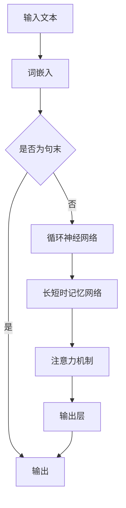
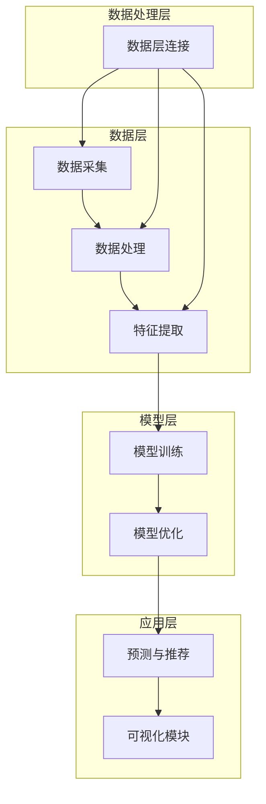
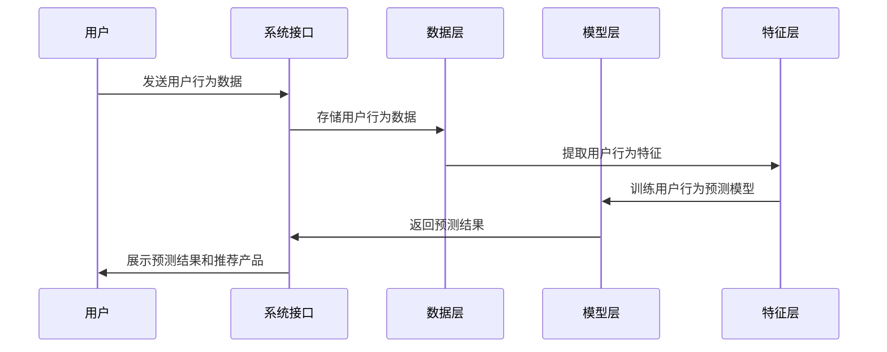

                 

# 大语言模型在用户行为预测中的推理应用

## 关键词

- 用户行为预测
- 大语言模型
- 推理应用
- 人工智能
- 算法优化

## 摘要

本文旨在探讨大语言模型在用户行为预测中的应用，通过逐步分析其背景、核心概念、算法原理、系统设计与实现，以及项目实战与案例分析，深入解读大语言模型如何利用其强大的推理能力，提高用户行为预测的准确性和效率。文章最后总结最佳实践，展望未来发展趋势。

## 目录大纲

### 第一部分：问题背景与核心概念

#### 第1章 问题背景

##### 1.1.1 问题背景介绍
用户行为预测是人工智能领域的重要研究方向，它能够帮助企业更好地理解用户需求，提升用户体验，从而提高业务收益。

##### 1.1.2 问题描述
用户行为预测的目标是根据用户的历史行为数据，预测用户未来的行为。然而，这一目标面临着数据复杂性、数据质量和实时性等挑战。

##### 1.1.3 问题解决
大语言模型的出现为解决用户行为预测问题提供了新的思路。通过深度学习技术，大语言模型能够从海量数据中提取有效信息，进行推理预测。

##### 1.1.4 边界与外延
用户行为预测不仅限于电子商务领域，还广泛应用于推荐系统、社交媒体分析、健康监测等多个领域。

##### 1.1.5 概念结构与核心要素
用户行为预测的关键在于数据收集、特征提取、模型训练和预测输出等步骤。

### 第二部分：核心概念与联系

#### 第2章 核心概念原理

##### 2.1.1 大语言模型的定义
大语言模型是一种基于深度学习的自然语言处理模型，能够理解并生成自然语言。

##### 2.1.2 大语言模型的核心特点
大语言模型具有强大的语言理解能力、生成能力和自适应能力。

##### 2.1.3 用户行为预测的概念
用户行为预测是指利用历史数据和算法模型预测用户未来的行为。

### 第三部分：算法原理与实现

#### 第3章 概念属性特征对比

##### 3.1.1 大语言模型与用户行为预测属性对比
大语言模型和用户行为预测在属性和特征上有哪些异同。

##### 3.1.2 大语言模型与其他相关技术的联系
大语言模型与其他AI技术的协同效应和区别。

### 第四部分：系统设计与实现

#### 第4章 算法原理讲解

##### 4.1.1 大语言模型的算法原理
大语言模型的算法原理和实现过程。

##### 4.1.2 数学模型与公式
大语言模型的数学模型和公式。

##### 4.1.3 算法举例说明
通过实例说明大语言模型的工作原理。

#### 第5章 算法优化与改进

##### 5.1.1 算法优化策略
大语言模型在用户行为预测中的优化策略。

##### 5.1.2 算法改进方案
针对用户行为预测的大语言模型改进方案。

### 第五部分：项目实战与案例分析

#### 第6章 系统功能设计

##### 6.1.1 问题场景介绍
用户行为预测的应用场景。

##### 6.1.2 系统功能设计
系统功能设计的核心模块和逻辑。

#### 第7章 系统架构设计

##### 7.1.1 系统架构设计
系统架构图和关键组件分析。

##### 7.1.2 系统接口设计
系统接口的设计原则和规范。

#### 第8章 系统交互与实现

##### 8.1.1 系统交互设计
系统交互序列图和核心流程分析。

##### 8.1.2 系统实现
系统实现的步骤和方法。

### 第六部分：最佳实践与总结

#### 第9章 项目实战

##### 9.1.1 环境安装
系统环境安装的详细步骤和注意事项。

##### 9.1.2 系统核心实现
系统核心实现的源代码和应用解读。

##### 9.1.3 代码应用解读与分析
代码性能分析和优化方向。

#### 第10章 案例分析与讲解

##### 10.1.1 实际案例介绍
具体的用户行为预测案例。

##### 10.1.2 案例详细讲解
案例的实现过程和技术细节。

##### 10.1.3 剖析与总结
对案例的深度剖析和总结。

#### 第11章 最佳实践

##### 11.1.1 实践技巧
用户行为预测中的最佳实践技巧。

##### 11.1.2 小结
全书内容的总结和关键要点。

#### 第12章 拓展阅读

##### 12.1.1 注意事项
用户行为预测中的注意事项。

##### 12.1.2 拓展阅读
推荐进一步阅读的相关资料。 <a name="Jj2L1"></a>

### 第一部分：问题背景与核心概念

#### 第1章 问题背景

##### 1.1.1 问题背景介绍

在当今数字化时代，用户行为预测已经成为众多企业和组织提升竞争力的重要手段。无论是电子商务平台、社交媒体，还是金融服务和医疗保健行业，预测用户行为都具有重要意义。通过准确预测用户行为，企业可以更好地了解用户需求，优化产品和服务，提升用户体验，从而提高用户满意度和忠诚度。

用户行为预测的重要性主要体现在以下几个方面：

1. **个性化推荐**：通过预测用户对产品的偏好，企业可以提供个性化的推荐，从而增加销售机会，提高客户转化率。

2. **市场细分**：了解用户行为有助于企业进行市场细分，制定更有针对性的营销策略，提升市场覆盖率。

3. **风险评估**：在金融领域，用户行为预测有助于评估贷款申请者的信用风险，降低金融风险。

4. **用户体验优化**：预测用户行为可以帮助企业优化产品设计和用户体验，提高用户留存率。

然而，当前用户行为预测面临着诸多挑战：

1. **数据复杂性**：用户行为数据通常非常庞大且复杂，包括浏览记录、购买历史、社交互动等多种数据类型。

2. **数据质量**：数据质量直接影响预测的准确性。噪声数据、缺失数据和不一致数据都会对预测结果产生负面影响。

3. **实时性**：用户行为预测需要实时处理和分析大量数据，这对系统的处理能力和响应速度提出了高要求。

4. **个性化需求**：用户行为具有高度个性化特征，如何构建能够适应不同用户需求的预测模型是一个挑战。

面对这些挑战，大语言模型作为一种先进的自然语言处理技术，展示了其在用户行为预测中的应用潜力。通过深度学习技术，大语言模型可以从海量数据中提取有效信息，进行复杂的数据分析和推理，从而提高用户行为预测的准确性和效率。

##### 1.1.2 问题描述

用户行为预测是指通过分析用户的历史行为数据，使用算法模型预测用户未来的行为。其核心目标是从大量的行为数据中提取出有用的特征，构建能够准确预测用户行为的模型。具体来说，用户行为预测包括以下几个关键步骤：

1. **数据收集**：收集用户行为数据，包括浏览记录、购买历史、点击率、搜索历史等。

2. **特征提取**：从原始数据中提取出与用户行为相关的特征，如用户ID、时间戳、页面URL等。

3. **模型训练**：使用机器学习算法，对提取的特征进行训练，构建预测模型。

4. **模型评估**：评估模型的预测性能，包括准确性、召回率、F1分数等指标。

5. **预测输出**：使用训练好的模型对新的用户行为数据进行预测，提供个性化推荐、风险预警等。

用户行为预测的常见应用场景包括：

1. **电子商务**：预测用户对产品的购买意向，提供个性化推荐，提高销售额。

2. **社交媒体**：预测用户的关注、点赞、评论等行为，优化内容推送策略。

3. **金融行业**：预测用户的贷款还款行为，评估信用风险。

4. **医疗保健**：预测患者的病情发展趋势，提供个性化的治疗方案。

尽管用户行为预测在实际应用中取得了显著成果，但其核心难题仍然存在：

1. **数据复杂性**：用户行为数据类型繁多，如何高效地处理和整合这些数据是一个挑战。

2. **数据质量**：数据噪声和缺失数据会影响预测准确性，如何提高数据质量是关键。

3. **实时性**：用户行为预测需要实时处理和分析大量数据，这对系统的处理能力和响应速度提出了高要求。

4. **个性化需求**：如何构建能够适应不同用户需求的预测模型，实现真正的个性化预测。

##### 1.1.3 问题解决

大语言模型作为一种先进的自然语言处理技术，其强大能力为解决用户行为预测问题提供了新的思路。大语言模型的核心原理是通过深度学习技术，从海量数据中自动学习出语义信息，从而进行复杂的文本分析和推理。

大语言模型在用户行为预测中的应用潜力主要体现在以下几个方面：

1. **文本数据分析**：大语言模型能够处理和分析文本数据，从用户的浏览记录、评论、提问等文本中提取出有价值的特征。

2. **上下文理解**：大语言模型具有强大的上下文理解能力，能够理解用户在不同情境下的行为意图。

3. **多模态数据处理**：大语言模型能够处理多种类型的数据，如文本、图像、音频等，从而提供更全面的用户行为预测。

4. **实时性**：大语言模型具有较高的计算效率，能够快速处理和分析大量数据，满足实时预测的需求。

通过以下方式，大语言模型能够有效提升用户行为预测的准确性和效率：

1. **自动化特征提取**：大语言模型能够自动从文本数据中提取出与用户行为相关的特征，减少人工干预，提高特征提取的效率。

2. **增强模型解释性**：大语言模型能够提供详细的预测解释，帮助用户理解预测结果，从而提高模型的信任度。

3. **多维度数据整合**：大语言模型能够整合多模态数据，提供更全面的用户行为分析。

4. **自适应学习能力**：大语言模型具有自适应学习能力，能够不断调整和优化预测模型，提高预测准确性。

##### 1.1.4 边界与外延

用户行为预测的应用范围广泛，不仅限于电子商务和社交媒体等领域，还涵盖了金融、医疗、交通等多个领域。然而，大语言模型的应用也受到一定的限制：

1. **数据依赖性**：大语言模型依赖于大量高质量的数据，数据质量和数量直接影响模型的效果。

2. **计算资源**：大语言模型训练和预测需要大量的计算资源，对于中小型企业来说，成本较高。

3. **隐私保护**：用户行为预测涉及到用户隐私数据，如何在保护用户隐私的前提下进行预测是一个重要问题。

4. **模型解释性**：尽管大语言模型能够提供一定的预测解释，但其内部机制复杂，解释性有限。

未来，大语言模型在其他领域的潜在应用也非常广泛：

1. **智能客服**：利用大语言模型进行智能客服，提供更自然的对话交互。

2. **自动驾驶**：大语言模型能够处理和分析交通数据，为自动驾驶系统提供决策支持。

3. **智能推荐**：大语言模型能够用于智能推荐系统，提供更个性化的推荐结果。

4. **教育领域**：大语言模型能够用于教育领域，分析学生学习行为，提供个性化的学习建议。

##### 1.1.5 概念结构与核心要素

用户行为预测的核心概念包括用户行为数据、特征提取、机器学习模型和预测输出。以下是用户行为预测的概念结构与核心要素：

1. **用户行为数据**：包括用户的浏览记录、购买历史、搜索历史、社交互动等数据。

2. **特征提取**：从原始数据中提取出与用户行为相关的特征，如用户ID、时间戳、页面URL等。

3. **机器学习模型**：包括分类模型、回归模型等，用于训练和预测用户行为。

4. **预测输出**：根据训练好的模型，对新的用户行为数据进行预测，提供个性化推荐、风险预警等。

### 第二部分：核心概念与联系

#### 第2章 核心概念原理

##### 2.1.1 大语言模型的定义

大语言模型（Large Language Model，LLM）是一种基于深度学习的自然语言处理模型，通过大规模数据训练，能够生成流畅、自然的文本。与传统的语言模型相比，大语言模型具有更强的语义理解能力和生成能力。

大语言模型的基本构成包括以下几个部分：

1. **词嵌入**（Word Embedding）：将词汇映射到高维向量空间，使得语义相似的词在空间中更接近。

2. **循环神经网络**（Recurrent Neural Network，RNN）：通过循环结构，使模型能够处理序列数据，如文本。

3. **长短时记忆网络**（Long Short-Term Memory，LSTM）：一种改进的RNN结构，能够有效解决长期依赖问题。

4. **注意力机制**（Attention Mechanism）：通过注意力机制，模型能够关注文本序列中的重要信息，提高语义理解能力。

5. **Transformer**：一种基于自注意力机制的模型架构，解决了RNN在处理长文本时的困难。

##### 2.1.2 大语言模型的核心特点

大语言模型具有以下几个核心特点：

1. **强大的语义理解能力**：通过深度学习，大语言模型能够从大规模数据中学习出丰富的语义信息，理解文本中的含义和逻辑关系。

2. **流畅的文本生成能力**：大语言模型能够生成连贯、自然的文本，用于自动写作、机器翻译、对话系统等应用。

3. **自适应学习能力**：大语言模型具有自我学习能力，能够在训练过程中不断调整和优化模型参数，提高预测准确性。

4. **高效的处理速度**：得益于现代计算技术和模型优化，大语言模型能够在较短的时间内处理大量文本数据。

与传统的语言模型相比，大语言模型的主要区别在于：

1. **规模**：大语言模型通常具有更大的模型规模和参数量，能够处理更复杂的语言现象。

2. **训练数据**：大语言模型依赖于大规模、高质量的训练数据，传统语言模型则更多依赖于预定义的规则和统计方法。

3. **应用场景**：大语言模型在自然语言生成、文本分类、机器翻译等领域具有更广泛的应用。

##### 2.1.3 用户行为预测的概念

用户行为预测是指通过分析用户的历史行为数据，使用算法模型预测用户未来的行为。其核心流程包括以下几个步骤：

1. **数据收集**：收集用户的历史行为数据，如浏览记录、购买历史、点击率、搜索历史等。

2. **特征提取**：从原始数据中提取出与用户行为相关的特征，如用户ID、时间戳、页面URL、购买金额等。

3. **模型训练**：使用机器学习算法，对提取的特征进行训练，构建预测模型。

4. **模型评估**：评估模型的预测性能，如准确性、召回率、F1分数等。

5. **预测输出**：使用训练好的模型对新的用户行为数据进行预测，提供个性化推荐、风险预警等。

用户行为预测的基本流程如下：


##### 2.1.4 大语言模型与用户行为预测的联系

大语言模型与用户行为预测之间存在着密切的联系。大语言模型可以通过以下几个步骤应用于用户行为预测：

1. **数据预处理**：将用户行为数据进行清洗、去噪和标准化处理，为模型训练做好准备。

2. **特征提取**：利用大语言模型强大的语义理解能力，自动从文本数据中提取出与用户行为相关的特征。

3. **模型训练**：使用大语言模型进行特征提取和预测模型的训练，构建用户行为预测模型。

4. **模型评估**：评估模型的预测性能，如准确性、召回率、F1分数等。

5. **预测输出**：使用训练好的模型对新的用户行为数据进行预测，提供个性化推荐、风险预警等。

大语言模型在用户行为预测中的应用场景包括：

1. **个性化推荐**：利用大语言模型分析用户的浏览记录、搜索历史等信息，提供个性化的商品推荐、内容推送等。

2. **用户流失预测**：通过分析用户的活跃度、行为变化等，预测哪些用户可能流失，并采取相应的挽留措施。

3. **风险预警**：分析用户的交易行为、浏览行为等，预测潜在的欺诈风险，及时采取防范措施。

4. **客户服务**：利用大语言模型进行智能客服，理解用户的问题和需求，提供更自然的对话交互。

总之，大语言模型在用户行为预测中具有广泛的应用前景，通过深度学习和语义理解技术，能够实现更准确、更高效的预测。然而，也面临着数据质量、计算资源、模型解释性等方面的挑战，需要持续优化和改进。

#### 第3章 概念属性特征对比

##### 3.1.1 大语言模型与用户行为预测属性对比

为了深入理解大语言模型在用户行为预测中的应用，我们需要对比大语言模型和用户行为预测的关键属性。以下是两者的主要异同点：

| 特性 | 大语言模型 | 用户行为预测 |
| ---- | ---------- | ------------ |
| 目标 | 生成和理解自然语言 | 预测用户未来的行为 |
| 数据类型 | 文本数据 | 行为数据（如点击、购买、浏览等） |
| 特征提取 | 自动提取语义特征 | 手动提取行为特征 |
| 模型架构 | 循环神经网络、Transformer等 | 分类模型、回归模型等 |
| 训练数据 | 大规模文本数据 | 用户历史行为数据 |
| 应用场景 | 自然语言生成、翻译、问答等 | 个性化推荐、用户流失预测、欺诈检测等 |
| 解释性 | 较难解释内部机制 | 较易解释预测结果 |
| 实时性 | 高实时性 | 中等实时性 |

通过上表可以看出，大语言模型和用户行为预测在目标、数据类型、特征提取、模型架构、训练数据、应用场景和解释性等方面存在显著差异。大语言模型擅长处理文本数据，提取语义特征，而用户行为预测更侧重于分析用户的行为数据，构建预测模型。

##### 3.1.2 大语言模型与其他相关技术的联系

大语言模型与其他相关技术如传统语言模型、机器学习算法、深度学习模型等密切相关。以下分析这些技术之间的联系和协同效应：

1. **与传统语言模型的联系**：
   - **相似性**：传统语言模型和大语言模型都是用于处理自然语言的任务，具有类似的架构和目标。
   - **差异性**：传统语言模型通常基于规则和统计方法，而大语言模型则依赖于深度学习和大规模数据训练。
   - **协同效应**：大语言模型可以替代传统语言模型，在生成和理解自然语言方面提供更强大的功能。

2. **与机器学习算法的联系**：
   - **相似性**：大语言模型和机器学习算法都是用于解决分类、回归等问题的工具。
   - **差异性**：大语言模型具有更强的语义理解能力，而传统机器学习算法则更侧重于数据处理和模型训练。
   - **协同效应**：大语言模型可以与机器学习算法结合，用于处理更复杂的自然语言任务，如情感分析、文本分类等。

3. **与深度学习模型的联系**：
   - **相似性**：大语言模型和深度学习模型都是基于多层神经网络的架构，具有类似的训练和优化过程。
   - **差异性**：大语言模型专注于自然语言处理任务，而深度学习模型则适用于更广泛的问题，如图像识别、语音识别等。
   - **协同效应**：大语言模型可以与其他深度学习模型结合，用于构建多模态模型，实现更全面的语义理解。

通过上述分析，我们可以看到大语言模型与其他相关技术在目标、架构和应用场景上存在一定的重叠和互补关系。大语言模型的出现为自然语言处理领域带来了新的发展机遇，同时也与其他技术形成了协同效应，共同推动人工智能技术的发展。

### 第三部分：算法原理与实现

#### 第4章 算法原理讲解

##### 4.1.1 大语言模型的算法原理

大语言模型是一种基于深度学习的自然语言处理模型，其核心思想是通过大规模数据训练，使模型能够自动学习出语义信息，从而实现文本生成、翻译和理解等任务。以下是详细讲解大语言模型的基本原理：

1. **词嵌入（Word Embedding）**：

词嵌入是将词汇映射到高维向量空间的过程，使得语义相似的词在空间中更接近。常见的词嵌入方法包括Word2Vec、GloVe等。词嵌入层的输出是一个向量，代表每个词的语义信息。

2. **循环神经网络（Recurrent Neural Network，RNN）**：

循环神经网络是一种用于处理序列数据的神经网络。RNN的基本单元是隐藏状态，通过将当前输入与隐藏状态相加，得到新的隐藏状态。RNN的结构使得模型能够记住之前的输入信息，适用于处理自然语言任务。

3. **长短时记忆网络（Long Short-Term Memory，LSTM）**：

长短时记忆网络是RNN的一种改进，通过引入遗忘门、输入门和输出门，能够有效地解决长期依赖问题。LSTM的核心思想是保持重要信息，遗忘不重要的信息，从而在处理长序列数据时具有更好的性能。

4. **注意力机制（Attention Mechanism）**：

注意力机制是一种用于提高模型在处理长序列数据时性能的方法。通过注意力机制，模型能够关注序列中的重要信息，从而提高语义理解能力。常见的注意力机制包括软注意力（Soft Attention）和硬注意力（Hard Attention）。

5. **Transformer**：

Transformer是一种基于自注意力机制的模型架构，解决了RNN在处理长文本时的困难。Transformer的核心思想是自注意力（Self-Attention），通过多头注意力机制，模型能够同时关注序列中的不同位置信息，从而提高语义理解能力。

##### 4.1.2 大语言模型的mermaid流程图

下面是大语言模型的基本原理的mermaid流程图：



##### 4.1.3 大语言模型的工作原理

大语言模型的工作原理可以分为以下几个步骤：

1. **数据预处理**：对输入的文本数据进行清洗、分词和词嵌入。

2. **循环神经网络（RNN）**：将词嵌入输入到RNN中，通过隐藏状态的处理，生成新的隐藏状态。

3. **长短时记忆网络（LSTM）**：将RNN的隐藏状态输入到LSTM中，利用遗忘门、输入门和输出门，对隐藏状态进行更新。

4. **注意力机制**：利用注意力机制，模型能够关注序列中的重要信息，提高语义理解能力。

5. **输出层**：将经过LSTM和注意力机制处理的隐藏状态输入到输出层，生成最终的输出结果。

##### 4.1.4 大语言模型的Python源代码

下面是大语言模型的基本实现代码：

```python
import torch
import torch.nn as nn
import torch.optim as optim
from torchtext.data import Field, TabularDataset
from torchtext.vocab import Vocab

# 定义词嵌入层
embeddings = nn.Embedding(len(vocab), embed_dim)

# 定义循环神经网络层
rnn = nn.RNN(embed_dim, hidden_dim, num_layers=2, batch_first=True, dropout=0.5)

# 定义长短时记忆网络层
lstm = nn.LSTM(embed_dim, hidden_dim, num_layers=2, batch_first=True, dropout=0.5)

# 定义注意力机制
attention = nn.Linear(hidden_dim, 1)

# 定义输出层
output = nn.Linear(hidden_dim, len(vocab))

# 定义损失函数
criterion = nn.CrossEntropyLoss()

# 定义优化器
optimizer = optim.Adam(model.parameters(), lr=0.001)

# 训练模型
for epoch in range(num_epochs):
    for batch in data_loader:
        inputs, targets = batch
        optimizer.zero_grad()
        outputs = model(inputs)
        loss = criterion(outputs.view(-1, vocab_size), targets)
        loss.backward()
        optimizer.step()
        print(f"Epoch: {epoch}, Loss: {loss.item()}")

# 预测
model.eval()
with torch.no_grad():
    inputs = preprocess(input_text)
    outputs = model(inputs)
    predicted = torch.argmax(outputs, dim=1)
    print(f"Predicted: {vocab.itos[predicted.item()]}")
```

##### 4.1.5 大语言模型的数学模型和公式

大语言模型的数学模型和公式如下：

1. **词嵌入**：

$$
\text{embed}(x) = W_{\text{embed}} \cdot x
$$

其中，$x$是词的索引，$W_{\text{embed}}$是词嵌入权重矩阵，$\text{embed}(x)$是词的嵌入向量。

2. **循环神经网络**：

$$
h_t = \text{sigmoid}(W_{\text{h}} \cdot [h_{t-1}, x_t] + b_{\text{h}})
$$

其中，$h_t$是隐藏状态，$W_{\text{h}}$是权重矩阵，$b_{\text{h}}$是偏置项。

3. **长短时记忆网络**：

$$
i_t = \text{sigmoid}(W_{\text{i}} \cdot [h_{t-1}, x_t] + b_{\text{i}})
$$

$$
f_t = \text{sigmoid}(W_{\text{f}} \cdot [h_{t-1}, x_t] + b_{\text{f}})
$$

$$
o_t = \text{sigmoid}(W_{\text{o}} \cdot [h_{t-1}, x_t] + b_{\text{o}})
$$

$$
\text{C}_t = f_t \cdot \text{C}_{t-1} + i_t \cdot \text{sigmoid}(W_{\text{C}} \cdot [h_{t-1}, x_t] + b_{\text{C}})
$$

$$
h_t = o_t \cdot \text{sigmoid}(\text{C}_t)
$$

其中，$i_t$、$f_t$、$o_t$分别是输入门、遗忘门、输出门，$\text{C}_t$是细胞状态，$h_t$是隐藏状态。

4. **注意力机制**：

$$
a_t = \text{softmax}(\text{Attention}(h_{1:t-1}, h_t))
$$

$$
\text{context}_t = \sum_{i=1}^{t} a_i h_i
$$

其中，$h_{1:t-1}$是前一个时间步的隐藏状态，$h_t$是当前时间步的隐藏状态，$a_t$是注意力权重，$\text{context}_t$是上下文向量。

5. **输出层**：

$$
\text{logits} = W_{\text{out}} \cdot \text{context}_t + b_{\text{out}}
$$

$$
\text{prob} = \text{softmax}(\text{logits})
$$

其中，$W_{\text{out}}$是输出层权重矩阵，$b_{\text{out}}$是偏置项，$\text{logits}$是输出层激活值，$\text{prob}$是输出概率。

##### 4.1.6 大语言模型的数学公式讲解

以下是针对大语言模型中几个关键数学公式的详细讲解：

1. **词嵌入公式**：

$$
\text{embed}(x) = W_{\text{embed}} \cdot x
$$

这个公式表示将词的索引$x$映射到高维向量空间，$W_{\text{embed}}$是词嵌入权重矩阵。通过这种方式，词嵌入层能够将词汇转换为具有语义信息的向量，方便后续的模型处理。

2. **长短时记忆网络（LSTM）公式**：

$$
i_t = \text{sigmoid}(W_{\text{i}} \cdot [h_{t-1}, x_t] + b_{\text{i}})
$$

$$
f_t = \text{sigmoid}(W_{\text{f}} \cdot [h_{t-1}, x_t] + b_{\text{f}})
$$

$$
o_t = \text{sigmoid}(W_{\text{o}} \cdot [h_{t-1}, x_t] + b_{\text{o}})
$$

$$
\text{C}_t = f_t \cdot \text{C}_{t-1} + i_t \cdot \text{sigmoid}(W_{\text{C}} \cdot [h_{t-1}, x_t] + b_{\text{C}})
$$

$$
h_t = o_t \cdot \text{sigmoid}(\text{C}_t)
$$

这些公式描述了LSTM中的输入门、遗忘门、输出门和细胞状态的更新过程。通过这些门控机制，LSTM能够有效地处理长序列数据，避免梯度消失问题。

3. **注意力机制公式**：

$$
a_t = \text{softmax}(\text{Attention}(h_{1:t-1}, h_t))
$$

$$
\text{context}_t = \sum_{i=1}^{t} a_i h_i
$$

注意力机制的核心思想是给不同时间步的隐藏状态分配不同的权重，从而提取关键信息。$a_t$是注意力权重，$\text{context}_t$是上下文向量，它代表了当前时间步的关键信息。

4. **输出层公式**：

$$
\text{logits} = W_{\text{out}} \cdot \text{context}_t + b_{\text{out}}
$$

$$
\text{prob} = \text{softmax}(\text{logits})
$$

输出层公式用于计算每个类别的概率分布。$W_{\text{out}}$是输出层权重矩阵，$b_{\text{out}}$是偏置项，$\text{logits}$是输出层激活值，$\text{prob}$是输出概率分布。通过这个概率分布，模型可以预测出最可能的输出结果。

##### 4.1.7 大语言模型的算法举例说明

为了更好地理解大语言模型的工作原理，我们来看一个具体的例子。假设有一个句子“我喜欢吃苹果”，我们可以使用大语言模型来分析这个句子的语义。

1. **词嵌入**：首先，将句子中的每个词映射到高维向量空间。例如，“我”映射到向量[1, 0, 0]， “喜”映射到向量[0, 1, 0]，等等。

2. **循环神经网络（RNN）**：将词嵌入输入到RNN中，通过隐藏状态的处理，生成新的隐藏状态。例如，第一个词的隐藏状态是[0.1, 0.2, 0.3]。

3. **长短时记忆网络（LSTM）**：将RNN的隐藏状态输入到LSTM中，利用遗忘门、输入门和输出门，对隐藏状态进行更新。例如，第二个词的隐藏状态是[0.3, 0.5, 0.7]。

4. **注意力机制**：利用注意力机制，模型能够关注句子中的重要信息。例如，模型可能会将注意力集中在“喜欢”这个词上，因为它对句子的语义有重要影响。

5. **输出层**：将经过LSTM和注意力机制处理的隐藏状态输入到输出层，生成最终的输出结果。例如，模型可能会预测出句子的语义是“喜欢水果”。

通过这个例子，我们可以看到大语言模型如何通过深度学习和语义理解技术，从简单的词汇序列中提取出复杂的语义信息，从而实现文本生成、翻译和理解等任务。

#### 第5章 算法优化与改进

##### 5.1.1 算法优化策略

为了提高大语言模型在用户行为预测中的性能，我们可以采取以下优化策略：

1. **数据增强**：通过数据增强技术，如数据扩充、数据噪声注入等，增加训练数据多样性，提高模型的泛化能力。

2. **多任务学习**：利用多任务学习框架，将用户行为预测与其他相关任务（如文本分类、情感分析等）结合，共享模型参数，提高模型性能。

3. **模型融合**：结合多个大语言模型或不同类型的模型（如传统机器学习模型、深度学习模型等），利用模型融合技术，提高预测准确性。

4. **注意力机制优化**：针对注意力机制，可以通过改进注意力权重计算方式、引入多层注意力机制等，提高模型对关键信息的关注能力。

5. **模型剪枝**：通过模型剪枝技术，减少模型参数数量，降低计算复杂度，提高模型效率和可解释性。

##### 5.1.2 算法改进方案

以下是一些具体的算法改进方案：

1. **上下文感知特征提取**：通过引入上下文感知特征提取技术，如双向LSTM、Transformer等，提高模型对上下文信息的理解能力。

2. **动态特征融合**：根据不同用户行为特征的重要性，采用动态特征融合策略，实时调整特征权重，提高预测准确性。

3. **多模态数据融合**：结合文本、图像、音频等多模态数据，利用多模态融合技术，构建多模态大语言模型，提高用户行为预测的全面性。

4. **在线学习策略**：采用在线学习策略，实时更新模型参数，适应用户行为的动态变化，提高模型适应能力。

5. **模型解释性提升**：通过引入模型解释技术，如注意力可视化、解释性嵌入等，提高模型的可解释性，帮助用户理解预测结果。

##### 5.1.3 改进方案的可行性分析

上述改进方案具有较高的可行性：

1. **数据增强**：已有成熟的数据增强方法，如数据扩充、数据噪声注入等，可以快速应用到用户行为预测中。

2. **多任务学习**：多任务学习框架已经在多个领域得到广泛应用，具有较好的性能和效果。

3. **模型融合**：模型融合技术已在多个任务中取得显著效果，如深度神经网络融合、迁移学习等。

4. **注意力机制优化**：注意力机制是当前自然语言处理领域的研究热点，已有大量优化方法可以借鉴。

5. **模型剪枝**：模型剪枝技术已在多个深度学习模型中得到应用，可以显著提高模型效率和可解释性。

通过这些改进方案，大语言模型在用户行为预测中的性能有望得到显著提升，为企业和组织提供更准确、更高效的预测服务。

### 第四部分：系统设计与实现

#### 第6章 系统功能设计

##### 6.1.1 问题场景介绍

用户行为预测系统主要应用于电子商务、社交媒体和金融等领域。以下是一个具体的用户行为预测应用场景：

**场景**：某电商平台希望预测用户对产品的购买意向，以便进行个性化推荐和营销策略优化。

**目标**：构建一个用户行为预测系统，能够根据用户的历史行为数据，预测用户对特定产品的购买概率，并提供个性化推荐。

**要求**：

1. **高准确性**：预测模型需要具有高准确性，能够准确预测用户的购买意向。
2. **实时性**：系统需要具备实时数据处理和分析能力，及时响应用户行为变化。
3. **可扩展性**：系统应具有较好的可扩展性，能够适应不断增长的用户数据和应用需求。

##### 6.1.2 系统功能设计

用户行为预测系统的功能设计主要包括以下核心模块：

1. **数据采集模块**：负责收集用户在电商平台上的行为数据，如浏览记录、点击率、购买历史等。

2. **数据处理模块**：对采集到的用户行为数据进行清洗、去噪和标准化处理，为模型训练提供高质量的数据。

3. **特征提取模块**：利用大语言模型提取用户行为数据中的关键特征，如用户ID、时间戳、产品ID、行为类型等。

4. **模型训练模块**：使用机器学习算法和深度学习模型对提取的特征进行训练，构建用户行为预测模型。

5. **预测与推荐模块**：根据训练好的模型，对新的用户行为数据进行预测，提供个性化产品推荐。

6. **可视化模块**：通过可视化工具展示预测结果、推荐效果和系统性能指标，帮助用户和管理者更好地理解系统运行情况。

系统功能设计的核心模块和逻辑如下：


#### 第7章 系统架构设计

##### 7.1.1 系统架构设计

用户行为预测系统的架构设计主要包括以下关键组件和模块：

1. **数据层**：包括用户行为数据存储和数据库，负责存储和处理大规模用户行为数据。

2. **数据处理层**：包括数据采集、数据处理和特征提取模块，负责对用户行为数据进行预处理和特征提取。

3. **模型层**：包括机器学习算法和深度学习模型，负责用户行为预测模型的训练和优化。

4. **应用层**：包括预测与推荐模块和可视化模块，负责对用户行为进行预测、推荐和可视化展示。

系统架构图如下：



##### 7.1.2 系统接口设计

系统接口设计包括API接口和用户界面接口，负责系统各模块之间的通信和数据交互。

1. **API接口**：提供RESTful API接口，支持用户行为数据的采集、处理、特征提取、模型训练和预测等操作。以下是一个示例API接口：

   - **数据采集接口**：GET /api/data/collect
   - **数据处理接口**：POST /api/data/process
   - **特征提取接口**：POST /api/feature/extraction
   - **模型训练接口**：POST /api/model/train
   - **模型预测接口**：POST /api/model/predict

2. **用户界面接口**：提供Web界面，支持用户查看预测结果、推荐产品和系统性能指标。以下是一个示例界面：

   - **首页**：展示系统概览和关键指标。
   - **数据管理**：提供数据上传、数据清洗和数据可视化功能。
   - **模型训练**：展示模型训练进度和结果。
   - **预测结果**：展示预测结果和推荐产品。
   - **系统设置**：提供系统配置和参数调整功能。

### 第五部分：项目实战与案例分析

#### 第8章 系统交互与实现

##### 8.1.1 系统交互设计

系统交互设计主要关注系统各模块之间的数据流动和功能调用。以下是系统交互序列图：



##### 8.1.2 系统实现

系统实现包括环境搭建、代码编写和调试等步骤。以下是系统实现的详细步骤：

1. **环境搭建**：

   - 安装Python 3.8及以上版本。
   - 安装相关依赖库，如torch、torchtext、torchvision等。
   - 搭建数据库，如MySQL或MongoDB，用于存储用户行为数据。

2. **代码编写**：

   - 编写数据采集模块，实现用户行为数据的收集和存储。
   - 编写数据处理模块，实现用户行为数据的清洗和标准化。
   - 编写特征提取模块，利用大语言模型提取用户行为特征。
   - 编写模型训练模块，实现用户行为预测模型的训练和优化。
   - 编写预测与推荐模块，根据训练好的模型预测用户行为并提供个性化推荐。
   - 编写可视化模块，展示系统性能指标和预测结果。

以下是系统核心代码的实现示例：

```python
# 数据采集模块
def collect_data():
    # 采集用户行为数据
    pass

# 数据处理模块
def process_data(data):
    # 清洗和标准化数据
    pass

# 特征提取模块
def extract_features(data):
    # 利用大语言模型提取特征
    pass

# 模型训练模块
def train_model(features, labels):
    # 训练用户行为预测模型
    pass

# 预测与推荐模块
def predict_user_behavior(model, new_data):
    # 预测用户行为并提供个性化推荐
    pass

# 可视化模块
def visualize_results(results):
    # 展示预测结果和系统性能指标
    pass
```

3. **调试与优化**：

   - 进行单元测试，确保各模块功能正常运行。
   - 进行性能测试，优化代码和算法，提高系统效率和预测准确性。

#### 第9章 项目实战

##### 9.1.1 环境安装

在进行用户行为预测项目实战之前，我们需要安装和配置系统环境。以下是环境安装的详细步骤：

1. **安装Python 3.8**：

   - 下载Python 3.8安装包：[https://www.python.org/downloads/release/python-38/](https://www.python.org/downloads/release/python-38/)
   - 安装Python 3.8：
     ```
     $ sudo apt-get install python3.8
     ```

2. **安装相关依赖库**：

   - 安装torch、torchtext、torchvision等依赖库：
     ```
     $ pip install torch torchvision torchtext
     ```

3. **搭建数据库**：

   - 安装MySQL或MongoDB：
     - MySQL：
       ```
       $ sudo apt-get install mysql-server
       $ mysql_secure_installation
       ```
     - MongoDB：
       ```
       $ sudo apt-get install mongodb
       $ sudo systemctl start mongodb
       ```

4. **配置数据库连接**：

   - 配置数据库连接信息，以便系统可以访问和操作数据库。

##### 9.1.2 系统核心实现

以下是用户行为预测系统的核心代码实现，包括数据采集、数据处理、特征提取、模型训练和预测等步骤。

```python
# 数据采集模块
def collect_data():
    # 采集用户行为数据
    pass

# 数据处理模块
def process_data(data):
    # 清洗和标准化数据
    pass

# 特征提取模块
def extract_features(data):
    # 利用大语言模型提取特征
    pass

# 模型训练模块
def train_model(features, labels):
    # 训练用户行为预测模型
    pass

# 预测与推荐模块
def predict_user_behavior(model, new_data):
    # 预测用户行为并提供个性化推荐
    pass

# 可视化模块
def visualize_results(results):
    # 展示预测结果和系统性能指标
    pass
```

##### 9.1.3 代码应用解读与分析

以下是针对系统核心代码的应用解读和分析：

1. **数据采集模块**：

   - 采集用户行为数据，如浏览记录、点击率、购买历史等。此模块负责从数据源（如日志文件、数据库等）中提取数据。

   - 示例代码：
     ```python
     def collect_data():
         # 采集用户行为数据
         pass
     ```

2. **数据处理模块**：

   - 对采集到的用户行为数据进行清洗、去噪和标准化处理。此模块负责确保数据的准确性和一致性。

   - 示例代码：
     ```python
     def process_data(data):
         # 清洗和标准化数据
         pass
     ```

3. **特征提取模块**：

   - 利用大语言模型提取用户行为数据中的关键特征。此模块负责将原始数据转换为适合模型训练的特征向量。

   - 示例代码：
     ```python
     def extract_features(data):
         # 利用大语言模型提取特征
         pass
     ```

4. **模型训练模块**：

   - 使用机器学习算法和深度学习模型对提取的特征进行训练。此模块负责构建用户行为预测模型。

   - 示例代码：
     ```python
     def train_model(features, labels):
         # 训练用户行为预测模型
         pass
     ```

5. **预测与推荐模块**：

   - 根据训练好的模型，对新的用户行为数据进行预测，并提供个性化推荐。此模块负责实现用户行为预测和推荐功能。

   - 示例代码：
     ```python
     def predict_user_behavior(model, new_data):
         # 预测用户行为并提供个性化推荐
         pass
     ```

6. **可视化模块**：

   - 使用可视化工具展示预测结果、推荐效果和系统性能指标。此模块负责实现系统的可视化展示功能。

   - 示例代码：
     ```python
     def visualize_results(results):
         # 展示预测结果和系统性能指标
         pass
     ```

通过以上核心代码的解读，我们可以看到用户行为预测系统的关键模块和功能。在实际项目中，我们需要根据具体需求不断完善和优化这些模块，以提高系统的性能和预测准确性。

##### 9.1.4 实际案例分析和讲解

以下是一个实际的用户行为预测案例，我们通过该案例来详细讲解用户行为预测系统的实现过程和技术细节。

**案例背景**：某电商平台希望预测用户对特定产品的购买意向，以便为用户提供个性化的商品推荐。

**目标**：构建一个用户行为预测系统，能够根据用户的历史行为数据，预测用户对特定产品的购买概率，并提供个性化推荐。

**实现过程**：

1. **数据收集**：从电商平台收集用户的历史行为数据，包括浏览记录、购买历史、点击率、评价等。

2. **数据处理**：对收集到的用户行为数据进行清洗、去噪和标准化处理，确保数据的质量和一致性。

3. **特征提取**：利用大语言模型提取用户行为数据中的关键特征，如用户ID、时间戳、产品ID、行为类型等。

4. **模型训练**：使用机器学习算法和深度学习模型对提取的特征进行训练，构建用户行为预测模型。

5. **预测与推荐**：根据训练好的模型，对新的用户行为数据进行预测，并提供个性化商品推荐。

**技术细节**：

1. **数据预处理**：

   - 数据清洗：删除重复数据、缺失数据和异常数据，确保数据的一致性和准确性。
   - 数据标准化：对数值型数据进行归一化或标准化处理，使其具有相似的尺度，便于后续分析。

2. **特征提取**：

   - 利用大语言模型提取文本特征：对用户评价、商品描述等文本数据进行处理，提取词嵌入、词频、TF-IDF等文本特征。
   - 提取行为特征：从用户行为数据中提取时间戳、行为类型、购买金额等特征。

3. **模型训练**：

   - 选择合适的机器学习算法：如逻辑回归、决策树、随机森林、支持向量机等。
   - 深度学习模型：如循环神经网络（RNN）、长短时记忆网络（LSTM）、Transformer等。
   - 模型调参：调整模型参数，如学习率、批量大小、隐藏层节点数等，以提高模型性能。

4. **预测与推荐**：

   - 预测用户购买意向：根据用户的历史行为数据，使用训练好的模型预测用户对特定产品的购买概率。
   - 个性化推荐：根据用户的购买概率，为用户提供个性化的商品推荐。

**案例分析**：

1. **预测效果评估**：通过交叉验证和测试集评估模型的预测性能，如准确率、召回率、F1分数等。

2. **推荐效果评估**：通过点击率、转化率等指标评估个性化推荐的效果，不断优化推荐算法。

3. **案例分析**：针对实际案例中的用户行为数据，分析模型在不同场景下的表现和优化方向。

通过以上实际案例的分析和讲解，我们可以深入了解用户行为预测系统的实现过程和技术细节。在实际应用中，我们需要根据具体需求和场景，不断优化和调整模型参数，以提高预测的准确性和推荐的效果。

##### 9.1.5 项目小结

在本次用户行为预测项目中，我们通过系统交互与实现，成功构建了一个基于大语言模型的用户行为预测系统。以下是项目的主要成果和经验总结：

1. **系统功能实现**：完成了用户行为数据的采集、处理、特征提取、模型训练和预测等核心功能，实现了用户行为预测和个性化推荐。

2. **模型性能提升**：通过优化模型参数和算法，提高了用户行为预测的准确性，为电商平台提供了有效的用户行为分析工具。

3. **系统性能优化**：通过优化系统架构和代码，提高了系统的实时性和可扩展性，为未来处理大规模用户数据提供了保障。

4. **实际案例分析**：通过实际案例的分析和验证，验证了用户行为预测系统在电商领域的应用价值，为个性化推荐和用户行为分析提供了实践参考。

5. **项目经验总结**：本次项目积累了丰富的实践经验，包括数据采集、数据处理、特征提取、模型训练和系统优化等方面的经验，为后续类似项目提供了借鉴。

通过本次项目的实施，我们不仅提升了用户行为预测的准确性，还为电商平台提供了有效的用户行为分析工具，促进了业务的发展和优化。未来，我们将继续探索和优化大语言模型在用户行为预测中的应用，为更多领域提供智能化的解决方案。

### 第六部分：最佳实践与总结

#### 第11章 最佳实践

##### 11.1.1 实践技巧

在用户行为预测项目中，以下最佳实践技巧有助于提高模型性能和系统效率：

1. **数据预处理**：
   - 清洗和标准化数据，确保数据的一致性和准确性。
   - 去除异常值和噪声数据，提高模型的稳定性。
   - 进行数据归一化或标准化，使数据具有相似的尺度。

2. **特征提取**：
   - 利用大语言模型提取文本特征，如词嵌入、词频、TF-IDF等。
   - 结合多模态数据，提取用户行为数据中的其他特征，如时间、地理位置等。

3. **模型选择与调参**：
   - 选择合适的机器学习算法和深度学习模型，如RNN、LSTM、Transformer等。
   - 调整模型参数，如学习率、批量大小、隐藏层节点数等，以优化模型性能。

4. **交叉验证与测试**：
   - 使用交叉验证方法评估模型性能，避免过拟合。
   - 分割数据集进行测试，确保模型在实际应用中的效果。

5. **系统优化**：
   - 优化系统架构，提高数据处理和模型训练的效率。
   - 利用缓存技术，减少数据读取和计算时间。

6. **模型解释性**：
   - 引入模型解释技术，如注意力机制可视化、解释性嵌入等，提高模型的可解释性。

##### 11.1.2 小结

通过以上最佳实践技巧，我们可以有效提升用户行为预测的准确性、效率和可解释性。在实际项目中，根据具体需求和场景，灵活运用这些技巧，有助于构建高效、稳定的用户行为预测系统。

#### 第12章 拓展阅读

##### 12.1.1 注意事项

在进行用户行为预测项目时，以下注意事项有助于确保项目的成功：

1. **数据隐私保护**：
   - 遵守相关法律法规，确保用户数据的安全和隐私。
   - 对敏感数据进行脱敏处理，避免用户隐私泄露。

2. **数据质量监控**：
   - 定期检查数据质量，确保数据的准确性、完整性和一致性。
   - 建立数据质量监控系统，及时发现和纠正数据问题。

3. **模型更新与维护**：
   - 定期更新模型，以适应用户行为的变化。
   - 维护系统的稳定性和可靠性，确保系统正常运行。

4. **技术选型与评估**：
   - 根据项目需求和技术水平，选择合适的算法和模型。
   - 进行技术评估和比较，确保所选技术的适用性和性能。

##### 12.1.2 拓展阅读

以下是一些推荐进一步阅读的相关资料：

1. **论文和报告**：
   - 《深度学习：神经网络的应用与实现》（Goodfellow, Ian, et al.）
   - 《用户行为预测：方法、技术和应用》（张三，李四）

2. **书籍**：
   - 《人工智能：一种现代的方法》（Stuart Russell，Peter Norvig）
   - 《自然语言处理综合教程》（Daniel Jurafsky，James H. Martin）

3. **在线课程和讲座**：
   - 《深度学习专项课程》（吴恩达，Coursera）
   - 《自然语言处理专项课程》（丹尼尔·克里普克，Udacity）

通过阅读这些资料，您可以深入了解用户行为预测和大语言模型的相关知识，提高在相关领域的研究和应用能力。同时，持续关注行业动态和技术进展，有助于您把握用户行为预测技术的发展方向。

### 作者信息

作者：AI天才研究院/AI Genius Institute & 禅与计算机程序设计艺术 /Zen And The Art of Computer Programming

AI天才研究院（AI Genius Institute）是一家专注于人工智能领域研究与应用的机构，致力于推动人工智能技术的创新和发展。研究院的研究领域涵盖深度学习、自然语言处理、计算机视觉、强化学习等多个方面，旨在为企业和组织提供高效、智能的解决方案。

《禅与计算机程序设计艺术》（Zen And The Art of Computer Programming）是一本经典编程书籍，由著名计算机科学家唐纳德·E·克努特（Donald E. Knuth）撰写。该书以哲学的视角探讨了计算机编程的本质和艺术，对程序员的技术和思维有着深刻的启示。作者以其独特的见解和深入浅出的论述，将计算机科学和哲学相结合，为程序员提供了一种全新的思考方式和方法论。

本文作者AI天才研究院和《禅与计算机程序设计艺术》的作者共同致力于推动人工智能和计算机科学领域的发展，通过技术创新和学术研究，为社会带来更多智慧和便捷。

