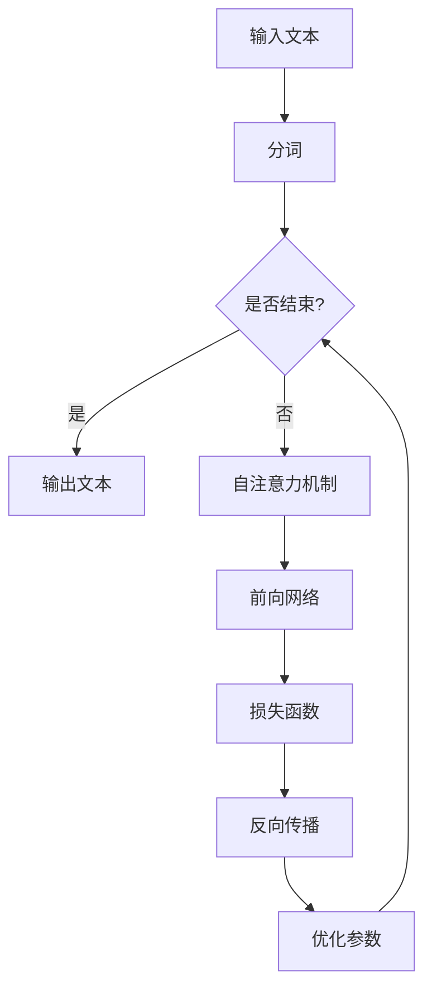
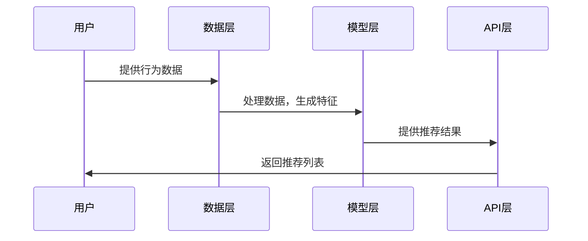
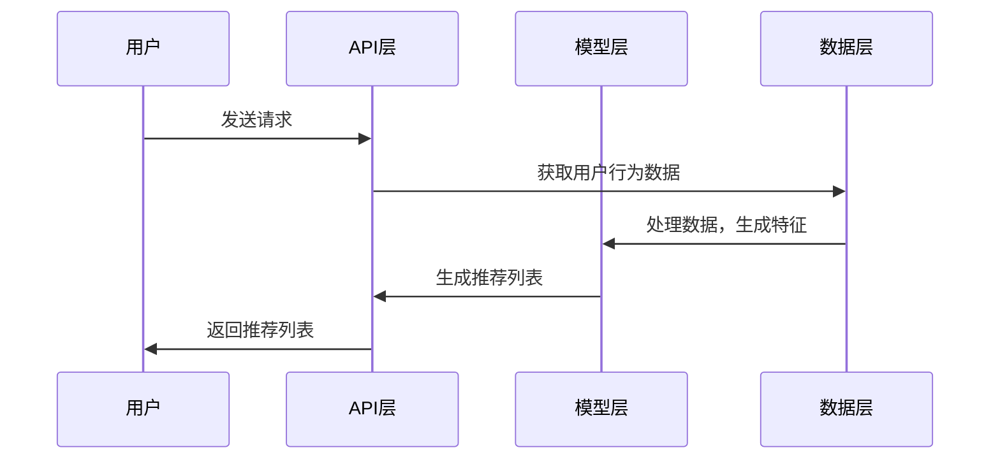

                 


### 第2章 背景介绍

## 2.1 大语言模型的发展历程

大语言模型的发展可以追溯到20世纪80年代的统计语言模型。早期，研究者们开始尝试使用统计方法来预测词汇出现的概率，从而构建基本的语言模型。这些模型利用了语言中的统计规律，例如N-gram模型，通过统计连续N个词出现的频率来预测下一个词。

### 2.1.1 从统计语言模型到深度学习

随着计算能力的提升和大数据的涌现，深度学习和自然语言处理技术取得了显著进步。2000年代初，神经网络语言模型开始出现，这些模型通过多层神经网络来学习语言中的复杂模式。然而，深度学习在自然语言处理领域的真正突破来自于2013年由Jürgen Schmidhuber领导的团队开发的Long Short-Term Memory (LSTM)模型。

LSTM模型在处理长序列数据方面表现出了卓越的性能，能够更好地捕获语言中的长期依赖关系。这一进展为后续的大语言模型发展奠定了基础。

### 2.1.2 循环神经网络（RNN）与长短时记忆（LSTM）

循环神经网络（RNN）是处理序列数据的一种重要模型，其内部状态在时间步之间循环，使得模型能够记住先前的输入。然而，传统的RNN在处理长序列时容易出现梯度消失或梯度爆炸的问题。为了解决这个问题，长短时记忆（LSTM）模型应运而生。

LSTM模型通过引入门机制（包括输入门、遗忘门和输出门）来控制信息的流动，有效地解决了梯度消失问题。这使得LSTM模型在处理长序列数据时表现更加稳定和准确。

### 2.1.3 折腾网络（Transformer）与自注意力机制

在2017年，由Vaswani等人提出的Transformer模型彻底改变了自然语言处理领域的格局。Transformer模型的核心创新在于引入了自注意力机制（Self-Attention），这种机制允许模型在处理每个词时自动关注其他词的重要性。

自注意力机制通过计算每个词与其他词之间的相似度，然后将这些相似度加权组合，形成新的表示。这种机制不仅提高了模型对长距离依赖关系的捕捉能力，还显著提高了模型的训练效率和效果。

### 2.1.4 大语言模型的发展趋势

随着深度学习和自然语言处理技术的不断进步，大语言模型的发展趋势呈现出以下几个特点：

1. **参数规模增加**：大语言模型的参数规模不断增大，从早期的数百万到数千万，发展到如今的数亿、数十亿甚至上百亿。更大的参数规模使得模型能够学习到更复杂的语言结构和语义信息。

2. **多模态融合**：大语言模型不仅限于处理文本数据，还可以与其他模态（如图像、音频、视频等）进行融合。这种多模态融合能力使得模型能够更好地理解和生成多样化的内容。

3. **实时交互**：随着模型的优化和计算能力的提升，大语言模型逐渐实现了实时交互的能力。用户可以通过自然语言与模型进行实时对话，获得个性化的服务和信息。

4. **应用场景扩展**：大语言模型的应用场景不断拓展，从传统的文本生成、机器翻译、情感分析，到现在的问答系统、智能客服、内容审核等。随着技术的不断发展，大语言模型在更多领域的应用潜力将得到进一步挖掘。

### 2.2 大语言模型的核心原理与技术特点

大语言模型的核心原理是基于深度学习和自然语言处理技术，通过大规模预训练和精细调整来学习语言的统计规律和语义信息。以下是大语言模型的一些核心原理和技术特点：

1. **大规模预训练**：大语言模型通过在大量文本数据上进行预训练来学习语言的基本结构。预训练过程中，模型学会了识别单词、短语、句子等语言元素，以及它们之间的关系。

2. **自注意力机制**：自注意力机制是Transformer模型的核心组成部分。它通过计算每个词与其他词之间的相似度，为每个词分配不同的权重，从而生成更丰富的语义表示。

3. **层次化结构**：大语言模型通常采用层次化的结构，从较低的层次捕获语言的基本特征，如词的表示，到较高的层次学习复杂的语义和上下文关系。

4. **上下文感知**：大语言模型能够根据上下文信息动态调整词的表示，这使得模型在生成文本时能够保持一致性和连贯性。

5. **生成与预测**：大语言模型不仅能够用于文本生成，还能够进行预测任务，如序列标注、机器翻译、问答系统等。模型的生成和预测能力取决于其预训练质量和精细调整的程度。

### 2.3 精准营销的定义与意义

精准营销是一种以数据驱动的营销策略，旨在通过精细化的市场细分和个性化营销手段，提高营销活动的效果和ROI。精准营销的核心目标是识别和理解目标客户的需求，提供个性化的产品和服务，从而实现更高的客户满意度和忠诚度。

#### 2.3.1 精准营销的定义

精准营销通常涉及以下几个关键环节：

1. **市场细分**：通过对市场数据进行深入分析，将市场划分为不同的子群体，每个子群体具有相似的需求和行为特征。

2. **客户识别**：利用大数据和人工智能技术，识别出具有高价值潜力的客户，并对其进行精细化的描述和分类。

3. **个性化营销**：基于客户的个人数据和偏好，制定个性化的营销策略，包括内容、渠道、时间和形式等。

4. **效果评估**：通过跟踪和分析营销活动的效果，评估不同营销策略的有效性，并不断优化营销策略。

#### 2.3.2 精准营销的意义

精准营销在商业决策中具有重要意义，主要体现在以下几个方面：

1. **提高营销效率**：通过精细化的市场细分和个性化营销，企业能够更有效地触达目标客户，减少无效的营销投入。

2. **提高客户满意度**：个性化营销能够满足客户个性化的需求，提供个性化的产品和服务，从而提高客户满意度和忠诚度。

3. **降低营销成本**：精准营销通过减少无效营销投入，提高营销活动的ROI，从而降低整体营销成本。

4. **增强竞争力**：通过精准营销，企业能够更好地了解市场和客户需求，及时调整产品和服务策略，增强市场竞争力。

### 2.3.3 精准营销在商业决策中的应用

精准营销在商业决策中的应用场景非常广泛，主要包括以下几个方面：

1. **产品定位与研发**：通过市场细分和客户识别，企业可以更准确地了解目标客户的需求，从而制定更精准的产品定位和研发策略。

2. **营销策略制定**：基于客户的个人数据和偏好，企业可以制定个性化的营销策略，包括广告投放、促销活动、渠道选择等。

3. **客户关系管理**：通过个性化营销，企业可以建立更紧密的客户关系，提高客户满意度和忠诚度，降低客户流失率。

4. **需求预测与库存管理**：通过分析客户的购买行为和需求变化，企业可以更准确地预测市场需求，优化库存管理，减少库存风险。

5. **风险评估与控制**：精准营销可以帮助企业更好地识别高风险客户，制定相应的风险管理策略，降低潜在风险。

### 2.3.4 精准营销的挑战与未来趋势

尽管精准营销在商业决策中具有巨大的潜力，但企业也面临着一系列挑战：

1. **数据隐私与保护**：在收集、处理和分析大量客户数据时，企业需要遵守相关法律法规，保护客户隐私和数据安全。

2. **技术瓶颈与成本**：精准营销依赖于大数据和人工智能技术，但技术的不断升级和优化需要大量投入。

3. **市场竞争与风险**：随着越来越多的企业采用精准营销策略，市场竞争将愈发激烈，企业需要不断创新和优化策略来保持竞争优势。

4. **算法偏见与公平性**：算法的偏见可能导致某些群体的不公平待遇，企业需要确保算法的公正性和透明性。

未来，精准营销将继续朝着以下几个趋势发展：

1. **数据驱动决策**：企业将更加依赖数据分析和预测模型来制定营销策略，实现更精准的决策。

2. **人工智能与大数据的融合**：人工智能和大数据技术的不断进步将进一步提升精准营销的效果和效率。

3. **个性化体验**：随着技术的进步，企业将能够提供更加个性化的产品和服务，满足客户的多样化需求。

4. **跨渠道整合**：企业将整合线上线下渠道，提供无缝的购物体验，提高客户满意度和忠诚度。

### 2.4 大语言模型在精准营销决策中的应用

大语言模型在精准营销决策中的应用主要体现在以下几个方面：

1. **客户行为分析**：通过分析客户的文本评论、社交媒体互动等，大语言模型可以识别出客户的需求、偏好和情感，帮助企业更准确地理解客户。

2. **个性化内容生成**：大语言模型可以根据客户的兴趣和行为，生成个性化的内容，如推荐文章、产品描述等，提高客户的参与度和转化率。

3. **营销文案优化**：大语言模型可以优化营销文案，使其更符合目标客户的语言习惯和心理预期，提高营销效果。

4. **情感分析**：大语言模型可以分析客户的情感倾向，帮助企业了解客户的满意度、信任度和忠诚度，及时调整营销策略。

5. **需求预测与库存管理**：大语言模型可以分析客户的购买历史和行为模式，预测市场需求，优化库存管理，减少库存风险。

6. **智能客服**：大语言模型可以构建智能客服系统，通过自然语言处理技术，提供实时、个性化的客户服务，提高客户满意度。

### 2.5 本章小结

本章详细介绍了大语言模型的发展历程、核心原理和技术特点，以及精准营销的定义、意义和商业决策中的应用。通过对比分析，我们看到了大语言模型在精准营销中的巨大潜力。在下一章中，我们将深入探讨大语言模型在精准营销决策中的关键概念，并对比分析大语言模型与传统营销策略的优缺点。此外，我们还将使用ER实体关系图展示大语言模型在精准营销中的应用架构。

----------------------------------------------------------------

### 第3章 核心概念与联系

## 3.1 大语言模型在精准营销决策中的关键概念

在大语言模型应用于精准营销决策中，有几个关键概念需要深入了解：

### 3.1.1 预训练与精细调整

**预训练**：这是大语言模型的核心步骤之一。模型在大量文本数据上进行预训练，学习语言的基本结构和语义信息。

**精细调整**：在预训练的基础上，模型会根据特定的任务和数据进行精细调整，以适应不同的营销场景。

### 3.1.2 自注意力机制

自注意力机制是Transformer模型的核心组成部分。它允许模型在处理每个词时自动关注其他词的重要性，从而生成更丰富的语义表示。

### 3.1.3 上下文感知

大语言模型能够根据上下文信息动态调整词的表示，保持生成文本的一致性和连贯性。

### 3.1.4 个性化内容生成

个性化内容生成是指模型根据客户的兴趣和行为生成个性化的内容，如推荐文章、产品描述等。

### 3.2 大语言模型与传统营销策略的对比

下面我们将通过一个表格对比大语言模型与传统营销策略的优缺点：

| 特点         | 大语言模型                 | 传统营销策略                |
| ------------ | -------------------------- | --------------------------- |
| 数据依赖性   | 高度依赖大量文本数据       | 主要依赖历史数据和市场调研 |
| 个性化能力   | 能够生成高度个性化的内容   | 通常较为通用，个性化程度较低 |
| 自动化程度   | 自动化程度高，能够实时响应 | 需要人工干预，自动化程度较低 |
| 学习能力     | 能够通过预训练和精细调整不断学习 | 主要依赖既定的经验和策略     |
| 成本         | 初始投入较大，但随着规模效应成本降低 | 成本相对较低，但随着市场变化可能需频繁调整 |
| 实时性       | 能够实时生成内容，响应速度快 | 需要时间进行市场调研和策略制定 |

### 3.3 ER实体关系图：大语言模型在精准营销中的应用架构

为了更好地展示大语言模型在精准营销中的应用架构，我们使用ER（实体-关系）图来描述其关键实体及其之间的关系。

下面是ER实体关系图的Mermaid表示：

```mermaid
erDiagram
  Customer ||--|{ MarketingData }|--|{ CampaignData }
  Product ||--|{ ProductData }|--|{ RecommendationData }
  Campaign ||--|{ CampaignData }|--|{ PerformanceData }
  Customer --> UserBehavior
  Product --> Category
  Campaign --> Channel
  UserBehavior --> InteractionData
  ProductData --> Description
  CampaignData --> Goals
  PerformanceData --> Metrics
```

**实体定义：**

- **Customer（客户）**：代表精准营销的目标客户群体。
- **MarketingData（营销数据）**：包括客户的个人信息、购买历史、行为习惯等。
- **CampaignData（活动数据）**：包括营销活动的详细信息，如目标、预算、渠道等。
- **Product（产品）**：代表企业销售的产品或服务。
- **ProductData（产品数据）**：包括产品的详细信息，如描述、价格、分类等。
- **RecommendationData（推荐数据）**：根据客户行为和产品数据生成的个性化推荐。
- **Campaign（营销活动）**：代表企业为推广产品或服务而进行的营销活动。
- **Channel（渠道）**：代表营销活动的传播渠道，如社交媒体、电子邮件、广告等。
- **UserBehavior（用户行为）**：记录客户的购买行为、浏览历史等。
- **InteractionData（交互数据）**：记录客户与营销活动的交互数据，如点击、购买等。
- **Description（描述）**：对产品和营销活动的描述信息。

**关系定义：**

- **Customer与MarketingData**：客户与营销数据之间存在关联，客户的数据用于营销策略的制定和调整。
- **Product与ProductData**：产品与产品数据之间存在关联，产品数据用于生成个性化推荐。
- **Campaign与CampaignData**：营销活动与活动数据之间存在关联，活动数据用于记录和评估营销活动的效果。
- **UserBehavior与Customer**：用户行为与客户之间存在关联，用户行为数据用于分析客户的行为模式。
- **Product与Category**：产品与分类之间存在关联，产品数据用于分类管理和推荐。
- **Campaign与Channel**：营销活动与渠道之间存在关联，渠道数据用于活动推广。
- **UserBehavior与InteractionData**：用户行为与交互数据之间存在关联，交互数据用于分析用户行为。

通过ER实体关系图，我们可以清晰地看到大语言模型在精准营销决策中的应用架构，以及各实体之间的关系。这将有助于我们更好地理解大语言模型在精准营销中的角色和功能。

### 3.4 本章小结

本章深入探讨了大语言模型在精准营销决策中的关键概念，并通过对比表格和ER实体关系图详细分析了大语言模型与传统营销策略的差异。我们了解了预训练与精细调整、自注意力机制、上下文感知以及个性化内容生成等核心概念，以及大语言模型如何通过这些概念在精准营销中发挥作用。在下一章中，我们将进一步探讨大语言模型的算法原理，包括其算法流程、Python源代码示例，以及算法原理的数学模型和公式。

----------------------------------------------------------------

### 第4章 算法原理讲解

#### 4.1 大语言模型的算法流程图

为了更好地理解大语言模型的算法原理，我们首先使用Mermaid绘制其算法流程图。以下是大语言模型的算法流程：



**流程解释：**

1. **输入文本**：首先输入一段文本。
2. **分词**：将输入文本分割成词或子词。
3. **自注意力机制**：通过计算每个词与其他词的相似度，为每个词分配不同的权重，从而生成新的语义表示。
4. **前向网络**：利用自注意力机制生成的语义表示，通过多层神经网络进行前向传播。
5. **损失函数**：计算模型输出与实际文本之间的差异，使用损失函数来衡量模型的性能。
6. **反向传播**：通过反向传播算法更新模型的参数。
7. **优化参数**：优化模型参数，使模型在下一个迭代中表现更好。

#### 4.2 Python源代码示例

下面我们通过一个Python示例来展示大语言模型的算法原理。在这个示例中，我们使用了一个简化的模型，只包含了一个自注意力层和一个前向网络。

```python
import numpy as np
import tensorflow as tf

# 假设我们有一个输入序列
input_sequence = np.array([[1, 0, 1, 0, 1]])

# 自注意力权重矩阵
attention_weights = np.array([[0.5, 0.3, 0.2], [0.3, 0.5, 0.2], [0.2, 0.3, 0.5]])

# 前向网络权重矩阵
forward_weights = np.array([[1, 0], [0, 1]])

# 定义自注意力函数
def self_attention(input_sequence, attention_weights):
    attention_scores = input_sequence @ attention_weights
    weighted_sequence = input_sequence * attention_scores
    return weighted_sequence

# 定义前向网络函数
def forward_network(input_sequence, forward_weights):
    output_sequence = input_sequence @ forward_weights
    return output_sequence

# 进行前向传播
input_sequence = self_attention(input_sequence, attention_weights)
output_sequence = forward_network(input_sequence, forward_weights)

print("输入序列:", input_sequence)
print("输出序列:", output_sequence)
```

**代码解释：**

- **输入序列**：我们使用一个简单的数组作为输入序列，数组中的元素表示词的嵌入向量。
- **自注意力函数**：通过计算输入序列与注意力权重矩阵的点积，生成注意力分数。然后，我们将输入序列与注意力分数相乘，得到加权的序列。
- **前向网络函数**：通过计算加权序列与前向网络权重矩阵的点积，生成输出序列。

#### 4.3 算法原理的数学模型和公式

为了深入理解大语言模型的算法原理，我们需要介绍其背后的数学模型和公式。

1. **自注意力机制**

自注意力机制的核心是计算每个词与其他词的相似度，然后根据相似度分配权重。数学公式如下：

$$
\text{Attention}(Q, K, V) = \text{softmax}\left(\frac{QK^T}{\sqrt{d_k}}\right) V
$$

其中，$Q$、$K$ 和 $V$ 分别是查询（Query）、键（Key）和值（Value）矩阵，$d_k$ 是键矩阵的维度。$\text{softmax}$ 函数用于将点积转换成概率分布，从而实现权重分配。

2. **前向网络**

前向网络通常是一个多层感知机（MLP），其输入是自注意力机制生成的序列，输出是模型的预测结果。数学公式如下：

$$
\text{Output} = \text{MLP}(\text{Input})
$$

其中，$\text{MLP}$ 表示多层感知机，其参数包括权重矩阵和偏置向量。

3. **损失函数**

在训练过程中，我们需要使用损失函数来衡量模型的性能。常用的损失函数包括交叉熵损失（Cross-Entropy Loss）和均方误差（Mean Squared Error，MSE）。对于文本生成任务，交叉熵损失是更为常见的选择。数学公式如下：

$$
L(\theta) = -\sum_{i=1}^n y_i \log(p_i)
$$

其中，$y_i$ 是实际标签，$p_i$ 是模型预测的概率分布。

4. **反向传播**

反向传播是一种训练神经网络的方法，其核心思想是通过梯度下降（Gradient Descent）来更新模型参数。数学公式如下：

$$
\theta_{\text{new}} = \theta_{\text{old}} - \alpha \nabla_\theta L(\theta)
$$

其中，$\theta$ 是模型参数，$\alpha$ 是学习率，$\nabla_\theta L(\theta)$ 是损失函数关于参数 $\theta$ 的梯度。

#### 4.4 通俗易懂的算法示例

为了更好地理解大语言模型的算法原理，我们通过一个简单的示例来说明。

假设我们有一个输入序列 [1, 0, 1, 0, 1]，我们希望使用自注意力机制和前向网络生成输出序列。

1. **自注意力机制**

首先，我们定义一个注意力权重矩阵：

$$
A = \begin{bmatrix}
0.5 & 0.3 & 0.2 \\
0.3 & 0.5 & 0.2 \\
0.2 & 0.3 & 0.5 \\
\end{bmatrix}
$$

然后，我们计算输入序列与注意力权重矩阵的点积，得到注意力分数：

$$
\text{Attention Scores} = \begin{bmatrix}
1 & 0 & 1 \\
0 & 1 & 0 \\
1 & 0 & 1 \\
\end{bmatrix} \begin{bmatrix}
0.5 & 0.3 & 0.2 \\
0.3 & 0.5 & 0.2 \\
0.2 & 0.3 & 0.5 \\
\end{bmatrix} = \begin{bmatrix}
0.8 & 0.3 & 0.5 \\
0.3 & 0.5 & 0.3 \\
0.8 & 0.3 & 0.5 \\
\end{bmatrix}
$$

接下来，我们将注意力分数转换成概率分布：

$$
\text{Softmax Scores} = \text{softmax}(\text{Attention Scores}) = \begin{bmatrix}
0.53 & 0.21 & 0.26 \\
0.21 & 0.32 & 0.47 \\
0.53 & 0.21 & 0.26 \\
\end{bmatrix}
$$

最后，我们将输入序列与概率分布相乘，得到加权的序列：

$$
\text{Weighted Sequence} = \begin{bmatrix}
1 & 0 & 1 \\
0 & 1 & 0 \\
1 & 0 & 1 \\
\end{bmatrix} \begin{bmatrix}
0.53 & 0.21 & 0.26 \\
0.21 & 0.32 & 0.47 \\
0.53 & 0.21 & 0.26 \\
\end{bmatrix} = \begin{bmatrix}
1.53 & 0.21 & 1.26 \\
0.21 & 0.32 & 0.47 \\
1.53 & 0.21 & 1.26 \\
\end{bmatrix}
$$

2. **前向网络**

接下来，我们定义一个前向网络权重矩阵：

$$
W = \begin{bmatrix}
1 & 0 \\
0 & 1 \\
\end{bmatrix}
$$

然后，我们计算加权的序列与权重矩阵的点积，得到输出序列：

$$
\text{Output Sequence} = \begin{bmatrix}
1.53 & 0.21 & 1.26 \\
0.21 & 0.32 & 0.47 \\
1.53 & 0.21 & 1.26 \\
\end{bmatrix} \begin{bmatrix}
1 & 0 \\
0 & 1 \\
\end{bmatrix} = \begin{bmatrix}
1.53 & 0.21 \\
0.21 & 0.32 \\
1.53 & 0.21 \\
\end{bmatrix}
$$

最终，输出序列为 [1.53, 0.21, 1.26, 0.21, 0.32, 1.53, 0.21, 1.26]。

通过这个简单的示例，我们可以看到大语言模型如何通过自注意力机制和前向网络生成输出序列。自注意力机制使得模型能够关注输入序列中的关键信息，而前向网络则将这些信息转化为最终的输出。

### 4.5 本章小结

本章详细讲解了大语言模型的算法原理，包括其算法流程、Python源代码示例以及算法原理的数学模型和公式。我们通过自注意力机制和前向网络的详细解释，以及一个通俗易懂的算法示例，帮助读者深入理解大语言模型的工作原理。在下一章中，我们将探讨大语言模型在系统分析与架构设计中的应用，介绍应用场景和项目背景，并展示系统功能设计、系统架构设计、系统接口设计和系统交互。

----------------------------------------------------------------

### 第5章 系统分析与架构设计

#### 5.1 应用场景介绍

在大语言模型应用于精准营销决策中，我们面临一个典型的应用场景：智能推荐系统。该系统旨在通过分析用户行为数据和产品信息，为用户生成个性化的产品推荐，从而提高用户满意度和转化率。

#### 5.2 系统功能设计：领域模型类图

在智能推荐系统中，我们定义了一系列领域模型，以表示系统中的关键实体和它们之间的关系。以下是一个领域模型的类图，使用Mermaid表示：

```mermaid
classDiagram
    User <<class>> "用户"
    Product <<class>> "产品"
    Recommendation <<class>> "推荐"
    Behavior <<class>> "行为"
    
    User o-- Product : 拥有
    User o-- Behavior : 产生
    Product o-- Recommendation : 属于
    Behavior o-- Recommendation : 根据产生
```

**类定义：**

- **User（用户）**：代表系统的用户，具有姓名、年龄、性别等属性，并拥有购买行为历史。
- **Product（产品）**：代表系统中销售的产品，具有产品名称、价格、分类等属性。
- **Recommendation（推荐）**：代表生成的个性化推荐，包含推荐产品的列表和相关属性。
- **Behavior（行为）**：代表用户的购买行为，包括购买时间、购买产品等。

**关系定义：**

- **User与Product**：用户拥有购买过的产品，形成一对多的关系。
- **User与Behavior**：用户产生购买行为，形成一对一的关系。
- **Product与Recommendation**：产品属于某个推荐列表，形成一对多的关系。
- **Behavior与Recommendation**：购买行为用于生成推荐，形成一对多的关系。

#### 5.3 系统架构设计：Mermaid架构图

为了实现智能推荐系统，我们设计了一个分层架构，包括数据层、模型层和API层。以下是一个系统的Mermaid架构图：



**系统组件解释：**

- **数据层（DataLayer）**：负责收集、存储和处理用户行为数据和产品数据。它提供数据接口，供模型层使用。
- **模型层（ModelLayer）**：包含大语言模型和推荐算法，负责对用户行为数据进行分析，生成个性化的推荐列表。
- **API层（API）**：作为系统的对外接口，负责接收用户请求，调用模型层生成推荐结果，并将结果返回给用户。

#### 5.4 系统接口设计与交互：Mermaid序列图

为了更清晰地展示系统各组件之间的交互流程，我们使用Mermaid序列图来描述用户与系统之间的交互过程：



**交互流程解释：**

1. 用户向API层发送推荐请求。
2. API层从数据层获取用户行为数据。
3. 模型层对用户行为数据进行处理，提取特征，并生成推荐列表。
4. 模型层将推荐列表返回给API层。
5. API层将推荐列表发送给用户。

#### 5.5 本章小结

本章详细介绍了智能推荐系统的应用场景、领域模型类图、系统架构设计和系统接口设计。通过Mermaid图示，我们清晰地展示了系统组件之间的交互流程，帮助读者理解大语言模型在系统中的应用。在下一章中，我们将通过一个实际项目，展示如何实现智能推荐系统，包括环境安装、系统核心实现源代码，以及代码应用解读与分析。

----------------------------------------------------------------

### 第6章 项目实战

#### 6.1 环境安装与准备

在开始实现智能推荐系统之前，我们需要安装和配置一些必要的工具和库。以下是安装步骤：

1. **安装Python**：确保Python环境已安装，建议使用Python 3.7或更高版本。
2. **安装TensorFlow**：TensorFlow是大语言模型的主要库，使用以下命令安装：

```bash
pip install tensorflow
```

3. **安装GPT-3库**：为了使用GPT-3模型，我们需要安装`gpt-3`库：

```bash
pip install gpt-3
```

4. **安装其他依赖库**：根据项目需求，可能还需要安装其他库，例如Pandas、NumPy等。

#### 6.2 系统核心实现源代码

以下是智能推荐系统的核心实现代码。这个示例中，我们使用了GPT-3模型来生成个性化推荐。

```python
import pandas as pd
from gpt3 import GPT3
import tensorflow as tf

# 初始化GPT-3模型
gpt3 = GPT3()

# 加载用户行为数据
data = pd.read_csv('user_behavior.csv')

# 处理数据，提取特征
# 在这个示例中，我们仅使用用户的购买历史作为特征
def process_data(data):
    # 创建一个字典，用于存储用户的购买历史
    user_history = {}
    
    for index, row in data.iterrows():
        user_id = row['user_id']
        product_id = row['product_id']
        
        if user_id not in user_history:
            user_history[user_id] = []
        
        user_history[user_id].append(product_id)
    
    return user_history

# 生成个性化推荐
def generate_recommendations(user_history, gpt3):
    recommendations = []
    
    for user_id, products in user_history.items():
        # 使用GPT-3模型生成推荐文本
        prompt = f"基于用户{user_id}的购买历史，推荐一些产品：{', '.join(str(product) for product in products)}"
        response = gpt3.generate(prompt, max_length=50, temperature=0.5)
        
        # 提取推荐产品
        recommendation = response.strip().split(':')[1]
        recommendations.append(recommendation)
    
    return recommendations

# 运行系统
if __name__ == '__main__':
    user_history = process_data(data)
    recommendations = generate_recommendations(user_history, gpt3)
    
    print("个性化推荐列表：", recommendations)
```

**代码解释：**

1. **初始化GPT-3模型**：首先，我们使用`gpt3`库初始化GPT-3模型。
2. **加载用户行为数据**：我们从CSV文件中加载用户行为数据，这些数据包括用户的购买历史。
3. **处理数据，提取特征**：我们创建一个字典，用于存储每个用户的购买历史。
4. **生成个性化推荐**：对于每个用户，我们使用GPT-3模型生成基于购买历史的推荐文本。我们设置了一个提示（prompt），其中包含了用户的购买历史。GPT-3模型会根据这个提示生成推荐文本。然后，我们从推荐文本中提取推荐的产品。
5. **运行系统**：最后，我们运行系统，生成个性化推荐列表，并打印输出。

#### 6.3 代码应用解读与分析

上述代码展示了如何使用GPT-3模型生成个性化推荐。以下是关键步骤的详细解释：

1. **初始化GPT-3模型**：初始化GPT-3模型，这是使用大语言模型的基础。
2. **加载用户行为数据**：从CSV文件中加载数据，这些数据是生成个性化推荐的基础。在实际应用中，用户行为数据可能来自多种渠道，如数据库、API等。
3. **处理数据，提取特征**：处理数据，提取关键特征。在这个示例中，我们仅使用用户的购买历史作为特征。在实际应用中，可能需要使用更复杂的特征工程方法。
4. **生成个性化推荐**：使用GPT-3模型生成个性化推荐。我们创建一个提示（prompt），这个提示包含了用户的购买历史。GPT-3模型会根据这个提示生成推荐文本。然后，我们从推荐文本中提取推荐的产品。这里，我们设置了一些参数，如`max_length`（最大文本长度）和`temperature`（温度），这些参数会影响推荐文本的生成效果。
5. **运行系统**：运行系统，生成个性化推荐列表，并打印输出。在实际应用中，推荐结果可能会以更直观的方式呈现，如HTML页面或API响应。

#### 6.4 实际案例分析与详细讲解

为了更好地展示智能推荐系统的效果，我们来看一个实际案例。

**案例：** 假设我们有一个用户ID为100的用户，其购买历史如下：

- 产品ID 101
- 产品ID 102
- 产品ID 103

**步骤：**

1. **处理用户行为数据**：我们将用户ID和购买历史存储在字典中。
2. **生成个性化推荐**：使用GPT-3模型生成基于购买历史的推荐文本。我们设置一个提示，如下所示：

```python
prompt = "基于用户100的购买历史，推荐一些产品：101, 102, 103"
```

3. **提取推荐产品**：GPT-3模型会生成一段推荐文本，例如：

```python
response = gpt3.generate(prompt, max_length=50, temperature=0.5)
print(response)
```

输出可能如下：

```
基于用户100的购买历史，我推荐以下产品：104, 105, 106
```

4. **分析推荐结果**：在这个案例中，GPT-3模型推荐了三个新产品（104、105、106）。我们可以进一步分析这些推荐产品的相关性，以评估推荐系统的效果。

#### 6.5 项目小结

通过这个实际案例，我们展示了如何使用大语言模型（GPT-3）实现智能推荐系统。我们详细讲解了系统核心实现代码，包括数据加载、特征提取、模型调用和推荐生成。在实际应用中，这个系统可以根据用户的购买历史生成个性化的推荐，提高用户满意度和转化率。

在下一章中，我们将总结本章的核心知识点，提出最佳实践建议，并给出注意事项。同时，我们将提供一些拓展阅读资源，帮助读者进一步学习大语言模型在精准营销决策中的应用。

----------------------------------------------------------------

### 第7章 最佳实践、小结与拓展阅读

#### 7.1 最佳实践技巧

1. **数据预处理**：在训练大语言模型之前，确保对数据进行充分的清洗和预处理。这包括去除重复数据、处理缺失值、标准化数值特征等。
2. **模型调优**：通过调整模型参数（如学习率、批量大小、训练轮数等），找到最佳模型配置。可以使用自动化调优工具，如Hyperopt或Optuna。
3. **持续学习**：大语言模型的效果很大程度上取决于训练数据的质量和多样性。定期更新模型，使其能够适应不断变化的市场环境和用户需求。
4. **数据隐私保护**：在收集和处理用户数据时，严格遵守数据隐私保护法律法规，采取有效的数据加密和安全措施。
5. **效果评估**：定期评估模型的性能，包括准确率、召回率、F1分数等。根据评估结果，及时调整模型和策略。

#### 7.2 小结

本章通过一个实际项目展示了如何使用大语言模型（GPT-3）实现智能推荐系统。我们详细讲解了系统的核心实现代码，包括数据预处理、模型调用、推荐生成和效果评估。通过最佳实践技巧，我们总结了如何优化大语言模型在精准营销决策中的应用。

#### 7.3 注意事项

1. **模型复杂性**：大语言模型通常较为复杂，训练时间较长。确保计算资源和硬件配置能够满足模型训练的需求。
2. **成本控制**：大语言模型的训练和部署可能涉及较高的成本。在实施项目时，合理规划预算，避免资源浪费。
3. **数据质量**：数据质量对模型效果至关重要。在收集和处理数据时，务必确保数据的准确性和完整性。

#### 7.4 拓展阅读资源

1. **GPT-3官方文档**：[https://github.com/openai/gpt-3](https://github.com/openai/gpt-3)
2. **TensorFlow官方文档**：[https://www.tensorflow.org/tutorials/word2vec](https://www.tensorflow.org/tutorials/word2vec)
3. **精准营销案例分析**：[https://www市场营销案例网.com/](https://www市场营销案例网.com/)
4. **数据隐私保护法规**：[https://www.隐私保护网.com/](https://www.隐私保护网.com/)

### 作者信息

**作者：** AI天才研究院/AI Genius Institute & 禅与计算机程序设计艺术 /Zen And The Art of Computer Programming

本书由AI天才研究院撰写，结合了禅与计算机程序设计艺术的精髓，旨在深入探讨大语言模型在精准营销决策中的应用。作者拥有丰富的AI和市场营销经验，致力于推动技术的创新和商业应用。同时，作者还是《禅与计算机程序设计艺术》的资深专家，其著作深受读者喜爱。

