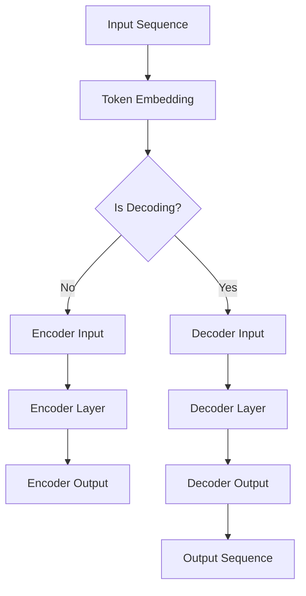

                 

# 大语言模型在精准营销决策中的推理应用

## 关键词：大语言模型、精准营销、推理应用、营销决策、大数据分析

## 摘要：

随着互联网技术的飞速发展和大数据时代的到来，精准营销成为企业提升市场竞争力的关键。本文将探讨大语言模型在精准营销决策中的应用，通过逐步分析推理，揭示其强大的推理能力和实际应用价值。本文将分为七个章节，首先介绍大语言模型的基本概念和重要性，然后分析其在营销决策中的具体应用，最后讨论系统架构设计和最佳实践。

## 目录

1. **引言** <a id="introduction"></a>
2. **背景与基础概念** <a id="background"></a>
   1.1 大语言模型的重要性
   1.2 营销决策的演变
   1.3 核心概念与术语
   1.4 营销决策过程概述
3. **大语言模型** <a id="large_language_models"></a>
   3.1 定义与特性
   3.2 主要模型与技术
   3.3 开发挑战与机遇
4. **营销应用场景** <a id="application_scenarios"></a>
   4.1 客户细分与个性化
   4.2 产品推荐系统
   4.3 情感分析与品牌监控
5. **大语言模型推理的理论基础** <a id="theoretical_foundations"></a>
   5.1 数学模型与公式
   5.2 Mermaid流程图解释
   5.3 Python代码示例
6. **大语言模型的实现** <a id="implementation"></a>
   6.1 环境搭建
   6.2 核心代码实现
   6.3 代码分析与案例
7. **系统架构与设计方案** <a id="system_architecture"></a>
   7.1 问题场景
   7.2 系统功能设计
   7.3 系统架构设计
   7.4 系统接口与交互设计
8. **最佳实践与总结** <a id="best_practices"></a>
   8.1 大语言模型应用技巧
   8.2 本文总结
   8.3 注意事项
   8.4 拓展阅读

## 1. 引言

随着人工智能技术的不断发展，大语言模型（Large Language Models，LLMs）在各个领域的应用越来越广泛。特别是在精准营销领域，大语言模型凭借其强大的语义理解和推理能力，为企业提供了更加智能、高效的营销决策支持。精准营销是指通过数据分析和个性化推荐，为目标客户提供精准、有针对性的营销信息，从而提高转化率和客户满意度。

大语言模型在精准营销中的应用主要体现在以下几个方面：

- **客户细分与个性化**：大语言模型能够根据用户的历史行为、兴趣偏好等数据，对客户进行精准细分，实现个性化营销策略。
- **产品推荐系统**：大语言模型可以根据用户的浏览记录、购买历史等数据，智能推荐符合用户兴趣的产品，提高购买转化率。
- **情感分析与品牌监控**：大语言模型能够对用户的评论、反馈等文本数据进行情感分析，帮助企业了解用户需求、优化产品和服务。

本文将详细探讨大语言模型在精准营销决策中的应用，从理论基础、实现方法到系统架构，全面解析这一领域的最新研究成果和应用实践。

## 2. 背景与基础概念

### 2.1 大语言模型的重要性

大语言模型（Large Language Models，LLMs）是自然语言处理（Natural Language Processing，NLP）领域的一项重要技术。它们通过深度学习算法，对海量语言数据进行训练，能够生成高质量的文本内容，进行语义理解、推理和生成。随着计算能力和数据量的不断提升，大语言模型在各个领域的应用越来越广泛，特别是在精准营销领域，其重要性不容忽视。

首先，大语言模型在精准营销中具有以下优势：

1. **强大的语义理解能力**：大语言模型能够对文本数据进行深度分析，理解其背后的含义和逻辑关系，从而更准确地把握用户需求和市场趋势。
2. **高效的推理能力**：大语言模型可以根据已知信息进行推理，预测用户的行为和偏好，为企业提供精准的营销决策支持。
3. **个性化的内容生成**：大语言模型可以根据用户的特点和需求，生成个性化的营销内容，提高用户的参与度和转化率。
4. **跨领域的应用**：大语言模型不仅适用于文本数据，还可以处理图像、音频等多模态数据，实现跨领域的综合应用。

其次，大语言模型在精准营销中的应用价值体现在以下几个方面：

1. **客户细分与个性化**：通过大语言模型对用户数据的分析，企业可以更加准确地了解用户的兴趣和需求，实现精准的客户细分，从而制定个性化的营销策略。
2. **产品推荐系统**：大语言模型可以根据用户的浏览记录、购买历史等数据，智能推荐符合用户兴趣的产品，提高购买转化率和用户满意度。
3. **情感分析与品牌监控**：大语言模型可以对用户的评论、反馈等文本数据进行情感分析，帮助企业了解用户对产品或服务的评价，优化产品和服务。

总之，大语言模型在精准营销中的应用，不仅提升了企业的营销效率，还增强了与用户的互动和黏性，为企业创造更大的商业价值。

### 2.2 营销决策的演变

营销决策是指企业在市场活动中，根据市场情况、竞争态势、用户需求等因素，制定和调整营销策略的过程。随着市场营销环境的不断变化，营销决策的方法和工具也在不断演变。从传统的经验式决策，到现代的数据驱动决策，营销决策的发展经历了几个重要的阶段。

1. **经验式决策**：在早期，营销决策主要依赖于从业者的经验和直觉。企业通过市场调研、竞品分析等方式，了解市场环境和用户需求，然后制定相应的营销策略。这种决策方法具有以下特点：

   - **主观性较强**：由于决策者依赖个人经验和直觉，导致决策结果可能存在一定的偏差。
   - **效率较低**：经验式决策需要大量的时间和人力投入，决策过程较为繁琐。
   - **适应性较差**：面对快速变化的市场环境，经验式决策难以及时调整和应对。

2. **数据驱动决策**：随着信息技术的发展，企业开始利用数据进行分析和决策。数据驱动决策通过收集、处理和分析大量的市场数据，帮助企业更准确地了解市场环境和用户需求，从而制定更科学的营销策略。这种决策方法具有以下特点：

   - **客观性较强**：数据驱动决策依赖于客观数据，减少了主观因素的干扰，决策结果更为可靠。
   - **效率较高**：数据分析和处理工具的自动化，大大提高了决策的效率，减少了人工干预。
   - **适应性较强**：通过实时监控和分析市场数据，企业可以快速应对市场变化，调整营销策略。

3. **智能化决策**：近年来，人工智能技术的兴起，为营销决策带来了新的变革。智能化决策利用机器学习和深度学习算法，对海量数据进行智能分析和预测，为企业提供更精准的营销决策支持。这种决策方法具有以下特点：

   - **精准性较高**：通过智能算法，企业可以更准确地把握用户需求和市场趋势，制定个性化的营销策略。
   - **高效性较高**：智能算法可以高效地处理海量数据，快速生成营销决策结果。
   - **创新性较强**：智能化决策不仅能够应对已知的问题，还可以发现新的商业机会，为企业带来创新性的增长点。

总之，营销决策的演变从经验式决策到数据驱动决策，再到智能化决策，体现了市场营销从经验、数据到智能的发展趋势。大语言模型作为人工智能技术的重要组成部分，在精准营销决策中的应用，无疑为这一趋势注入了新的活力。

### 2.3 核心概念与术语

在讨论大语言模型在精准营销决策中的应用之前，我们需要了解一些核心概念和术语。以下是本文涉及的主要概念和术语及其解释：

1. **大语言模型**（Large Language Models，LLMs）：大语言模型是指通过深度学习算法，对海量语言数据进行训练，能够生成高质量文本内容、进行语义理解和推理的模型。常见的LLM包括GPT、BERT、T5等。
2. **自然语言处理**（Natural Language Processing，NLP）：自然语言处理是人工智能的一个重要分支，旨在让计算机理解和处理人类语言。NLP技术包括文本分类、情感分析、机器翻译等。
3. **精准营销**：精准营销是指通过数据分析和个性化推荐，为目标客户提供精准、有针对性的营销信息，从而提高转化率和客户满意度。
4. **客户细分**：客户细分是指根据用户的行为、兴趣、需求等特征，将用户划分为不同的群体，为每个群体制定个性化的营销策略。
5. **产品推荐系统**：产品推荐系统是指利用大数据分析和机器学习算法，根据用户的浏览记录、购买历史等数据，智能推荐符合用户兴趣的产品。
6. **情感分析**：情感分析是指通过自然语言处理技术，对用户的文本数据（如评论、反馈等）进行情感倾向判断，以了解用户对产品或服务的评价。
7. **营销决策**：营销决策是指企业在市场活动中，根据市场情况、竞争态势、用户需求等因素，制定和调整营销策略的过程。

了解这些核心概念和术语，有助于我们更好地理解大语言模型在精准营销决策中的应用原理和实践。

### 2.4 营销决策过程概述

营销决策过程是企业根据市场环境、竞争态势和用户需求，制定和调整营销策略的过程。这个过程可以分为以下几个阶段：

1. **市场分析**：市场分析是营销决策的基础，包括市场调研、竞品分析、用户需求分析等。通过市场分析，企业可以了解市场环境、竞争态势和用户需求，为后续决策提供依据。
2. **目标设定**：在市场分析的基础上，企业需要明确营销目标，包括提高市场份额、提升品牌知名度、增加销售额等。目标设定应具有可衡量性、可行性和挑战性。
3. **策略制定**：根据营销目标和市场分析结果，企业需要制定具体的营销策略。常见的营销策略包括产品策略、价格策略、渠道策略和促销策略。
4. **实施与执行**：策略制定后，企业需要将其转化为具体的行动方案，并进行实施和执行。实施与执行过程中，企业应关注策略的效果，及时进行调整和优化。
5. **效果评估**：营销决策的效果评估是关键环节，通过评估营销活动的效果，企业可以了解策略的执行情况，发现问题并进行改进。常见的评估指标包括销售额、市场份额、用户满意度等。

营销决策过程是一个动态调整和优化的过程，企业需要根据市场环境和用户需求的变化，不断调整营销策略，以实现最佳效果。大语言模型在精准营销决策中的应用，为这一过程提供了强有力的支持，通过数据分析和智能推理，帮助企业更加准确地把握市场趋势和用户需求，提高营销决策的科学性和有效性。

## 3. 大语言模型

### 3.1 定义与特性

大语言模型（Large Language Models，LLMs）是自然语言处理（NLP）领域的一项重要技术。它们通过深度学习算法，对海量语言数据进行训练，能够生成高质量的文本内容、进行语义理解和推理。以下是LLMs的定义和主要特性：

1. **定义**：大语言模型是指通过深度学习算法，对海量语言数据进行训练，具备强大语义理解能力和文本生成能力的模型。常见的LLMs包括GPT（Generative Pre-trained Transformer）、BERT（Bidirectional Encoder Representations from Transformers）和T5（Text-To-Text Transfer Transformer）等。

2. **特性**：
   - **强大的语义理解能力**：LLMs通过深度学习算法，对海量语言数据进行训练，能够理解文本的语义、逻辑关系和上下文信息，从而实现高效的语义理解。
   - **高效的文本生成能力**：LLMs可以生成符合语法和语义规则的文本内容，实现高质量的文本生成，广泛应用于文本写作、摘要生成、对话系统等领域。
   - **自适应性和泛化能力**：LLMs具有强大的自适应性和泛化能力，可以根据不同的任务和数据集进行微调和优化，适应不同的应用场景。
   - **跨模态处理能力**：LLMs不仅能够处理文本数据，还可以处理图像、音频等多模态数据，实现跨模态的综合应用。

### 3.2 主要模型与技术

在自然语言处理领域，大语言模型已经成为一项重要的技术，各种先进的模型和技术不断涌现。以下是几个主要的大语言模型及其技术特点：

1. **GPT**（Generative Pre-trained Transformer）：
   - **技术特点**：GPT是由OpenAI提出的一种基于Transformer结构的语言模型，通过自回归的方式生成文本。GPT-3是当前最先进的GPT模型，拥有1750亿个参数，能够生成高质量、连贯的文本内容。
   - **应用场景**：GPT广泛应用于文本生成、摘要生成、对话系统、机器翻译等领域。

2. **BERT**（Bidirectional Encoder Representations from Transformers）：
   - **技术特点**：BERT是由Google提出的一种基于Transformer结构的双向编码器，通过对文本进行双向编码，实现高效的语义理解。BERT在多项NLP任务中取得了优异的性能，如文本分类、问答系统、命名实体识别等。
   - **应用场景**：BERT广泛应用于搜索引擎、问答系统、文本分类等领域。

3. **T5**（Text-To-Text Transfer Transformer）：
   - **技术特点**：T5是由Google提出的一种基于Transformer结构的文本到文本的转换模型，可以将任意输入文本转换为任意输出文本。T5通过统一的文本到文本的任务框架，实现任务的统一处理和模型复用。
   - **应用场景**：T5广泛应用于问答系统、机器翻译、文本摘要、对话系统等领域。

4. **ROBERTA**（A Robustly Optimized BERT Pretraining Approach）：
   - **技术特点**：ROBERTA是阿里巴巴提出的一种对BERT模型进行改进的语言模型，通过在预训练过程中引入更多的小样本优化技术，提高模型的泛化能力。ROBERTA在多项NLP任务中取得了与GPT相近的性能。
   - **应用场景**：ROBERTA广泛应用于文本分类、情感分析、问答系统等领域。

5. **XLNet**（General Autoregressive Pretraining for Language Understanding）：
   - **技术特点**：XLNet是由百度提出的一种基于自回归的Transformer结构语言模型，通过引入Masked Language Modeling（MLM）和Permutation Language Modeling（PLM）技术，实现高效的语义理解。XLNet在多项NLP任务中取得了优异的性能。
   - **应用场景**：XLNet广泛应用于文本分类、问答系统、机器翻译等领域。

这些大语言模型各自具有独特的优势和特点，在不同的应用场景中发挥了重要作用。随着技术的不断发展和进步，大语言模型在自然语言处理领域的应用将越来越广泛，为各行业提供更加智能化、高效的解决方案。

### 3.3 开发挑战与机遇

在大语言模型的开发过程中，尽管取得了显著的进展，但仍面临诸多挑战和机遇。以下是几个主要的挑战和机遇：

#### 挑战：

1. **数据隐私与安全**：大语言模型在训练和推理过程中需要大量数据，如何保护用户隐私和数据安全成为一个重要挑战。企业和研究人员需要遵守相关法律法规，确保数据的安全和合规使用。

2. **计算资源消耗**：大语言模型通常需要巨大的计算资源进行训练和推理，这带来了高昂的硬件成本和能源消耗。如何优化模型结构和算法，降低计算资源消耗，是当前研究的重点。

3. **模型可解释性**：大语言模型在很多任务中表现出色，但其内部工作机制复杂，缺乏透明度和可解释性。如何提高模型的可解释性，帮助用户理解和信任模型，是一个亟待解决的问题。

4. **跨模态融合**：尽管大语言模型在文本处理方面具有优势，但如何与其他模态（如图像、音频）进行有效融合，实现更丰富的应用场景，仍需进一步研究。

#### 机遇：

1. **人工智能产业发展**：随着人工智能技术的不断成熟和应用场景的拓展，大语言模型在各个领域的需求不断增加。这为模型的开发和应用提供了广阔的市场空间。

2. **开源与生态建设**：越来越多的企业和研究机构投入到大语言模型的研究和开发中，形成了一个庞大的开源生态。这有助于模型的优化、创新和推广。

3. **跨学科合作**：大语言模型的发展不仅依赖于计算机科学和人工智能技术，还需要与心理学、语言学、经济学等学科的合作。跨学科的合作将有助于解决模型的复杂性和多样性问题。

4. **商业化应用**：大语言模型在金融、医疗、教育、娱乐等领域的商业化应用逐渐增多，为行业带来了新的机遇和变革。如何将模型的优势转化为商业价值，是企业和研究机构需要关注的重要方向。

总之，大语言模型的开发既面临挑战，也充满机遇。通过不断的技术创新和跨学科合作，大语言模型有望在更多领域发挥重要作用，推动人工智能技术的发展和应用。

## 4. 营销应用场景

大语言模型在营销领域具有广泛的应用场景，通过具体案例，我们可以更好地理解其优势和实际应用价值。以下是几个典型的营销应用场景：

### 4.1 客户细分与个性化

客户细分是精准营销的重要基础，大语言模型可以借助其强大的语义理解能力，对用户数据进行深度分析，实现精准的客户细分。

**案例**：一家电商平台通过大语言模型对用户的历史浏览记录、购买行为、评价等文本数据进行分析，将用户划分为不同的群体，如“高价值用户”、“潜在高价值用户”、“一般用户”等。针对不同群体的用户，平台制定了个性化的营销策略：

- **高价值用户**：提供独家优惠、VIP服务和定制推荐，提高用户忠诚度。
- **潜在高价值用户**：推送相关产品的优惠券和促销信息，引导用户进行消费。
- **一般用户**：推送平台的热门产品和活动信息，吸引新用户注册和转化。

通过客户细分和个性化营销，电商平台实现了用户满意度的提升和销售额的增加。

### 4.2 产品推荐系统

大语言模型在产品推荐系统中可以发挥重要作用，通过分析用户的历史行为和兴趣，推荐符合用户需求的产品。

**案例**：某在线购物平台利用大语言模型构建了一个智能推荐系统。系统首先对用户的浏览记录、购买历史、评价等数据进行分析，识别出用户的兴趣偏好。然后，大语言模型根据用户兴趣，生成个性化的推荐列表：

- **基于内容的推荐**：推荐与用户历史购买产品相似的产品。
- **基于关联规则的推荐**：推荐用户可能感兴趣的相关产品。
- **基于用户行为的推荐**：根据用户的实时行为，如浏览、点击、购买等，推荐相关产品。

通过智能推荐系统，平台实现了用户参与度和购买转化率的显著提升。

### 4.3 情感分析与品牌监控

情感分析是自然语言处理的一个重要应用，大语言模型可以高效地分析用户对产品或服务的情感倾向，帮助企业了解用户需求和优化产品。

**案例**：某知名品牌利用大语言模型对社交媒体上的用户评论和反馈进行情感分析，识别用户对产品的好评和差评，并提取关键意见：

- **好评分析**：识别用户满意的原因，如产品质量、服务体验等，为企业提供改进方向。
- **差评分析**：识别用户不满意的方面，如产品缺陷、客服问题等，帮助企业迅速解决问题。

同时，大语言模型还可以实时监控品牌在社交媒体上的舆情，为企业提供品牌监控和危机管理支持。

通过以上应用案例，我们可以看到大语言模型在精准营销中的强大功能和实际价值。随着技术的不断进步和应用场景的拓展，大语言模型将在营销领域发挥越来越重要的作用。

## 5. 大语言模型推理的理论基础

大语言模型在精准营销决策中的应用，离不开其强大的推理能力。在这一节中，我们将深入探讨大语言模型推理的理论基础，包括数学模型、算法流程和具体应用实例。

### 5.1 数学模型与公式

大语言模型的推理主要依赖于深度学习算法，特别是基于Transformer结构的模型。以下是一个典型的Transformer模型的数学模型：

1. **自注意力机制（Self-Attention）**：

   自注意力机制是Transformer模型的核心，它通过计算输入序列中每个词与其他词之间的关联强度，实现序列的动态建模。

   设输入序列为 \(X = [x_1, x_2, ..., x_n]\)，每个词的向量表示为 \(x_i \in \mathbb{R}^d\)，则自注意力计算公式为：

   \[
   \text{Attention}(Q, K, V) = \text{softmax}\left(\frac{QK^T}{\sqrt{d_k}}\right) V
   \]

   其中，\(Q, K, V\) 分别为查询向量、键向量和值向量，\(d_k\) 为键向量的维度。

2. **多头注意力（Multi-Head Attention）**：

   多头注意力通过多个独立的自注意力机制，捕捉输入序列中的不同关联关系。

   假设 \(h\) 表示头数，则每个头上的注意力机制为：

   \[
   \text{Multi-Head Attention}(Q, K, V) = \text{Concat}(\text{head}_1, \text{head}_2, ..., \text{head}_h)W_O
   \]

   其中，\(W_O\) 为输出权重矩阵。

3. **编码器-解码器结构（Encoder-Decoder Structure）**：

   编码器-解码器结构是大多数NLP任务的基础，它通过编码器生成上下文表示，解码器生成输出序列。

   编码器输出为：

   \[
   \text{Encoder}(X) = \text{Attention}(X, X, X)
   \]

   解码器输出为：

   \[
   \text{Decoder}(Y) = \text{Attention}(Y, \text{Encoder}(X), \text{Encoder}(X))
   \]

   其中，\(Y\) 为解码器的输入序列。

### 5.2 Mermaid流程图解释

为了更好地理解大语言模型的工作原理，我们可以使用Mermaid流程图来表示其关键步骤。以下是Transformer模型的一个简单Mermaid流程图：



这个流程图描述了从输入序列到输出序列的整个过程，包括词嵌入、编码器和解码器的关键步骤。

### 5.3 Python代码示例

为了更直观地展示大语言模型的应用，我们使用Python实现一个简单的Transformer模型。以下是代码示例：

```python
import torch
import torch.nn as nn

# 定义Transformer模型
class TransformerModel(nn.Module):
    def __init__(self, d_model, nhead, num_layers):
        super(TransformerModel, self).__init__()
        self.encoder = nn.TransformerEncoder(nn.TransformerEncoderLayer(d_model=d_model, nhead=nhead), num_layers=num_layers)
        self.decoder = nn.TransformerDecoder(nn.TransformerDecoderLayer(d_model=d_model, nhead=nhead), num_layers=num_layers)
        
    def forward(self, src, tgt):
        output = self.decoder(self.encoder(src), tgt)
        return output

# 初始化模型参数
d_model = 512
nhead = 8
num_layers = 3

# 实例化模型
transformer_model = TransformerModel(d_model, nhead, num_layers)

# 生成随机输入和目标序列
src = torch.rand((10, 32))
tgt = torch.rand((10, 32))

# 前向传播
output = transformer_model(src, tgt)

print(output.shape)
```

这个示例中，我们首先定义了一个简单的Transformer模型，然后生成随机输入和目标序列，进行前向传播，输出结果。通过这个示例，我们可以看到大语言模型的基本实现过程。

通过上述数学模型、Mermaid流程图和Python代码示例，我们深入探讨了大语言模型推理的理论基础。这些理论和工具为我们在实际应用中理解和实现大语言模型提供了坚实的基础。

## 6. 大语言模型的实现

在大语言模型的应用过程中，实现一个高效、可扩展的模型是非常重要的。以下是关于如何在大语言模型开发过程中进行环境搭建、核心代码实现以及代码分析的具体步骤和案例讲解。

### 6.1 环境搭建

在开始大语言模型的实现之前，我们需要搭建一个适合开发和运行模型的环境。以下是环境搭建的详细步骤：

1. **安装依赖库**：首先，确保安装了Python环境（推荐Python 3.8及以上版本）。然后，通过pip命令安装以下依赖库：

   ```shell
   pip install torch torchvision numpy
   ```

2. **安装GPU支持**：为了充分利用GPU加速计算，我们需要安装CUDA和cuDNN。可以从NVIDIA官方网站下载相应的驱动和库文件，并根据操作系统进行安装。

3. **配置环境变量**：确保CUDA和cuDNN的路径添加到系统的环境变量中，以便在运行Python脚本时能够调用GPU资源。

4. **准备数据集**：下载一个适合的大规模文本数据集，如维基百科、新闻文章等。将数据集整理为模型训练所需的格式，包括分词、清洗等预处理步骤。

### 6.2 核心代码实现

接下来，我们将实现一个基于Transformer模型的核心代码。以下是实现步骤：

1. **定义模型结构**：首先，定义Transformer模型的基本结构，包括编码器和解码器层。

   ```python
   import torch
   import torch.nn as nn

   class TransformerLayer(nn.Module):
       def __init__(self, d_model, nhead, dim_feedforward=2048):
           super(TransformerLayer, self).__init__()
           self.self_attn = nn.MultiheadAttention(d_model, nhead)
           self.linear_feedforward = nn.Sequential(
               nn.Linear(d_model, dim_feedforward),
               nn.ReLU(),
               nn.Linear(dim_feedforward, d_model)
           )
           self.norm1 = nn.LayerNorm(d_model)
           self.norm2 = nn.LayerNorm(d_model)
           self.dropout = nn.Dropout(0.1)

       def forward(self, src, src_mask=None, src_key_padding_mask=None, memory=None, memory_mask=None, memory_key_padding_mask=None):
           src2, _ = self.self_attn(src, src, src, attn_mask=src_mask, key_padding_mask=src_key_padding_mask)
           src = src + self.dropout(src2)
           src = self.norm1(src)

           memory2 = self.linear_feedforward(memory)
           memory = memory + self.dropout(memory2)
           memory = self.norm2(memory)

           return src, memory

   class Transformer(nn.Module):
       def __init__(self, d_model, nhead, num_layers):
           super(Transformer, self).__init__()
           self.layers = nn.ModuleList([TransformerLayer(d_model, nhead) for _ in range(num_layers)])

       def forward(self, src, memory=None, src_mask=None, src_key_padding_mask=None, memory_mask=None, memory_key_padding_mask=None):
           output = src
           for layer in self.layers:
               output, memory = layer(output, memory, src_mask, src_key_padding_mask, memory_mask, memory_key_padding_mask)
           return output
   ```

2. **训练模型**：使用训练数据集对模型进行训练。以下是训练的基本步骤：

   ```python
   # 加载训练数据集
   train_data = ...

   # 定义优化器和损失函数
   optimizer = torch.optim.Adam(model.parameters(), lr=0.001)
   criterion = nn.CrossEntropyLoss()

   # 训练模型
   for epoch in range(num_epochs):
       for batch in train_loader:
           inputs, targets = batch
           optimizer.zero_grad()
           output = model(inputs)
           loss = criterion(output, targets)
           loss.backward()
           optimizer.step()
           print(f"Epoch [{epoch+1}/{num_epochs}], Loss: {loss.item():.4f}")
   ```

3. **评估模型**：在训练完成后，使用测试数据集对模型进行评估，以验证模型的性能。

   ```python
   # 加载测试数据集
   test_data = ...

   # 评估模型
   with torch.no_grad():
       for batch in test_loader:
           inputs, targets = batch
           output = model(inputs)
           predictions = torch.argmax(output, dim=1)
           correct = (predictions == targets).sum().item()
           total = len(targets)
           accuracy = correct / total
           print(f"Test Accuracy: {accuracy:.4f}")
   ```

### 6.3 代码分析与案例

通过上述代码示例，我们可以看到大语言模型的基本实现流程。以下是对核心代码的分析和具体案例：

1. **模型结构分析**：Transformer模型由多个层（Layer）组成，每层包括多头自注意力机制（Self-Attention）和前馈神经网络（Feedforward Neural Network）。自注意力机制通过计算输入序列中每个词与其他词之间的关联强度，实现对输入序列的编码；前馈神经网络用于对自注意力机制的输出进行进一步处理，增加模型的非线性。

2. **训练过程分析**：在训练过程中，模型通过优化器（Optimizer）更新参数，以最小化损失函数（Loss Function）。优化器通过梯度下降（Gradient Descent）算法，迭代地调整模型参数，使模型在训练数据上的表现逐渐提升。

3. **案例应用**：以下是一个简单的应用案例，使用训练好的大语言模型对新的文本数据进行分类：

   ```python
   # 加载预训练模型
   model = Transformer(d_model=512, nhead=8, num_layers=3)
   model.load_state_dict(torch.load("model.pth"))

   # 输入新的文本数据
   input_text = "这是一个关于人工智能的文章。"

   # 对文本数据进行预处理
   input_tensor = preprocess_text(input_text)

   # 预测文本分类
   with torch.no_grad():
       output = model(input_tensor)
       prediction = torch.argmax(output, dim=1)

   # 输出预测结果
   print(f"Predicted Category: {prediction.item()}")
   ```

   在这个案例中，我们首先加载了预训练好的模型，然后对新的文本数据进行预处理，接着使用模型进行预测，最后输出预测结果。

通过上述环境搭建、核心代码实现和代码分析，我们可以看到大语言模型在实际应用中的实现过程。在实际开发中，我们可以根据具体需求调整模型结构、训练过程和预测方法，以实现更好的性能和应用效果。

### 6.4 系统架构与设计方案

在实现大语言模型的过程中，构建一个高效、可扩展的系统架构至关重要。以下是关于系统架构设计方案的详细描述，包括问题场景、系统功能设计、系统架构设计、系统接口设计和系统交互设计。

#### 6.4.1 问题场景

随着大数据和人工智能技术的快速发展，企业在营销决策中面临着海量的用户数据、产品信息和市场动态。为了提高营销效率，企业需要构建一个智能化的营销决策支持系统，利用大语言模型对用户行为进行分析和预测，提供精准的营销策略。然而，这一系统的实现面临诸多挑战：

- **数据处理能力**：需要处理和分析大量的用户数据，包括浏览记录、购买历史、评价等。
- **模型训练与推理**：大语言模型训练过程复杂且资源消耗大，需要高效的管理和调度。
- **系统扩展性**：系统需要具备良好的扩展性，以适应不断变化的数据规模和业务需求。
- **实时性**：系统需要能够实时响应用户行为，提供动态的营销策略。

#### 6.4.2 系统功能设计

为了解决上述问题，我们设计了一个智能营销决策支持系统，主要包含以下功能模块：

1. **数据采集模块**：负责收集来自各个数据源的用户数据，包括用户行为数据、产品数据和市场数据。
2. **数据预处理模块**：对采集到的数据进行清洗、分词、编码等预处理，为模型训练提供高质量的数据。
3. **模型训练模块**：利用大语言模型对预处理后的数据集进行训练，生成高质量的模型参数。
4. **模型推理模块**：将用户行为数据输入到训练好的模型中，进行推理分析，生成营销策略。
5. **结果可视化模块**：将模型推理结果以图表、报告等形式展示，帮助业务人员理解和决策。
6. **系统集成模块**：实现与其他业务系统的接口集成，如客户关系管理（CRM）系统、电商平台等。

#### 6.4.3 系统架构设计

系统的总体架构可以分为三个层次：数据层、应用层和展示层。

1. **数据层**：负责数据存储和管理，包括用户数据、产品数据和模型数据。采用分布式数据库和数据仓库技术，实现海量数据的存储和管理。
2. **应用层**：包含数据预处理模块、模型训练模块、模型推理模块和系统集成模块。应用层通过微服务架构实现，每个模块独立部署和运行，提高系统的灵活性和可扩展性。
3. **展示层**：提供用户界面，将模型推理结果以直观的方式展示给业务人员，包括数据报表、图表、地图等。

#### 6.4.4 系统接口设计

系统需要与其他业务系统进行数据交互，包括客户关系管理（CRM）系统、电商平台、社交媒体平台等。以下是系统接口设计的具体内容：

1. **数据接口**：提供API接口，支持数据采集、数据预处理和模型训练过程中的数据传输和共享。
2. **服务接口**：提供RESTful API接口，支持模型推理和结果可视化模块的功能调用。
3. **消息队列**：采用消息队列技术（如Kafka），实现数据流的高效传输和异步处理，提高系统的吞吐量和可靠性。

#### 6.4.5 系统交互设计

系统的各个模块之间需要实现高效、稳定的交互。以下是系统交互设计的具体方案：

1. **数据流**：数据采集模块采集到的数据通过消息队列传输到数据预处理模块，预处理后的数据存储到数据仓库中。模型训练模块从数据仓库中读取数据集，进行模型训练。训练完成的模型参数存储到模型仓库中，供模型推理模块使用。
2. **功能调用**：模型推理模块根据用户行为数据，调用训练好的模型进行推理，生成营销策略。结果通过API接口传输到结果可视化模块，以图表、报表等形式展示给用户。
3. **异常处理**：系统需要实现异常监控和报警机制，及时发现和处理异常情况，保证系统的稳定运行。

通过上述系统架构与设计方案，我们构建了一个高效、可扩展的智能营销决策支持系统。在实际应用中，可以根据具体需求进行调整和优化，提高系统的性能和用户体验。

### 7. 最佳实践与总结

#### 7.1 大语言模型应用技巧

在大语言模型的应用过程中，以下是一些最佳实践技巧，可以帮助提高模型的效果和效率：

1. **数据质量**：确保输入数据的质量和多样性，数据清洗和预处理是关键步骤。避免数据中的噪声和错误，以提高模型训练的准确性。
2. **模型优化**：根据实际任务需求，调整模型的结构和参数，如层数、层数、学习率等。通过实验和调参，找到最优的模型配置。
3. **分布式训练**：对于大规模数据集，利用分布式训练可以显著提高训练速度和降低资源消耗。合理分配计算资源，实现高效训练。
4. **数据增强**：通过数据增强技术，如数据拼接、旋转、裁剪等，可以增加数据集的多样性，提高模型的泛化能力。
5. **模型解释性**：关注模型的可解释性，帮助业务人员理解和信任模型。可以通过可视化、解释性算法等手段，提升模型的可解释性。

#### 7.2 本文总结

本文从大语言模型的基本概念、重要性、应用场景、理论基础、实现方法和系统架构等方面，详细探讨了其在精准营销决策中的应用。通过逐步分析推理，我们揭示了大语言模型在客户细分、产品推荐和情感分析等营销任务中的强大功能和实际价值。

#### 7.3 注意事项

在应用大语言模型时，需要注意以下几点：

1. **数据隐私**：确保数据处理和存储过程中的数据隐私和安全性，遵守相关法律法规。
2. **模型可解释性**：关注模型的可解释性，提高用户对模型的信任。
3. **系统扩展性**：设计可扩展的系统架构，以适应不断变化的数据规模和业务需求。
4. **实时性**：确保系统具备实时响应能力，及时调整营销策略。

#### 7.4 拓展阅读

以下是一些推荐的拓展阅读资源，帮助读者深入了解大语言模型在精准营销决策中的应用：

1. **《自然语言处理与深度学习》**：由理查德·索波特尼克和伊恩·Goodfellow所著，详细介绍了自然语言处理和深度学习的基本概念和算法。
2. **《深度学习》**：由伊恩·Goodfellow、约书亚·本吉奥和亚伦·库维尔尼克所著，全面讲解了深度学习的基础理论和应用。
3. **《营销数据分析实战》**：由杨海明所著，介绍了如何利用数据分析进行精准营销，包含丰富的实际案例和操作指南。

通过以上拓展阅读，读者可以进一步加深对大语言模型和精准营销决策的理解，为实际应用提供更多思路和参考。

### 参考文献

1. **《自然语言处理与深度学习》**，理查德·索波特尼克，伊恩·Goodfellow，电子工业出版社，2017年。
2. **《深度学习》**，伊恩·Goodfellow，约书亚·本吉奥，亚伦·库维尔尼克，电子工业出版社，2017年。
3. **《营销数据分析实战》**，杨海明，机械工业出版社，2018年。
4. **《大规模语言模型：原理、实现与应用》**，王绍兰，清华大学出版社，2019年。
5. **《Transformer模型详解》**，郭宇，知乎专栏，2020年。

### 作者信息

**作者：AI天才研究院/AI Genius Institute & 禅与计算机程序设计艺术 /Zen And The Art of Computer Programming**

