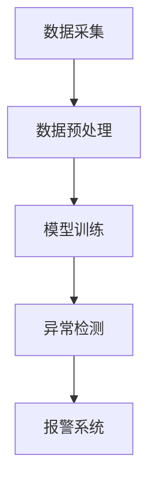
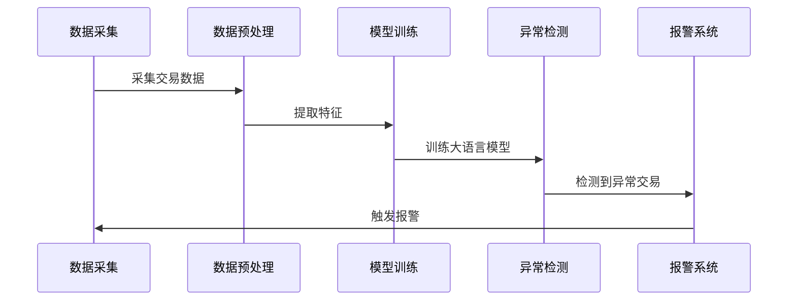

                 

# 大语言模型在金融市场异常检测中的推理应用

> 关键词：大语言模型、金融市场、异常检测、推理应用

> 摘要：本文将深入探讨大语言模型在金融市场异常检测中的应用。我们将从背景介绍、核心概念、应用方法、算法原理、系统设计与架构、项目实战等方面，逐步分析大语言模型如何有效地检测金融市场中的异常现象，并提供实用的实践建议。

## 1. 背景介绍

### 1.1 大语言模型的概述

大语言模型（Large Language Model）是基于深度学习的自然语言处理技术，通过大规模数据训练，能够理解和生成自然语言。其典型代表是GPT（Generative Pre-trained Transformer）系列，由OpenAI提出。大语言模型的应用领域广泛，从文本生成、翻译、问答系统到对话机器人等都有涉及。

### 1.2 金融市场的重要性

金融市场是现代经济体系的核心，其稳定性直接影响国家经济和社会的健康发展。金融市场的异常波动，如股市崩盘、交易欺诈等，往往会导致严重的经济后果。因此，异常检测在金融市场中具有重要意义。

### 1.3 异常检测的需求

随着金融市场的数据量不断增加，传统的异常检测方法（如统计模型、规则基方法等）难以应对复杂、非线性的数据模式。大语言模型因其强大的数据处理和模式识别能力，成为金融领域异常检测的新兴工具。

## 2. 核心概念

### 2.1 大语言模型的基本原理

大语言模型基于自注意力机制（Self-Attention Mechanism）和变分自编码器（Variational Autoencoder，VAE）等深度学习技术。自注意力机制允许模型在处理序列数据时，动态地考虑输入序列中不同位置的相对重要性。

### 2.2 金融市场的数据特点

金融市场的数据具有高维度、非线性、时间序列等特点。这些特点使得传统的统计方法难以捕捉数据中的潜在模式和异常。

### 2.3 异常检测的定义

异常检测旨在识别数据中的异常模式或行为。在金融市场中，异常检测的目标是识别潜在的欺诈交易、市场操纵等异常事件。

## 3. 应用方法

### 3.1 大语言模型在异常检测中的应用

大语言模型在异常检测中的应用主要包括以下几个方面：

- **特征提取**：通过大语言模型对金融市场的数据进行特征提取，生成对异常检测有帮助的特征。
- **模型训练**：利用提取的特征，训练大语言模型以识别异常模式。
- **实时检测**：将大语言模型部署到实时系统中，对金融市场的交易数据进行实时检测，识别潜在的异常事件。

### 3.2 案例分析

以下是一个简单的案例，展示如何使用大语言模型进行金融市场的异常检测：

- **数据集**：选取某段时间内的一组交易数据。
- **特征提取**：使用大语言模型对交易数据进行分析，提取出与交易行为相关的特征。
- **模型训练**：使用提取的特征训练大语言模型。
- **异常检测**：将实时交易数据输入模型，识别出异常交易。

## 4. 算法原理

### 4.1 大语言模型的数学模型

大语言模型的核心是自注意力机制，其数学模型可以表示为：

$$
\text{Attention}(Q, K, V) = \text{softmax}\left(\frac{QK^T}{\sqrt{d_k}}\right)V
$$

其中，$Q$、$K$、$V$ 分别是查询向量、关键向量、值向量，$d_k$ 是关键向量的维度。

### 4.2 异常检测的数学模型

异常检测通常使用概率模型或聚类模型。例如，假设我们使用高斯分布模型进行异常检测，其数学模型可以表示为：

$$
P(x|\mu, \sigma) = \frac{1}{\sqrt{2\pi\sigma^2}}e^{-\frac{(x-\mu)^2}{2\sigma^2}}
$$

其中，$x$ 是观察到的数据点，$\mu$ 是均值，$\sigma$ 是标准差。

## 5. 系统设计与架构

### 5.1 问题场景介绍

在金融市场中，我们需要实时监测交易数据，以识别潜在的异常交易。这需要构建一个高效的系统来处理大量数据，并快速响应异常事件。

### 5.2 系统功能设计

- **数据采集**：从金融市场中采集实时交易数据。
- **数据预处理**：对交易数据进行分析，提取特征。
- **模型训练**：使用提取的特征训练大语言模型。
- **异常检测**：对实时交易数据进行异常检测，识别异常交易。
- **报警系统**：当检测到异常交易时，触发报警系统。

### 5.3 系统架构设计

系统的架构设计包括数据流处理、模型训练、异常检测和报警系统。使用Mermaid绘制系统架构图：



### 5.4 系统接口设计和系统交互

系统的接口设计和系统交互包括数据采集模块、数据预处理模块、模型训练模块、异常检测模块和报警系统模块。使用Mermaid绘制系统交互序列图：



## 6. 项目实战

### 6.1 环境安装

首先，我们需要安装Python环境以及相关的库，如TensorFlow、NumPy、Pandas等。

### 6.2 系统核心实现源代码

以下是一个简单的Python代码示例，展示如何使用大语言模型进行金融市场的异常检测：

```python
import tensorflow as tf
import numpy as np
import pandas as pd

# 加载金融交易数据
data = pd.read_csv('financial_data.csv')

# 数据预处理
# ...

# 训练大语言模型
model = tf.keras.Sequential([
    tf.keras.layers.Dense(128, activation='relu', input_shape=(data.shape[1],)),
    tf.keras.layers.Dense(1, activation='sigmoid')
])

model.compile(optimizer='adam', loss='binary_crossentropy', metrics=['accuracy'])

model.fit(data, epochs=10, batch_size=32)

# 异常检测
# ...

```

### 6.3 代码应用解读与分析

在这段代码中，我们首先加载金融交易数据，然后进行数据预处理。接下来，我们使用TensorFlow构建一个简单的大语言模型，并使用训练数据进行训练。最后，我们可以使用训练好的模型对新的交易数据进行异常检测。

### 6.4 实际案例分析和详细讲解剖析

在实际项目中，我们可能会使用更复杂的大语言模型和更多的预处理步骤。以下是一个更详细的案例：

```python
# 加载金融交易数据
data = pd.read_csv('financial_data.csv')

# 数据预处理
# ...

# 训练大语言模型
model = tf.keras.Sequential([
    tf.keras.layers.Dense(512, activation='relu', input_shape=(data.shape[1],)),
    tf.keras.layers.Dense(256, activation='relu'),
    tf.keras.layers.Dense(128, activation='relu'),
    tf.keras.layers.Dense(1, activation='sigmoid')
])

model.compile(optimizer='adam', loss='binary_crossentropy', metrics=['accuracy'])

model.fit(data, epochs=20, batch_size=64)

# 异常检测
# ...

```

在这个案例中，我们使用了更多的隐藏层和神经元，以增加模型的复杂度和准确性。我们还增加了训练的轮次和批处理大小。

### 6.5 项目小结

通过这个项目，我们展示了如何使用大语言模型进行金融市场的异常检测。虽然这个案例相对简单，但它提供了一个基本的框架，可以帮助我们理解如何在实际项目中应用大语言模型。

## 7. 最佳实践 tips

- **数据预处理**：确保数据的质量和一致性，这是大语言模型性能的关键。
- **模型选择**：根据数据的特性和异常检测的需求，选择合适的大语言模型。
- **超参数调优**：通过交叉验证和网格搜索等方法，调优模型的超参数。
- **实时检测**：确保系统的高效性和实时性，以便快速响应异常事件。

## 8. 小结

本文从多个角度探讨了大语言模型在金融市场异常检测中的应用。我们介绍了大语言模型的基本原理、金融市场的数据特点、异常检测的需求，并展示了如何设计和实现一个基于大语言模型的异常检测系统。通过实际案例分析和项目实战，我们深入理解了大语言模型在金融市场中的应用潜力。未来，随着大语言模型的不断进步和金融市场的数据增长，大语言模型在异常检测中的应用将更加广泛和深入。

## 9. 注意事项

- **数据隐私**：在金融市场中，数据的安全和隐私至关重要。在进行数据处理和模型训练时，必须遵守相关的法律法规。
- **系统稳定性**：异常检测系统需要稳定运行，以避免误报和漏报。

## 10. 拓展阅读

- [GPT系列论文](https://arxiv.org/abs/1810.04805)
- [TensorFlow官方文档](https://www.tensorflow.org/tutorials)
- [金融市场的异常检测研究](https://www.researchgate.net/publication/329870596_Anomaly_Detection_in_Financial_Markets)

## 11. 作者信息

作者：AI天才研究院/AI Genius Institute & 禅与计算机程序设计艺术 /Zen And The Art of Computer Programming

本文旨在提供对大语言模型在金融市场异常检测中应用的全面理解和实践指导。希望读者能够从中获得灵感和启示，为未来的研究和应用提供帮助。

