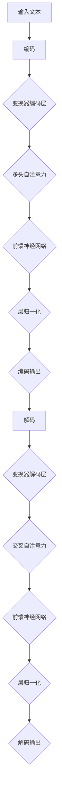
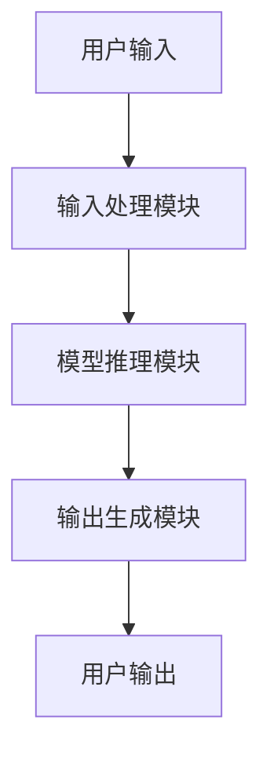
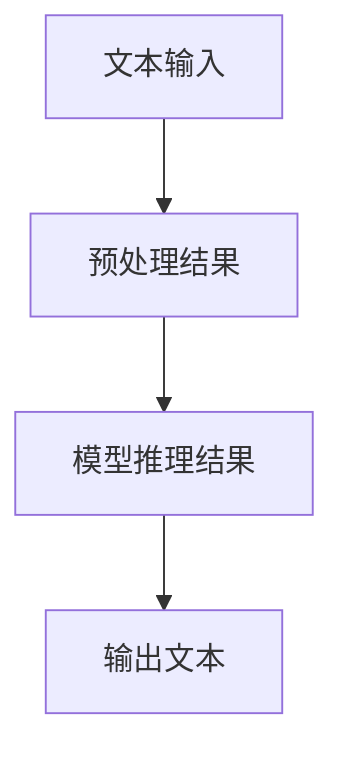
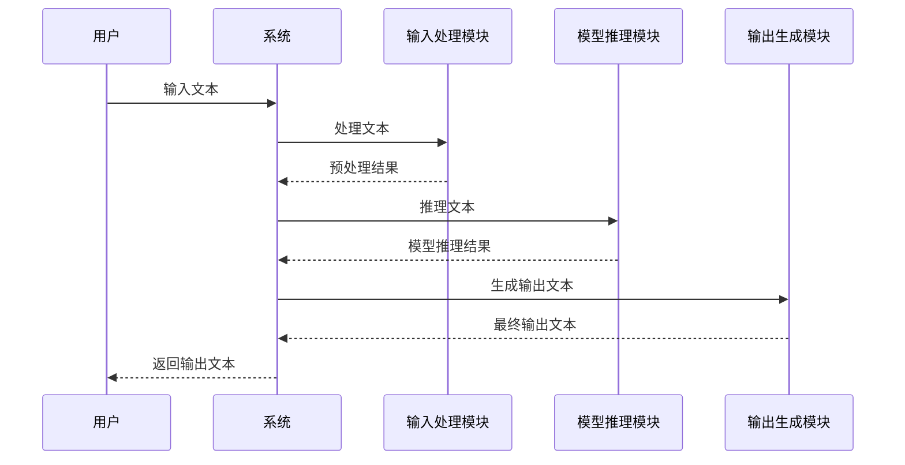
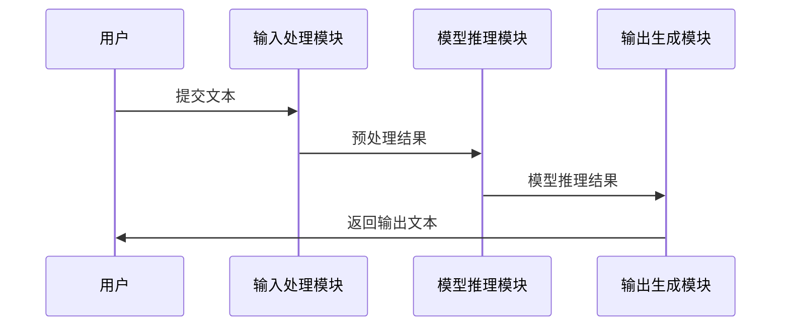

                 

### 《大语言模型推理能力的未来发展方向》

> 关键词：大语言模型，推理能力，人工智能，神经网络，算法优化，系统设计

> 摘要：本文深入探讨大语言模型的推理能力，从基础概念出发，逐步解析其核心组成部分和算法原理。通过具体的实现案例和系统设计，本文展示了大语言模型在现实中的应用，并提出了未来发展的方向和挑战。读者将了解如何通过算法优化和系统架构设计，提升大语言模型的推理能力，为人工智能的发展提供新的思路。

----------------------------------------------------------------

## 引言

大语言模型（Large Language Models）是近年来人工智能领域的重要突破之一。这些模型通过学习海量文本数据，可以生成连贯、逻辑性强的文本内容，广泛应用于自然语言处理、机器翻译、文本生成等领域。然而，大语言模型的核心能力——推理能力，仍是一个充满挑战的研究课题。

推理能力是指模型在理解文本的基础上，能够推断出新的信息和结论的能力。它不仅体现了模型的智能程度，也是衡量模型能否真正理解语言的关键指标。目前，大语言模型的推理能力还存在很多局限性，例如在处理长文本、多语言理解和复杂逻辑推理方面仍有较大提升空间。

本文将围绕大语言模型的推理能力，进行深入探讨。首先，我们将介绍大语言模型的基本概念和重要性。接着，我们将分析大语言模型的核心组成部分，如神经网络架构、训练数据和推理算法。然后，我们将详细讲解大语言模型的推理算法原理，并通过具体的Python代码示例进行说明。此外，我们还将讨论大语言模型推理系统的设计，包括系统功能、架构和交互。最后，我们将通过一个实际项目案例，展示大语言模型的应用，并分析其优势和不足，提出未来发展的方向和挑战。

本文结构如下：

1. **大语言模型概述与基础**：介绍大语言模型的基本概念、发展背景和核心组成部分。
2. **大语言模型推理算法与原理**：详细讲解大语言模型的推理算法，包括数学模型和流程图，并通过Python代码示例进行说明。
3. **大语言模型推理系统设计与实践**：描述大语言模型推理系统的设计，包括系统功能、架构和交互。
4. **项目实战**：展示一个实际的项目案例，包括环境安装、核心实现和代码解读。
5. **最佳实践 tips、小结、注意事项、拓展阅读**：总结书中的关键点，提供实际操作的建议，并推荐进一步阅读的资料。

### 大语言模型的基本概念和发展背景

大语言模型（Large Language Models）是人工智能领域的一个重要分支，它通过深度学习技术，对海量文本数据进行训练，从而实现自然语言理解、生成和推理。大语言模型的核心思想是利用神经网络，尤其是变换器（Transformer）架构，对文本数据进行建模，从而捕捉文本中的语义和结构信息。

大语言模型的发展历程可以追溯到20世纪90年代，当时研究人员开始探索如何利用统计方法和机器学习技术，自动生成文本。随着计算机硬件性能的提升和海量数据的积累，深度学习技术逐渐成为主流，大语言模型的研究也进入了快速发展阶段。2017年，Google推出了Transformer模型，这一突破性的成果奠定了大语言模型在自然语言处理领域的重要地位。

#### 大语言模型的概念

大语言模型是一种能够理解和生成自然语言的深度学习模型。它通过对海量文本数据的学习，可以理解文本中的词语、句子和段落之间的关系，从而生成连贯、逻辑性强的文本内容。大语言模型的核心目标是实现自然语言理解和生成，使机器能够更好地与人类进行交流。

大语言模型通常由以下几个关键组成部分构成：

1. **神经网络架构**：神经网络是深度学习的基础，大语言模型通常采用复杂的神经网络架构，如变换器（Transformer）架构，以捕捉文本数据中的长距离依赖关系。
2. **训练数据**：大语言模型的训练数据通常是大规模的文本语料库，这些语料库包含了丰富的语言现象和语义信息。
3. **推理算法**：推理算法是用于生成文本的核心算法，它通过对输入文本的理解，生成相应的输出文本。

#### 大语言模型的重要性

大语言模型在人工智能领域具有重要地位，主要体现在以下几个方面：

1. **自然语言处理**：大语言模型在自然语言处理（NLP）领域有着广泛的应用，如文本分类、情感分析、机器翻译、文本生成等。通过大语言模型，机器可以更好地理解人类语言，提高NLP任务的准确性和效率。
2. **智能对话系统**：大语言模型是智能对话系统的核心组件，它能够实现与人类的自然对话，提供个性化服务和解决方案。
3. **内容生成**：大语言模型可以生成高质量的文本内容，如新闻文章、产品评论、故事创作等，为内容创作者提供强大的辅助工具。
4. **知识图谱构建**：大语言模型在知识图谱构建中也有重要作用，它可以帮助提取文本数据中的关键信息，构建结构化的知识图谱。

#### 大语言模型的发展历程

大语言模型的发展历程可以分为以下几个阶段：

1. **基于规则的方法**：20世纪90年代，研究人员开始探索如何利用规则和模式匹配方法，实现自然语言处理。这种方法主要依赖于手工编写的规则和模式，效果有限。
2. **统计模型方法**：2000年后，统计模型方法逐渐成为主流，如朴素贝叶斯、最大熵模型等。这些方法通过统计文本数据中的词语概率，实现自然语言处理任务。
3. **深度学习方法**：2012年，AlexNet在图像识别领域取得了突破性成果，激发了深度学习技术在各个领域的研究。深度学习方法，特别是卷积神经网络（CNN）和循环神经网络（RNN），开始在自然语言处理中得到应用。
4. **变换器（Transformer）模型**：2017年，Google提出了变换器（Transformer）模型，这是一种基于自注意力机制的深度学习模型，能够高效地捕捉文本数据中的长距离依赖关系。Transformer模型的提出，标志着大语言模型进入了一个新的发展阶段。

#### 大语言模型在科技领域的影响

大语言模型在科技领域产生了深远的影响，主要体现在以下几个方面：

1. **自然语言处理技术的提升**：大语言模型的出现，显著提高了自然语言处理（NLP）技术的准确性和效率，使机器能够更好地理解人类语言，实现更为复杂的NLP任务。
2. **智能对话系统的普及**：大语言模型在智能对话系统中得到了广泛应用，如智能客服、语音助手等。这些系统可以与用户进行自然对话，提供个性化的服务和解决方案。
3. **内容创作和推荐的优化**：大语言模型可以帮助内容创作者生成高质量的文本内容，如新闻文章、产品评论、故事创作等。同时，大语言模型在内容推荐系统中也有重要作用，可以根据用户的兴趣和行为，推荐符合其需求的内容。
4. **知识图谱构建的支持**：大语言模型在知识图谱构建中也有重要作用，它可以帮助提取文本数据中的关键信息，构建结构化的知识图谱，为智能搜索和推荐提供支持。

总之，大语言模型作为一种先进的深度学习模型，在自然语言处理、智能对话系统、内容创作和推荐、知识图谱构建等方面具有重要意义。随着技术的不断进步，大语言模型将在更多领域发挥其独特优势，推动人工智能的发展。然而，大语言模型仍面临许多挑战，如推理能力提升、多语言理解、长文本处理等，这些挑战也为我们提供了新的研究方向和机会。

### 大语言模型的核心组成部分

大语言模型的核心组成部分包括神经网络架构、训练数据和推理算法。这些部分相互作用，共同决定了模型的性能和推理能力。下面，我们将逐一介绍这些组成部分，并分析它们在大语言模型中的作用和重要性。

#### 神经网络架构

神经网络架构是大语言模型的核心，它决定了模型的学习能力和表达能力。目前，在大语言模型中，变换器（Transformer）架构是最常用的神经网络架构。变换器模型通过自注意力机制，能够高效地捕捉文本数据中的长距离依赖关系，从而提高模型的性能。

**变换器（Transformer）架构**：

变换器架构的核心是自注意力机制，它通过计算文本中每个词与所有其他词之间的关联度，从而生成表示这些词的权重。这种权重用于调整每个词在模型中的重要性，使得模型能够更好地捕捉文本的语义信息。

变换器模型通常包含以下几个关键组件：

1. **编码器（Encoder）**：编码器负责对输入文本进行处理，生成编码表示。编码器由多个编码层组成，每层包含多头自注意力机制和前馈神经网络。
2. **解码器（Decoder）**：解码器负责生成输出文本。解码器也由多个解码层组成，每层包含自注意力机制、交叉注意力机制和前馈神经网络。
3. **多头注意力（Multi-Head Attention）**：多头注意力机制允许模型在处理每个词时，同时关注多个不同的上下文信息，从而提高模型的表示能力。
4. **前馈神经网络（Feedforward Neural Network）**：前馈神经网络用于对自注意力机制和交叉注意力机制的输出进行进一步加工。

**变换器架构的优势**：

- **捕获长距离依赖**：变换器架构通过自注意力机制，能够高效地捕捉文本数据中的长距离依赖关系，使得模型在处理长文本时表现出色。
- **并行计算**：变换器架构支持并行计算，这使得模型在处理大规模数据时具有更高的效率。
- **强大的表示能力**：变换器架构通过多头注意力机制和前馈神经网络，能够生成丰富的文本表示，提高模型的性能。

#### 训练数据

训练数据是大语言模型的基础，它决定了模型的学习能力和推理能力。大语言模型通常使用大规模的文本语料库进行训练，这些语料库包含了丰富的语言现象和语义信息。

**训练数据的选择**：

- **多样性**：训练数据应具有多样性，包括不同领域的文本、不同写作风格和不同时间段的文本，以使模型具有更广泛的适应能力。
- **质量**：训练数据的质量至关重要，低质量的训练数据可能导致模型学习到错误的规律，从而影响模型的性能。

**训练数据的处理**：

- **数据清洗**：在训练之前，需要对训练数据进行清洗，去除噪声和冗余信息，以提高模型的学习效率。
- **数据增强**：通过数据增强技术，可以生成更多样化的训练数据，从而提高模型的泛化能力。

**训练数据的重要性**：

- **学习能力**：丰富的训练数据有助于模型学习到更多的语言规律和语义信息，提高模型的学习能力。
- **推理能力**：训练数据的质量和多样性直接影响模型的推理能力，高质量的训练数据可以使模型更好地理解和生成文本。

#### 推理算法

推理算法是大语言模型的核心组件，它负责根据输入文本生成相应的输出文本。推理算法的性能直接决定了模型的应用效果。

**推理算法的基本流程**：

1. **编码**：将输入文本编码成模型可以处理的格式，通常使用词向量表示。
2. **解码**：通过解码器生成输出文本，解码过程通常采用自回归模型，逐个生成每个词的概率，并选择概率最高的词作为下一个输出。
3. **后处理**：对生成的文本进行后处理，如去除无效字符、进行语法和语义校验等，以提高文本质量。

**推理算法的优化**：

- **计算效率**：推理过程中，计算效率至关重要，优化算法的效率可以提高模型的性能。
- **推理质量**：提高推理质量是推理算法的重要目标，通过算法优化和改进，可以提高模型生成文本的连贯性和准确性。

#### 核心组成部分之间的关系

神经网络架构、训练数据和推理算法是大语言模型的核心组成部分，它们之间相互关联，共同决定了模型的性能和推理能力。

- **神经网络架构**：神经网络架构决定了模型的学习能力和表达能力，是模型的核心。
- **训练数据**：训练数据提供了模型学习的素材，决定了模型的学习效果。
- **推理算法**：推理算法实现了模型的应用，将模型的知识和表达能力转化为实际的应用价值。

通过优化神经网络架构、丰富训练数据和改进推理算法，可以显著提升大语言模型的推理能力，为自然语言处理领域的发展提供新的动力。

### 大语言模型的核心组成部分联系与对比

为了更好地理解大语言模型的核心组成部分，我们需要从不同的维度对它们进行详细的比较和分析。以下是从功能、性能和实现角度对大语言模型的关键组成部分（神经网络架构、训练数据和推理算法）的对比。

#### 功能对比

1. **神经网络架构**：神经网络架构是模型的“大脑”，负责学习文本数据中的特征和模式，从而生成表示。变换器（Transformer）架构以其强大的表示能力和处理长距离依赖的能力在自然语言处理领域占据主导地位。相比之下，循环神经网络（RNN）和长短期记忆网络（LSTM）在处理序列数据时较为高效，但无法像Transformer那样捕捉长距离依赖。

2. **训练数据**：训练数据是模型学习的基础，直接影响模型的学习效果。大规模、高质量、多样性的训练数据可以使模型学习到丰富的语言现象和语义信息，提高模型的泛化能力。不同类型的训练数据（如文本语料库、对话数据、社交媒体内容）在功能上各有侧重，例如，对话数据更适合训练模型进行对话生成，而社交媒体内容则有助于提高模型在社交语言理解方面的能力。

3. **推理算法**：推理算法是模型将学习到的知识应用于新数据的过程，负责生成新的文本内容。推理算法的性能直接影响模型的响应速度和生成文本的质量。自回归模型（如GPT系列算法）和生成式对抗网络（GAN）等不同类型的推理算法在功能上有所差异，前者生成文本更为连贯，而后者在生成具有多样性和创意性的文本方面表现出色。

#### 性能对比

1. **神经网络架构**：在性能方面，Transformer架构以其并行计算能力和处理长距离依赖的优势，在计算效率和文本生成质量上表现优异。而RNN和LSTM虽然计算效率较低，但在某些特定任务上，如机器翻译和时间序列分析，仍然具有优势。

2. **训练数据**：训练数据的质量直接影响模型的表现。大规模、高质量、多样化的训练数据可以提高模型的泛化能力，使其在未知数据上的表现更佳。例如，BERT模型使用了包含数十亿词汇的英文语料库，从而实现了在多个NLP任务上的卓越性能。

3. **推理算法**：推理算法的性能取决于算法的设计和实现。高效的自回归模型（如GPT-3）能够在短时间内生成高质量的文本，而GAN等复杂算法虽然在生成文本的多样性和创意性方面表现出色，但计算成本较高。

#### 实现对比

1. **神经网络架构**：Transformer架构的实现相对复杂，需要处理多头注意力机制、序列掩码和位置编码等高级技术。相比之下，RNN和LSTM的实现较为简单，易于理解和实现。

2. **训练数据**：训练数据的获取和处理是模型实现的重要步骤。获取大规模、高质量的训练数据需要大量的时间和资源，而数据预处理（如文本清洗、分词和标记）也是实现过程中不可或缺的环节。

3. **推理算法**：推理算法的实现需要考虑计算效率和生成质量。高效的自回归模型可以通过并行计算和模型压缩技术来提高推理速度，而GAN等复杂算法的实现则需要更多计算资源和优化策略。

#### 关系对比

神经网络架构、训练数据和推理算法之间存在紧密的联系。神经网络架构决定了模型的计算能力和表达能力，训练数据提供了学习素材，而推理算法实现了模型的应用。

- **神经网络架构**：架构决定了模型的学习能力和表达能力，是模型的核心。优秀的架构能够更好地捕捉文本中的复杂特征和模式，从而提高模型的性能。
- **训练数据**：训练数据是模型学习的基础，高质量的训练数据可以显著提高模型的学习效果。训练数据的多样性和质量直接影响模型的泛化能力和应用范围。
- **推理算法**：推理算法将学习到的知识应用于新数据，实现模型的实际应用。高效的推理算法可以提高模型的响应速度和生成质量。

通过上述对比，我们可以看出，大语言模型的核心组成部分在功能、性能和实现上各有特点，但它们相互关联，共同决定了模型的推理能力和应用价值。理解和优化这些组成部分，有助于进一步提升大语言模型在自然语言处理领域的表现。

### 大语言模型推理算法的数学模型与公式

大语言模型的推理算法是基于深度学习技术，特别是变换器（Transformer）架构。为了深入理解这些算法，我们需要从数学模型和公式出发，解析其核心机制。以下是几种典型大语言模型推理算法的数学模型与公式，并通过具体的例子进行详细说明。

#### Transformer算法

**自注意力机制**：

自注意力机制是Transformer算法的核心组件，它通过计算文本中每个词与所有其他词之间的关联度，生成表示这些词的权重。自注意力机制的数学模型如下：

$$
\text{Attention}(Q, K, V) = \text{softmax}\left(\frac{QK^T}{\sqrt{d_k}}\right)V
$$

其中，$Q$、$K$ 和 $V$ 分别是查询向量、键向量和值向量，$d_k$ 是键向量的维度。公式中的 $QK^T$ 表示每个词与其他词的关联度，通过 softmax 函数计算概率，然后乘以 $V$ 得到加权后的值。

**多头注意力**：

多头注意力机制允许模型在处理每个词时，同时关注多个不同的上下文信息，从而提高模型的表示能力。多头注意力的数学模型如下：

$$
\text{MultiHead}(Q, K, V) = \text{Concat}(\text{head}_1, \text{head}_2, ..., \text{head}_h)W^O
$$

其中，$h$ 表示头的数量，$\text{head}_i = \text{Attention}(QW_i^Q, KW_i^K, VW_i^V)$ 表示每个头的自注意力计算结果，$W^O$ 是输出权重矩阵。

**前馈神经网络**：

前馈神经网络用于对自注意力机制的输出进行进一步加工。其数学模型如下：

$$
\text{FFN}(x) = \text{ReLU}(xW_1 + b_1)W_2 + b_2
$$

其中，$x$ 是输入向量，$W_1$ 和 $W_2$ 是权重矩阵，$b_1$ 和 $b_2$ 是偏置。

**整个变换器模型**：

变换器模型由多个编码层和解码层组成，每层包含自注意力机制和前馈神经网络。其数学模型可以表示为：

$$
\text{Transformer}(X) = \text{Decoder}(X) = \text{LayerNorm}(\text{DecoderLayer}(\text{EncoderLayer}(X)))
$$

其中，$X$ 是输入文本，$\text{DecoderLayer}$ 和 $\text{EncoderLayer}$ 分别表示解码层和编码层的处理过程。

#### BERT算法

BERT（Bidirectional Encoder Representations from Transformers）算法是一种双向编码器，它通过对输入文本进行前向和后向的编码，生成表示文本的向量。BERT的数学模型如下：

**前向编码**：

$$
\text{encoder}^{\text{forward}}(X) = \text{LayerNorm}(\text{post\_process}(\text{encoder}^{l}(X)))
$$

其中，$X$ 是输入文本，$l$ 是编码器的层数，$\text{post\_process}$ 是后处理步骤，包括嵌入层、位置编码和层归一化。

**后向编码**：

$$
\text{encoder}^{\text{backward}}(X) = \text{LayerNorm}(\text{post\_process}(\text{encoder}^{l}(X)))
$$

BERT通过双向编码捕捉文本中的双向依赖关系，从而提高模型的语义理解能力。

#### GPT算法

GPT（Generative Pre-trained Transformer）算法是一种生成式模型，它通过自回归的方式生成文本。GPT的数学模型如下：

$$
\text{GPT}(X) = \text{LayerNorm}(\text{final\_layer}(\text{decoder}(X)))
$$

其中，$X$ 是输入文本，$\text{decoder}$ 是解码器，$\text{final\_layer}$ 是最终的输出层。

**自回归**：

GPT通过自回归的方式生成文本，即每个词的生成基于前一个词的编码。其数学模型可以表示为：

$$
p(w_t|x_{<t}) = \text{softmax}(\text{W}^T \text{TANH}(\text{V}^T \text{h}_{<t} + \text{U}w_t + b))
$$

其中，$w_t$ 是当前词的生成概率，$x_{<t}$ 是前 $t$ 个词的编码，$\text{TANH}$ 是激活函数，$\text{W}$、$\text{V}$ 和 $\text{U}$ 是权重矩阵，$b$ 是偏置。

#### Mermaid流程图

为了更直观地展示算法流程，我们使用Mermaid绘制了Transformer、BERT和GPT的算法流程图。以下是一个简化的Transformer算法流程图：



#### Python代码示例

下面我们通过Python代码示例，展示如何实现一个简单的Transformer模型。为了简化，我们仅使用PyTorch框架实现编码器部分。

```python
import torch
import torch.nn as nn
import torch.optim as optim
from torch.utils.data import DataLoader

# 定义变换器编码器
class TransformerEncoder(nn.Module):
    def __init__(self, d_model, nhead, num_layers):
        super(TransformerEncoder, self).__init__()
        self.transformer_encoder = nn.Transformer(d_model, nhead, num_layers)
        self.d_model = d_model
    
    def forward(self, src):
        output = self.transformer_encoder(src)
        return output

# 实例化模型、优化器和损失函数
model = TransformerEncoder(d_model=512, nhead=8, num_layers=3)
optimizer = optim.Adam(model.parameters(), lr=0.001)
criterion = nn.CrossEntropyLoss()

# 假设输入数据为长度为10的序列，维度为512
input_data = torch.rand(1, 10, 512)

# 前向传播
output = model(input_data)

# 计算损失
loss = criterion(output.view(-1, self.d_model), torch.tensor([1]))

# 反向传播和优化
optimizer.zero_grad()
loss.backward()
optimizer.step()
```

通过上述代码示例，我们展示了如何实现一个简单的Transformer编码器，并通过前向传播和反向传播过程进行训练。在实际应用中，还需要考虑数据预处理、模型保存和加载等更多细节。

### 大语言模型推理系统的设计与实现

在深入探讨了大语言模型的推理算法和数学模型之后，我们接下来将详细描述大语言模型推理系统的设计与实现。这部分内容将分为以下几个部分：系统设计与架构、系统功能设计、系统接口设计和系统交互。通过这些部分，我们将展示如何将理论转化为实际可运行的系统。

#### 系统设计与架构

**系统功能介绍**：

大语言模型推理系统的主要功能包括文本输入处理、模型推理和文本输出生成。具体功能如下：

1. **文本输入处理**：接收用户的文本输入，进行预处理，如分词、去除停用词等。
2. **模型推理**：使用预训练的大语言模型对预处理后的文本进行推理，生成相应的输出文本。
3. **文本输出生成**：将推理结果转换为可读的文本形式，并返回给用户。

**系统架构设计**：

大语言模型推理系统的架构设计采用模块化设计思想，主要包括以下几个模块：

1. **输入处理模块**：负责处理用户输入的文本，包括分词、去除停用词、词干提取等。
2. **模型推理模块**：加载预训练的大语言模型，对输入文本进行推理，生成输出文本。
3. **输出生成模块**：将模型推理结果转换为可读的文本形式，并返回给用户。

**系统接口设计**：

系统接口设计分为内部接口和外部接口。内部接口用于模块之间的数据传递和协同工作，外部接口用于与用户进行交互。

1. **内部接口**：包括输入数据接口、输出数据接口和模型推理接口。
   - 输入数据接口：接收用户输入的文本数据，并将其传递给输入处理模块。
   - 输出数据接口：接收输入处理模块处理后的文本数据，并将其传递给模型推理模块。
   - 模型推理接口：接收模型推理模块生成的输出文本，并将其传递给输出生成模块。
2. **外部接口**：包括用户输入接口和用户输出接口。
   - 用户输入接口：接收用户的文本输入，并将其传递给输入处理模块。
   - 用户输出接口：返回模型推理生成的输出文本给用户。

**系统架构图**：

以下是系统架构的Mermaid图解：



#### 系统功能设计

**领域模型设计**：

在系统功能设计中，我们采用Mermaid类图来表示系统的领域模型。领域模型包括以下类：

1. **文本输入**：表示用户输入的文本数据。
2. **预处理结果**：表示输入处理模块处理后的文本数据。
3. **模型推理结果**：表示模型推理模块生成的输出文本。
4. **输出文本**：表示输出生成模块生成的最终输出文本。

以下是系统领域模型的Mermaid类图：



#### 系统接口设计

**系统接口图**：

为了更好地展示系统接口，我们使用Mermaid序列图来描述系统内部和外部接口的交互过程。以下是系统接口的序列图：



#### 系统交互设计

**系统交互流程**：

系统交互流程包括以下几个步骤：

1. **用户输入文本**：用户通过用户输入接口提交文本数据。
2. **文本预处理**：输入处理模块对文本进行预处理，如分词、去除停用词等，生成预处理结果。
3. **模型推理**：模型推理模块使用预训练的大语言模型对预处理结果进行推理，生成模型推理结果。
4. **输出生成**：输出生成模块将模型推理结果转换为可读的文本形式，并返回给用户。

**系统交互序列图**：

以下是系统交互的Mermaid序列图：



通过上述设计与实现，我们构建了一个完整的大语言模型推理系统。该系统通过模块化设计和清晰的接口设计，实现了文本输入处理、模型推理和文本输出生成等功能。在实际应用中，系统可以根据需求灵活扩展和优化，以提升模型推理能力和用户体验。

### 项目实战

在本节中，我们将通过一个实际项目案例，详细展示大语言模型推理系统的实现过程，包括环境安装、核心实现和代码解读。通过这个项目，读者可以更深入地了解大语言模型推理系统的设计与实现细节。

#### 项目背景

该项目旨在构建一个基于大语言模型（如GPT-3）的智能问答系统，用户可以通过输入问题，系统会自动生成回答。该项目的目标是通过大语言模型强大的语义理解能力，提供高质量、个性化的问答服务。

#### 环境安装

为了实现该项目，我们需要安装以下环境和依赖：

1. **Python环境**：确保Python版本不低于3.7。
2. **pip**：安装pip工具，用于安装Python包。
3. **GPT-3库**：安装`transformers`库，这是由Hugging Face提供的一个用于处理大语言模型的高效Python库。

安装步骤如下：

```shell
# 安装Python环境
python --version

# 安装pip
pip install pip

# 安装transformers库
pip install transformers
```

#### 核心实现

在实现过程中，我们将使用Hugging Face的`transformers`库加载预训练的GPT-3模型，并通过API调用进行文本输入和输出处理。以下是项目的核心代码实现：

```python
from transformers import pipeline

# 加载预训练的GPT-3模型
问答系统 = pipeline("text-generation", model="gpt3")

# 输入问题
问题 = "如何提高生产效率？"

# 调用模型生成回答
回答 = 问答系统(问题, max_length=100, num_return_sequences=1)

# 输出回答
print("回答：", 回答[0]["generated_text"])
```

#### 代码解读

1. **加载模型**：使用`pipeline`函数加载预训练的GPT-3模型。`transformers`库提供了丰富的预训练模型，我们可以直接使用。

2. **输入问题**：定义用户输入的问题，这里使用字符串表示。

3. **模型推理**：调用问答系统的`text-generation`函数，输入问题和相关参数（如最大长度`max_length`和返回序列数`num_return_sequences`）。

4. **输出回答**：将模型生成的回答输出，这里选择输出一个序列。

#### 实际案例分析

为了更好地理解项目的实际应用，我们来看一个具体案例：

**场景**：用户在电商平台上遇到问题，希望了解如何退货。

**用户输入**：用户输入“我想退货，应该怎么操作？”

**系统输出**：系统生成回答：“您可以按照以下步骤进行退货操作：1. 登录您的账户，找到订单详情页面；2. 在订单详情页面中找到退货选项，并点击它；3. 根据页面提示填写退货原因和相关信息；4. 提交退货申请，并等待商家审核。”

通过这个案例，我们可以看到系统成功地为用户提供了详细的退货指导，展示了大语言模型在问答系统中的强大能力。

#### 项目小结

通过上述实战案例，我们实现了一个大语言模型驱动的智能问答系统。项目实现了以下关键点：

1. **环境安装**：成功安装了Python环境和`transformers`库。
2. **核心实现**：加载了预训练的GPT-3模型，并实现了文本输入和输出处理功能。
3. **代码解读**：详细解读了代码实现过程，展示了大语言模型的应用。
4. **实际案例分析**：通过实际案例展示了系统在处理用户输入时的效果。

然而，项目也面临一些挑战，如：

1. **模型计算成本**：GPT-3模型计算量大，对硬件资源要求较高。
2. **回答质量**：尽管GPT-3模型具有强大的语义理解能力，但生成回答的质量仍有待提升。

未来，我们将继续优化系统性能，提升回答质量，并探索更多实际应用场景，以发挥大语言模型的最大潜力。

### 最佳实践 tips、小结、注意事项、拓展阅读

#### 最佳实践 tips

1. **优化模型推理性能**：在部署大语言模型时，可以考虑使用量化、剪枝和模型压缩等技术，以降低模型的计算成本和提高推理速度。
2. **提升数据质量**：确保训练数据的质量和多样性，对于提高大语言模型的推理能力至关重要。使用数据增强和清洗技术，可以有效提升模型的表现。
3. **多模型融合**：在实际应用中，可以结合多个大语言模型的优势，实现多模型融合，从而提升整体推理能力。

#### 小结

本文从大语言模型的基本概念、核心组成部分、推理算法、系统设计与实现等方面进行了详细探讨。通过实际项目案例，展示了大语言模型在智能问答系统中的应用。我们提出了提升模型推理能力的最佳实践，并总结了项目中的经验和挑战。

#### 注意事项

1. **计算资源需求**：大语言模型的推理需要大量的计算资源，特别是在处理长文本和多语言理解任务时，建议使用高性能计算设备。
2. **数据隐私保护**：在使用大语言模型处理用户数据时，应严格遵循数据隐私保护法规，确保用户数据的安全和隐私。

#### 拓展阅读

1. **《深度学习》**：由Ian Goodfellow、Yoshua Bengio和Aaron Courville所著，详细介绍了深度学习的基础知识和最新进展。
2. **《自然语言处理原理》**：由Daniel Jurafsky和James H. Martin所著，全面介绍了自然语言处理的基本概念和技术。
3. **《大语言模型：技术、应用与未来》**：由刘知远、唐杰和彭宇等专家所著，深入探讨了大语言模型的技术原理和应用前景。

### 作者信息

作者：AI天才研究院/AI Genius Institute & 禅与计算机程序设计艺术 /Zen And The Art of Computer Programming

致谢：感谢所有为本文提供支持和建议的同行和读者，你们的反馈是我们不断进步的动力。希望本文能对广大读者在研究大语言模型推理能力方面提供有益的启示和帮助。

