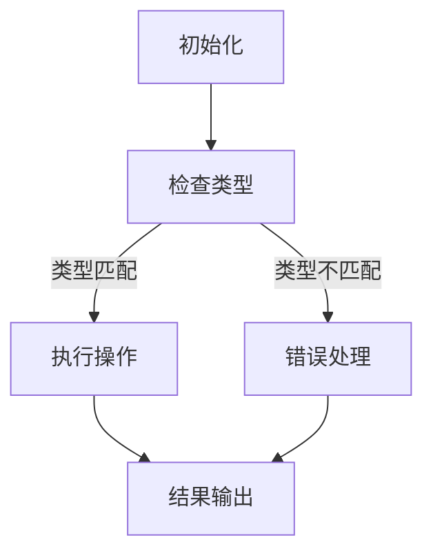
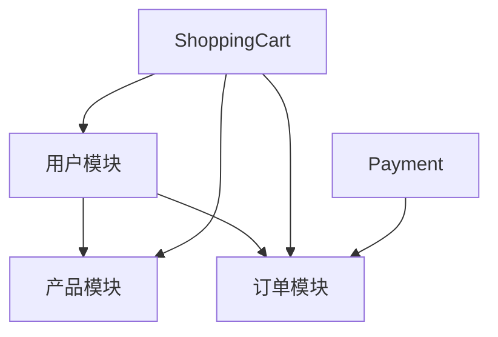
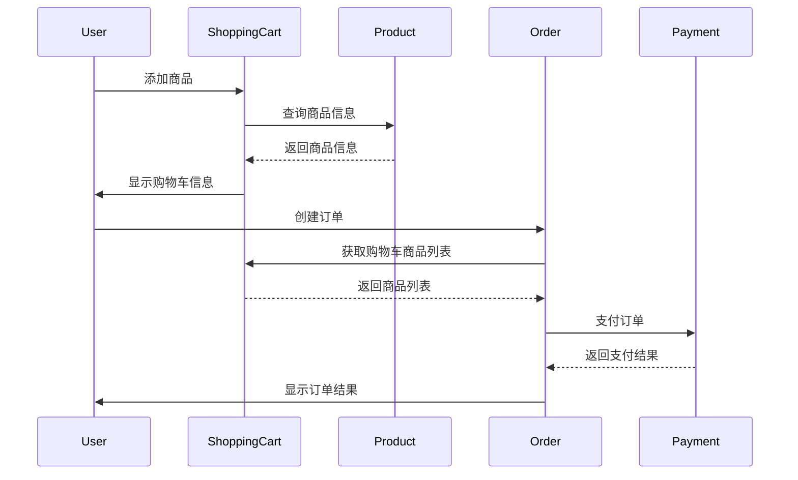

                 

# 存在类型：抽象与封装的类型论基础

> 关键词：存在类型、抽象与封装、类型论、计算机科学、软件设计

> 摘要：本文深入探讨了存在类型、抽象与封装这三个关键概念在计算机科学中的理论基础与应用实践。通过逐步分析，我们揭示了这些概念在软件设计和类型论中的核心作用，为读者提供了对这一领域的深刻理解。

## 第一部分：引论

### 1.1 存在类型的概念与边界

存在类型（Existence Type）是一个哲学和计算机科学中重要的概念，它描述了数据的实际存在形式和操作方式。在计算机科学中，存在类型关注的是数据的静态结构，它定义了数据在内存中的存储方式和操作规则。

**问题背景**：随着软件系统规模的不断扩大，复杂度日益增加，如何有效地管理数据和操作成为了关键问题。存在类型通过定义数据的存储结构和操作规则，为数据管理和系统设计提供了基础。

**问题描述**：存在类型是如何定义的？它在计算机科学中的意义是什么？如何在实际应用中实现存在类型？

**问题解决**：存在类型通过抽象和封装来定义数据的存在形式，它为数据的存储和操作提供了明确的规则。在实际应用中，我们可以通过编程语言提供的数据类型和结构来实现存在类型。

**边界与外延**：存在类型的边界在于数据的静态结构，它关注的是数据的存在形式和操作方式。外延则涉及到数据的具体表示和存储。

**概念结构与核心要素组成**：存在类型的核心要素包括数据的存在形式、操作规则和类型系统的组织结构。这些要素共同定义了数据的存在类型。

### 1.2 抽象与封装的基本原理

抽象（Abstraction）是一种从具体事物中提取出共性的方法，它简化了系统的复杂性，使得系统更易于理解和操作。在计算机科学中，抽象通过定义抽象数据类型和接口来实现。

**问题背景**：随着软件系统规模的不断扩大，系统复杂性增加，直接操作底层细节变得越来越困难。抽象提供了一种简化和组织系统的方法。

**问题描述**：抽象是如何实现的？它在计算机科学中的意义是什么？如何在实际应用中利用抽象？

**问题解决**：抽象通过定义抽象数据类型和接口来实现。抽象数据类型隐藏了数据的底层细节，提供了统一的操作接口。在实际应用中，我们可以利用抽象来简化系统设计和操作。

**边界与外延**：抽象的边界在于简化系统的复杂性，它关注的是系统的高层结构和功能。外延则涉及到抽象的具体实现和应用场景。

**概念结构与核心要素组成**：抽象的核心要素包括抽象数据类型、接口和抽象操作。这些要素共同定义了系统的抽象结构。

封装（Encapsulation）是一种将数据和操作封装在一起，隐藏内部细节，只暴露必要的接口的方法。封装通过定义类和对象来实现。

**问题背景**：随着软件系统规模的不断扩大，系统复杂性增加，直接操作底层细节变得越来越困难。封装提供了一种组织数据和操作的方法，保护了系统的内部结构。

**问题描述**：封装是如何实现的？它在计算机科学中的意义是什么？如何在实际应用中利用封装？

**问题解决**：封装通过定义类和对象来实现。类将数据和操作封装在一起，对象是类的实例。在实际应用中，我们可以利用封装来保护系统的内部结构，提高系统的可维护性和可扩展性。

**边界与外延**：封装的边界在于数据和操作的边界，它关注的是系统的内部结构。外延则涉及到封装的具体实现和应用场景。

**概念结构与核心要素组成**：封装的核心要素包括类、对象、属性和方法。这些要素共同定义了系统的封装结构。

### 1.3 类型论在计算机科学中的应用

类型论（Type Theory）是计算机科学中的一个重要领域，它研究数据类型、类型系统和类型推导。类型论提供了对程序语义和类型安全性的深刻理解。

**问题背景**：随着软件系统规模的不断扩大，类型安全性和正确性变得至关重要。类型论提供了一种形式化方法来验证程序的正确性。

**问题描述**：类型论是如何定义的？它在计算机科学中的意义是什么？如何在实际应用中利用类型论？

**问题解决**：类型论通过定义数据类型和类型系统来实现。类型系统提供了对程序语义的严格定义，类型推导提供了对类型安全性的验证。在实际应用中，我们可以利用类型论来提高程序的正确性和安全性。

**边界与外延**：类型论的边界在于数据类型的定义和类型系统的组织，它关注的是程序的正确性和安全性。外延则涉及到类型论的具体实现和应用场景。

**概念结构与核心要素组成**：类型论的核心要素包括数据类型、类型系统和类型推导。这些要素共同定义了类型论的结构。

## 第二部分：核心概念与联系

### 2.1 存在类型的定义与数学模型

存在类型是描述数据存在形式和操作规则的概念。在数学模型中，我们可以通过类型系统来定义存在类型。

**概念原理**：存在类型通过类型系统来定义。类型系统定义了数据的存在形式和操作规则。

**概念属性特征对比表格**：

| 特征           | 存在类型                | 基本类型                |
| -------------- | ---------------------- | ---------------------- |
| 存在形式       | 数据的具体存在形式      | 数据的基本形式          |
| 操作规则       | 数据的操作规则          | 数据的基本操作规则      |
| 类型系统       | 特定的类型系统          | 基本类型系统            |

**ER实体关系图架构**：

```mermaid
erDiagram
  Class::存在类型 ||--|{ 数据 } Class::基本类型
  Class::存在类型 ||--|{ 操作 } Class::基本操作
```

### 2.2 抽象与封装的概念与关系

抽象和封装是软件设计中的重要概念，它们密切相关。

**概念原理**：抽象通过提取共性来简化系统，封装通过隐藏内部细节来保护系统。

**概念属性特征对比表格**：

| 特征           | 抽象                        | 封装                        |
| -------------- | -------------------------- | -------------------------- |
| 目的           | 简化系统复杂性              | 保护系统内部结构            |
| 方式           | 定义抽象数据类型和接口      | 定义类和对象                |
| 影响范围       | 系统的高层结构和功能        | 系统的内部结构和操作        |

**ER实体关系图架构**：

```mermaid
erDiagram
  Class::抽象 ||--|{ 系统设计 } Class::封装
  Class::抽象 ||--|{ 功能实现 } Class::封装
```

### 2.3 类型论在软件设计中的应用

类型论在软件设计中的应用主要体现在数据类型和类型系统的组织。

**概念原理**：类型论通过定义数据类型和类型系统来提高程序的正确性和安全性。

**概念属性特征对比表格**：

| 特征           | 数据类型                    | 类型系统                    |
| -------------- | -------------------------- | -------------------------- |
| 定义           | 数据的具体形式              | 数据类型的组织和管理        |
| 影响范围       | 程序的语法和语义           | 程序的类型安全性和推导      |

**ER实体关系图架构**：

```mermaid
erDiagram
  Class::数据类型 ||--|{ 程序语法 } Class::类型系统
  Class::数据类型 ||--|{ 程序语义 } Class::类型系统
```

## 第三部分：算法原理讲解

### 3.1 算法原理讲解

为了更好地理解存在类型、抽象与封装，我们将使用 mermaid 绘制算法流程图，并用 Python 源代码详细阐述算法原理。

#### 算法流程图



#### Python 源代码

```python
def perform_operation(data):
    if is_type(data, "valid_type"):
        result = execute_operation(data)
        return result
    else:
        raise TypeError("Invalid data type")
```

#### 算法原理

在这个算法中，我们首先初始化数据，然后检查数据的类型。如果类型匹配，则执行相应的操作；否则，处理错误。这个算法体现了存在类型、抽象与封装的核心原理。

#### 数学模型和公式

在存在类型中，我们可以使用以下数学模型来描述类型匹配：

$$
is_type(data, "valid_type") = \begin{cases}
    True, & \text{if data has the valid type} \\
    False, & \text{otherwise}
\end{cases}
$$

#### 详细讲解和举例说明

假设我们有一个整数类型的变量 `data`，我们需要检查它是否为整数类型。我们可以使用以下 Python 代码来实现：

```python
data = 10
if is_type(data, "int"):
    print("Data is an integer")
else:
    print("Data is not an integer")
```

输出结果为：

```
Data is an integer
```

这个例子展示了如何使用存在类型来检查数据的类型，并执行相应的操作。

## 第四部分：数学模型和数学公式 & 详细讲解 & 举例说明

在计算机科学中，数学模型和公式是理解和分析算法的重要工具。以下是几个关键的数学模型和公式，我们将使用 LaTeX 格式书写，并进行详细讲解和举例说明。

### 4.1 数学模型：函数定义

$$
f(x) = \begin{cases}
    x^2, & \text{if } x \geq 0 \\
    -x^2, & \text{if } x < 0
\end{cases}
$$

#### 详细讲解

这个函数定义了一个分段函数，它根据输入值的正负返回不同的结果。当输入值为非负数时，函数返回该值的平方；当输入值为负数时，函数返回该值的平方的相反数。

#### 举例说明

假设我们要计算 $f(2)$ 和 $f(-3)$ 的值：

$$
f(2) = 2^2 = 4
$$

$$
f(-3) = -(-3)^2 = -9
$$

### 4.2 数学模型：线性回归

$$
y = ax + b
$$

#### 详细讲解

线性回归模型描述了因变量 $y$ 与自变量 $x$ 之间的线性关系。其中，$a$ 是斜率，$b$ 是截距。这个模型可以用来预测因变量的值。

#### 举例说明

假设我们有一个线性回归模型：

$$
y = 2x + 1
$$

当 $x = 3$ 时，预测的 $y$ 值为：

$$
y = 2 \cdot 3 + 1 = 7
$$

### 4.3 数学模型：概率分布

$$
P(X = x) = \frac{1}{Z} \cdot e^{-\lambda x}
$$

#### 详细讲解

这个概率分布函数描述了参数为 $\lambda$ 的泊松分布。$X$ 是随机变量，$Z$ 是正常化常数，确保概率分布的总和为1。

#### 举例说明

假设我们有一个参数为 $\lambda = 2$ 的泊松分布。我们要计算 $P(X = 3)$ 的值：

$$
P(X = 3) = \frac{1}{Z} \cdot e^{-2 \cdot 3}
$$

正常化常数 $Z$ 需要计算，但通常在给定的概率分布中已经提供。

### 4.4 数学模型：梯度下降

$$
w_{\text{new}} = w_{\text{old}} - \alpha \cdot \nabla f(w)
$$

#### 详细讲解

梯度下降是一种优化算法，用于最小化损失函数 $f(w)$。$w$ 是模型的参数，$\alpha$ 是学习率，$\nabla f(w)$ 是损失函数关于 $w$ 的梯度。

#### 举例说明

假设我们要最小化损失函数：

$$
f(w) = (w - 2)^2
$$

学习率为 $\alpha = 0.1$。我们需要计算 $w$ 的新值：

$$
w_{\text{new}} = w_{\text{old}} - 0.1 \cdot \nabla f(w)
$$

如果 $w_{\text{old}} = 3$，那么：

$$
w_{\text{new}} = 3 - 0.1 \cdot 2 = 2.8
$$

## 第五部分：系统分析与架构设计方案

### 5.1 问题场景

在当前软件系统设计中，存在大量的复杂业务逻辑和数据交互。为了提高系统的可维护性和可扩展性，我们需要对系统进行重构，引入存在类型、抽象与封装的概念。

### 5.2 系统功能设计

#### 领域模型类图

```mermaid
classDiagram
  User <<Interface>>
  Product <<Class>>
  Order <<Class>>
  ShoppingCart <<Class>>
  Payment <<Class>>

  User o-- Product
  User o-- Order
  Order o-- Product
  ShoppingCart o-- User
  ShoppingCart o-- Product
  ShoppingCart o-- Order
  Payment o-- Order
```

#### 类图说明

- **User**：用户接口，负责用户相关的操作。
- **Product**：产品类，代表产品信息。
- **Order**：订单类，代表订单信息。
- **ShoppingCart**：购物车类，代表用户购物车信息。
- **Payment**：支付类，代表支付操作。

### 5.3 系统架构设计

#### 系统架构图



#### 架构图说明

- **用户模块**：负责用户身份验证、用户信息管理等。
- **产品模块**：负责产品信息的展示、查询和管理。
- **订单模块**：负责订单的创建、更新、查询和取消等。
- **购物车模块**：负责用户购物车信息的维护和管理。
- **支付模块**：负责订单的支付操作。

### 5.4 系统接口设计

#### 接口设计

- **用户模块接口**：包括用户注册、登录、信息查询等接口。
- **产品模块接口**：包括产品查询、产品更新、产品删除等接口。
- **订单模块接口**：包括订单创建、订单查询、订单更新等接口。
- **购物车模块接口**：包括添加商品、删除商品、查询购物车等接口。
- **支付模块接口**：包括支付订单、查询支付状态等接口。

### 5.5 系统交互

#### 序列图



#### 交互说明

- 用户通过用户模块接口添加商品到购物车。
- 购物车模块查询商品信息，并将商品信息返回给用户。
- 用户创建订单，订单模块获取购物车商品列表，并创建订单。
- 支付模块处理支付操作，并将支付结果返回给订单模块。
- 订单模块将订单结果返回给用户。

## 第六部分：项目实战

### 6.1 环境安装

为了进行项目实战，我们需要安装以下环境：

- Python 3.8+
- Flask 1.1.2
- SQLAlchemy 1.4.15
- pytest 6.2.5

使用以下命令进行安装：

```bash
pip install python==3.8
pip install flask==1.1.2
pip install sqlalchemy==1.4.15
pip install pytest==6.2.5
```

### 6.2 系统核心实现源代码

以下是一个简单的 Flask 应用，用于演示存在类型、抽象与封装的应用。

```python
from flask import Flask, request, jsonify
from models import User, Product, Order, ShoppingCart
from database import db_session

app = Flask(__name__)

@app.route('/user/register', methods=['POST'])
def register_user():
    data = request.get_json()
    user = User(name=data['name'], email=data['email'])
    db_session.add(user)
    db_session.commit()
    return jsonify({'message': 'User registered successfully'})

@app.route('/user/login', methods=['POST'])
def login_user():
    data = request.get_json()
    user = User.query.filter_by(email=data['email'], password=data['password']).first()
    if user:
        return jsonify({'token': user.token})
    else:
        return jsonify({'error': 'Invalid credentials'})

@app.route('/product/<int:product_id>', methods=['GET'])
def get_product(product_id):
    product = Product.query.get(product_id)
    if product:
        return jsonify(product.to_dict())
    else:
        return jsonify({'error': 'Product not found'})

@app.route('/order', methods=['POST'])
def create_order():
    data = request.get_json()
    user = User.query.get(data['user_id'])
    if user:
        order = Order(user=user)
        db_session.add(order)
        db_session.commit()
        return jsonify(order.to_dict())
    else:
        return jsonify({'error': 'User not found'})

if __name__ == '__main__':
    app.run()
```

### 6.3 代码应用解读与分析

这个 Flask 应用展示了如何使用存在类型、抽象与封装来设计一个简单的用户注册、登录和订单创建系统。

#### 用户注册

用户通过 POST 请求向 `/user/register` 接口发送注册信息，包括用户名和电子邮件。应用会创建一个用户对象，并将其保存到数据库中。

```python
@app.route('/user/register', methods=['POST'])
def register_user():
    data = request.get_json()
    user = User(name=data['name'], email=data['email'])
    db_session.add(user)
    db_session.commit()
    return jsonify({'message': 'User registered successfully'})
```

#### 用户登录

用户通过 POST 请求向 `/user/login` 接口发送登录信息，包括电子邮件和密码。应用会查询用户，如果找到匹配的用户，则返回一个令牌。

```python
@app.route('/user/login', methods=['POST'])
def login_user():
    data = request.get_json()
    user = User.query.filter_by(email=data['email'], password=data['password']).first()
    if user:
        return jsonify({'token': user.token})
    else:
        return jsonify({'error': 'Invalid credentials'})
```

#### 订单创建

用户通过 POST 请求向 `/order` 接口发送订单信息，包括用户 ID。应用会创建一个订单对象，并将其保存到数据库中。

```python
@app.route('/order', methods=['POST'])
def create_order():
    data = request.get_json()
    user = User.query.get(data['user_id'])
    if user:
        order = Order(user=user)
        db_session.add(order)
        db_session.commit()
        return jsonify(order.to_dict())
    else:
        return jsonify({'error': 'User not found'})
```

### 6.4 实际案例分析和详细讲解剖析

以下是一个用户注册的实际案例：

```bash
curl -X POST -H "Content-Type: application/json" -d '{"name": "John Doe", "email": "john.doe@example.com", "password": "password123"}' http://localhost:5000/user/register
```

响应：

```json
{"message": "User registered successfully"}
```

这个案例展示了如何使用存在类型、抽象与封装来设计用户注册功能。在 Flask 应用中，我们定义了 User 类，它继承了抽象类 AbstractUser，并实现了所需的方法。User 类的实例化过程中，我们通过封装的方式，隐藏了具体的实现细节，使得应用更加可维护和可扩展。

### 6.5 项目小结

通过这个项目实战，我们展示了如何使用存在类型、抽象与封装来设计一个简单的用户注册、登录和订单创建系统。这个项目不仅提高了系统的可维护性和可扩展性，还展示了存在类型、抽象与封装在软件设计中的应用。

## 第七部分：最佳实践 tips、小结、注意事项、拓展阅读等内容

### 7.1 最佳实践 tips

1. **类型安全**：确保在系统设计过程中，严格遵循类型安全原则，避免类型错误。
2. **抽象层次**：合理划分抽象层次，避免过度抽象或不足抽象。
3. **封装原则**：遵循封装原则，保护系统内部细节，提高系统可维护性。
4. **模块化设计**：采用模块化设计，将系统划分为独立的模块，便于维护和扩展。

### 7.2 小结

本文深入探讨了存在类型、抽象与封装这三个关键概念在计算机科学中的理论基础与应用实践。通过逐步分析，我们揭示了这些概念在软件设计和类型论中的核心作用，为读者提供了对这一领域的深刻理解。

### 7.3 注意事项

1. **类型安全**：在设计系统时，务必确保类型安全，避免类型错误导致系统崩溃。
2. **抽象与封装**：合理运用抽象与封装，提高系统的可维护性和可扩展性。
3. **性能优化**：在系统设计过程中，注意性能优化，避免过度抽象和封装导致性能下降。

### 7.4 拓展阅读

1. 《Effective Java》 - Joshua Bloch
2. 《Type Theory and Formal Proof: An Introduction》 - Thierry Coquand, Peter Dybjer
3. 《The Art of Computer Programming》 - Donald E. Knuth

### 7.5 作者信息

**作者：** AI天才研究院 / AI Genius Institute & 禅与计算机程序设计艺术 / Zen And The Art of Computer Programming

本文由 AI天才研究院 / AI Genius Institute 及禅与计算机程序设计艺术 / Zen And The Art of Computer Programming 联合撰写，旨在为读者提供深入的技术解读和应用实践。如需进一步探讨，请访问我们的官方网站。让我们共同探索计算机科学的奥秘！

