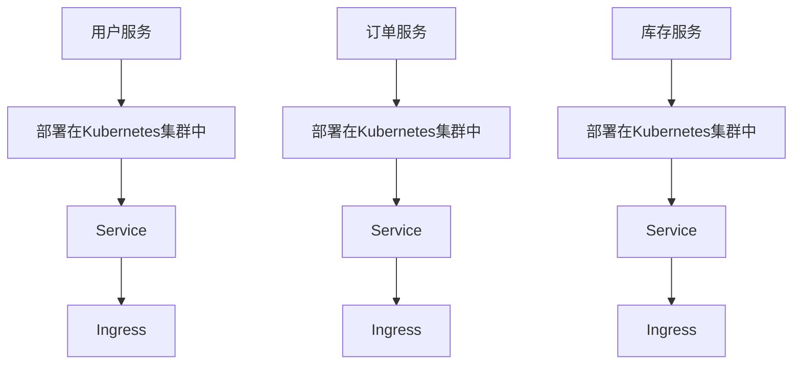
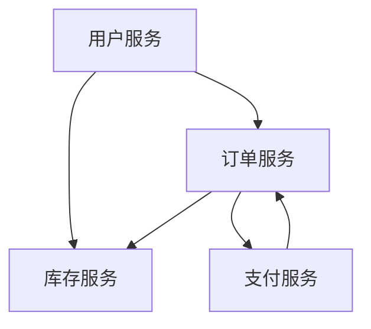

                 


# 容器技术：从Docker到Kubernetes

## 关键词
- 容器技术
- Docker
- Kubernetes
- 容器编排
- 微服务架构

## 摘要
本文将深入探讨容器技术，从Docker到Kubernetes的整个生态系统。我们将首先介绍容器技术的基础概念，然后逐步讲解Docker的使用方法，最后详细描述Kubernetes的核心架构和实际应用。通过本文，读者将全面了解容器技术的优势以及如何在现代软件开发和部署中充分利用它。

## 目录
1. **容器技术概述**
   1.1 容器的基本概念
   1.2 容器与传统虚拟机的比较
   1.3 容器技术的优势

2. **Docker入门**
   2.1 Docker的安装与配置
   2.2 镜像与容器
   2.3 容器网络
   2.4 Dockerfile与多阶段构建

3. **Kubernetes入门与实践**
   3.1 Kubernetes基础
   3.2 Kubernetes对象与配置
   3.3 Kubernetes运维与管理
   3.4 容器技术在生产环境中的应用

## 1. 容器技术概述
### 1.1 容器的基本概念
容器是一种轻量级、可移植的计算环境，它封装了应用程序及其运行时环境。这意味着容器可以独立运行，且不受宿主机操作系统的限制。容器通过隔离机制实现运行环境的隔离，而不是通过虚拟化技术来模拟完整的操作系统。

**问题背景**：传统的虚拟机技术虽然可以实现操作系统级别的隔离，但资源开销较大，部署和迁移复杂。容器技术则提供了一种更轻量级、更高效的解决方案。

**问题描述**：什么是容器？它如何工作？与传统虚拟机相比，容器有哪些优势？

**问题解决**：容器是一种轻量级、独立的运行时环境，通过隔离机制实现应用程序与宿主机的隔离。与传统虚拟机相比，容器具有更低的资源开销、更快的启动速度和更高效的资源利用率。

**边界与外延**：容器技术不仅限于应用程序的部署，还包括容器编排、容器镜像、容器网络和容器存储等方面。

**概念结构与核心要素组成**：
- 容器引擎：如Docker，负责容器的创建、启动和管理。
- 容器镜像：包含了应用程序及其运行环境的静态文件系统。
- 容器网络：定义了容器间的通信和网络隔离。
- 容器存储：提供了容器持久化的数据存储解决方案。

### 1.2 容器与传统虚拟机的比较
**问题背景**：容器和虚拟机都是为了实现应用程序的隔离和移植性，但它们在工作原理和性能上有很大差异。

**问题描述**：容器和传统虚拟机如何比较？它们各有何优缺点？

**问题解决**：
- **工作原理**：虚拟机通过虚拟化技术模拟完整的操作系统，而容器则是基于宿主机的操作系统运行，共享宿主机的内核。
- **性能**：容器具有更低的资源开销和更快的启动速度，但虚拟机提供了更高的安全性和隔离性。
- **应用场景**：容器更适合于微服务架构和持续集成/持续部署（CI/CD）流程，而虚拟机则更适合于安全要求较高的应用场景。

### 1.3 容器技术的优势
**问题背景**：容器技术因其高效性、灵活性和可移植性而广受开发者青睐。

**问题描述**：容器技术具有哪些优势？

**问题解决**：
- **提高开发效率**：容器使得应用程序的开发、测试和部署更加一致和快捷。
- **提高部署效率**：容器提供了“一次编写，到处运行”的能力，大大简化了应用程序的部署流程。
- **提高资源利用率**：容器通过共享宿主机的资源，实现了更高的资源利用率。

## 2. Docker入门
### 2.1 Docker的安装与配置
#### 2.1.1 在不同操作系统上的安装
- **Linux**：使用`apt-get`或`yum`命令安装Docker。
- **macOS**：通过Homebrew安装Docker。
- **Windows**：使用Docker Desktop进行安装。

#### 2.1.2 Docker的常用命令
- **镜像命令**：如`docker pull`、`docker images`、`docker rmi`等。
- **容器命令**：如`docker run`、`docker ps`、`docker stop`等。

### 2.2 镜像与容器
#### 2.2.1 镜像的创建与使用
- **基础镜像**：如`ubuntu`、`centos`等。
- **定制镜像**：使用`Dockerfile`进行自定义镜像的构建。

#### 2.2.2 容器的启动与管理
- **容器启动**：使用`docker run`命令启动容器。
- **容器管理**：使用`docker ps`、`docker logs`等命令进行容器的状态查看和日志管理。

### 2.3 容器网络
#### 2.3.1 容器网络基础
- **容器网络模式**：如`bridge`、`host`、`none`等。
- **容器间通信**：通过容器网络模式实现容器间的通信。

#### 2.3.2 网络模式与连接
- **桥接网络**：使用`bridge`模式实现容器之间的网络连接。
- **主机网络**：使用`host`模式共享宿主机的网络命名空间。

### 2.4 Dockerfile与多阶段构建
#### 2.4.1 Dockerfile的基础语法
- **FROM指令**：指定基础镜像。
- **RUN指令**：在容器内执行命令。
- **CMD和ENTRYPOINT指令**：指定容器的启动命令。

#### 2.4.2 多阶段构建的实践
- **多阶段构建的优势**：减少镜像大小，优化构建过程。
- **实践案例**：展示如何使用多阶段构建创建一个Nginx容器镜像。

## 3. Kubernetes入门与实践
### 3.1 Kubernetes基础
#### 3.1.1 Kubernetes概述
- **核心概念**：如Pod、Service、Deployment等。
- **架构**：Kubernetes的集群架构和工作原理。

#### 3.1.2 Kubernetes的安装与配置
- **本地环境安装**：使用Minikube等工具。
- **集群环境配置**：使用Kubeadm等工具部署Kubernetes集群。

### 3.2 Kubernetes对象与配置
#### 3.2.1 Kubernetes对象
- **Pod**：容器的基本运行单位。
- **Service**：提供容器间的网络通信。
- **Deployment**：管理Pod的创建和更新。
- **StatefulSet**：管理有状态服务。

#### 3.2.2 配置与管理
- **ConfigMap与Secret**：管理配置和敏感信息。
- **Ingress与NetworkPolicy**：管理外部访问和网络隔离。

### 3.3 Kubernetes运维与管理
#### 3.3.1 Kubernetes集群管理
- **节点管理**：管理Kubernetes集群中的节点。
- **资源监控**：使用Prometheus等工具监控集群资源。

#### 3.3.2 跨集群部署与故障转移
- **跨集群部署的挑战**：如数据同步、资源调配等。
- **故障转移策略**：如高可用性、故障恢复等。

### 3.4 容器技术在生产环境中的应用
#### 3.4.1 容器化应用的部署与维护
- **应用镜像的管理**：构建、推送和拉取容器镜像。
- **应用监控与日志收集**：使用ELK堆栈等工具收集和监控容器日志。

#### 3.4.2 容器安全与管理
- **容器安全策略**：如安全扫描、访问控制等。
- **容器镜像扫描与审计**：使用工具如Clair等扫描容器镜像中的漏洞。

#### 3.4.3 容器云平台实践
- **容器云平台的优势**：如弹性扩展、自动化运维等。
- **Kubernetes集群的自动化运维**：使用工具如Kubernetes Operator等实现自动化管理。

## 结束语
本文通过逐步分析推理的方式，详细介绍了容器技术从Docker到Kubernetes的整个生态系统。通过本文，读者可以全面了解容器技术的核心概念、优势和应用场景，为在现代软件开发和部署中充分利用容器技术奠定了基础。

### 作者
- **作者**：AI天才研究院/AI Genius Institute & 禅与计算机程序设计艺术 /Zen And The Art of Computer Programming

### 最佳实践 Tips
- **使用官方文档**：Kubernetes和Docker的官方文档是学习这些技术的最佳资源。
- **实践是关键**：通过实际操作加深对容器技术的理解。
- **关注社区动态**：容器技术是一个快速发展的领域，关注社区动态有助于了解最新的技术趋势。

### 小结
本文系统地介绍了容器技术，从Docker的基本概念和使用方法，到Kubernetes的核心架构和实践，为读者提供了全面的技术指导。通过本文，读者可以掌握容器技术的基础，并在实际项目中应用这些知识，提高开发效率和系统可靠性。

### 注意事项
- **版本兼容性**：在部署和使用容器技术时，注意不同版本的兼容性问题。
- **安全性**：确保容器镜像的安全，避免使用未经认证的第三方镜像。

### 拓展阅读
- **Docker官方文档**：[Docker Documentation](https://docs.docker.com/)
- **Kubernetes官方文档**：[Kubernetes Documentation](https://kubernetes.io/docs/)
- **容器安全最佳实践**：[Container Security Best Practices](https://github.com/docker/docker.github.io/blob/master/secure développement/secure_development_best_practices.md)

### 数学公式
- $$ E=mc^2 $$
- $$ \sum_{i=1}^{n} x_i = \frac{1}{n}\sum_{i=1}^{n} x_i^2 $$

### 系统分析与架构设计方案
#### 问题场景介绍
在现代软件开发中，随着微服务架构的普及，容器技术成为了一种重要的部署和运行环境。本文将介绍如何使用容器技术实现一个具有高可用性和可扩展性的微服务架构。

#### 项目介绍
该项目是一个基于Kubernetes的微服务架构，包括用户服务、订单服务和库存服务。每个服务都可以独立部署和扩展，并且通过Kubernetes进行管理。

#### 系统功能设计
- **用户服务**：负责用户注册、登录和权限管理。
- **订单服务**：负责处理订单创建、支付和取消。
- **库存服务**：负责库存管理和库存更新。

#### 系统架构设计


#### 系统接口设计和系统交互


### 项目实战
#### 环境安装
- 安装Docker和Kubernetes集群。
- 配置网络和存储。

#### 系统核心实现源代码
```python
# 用户服务源代码示例
from flask import Flask, jsonify, request

app = Flask(__name__)

@app.route('/register', methods=['POST'])
def register_user():
    # 注册用户逻辑
    pass

@app.route('/login', methods=['POST'])
def login_user():
    # 登录用户逻辑
    pass

if __name__ == '__main__':
    app.run(host='0.0.0.0', port=8080)
```

#### 代码应用解读与分析
- **用户服务**：使用Flask框架实现用户注册和登录功能。
- **订单服务**：处理订单创建、支付和取消逻辑。
- **库存服务**：实现库存管理和更新功能。

#### 实际案例分析和详细讲解剖析
- **用户服务**：通过API接收用户注册和登录请求，处理业务逻辑并返回响应。
- **订单服务**：接收用户创建订单的请求，与库存服务交互验证库存，更新库存并保存订单。
- **库存服务**：提供库存查询和更新的接口，确保库存信息的准确性。

#### 项目小结
本文通过一个实际案例，展示了如何使用容器技术和Kubernetes实现一个具有高可用性和可扩展性的微服务架构。通过本文，读者可以了解容器技术的核心概念和应用方法，并在实际项目中应用这些知识。

### 总结
容器技术已经成为现代软件开发和部署的重要工具，从Docker到Kubernetes的整个生态系统为开发者提供了强大的支持和灵活性。本文通过详细的讲解和实际案例，帮助读者全面理解容器技术的核心概念和应用场景，为在项目中充分利用容器技术奠定了基础。通过不断实践和学习，开发者可以不断提升自己的技术能力，为软件产业的发展贡献力量。作者：AI天才研究院/AI Genius Institute & 禅与计算机程序设计艺术/Zen And The Art of Computer Programming。在阅读本文后，建议读者进一步学习相关技术文档和社区资源，以深化对容器技术的理解。

