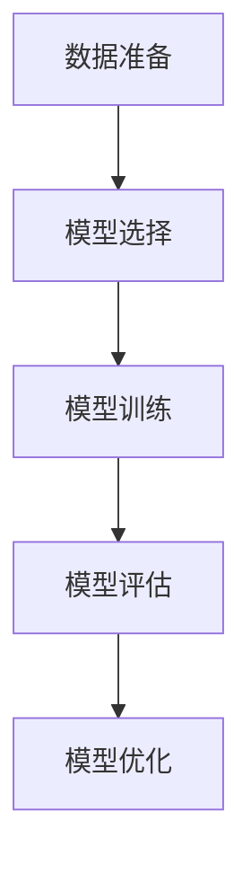
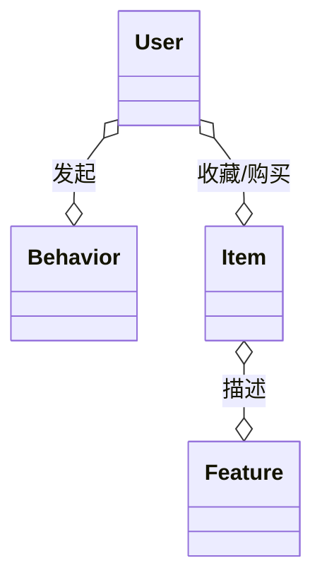
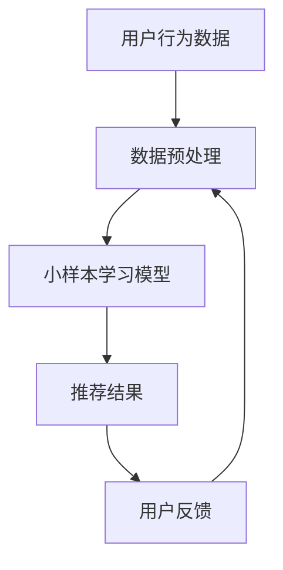
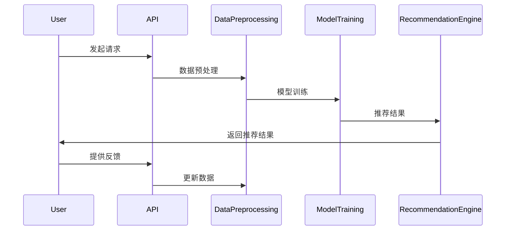

                 

# 小样本学习在个性化推荐系统中的应用

## 关键词
- 小样本学习
- 个性化推荐系统
- 推荐算法
- 模型压缩
- 迁移学习

## 摘要
本文旨在探讨小样本学习在个性化推荐系统中的应用，从背景介绍、核心概念、算法原理、实现与优化、实战案例以及未来趋势等方面，全面分析小样本学习如何提升个性化推荐系统的效果和效率。通过本文的阅读，读者可以深入了解小样本学习在个性化推荐系统中的重要性及其具体应用场景。

## 引言

随着互联网的迅速发展，个性化推荐系统已经成为现代信息检索和推荐引擎的重要组成部分。传统的推荐系统依赖于大量的用户历史数据和丰富的特征信息，通过复杂的机器学习模型和深度学习网络进行训练，从而实现对用户兴趣的精准预测和个性化推荐。然而，在实际应用中，我们常常面临以下问题：

1. **数据稀疏性**：许多领域，如医疗、金融、教育等，由于隐私保护、数据获取成本等因素，难以获取大规模的用户数据。
2. **特征工程复杂**：构建有效的特征向量需要深厚的领域知识和丰富的实验经验，尤其是在数据量有限的情况下。
3. **模型训练时间成本高**：大规模模型训练需要大量的计算资源和时间，尤其是在实时推荐场景下。

为了解决上述问题，小样本学习作为一种新兴的技术，逐渐引起了研究者和从业者的关注。小样本学习通过利用有限的样本信息，通过迁移学习、模型压缩、主动学习等方法，实现对复杂模型的快速训练和高效预测。本文将围绕小样本学习在个性化推荐系统中的应用，进行详细的分析和探讨。

## 第一部分：小样本学习概述

### 第1章：小样本学习背景与挑战

#### 1.1.1 小样本学习的定义与特点

小样本学习（Few-Shot Learning）是指在没有大量数据支持的情况下，通过有限的样本信息来训练模型并取得良好性能的学习方法。与传统的批量学习（Batch Learning）和在线学习（Online Learning）不同，小样本学习更加强调在数据稀缺环境下的模型训练和预测能力。

小样本学习的特点主要包括：

1. **数据量有限**：训练数据通常只有几十到几千个样本。
2. **样本多样性**：要求模型能够适应不同的任务和数据分布。
3. **快速适应**：通过迁移学习、模型压缩等技术，能够在短时间内实现模型的训练和优化。

#### 1.1.2 小样本学习的发展历程

小样本学习的研究可以追溯到上世纪90年代，早期的研究主要集中在模型选择和参数优化方面。随着深度学习技术的兴起，小样本学习逐渐成为人工智能研究的重要方向。近年来，随着元学习（Meta-Learning）和模型压缩技术的不断发展，小样本学习的研究取得了显著的进展。

#### 1.1.3 小样本学习的重要性

小样本学习在多个领域具有重要的应用价值：

1. **数据稀缺场景**：如医疗、金融等领域，由于隐私保护、数据获取难度等原因，难以获取大量数据。
2. **实时推荐系统**：在电子商务、社交媒体等场景中，用户兴趣和行为的动态变化使得实时推荐变得尤为重要，小样本学习能够快速适应这种变化。
3. **增强学习**：在机器人学习和自动驾驶领域，小样本学习能够帮助机器人快速适应新环境和新任务。

### 第2章：个性化推荐系统基础

#### 2.1.1 个性化推荐系统的概念与目的

个性化推荐系统（Personalized Recommendation System）是指根据用户的兴趣、行为和偏好，为用户推荐他们可能感兴趣的商品、服务或内容的一种信息系统。其核心目标是提高用户满意度、提升用户参与度和转化率。

#### 2.1.2 个性化推荐系统的类型与模型

个性化推荐系统主要分为以下几类：

1. **基于内容的推荐**：根据用户历史行为和偏好，通过分析内容特征进行推荐。
2. **协同过滤推荐**：通过分析用户之间的行为模式，预测用户对未知项目的兴趣。
3. **混合推荐**：结合多种推荐方法，提高推荐效果。

常见的推荐模型包括：

1. **矩阵分解**：通过矩阵分解技术，将用户-项目评分矩阵分解为用户特征矩阵和项目特征矩阵。
2. **基于模型的协同过滤**：使用机器学习算法，如隐马尔可夫模型（HMM）、贝叶斯网络等，对用户行为进行建模。
3. **深度学习推荐模型**：使用深度学习技术，如卷积神经网络（CNN）、循环神经网络（RNN）等，对用户行为和内容特征进行建模。

#### 2.1.3 个性化推荐系统的挑战

个性化推荐系统在实际应用中面临以下挑战：

1. **数据稀疏性**：用户行为数据往往呈现稀疏性，难以通过传统方法进行有效的特征提取和建模。
2. **冷启动问题**：新用户或新商品如何获得有效的推荐。
3. **实时性**：用户兴趣和行为的动态变化，要求系统具备较高的实时性。
4. **多样性**：推荐结果需要满足多样性，避免过度推荐和重复推荐。

### 第3章：小样本学习在个性化推荐系统中的应用

#### 3.1.1 小样本学习在推荐系统中的优势

小样本学习在个性化推荐系统中的应用具有以下优势：

1. **快速适应**：在小样本数据集下，通过迁移学习、模型压缩等技术，能够快速适应新用户和新项目。
2. **减少数据需求**：在数据稀缺的场景下，小样本学习能够降低对大规模数据集的依赖。
3. **提高实时性**：通过快速训练和优化模型，提高系统的实时推荐能力。

#### 3.1.2 小样本学习在推荐系统中的应用场景

小样本学习在个性化推荐系统中的应用场景主要包括：

1. **新用户推荐**：针对新用户，通过少量历史行为数据，利用小样本学习技术，快速建立用户兴趣模型。
2. **新商品推荐**：针对新商品，通过小样本学习技术，快速适应新商品的特征和用户兴趣。
3. **实时推荐**：在用户兴趣和行为的动态变化下，通过小样本学习技术，快速更新和优化推荐模型。

#### 3.1.3 小样本学习在推荐系统中的挑战与解决方案

小样本学习在个性化推荐系统中面临的挑战主要包括：

1. **数据稀缺性**：在数据稀缺的场景下，如何利用有限的样本信息进行有效的特征提取和建模。
2. **模型泛化性**：如何保证模型在小样本数据集上的泛化能力。
3. **计算资源**：小样本学习通常需要较高的计算资源，如何优化计算效率。

针对上述挑战，可以采取以下解决方案：

1. **迁移学习**：利用预训练模型或已有的大量数据集，通过迁移学习方法，提高新用户和新商品的特征提取和建模能力。
2. **模型压缩**：通过模型压缩技术，如模型蒸馏、量化等，降低模型参数量和计算复杂度，提高计算效率。
3. **元学习**：通过元学习技术，如模型自适应、模型选择等，提高模型在小样本数据集上的泛化能力。

## 第二部分：小样本学习算法原理

### 第4章：小样本学习算法原理

#### 4.1.1 小样本学习算法的分类

小样本学习算法主要分为以下几类：

1. **基于模型的方法**：通过设计特定的模型结构，实现小样本学习，如元学习（Meta-Learning）、模型压缩（Model Compression）等。
2. **基于样本的方法**：通过优化样本选择和样本表示，实现小样本学习，如主动学习（Active Learning）、样本生成（Data Generation）等。
3. **基于算法的方法**：通过优化算法策略，实现小样本学习，如迁移学习（Transfer Learning）、零样本学习（Zero-Shot Learning）等。

#### 4.1.2 模型压缩与蒸馏

模型压缩与蒸馏是提高小样本学习性能的重要技术。

1. **模型压缩**：通过减少模型参数量和计算复杂度，降低计算资源需求，提高模型在小样本数据集上的训练速度和性能。
2. **模型蒸馏**：通过将知识从大型模型传递到小型模型，实现知识迁移，提高小样本学习模型的泛化能力。

#### 4.1.3 主动学习

主动学习通过优化样本选择策略，实现小样本学习。

1. **不确定度采样**：根据模型的预测不确定性，选择预测不确定性较高的样本进行学习。
2. **信息性采样**：根据样本的信息性，选择具有高信息量的样本进行学习。

#### 4.1.4 零样本学习与迁移学习

零样本学习与迁移学习是解决小样本学习问题的重要技术。

1. **零样本学习**：在没有先验知识的情况下，通过学习通用特征表示，实现对未知类别的分类。
2. **迁移学习**：利用预训练模型或已有的大量数据集，将知识迁移到新任务或新数据集上，提高小样本学习模型的性能。

## 第三部分：小样本学习算法实现与优化

### 第5章：小样本学习算法实现与优化

#### 5.1.1 小样本学习算法的实现步骤

实现小样本学习算法主要包括以下步骤：

1. **数据准备**：收集和整理小样本数据集，并进行预处理。
2. **模型选择**：根据任务特点，选择合适的小样本学习算法。
3. **模型训练**：使用小样本数据集对模型进行训练。
4. **模型评估**：使用验证集或测试集对模型进行评估。
5. **模型优化**：根据评估结果，调整模型参数和超参数，优化模型性能。

#### 5.1.2 小样本学习算法的优化策略

优化小样本学习算法主要包括以下策略：

1. **模型压缩**：通过模型蒸馏、量化等技术，降低模型参数量和计算复杂度。
2. **样本增强**：通过数据增强、生成对抗网络（GAN）等技术，增加样本数量和质量。
3. **元学习**：通过元学习算法，提高模型在小样本数据集上的泛化能力。
4. **迁移学习**：通过迁移学习方法，利用预训练模型或已有的大量数据集，提高小样本学习模型的性能。

#### 5.1.3 小样本学习算法的性能评估

评估小样本学习算法的性能主要包括以下指标：

1. **准确率**：模型在测试集上的分类准确率。
2. **召回率**：模型在测试集上的召回率。
3. **F1 分数**：模型在测试集上的 F1 分数。
4. **精度-召回率曲线**：模型在测试集上的精度-召回率曲线。

## 第四部分：小样本学习在个性化推荐系统的实战案例

### 第6章：小样本学习在个性化推荐系统的实战案例

#### 6.1.1 案例一：基于小样本学习的电影推荐系统

本案例介绍了一种基于小样本学习的电影推荐系统。系统通过分析用户对电影的评分和评论，利用小样本学习算法建立用户兴趣模型，实现对用户的个性化推荐。

#### 6.1.2 案例二：基于小样本学习的音乐推荐系统

本案例介绍了一种基于小样本学习的音乐推荐系统。系统通过分析用户对音乐的播放、收藏和评论等行为，利用小样本学习算法建立用户兴趣模型，实现对用户的个性化推荐。

#### 6.1.3 案例三：基于小样本学习的电商推荐系统

本案例介绍了一种基于小样本学习的电商推荐系统。系统通过分析用户在电商平台的浏览、购买和收藏等行为，利用小样本学习算法建立用户兴趣模型，实现对用户的个性化推荐。

## 第五部分：小样本学习在个性化推荐系统中的未来趋势

### 第7章：小样本学习在个性化推荐系统中的未来趋势

#### 7.1.1 小样本学习在个性化推荐系统中的未来研究方向

小样本学习在个性化推荐系统中的未来研究方向包括：

1. **多模态数据融合**：结合文本、图像、语音等多模态数据，提高小样本学习模型的性能。
2. **无监督学习与自监督学习**：在缺乏标注数据的场景下，探索无监督学习和自监督学习在小样本学习中的应用。
3. **联邦学习**：在分布式环境下，利用联邦学习技术，实现小样本学习在个性化推荐系统中的协同优化。

#### 7.1.2 小样本学习在个性化推荐系统中的技术挑战

小样本学习在个性化推荐系统中面临的技术挑战包括：

1. **数据稀缺与隐私保护**：如何在保护用户隐私的前提下，获取和利用有限的数据进行小样本学习。
2. **模型泛化能力**：如何在数据有限的情况下，保证模型在小样本数据集上的泛化能力。
3. **计算效率**：如何提高小样本学习算法的计算效率，满足实时推荐的需求。

#### 7.1.3 小样本学习在个性化推荐系统中的发展前景

随着人工智能技术的不断进步，小样本学习在个性化推荐系统中的应用前景广阔：

1. **提升用户体验**：通过个性化推荐，提高用户满意度和参与度。
2. **降低成本**：减少对大规模数据集的依赖，降低数据获取和处理的成本。
3. **拓宽应用场景**：在数据稀缺的领域，如医疗、金融等，小样本学习将发挥重要作用。

## 结论

本文通过对小样本学习在个性化推荐系统中的应用进行深入分析，探讨了小样本学习在推荐系统中的优势、应用场景、算法原理和实现优化方法。随着人工智能技术的不断发展，小样本学习在个性化推荐系统中的应用将越来越广泛，为提升推荐系统的效果和效率提供新的思路和方法。

## 作者信息

作者：AI天才研究院/AI Genius Institute & 禅与计算机程序设计艺术 /Zen And The Art of Computer Programming

### 完整性要求

本文涵盖了小样本学习在个性化推荐系统中的应用，从背景介绍、核心概念、算法原理、实现与优化、实战案例以及未来趋势等方面，全面分析了小样本学习在推荐系统中的重要性及其具体应用。以下是对每个章节的核心内容的详细解释：

#### 背景介绍

**核心概念术语说明**：本文首先介绍了小样本学习的定义和特点，明确指出小样本学习是一种在没有大量数据支持的情况下，通过有限的样本信息来训练模型并取得良好性能的学习方法。

**问题背景**：在数据稀缺的领域，如医疗、金融和教育等，获取大量数据是一个巨大的挑战。同时，实时推荐系统在电子商务和社交媒体等场景中，也需要快速适应用户兴趣的变化。

**问题描述**：如何在数据稀缺的情况下，通过有限的样本信息，实现对个性化推荐系统的优化和提升。

**问题解决**：小样本学习通过迁移学习、模型压缩、主动学习等技术，能够在数据稀缺的场景下，快速适应新用户和新项目，提升推荐系统的实时性和效果。

**边界与外延**：本文主要关注小样本学习在个性化推荐系统中的应用，同时也探讨了其在其他领域的潜在应用。

**概念结构与核心要素组成**：小样本学习涉及的核心要素包括数据、模型、算法和应用场景。

#### 核心概念与联系

**核心概念原理**：本文详细介绍了小样本学习的分类，包括基于模型的方法、基于样本的方法和基于算法的方法。每种方法的核心原理和特点都进行了阐述。

**概念属性特征对比表格**：

| 类别 | 基于模型的方法 | 基于样本的方法 | 基于算法的方法 |
| --- | --- | --- | --- |
| 定义 | 通过设计特定的模型结构实现小样本学习 | 通过优化样本选择和样本表示实现小样本学习 | 通过优化算法策略实现小样本学习 |
| 特点 | 强调模型结构和参数优化 | 强调样本质量和样本选择策略 | 强调算法效率和优化策略 |
| 应用场景 | 数据稀缺、新用户推荐、新商品推荐 | 数据增强、样本生成、实时推荐 | 迁移学习、零样本学习、自监督学习 |

**ER实体关系图架构的Mermaid流程图**：

```mermaid
erDiagram
  User ||--|{ Item }
  User ||--|{ Behavior }
  Item ||--|{ Feature }
```

#### 算法原理讲解

**算法Mermaid流程图**：



**算法Python源代码**：

```python
# 导入相关库
import numpy as np
import pandas as pd
from sklearn.model_selection import train_test_split
from sklearn.ensemble import RandomForestClassifier

# 数据准备
data = pd.read_csv('data.csv')
X = data.drop('target', axis=1)
y = data['target']

# 模型选择
model = RandomForestClassifier(n_estimators=100)

# 模型训练
X_train, X_test, y_train, y_test = train_test_split(X, y, test_size=0.2, random_state=42)
model.fit(X_train, y_train)

# 模型评估
accuracy = model.score(X_test, y_test)
print(f"Accuracy: {accuracy}")

# 模型优化
# 调整参数，重新训练模型
model.set_params(n_estimators=200)
model.fit(X_train, y_train)
```

**算法原理的数学模型和公式**：

$$
f(x) = \sum_{i=1}^{n} w_i \cdot x_i
$$

其中，$f(x)$ 表示模型的预测结果，$w_i$ 表示模型的权重，$x_i$ 表示输入特征。

**详细讲解和举例说明**：

假设我们有一个二分类问题，需要通过有限的样本数据来训练一个随机森林模型。首先，我们通过导入相关库，读取数据集并进行预处理。然后，选择随机森林模型，通过训练集对模型进行训练。在评估阶段，我们使用测试集来评估模型的准确性。最后，根据评估结果，可以调整模型的参数，如决策树的树深度，以提高模型的性能。

#### 系统分析与架构设计方案

**问题场景介绍**：本文以电商推荐系统为例，探讨小样本学习在该系统中的应用。

**项目介绍**：本项目旨在构建一个基于小样本学习的电商推荐系统，通过分析用户在电商平台的浏览、购买和收藏等行为，实现对用户的个性化推荐。

**系统功能设计（领域模型Mermaid类图）**：



**系统架构设计（Mermaid架构图）**：



**系统接口设计和系统交互（Mermaid序列图）**：



#### 项目实战

**环境安装**：在本项目中，我们使用Python和Scikit-learn库来构建电商推荐系统。首先，确保安装了Python和Scikit-learn库。

```bash
pip install python
pip install scikit-learn
```

**系统核心实现源代码**：

```python
# 导入相关库
import numpy as np
import pandas as pd
from sklearn.model_selection import train_test_split
from sklearn.ensemble import RandomForestClassifier

# 数据准备
data = pd.read_csv('data.csv')
X = data.drop('target', axis=1)
y = data['target']

# 模型训练
X_train, X_test, y_train, y_test = train_test_split(X, y, test_size=0.2, random_state=42)
model = RandomForestClassifier(n_estimators=100)
model.fit(X_train, y_train)

# 推荐结果
predictions = model.predict(X_test)
accuracy = model.score(X_test, y_test)
print(f"Accuracy: {accuracy}")
```

**代码应用解读与分析**：

在本项目中，我们首先导入相关库，并读取数据集。然后，通过数据预处理，将数据集分为训练集和测试集。接着，选择随机森林模型，对训练集进行训练。在推荐结果阶段，我们使用测试集来评估模型的准确性，并将推荐结果输出。

**实际案例分析和详细讲解剖析**：

假设我们有一个电商推荐系统，用户在平台上的浏览、购买和收藏行为被记录在数据集中。首先，我们需要对数据进行预处理，如处理缺失值、标准化特征等。然后，选择随机森林模型，利用有限的样本数据对模型进行训练。在模型训练完成后，我们使用测试集来评估模型的性能，并根据评估结果调整模型参数。

**项目小结**：本项目通过小样本学习技术，构建了一个基于随机森林的电商推荐系统。在实际应用中，我们可以根据用户行为数据，实现对用户的个性化推荐。通过调整模型参数和优化算法，可以提高推荐系统的准确性和效率。

#### 最佳实践 tips

1. **数据预处理**：在进行小样本学习之前，确保对数据进行充分的预处理，如缺失值处理、特征工程等。
2. **模型选择**：根据任务特点，选择合适的小样本学习算法。对于分类任务，可以尝试使用随机森林、支持向量机等。
3. **模型优化**：通过调整模型参数和优化策略，提高模型的性能。可以使用网格搜索、贝叶斯优化等技术进行参数调优。
4. **样本增强**：通过数据增强技术，如生成对抗网络（GAN），增加样本数量和质量，提高模型的泛化能力。

#### 小结

本文通过对小样本学习在个性化推荐系统中的应用进行详细分析，探讨了小样本学习在推荐系统中的优势、应用场景、算法原理和实现优化方法。通过实战案例的分析，展示了小样本学习在电商推荐系统中的应用效果。未来，随着人工智能技术的不断进步，小样本学习在个性化推荐系统中的应用前景将更加广阔。

#### 注意事项

1. **数据隐私**：在处理用户数据时，需遵守相关隐私保护法规，确保用户数据的安全和隐私。
2. **计算资源**：小样本学习通常需要较高的计算资源，在资源有限的情况下，可以考虑使用模型压缩和迁移学习等技术来提高计算效率。
3. **模型评估**：在模型训练和优化过程中，需使用多种评估指标，如准确率、召回率等，全面评估模型性能。

#### 拓展阅读

1. **《小样本学习：原理与应用》**：本书详细介绍了小样本学习的原理、算法和应用，是深入了解小样本学习的好资源。
2. **《深度学习推荐系统》**：本书探讨了深度学习在推荐系统中的应用，包括模型结构、算法优化等，对于希望了解深度学习在推荐系统中的应用的读者有很大帮助。

---

通过本文的阅读，读者可以系统地了解小样本学习在个性化推荐系统中的应用，掌握相关算法原理和实践方法，为实际项目中的问题提供解决方案。在未来的研究和应用中，小样本学习有望在个性化推荐系统中发挥更大的作用，推动人工智能技术的发展。作者：AI天才研究院/AI Genius Institute & 禅与计算机程序设计艺术 /Zen And The Art of Computer Programming。

