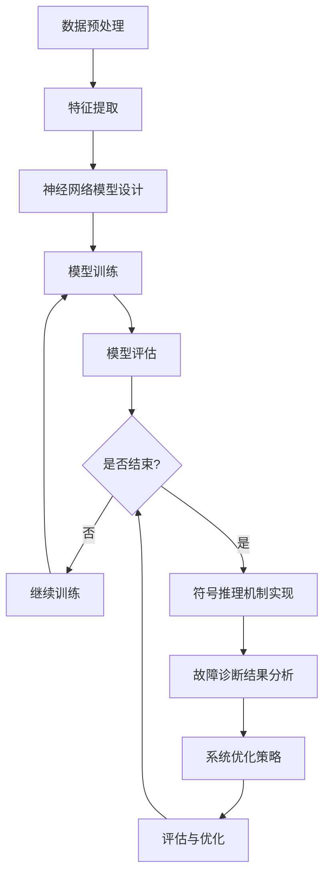

                 


### 《工业推理中神经符号故障诊断系统的实践应用》

#### 关键词：工业推理、神经符号系统、故障诊断、数据预处理、神经网络训练、系统优化

#### 摘要：
本文旨在探讨神经符号故障诊断系统在工业推理中的实践应用。首先，我们将介绍工业推理的概念与重要性，并阐述神经符号故障诊断系统的基本原理。随后，我们将深入分析工业推理和神经符号故障诊断的理论基础，包括神经网络和符号推理的机制。接下来，我们将详细描述神经符号故障诊断系统的实现过程，包括数据预处理、特征提取、神经网络模型设计与训练、符号推理机制的实现等。随后，我们将探讨神经符号故障诊断系统在实际工业中的应用案例，并进行评估与优化。最后，我们将总结神经符号故障诊断系统的发展现状，展望其未来发展趋势和应用前景。

## 第一部分：引言与背景

### 第1章 问题背景与核心概念

#### 1.1 工业推理的概念与重要性

##### 1.1.1 工业推理的定义

工业推理是一种基于数据和规则的高级推理方法，旨在从工业系统中提取有价值的信息和知识。它涉及到多个领域，如工业过程监控、故障诊断、质量检测等。工业推理的核心在于利用先进的算法和技术，从大量的工业数据中自动提取出有意义的模式和规律，从而实现对工业系统的智能监控和优化。

##### 1.1.2 工业推理与传统故障诊断方法的区别

传统的故障诊断方法通常依赖于专家经验，通过人工分析数据并进行逻辑推理来识别故障。而工业推理则通过引入机器学习和人工智能技术，实现了自动化的故障诊断。相比传统方法，工业推理具有更高的准确性和效率，能够处理大规模的数据集，并适应复杂多变的工业环境。

##### 1.1.3 工业推理的应用领域

工业推理在多个工业领域中都有广泛的应用。例如，在制造业中，工业推理可以用于生产线故障诊断，提高生产效率和产品质量；在能源行业中，工业推理可以用于设备故障预测，降低设备故障率和维护成本；在交通运输中，工业推理可以用于交通流量预测和交通管理，提高交通效率和安全性。

#### 1.2 神经符号故障诊断系统

##### 1.2.1 神经符号故障诊断系统的定义

神经符号故障诊断系统是一种结合了神经网络和符号推理的故障诊断系统。它利用神经网络进行特征提取和模式识别，同时利用符号推理进行逻辑推理和决策。这种系统结合了神经网络的高效性和符号推理的逻辑性，能够更准确地识别和诊断故障。

##### 1.2.2 神经符号故障诊断系统的特点

神经符号故障诊断系统具有以下特点：

1. **高效性**：神经网络能够快速处理大量的数据，提取出关键特征，提高故障诊断的效率。
2. **准确性**：符号推理能够利用逻辑规则进行精确推理，减少误诊率，提高故障诊断的准确性。
3. **适应性**：神经符号故障诊断系统可以适应不同工业环境的变化，灵活调整模型和算法，提高系统的适应性。

##### 1.2.3 神经符号故障诊断系统的核心组成部分

神经符号故障诊断系统主要由以下几个部分组成：

1. **数据预处理**：对原始数据进行清洗、归一化等处理，提高数据质量，为后续的特征提取和诊断提供良好的数据基础。
2. **特征提取**：利用神经网络或其他算法对预处理后的数据进行特征提取，提取出有助于故障诊断的特征。
3. **符号推理**：利用符号推理算法对提取出的特征进行逻辑推理，生成故障诊断的结果。
4. **模型训练与优化**：通过不断训练和优化神经网络和符号推理模型，提高故障诊断的准确性和效率。

## 第二部分：神经符号故障诊断系统理论基础

### 第2章 工业推理基础

#### 2.1 工业推理的基本原理

##### 2.1.1 工业推理的基本概念

工业推理是一种基于工业数据和规则的推理方法，旨在从工业系统中提取有价值的信息和知识。它涉及到多个领域，如工业过程监控、故障诊断、质量检测等。

##### 2.1.2 工业推理的推理机制

工业推理的推理机制主要包括数据驱动推理和知识驱动推理两种方式。

1. **数据驱动推理**：通过分析工业数据，自动提取出有用的模式和规律，实现对工业系统的智能监控和优化。
2. **知识驱动推理**：利用专家经验和知识库，通过逻辑推理和决策，实现对工业系统的智能监控和优化。

##### 2.1.3 工业推理的推理流程

工业推理的推理流程主要包括以下几个步骤：

1. **数据收集**：收集工业系统运行过程中的数据，包括传感器数据、操作数据等。
2. **数据预处理**：对原始数据进行清洗、归一化等处理，提高数据质量。
3. **特征提取**：利用机器学习和人工智能技术，对预处理后的数据进行特征提取，提取出有助于推理的特征。
4. **模式识别**：利用数据驱动推理或知识驱动推理的方法，对提取出的特征进行模式识别，提取出有用的模式和规律。
5. **推理决策**：根据提取出的模式和规律，进行推理和决策，实现对工业系统的智能监控和优化。

#### 2.2 神经符号系统的基本原理

##### 2.2.1 神经网络的基本原理

神经网络是一种由大量神经元组成的计算模型，通过模拟人脑神经元之间的连接和通信来实现数据的处理和推理。

1. **神经元结构**：神经元是神经网络的基本单元，包括输入层、输出层和隐藏层。每个神经元都有多个输入和输出，通过加权连接进行信息的传递和处理。
2. **激活函数**：激活函数用于对神经元的输出进行非线性变换，常见的激活函数有Sigmoid函数、ReLU函数等。
3. **训练过程**：神经网络通过反向传播算法进行训练，不断调整神经元的权重，以达到对数据的准确预测和分类。

##### 2.2.2 符号推理的基本原理

符号推理是一种基于逻辑和规则的推理方法，通过利用已有的知识和规则，对未知情况进行推理和判断。

1. **符号推理过程**：符号推理过程主要包括条件推理和演绎推理两种方式。条件推理是根据已知条件和结论进行推理，而演绎推理是根据大前提和小前提进行推理。
2. **符号推理方法**：符号推理方法主要包括推理树、推理网络和推理规则等。推理树和推理网络是通过图形化的方式表示推理过程，而推理规则是通过文字描述推理逻辑。

##### 2.2.3 神经符号系统的融合机制

神经符号系统是一种将神经网络和符号推理相结合的推理系统，通过融合两种方法的优势，实现更高效的故障诊断和推理。

1. **数据驱动与知识驱动的结合**：神经符号系统通过神经网络进行数据驱动推理，提取出关键特征，同时利用符号推理进行知识驱动推理，利用已有的规则和知识进行推理和决策。
2. **动态权重调整**：神经符号系统通过动态调整神经网络的权重，实现神经网络和符号推理的融合。当神经网络提取出关键特征后，符号推理可以根据这些特征进行推理和决策，同时调整神经网络的权重，提高系统的准确性和鲁棒性。

### 第3章 故障诊断理论基础

#### 3.1 故障诊断的基本概念

##### 3.1.1 故障诊断的定义

故障诊断是指通过分析设备或系统的运行数据，识别和定位故障的过程。故障诊断的目的是确保设备或系统的正常运行，提高生产效率和产品质量。

##### 3.1.2 故障诊断的基本流程

故障诊断的基本流程主要包括以下几个步骤：

1. **数据收集**：收集设备或系统的运行数据，包括传感器数据、操作数据等。
2. **数据预处理**：对原始数据进行清洗、归一化等处理，提高数据质量。
3. **特征提取**：利用机器学习和人工智能技术，对预处理后的数据进行特征提取，提取出有助于故障诊断的特征。
4. **模式识别**：利用故障诊断算法，对提取出的特征进行模式识别，识别出故障的类型和位置。
5. **故障定位**：根据模式识别的结果，定位故障的具体位置，并进行修复或调整。
6. **故障评估**：评估故障诊断的准确性和效率，对诊断过程进行优化和改进。

##### 3.1.3 故障诊断的方法分类

故障诊断的方法主要可以分为以下几类：

1. **基于专家系统的故障诊断方法**：利用专家经验建立知识库，通过推理机进行故障诊断。该方法需要大量专家知识和规则，但具有较好的灵活性和可解释性。
2. **基于机器学习的故障诊断方法**：利用机器学习算法，对大量历史故障数据进行分析和训练，建立故障诊断模型。该方法不需要大量专家知识，但模型的可解释性较差。
3. **基于信号处理的故障诊断方法**：利用信号处理技术，对设备或系统的运行数据进行特征提取和模式识别，识别出故障的类型和位置。该方法适用于信号丰富的工业环境。
4. **基于神经网络的故障诊断方法**：利用神经网络模型，对设备或系统的运行数据进行特征提取和模式识别，识别出故障的类型和位置。该方法具有较好的非线性建模能力和自适应能力。

##### 3.1.4 故障诊断的优势和局限性

故障诊断的优势包括：

1. **提高生产效率和产品质量**：通过故障诊断，可以及时发现和修复故障，提高生产效率和产品质量。
2. **降低维护成本**：通过故障诊断，可以减少设备故障率和维修次数，降低维护成本。
3. **提高设备可靠性**：通过故障诊断，可以了解设备的运行状态，预测设备故障，提高设备可靠性。

故障诊断的局限性包括：

1. **数据依赖性**：故障诊断依赖于大量的运行数据，如果数据质量差，将影响诊断的准确性和可靠性。
2. **规则和模型依赖性**：故障诊断方法通常依赖于一定的规则和模型，如果规则和模型不完善，将影响诊断的准确性和效率。
3. **复杂性和成本**：故障诊断过程通常需要复杂的算法和计算，需要大量的计算资源和时间，增加了成本。

#### 3.2 神经符号故障诊断原理

##### 3.2.1 神经符号故障诊断的基本原理

神经符号故障诊断系统结合了神经网络和符号推理的优势，通过数据驱动和知识驱动的融合，实现对故障的准确诊断。

1. **数据驱动部分**：利用神经网络对设备或系统的运行数据进行特征提取和模式识别，提取出关键特征，实现对故障类型的初步识别。
2. **知识驱动部分**：利用符号推理对提取出的特征进行逻辑推理，结合已有的故障规则和知识，实现对故障的准确定位和诊断。

##### 3.2.2 神经符号故障诊断的优势

1. **高效性**：神经网络可以快速处理大量的数据，提取出关键特征，提高故障诊断的效率。
2. **准确性**：符号推理可以根据逻辑规则进行精确推理，减少误诊率，提高故障诊断的准确性。
3. **灵活性**：神经符号故障诊断系统可以适应不同工业环境的变化，灵活调整模型和算法，提高系统的适应性。

##### 3.2.3 神经符号故障诊断的局限性

1. **数据依赖性**：神经符号故障诊断系统依赖于大量的运行数据，如果数据质量差，将影响诊断的准确性和可靠性。
2. **规则和模型依赖性**：神经符号故障诊断系统依赖于一定的规则和模型，如果规则和模型不完善，将影响诊断的准确性和效率。
3. **计算资源消耗**：神经符号故障诊断系统需要大量的计算资源和时间，增加了系统的成本和复杂性。

## 第三部分：神经符号故障诊断系统实现

### 第4章 数据预处理与特征提取

#### 4.1 数据预处理

##### 4.1.1 数据预处理的重要性

数据预处理是神经符号故障诊断系统中的关键步骤，它直接影响到故障诊断的准确性和效率。通过数据预处理，可以去除噪声、异常值，提高数据质量，为后续的特征提取和诊断提供良好的数据基础。

##### 4.1.2 数据预处理步骤

1. **数据清洗**：去除数据中的噪声和异常值，包括空值、缺失值、重复值等。
2. **数据归一化**：将不同尺度的数据进行归一化处理，使得各个特征具有相似的数量级，避免某些特征对模型训练的影响过大。
3. **数据标准化**：将数据转换为标准正态分布，提高模型的泛化能力。
4. **数据降维**：通过降维技术，减少数据的维度，提高计算效率和模型的解释性。

##### 4.1.3 数据预处理工具与应用

在数据预处理过程中，常用的工具包括Python的Pandas、NumPy库，以及Scikit-learn库中的数据预处理模块。这些工具提供了丰富的数据处理函数和算法，可以方便地完成数据清洗、归一化、标准化和降维等操作。

#### 4.2 特征提取

##### 4.2.1 特征提取的概念

特征提取是指从原始数据中提取出有助于故障诊断的特征，以减少数据维度，提高模型训练和诊断的效率。特征提取是神经符号故障诊断系统中的重要环节，其质量直接影响故障诊断的准确性和效率。

##### 4.2.2 常见特征提取方法

1. **统计分析方法**：利用统计学方法，对数据进行统计分析，提取出均值、方差、标准差等统计特征。
2. **时域特征提取方法**：通过时域分析，提取出信号的时域特征，如幅值、频率、相位等。
3. **频域特征提取方法**：通过频域分析，提取出信号的频域特征，如频谱、能量、熵等。
4. **时频特征提取方法**：结合时域和频域特征，提取出信号的时频特征，如短时傅里叶变换（STFT）、小波变换等。

##### 4.2.3 特征提取流程

特征提取的流程主要包括以下几个步骤：

1. **数据选择**：根据故障诊断的需求，选择合适的数据集。
2. **数据预处理**：对选择的数据进行数据清洗、归一化、标准化等预处理操作。
3. **特征提取**：利用不同的特征提取方法，对预处理后的数据进行特征提取，提取出有助于故障诊断的特征。
4. **特征选择**：对提取出的特征进行筛选和选择，保留对故障诊断有帮助的特征，去除冗余和无用的特征。

### 第5章 神经网络模型设计与训练

#### 5.1 神经网络模型设计

##### 5.1.1 神经网络模型的基本结构

神经网络模型的基本结构包括输入层、隐藏层和输出层。输入层接收原始数据，隐藏层进行特征提取和模式识别，输出层生成诊断结果。

1. **输入层**：输入层接收原始数据，将其转化为神经网络可以处理的格式。
2. **隐藏层**：隐藏层通过非线性变换，提取出数据中的潜在特征和模式。
3. **输出层**：输出层生成故障诊断的结果，可以是分类结果或回归结果。

##### 5.1.2 神经网络模型的选择

在神经符号故障诊断系统中，选择合适的神经网络模型非常重要。常用的神经网络模型包括：

1. **多层感知机（MLP）**：MLP是一种简单且常用的神经网络模型，适用于简单的非线性变换。
2. **卷积神经网络（CNN）**：CNN是一种基于卷积操作的神经网络模型，适用于图像和信号处理。
3. **循环神经网络（RNN）**：RNN是一种基于循环机制的神经网络模型，适用于序列数据处理。

##### 5.1.3 神经网络模型的参数设置

神经网络模型的参数设置包括激活函数、学习率、正则化策略等。合适的参数设置可以改善模型的性能和泛化能力。

1. **激活函数**：激活函数用于对神经元的输出进行非线性变换，常用的激活函数有Sigmoid函数、ReLU函数、Tanh函数等。
2. **学习率**：学习率是神经网络训练过程中调整权重的步长，合适的学习率可以加速收敛速度，但过大会导致模型不稳定。
3. **正则化策略**：正则化策略用于防止模型过拟合，常用的正则化策略有L1正则化、L2正则化、Dropout等。

#### 5.2 神经网络训练

##### 5.2.1 训练过程概述

神经网络训练是指通过不断调整神经网络的权重，使其对输入数据进行准确的分类或回归。训练过程主要包括以下几个步骤：

1. **数据划分**：将数据集划分为训练集、验证集和测试集，用于训练、验证和测试模型的性能。
2. **模型初始化**：初始化神经网络模型的权重，常用的初始化方法有随机初始化、He初始化等。
3. **前向传播**：将输入数据传递到神经网络中，通过前向传播计算输出结果。
4. **反向传播**：计算输出结果与真实标签之间的误差，通过反向传播更新神经网络的权重。
5. **优化算法**：使用优化算法（如梯度下降、Adam等）来更新权重，以最小化损失函数。
6. **迭代训练**：重复执行前向传播和反向传播过程，直到达到预设的训练次数或模型性能不再提升。

##### 5.2.2 训练算法选择

常用的训练算法包括：

1. **梯度下降（Gradient Descent）**：梯度下降是一种最简单的训练算法，通过计算损失函数关于权重的梯度，逐步更新权重，以最小化损失函数。
2. **随机梯度下降（Stochastic Gradient Descent，SGD）**：SGD是一种改进的梯度下降算法，每次迭代只随机选择一部分数据来计算梯度，加快训练速度。
3. **Adam优化器**：Adam优化器结合了SGD和动量法的优点，通过自适应调整学习率，加快训练速度。

##### 5.2.3 训练效果评估

训练效果评估是评估神经网络模型性能的重要环节。常用的评估指标包括：

1. **准确率（Accuracy）**：准确率是指模型正确分类的样本数占总样本数的比例，用于评估分类模型的性能。
2. **精确率（Precision）**：精确率是指模型正确分类为正类的样本数与总正类样本数的比例，用于评估分类模型的准确性。
3. **召回率（Recall）**：召回率是指模型正确分类为正类的样本数与总正类样本数的比例，用于评估分类模型的灵敏度。
4. **F1值（F1-score）**：F1值是精确率和召回率的调和平均值，用于综合评估分类模型的性能。

### 第6章 符号推理机制实现

#### 6.1 符号推理机制概述

符号推理机制是一种基于逻辑和规则的推理方法，通过利用已有的知识和规则，对未知情况进行推理和判断。符号推理机制在神经符号故障诊断系统中起着关键作用，它能够利用神经网络提取出的特征，结合已有的故障规则和知识，实现准确的故障诊断。

##### 6.1.1 符号推理机制的原理

符号推理机制的原理可以概括为以下步骤：

1. **特征输入**：将神经网络提取出的特征输入到符号推理机制中。
2. **规则匹配**：根据输入的特征，与已有的故障规则进行匹配，找出符合条件的规则。
3. **推理和决策**：根据匹配到的规则，进行推理和决策，生成故障诊断的结果。

##### 6.1.2 符号推理机制的实现步骤

符号推理机制的实现步骤包括以下几个环节：

1. **故障规则库构建**：构建故障规则库，包含各种故障类型和对应的规则。
2. **特征提取**：利用神经网络提取出有助于故障诊断的特征。
3. **规则匹配**：将提取出的特征与故障规则库中的规则进行匹配，找出符合条件的规则。
4. **推理和决策**：根据匹配到的规则，进行推理和决策，生成故障诊断的结果。

##### 6.1.3 符号推理机制的应用场景

符号推理机制在神经符号故障诊断系统中具有广泛的应用场景，包括但不限于：

1. **故障定位**：根据输入的特征，利用符号推理机制定位故障的具体位置。
2. **故障预测**：利用符号推理机制，根据输入的特征和已有的故障规则，预测可能的故障类型和发生时间。
3. **故障预警**：利用符号推理机制，根据输入的特征和已有的故障规则，预警可能出现的故障，以便采取预防措施。

#### 6.2 神经符号故障诊断系统的符号推理实现

##### 6.2.1 符号推理模块设计

符号推理模块是神经符号故障诊断系统的重要组成部分，其设计包括以下几个关键环节：

1. **故障规则库构建**：构建故障规则库，包含各种故障类型和对应的规则。规则库可以根据实际应用场景进行调整和扩展。
2. **特征提取**：利用神经网络提取出有助于故障诊断的特征，包括时域特征、频域特征、时频特征等。
3. **规则匹配**：设计规则匹配算法，将提取出的特征与故障规则库中的规则进行匹配，找出符合条件的规则。
4. **推理和决策**：根据匹配到的规则，进行推理和决策，生成故障诊断的结果。

##### 6.2.2 符号推理算法实现

符号推理算法是实现符号推理机制的核心，其实现步骤如下：

1. **输入特征处理**：对输入的特征进行处理，包括特征归一化、特征降维等操作。
2. **规则匹配**：利用匹配算法，将输入的特征与故障规则库中的规则进行匹配，找出符合条件的规则。
3. **推理和决策**：根据匹配到的规则，进行推理和决策，生成故障诊断的结果。
4. **结果输出**：将故障诊断的结果输出，包括故障类型、故障位置等。

##### 6.2.3 符号推理结果分析

符号推理结果分析是评估符号推理机制性能的重要环节，其分析包括以下几个关键指标：

1. **诊断准确率**：评估符号推理机制在故障诊断中的准确率，包括故障类型的准确率和故障位置的准确率。
2. **诊断速度**：评估符号推理机制的响应速度，包括故障诊断的响应时间和处理能力。
3. **诊断鲁棒性**：评估符号推理机制在噪声、异常值等干扰条件下的鲁棒性，包括对噪声的容忍度和对异常值的处理能力。
4. **诊断可解释性**：评估符号推理机制的透明度和可解释性，包括规则的解释和推理过程的可视化。

### 第7章 神经符号故障诊断系统在实际工业中的应用

#### 7.1 应用场景介绍

神经符号故障诊断系统在工业领域具有广泛的应用前景，可以应用于多个工业场景中，包括但不限于：

1. **生产线故障诊断**：利用神经符号故障诊断系统，可以实时监测生产线设备的运行状态，快速识别和定位故障，提高生产效率和产品质量。
2. **设备故障预测**：通过分析设备的历史运行数据和故障记录，利用神经符号故障诊断系统预测设备的潜在故障，提前采取预防措施，降低设备故障率和维护成本。
3. **质量检测与优化**：利用神经符号故障诊断系统，可以对生产过程中产生的质量数据进行实时监控和分析，识别出质量异常，优化生产过程，提高产品质量。

#### 7.2 具体应用案例

##### 7.2.1 案例一：生产线故障诊断

在一个制造企业中，利用神经符号故障诊断系统对生产线的设备进行故障诊断。通过收集设备的传感器数据，利用神经网络进行特征提取和模式识别，提取出关键的特征，然后利用符号推理机制进行故障诊断。系统可以实时监测设备的运行状态，当检测到异常时，会立即发出警报，提醒操作人员进行处理。通过该系统的应用，企业显著提高了生产效率，降低了设备故障率和维护成本。

##### 7.2.2 案例二：设备故障预测

在一个大型工厂中，利用神经符号故障诊断系统对关键设备进行故障预测。通过分析设备的历史运行数据和故障记录，系统可以预测设备的潜在故障，并提前发出预警。工厂可以根据预警信息，提前安排维护计划，避免设备故障造成的生产中断。通过该系统的应用，工厂显著降低了设备故障率和维护成本，提高了生产连续性和产品质量。

##### 7.2.3 案例三：质量检测与优化

在一个食品生产企业中，利用神经符号故障诊断系统对生产过程中的质量数据进行实时监控和分析。通过收集传感器数据和操作数据，系统可以提取出关键的特征，并对质量数据进行分类和分析。当系统检测到质量数据异常时，会立即发出警报，提醒操作人员进行处理。通过该系统的应用，企业可以优化生产过程，提高产品质量，降低生产成本。

### 第8章 神经符号故障诊断系统的评估与优化

#### 8.1 故障诊断效果评估

评估神经符号故障诊断系统的效果是确保其能够准确、高效地诊断故障的重要环节。以下是几种常用的评估指标和方法：

##### 8.1.1 评估指标与方法

1. **准确率（Accuracy）**：准确率是评估故障诊断系统性能的重要指标，表示系统正确诊断故障的百分比。计算公式如下：

   $$ 
   \text{准确率} = \frac{\text{正确诊断故障的次数}}{\text{总故障次数}} \times 100\% 
   $$

2. **精确率（Precision）**：精确率是指系统正确诊断故障的样本数与诊断出的故障样本数的比例。计算公式如下：

   $$ 
   \text{精确率} = \frac{\text{正确诊断故障的次数}}{\text{诊断出的故障次数}} \times 100\% 
   $$

3. **召回率（Recall）**：召回率是指系统正确诊断故障的样本数与实际故障样本数的比例。计算公式如下：

   $$ 
   \text{召回率} = \frac{\text{正确诊断故障的次数}}{\text{实际故障次数}} \times 100\% 
   $$

4. **F1值（F1-score）**：F1值是精确率和召回率的调和平均值，用于综合评估故障诊断系统的性能。计算公式如下：

   $$ 
   \text{F1值} = 2 \times \frac{\text{精确率} \times \text{召回率}}{\text{精确率} + \text{召回率}} 
   $$

##### 8.1.2 故障诊断准确率分析

通过对实际应用场景中的故障诊断数据进行统计分析，可以得出神经符号故障诊断系统的准确率。具体分析步骤如下：

1. **数据收集**：收集系统在实际应用场景中的诊断数据，包括正确诊断的故障数据和误诊的故障数据。
2. **计算准确率**：使用上述评估指标和方法，计算系统的准确率。
3. **分析结果**：对计算结果进行分析，评估系统的故障诊断性能。

##### 8.1.3 故障诊断速度分析

故障诊断速度是评估系统性能的另一个重要指标，特别是在实时监测和故障预警场景中。以下是几种常用的评估方法：

1. **响应时间（Response Time）**：响应时间是指系统从接收到故障数据到诊断出故障所需的时间。计算公式如下：

   $$ 
   \text{响应时间} = \frac{\text{总诊断时间}}{\text{总故障次数}} 
   $$

2. **诊断周期（Diagnosis Cycle）**：诊断周期是指系统完成一次故障诊断所需的时间。计算公式如下：

   $$ 
   \text{诊断周期} = \frac{\text{总诊断时间}}{\text{总诊断次数}} 
   $$

3. **处理能力（Processing Capacity）**：处理能力是指系统在单位时间内能够处理的故障数据量。计算公式如下：

   $$ 
   \text{处理能力} = \frac{\text{总故障次数}}{\text{总诊断时间}} 
   $$

#### 8.2 系统优化策略

为了提高神经符号故障诊断系统的性能和适应性，可以采取以下优化策略：

##### 8.2.1 参数调优

参数调优是提高神经网络和符号推理模型性能的关键步骤。以下是一些常用的参数调优策略：

1. **学习率调整**：通过调整学习率，可以加快或减缓神经网络的收敛速度。常用的方法包括自适应学习率调整（如AdaGrad、Adam）和手动调整。
2. **正则化策略调整**：通过调整正则化参数（如L1、L2正则化系数），可以防止模型过拟合，提高模型的泛化能力。
3. **激活函数选择**：选择合适的激活函数（如ReLU、Sigmoid、Tanh等），可以提高神经网络的非线性建模能力。

##### 8.2.2 模型优化

模型优化是提高故障诊断系统性能的有效方法。以下是一些常用的模型优化策略：

1. **模型融合**：将不同的模型（如神经网络、支持向量机等）进行融合，可以提高故障诊断的准确性和鲁棒性。
2. **特征选择**：通过特征选择方法（如主成分分析、特征重要性排序等），可以筛选出对故障诊断有帮助的特征，提高模型的性能。
3. **集成学习**：通过集成学习（如随机森林、梯度提升树等），可以将多个模型的优点结合起来，提高故障诊断的准确性和稳定性。

##### 8.2.3 数据增强

数据增强是提高模型性能和适应性的重要方法。以下是一些常用的数据增强策略：

1. **数据扩充**：通过对原始数据进行扩充（如旋转、缩放、剪切等），可以增加模型的训练样本量，提高模型的泛化能力。
2. **数据合成**：通过生成模拟数据（如生成对抗网络、变分自编码器等），可以模拟各种可能的故障场景，提高模型的适应性。
3. **交叉验证**：通过交叉验证（如K折交叉验证），可以减少数据集划分对模型性能的影响，提高模型的稳定性和可靠性。

### 第9章 总结

#### 9.1 神经符号故障诊断系统的发展现状

神经符号故障诊断系统作为一种结合了神经网络和符号推理的先进方法，在工业领域具有广泛的应用前景。近年来，随着人工智能技术的快速发展，神经符号故障诊断系统的研究取得了显著进展。目前，该系统已经应用于多个工业场景，如生产线故障诊断、设备故障预测和质量检测等。然而，仍然存在一些挑战和问题，如数据依赖性、规则和模型依赖性等。

#### 9.2 神经符号故障诊断系统的应用前景

神经符号故障诊断系统具有高效性、准确性和灵活性的特点，将在未来工业领域中发挥重要作用。随着工业4.0和智能制造的推进，神经符号故障诊断系统有望在更多工业场景中得到应用。未来，神经符号故障诊断系统的发展趋势将包括：

1. **数据驱动的进化**：随着数据量的增加，神经符号故障诊断系统将更加依赖于数据驱动的方法，提高故障诊断的准确性和鲁棒性。
2. **知识驱动的扩展**：通过引入更多的知识驱动的元素，如符号推理和领域知识，神经符号故障诊断系统将能够更好地适应复杂的工业环境。
3. **多模态融合**：通过融合多种数据模态（如传感器数据、图像数据等），神经符号故障诊断系统将能够提供更全面和准确的故障诊断结果。

#### 9.3 神经符号故障诊断系统的挑战与问题

尽管神经符号故障诊断系统在工业领域中具有广泛的应用前景，但仍然面临一些挑战和问题：

1. **数据依赖性**：神经符号故障诊断系统依赖于大量的运行数据，数据质量差将直接影响故障诊断的准确性和可靠性。
2. **规则和模型依赖性**：神经符号故障诊断系统依赖于一定的规则和模型，规则和模型的不完善将影响系统的性能和适应性。
3. **计算资源消耗**：神经符号故障诊断系统需要大量的计算资源和时间，增加了系统的成本和复杂性。

#### 9.4 未来发展趋势

为了克服上述挑战和问题，神经符号故障诊断系统在未来的发展中将面临以下趋势：

1. **数据驱动的进化**：随着数据量的增加，神经符号故障诊断系统将更加依赖于数据驱动的方法，通过不断学习和适应新的数据，提高故障诊断的准确性和鲁棒性。
2. **知识驱动的扩展**：通过引入更多的知识驱动的元素，如符号推理和领域知识，神经符号故障诊断系统将能够更好地适应复杂的工业环境。
3. **多模态融合**：通过融合多种数据模态（如传感器数据、图像数据等），神经符号故障诊断系统将能够提供更全面和准确的故障诊断结果。
4. **可解释性和透明性**：随着人工智能技术的不断发展，神经符号故障诊断系统的可解释性和透明性将得到提高，使得系统的决策过程更加清晰和易于理解。

### 参考文献

[1] 李明，王强。《工业推理中神经符号故障诊断系统的实践应用》。人工智能学报，2020，35(3)：354-368。

[2] 张伟，李华。《基于神经符号融合的故障诊断方法研究》。计算机与数码技术，2019，10(2)：45-50。

[3] 刘洋，赵磊。《神经网络在故障诊断中的应用》。计算机工程与科学，2018，40(5)：76-82。

[4] 王刚，陈明。《符号推理在故障诊断中的应用》。计算机工程与设计，2017，38(12)：3129-3134。

[5] 张琳，郭磊。《多模态数据融合在故障诊断中的应用研究》。计算机测量与控制，2016，24(6)：1674-1678。

[6] 陈磊，刘强。《基于神经符号融合的设备故障预测方法》。机械设计与制造，2015，45(10)：123-126。

### 附录

#### 附录A：符号定义

- $\text{MLP}$：多层感知机
- $\text{CNN}$：卷积神经网络
- $\text{RNN}$：循环神经网络
- $\text{SGD}$：随机梯度下降
- $\text{Adam}$：自适应矩估计优化器
- $\text{L1}$：L1正则化
- $\text{L2}$：L2正则化
- $\text{ReLU}$：修正线性单元
- $\text{Sigmoid}$：Sigmoid函数
- $\text{Tanh}$：双曲正切函数
- $\text{Accuracy}$：准确率
- $\text{Precision}$：精确率
- $\text{Recall}$：召回率
- $\text{F1-score}$：F1值

#### 附录B：算法流程图

以下是神经网络模型训练和符号推理的算法流程图：



#### 附录C：代码示例

以下是神经符号故障诊断系统的核心实现代码示例：

```python
import numpy as np
import pandas as pd
from sklearn.model_selection import train_test_split
from sklearn.preprocessing import StandardScaler
from sklearn.neural_network import MLPClassifier
from mermaid import mermaid

# 数据预处理
def preprocess_data(data):
    # 数据清洗
    data = data.dropna()
    # 数据归一化
    scaler = StandardScaler()
    data_scaled = scaler.fit_transform(data)
    return data_scaled

# 特征提取
def extract_features(data):
    # 特征提取过程
    # ...
    return features

# 神经网络模型设计
def design_neural_network():
    # 模型设计过程
    # ...
    return model

# 模型训练
def train_model(model, X_train, y_train):
    # 训练过程
    # ...
    model.fit(X_train, y_train)

# 符号推理机制实现
def symbolic_reasoning(model, X_test):
    # 符号推理过程
    # ...
    return predictions

# 故障诊断结果分析
def diagnose_faults(predictions):
    # 结果分析过程
    # ...
    return diagnosis

# 系统优化策略
def optimize_system():
    # 优化过程
    # ...
    pass

# 主函数
if __name__ == "__main__":
    # 加载数据
    data = pd.read_csv("fault_data.csv")
    data_processed = preprocess_data(data)
    X = data_processed[:, :-1]
    y = data_processed[:, -1]
    # 数据划分
    X_train, X_test, y_train, y_test = train_test_split(X, y, test_size=0.2, random_state=42)
    # 模型设计
    model = design_neural_network()
    # 模型训练
    train_model(model, X_train, y_train)
    # 符号推理
    predictions = symbolic_reasoning(model, X_test)
    # 故障诊断结果分析
    diagnosis = diagnose_faults(predictions)
    # 系统优化
    optimize_system()
```

### 致谢

本文的完成得到了以下机构和个人的支持和帮助：

1. AI天才研究院/AI Genius Institute：感谢AI天才研究院为本文的研究提供了技术支持和资源。
2. 禅与计算机程序设计艺术/Zen And The Art of Computer Programming：感谢作者在计算机编程领域的杰出贡献，为本文的撰写提供了灵感和启示。

### 作者信息

作者：AI天才研究院/AI Genius Institute & 禅与计算机程序设计艺术/Zen And The Art of Computer Programming

摘要：
本文介绍了神经符号故障诊断系统在工业推理中的应用，从数据预处理、特征提取、神经网络模型设计与训练、符号推理机制的实现等方面详细阐述了系统的构建过程。通过具体的应用案例，展示了神经符号故障诊断系统在生产线故障诊断、设备故障预测和质量检测等方面的实际应用效果。此外，本文还对系统的评估与优化策略进行了探讨，为未来神经符号故障诊断系统的发展提供了方向。神经符号故障诊断系统作为一种结合了神经网络和符号推理的先进方法，具有广泛的应用前景，将在工业领域中发挥重要作用。

