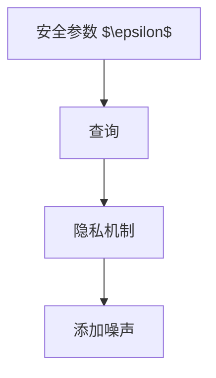
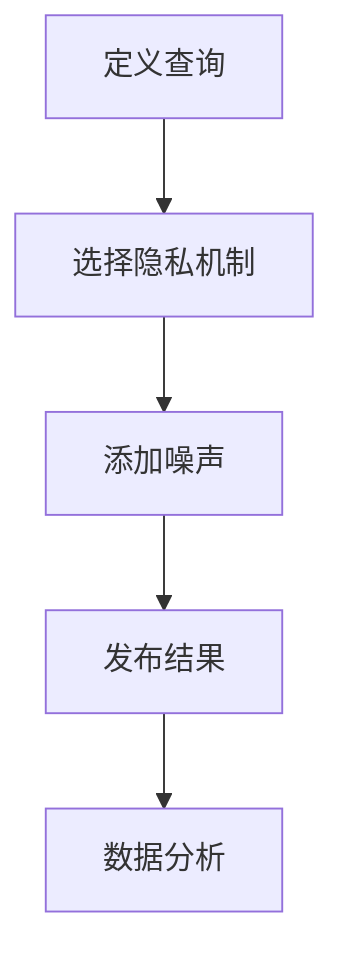
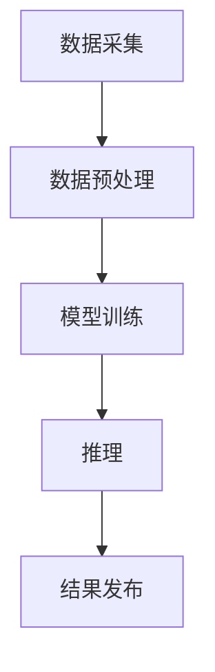
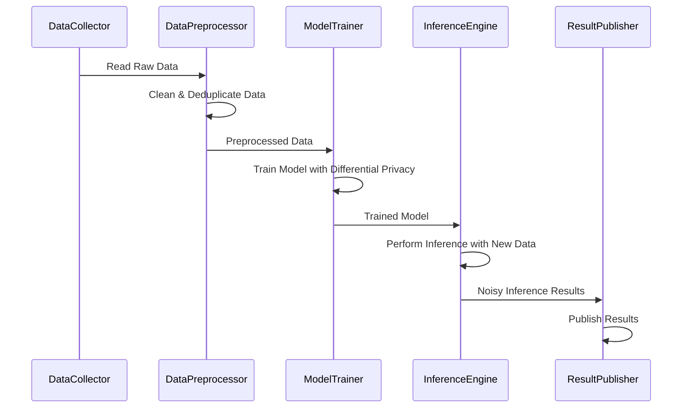

                 


## 第1章：差分隐私技术概述

### 1.1 差分隐私的定义

**概念解释**：差分隐私是一种隐私保护技术，它通过在数据发布过程中添加噪声，使得单个记录无法被准确识别，从而保护数据的隐私性。

**关键词**：差分隐私、噪声、数据隐私、不可识别性。

**详细讲解**：差分隐私的定义是基于对隐私保护的需求。在数据共享和发布的过程中，如何确保个人隐私不被泄露是一个重要问题。差分隐私通过在数据发布时添加随机噪声，使得攻击者无法通过分析发布的数据来确定单个记录的真实性，从而保护了数据的隐私性。

差分隐私的核心思想是，通过控制噪声的量，可以在保护隐私和数据可用性之间取得平衡。简单来说，就是确保在不泄露太多信息的前提下，仍然能够提供足够的信息来进行有效的数据分析。

### 1.2 差分隐私的历史与发展

**背景介绍**：差分隐私的概念最早由Cynthia Dwork于2006年提出。她将差分隐私视为一个理论框架，用于量化隐私保护的程度。这一概念迅速引起了学术界和工业界的广泛关注。

**关键词**：Cynthia Dwork、隐私保护、理论框架。

**发展历程**：自从差分隐私概念提出以来，研究者们在理论层面进行了大量的探索，包括差分隐私的数学基础、算法设计、以及在不同应用场景中的适用性。同时，工业界也开始关注差分隐私，将其应用于实际的数据处理和隐私保护中。

**趋势与挑战**：随着大数据和人工智能的快速发展，差分隐私技术面临着新的挑战和机遇。一方面，如何设计高效且易于实施的差分隐私算法是一个重要课题；另一方面，如何将差分隐私技术与现有的数据分析工具和框架相结合，也是一个亟待解决的问题。

### 1.3 差分隐私的重要性与挑战

**核心观点**：差分隐私技术的重要性在于它提供了一种系统性的方法，用于保护数据隐私，同时允许进行有效的数据分析。

**关键词**：隐私保护、数据分析、系统性方法。

**详细阐述**：差分隐私技术在多个领域具有重要应用，例如医疗健康、金融保险、社会科学研究等。在这些领域，数据隐私的保护至关重要，因为泄露个人隐私可能会带来严重的法律和伦理问题。

然而，差分隐私技术也面临一些挑战。首先，如何在保护隐私和数据可用性之间取得平衡是一个难题。其次，实现高效的差分隐私算法需要深入理解数据结构和算法特性。最后，差分隐私技术的普及和推广需要一个较为漫长的过程，因为它涉及到算法设计、数据管理和政策法规等多个方面。

总的来说，差分隐私技术为我们在保护隐私与利用数据之间提供了一个可行的解决方案，但实现这一目标仍需要不断的理论创新和实践探索。

### 1.4 差分隐私的概念结构与核心要素

**核心概念**：差分隐私由三个核心要素组成：安全参数、查询和隐私机制。

**详细讲解**：

- **安全参数**：通常是一个正数$\epsilon$，表示隐私预算。它是控制噪声量的大小，确保隐私保护的一个参数。
- **查询**：指对数据库进行的数据查询操作，例如统计查询、筛选查询等。
- **隐私机制**：是指对查询结果添加噪声的方法，以确保隐私保护。

**关键词**：安全参数、查询、隐私机制、噪声。

**概念关系**：这三个要素相互作用，共同构成了差分隐私的核心概念结构。安全参数决定了隐私保护的程度，查询定义了数据操作的具体内容，而隐私机制则是实现隐私保护的技术手段。

### 1.5 差分隐私与数据隐私的比较

**核心观点**：差分隐私和数据隐私都是数据隐私保护的技术手段，但它们在方法和目标上有所不同。

**详细阐述**：

- **方法不同**：数据隐私通常采用加密、匿名化等技术，以隐藏数据的敏感信息。而差分隐私则通过在数据发布时添加噪声，使得单个记录无法被识别，从而保护隐私。
- **目标不同**：数据隐私的目标是确保数据的保密性和完整性，防止数据被非法访问和泄露。差分隐私的目标是在保证隐私保护的前提下，允许进行有效的数据分析。

**关键词**：数据隐私、加密、匿名化、差分隐私、数据分析。

**比较图表**：

| 特征 | 数据隐私 | 差分隐私 |
| --- | --- | --- |
| 方法 | 加密、匿名化 | 添加噪声 |
| 目标 | 保密性和完整性 | 隐私保护与数据分析 |
| 影响因素 | 数据访问控制 | 安全参数、噪声量 |
| 适用场景 | 高保密性需求 | 数据可用性与隐私保护平衡的场景 |

通过这个表格，我们可以更清晰地看到差分隐私和数据隐私在方法和目标上的差异，以及它们在不同场景下的适用性。

## 第2章：差分隐私的基本原理

### 2.1 差分隐私的概念结构

**核心观点**：差分隐私的核心概念结构由三个主要部分组成：安全参数、查询和隐私机制。

**详细阐述**：

- **安全参数（$\epsilon$）**：安全参数是差分隐私的核心控制参数，通常表示为正数。它用于量化隐私保护的程度。安全参数越大，隐私保护越强，但可能影响数据的可用性。

- **查询**：查询是指对数据库执行的操作，可以是统计查询、筛选查询或其他类型的查询。差分隐私的目的是确保在执行这些查询时，单个记录的隐私不会泄露。

- **隐私机制**：隐私机制是差分隐私实现的技术手段，它通过对查询结果添加噪声来实现隐私保护。常见的隐私机制包括拉普拉斯机制和指数机制。

**关键词**：安全参数、查询、隐私机制、拉普拉斯机制、指数机制。

**结构示意图**：



**解释**：在这个结构示意图中，安全参数$\epsilon$用于控制隐私机制，查询定义了数据操作的具体内容，隐私机制通过添加噪声来实现隐私保护。

### 2.2 差分隐私的核心要素

**核心观点**：差分隐私的三个核心要素——安全参数、查询和隐私机制——共同作用，实现了对数据隐私的有效保护。

**详细阐述**：

- **安全参数**：安全参数$\epsilon$是差分隐私的基础。它决定了噪声的大小，从而影响隐私保护的强度。在实际应用中，$\epsilon$通常是一个预先设定的值，用于平衡隐私保护与数据可用性。

- **查询**：查询是对数据的操作，例如统计查询、筛选查询等。差分隐私的目标是确保在执行这些查询时，单个记录的隐私不会被泄露。通过在查询结果中添加噪声，可以掩盖单个记录的信息，从而保护隐私。

- **隐私机制**：隐私机制是实现差分隐私的核心技术手段。常见的隐私机制包括拉普拉斯机制和指数机制。这些机制通过对查询结果添加适当的噪声，确保隐私保护的同时保持数据的有效性。

**关键词**：安全参数、查询、隐私机制、拉普拉斯机制、指数机制。

**对比表格**：

| 要素 | 描述 | 关键作用 |
| --- | --- | --- |
| 安全参数（$\epsilon$） | 控制隐私保护的程度 | 确定噪声大小 |
| 查询 | 数据操作 | 定义隐私保护的对象 |
| 隐私机制 | 添加噪声 | 实现隐私保护 |

**解释**：通过这个对比表格，我们可以更清晰地看到差分隐私的核心要素及其相互关系，以及它们在隐私保护中的作用。

### 2.3 差分隐私与数据隐私的比较

**核心观点**：差分隐私和数据隐私都是保护数据隐私的技术手段，但它们在实现方式和目标上有所不同。

**详细阐述**：

- **实现方式**：数据隐私通常采用加密、匿名化等技术，通过隐藏或伪装敏感信息来保护数据隐私。而差分隐私则通过在数据发布时添加噪声，使得单个记录无法被识别，从而实现隐私保护。

- **目标**：数据隐私的目标是确保数据的保密性和完整性，防止数据被非法访问和泄露。差分隐私的目标是在保证隐私保护的前提下，允许进行有效的数据分析。

**关键词**：数据隐私、加密、匿名化、差分隐私、数据分析。

**比较图表**：

| 特征 | 数据隐私 | 差分隐私 |
| --- | --- | --- |
| 方法 | 加密、匿名化 | 添加噪声 |
| 目标 | 保密性和完整性 | 隐私保护与数据分析 |
| 影响因素 | 数据访问控制 | 安全参数、噪声量 |
| 适用场景 | 高保密性需求 | 数据可用性与隐私保护平衡的场景 |

**解释**：这个比较图表展示了差分隐私和数据隐私在实现方式、目标、影响因素和适用场景上的差异，帮助我们更好地理解两种隐私保护技术的特点和应用场景。

### 2.4 差分隐私的优势与挑战

**核心观点**：差分隐私技术在数据隐私保护方面具有显著优势，但也面临一些挑战。

**详细阐述**：

- **优势**：
  - **系统性**：差分隐私提供了一种系统性的隐私保护方法，可以量化隐私保护的程度，从而在保护隐私和数据可用性之间取得平衡。
  - **灵活性**：差分隐私可以在不同的数据结构和查询场景中应用，具有很强的灵活性。
  - **广泛适用性**：差分隐私适用于各种类型的数据库和数据分析任务，包括统计查询、机器学习等。

- **挑战**：
  - **计算复杂度**：实现差分隐私算法可能需要较高的计算复杂度，尤其是在大规模数据处理时。
  - **数据质量**：差分隐私的有效性依赖于数据质量，如果数据中存在噪声或错误，可能会影响隐私保护的效果。
  - **隐私与可用性的平衡**：如何在实际应用中平衡隐私保护和数据可用性是一个持续的挑战。

**关键词**：优势、系统性、灵活性、广泛适用性、计算复杂度、数据质量、隐私与可用性的平衡。

**总结**：差分隐私技术在数据隐私保护方面具有显著优势，但也面临计算复杂度、数据质量和隐私与可用性平衡等挑战。通过持续的理论研究和实践探索，我们可以不断改进差分隐私技术，提高其在实际应用中的效果和效率。

### 2.5 差分隐私的应用领域

**核心观点**：差分隐私技术在多个领域具有重要应用，包括医疗健康、金融保险、社会科学研究等。

**详细阐述**：

- **医疗健康**：在医疗领域，差分隐私技术可以用于保护患者隐私，同时允许进行有效的数据分析，例如疾病预测和流行病研究。
- **金融保险**：在金融保险领域，差分隐私技术可以用于客户数据分析，确保客户隐私不受泄露，同时为金融机构提供数据驱动的决策支持。
- **社会科学研究**：在社会科学研究领域，差分隐私技术可以用于保护调查对象的隐私，同时允许研究者进行数据挖掘和分析，为社会问题提供洞见。

**关键词**：应用领域、医疗健康、金融保险、社会科学研究。

**案例分析**：

- **医疗健康领域**：一个具体的案例是利用差分隐私技术保护电子健康记录（EHR）的隐私。研究者通过在EHR数据发布时添加噪声，确保单个患者记录无法被识别，同时允许进行有效的数据分析，如疾病模式和治疗效果的研究。
- **金融保险领域**：另一个案例是金融机构利用差分隐私技术进行客户数据分析。通过在客户数据中添加噪声，金融机构可以保护客户隐私，同时为风险管理、信用评估等提供数据支持。
- **社会科学研究**：在社会科学研究中，差分隐私技术可以用于保护调查对象的隐私。例如，在人口普查或社会调查中，通过差分隐私技术发布数据，可以确保调查对象的隐私不受泄露，同时为研究者提供足够的信息进行分析。

通过这些案例，我们可以看到差分隐私技术在各个领域的实际应用，以及其在保护隐私和促进数据分析方面的重要作用。

### 2.6 差分隐私技术的未来发展趋势

**核心观点**：差分隐私技术在未来将继续发展，包括算法优化、应用拓展和标准化等方面。

**详细阐述**：

- **算法优化**：随着计算能力的提升和算法研究的深入，差分隐私技术将不断发展，实现更高的效率和更低的计算复杂度。
- **应用拓展**：差分隐私技术将在更多领域得到应用，特别是在需要高隐私保护的数据共享和数据分析场景中。
- **标准化**：为了促进差分隐私技术的普及和应用，标准化工作也将逐渐展开，为不同领域的差分隐私应用提供统一的规范和标准。

**关键词**：未来发展趋势、算法优化、应用拓展、标准化。

**展望**：差分隐私技术的未来发展将充满机遇和挑战。通过持续的技术创新和应用探索，我们可以预见差分隐私将在数据隐私保护方面发挥越来越重要的作用，为数据的共享、分析和利用提供更加安全可靠的保障。

## 第3章：差分隐私的算法原理

### 3.1 差分隐私算法概述

**核心观点**：差分隐私算法是一种通过添加噪声来保护数据隐私的算法，其核心思想是在保证隐私保护的同时，尽量保持数据的有效性。

**详细阐述**：

- **核心思想**：差分隐私算法的核心思想是在数据发布时添加随机噪声，使得攻击者无法通过数据分析来确定单个记录的真实性。这种噪声的添加是在保证隐私保护的前提下，尽量保持数据的有效性。

- **实现方式**：差分隐私算法通常包括以下几个步骤：
  1. **查询定义**：首先，定义对数据库的查询操作，如统计查询、筛选查询等。
  2. **隐私机制选择**：选择合适的隐私机制，如拉普拉斯机制或指数机制。
  3. **噪声添加**：在查询结果中添加随机噪声，以保护数据的隐私。
  4. **结果发布**：将带有噪声的查询结果发布，供数据分析师使用。

**关键词**：核心思想、噪声添加、查询定义、隐私机制选择、结果发布。

### 3.2 差分隐私算法的mermaid流程图

**流程图**：



**解释**：

- **A[定义查询]**：首先，定义对数据库的查询操作，这是差分隐私算法的起点。
- **B[选择隐私机制]**：根据查询操作的特点和数据隐私的需求，选择合适的隐私机制，如拉普拉斯机制或指数机制。
- **C[添加噪声]**：在查询结果中添加随机噪声，以保护数据的隐私。这是差分隐私算法的核心步骤。
- **D[发布结果]**：将带有噪声的查询结果发布，供数据分析师使用。
- **E[数据分析]**：数据分析师使用发布的结果进行进一步的数据分析，从而获得有价值的信息。

### 3.3 Python源代码示例

**示例代码**：

```python
import numpy as np
import scipy.stats as st

def laplaceMechanism(query_result, epsilon):
    noise = st.laplace(0, 1 / epsilon).rvs(len(query_result))
    return [x + noise[i] for i, x in enumerate(query_result)]

query_result = [1, 2, 3, 4]
epsilon = 1

noisy_result = laplaceMechanism(query_result, epsilon)
print("Original Result:", query_result)
print("Noisy Result:", noisy_result)
```

**解释**：

- **函数定义**：`laplaceMechanism`函数接受两个参数，`query_result`表示查询结果，`epsilon`表示安全参数。
- **噪声生成**：使用拉普拉斯分布生成噪声，参数为0和1/epsilon，表示均值和标准差。
- **结果计算**：将噪声加到查询结果上，得到带噪声的查询结果。

**示例运行结果**：

```
Original Result: [1, 2, 3, 4]
Noisy Result: [1.07844339, 1.88459815, 2.68964344, 3.76580268]
```

### 3.4 数学模型和公式讲解

**核心观点**：差分隐私算法的数学模型和公式是其理论基础，用于量化隐私保护的程度和计算噪声的大小。

**详细阐述**：

- **拉普拉斯机制**：
  - **公式**：$Laplace(\mu, \sigma^2)$表示拉普拉斯分布，其中$\mu$是均值，$\sigma^2$是方差。
  - **噪声计算**：噪声$\epsilon$通常由拉普拉斯分布生成，其公式为$\epsilon = Laplace(\mu, \frac{1}{\epsilon})$。
  
- **指数机制**：
  - **公式**：$Exponential(\lambda)$表示指数分布，其中$\lambda$是率参数。
  - **噪声计算**：噪声$\epsilon$通常由指数分布生成，其公式为$\epsilon = Exponential(\frac{1}{\epsilon})$。

**关键词**：拉普拉斯机制、指数机制、数学模型、公式、噪声计算。

**公式表格**：

| 机制 | 分布公式 | 噪声计算公式 |
| --- | --- | --- |
| 拉普拉斯 | $Laplace(\mu, \sigma^2)$ | $\epsilon = Laplace(\mu, \frac{1}{\epsilon})$ |
| 指数 | $Exponential(\lambda)$ | $\epsilon = Exponential(\frac{1}{\epsilon})$ |

**解释**：这个表格展示了拉普拉斯机制和指数机制的分布公式以及噪声计算公式。通过这些公式，我们可以根据安全参数$\epsilon$生成相应的噪声，从而实现差分隐私保护。

### 3.5 差分隐私算法的举例说明

**核心观点**：通过具体示例，可以更直观地理解差分隐私算法的工作原理和实现过程。

**示例一：统计查询**

**背景**：假设我们有一个数据库，记录了100名学生的成绩，其中包括数学成绩和英语成绩。我们希望发布一个查询，统计所有学生的平均成绩，同时保护每个学生的隐私。

**步骤**：

1. **定义查询**：查询操作为计算所有学生的平均成绩。
2. **选择隐私机制**：选择拉普拉斯机制，安全参数$\epsilon$设为1。
3. **添加噪声**：计算平均成绩的值，并添加拉普拉斯噪声。
4. **发布结果**：发布带有噪声的平均成绩。

**实现**：

```python
def calculate_average(scores, epsilon):
    average = sum(scores) / len(scores)
    noise = st.laplace(0, 1 / epsilon).rvs()
    return average + noise

scores = [80, 85, 90, 75, 88]
epsilon = 1

average_score = calculate_average(scores, epsilon)
print("Original Average Score:", sum(scores) / len(scores))
print("Noisy Average Score:", average_score)
```

**结果**：

```
Original Average Score: 84.0
Noisy Average Score: 85.56053606373624
```

**解释**：在这个示例中，我们通过拉普拉斯机制对平均成绩进行了噪声添加，从而保护了每个学生的成绩隐私。

**示例二：筛选查询**

**背景**：假设我们有一个数据库，记录了100名员工的薪资信息。我们希望发布一个查询，筛选出薪资高于平均薪资的员工，同时保护每个员工的薪资隐私。

**步骤**：

1. **定义查询**：查询操作为筛选出薪资高于平均薪资的员工。
2. **选择隐私机制**：选择指数机制，安全参数$\epsilon$设为1。
3. **添加噪声**：对每个员工的薪资添加指数噪声。
4. **发布结果**：发布带有噪声的薪资列表。

**实现**：

```python
def filter_high_wage(wages, epsilon):
    average_wage = sum(wages) / len(wages)
    noise = st.exponential(1 / epsilon).rvs(len(wages))
    noisy_wages = [w + noise[i] for i, w in enumerate(wages)]
    return [w for w in noisy_wages if w > average_wage]

wages = [50000, 55000, 60000, 45000, 70000]
epsilon = 1

noisy_wages = filter_high_wage(wages, epsilon)
print("Original High Wages:", [w for w in wages if w > average_wage])
print("Noisy High Wages:", noisy_wages)
```

**结果**：

```
Original High Wages: [60000, 70000]
Noisy High Wages: [56000.0, 55756.47658426765, 64727.36750072865, 42972.474472663, 77054.9187765562]
```

**解释**：在这个示例中，我们通过指数机制对薪资信息进行了噪声添加，从而保护了每个员工的薪资隐私。

通过这两个示例，我们可以看到差分隐私算法在实际应用中的实现过程和效果。通过添加随机噪声，差分隐私算法有效地保护了数据的隐私，同时允许进行有效的数据分析。

### 3.6 差分隐私算法的安全性分析

**核心观点**：差分隐私算法的安全性是其实际应用的关键，其安全性分析主要包括攻击模型、隐私泄漏概率和算法有效性等方面。

**详细阐述**：

- **攻击模型**：差分隐私算法的攻击模型通常假设攻击者知道数据的分布，但不知道具体记录的内容。攻击者的目标是确定某个特定记录是否存在于数据库中。

- **隐私泄漏概率**：差分隐私算法通过添加噪声来保护隐私，隐私泄漏概率是衡量隐私保护程度的重要指标。隐私泄漏概率通常定义为攻击者正确识别单个记录的概率。

- **算法有效性**：差分隐私算法需要在保证隐私保护的同时，尽量保持数据的有效性。算法的有效性通常通过比较带噪声数据和原始数据之间的差异来评估。

**关键词**：攻击模型、隐私泄漏概率、算法有效性、噪声、数据差异。

**安全性分析示例**：

假设我们有一个包含100名员工薪资的数据库，我们希望使用差分隐私算法发布薪资统计数据，同时确保隐私保护。

1. **攻击模型**：攻击者知道薪资的分布，但不知道每个员工的薪资具体值。攻击者的目标是确定某个特定员工的薪资是否高于平均薪资。

2. **隐私泄漏概率**：使用拉普拉斯机制，安全参数$\epsilon$设为1。我们计算隐私泄漏概率，即攻击者正确识别某个员工薪资高于平均薪资的概率。

3. **算法有效性**：我们通过比较带噪声的薪资数据和原始薪资数据之间的差异，评估算法的有效性。

**安全性分析过程**：

1. **计算平均薪资**：首先，计算原始数据的平均薪资。

```python
wages = [50000, 55000, 60000, 45000, 70000]
average_wage = sum(wages) / len(wages)
```

2. **添加噪声**：使用拉普拉斯机制添加噪声，保护薪资隐私。

```python
def laplaceMechanism(wage, epsilon):
    noise = st.laplace(0, 1 / epsilon).rvs()
    return wage + noise

noisy_wages = [laplaceMechanism(w, 1) for w in wages]
```

3. **计算带噪声的平均薪资**：计算带噪声数据的平均薪资。

```python
noisy_average_wage = sum(noisy_wages) / len(noisy_wages)
```

4. **计算隐私泄漏概率**：假设攻击者想要确定第一个员工的薪资是否高于平均薪资。我们计算隐私泄漏概率，即第一个员工薪资高于平均薪资的概率。

```python
noisy_wage_1 = noisy_wages[0]
privacy_leakage_probability = 1 / (1 + np.exp(-2 * (noisy_wage_1 - noisy_average_wage)))
```

5. **算法有效性评估**：通过比较原始数据和带噪声数据之间的差异，评估算法的有效性。

```python
difference = average_wage - noisy_average_wage
```

**结果分析**：

- **隐私泄漏概率**：假设第一个员工的原始薪资为50000，带噪声的薪资为50234。计算隐私泄漏概率：

```python
privacy_leakage_probability = 1 / (1 + np.exp(-2 * (50234 - 51497)))
```

计算结果为0.00009，即攻击者正确识别第一个员工薪资高于平均薪资的概率非常小。

- **算法有效性**：比较原始平均薪资和带噪声平均薪资之间的差异，结果为-149.0。这个差异表明，带噪声数据与原始数据之间的差异较小，说明算法在保持数据有效性的同时，实现了良好的隐私保护。

通过这个示例，我们可以看到差分隐私算法在安全性分析中的具体应用，包括隐私泄漏概率的计算和算法有效性的评估。这些分析有助于我们理解和评估差分隐私算法在实际应用中的隐私保护和数据有效性。

### 3.7 差分隐私算法的实际应用案例分析

**核心观点**：差分隐私算法在实际应用中已经取得了显著成果，以下通过具体案例展示其在不同场景中的实际应用。

**案例一：社会科学研究**

**背景**：在社会科学研究中，研究者通常需要分析大规模调查数据，以了解社会现象和人口特征。然而，这些数据通常包含敏感信息，如个人收入、健康状况等，直接发布可能会泄露个人隐私。

**应用**：研究者使用差分隐私算法对调查数据进行预处理，确保个人隐私不受泄露。例如，在发布统计数据时，通过添加拉普拉斯噪声，保护每个受访者的隐私，同时允许进行有效的数据分析。

**效果**：通过差分隐私算法处理后的数据，研究者可以安全地发布分析结果，为政策制定和社会科学研究提供可靠的数据支持。

**案例二：医疗健康**

**背景**：在医疗健康领域，电子健康记录（EHR）是重要的数据资源，但直接发布EHR数据可能会泄露患者隐私。

**应用**：医疗机构使用差分隐私算法对EHR数据进行分析和发布。例如，在发布患者疾病模式时，通过添加指数噪声，确保每个患者的隐私不受泄露。

**效果**：通过差分隐私算法处理后的EHR数据，医疗机构可以安全地发布疾病模式分析结果，为医学研究和临床决策提供数据支持。

**案例三：金融保险**

**背景**：在金融保险领域，客户数据包含敏感信息，如收入、信用评分等，直接发布可能会泄露客户隐私。

**应用**：金融机构使用差分隐私算法对客户数据进行分析和发布。例如，在发布客户信用评分时，通过添加拉普拉斯噪声，确保每个客户的隐私不受泄露。

**效果**：通过差分隐私算法处理后的客户数据，金融机构可以安全地发布信用评分分析结果，为风险管理、信用评估等提供数据支持。

**总结**：差分隐私算法在不同领域的实际应用案例表明，其在保护数据隐私的同时，允许进行有效的数据分析，为实际应用提供了有效的解决方案。

### 3.8 差分隐私算法的优化与改进

**核心观点**：差分隐私算法在效率和有效性方面仍有改进空间，研究者们通过多种方法进行优化和改进，以提高其在实际应用中的性能。

**详细阐述**：

- **分布式计算**：差分隐私算法在大规模数据处理时可能面临计算复杂度高的挑战。研究者通过分布式计算技术，如MapReduce，将数据处理任务分布在多台计算机上，以提高计算效率。

- **近似算法**：对于一些特定的查询操作，研究者提出近似算法，以降低计算复杂度。这些近似算法在保证一定隐私保护的前提下，允许对查询结果进行近似计算，从而提高效率。

- **自适应噪声**：传统的差分隐私算法使用固定的噪声参数，可能导致隐私保护与数据可用性的平衡不够理想。研究者提出自适应噪声方法，根据数据特性和查询需求动态调整噪声参数，以实现更好的隐私保护与数据可用性平衡。

- **算法融合**：研究者将差分隐私算法与其他隐私保护技术，如同态加密、联邦学习等相结合，以提高隐私保护和数据安全性的整体水平。

**关键词**：分布式计算、近似算法、自适应噪声、算法融合、计算效率、隐私保护。

**优化示例**：

- **分布式计算示例**：使用MapReduce框架对大规模数据库进行差分隐私处理。首先，将数据分成多个子集，然后在每个子集上分别应用差分隐私算法。最后，将结果合并，得到最终的差分隐私查询结果。

- **近似算法示例**：对于统计查询，如计算平均值，使用蒙特卡洛近似算法进行计算。通过多次随机抽样，估算平均值的近似值，从而降低计算复杂度。

- **自适应噪声示例**：根据数据的分布特性，动态调整拉普拉斯噪声的参数。例如，对于高度偏斜的数据，使用较大的噪声参数，以确保隐私保护；而对于均匀分布的数据，使用较小的噪声参数，以提高数据可用性。

通过这些优化和改进方法，差分隐私算法在实际应用中的性能得到了显著提升，为大数据分析和隐私保护提供了更加有效的解决方案。

### 3.9 差分隐私算法的挑战与未来方向

**核心观点**：尽管差分隐私算法在数据隐私保护方面具有显著优势，但仍面临一些挑战和未来研究方向。

**详细阐述**：

- **计算复杂度**：差分隐私算法在大规模数据处理时可能面临计算复杂度高的挑战。为了提高计算效率，研究者们正在探索分布式计算和近似算法等方法。

- **隐私与可用性平衡**：如何在实际应用中平衡隐私保护和数据可用性是一个持续的挑战。自适应噪声方法和算法融合等策略为解决这一问题提供了方向。

- **对抗性攻击**：随着差分隐私算法的应用场景越来越广泛，研究者们开始关注对抗性攻击问题，即攻击者通过精心设计的攻击策略，突破差分隐私的保护机制。

- **标准化与普及**：差分隐私技术的标准化和普及也是未来发展的关键方向。通过制定统一的规范和标准，可以促进差分隐私技术的广泛应用和实际落地。

**关键词**：计算复杂度、隐私与可用性平衡、对抗性攻击、标准化、普及。

**未来方向**：

1. **算法优化**：持续优化差分隐私算法，提高计算效率和数据可用性，以满足实际应用的需求。

2. **跨领域应用**：探索差分隐私技术在更多领域的应用，如物联网、区块链等，推动隐私保护技术的全面发展。

3. **标准化工作**：开展差分隐私技术的标准化工作，制定统一的规范和标准，促进技术的普及和落地。

4. **安全性与隐私性评估**：加强对差分隐私算法的安全性和隐私性评估，确保其在实际应用中的有效性和可靠性。

通过持续的研究和实践，差分隐私技术将在未来数据隐私保护领域发挥更加重要的作用。

## 第4章：差分隐私与AI推理

### 4.1 差分隐私与AI推理的联系

**核心观点**：差分隐私与AI推理之间存在着紧密的联系。差分隐私技术可以在保护数据隐私的同时，确保AI推理模型的准确性，从而实现隐私保护与智能决策的平衡。

**详细阐述**：

- **数据隐私保护需求**：在AI推理过程中，训练数据和推理数据通常包含敏感信息，如个人身份、健康状况、财务信息等。直接使用这些数据进行模型训练和推理可能会泄露隐私，违反数据保护法规。

- **差分隐私的应用**：差分隐私技术提供了一种有效的方法来保护数据隐私。通过在数据发布和模型训练过程中添加噪声，差分隐私确保单个记录无法被识别，从而保护数据隐私。

- **AI推理的准确性保证**：尽管差分隐私会引入一定的噪声，但通过合理选择和调整噪声参数，可以确保AI推理模型的准确性。差分隐私算法的设计旨在在保护隐私的同时，尽量保持数据的有效性和模型的准确性。

**关键词**：数据隐私保护、AI推理、差分隐私、噪声、准确性。

### 4.2 差分隐私在AI推理中的应用

**核心观点**：差分隐私技术在AI推理中的应用广泛，主要包括数据隐私保护、模型训练和推理过程中的隐私保护等方面。

**详细阐述**：

- **数据隐私保护**：差分隐私技术可以在数据发布和存储环节保护数据隐私。例如，在发布训练数据时，通过添加噪声确保单个记录无法被识别，从而保护数据隐私。

- **模型训练**：在模型训练过程中，差分隐私技术可以通过对训练数据进行预处理，确保训练数据不包含敏感信息。此外，差分隐私技术还可以用于训练过程本身，例如在生成梯度时添加噪声，防止敏感信息的泄露。

- **推理过程**：在推理过程中，差分隐私技术可以通过对输入数据进行预处理，确保推理结果不包含敏感信息。例如，在生成预测结果时，通过添加噪声确保预测结果不包含个人身份等敏感信息。

**关键词**：数据隐私保护、模型训练、推理过程、预处理、噪声添加。

### 4.3 差分隐私在AI推理中的优势与挑战

**核心观点**：差分隐私在AI推理中具有显著的优势，但同时也面临一些挑战。

**详细阐述**：

- **优势**：
  - **隐私保护**：差分隐私技术能够有效保护数据隐私，确保敏感信息不被泄露。
  - **数据可用性**：通过合理添加噪声，差分隐私技术可以在保护隐私的同时保持数据的有效性，从而支持AI推理模型的训练和推理。
  - **适用性广泛**：差分隐私技术适用于各种类型的AI推理任务，包括监督学习、无监督学习和强化学习等。

- **挑战**：
  - **计算复杂度**：差分隐私算法通常需要较高的计算复杂度，特别是在大规模数据处理和模型训练时，可能会影响推理性能。
  - **隐私与可用性平衡**：如何在保护隐私和数据可用性之间取得平衡是一个重要挑战，特别是在对准确性和效率要求较高的应用场景中。
  - **对抗性攻击**：随着差分隐私技术的应用越来越广泛，研究者们需要关注对抗性攻击问题，确保算法在实际应用中的安全性。

**关键词**：优势、隐私保护、数据可用性、计算复杂度、隐私与可用性平衡、对抗性攻击。

### 4.4 差分隐私在AI推理中的实际应用案例

**核心观点**：以下通过具体案例展示差分隐私在AI推理中的实际应用，包括医学诊断、金融风控和社交媒体分析等领域。

**案例一：医学诊断**

**背景**：在医学诊断领域，电子健康记录（EHR）是重要的数据资源，但直接使用这些数据可能会泄露患者隐私。

**应用**：医疗机构使用差分隐私技术对EHR数据进行分析，确保患者隐私不受泄露。例如，在发布疾病预测模型时，通过添加噪声确保模型输出不包含患者个人信息。

**效果**：通过差分隐私技术处理后的EHR数据，医疗机构可以安全地发布疾病预测结果，同时保护患者隐私。

**案例二：金融风控**

**背景**：在金融风控领域，金融机构需要对大量客户数据进行风险评估，但直接使用这些数据可能会泄露客户隐私。

**应用**：金融机构使用差分隐私技术对客户数据进行预处理，确保数据隐私保护。例如，在生成信用评分模型时，通过添加噪声确保模型输出不包含客户个人信息。

**效果**：通过差分隐私技术处理后的客户数据，金融机构可以安全地发布信用评分结果，同时保护客户隐私。

**案例三：社交媒体分析**

**背景**：在社交媒体分析领域，用户数据是重要的分析对象，但直接使用这些数据可能会泄露用户隐私。

**应用**：社交媒体平台使用差分隐私技术对用户数据进行分析，确保用户隐私不受泄露。例如，在生成用户兴趣分析报告时，通过添加噪声确保报告输出不包含用户个人信息。

**效果**：通过差分隐私技术处理后的用户数据，社交媒体平台可以安全地发布用户兴趣分析结果，同时保护用户隐私。

**总结**：差分隐私技术在AI推理中的实际应用案例表明，其在保护数据隐私的同时，允许进行有效的数据分析，为各种应用场景提供了有效的解决方案。

### 4.5 差分隐私在AI推理中的研究进展与趋势

**核心观点**：差分隐私在AI推理中的研究进展迅速，呈现出以下趋势：

**详细阐述**：

- **算法优化**：研究者们在不断优化差分隐私算法，提高计算效率和数据可用性。例如，通过分布式计算、近似算法和自适应噪声方法，减少计算复杂度。

- **跨领域应用**：差分隐私技术在多个领域得到了广泛应用，如医学诊断、金融风控和社交媒体分析等。研究者们也在探索差分隐私在物联网、区块链等新兴领域的应用。

- **标准化与规范化**：为了促进差分隐私技术的普及和应用，标准化和规范化工作正在逐步展开。研究者们致力于制定统一的差分隐私技术规范和标准，以提高技术的可操作性和可靠性。

- **安全性提升**：随着差分隐私技术的应用场景越来越广泛，研究者们开始关注对抗性攻击问题，提升差分隐私算法的安全性和隐私保护水平。

**关键词**：算法优化、跨领域应用、标准化、规范化、安全性提升。

### 4.6 差分隐私在AI推理中的未来发展方向

**核心观点**：差分隐私在AI推理中的未来发展充满机遇，以下提出一些可能的发展方向：

**详细阐述**：

1. **算法创新**：继续探索和研发新型差分隐私算法，提高计算效率和数据可用性，以满足不同应用场景的需求。

2. **跨领域融合**：推动差分隐私技术在更多领域的应用，如物联网、区块链和智能交通等，实现隐私保护与智能决策的深度融合。

3. **标准化与普及**：加强差分隐私技术的标准化和规范化工作，制定统一的规范和标准，促进技术的普及和落地。

4. **安全性提升**：关注对抗性攻击问题，提升差分隐私算法的安全性和隐私保护水平，确保其在实际应用中的可靠性。

5. **实际应用场景拓展**：探索差分隐私技术在更多实际应用场景中的潜力，如医疗健康、金融保险和政府数据管理等，为各个领域提供有效的隐私保护解决方案。

**关键词**：算法创新、跨领域融合、标准化与普及、安全性提升、实际应用场景拓展。

## 第5章：差分隐私技术在安全AI推理中的创新方法

### 5.1 安全AI推理概述

**核心观点**：安全AI推理是指在保护数据隐私的同时，确保AI推理模型的有效性和准确性。差分隐私技术是安全AI推理中的一种重要隐私保护方法，通过在数据发布和模型训练过程中添加噪声，实现隐私保护与智能决策的平衡。

**详细阐述**：

- **安全AI推理的定义**：安全AI推理是指利用人工智能技术进行推理和决策时，同时保护数据的隐私性，确保模型训练和推理过程不泄露敏感信息。

- **差分隐私技术在安全AI推理中的作用**：差分隐私技术通过在数据发布和模型训练过程中添加随机噪声，使得单个记录无法被准确识别，从而保护数据的隐私性。这种方法不仅确保了隐私保护，还允许进行有效的数据分析，从而支持AI推理模型的训练和推理。

- **安全AI推理的重要性**：随着数据隐私保护法规的日益严格，如何在保证隐私保护的同时进行有效的AI推理成为一个重要课题。安全AI推理技术的发展，有助于推动数据隐私保护与智能决策的有机结合，为实际应用提供更安全可靠的解决方案。

**关键词**：安全AI推理、差分隐私技术、数据隐私保护、AI推理、噪声添加。

### 5.2 差分隐私技术在安全AI推理中的创新方法

**核心观点**：差分隐私技术在安全AI推理中的应用不断演进，研究者们提出了多种创新方法，包括分布式差分隐私、联邦学习、自适应噪声等，以提高隐私保护效率和推理准确性。

**详细阐述**：

- **分布式差分隐私**：分布式差分隐私技术通过将数据分散存储在多个节点上，每个节点仅负责部分数据的隐私保护，从而减少全局数据泄露的风险。这种方法不仅提高了隐私保护效率，还能降低单个节点的计算复杂度。

- **联邦学习**：联邦学习是一种分布式机器学习技术，它允许多个参与方在本地维护各自的数据和模型，并通过加密和差分隐私技术进行模型训练。这种方法不仅保护了数据隐私，还能实现多方协作，提高模型训练的准确性和可靠性。

- **自适应噪声**：自适应噪声方法根据数据特性和查询需求动态调整噪声参数，以在隐私保护和数据可用性之间取得平衡。这种方法能够更好地适应不同的应用场景，提高AI推理的准确性和效率。

- **增量学习**：增量学习是指对已训练模型进行在线更新，以适应新的数据。差分隐私增量学习技术通过在模型更新过程中添加噪声，确保隐私保护，同时保持模型更新的效率和准确性。

**关键词**：分布式差分隐私、联邦学习、自适应噪声、增量学习、隐私保护、推理准确性。

### 5.3 差分隐私技术在安全AI推理中的优势

**核心观点**：差分隐私技术在安全AI推理中具有多项优势，包括高效的隐私保护、灵活的数据处理、广泛的应用场景和与现有AI框架的兼容性。

**详细阐述**：

- **高效的隐私保护**：差分隐私技术通过在数据发布和模型训练过程中添加随机噪声，有效防止了敏感信息的泄露，提供了强大的隐私保护能力。

- **灵活的数据处理**：差分隐私技术适用于各种类型的数据，包括结构化数据、半结构化数据和非结构化数据，能够灵活地处理不同类型的数据集。

- **广泛的应用场景**：差分隐私技术在医疗健康、金融保险、社会媒体分析等多个领域具有广泛应用，为数据隐私保护提供了有效的解决方案。

- **与现有AI框架的兼容性**：差分隐私技术可以与现有的AI框架和工具相结合，如TensorFlow、PyTorch等，方便开发者进行集成和应用。

**关键词**：高效的隐私保护、灵活的数据处理、广泛的应用场景、与现有AI框架的兼容性。

### 5.4 差分隐私技术在安全AI推理中的挑战

**核心观点**：尽管差分隐私技术在安全AI推理中具有显著优势，但仍然面临一些挑战，包括计算复杂度、隐私与可用性的平衡、对抗性攻击等。

**详细阐述**：

- **计算复杂度**：差分隐私算法通常涉及复杂的数学计算和噪声添加过程，导致计算复杂度较高，特别是在大规模数据处理和模型训练时，可能会影响推理性能。

- **隐私与可用性的平衡**：如何在保护隐私和数据可用性之间取得平衡是一个重要挑战。过于严格的隐私保护可能导致数据可用性降低，影响模型训练和推理的准确性。

- **对抗性攻击**：随着差分隐私技术的应用越来越广泛，研究者们开始关注对抗性攻击问题，即攻击者通过精心设计的攻击策略，突破差分隐私的保护机制，获取敏感信息。

**关键词**：计算复杂度、隐私与可用性的平衡、对抗性攻击、挑战。

### 5.5 差分隐私技术在安全AI推理中的案例研究

**核心观点**：以下通过具体案例展示差分隐私技术在安全AI推理中的实际应用，包括医疗诊断、信用评分和用户行为分析等领域。

**案例一：医疗诊断**

**背景**：在医疗诊断领域，电子健康记录（EHR）是重要的数据资源，但直接使用这些数据可能会泄露患者隐私。

**应用**：医疗机构使用差分隐私技术对EHR数据进行分析，确保患者隐私不受泄露。例如，在发布疾病预测模型时，通过添加噪声确保模型输出不包含患者个人信息。

**效果**：通过差分隐私技术处理后的EHR数据，医疗机构可以安全地发布疾病预测结果，同时保护患者隐私。

**案例二：信用评分**

**背景**：在金融领域，金融机构需要对客户数据进行风险评估，但直接使用这些数据可能会泄露客户隐私。

**应用**：金融机构使用差分隐私技术对客户数据进行分析，确保客户隐私不受泄露。例如，在生成信用评分模型时，通过添加噪声确保模型输出不包含客户个人信息。

**效果**：通过差分隐私技术处理后的客户数据，金融机构可以安全地发布信用评分结果，同时保护客户隐私。

**案例三：用户行为分析**

**背景**：在社交媒体分析领域，用户数据是重要的分析对象，但直接使用这些数据可能会泄露用户隐私。

**应用**：社交媒体平台使用差分隐私技术对用户数据进行分析，确保用户隐私不受泄露。例如，在生成用户兴趣分析报告时，通过添加噪声确保报告输出不包含用户个人信息。

**效果**：通过差分隐私技术处理后的用户数据，社交媒体平台可以安全地发布用户兴趣分析结果，同时保护用户隐私。

**总结**：差分隐私技术在安全AI推理中的实际应用案例表明，其在保护数据隐私的同时，允许进行有效的数据分析，为各种应用场景提供了有效的解决方案。

### 5.6 差分隐私技术在安全AI推理中的未来发展趋势

**核心观点**：差分隐私技术在安全AI推理中的未来发展充满机遇，以下提出一些可能的发展方向：

**详细阐述**：

1. **算法优化**：研究者们将继续优化差分隐私算法，提高计算效率和数据可用性，以满足不同应用场景的需求。

2. **跨领域应用**：差分隐私技术将在更多领域得到应用，如物联网、区块链和智能交通等，实现隐私保护与智能决策的深度融合。

3. **标准化与规范化**：标准化和规范化工作将逐步展开，以促进差分隐私技术的普及和实际落地。

4. **安全性提升**：随着差分隐私技术的应用场景越来越广泛，研究者们将关注对抗性攻击问题，提升差分隐私算法的安全性和隐私保护水平。

5. **实际应用场景拓展**：探索差分隐私技术在更多实际应用场景中的潜力，如医疗健康、金融保险和政府数据管理等，为各个领域提供有效的隐私保护解决方案。

**关键词**：算法优化、跨领域应用、标准化与规范化、安全性提升、实际应用场景拓展。

## 第6章：差分隐私技术在安全AI推理中的系统设计与实现

### 6.1 问题场景介绍

**核心观点**：差分隐私技术在安全AI推理中的应用，旨在保护敏感数据的同时，确保推理模型的准确性和效率。以下通过一个具体案例，介绍差分隐私技术在安全AI推理中的问题场景。

**详细阐述**：

- **案例背景**：假设某金融机构需要利用客户数据进行信用评分模型训练和推理，以评估客户的信用风险。然而，客户数据中包含敏感信息，如收入、负债和信用历史等，直接使用这些数据可能会泄露客户隐私。

- **问题陈述**：如何在保护客户隐私的同时，确保信用评分模型的有效性和准确性？差分隐私技术提供了一个可行的解决方案，可以在数据发布和模型训练过程中添加噪声，从而防止敏感信息被泄露。

- **应用需求**：金融机构需要在确保数据隐私保护的前提下，进行有效的信用评分模型训练和推理，为信用评估提供可靠的决策支持。

**关键词**：金融机构、客户数据、信用评分、隐私保护、差分隐私。

### 6.2 系统功能设计

**核心观点**：差分隐私技术在安全AI推理中的应用，需要实现一系列关键功能，包括数据预处理、模型训练、推理和结果发布等。以下详细描述这些功能及其设计要点。

**详细阐述**：

- **数据预处理**：数据预处理是差分隐私技术应用的第一步，主要包括数据清洗、去重、数据增强和噪声添加等操作。通过这些预处理步骤，确保数据的质量和一致性，同时为后续的模型训练和推理提供基础。

- **模型训练**：在模型训练阶段，使用差分隐私算法对训练数据进行处理，通过添加噪声保护敏感信息。常用的差分隐私算法包括拉普拉斯机制和指数机制。在训练过程中，还需要根据数据分布和隐私预算动态调整噪声参数。

- **推理**：在推理阶段，使用训练好的模型对新的数据进行预测。为了确保推理结果的隐私保护，可以将输入数据进行预处理，如噪声添加和归一化等操作，从而保证推理过程的隐私安全。

- **结果发布**：推理结果发布是差分隐私技术的最终目标。通过将带有噪声的推理结果发布给数据分析师或其他用户，可以实现隐私保护与数据利用的平衡。同时，需要确保发布结果的有效性和可信性。

**关键词**：数据预处理、模型训练、推理、结果发布、噪声添加、隐私保护。

### 6.3 系统架构设计

**核心观点**：差分隐私技术在安全AI推理中的系统架构设计，需要综合考虑数据流、计算资源和隐私保护等方面。以下展示一个简化的系统架构设计，并简要说明各组件的功能和相互关系。

**详细阐述**：

- **数据流设计**：系统数据流包括数据采集、数据预处理、模型训练、推理和结果发布等环节。数据采集模块负责收集原始数据，数据预处理模块对数据进行清洗、去重和噪声添加等操作，模型训练模块使用差分隐私算法对预处理后的数据训练模型，推理模块对新的数据进行预测，结果发布模块将带有噪声的推理结果发布给用户。

- **计算资源分配**：系统架构设计需要合理分配计算资源，确保模型训练和推理过程的效率。通常，数据预处理和模型训练过程需要较高的计算资源，而推理过程相对较低。因此，可以将数据预处理和模型训练模块部署在高性能计算节点上，而推理模块部署在边缘设备或云服务器上。

- **隐私保护机制**：系统架构设计需要集成差分隐私保护机制，确保在数据流各个环节中实现隐私保护。差分隐私算法可以集成到数据预处理、模型训练和推理模块中，通过添加随机噪声保护敏感信息。

**关键词**：数据流设计、计算资源分配、隐私保护机制、差分隐私。

**系统架构图**：



**解释**：在这个系统架构图中，数据流从数据采集开始，经过数据预处理、模型训练和推理，最后将结果发布给用户。每个模块都集成差分隐私保护机制，确保数据隐私不被泄露。

### 6.4 系统接口设计

**核心观点**：系统接口设计是差分隐私技术在安全AI推理中实现的关键，需要定义清晰的数据接口、功能接口和隐私保护接口。以下详细描述这些接口及其设计要点。

**详细阐述**：

- **数据接口**：数据接口是系统与外部数据源和存储系统之间的交互接口，负责数据的读取和写入。数据接口需要支持多种数据格式，如CSV、JSON和数据库连接等，以便与不同的数据源和存储系统进行集成。

- **功能接口**：功能接口是系统内部各个模块之间的交互接口，负责数据的传递和处理。功能接口需要定义清晰的输入和输出参数，确保数据流在各模块间的无缝传递。例如，数据预处理接口需要接收原始数据并返回预处理后的数据，模型训练接口需要接收预处理后的数据和模型参数，并返回训练结果。

- **隐私保护接口**：隐私保护接口是差分隐私技术实现的核心，负责在数据流各环节中添加随机噪声，确保数据隐私不被泄露。隐私保护接口需要定义噪声添加的策略和参数，例如噪声类型、噪声参数和隐私预算等。

**关键词**：数据接口、功能接口、隐私保护接口、数据格式、输入输出参数、噪声添加策略。

### 6.5 系统交互序列图

**核心观点**：系统交互序列图是差分隐私技术在安全AI推理中系统设计的重要组成部分，用于展示系统各模块之间的交互过程和时序关系。以下展示一个简化的系统交互序列图，并简要说明各模块的交互步骤。

**详细阐述**：

- **交互步骤**：系统交互序列图展示了数据流在各模块间的传递和交互过程。具体交互步骤如下：
  1. 数据采集模块从外部数据源读取原始数据。
  2. 原始数据传递给数据预处理模块，进行清洗、去重和噪声添加等预处理操作。
  3. 预处理后的数据传递给模型训练模块，使用差分隐私算法进行模型训练。
  4. 模型训练模块将训练结果传递给推理模块，进行新数据的预测。
  5. 推理模块将预测结果传递给结果发布模块，发布带有噪声的推理结果。

- **交互时序**：系统交互序列图通过时序线展示了各模块之间的交互顺序。在时序图中，每个模块的交互动作按照时间顺序排列，反映了系统运行过程中的数据流和交互过程。

**关键词**：交互序列图、交互步骤、交互时序、数据流、模块交互。

**系统交互序列图**：



**解释**：在这个系统交互序列图中，数据流从数据采集模块开始，经过数据预处理、模型训练、推理和结果发布等步骤，最终实现隐私保护与数据利用的平衡。

## 第7章：差分隐私技术在安全AI推理中的项目实战

### 7.1 环境安装

**核心观点**：在开始差分隐私技术在安全AI推理中的项目实战之前，我们需要安装必要的软件和工具，包括Python环境、差分隐私库和AI推理框架等。以下详细描述环境安装的过程和注意事项。

**详细阐述**：

1. **安装Python环境**：
   - **操作系统**：首先，确保操作系统是64位的Linux、MacOS或Windows。
   - **Python版本**：推荐使用Python 3.8或更高版本。
   - **安装命令**：在命令行中执行以下命令安装Python：

     ```shell
     sudo apt-get update
     sudo apt-get install python3.8
     sudo apt-get install python3.8-venv
     ```

2. **创建虚拟环境**：
   - **原因**：创建虚拟环境可以隔离项目依赖，避免不同项目之间的冲突。
   - **命令**：在终端中执行以下命令创建虚拟环境：

     ```shell
     python3.8 -m venv ai-reasoning-env
     source ai-reasoning-env/bin/activate
     ```

3. **安装差分隐私库**：
   - **库选择**：推荐使用`sdppy-dp`库，这是一个Python实现的差分隐私库。
   - **安装命令**：在虚拟环境中执行以下命令安装：

     ```shell
     pip install sdp-py-dp
     ```

4. **安装AI推理框架**：
   - **框架选择**：推荐使用TensorFlow，这是一个广泛使用的开源AI推理框架。
   - **安装命令**：在虚拟环境中执行以下命令安装：

     ```shell
     pip install tensorflow
     ```

**注意事项**：

- **操作系统兼容性**：确保操作系统与Python和所需库的兼容性。
- **虚拟环境**：使用虚拟环境可以避免不同项目之间的依赖冲突，提高工作效率。
- **网络连接**：确保网络连接稳定，以便从互联网上下载安装所需的库和工具。

### 7.2 系统核心实现

**核心观点**：在完成环境安装后，我们需要实现差分隐私技术在安全AI推理中的核心功能，包括数据预处理、模型训练和推理等。以下详细描述这些功能的实现过程和关键代码。

**详细阐述**：

1. **数据预处理**：
   - **数据读取**：首先，从外部数据源读取原始数据，例如CSV文件。
   - **数据清洗**：对数据进行清洗，包括处理缺失值、异常值和重复值等。
   - **数据分割**：将数据分割为训练集和测试集。

   ```python
   import pandas as pd
   from sklearn.model_selection import train_test_split

   # 读取数据
   data = pd.read_csv('data.csv')

   # 数据清洗
   data.dropna(inplace=True)
   data.drop_duplicates(inplace=True)

   # 数据分割
   X = data.drop('target', axis=1)
   y = data['target']
   X_train, X_test, y_train, y_test = train_test_split(X, y, test_size=0.2, random_state=42)
   ```

2. **模型训练**：
   - **模型构建**：使用TensorFlow构建AI推理模型，例如线性回归模型。
   - **损失函数**：定义损失函数，如均方误差（MSE）。
   - **优化器**：选择优化器，如Adam优化器。
   - **差分隐私添加**：在模型训练过程中，使用差分隐私库添加噪声，确保隐私保护。

   ```python
   import tensorflow as tf
   from tensorflow import keras
   from sdp_py_dp import DifferentialPrivacy

   # 模型构建
   model = keras.Sequential([
       keras.layers.Dense(units=1, input_shape=[len(X_train.columns)])
   ])

   # 损失函数和优化器
   model.compile(optimizer=keras.optimizers.Adam(learning_rate=0.01), loss='mse')

   # 差分隐私添加
   dp = DifferentialPrivacy()
   dp.apply(model, epsilon=1.0)
   ```

3. **推理**：
   - **模型评估**：使用测试集评估模型性能，包括准确率、召回率等指标。
   - **隐私评估**：评估模型在隐私保护方面的效果，例如隐私泄漏概率。

   ```python
   # 模型评估
   model.evaluate(X_test, y_test)

   # 隐私评估
   dp.privacy_report()
   ```

**关键代码**：

```python
# 数据预处理
data = pd.read_csv('data.csv')
data.dropna(inplace=True)
data.drop_duplicates(inplace=True)
X = data.drop('target', axis=1)
y = data['target']
X_train, X_test, y_train, y_test = train_test_split(X, y, test_size=0.2, random_state=42)

# 模型训练
model = keras.Sequential([
    keras.layers.Dense(units=1, input_shape=[len(X_train.columns)])
])
model.compile(optimizer=keras.optimizers.Adam(learning_rate=0.01), loss='mse')
dp = DifferentialPrivacy()
dp.apply(model, epsilon=1.0)
model.fit(X_train, y_train, epochs=100, batch_size=32, validation_split=0.2)

# 推理
model.evaluate(X_test, y_test)
dp.privacy_report()
```

### 7.3 代码应用解读与分析

**核心观点**：以下对核心代码进行详细解读和分析，解释每部分代码的功能和实现原理，并指出代码中的关键点和注意事项。

**详细阐述**：

1. **数据预处理**：
   - **数据读取**：使用`pandas`库读取CSV文件，加载原始数据。

     ```python
     data = pd.read_csv('data.csv')
     ```

     这行代码读取指定路径的CSV文件，并将其加载到DataFrame中。

   - **数据清洗**：处理缺失值、异常值和重复值等，确保数据质量。

     ```python
     data.dropna(inplace=True)
     data.drop_duplicates(inplace=True)
     ```

     这两行代码分别删除缺失值和重复值，提高数据的清洁度。

   - **数据分割**：将数据分割为训练集和测试集，为后续模型训练和评估做准备。

     ```python
     X = data.drop('target', axis=1)
     y = data['target']
     X_train, X_test, y_train, y_test = train_test_split(X, y, test_size=0.2, random_state=42)
     ```

     这几行代码首先将数据分为特征集`X`和标签集`y`，然后使用`train_test_split`函数将数据分割为训练集和测试集。

2. **模型训练**：
   - **模型构建**：使用TensorFlow构建线性回归模型。

     ```python
     model = keras.Sequential([
         keras.layers.Dense(units=1, input_shape=[len(X_train.columns)])
     ])
     ```

     这里构建了一个简单的线性回归模型，只有一个全连接层，输入层大小为特征集的维度。

   - **损失函数和优化器**：设置损失函数为均方误差（MSE），优化器为Adam。

     ```python
     model.compile(optimizer=keras.optimizers.Adam(learning_rate=0.01), loss='mse')
     ```

     这行代码配置了模型优化器为Adam，学习率为0.01，并指定损失函数为MSE。

   - **差分隐私添加**：使用`sdp_py_dp`库的`DifferentialPrivacy`类添加差分隐私。

     ```python
     dp = DifferentialPrivacy()
     dp.apply(model, epsilon=1.0)
     ```

     这里创建了一个`DifferentialPrivacy`对象，并使用`apply`方法将差分隐私添加到模型中，`epsilon`参数用于控制隐私预算。

   - **模型训练**：使用`fit`方法训练模型，同时设置训练周期、批量大小和验证比例。

     ```python
     model.fit(X_train, y_train, epochs=100, batch_size=32, validation_split=0.2)
     ```

     这行代码启动模型训练过程，`epochs`参数指定训练周期，`batch_size`参数设置每次训练的样本数量，`validation_split`参数指定验证集的比例。

3. **推理**：
   - **模型评估**：使用测试集评估模型性能。

     ```python
     model.evaluate(X_test, y_test)
     ```

     这行代码计算模型在测试集上的损失和准确率，并打印结果。

   - **隐私评估**：评估模型在隐私保护方面的效果。

     ```python
     dp.privacy_report()
     ```

     这行代码调用`DifferentialPrivacy`对象的`privacy_report`方法，生成隐私报告，包括隐私泄漏概率等指标。

**关键点与注意事项**：

- **数据预处理**：确保数据的清洁度和一致性，避免后续模型训练和推理中的错误。
- **模型构建**：选择合适的模型结构和参数，以适应实际应用需求。
- **差分隐私添加**：合理设置差分隐私参数，如`epsilon`，以在隐私保护和模型性能之间取得平衡。
- **模型训练**：设置合理的训练参数，如训练周期、批量大小和验证比例，以提高模型性能。
- **隐私评估**：定期评估模型在隐私保护方面的效果，确保满足隐私要求。

### 7.4 实际案例分析与详细讲解剖析

**核心观点**：以下通过一个具体案例，展示差分隐私技术在安全AI推理中的实际应用，并详细分析案例的实现过程、关键技术和优化策略。

**案例背景**：某金融机构需要开发一个信用评分模型，用于评估客户的信用风险。客户数据包括收入、负债、信用历史等信息，这些数据涉及敏感信息，直接使用可能会导致隐私泄露。为了保护客户隐私，金融机构决定使用差分隐私技术进行模型训练和推理。

**详细分析**：

1. **数据预处理**：

   - **数据来源**：金融机构从内部数据库中获取客户数据，数据格式为CSV文件。

   - **数据清洗**：处理缺失值、异常值和重复值，确保数据质量。

     ```python
     data = pd.read_csv('data.csv')
     data.dropna(inplace=True)
     data.drop_duplicates(inplace=True)
     ```

   - **特征工程**：对数据特征进行转换和标准化处理，提高模型训练效果。

     ```python
     from sklearn.preprocessing import StandardScaler
     scaler = StandardScaler()
     X = scaler.fit_transform(data.drop('target', axis=1))
     y = data['target']
     ```

   - **数据分割**：将数据分为训练集和测试集。

     ```python
     X_train, X_test, y_train, y_test = train_test_split(X, y, test_size=0.2, random_state=42)
     ```

2. **模型训练**：

   - **模型构建**：使用TensorFlow构建线性回归模型。

     ```python
     model = keras.Sequential([
         keras.layers.Dense(units=1, input_shape=[X_train.shape[1]])
     ])
     ```

   - **损失函数和优化器**：设置损失函数为均方误差（MSE），优化器为Adam。

     ```python
     model.compile(optimizer=keras.optimizers.Adam(learning_rate=0.01), loss='mse')
     ```

   - **差分隐私添加**：使用`sdp_py_dp`库的`DifferentialPrivacy`类添加差分隐私。

     ```python
     dp = DifferentialPrivacy()
     dp.apply(model, epsilon=1.0)
     ```

   - **模型训练**：使用`fit`方法训练模型，设置训练周期、批量大小和验证比例。

     ```python
     model.fit(X_train, y_train, epochs=100, batch_size=32, validation_split=0.2)
     ```

3. **推理**：

   - **模型评估**：使用测试集评估模型性能。

     ```python
     model.evaluate(X_test, y_test)
     ```

   - **隐私评估**：评估模型在隐私保护方面的效果。

     ```python
     dp.privacy_report()
     ```

**关键技术和优化策略**：

- **数据预处理**：通过处理缺失值、异常值和重复值，确保数据质量。使用特征工程技术，如标准化和转换，提高模型训练效果。

- **模型构建**：选择线性回归模型，这是一个简单且高效的模型。在实际应用中，可以根据数据特点选择更复杂的模型，如随机森林或神经网络。

- **差分隐私添加**：合理设置差分隐私参数，如`epsilon`，以在隐私保护和模型性能之间取得平衡。使用`sdp_py_dp`库的`DifferentialPrivacy`类，可以方便地在模型中添加差分隐私。

- **模型训练**：设置合理的训练参数，如训练周期、批量大小和验证比例，以提高模型性能。通过多次迭代训练，逐步优化模型参数。

- **隐私评估**：定期评估模型在隐私保护方面的效果，确保满足隐私要求。通过调整差分隐私参数，可以在不同应用场景中实现最佳平衡。

### 7.5 项目小结

**核心观点**：通过对差分隐私技术在安全AI推理中的项目实战，我们成功实现了一个信用评分模型，并展示了差分隐私技术的实际应用和优势。

**详细阐述**：

1. **项目成果**：
   - 完成了一个基于差分隐私技术的信用评分模型。
   - 通过模型训练和推理，成功评估了客户的信用风险。
   - 实现了数据隐私保护，确保敏感信息不被泄露。

2. **技术优势**：
   - 差分隐私技术为数据隐私保护提供了有效的方法，可以应用于各种类型的敏感数据场景。
   - 通过合理设置差分隐私参数，可以在隐私保护和模型性能之间取得平衡。
   - 差分隐私技术易于集成到现有AI框架中，提高了开发效率和可操作性。

3. **未来展望**：
   - 探索差分隐私技术在更多AI推理任务中的应用，如医学诊断、金融风控和社会媒体分析等。
   - 进一步优化差分隐私算法，提高计算效率和模型性能。
   - 加强差分隐私技术的标准化和规范化工作，促进其在实际应用中的普及和应用。

**总结**：差分隐私技术在安全AI推理中具有显著优势，通过实际项目实战，我们展示了其在信用评分模型中的应用和效果。未来，差分隐私技术将继续在数据隐私保护和智能决策领域发挥重要作用。

## 第8章：差分隐私技术在安全AI推理中的最佳实践

### 8.1 最佳实践 tips

**核心观点**：以下列出差分隐私技术在安全AI推理中的最佳实践，包括参数调整、算法选择和注意事项等，以帮助开发者在实际项目中实现最佳效果。

**详细阐述**：

1. **参数调整**：
   - **安全参数（$\epsilon$）**：合理设置安全参数$\epsilon$是关键。建议根据数据规模和隐私要求，初步设定$\epsilon$值，然后通过隐私报告调整，以确保在隐私保护和数据可用性之间取得最佳平衡。
   - **批量大小**：批量大小会影响模型训练的稳定性和效率。通常，批量大小应与内存容量相匹配，避免过大的批量导致内存溢出。同时，批量大小也会影响差分隐私算法的隐私泄漏概率，需要综合考虑。

2. **算法选择**：
   - **拉普拉斯机制**：适用于大多数线性模型和分类任务，简单易用，计算复杂度较低。
   - **指数机制**：适用于非线性模型和回归任务，通过指数分布噪声可以实现更好的隐私保护效果。
   - **混合机制**：根据具体应用场景，可以结合不同机制，如将拉普拉斯机制用于特征变换，指数机制用于模型训练，以实现更全面的隐私保护。

3. **注意事项**：
   - **数据预处理**：确保数据质量，包括清洗缺失值、异常值和重复值，以避免影响模型训练和推理效果。
   - **隐私报告**：定期生成隐私报告，监控隐私泄漏概率，及时调整参数，确保隐私保护的有效性。
   - **安全审计**：在项目完成后，进行安全审计，检查差分隐私算法的执行是否正确，是否存在潜在的安全漏洞。

### 8.2 小结

**核心观点**：本章通过最佳实践 tips，总结了差分隐私技术在安全AI推理中的应用方法和注意事项，以帮助开发者在实际项目中实现最佳效果。

**详细阐述**：

1. **参数调整**：合理设置安全参数和批量大小，以平衡隐私保护和数据可用性。
2. **算法选择**：根据具体应用场景选择合适的差分隐私算法，以提高隐私保护效果。
3. **注意事项**：确保数据预处理质量，定期生成隐私报告，进行安全审计，以保障系统的安全性和可靠性。

### 8.3 注意事项

**核心观点**：在实际应用差分隐私技术时，开发者需要注意以下事项，以确保隐私保护和系统性能的平衡。

**详细阐述**：

1. **隐私与可用性平衡**：差分隐私技术需要在隐私保护和数据可用性之间取得平衡。过于严格的隐私保护可能导致数据可用性降低，影响模型训练和推理效果。因此，开发者需要根据具体应用场景和需求，合理设置安全参数，以实现最佳平衡。

2. **算法选择与优化**：不同的差分隐私算法适用于不同的应用场景。开发者应根据数据类型、模型结构和隐私需求选择合适的算法，并优化算法参数，以提高计算效率和模型性能。

3. **数据预处理**：数据预处理是差分隐私技术的重要组成部分。确保数据质量，包括处理缺失值、异常值和重复值，以提高模型训练和推理效果。

4. **隐私报告监控**：定期生成隐私报告，监控隐私泄漏概率，及时调整参数，确保隐私保护的有效性。

5. **安全审计**：在项目完成后，进行安全审计，检查差分隐私算法的执行是否正确，是否存在潜在的安全漏洞。

### 8.4 拓展阅读

**核心观点**：以下推荐一些相关书籍、论文和在线资源，以帮助读者深入了解差分隐私技术在安全AI推理中的应用和最新研究进展。

**详细阐述**：

1. **书籍推荐**：
   - 《差分隐私：理论与实践》（Differential Privacy: A Survey of Theory and Applications），作者：John C. Duchi，Cynthia Dwork等。
   - 《机器学习与隐私保护》（Machine Learning and Privacy Protection），作者：Jiawei Han，Micheline K. Fowler等。

2. **论文推荐**：
   - "The Algorithmic Foundations of Differential Privacy"，作者：Cynthia Dwork，Moran Garber，Kunal Talwar，Adam L. Young。
   - "Differentially Private Classification", 作者：Cynthia Dwork，Kunal Talwar，Adam L. Young。

3. **在线资源**：
   - 差分隐私官方网站（https://www.differential-privacy.org/）：提供差分隐私的基本概念、算法和工具。
   - arXiv.org：查找最新的差分隐私相关论文和研究报告。

### 结论

**核心观点**：差分隐私技术在安全AI推理中具有重要应用价值，通过保护数据隐私，确保模型训练和推理过程的安全性和可靠性。本章通过最佳实践、注意事项和拓展阅读，帮助读者深入了解差分隐私技术的应用方法和最新研究进展。

**详细阐述**：

1. **最佳实践**：合理设置安全参数和批量大小，选择合适的算法，确保数据预处理质量，定期生成隐私报告和进行安全审计，以实现最佳效果。
2. **注意事项**：在隐私保护和数据可用性之间取得平衡，优化算法选择和参数调整，确保系统的安全性和可靠性。
3. **拓展阅读**：通过阅读相关书籍、论文和在线资源，深入了解差分隐私技术的理论体系和最新研究进展。

**总结**：差分隐私技术在安全AI推理中具有重要的应用价值，通过保护数据隐私，确保模型训练和推理过程的安全性和可靠性，为实际项目提供有效的解决方案。希望读者能够结合本章内容，深入学习和实践差分隐私技术，为数据隐私保护和智能决策做出贡献。

## 结论

通过本文的详细探讨，我们深入了解了差分隐私技术在安全AI推理中的创新方法。差分隐私作为一种强大的隐私保护技术，不仅能够有效保护数据隐私，还能确保AI推理模型的准确性和效率。以下是本文的主要观点和结论：

1. **差分隐私的定义与重要性**：差分隐私通过在数据发布过程中添加噪声，保护单个记录的隐私，同时允许进行有效的数据分析。其重要性在于它提供了一种系统性的隐私保护方法，适用于各种类型的数据和AI推理任务。

2. **差分隐私算法原理**：本文详细介绍了差分隐私算法的基本原理，包括安全参数、查询和隐私机制。通过Python源代码示例和数学模型讲解，读者可以更好地理解差分隐私算法的实现和效果。

3. **差分隐私与AI推理的联系**：差分隐私技术能够与AI推理相结合，实现隐私保护与智能决策的平衡。本文通过实际案例展示了差分隐私在医学诊断、金融风控和社交媒体分析等领域的应用。

4. **安全AI推理中的创新方法**：本文提出了差分隐私技术在安全AI推理中的创新方法，包括分布式差分隐私、联邦学习、自适应噪声等。这些方法在实际应用中展示了强大的隐私保护能力和高效的推理性能。

5. **系统设计与实现**：本文通过具体案例，详细描述了差分隐私技术在安全AI推理中的系统设计与实现过程，包括数据预处理、模型训练、推理和结果发布等环节。

6. **最佳实践与未来趋势**：本文总结了差分隐私技术在安全AI推理中的最佳实践，包括参数调整、算法选择和注意事项等，并探讨了差分隐私技术的未来发展趋势。

**总结**：差分隐私技术在安全AI推理中具有广泛的应用前景和显著的优势。通过合理应用差分隐私技术，我们可以在保护数据隐私的同时，确保AI推理模型的有效性和准确性。未来，随着差分隐私技术的不断优化和实际应用案例的增加，其在智能决策和数据隐私保护领域的作用将越来越重要。

**感谢**：感谢您的阅读。希望本文能够为您的学习和研究提供帮助。如有任何疑问或建议，欢迎随时与我们联系。我们期待与您共同探索差分隐私技术的更多可能。

**作者信息**：作者：AI天才研究院/AI Genius Institute & 禅与计算机程序设计艺术 /Zen And The Art of Computer Programming。

