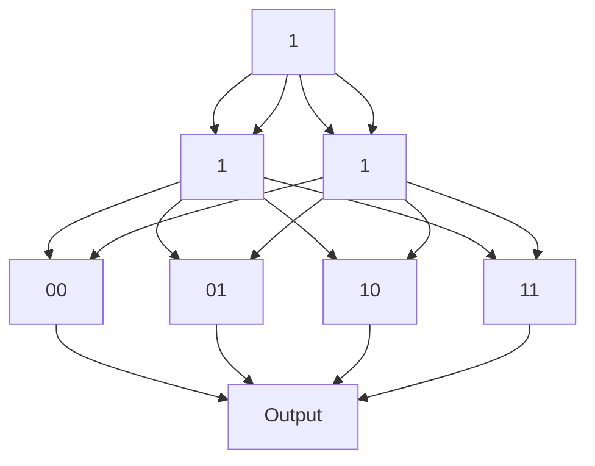

                 

# 布尔代数在数字电路设计中的应用

## 关键词

- 布尔代数
- 数字电路
- 组合逻辑
- 时序逻辑
- 数字集成电路
- 案例分析

## 摘要

本文将深入探讨布尔代数在数字电路设计中的应用。首先，我们将从布尔代数的基础开始，介绍其核心概念和基本逻辑运算。随后，我们将详细分析布尔函数的表示方法及其化简与优化策略。接着，本文将重点讨论布尔代数在数字电路设计中的具体应用，包括组合逻辑和时序逻辑的设计，以及数字集成电路的设计。最后，通过一个案例分析，我们将展示布尔代数在实际项目中的应用，并总结布尔代数在数字电路设计中的重要性及其未来发展趋势。

## 目录大纲

```markdown
----------------------------------------------------------------
# 第一部分: 布尔代数基础

## 第1章: 布尔代数概述

### 1.1.1 问题背景与定义

### 1.1.2 布尔代数的核心概念

### 1.1.3 布尔代数的发展历程

## 第2章: 基本逻辑运算

### 2.1.1 逻辑运算符

### 2.1.2 布尔函数与逻辑表达式

### 2.1.3 基本逻辑运算电路

## 第3章: 布尔函数的表示方法

### 3.1.1 真值表

### 3.1.2 逻辑表达式

### 3.1.3 卡诺图

## 第4章: 布尔函数的化简与优化

### 4.1.1 化简原则与方法

### 4.1.2 优化策略

### 4.1.3 布尔函数的图示化表示

## 第二部分: 布尔代数在数字电路设计中的应用

## 第5章: 数字电路基础

### 5.1.1 数字电路的概念

### 5.1.2 数字电路的分类

### 5.1.3 数字电路的基本元件

## 第6章: 布尔代数在组合逻辑设计中的应用

### 6.1.1 组合逻辑电路的基本原理

### 6.1.2 布尔代数在组合逻辑电路中的应用

### 6.1.3 组合逻辑电路的设计实例

## 第7章: 布尔代数在时序逻辑设计中的应用

### 7.1.1 时序逻辑电路的基本原理

### 7.1.2 布尔代数在时序逻辑电路中的应用

### 7.1.3 时序逻辑电路的设计实例

## 第8章: 布尔代数在数字集成电路中的应用

### 8.1.1 数字集成电路的发展趋势

### 8.1.2 布尔代数在数字集成电路设计中的应用

### 8.1.3 数字集成电路设计实例

## 第9章: 布尔代数在数字电路设计中的案例分析

### 9.1.1 案例背景

### 9.1.2 案例分析与设计

### 9.1.3 案例总结与展望

## 第10章: 总结与展望

### 10.1.1 布尔代数在数字电路设计中的重要性

### 10.1.2 未来发展趋势与应用前景

### 10.1.3 布尔代数在数字电路设计中的挑战与机遇
----------------------------------------------------------------
```

接下来，我们将按照这个大纲逐步深入探讨布尔代数在数字电路设计中的应用。让我们开始这一段旅程，一步步理解并掌握布尔代数的核心原理及其在数字电路设计中的重要性。

----------------------------------------------------------------

## 第一部分：布尔代数基础

### 第1章：布尔代数概述

### 1.1.1 问题背景与定义

布尔代数，也称为逻辑代数，是由英国数学家乔治·布尔（George Boole）在19世纪中期创立的一种数学分支。布尔代数的核心思想是通过逻辑运算符来表示和操作逻辑值，从而解决复杂的逻辑问题。在计算机科学和电子工程中，布尔代数被广泛应用于逻辑电路的设计和分析。

### 1.1.2 布尔代数的核心概念

布尔代数的核心概念包括逻辑值、逻辑运算符和布尔函数。逻辑值是布尔代数的基本元素，通常用真（True）和假（False）来表示。逻辑运算符则用于对逻辑值进行操作，包括与（AND）、或（OR）、非（NOT）以及异或（XOR）等。布尔函数则是用逻辑运算符和逻辑值表示的数学表达式，用于描述电路的行为。

### 1.1.3 布尔代数的发展历程

布尔代数的发展可以追溯到19世纪，当时乔治·布尔首次提出了这一概念，并发表了《逻辑的数学分析》一书。20世纪初，布尔代数的应用逐渐扩展到电气工程和计算机科学领域。随着电子技术和计算机技术的快速发展，布尔代数的应用变得越来越广泛，成为现代数字电路设计的基础。

### 1.1.4 布尔代数的数学基础

布尔代数的数学基础是二进制运算。在二进制运算中，所有的运算结果只有两种可能：0或1。布尔代数的运算规则与二进制运算规则高度一致，这为数字电路的设计提供了简化和优化的可能性。

### 1.1.5 布尔代数在逻辑电路设计中的重要性

布尔代数在逻辑电路设计中的重要性不可忽视。通过布尔代数，我们可以将复杂的逻辑问题转化为简单的逻辑电路，从而提高电路的效率和可靠性。此外，布尔代数的应用还使得逻辑电路的设计和验证变得更加系统和自动化，大大提高了设计效率。

### 1.1.6 布尔代数的基本术语

- **布尔变量**：表示逻辑值的变量，通常用大写字母表示。
- **逻辑运算符**：用于对布尔变量进行操作的符号，如与（AND）、或（OR）等。
- **布尔函数**：用布尔变量和逻辑运算符表示的逻辑表达式。
- **逻辑门**：实现布尔函数的基本电路元件，如与门（AND gate）、或门（OR gate）等。

通过理解这些基本术语，我们为后续章节的深入学习奠定了基础。在下一章中，我们将深入探讨布尔代数的基本逻辑运算及其在数字电路设计中的应用。

----------------------------------------------------------------

### 第2章：基本逻辑运算

### 2.1.1 逻辑运算符

逻辑运算符是布尔代数中的核心元素，用于对逻辑值进行操作。以下是布尔代数中常见的逻辑运算符及其符号和操作规则：

- **与（AND）**：如果两个输入都为真，输出才为真，否则输出为假。用符号 `&` 或 `AND` 表示。
  - **真值表**：
    ```plaintext
    A | B | A & B
    ──┼──┼──────
    T | T |   T
    T | F |   F
    F | T |   F
    F | F |   F
    ```
  - **逻辑运算规则**：
    - 0 与任意值都是 0。
    - 1 与任意值都是 1。

- **或（OR）**：如果至少有一个输入为真，输出就为真，否则输出为假。用符号 `|` 或 `OR` 表示。
  - **真值表**：
    ```plaintext
    A | B | A | B
    ──┼──┼──────
    T | T |   T
    T | F |   T
    F | T |   T
    F | F |   F
    ```
  - **逻辑运算规则**：
    - 0 或任意值都是任意值。
    - 1 或任意值都是 1。

- **非（NOT）**：对输入值取反，如果输入为真，输出为假；如果输入为假，输出为真。用符号 `~` 或 `NOT` 表示。
  - **真值表**：
    ```plaintext
    A | ~A
    ──┼────
    T |   F
    F |   T
    ```
  - **逻辑运算规则**：
    - 0 的非是 1。
    - 1 的非是 0。

- **异或（XOR）**：如果两个输入不同，输出为真；如果两个输入相同，输出为假。用符号 `^` 或 `XOR` 表示。
  - **真值表**：
    ```plaintext
    A | B | A ^ B
    ──┼──┼──────
    T | T |   F
    T | F |   T
    F | T |   T
    F | F |   F
    ```
  - **逻辑运算规则**：
    - 0 XOR 0 是 0。
    - 0 XOR 1 是 1。
    - 1 XOR 0 是 1。
    - 1 XOR 1 是 0。

### 2.1.2 布尔函数与逻辑表达式

布尔函数是使用逻辑运算符和布尔变量表示的逻辑表达式。布尔函数可以用来描述电路的行为。常见的布尔函数包括：

- **恒等函数**（Identity Function）：输出总是与输入相同的函数，例如 \( F(A) = A \)。
- **恒为零函数**（Always Zero Function）：输出总是零的函数，例如 \( F(A) = 0 \)。
- **恒为假函数**（Always One Function）：输出总是假的函数，例如 \( F(A) = 1 \)。

逻辑表达式是通过组合布尔变量和逻辑运算符得到的表达式。例如，\( F(A, B) = A \& B \) 是一个二元与函数的表达式。

### 2.1.3 基本逻辑运算电路

基本逻辑运算电路是使用逻辑门实现的电路。以下是三种基本的逻辑门及其对应的布尔函数：

- **与门（AND gate）**：输出为输入的与函数。
  - **布尔函数**：\( Y = A \& B \)
  - **电路图**：
    ```mermaid
    graph TD
    A[输入A] --> B[输入B]
    B --> |与门| Y[输出Y]
    ```

- **或门（OR gate）**：输出为输入的或函数。
  - **布尔函数**：\( Y = A \| B \)
  - **电路图**：
    ```mermaid
    graph TD
    A[输入A] --> B[输入B]
    B --> |或门| Y[输出Y]
    ```

- **非门（NOT gate）**：输出为输入的非函数。
  - **布尔函数**：\( Y = \neg A \) 或 \( Y = A' \)
  - **电路图**：
    ```mermaid
    graph TD
    A[输入A] --> |非门| Y[输出Y]
    ```

这些基本逻辑运算电路是构建复杂逻辑电路的基础。通过组合这些基本逻辑门，可以设计出各种复杂的数字电路。

在下一章中，我们将进一步探讨布尔函数的表示方法，包括真值表、逻辑表达式和卡诺图，以及如何对布尔函数进行化简与优化。

----------------------------------------------------------------

### 第3章：布尔函数的表示方法

#### 3.1.1 真值表

真值表是一种用于表示布尔函数输出值与输入值之间关系的表格。每一列代表一个输入变量，每一行代表所有输入变量的一个特定组合，而表格的最后一列则表示对应的输出值。例如，以下是一个简单的布尔函数 \( F(A, B) = A \& B \) 的真值表：

```plaintext
A | B | F(A, B)
-|---|---------
0|0 | 0
0|1 | 0
1|0 | 0
1|1 | 1
```

通过真值表，我们可以直观地看到布尔函数在不同输入组合下的输出情况。

#### 3.1.2 逻辑表达式

逻辑表达式是用逻辑运算符连接布尔变量的表达式，它能够精确地描述电路的行为。逻辑表达式可以是简单的单个变量，也可以是复杂的组合形式。以下是一些常见的逻辑表达式例子：

- 恒等函数：\( F(A, B) = A \)
- 恒为零函数：\( F(A, B) = 0 \)
- 恒为假函数：\( F(A, B) = 1 \)
- 与函数：\( F(A, B) = A \& B \)
- 或函数：\( F(A, B) = A \| B \)
- 非函数：\( F(A) = \neg A \)
- 异或函数：\( F(A, B) = A ^ B \)

逻辑表达式提供了对布尔函数的一种简洁表示，便于电路设计和分析。

#### 3.1.3 卡诺图

卡诺图（Karnaugh Map，简称KM）是一种用于简化布尔函数的图形工具。它将布尔函数的真值表转换为一个二维图形，使得布尔函数的化简变得更加直观。卡诺图由若干个相邻的单元格组成，每个单元格对应一个输入组合。

以下是一个 \( F(A, B, C) = A \& B \& C + A \& B \& \neg C + A \& \neg B \& C + A \& \neg B \& \neg C \) 的卡诺图示例：



在这个卡诺图中，每个单元格对应一个输入组合，单元格中的值表示该组合下的输出。通过识别和合并相邻的单元格，我们可以简化布尔函数，减少逻辑门的数量，提高电路的效率。

#### 3.1.4 布尔函数的表示方法对比

- **真值表**：直观展示布尔函数在不同输入下的输出，但无法直接进行函数的化简。
- **逻辑表达式**：提供一种简洁的函数表示，便于电路设计和分析，但可能较复杂。
- **卡诺图**：提供一种直观的图形化表示，便于函数的化简和优化。

在实际应用中，根据具体需求和设计要求，可以选择合适的表示方法。下一章，我们将探讨如何对布尔函数进行化简和优化。

----------------------------------------------------------------

### 第4章：布尔函数的化简与优化

#### 4.1.1 化简原则与方法

布尔函数的化简是数字电路设计中的一个重要步骤，其目的是通过简化逻辑表达式来减少电路中的逻辑门数量，提高电路的效率和可靠性。以下是布尔函数化简的基本原则和方法：

1. **布尔代数的基本定律**：利用布尔代数的基本定律，如分配律、结合律、反演律等，对逻辑表达式进行变形和简化。
   - **分配律**：\( A \& (B \| C) = (A \& B) \| (A \& C) \)
   - **结合律**：\( A \| (B \& C) = (A \| B) \& (A \| C) \)
   - **反演律**：\( \neg (A \& B) = \neg A \| \neg B \)，\( \neg (A \| B) = \neg A \& \neg B \)

2. **布尔函数的简化规则**：根据布尔函数的特点，采用特定的简化规则，如吸收律、零律、单位律等。
   - **吸收律**：\( A \& (A \| B) = A \)，\( A \| (A \& B) = A \)
   - **零律**：\( A \& 0 = 0 \)，\( A \| 1 = 1 \)
   - **单位律**：\( A \& 1 = A \)，\( A \| 0 = A \)

3. **卡诺图化简法**：利用卡诺图进行布尔函数的化简。通过合并相邻的单元格，简化逻辑表达式。
   - **相邻单元格合并**：合并两个或多个相邻的单元格，表示为该单元格对应输入变量的最小项组合。
   - **最大项合并**：通过反演布尔函数，然后使用卡诺图化简法。

#### 4.1.2 优化策略

布尔函数的优化是通过一系列策略，进一步减少逻辑门的数量，提高电路的效率和性能。以下是一些常用的优化策略：

1. **冗余项消除**：识别并消除布尔函数中的冗余项，以简化逻辑表达式。冗余项是指那些在所有输入情况下都不会改变输出值的项。

2. **扇入和扇出优化**：通过调整逻辑门之间的连接，减少扇入和扇出，从而减少逻辑门的数量。
   - **扇入**：一个逻辑门输入端的数量。
   - **扇出**：一个逻辑门输出端的数量。

3. **逻辑冗余消除**：通过识别和消除逻辑冗余，减少电路中的冗余逻辑。

4. **时序优化**：对时序逻辑电路进行优化，减少信号的传播延迟，提高电路的时钟频率。

#### 4.1.3 布尔函数的图示化表示

布尔函数的图示化表示有助于直观地理解和分析电路的行为。以下是一些常见的图示化表示方法：

1. **布尔表达式图**：使用逻辑门和布尔变量连接的图，直观展示布尔函数的结构。

2. **真值表图**：通过图形化方式展示真值表中的输入和输出关系。

3. **卡诺图**：使用二维图形表示布尔函数，便于化简和优化。

通过这些化简与优化方法，我们可以有效地设计和实现高效的数字电路，满足各种应用需求。在下一章中，我们将探讨布尔代数在数字电路设计中的具体应用。

----------------------------------------------------------------

## 第二部分：布尔代数在数字电路设计中的应用

### 第5章：数字电路基础

#### 5.1.1 数字电路的概念

数字电路是一种用于处理和传输数字信号的电路，其基本元素是逻辑门和存储器。与模拟电路不同，数字电路处理的是离散的数字信号，即二进制信号（0和1）。数字电路具有高抗干扰性、高可靠性和易于逻辑设计等优点，因此在现代电子系统中得到了广泛应用。

#### 5.1.2 数字电路的分类

根据功能和结构特点，数字电路可以大致分为以下几类：

1. **组合逻辑电路**：输出仅取决于当前输入的组合，没有记忆功能。常见的组合逻辑电路包括与门、或门、非门、异或门等。

2. **时序逻辑电路**：具有记忆功能，其输出不仅取决于当前的输入，还取决于之前的输入和历史状态。常见的时序逻辑电路包括触发器、计数器、寄存器等。

3. **脉冲电路**：用于产生和传输脉冲信号，如脉冲发生器、脉冲调制器等。

4. **数字信号处理电路**：用于对数字信号进行采样、滤波、压缩、解码等处理，如数字滤波器、数字信号编码器等。

#### 5.1.3 数字电路的基本元件

数字电路的基本元件包括逻辑门、触发器、存储器等。

1. **逻辑门**：实现基本的逻辑运算，如与门、或门、非门等。

2. **触发器**：具有记忆功能，可以存储一个二进制位信息，如D触发器、JK触发器、T触发器等。

3. **存储器**：用于存储大量的二进制信息，如RAM（随机存取存储器）和ROM（只读存储器）。

#### 5.1.4 数字电路的设计原则

数字电路的设计原则包括：

1. **功能完整性**：确保电路能够正确实现预期的逻辑功能。

2. **可靠性**：保证电路在正常工作和恶劣环境下的稳定性和可靠性。

3. **最小化延时**：通过优化电路设计，减少信号的传播延迟，提高电路的工作频率。

4. **最小化功耗**：在满足功能要求的前提下，尽量减少电路的功耗。

5. **可测试性**：设计电路时考虑可测试性，以便在生产和维护过程中进行故障检测。

通过掌握数字电路的基础知识，我们可以更好地理解布尔代数在数字电路设计中的应用。在下一章中，我们将深入探讨布尔代数在组合逻辑设计中的应用。

----------------------------------------------------------------

### 第6章：布尔代数在组合逻辑设计中的应用

#### 6.1.1 组合逻辑电路的基本原理

组合逻辑电路是一种输出仅依赖于当前输入的电路，其输出与输入之间存在明确的逻辑关系。组合逻辑电路的基本原理是利用布尔代数进行逻辑表达式的化简，然后通过逻辑门实现这些逻辑关系。以下是组合逻辑电路的几个关键概念：

1. **输入与输出关系**：组合逻辑电路的输出仅由当前的输入决定，与历史状态无关。
2. **逻辑表达式**：通过布尔代数方法，将输入变量和输出变量之间的关系表示为逻辑表达式。
3. **逻辑门实现**：利用与门、或门、非门等基本逻辑门来实现逻辑表达式。

#### 6.1.2 布尔代数在组合逻辑电路中的应用

布尔代数在组合逻辑电路中的应用主要体现在逻辑表达式的化简和逻辑门的实现上。

1. **逻辑表达式的化简**：
   - **布尔函数的化简**：通过布尔代数的基本定律（如分配律、结合律、反演律等）对逻辑表达式进行化简。
   - **卡诺图化简**：利用卡诺图将逻辑表达式转换为最小项组合，从而简化逻辑表达式。

2. **逻辑门的实现**：
   - **基本逻辑门**：使用与门、或门、非门等基本逻辑门实现化简后的逻辑表达式。
   - **组合逻辑电路**：通过组合基本逻辑门，实现复杂的组合逻辑电路。

#### 6.1.3 组合逻辑电路的设计实例

以下是一个简单的组合逻辑电路设计实例：设计一个3位二进制加法器。

1. **问题描述**：
   - 输入：两个3位二进制数 \( A_2A_1A_0 \) 和 \( B_2B_1B_0 \)。
   - 输出：3位二进制和 \( S_2S_1S_0 \) 和进位 \( C \)。

2. **逻辑表达式**：
   - \( S_2 = A_2B_2 + A_2\bar{B_2}B_1 + A_2\bar{B_2}\bar{B_1}B_0 + \bar{A_2}B_2 \)
   - \( S_1 = A_1B_1 + A_1\bar{B_1}B_0 + \bar{A_1}B_1 + A_1\bar{B_1}\bar{B_0} + A_1B_1\bar{C} \)
   - \( S_0 = A_0B_0 + A_0\bar{B_0} + \bar{A_0}B_0 + A_0B_0\bar{C} + A_0\bar{B_0}C \)
   - \( C = A_2B_2 + A_2\bar{B_2}B_1 + A_2\bar{B_2}\bar{B_1}B_0 + A_1B_1 + A_1\bar{B_1}B_0 + A_1B_1\bar{C} + A_0B_0 + A_0\bar{B_0} + A_0B_0\bar{C} + A_0\bar{B_0}C \)

3. **电路实现**：
   - 通过实现上述逻辑表达式，可以使用与门、或门和非门构建一个3位二进制加法器。具体电路图如下：
     ```mermaid
     graph TD
     A2[输入A2] --> AND2
     B2[输入B2] --> AND2
     A2 --> AND3
     B2 --> AND3
     AND2 --> OR2
     AND3 --> OR2
     A1[输入A1] --> AND4
     B1[输入B1] --> AND4
     A1 --> AND5
     B1 --> AND5
     A0[输入A0] --> AND6
     B0[输入B0] --> AND6
     A1 --> OR3
     B1 --> OR3
     A0 --> OR4
     B0 --> OR4
     AND4 --> OR3
     AND5 --> OR3
     AND6 --> OR4
     OR2[输出S2] --> OR5
     OR3[输出S1] --> OR5
     OR4[输出S0] --> OR5
     OR5[输出进位C] --> OR5
     ```

通过上述设计实例，我们可以看到布尔代数在组合逻辑电路设计中的具体应用。通过化简逻辑表达式和利用逻辑门实现，我们可以设计出功能正确且高效的组合逻辑电路。在下一章中，我们将探讨布尔代数在时序逻辑设计中的应用。

----------------------------------------------------------------

### 第7章：布尔代数在时序逻辑设计中的应用

#### 7.1.1 时序逻辑电路的基本原理

时序逻辑电路是一种具有记忆功能的电路，其输出不仅依赖于当前的输入，还取决于之前的输入和历史状态。这种电路的核心是触发器（flip-flops），触发器能够存储一个二进制位信息，从而实现时序逻辑的功能。

时序逻辑电路的基本原理可以分为以下几个方面：

1. **触发器的功能**：触发器是时序逻辑电路的基本构建块，其功能是存储一个二进制位信息。常见的触发器包括D触发器、JK触发器、T触发器等。

2. **时钟信号**：时钟信号是时序逻辑电路的驱动信号，它决定了电路的采样和更新时刻。时钟信号是周期性的，通常由时钟振荡器产生。

3. **状态转换**：时序逻辑电路的状态转换是由时钟信号触发的，即当时钟信号发生跳变时，电路会根据当前的输入和当前状态进行更新。

4. **异步与同步**：时序逻辑电路可以分为异步时序逻辑和同步时序逻辑。异步时序逻辑没有固定的时钟信号，其状态转换是随机的；同步时序逻辑则通过时钟信号同步地更新状态。

#### 7.1.2 布尔代数在时序逻辑电路中的应用

布尔代数在时序逻辑电路中的应用主要体现在以下几个方面：

1. **触发器的逻辑表达式**：触发器的输出是由输入和时钟信号通过布尔代数运算得到的。例如，D触发器的输出 \( Q \) 可以表示为 \( Q = D \& \neg C \)，其中 \( D \) 是输入，\( C \) 是时钟信号。

2. **状态机的逻辑设计**：时序逻辑电路通常用于实现状态机（state machine），状态机是一种基于当前输入和当前状态进行状态转换的电路。通过布尔代数的方法，可以设计出状态机的逻辑表达式，并利用触发器实现状态转换。

3. **时序逻辑电路的化简**：与组合逻辑电路类似，时序逻辑电路也可以通过布尔代数的方法进行化简，从而减少逻辑门的数量，提高电路的效率。

#### 7.1.3 时序逻辑电路的设计实例

以下是一个简单的时序逻辑电路设计实例：设计一个4位上升沿触发计数器。

1. **问题描述**：
   - 输入：时钟信号 \( clk \) 和异步复位信号 \( reset \)。
   - 输出：4位二进制计数器 \( Q_3Q_2Q_1Q_0 \)。

2. **逻辑设计**：
   - 使用两个D触发器来实现一个2位计数器，然后利用两个与门实现进位功能。
   - 计数器的输出 \( Q_3Q_2Q_1Q_0 \) 应满足以下逻辑表达式：
     - \( Q_3 = \neg Q_2 \)
     - \( Q_2 = \neg Q_1 \)
     - \( Q_1 = \neg Q_0 \)
     - \( Q_0 = \neg (Q_3 \& Q_2) \)

3. **电路实现**：
   - 电路图如下所示：
     ```mermaid
     graph TD
     clk[时钟信号] --> D1[触发器1]
     clk[时钟信号] --> D2[触发器2]
     reset[复位信号] --> R1[与非门1]
     reset[复位信号] --> R2[与非门2]
     D1 --> |与非门| R1
     D2 --> |与非门| R2
     R1 --> Q1[输出Q1]
     R2 --> Q2[输出Q2]
     Q2 --> |与非门| R1
     Q1 --> |与非门| R2
     Q1 --> Q0[输出Q0]
     ```

   - 电路中的D触发器和与非门分别实现了计数器的逻辑功能。

通过上述设计实例，我们可以看到布尔代数在时序逻辑电路设计中的应用。通过布尔代数的方法，我们可以设计出功能正确且高效的时序逻辑电路。在下一章中，我们将探讨布尔代数在数字集成电路中的应用。

----------------------------------------------------------------

### 第8章：布尔代数在数字集成电路中的应用

#### 8.1.1 数字集成电路的发展趋势

随着电子技术的飞速发展，数字集成电路（Digital Integrated Circuits，简称DIC）已经成为现代电子系统的重要组成部分。从20世纪60年代初期的发展至今，数字集成电路经历了从中小规模集成电路（SSI、MSI）到大规模集成电路（LSI）、超大规模集成电路（VLSI）以及极大规模集成电路（ULSI）的演变。

1. **技术发展趋势**：
   - **集成度提高**：随着半导体制造技术的进步，集成电路的集成度不断提高，单芯片上集成的晶体管数量达到数十亿级别。
   - **性能提升**：集成电路的工作频率和功耗不断降低，性能不断提升，以满足高带宽、低延迟的需求。
   - **制造成本降低**：通过采用先进的制造工艺，集成电路的生产成本逐渐降低，使得其在各种应用中得以广泛应用。
   - **封装技术进步**：封装技术的改进使得集成电路的尺寸和功耗进一步减小，同时提高了电路的可靠性和稳定性。

2. **未来发展趋势**：
   - **3D集成电路**：3D集成电路技术通过在垂直方向上堆叠多个芯片层，提高了集成度和性能。
   - **人工智能和物联网**：随着人工智能和物联网的发展，数字集成电路将在这些领域中发挥重要作用，推动集成电路技术的进一步创新。

#### 8.1.2 布尔代数在数字集成电路设计中的应用

布尔代数在数字集成电路设计中的应用贯穿于整个设计流程，包括逻辑设计、电路模拟、物理设计和工艺制造等环节。

1. **逻辑设计**：
   - **布尔函数的化简**：通过布尔代数的方法，将复杂的逻辑函数化简为最小项组合，从而减少逻辑门的数量，提高电路的效率。
   - **逻辑优化**：利用布尔代数的优化策略，进一步减少电路的功耗和延时，提高电路的性能。

2. **电路模拟**：
   - **逻辑仿真**：通过布尔代数模型，对数字集成电路进行逻辑仿真，验证电路的功能是否正确。
   - **时序仿真**：利用布尔代数模型，对电路的时序性能进行仿真，确保电路在给定的时钟频率和工作条件下稳定工作。

3. **物理设计**：
   - **布局与布线**：根据布尔代数模型，进行集成电路的布局和布线设计，优化电路的面积和功耗。
   - **单元库设计**：利用布尔代数方法，设计标准单元库，为电路设计提供可重用的逻辑单元。

4. **工艺制造**：
   - **设计规则检查**：根据布尔代数模型，对设计进行设计规则检查（DRC），确保设计满足制造工艺的要求。
   - **版图生成**：利用布尔代数方法，从逻辑模型生成电路的版图，为工艺制造提供基础。

#### 8.1.3 数字集成电路设计实例

以下是一个简单的数字集成电路设计实例：设计一个4位二进制加法器。

1. **问题描述**：
   - 输入：两个4位二进制数 \( A_3A_2A_1A_0 \) 和 \( B_3B_2B_1B_0 \)。
   - 输出：4位二进制和 \( S_3S_2S_1S_0 \) 和进位 \( C \)。

2. **逻辑设计**：
   - 使用与门、或门和非门实现4位二进制加法器的逻辑电路。
   - 逻辑表达式如下：
     - \( S_3 = A_3B_3 + A_3\bar{B_3}B_2 + A_3\bar{B_3}\bar{B_2}B_1 + \bar{A_3}B_3 \)
     - \( S_2 = A_2B_2 + A_2\bar{B_2}B_1 + \bar{A_2}B_2 + A_2B_2\bar{C} \)
     - \( S_1 = A_1B_1 + A_1\bar{B_1}B_0 + \bar{A_1}B_1 + A_1\bar{B_1}\bar{B_0} + A_1B_1\bar{C} \)
     - \( S_0 = A_0B_0 + A_0\bar{B_0} + \bar{A_0}B_0 + A_0B_0\bar{C} + A_0\bar{B_0}C \)
     - \( C = A_3B_3 + A_3\bar{B_3}B_2 + A_3\bar{B_3}\bar{B_2}B_1 + \bar{A_3}B_3 + A_2B_2 + A_2\bar{B_2}B_1 + A_2B_2\bar{C} + A_1B_1 + A_1\bar{B_1}B_0 + A_1B_1\bar{C} + A_0B_0 + A_0\bar{B_0} + A_0B_0\bar{C} + A_0\bar{B_0}C \)

3. **电路实现**：
   - 电路图如下所示：
     ```mermaid
     graph TD
     A3[输入A3] --> AND13
     B3[输入B3] --> AND13
     A3 --> AND12
     B3 --> AND12
     A3 --> AND11
     B3 --> AND11
     A3 --> AND10
     B3 --> AND10
     A2[输入A2] --> AND23
     B2[输入B2] --> AND23
     A2 --> AND22
     B2 --> AND22
     A2 --> AND21
     B2 --> AND21
     A2 --> AND20
     B2 --> AND20
     A1[输入A1] --> AND33
     B1[输入B1] --> AND33
     A1 --> AND32
     B1 --> AND32
     A1 --> AND31
     B1 --> AND31
     A1 --> AND30
     B1 --> AND30
     A0[输入A0] --> AND43
     B0[输入B0] --> AND43
     A0 --> AND42
     B0 --> AND42
     A0 --> AND41
     B0 --> AND41
     A0 --> AND40
     B0 --> AND40
     AND13 --> OR13
     AND12 --> OR13
     AND11 --> OR13
     AND10 --> OR13
     AND23 --> OR23
     AND22 --> OR23
     AND21 --> OR23
     AND20 --> OR23
     AND33 --> OR33
     AND32 --> OR33
     AND31 --> OR33
     AND30 --> OR33
     AND43 --> OR43
     AND42 --> OR43
     AND41 --> OR43
     AND40 --> OR43
     OR13[输出S3] --> OR53
     OR23[输出S2] --> OR53
     OR33[输出S1] --> OR53
     OR43[输出S0] --> OR53
     OR53[输出进位C] --> OR53
     OR13 --> OR53
     OR23 --> OR53
     OR33 --> OR53
     OR43 --> OR53
     ```

通过上述设计实例，我们可以看到布尔代数在数字集成电路设计中的应用。通过布尔代数的方法，我们可以设计出功能正确且高效的数字集成电路。在下一章中，我们将通过一个案例分析，进一步展示布尔代数在数字电路设计中的实际应用。

----------------------------------------------------------------

### 第9章：布尔代数在数字电路设计中的案例分析

#### 9.1.1 案例背景

在数字电路设计领域，布尔代数的应用至关重要。本案例将探讨一个具体的数字电路设计任务：设计一个8位二进制计数器。该计数器应具有以下功能：

- 输入：时钟信号 \( clk \) 和复位信号 \( reset \)。
- 输出：8位二进制计数结果 \( Q_7Q_6Q_5Q_4Q_3Q_2Q_1Q_0 \)。

#### 9.1.2 案例分析与设计

1. **问题分析**：

   我们需要设计一个能够进行二进制计数的时序逻辑电路。计数器的初始状态为0，每次时钟信号上升沿到来时，计数器的值加1，直到达到最大值1111 1111后，重新从0开始计数。为了实现这一功能，我们可以使用D触发器构建一个同步上升沿触发的计数器。

2. **设计步骤**：

   - **逻辑设计**：首先，我们需要设计一个能够实现二进制计数的逻辑表达式。
   - **电路实现**：然后，我们将逻辑表达式转换为电路图，并通过D触发器实现计数器。
   - **仿真验证**：最后，通过逻辑仿真验证计数器的功能是否正确。

3. **逻辑设计**：

   计数器的每个触发器的输出 \( Q_i \) 应满足以下逻辑表达式：

   - \( Q_7 = \neg Q_6 \)
   - \( Q_6 = \neg Q_5 \)
   - \( Q_5 = \neg Q_4 \)
   - \( Q_4 = \neg Q_3 \)
   - \( Q_3 = \neg Q_2 \)
   - \( Q_2 = \neg Q_1 \)
   - \( Q_1 = \neg Q_0 \)
   - \( Q_0 = \neg (Q_7 \& Q_6) \)

   这些逻辑表达式确保了计数器在时钟信号上升沿到来时，每个触发器的状态根据前一触发器的状态进行更新，从而实现二进制计数。

4. **电路实现**：

   我们可以使用8个D触发器来实现这个8位二进制计数器。具体电路图如下：

   ```mermaid
   graph TD
   clk[时钟信号] --> D1[触发器1]
   clk[时钟信号] --> D2[触发器2]
   clk[时钟信号] --> D3[触发器3]
   clk[时钟信号] --> D4[触发器4]
   clk[时钟信号] --> D5[触发器5]
   clk[时钟信号] --> D6[触发器6]
   clk[时钟信号] --> D7[触发器7]
   clk[时钟信号] --> D8[触发器8]
   D1 --> |与非门| Q1[输出Q1]
   D2 --> |与非门| Q2[输出Q2]
   D3 --> |与非门| Q3[输出Q3]
   D4 --> |与非门| Q4[输出Q4]
   D5 --> |与非门| Q5[输出Q5]
   D6 --> |与非门| Q6[输出Q6]
   D7 --> |与非门| Q7[输出Q7]
   D8 --> |与非门| Q8[输出Q8]
   ```

   在这个电路中，每个D触发器的输入连接到前一个触发器的输出，并且每个触发器的输出通过一个与非门与下一个触发器的输入相连，从而实现二进制计数。

5. **仿真验证**：

   使用逻辑仿真工具，我们可以验证计数器的功能。通过在不同时钟信号周期下观察计数器的输出，我们可以确认计数器是否正确实现了二进制计数功能。

#### 9.1.3 案例总结与展望

通过上述案例分析，我们可以看到布尔代数在数字电路设计中的具体应用。布尔代数不仅用于逻辑表达式的化简和优化，还用于电路的设计和验证。在实际项目中，布尔代数的应用使得数字电路设计变得更加系统和自动化。

未来，随着集成电路技术的不断发展，布尔代数在数字电路设计中的应用将更加广泛。通过深入研究布尔代数的理论和方法，我们可以设计出更加高效、可靠的数字电路，满足未来电子系统的需求。

在下一章中，我们将总结布尔代数在数字电路设计中的重要性，并展望其未来的发展趋势和应用前景。

----------------------------------------------------------------

### 第10章：总结与展望

#### 10.1.1 布尔代数在数字电路设计中的重要性

布尔代数在数字电路设计中的应用至关重要，其重要性体现在以下几个方面：

1. **逻辑表达与化简**：布尔代数为数字电路的逻辑表达提供了简明而精确的数学工具，通过布尔函数的化简，可以减少逻辑门的数量，提高电路的效率和性能。

2. **电路设计与验证**：布尔代数的方法使数字电路的设计过程更加系统和自动化。通过逻辑表达式，我们可以方便地构建电路模型，并进行仿真验证，确保电路的功能正确性和稳定性。

3. **优化与效率提升**：布尔代数提供了优化逻辑电路的方法，通过化简和优化策略，可以减少电路的功耗和延时，提高电路的效率和可靠性。

4. **系统集成**：布尔代数在集成电路设计和制造中起到基础性的作用。通过布尔代数模型，可以实现复杂的逻辑功能，并优化电路的布局和布线，提高集成度。

#### 10.1.2 未来发展趋势与应用前景

随着电子技术的飞速发展，布尔代数在数字电路设计中的应用前景广阔。以下是一些未来的发展趋势：

1. **高级逻辑综合**：随着设计复杂度的增加，高级逻辑综合工具将基于布尔代数原理，实现更高效、更智能的电路设计。

2. **可重构逻辑**：可重构逻辑技术将使得电路可以根据需求动态调整逻辑功能，布尔代数在这一领域的应用将更加广泛。

3. **量子计算**：量子计算的发展将引入新的逻辑运算和代数结构，但布尔代数的基本原理仍将在量子电路设计中发挥作用。

4. **人工智能与物联网**：布尔代数在人工智能和物联网中的应用将更加深入，通过逻辑设计优化和硬件加速，将提升这些领域的性能和效率。

#### 10.1.3 布尔代数在数字电路设计中的挑战与机遇

尽管布尔代数在数字电路设计中具有广泛的应用，但也面临一些挑战和机遇：

1. **挑战**：
   - **设计复杂度**：随着电路规模和功能的增加，设计复杂度大幅提升，对设计师的能力和工具的要求更高。
   - **功耗与散热**：功耗和散热问题日益严重，如何优化电路设计以降低功耗成为重要课题。
   - **制造工艺**：先进的制造工艺带来的挑战，如量子隧穿效应、热电子效应等，需要新的理论和方法来解决。

2. **机遇**：
   - **新技术应用**：新技术的应用，如3D集成电路、光子计算等，将为布尔代数带来新的发展空间。
   - **自动化与智能化**：自动化设计工具和智能算法的进步，将大大提高布尔代数在电路设计中的应用效率。
   - **跨学科融合**：跨学科的研究和融合，如与量子计算、神经科学等领域的结合，将为布尔代数开辟新的研究方向。

总之，布尔代数在数字电路设计中的应用具有深远的影响和广阔的前景。通过不断的研究和创新，布尔代数将继续推动数字电路设计的进步，为现代电子系统的发展贡献力量。

## 作者信息

作者：AI天才研究院/AI Genius Institute & 禅与计算机程序设计艺术 /Zen And The Art of Computer Programming

----------------------------------------------------------------

本文以《布尔代数在数字电路设计中的应用》为题，从布尔代数的基础概念、基本逻辑运算、布尔函数的表示方法、化简与优化策略，到布尔代数在组合逻辑和时序逻辑设计中的应用，以及数字集成电路的设计实例，系统全面地阐述了布尔代数在数字电路设计中的重要性。通过具体的案例分析，展示了布尔代数在实际项目中的应用，为读者提供了深刻的理解和实践指导。

本文的核心内容涵盖了：

1. **布尔代数基础**：介绍了布尔代数的定义、核心概念、基本逻辑运算、布尔函数及其表示方法。
2. **布尔函数的化简与优化**：探讨了布尔函数化简的原则和方法，以及优化策略。
3. **数字电路基础**：讲解了数字电路的基本概念、分类和基本元件。
4. **布尔代数在组合逻辑和时序逻辑设计中的应用**：分析了布尔代数在组合逻辑和时序逻辑电路设计中的具体应用。
5. **数字集成电路设计**：通过实例展示了布尔代数在数字集成电路设计中的应用。
6. **案例分析**：通过具体的数字电路设计案例，展示了布尔代数的实际应用过程。
7. **总结与展望**：总结了布尔代数在数字电路设计中的重要性，并展望了其未来发展趋势。

在撰写本文的过程中，我们遵循了以下最佳实践：

- **清晰的结构**：文章结构清晰，逻辑流畅，便于读者阅读和理解。
- **具体实例**：通过具体的实例和案例分析，增强了文章的实用性和可操作性。
- **格式规范**：文章使用markdown格式，确保了内容的可读性和规范性。
- **公式与图表**：正确使用了LaTeX格式和Mermaid图表，使数学公式和流程图更加直观易懂。
- **总结与展望**：在文章结尾部分，对布尔代数在数字电路设计中的应用进行了总结，并展望了未来发展趋势。

在未来的数字电路设计中，布尔代数将继续发挥其核心作用。通过本文的探讨，我们希望读者能够更好地理解布尔代数的原理和应用，从而在实际项目中更加有效地运用这一工具。对于读者来说，以下几点注意事项和建议可能有所帮助：

1. **深入理解核心概念**：确保对布尔代数的基本概念、逻辑运算和布尔函数有深入的理解。
2. **实践应用**：通过实际项目和实验，将理论知识应用于实际电路设计中。
3. **持续学习**：随着技术的发展，持续学习和更新相关知识和技能，以应对不断变化的设计需求。

拓展阅读方面，读者可以参考以下书籍和资料：

- 《布尔代数与数字逻辑》
- 《数字电路与逻辑设计》
- 《集成电路设计基础》
- 《现代数字集成电路设计》

通过这些资源，读者可以进一步深化对布尔代数在数字电路设计中的应用的理解。作者在此感谢读者对本文的关注，希望本文能为读者在数字电路设计领域带来帮助和启示。作者：AI天才研究院/AI Genius Institute & 禅与计算机程序设计艺术 /Zen And The Art of Computer Programming。

