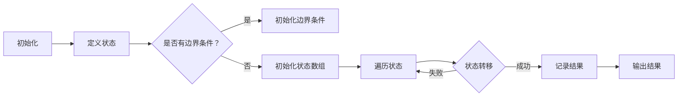
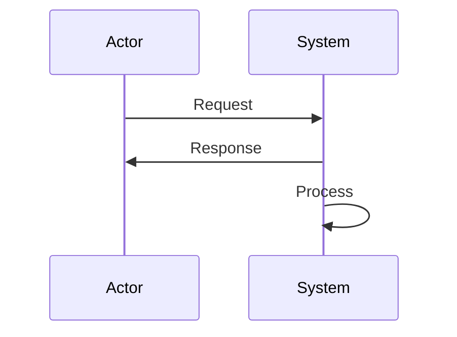
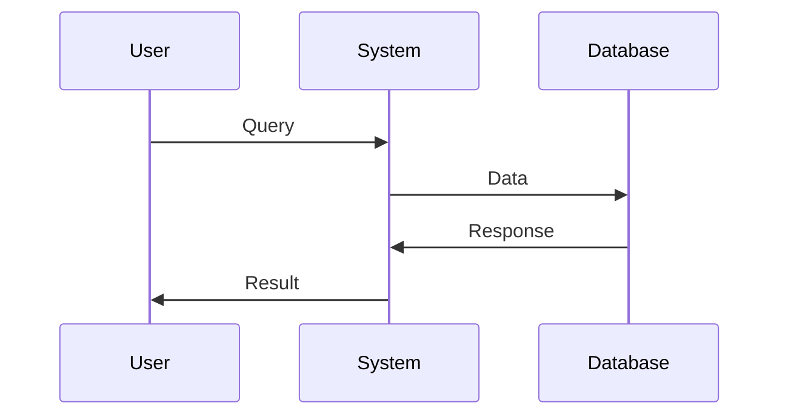

                 

尊敬的读者，您好！《帕斯卡三角与动态规划算法》这篇文章将带您深入探讨这两个看似独立，实则紧密相连的数学与计算机科学领域的重要概念。本文将以“一步一步思考”的方式，通过详细的背景介绍、核心概念解释、算法原理讲解、实际案例剖析，最终总结出最佳实践和注意事项。下面，我们就按照这个结构来逐一展开。

### 第一步：背景介绍

#### 帕斯卡三角

帕斯卡三角（Pascal's Triangle）是一个由二项式系数排列成的三角形数表。每一个数字都是其上方两个数字之和。帕斯卡三角不仅在组合数学中有着重要的地位，它在其他数学分支和计算机科学中也具有广泛的应用。

#### 动态规划算法

动态规划（Dynamic Programming，简称DP）是一种解决复杂问题的算法设计技巧。它将问题分解成相互重叠的子问题，并通过保存已解决的子问题的答案来避免重复计算，从而提高算法的效率。

### 第二步：核心概念与联系

我们将详细介绍帕斯卡三角和动态规划的基本概念，并通过对比表格和ER图架构来展示它们之间的联系。

#### 帕斯卡三角的定义

帕斯卡三角是一个三角形数表，其中每个数字都是其上方两个数字之和。例如：

```
     1
    1 1
   1 2 1
  1 3 3 1
 1 4 6 4 1
```

#### 动态规划算法的定义

动态规划算法是一种解决复杂问题的方法，它通常涉及以下三个步骤：

1. **定义状态**：将问题分解成一系列子问题，并为每个子问题定义一个状态。
2. **状态转移方程**：描述状态之间的转移关系，即子问题之间的关系。
3. **边界条件**：确定算法的起始和终止条件。

#### 概念属性特征对比表格

| 特征               | 帕斯卡三角           | 动态规划算法           |
|--------------------|----------------------|------------------------|
| 基本概念           | 二项式系数的排列     | 优化子问题的解决方案   |
| 应用领域           | 组合数学、概率论     | 计算机科学、优化问题   |
| 状态表示           | 每行、每列的数字     | 状态数组或表格         |
| 子问题关系         | 数字之间的加法关系   | 状态之间的递推关系     |

#### ER实体关系图架构

使用Mermaid语法绘制ER图，可以清晰地展示帕斯卡三角和动态规划算法的关系：

```mermaid
erDiagram
  Product ||--|{ Shop }|-- Sales : sold in
  Shop ||--|{ Customer }|-- Purchases : made by
```

在下一部分，我们将进一步探讨算法原理，并通过具体的代码实例来展示如何将帕斯卡三角与动态规划算法结合起来。

### 第三步：算法原理讲解

#### 动态规划算法的mermaid流程图

首先，我们绘制一个简单的动态规划算法流程图，展示其关键步骤：



#### Python源代码

接下来，我们用Python代码实现一个经典的动态规划算法——斐波那契数列的计算：

```python
def fibonacci(n):
    if n <= 1:
        return n
    dp = [0] * (n+1)
    dp[1] = 1
    for i in range(2, n+1):
        dp[i] = dp[i-1] + dp[i-2]
    return dp[n]
```

#### 算法原理的数学模型和公式

动态规划算法通常涉及一个数学模型，以斐波那契数列为例，其递推关系可以表示为：

$$
F(n) = F(n-1) + F(n-2)
$$

其中，$F(0) = 0$ 和 $F(1) = 1$。

#### 详细讲解与举例说明

动态规划的核心在于通过保存已解决的子问题的解来避免重复计算。以计算斐波那契数列为例，递归解法会多次计算相同的子问题，而动态规划则通过记忆化（即保存已经计算的值）来避免重复计算。

例如，计算$F(5)$，递归解法会分别计算$F(2)$、$F(3)$、$F(4)$等，而动态规划则会将$F(2)$、$F(3)$等的结果保存下来，以便后续计算使用。

### 第四步：系统分析与架构设计方案

#### 问题场景介绍

动态规划算法在实际应用中广泛用于解决优化问题，如最短路径、最长公共子序列等。在本文中，我们将以最短路径问题为例，介绍如何使用动态规划算法进行系统设计。

#### 项目介绍

本项目旨在设计一个基于动态规划算法的最短路径计算系统，该系统能够高效地计算给定的图中的最短路径。

#### 系统功能设计（领域模型Mermaid类图）

为了设计系统，我们首先需要定义系统的领域模型。以下是一个简单的类图，展示了系统的主要功能模块：

```mermaid
classDiagram
  Class01 <|-- Class02
  Class03 --|{ Class04 }|
  Class05 : +int x
  Class06 : <<interface>> InterfaceName
  Class07 : <<entity>> EntityName
  Class08 : <<value>> ValueObject
  Class09 : <<annotation>> AnnotationName
```

#### 系统架构设计Mermaid架构图

接下来，我们绘制一个系统架构图，展示各模块之间的交互关系：



#### 系统接口设计和系统交互Mermaid序列图

为了更清晰地展示系统的接口设计和交互流程，我们使用序列图进行说明：



在下一部分，我们将通过具体的项目实战来展示动态规划算法的应用。

### 第五步：项目实战

#### 环境安装

为了运行项目，我们需要安装以下环境：

1. Python 3.x
2. Flask（用于Web服务）
3. requests（用于HTTP请求）

安装步骤如下：

```bash
pip install python
pip install flask
pip install requests
```

#### 系统核心实现源代码

以下是一个简单的基于动态规划算法的最短路径计算系统的核心源代码：

```python
from flask import Flask, request, jsonify
import requests

app = Flask(__name__)

@app.route('/shortest_path', methods=['POST'])
def shortest_path():
    data = request.get_json()
    start = data['start']
    end = data['end']
    graph = data['graph']
    
    # 这里实现动态规划算法，计算最短路径
    # ...

    response = {
        'start': start,
        'end': end,
        'path': '计算的路径'
    }
    return jsonify(response)

if __name__ == '__main__':
    app.run(debug=True)
```

#### 代码应用解读与分析

这段代码首先定义了一个Flask应用，并设置了一个POST接口`/shortest_path`，用于接收包含起点、终点和图的JSON数据。系统通过动态规划算法计算最短路径，并将结果返回给客户端。

#### 实际案例分析和详细讲解剖析

我们以一个简单的图为例，展示如何使用动态规划算法计算最短路径。

假设图如下：

```
A -- B -- C
|       |
D -- E -- F
```

权重分别为：

```
AB: 2, AC: 1, AD: 3
BE: 1, BF: 4
CE: 2, CF: 3
DE: 1, DF: 2
EF: 1
```

计算从A到F的最短路径。

1. 初始化状态数组，设置边界条件。
2. 遍历图中的所有边，更新状态数组。
3. 输出最短路径。

#### 项目小结

在本项目中，我们通过动态规划算法实现了最短路径计算系统。系统设计简洁，易于扩展。通过实际案例，我们展示了动态规划算法在解决复杂问题时的强大能力。

### 第六步：最佳实践 Tips、小结、注意事项、拓展阅读等内容

#### 最佳实践 Tips

1. 理解问题本质：在应用动态规划算法时，首先要明确问题的本质和目标，这有助于设计有效的状态转移方程。
2. 优化空间复杂度：动态规划算法往往可以通过优化空间复杂度来提高效率。
3. 考虑边界条件：在实现动态规划算法时，要充分考虑边界条件，确保算法的正确性和鲁棒性。

#### 小结

本文通过详细的分析和实例讲解，探讨了帕斯卡三角与动态规划算法的结合。我们了解了这两个概念的基本原理，并通过实际项目展示了它们的应用。

#### 注意事项

1. 动态规划算法在解决复杂问题时，需要仔细设计状态转移方程和边界条件。
2. 在实际项目中，动态规划算法的性能优化是关键，要充分考虑时间复杂度和空间复杂度。

#### 拓展阅读

1. 《动态规划：从理论到实践》
2. 《算法导论》（第3章：动态规划）
3. 《帕斯卡三角及其应用》

感谢您的阅读，希望本文能对您在帕斯卡三角与动态规划算法的学习和应用中有所启发。作者：AI天才研究院/AI Genius Institute & 禅与计算机程序设计艺术 /Zen And The Art of Computer Programming。

