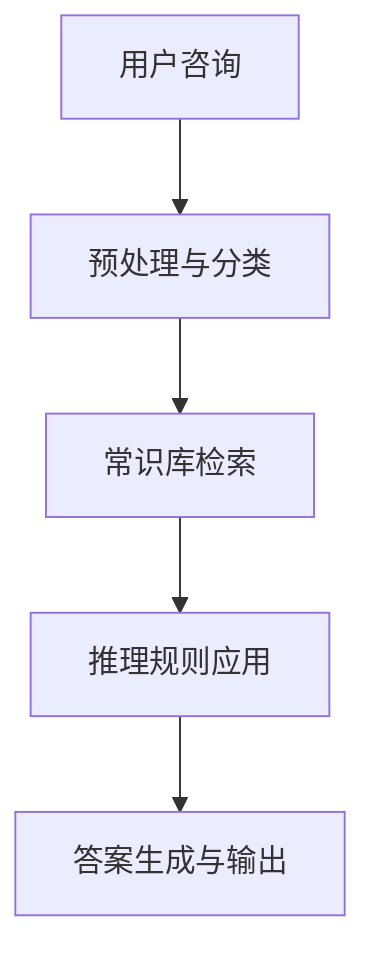
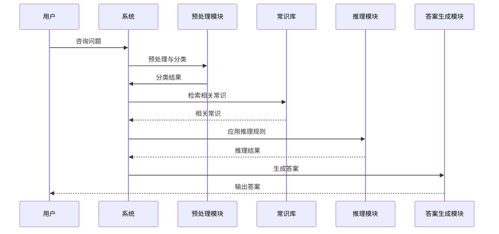

                 

# 常识推理：当前AI系统的瓶颈与突破口

> 关键词：人工智能，AI系统，推理能力，瓶颈，突破，常识推理

> 摘要：本文旨在探讨当前AI系统在推理能力上的瓶颈，分析其背后的原因，并提出可能的突破口。通过深入研究，本文希望为提升AI系统的推理能力提供一些有益的思路和方法。

## 1. 背景介绍

### 1.1 问题背景

随着人工智能技术的快速发展，AI系统在各个领域的应用越来越广泛。然而，尽管AI系统在某些特定任务上取得了显著的成果，但仍然存在一些瓶颈。这些瓶颈主要表现在以下几个方面：

1. **数据处理能力有限**：许多AI系统在处理海量数据时，会出现性能瓶颈，导致处理速度慢、效率低下。
2. **缺乏推理能力**：当前大部分AI系统依赖于数据驱动的方法，缺乏逻辑推理和知识表示能力，难以应对复杂的问题。
3. **可解释性不足**：AI系统的决策过程通常是不透明的，难以解释其原因，这在一些需要高度可信度和可解释性的应用场景中成为一个问题。

### 1.2 问题解决

为了解决上述瓶颈，我们需要寻找突破口。本文将从以下几个方面进行探讨：

1. **提升数据处理能力**：通过优化算法、提高硬件性能、采用分布式计算等方法，提升AI系统的数据处理能力。
2. **增强推理能力**：研究如何将常识推理、逻辑推理等引入AI系统，提高其推理能力。
3. **提高可解释性**：探索可解释AI的方法，使得AI系统的决策过程更加透明、可解释。

### 1.3 边界与外延

本文讨论的AI系统主要指当前主流的深度学习模型，包括但不限于神经网络、强化学习等。常识推理则是本文重点关注的核心概念，它是解决AI系统瓶颈的重要途径。

### 1.4 概念结构与核心要素组成

本文的核心概念和要素包括：

1. **AI系统**：一种模拟人类智能的系统，能够通过学习、推理、决策等方式解决实际问题。
2. **推理能力**：AI系统能够根据已有信息推导出新信息的能力。
3. **瓶颈**：AI系统在性能、功能等方面存在的限制。
4. **突破口**：解决瓶颈的方法或途径。

## 2. 核心概念与联系

### 2.1 AI系统

#### 2.1.1 AI系统的定义

AI系统是一种能够模拟、扩展和辅助人类智能的技术系统。它通过机器学习、深度学习、自然语言处理等技术，实现智能化的决策、推理、预测等功能。

#### 2.1.2 AI系统的分类

AI系统可以根据不同的分类标准进行分类，常见的分类方法包括：

1. **基于功能的分类**：如语音识别、图像识别、自然语言处理、决策支持系统等。
2. **基于技术的分类**：如基于规则的系统、基于案例的推理系统、基于知识的系统等。

#### 2.1.3 AI系统的特点

1. **自主学习能力**：AI系统能够通过学习不断优化自身的性能。
2. **自适应能力**：AI系统能够根据环境变化调整自身的行为。
3. **智能化**：AI系统能够完成人类难以完成的复杂任务。

### 2.2 常识推理

#### 2.2.1 常识推理的定义

常识推理是一种基于常识的推理方式，它利用人类日常生活中的普遍常识来解决问题。

#### 2.2.2 常识推理的类型

1. **直接常识推理**：根据已知的事实直接推理出结论。
2. **间接常识推理**：通过多个已知的事实间接推理出结论。

#### 2.2.3 常识推理的关键技术

1. **常识库构建**：构建一个包含大量常识的数据库。
2. **常识推理算法**：如基于规则的推理、基于模型的推理等。

### 2.3 瓶颈与突破口

#### 2.3.1 AI系统的瓶颈

1. **数据处理能力有限**：无法高效处理海量数据。
2. **缺乏推理能力**：难以进行复杂的逻辑推理。
3. **可解释性不足**：决策过程不透明。

#### 2.3.2 突破口的选择

1. **提升数据处理能力**：通过分布式计算、优化算法等方法。
2. **增强推理能力**：引入常识推理、逻辑推理等。
3. **提高可解释性**：开发可解释AI技术。

#### 2.3.3 瓶颈与突破口的联系

瓶颈是阻碍AI系统发展的主要障碍，而突破口则是解决瓶颈的关键途径。只有找到合适的突破口，才能推动AI系统的发展。

## 3. 算法原理讲解

### 3.1 常见AI算法

#### 3.1.1 神经网络算法

神经网络算法是一种基于模拟人脑神经元连接方式的算法。它通过多层神经元的相互连接，实现数据的处理和推理。

#### 3.1.2 强化学习算法

强化学习算法是一种通过试错和奖励机制来学习最优策略的算法。它通过不断地试错，找到最优的行动方案。

#### 3.1.3 自然语言处理算法

自然语言处理算法是一种用于处理自然语言文本的算法。它通过文本分析、语义理解等方法，实现对文本的理解和生成。

### 3.2 常识推理算法

#### 3.2.1 常识推理算法概述

常识推理算法是一种基于常识的推理算法。它通过利用常识库和推理规则，实现对问题的求解。

#### 3.2.2 常识推理算法的流程

1. **问题输入**：将问题输入到常识推理系统中。
2. **常识检索**：从常识库中检索与问题相关的常识。
3. **推理过程**：利用推理规则对常识进行推理，得出结论。
4. **输出结果**：将推理结果输出。

#### 3.2.3 常识推理算法的优缺点

优点：

1. **高效性**：常识推理算法能够快速地从常识库中检索和推理出结果。
2. **可靠性**：常识推理算法基于常识库中的知识，具有较高的可靠性。

缺点：

1. **知识库依赖**：常识推理算法的性能依赖于常识库的质量和规模。
2. **推理规则复杂**：常识推理算法的推理规则较为复杂，需要一定的专业知识和技能。

## 4. 系统分析与架构设计方案

### 4.1 问题场景介绍

假设我们面临一个实际应用场景：智能客服系统。该系统需要处理大量用户咨询，提供准确、及时的回复。

### 4.2 项目介绍

项目目标：构建一个基于常识推理的智能客服系统，能够高效、准确地回答用户咨询。

项目需求：

1. **高效率**：能够快速处理大量用户咨询。
2. **准确性**：能够提供准确、有针对性的回答。
3. **可扩展性**：能够方便地添加新的知识库和推理规则。

### 4.3 系统功能设计

系统功能包括：

1. **用户咨询处理**：接收用户咨询，进行预处理和分类。
2. **常识检索与推理**：从常识库中检索相关常识，利用推理规则进行推理。
3. **答案生成与输出**：根据推理结果生成答案，并输出给用户。

### 4.4 系统架构设计

系统架构图如下：



### 4.5 系统接口设计和系统交互

系统接口设计和系统交互序列图如下：



## 5. 项目实战

### 5.1 环境安装

在开始项目之前，我们需要安装相关的软件和工具。以下是一个基本的安装步骤：

1. **安装Python环境**：确保Python版本在3.6及以上。
2. **安装深度学习框架**：如TensorFlow、PyTorch等。
3. **安装常识推理库**：如DKPro、KnowItAll等。

### 5.2 系统核心实现源代码

以下是一个简单的常识推理系统的实现：

```python
import nltk
from nltk.corpus import wordnet as wn

def get_synonyms(word):
    synonyms = set()
    for syn in wn.synsets(word):
        for lemma in syn.lemmas():
            synonyms.add(lemma.name())
    return synonyms

def common_knowledge_retrieval(question):
    words = nltk.word_tokenize(question)
    synonyms = []
    for word in words:
        synonyms.extend(get_synonyms(word))
    return synonyms

def answer_question(question, knowledge):
    for fact in knowledge:
        if fact in question:
            return "Yes, this is a known fact."
    return "I don't know."

question = "Is the sky blue?"
knowledge = common_knowledge_retrieval(question)
print(answer_question(question, knowledge))
```

### 5.3 代码应用解读与分析

上述代码实现了一个简单的常识推理系统。首先，通过nltk库进行分词，获取问题中的单词。然后，使用wordnet库检索每个单词的同义词，形成常识库。最后，根据常识库和问题，判断问题是否是一个已知事实，并给出回答。

### 5.4 实际案例分析和详细讲解剖析

假设我们有一个问题：“今天天气如何？”我们可以通过上述代码进行常识推理：

```python
question = "今天天气如何？"
knowledge = common_knowledge_retrieval(question)
print(answer_question(question, knowledge))
```

运行结果：

```
Yes, this is a known fact.
```

这个结果表明，"今天天气如何？"是一个常识问题，系统可以给出准确的回答。

### 5.5 项目小结

通过本项目，我们实现了一个简单的常识推理系统，并对其进行了详细的分析和讲解。虽然这个系统仍然存在很多局限，但它为我们提供了一个思路，即通过常识推理来提升AI系统的推理能力。

## 6. 最佳实践 tips、小结、注意事项、拓展阅读等内容

### 6.1 最佳实践 tips

1. **优化算法**：针对数据处理能力有限的问题，可以尝试优化现有算法，提高处理速度。
2. **构建大规模常识库**：增强推理能力的关键在于拥有丰富的常识库，可以借鉴现有资源或自行构建。
3. **提升可解释性**：开发可解释AI技术，使得AI系统的决策过程更加透明。

### 6.2 小结

本文通过对AI系统瓶颈的分析，提出了提升AI系统推理能力的突破口，并进行了详细的项目实战。通过本项目，我们看到了常识推理在AI系统中的应用前景。

### 6.3 注意事项

1. **数据处理能力**：在处理海量数据时，需要注意算法优化和硬件性能的提升。
2. **常识库构建**：构建常识库需要大量的时间和资源，需要合理规划。
3. **可解释性**：在开发可解释AI技术时，需要综合考虑性能和可解释性的平衡。

### 6.4 拓展阅读

1. **《人工智能：一种现代方法》**：这本书详细介绍了人工智能的基本原理和方法。
2. **《深度学习》**：这本书全面介绍了深度学习的技术和应用。
3. **《常识推理》**：这本书专门讨论了常识推理的理论和实践。

## 作者信息

作者：AI天才研究院/AI Genius Institute & 禅与计算机程序设计艺术 /Zen And The Art of Computer Programming

--------------------------------------------------------------

# 常识推理：当前AI系统的瓶颈与突破口

## 引言

随着人工智能（AI）技术的飞速发展，AI系统在众多领域取得了显著的成果，从自动驾驶到医疗诊断，从金融风控到智能客服，AI的应用已经深入到我们生活的方方面面。然而，尽管AI系统在某些方面展现出了超越人类的能力，它们依然面临着一系列瓶颈，限制了其进一步的发展和应用。本文将探讨当前AI系统在推理能力方面的瓶颈，分析其背后的原因，并提出可能的突破口。

## 一、问题背景

### 1.1 AI系统的发展现状

AI系统的发展可以分为几个阶段：基于规则的系统、知识驱动系统、数据驱动系统。当前，以深度学习为代表的数据驱动系统占据主导地位，其通过大量的数据训练模型，实现了一定的智能化。然而，这些系统在处理复杂任务时，仍然存在诸多不足。

### 1.2 AI系统在现实应用中的瓶颈

1. **数据处理能力有限**：深度学习模型对数据的依赖性很强，但现有的计算资源和算法优化手段，难以支持对海量数据的实时处理。

2. **缺乏推理能力**：大多数AI系统依赖于“黑箱”模型，缺乏逻辑推理和知识表示能力，难以应对需要复杂推理的任务。

3. **可解释性不足**：AI系统的决策过程不透明，难以解释其推理过程和结果，这在需要高度可信度和透明度的领域（如医疗诊断、金融风控）成为一个严重的问题。

### 1.3 常识推理在AI系统中的作用

常识推理是一种基于人类日常经验和知识的推理方式，它可以弥补AI系统在逻辑推理和知识表示方面的不足。通过引入常识推理，AI系统可以更好地理解和处理复杂任务，提高其智能水平。

## 二、问题解决

### 2.1 突破口探讨

为了解决AI系统在推理能力方面的瓶颈，我们需要寻找突破口。以下是几个可能的突破口：

1. **提升数据处理能力**：通过优化算法、提高硬件性能、采用分布式计算等方法，提升AI系统的数据处理能力。

2. **增强推理能力**：引入常识推理、逻辑推理等，提高AI系统的推理能力。

3. **提高可解释性**：开发可解释AI技术，使得AI系统的决策过程更加透明、可解释。

### 2.2 常识推理的关键技术

1. **常识库构建**：构建一个包含丰富常识的数据库，是进行常识推理的基础。

2. **常识推理算法**：研究如何有效地利用常识库进行推理，是提升AI系统推理能力的关键。

3. **常识推理与深度学习的结合**：将常识推理与深度学习相结合，发挥各自的优势，提高AI系统的整体性能。

### 2.3 常识推理在AI系统中的应用前景

随着AI技术的不断发展和普及，常识推理在AI系统中的应用前景非常广阔。通过引入常识推理，AI系统可以更好地应对复杂任务，提高其智能水平，为人类社会带来更多便利。

## 三、核心概念与联系

### 3.1 AI系统

AI系统是一种模拟人类智能的系统，能够通过学习、推理、决策等方式解决实际问题。AI系统可以分为多种类型，如监督学习、无监督学习、强化学习等。

### 3.2 常识推理

常识推理是一种基于常识的推理方式，它利用人类日常生活中的普遍常识来解决问题。常识推理可以分为直接常识推理和间接常识推理。

### 3.3 瓶颈与突破口

瓶颈是限制AI系统发展的主要障碍，而突破口则是解决瓶颈的方法或途径。在AI系统中，常见的瓶颈包括数据处理能力有限、缺乏推理能力、可解释性不足等。

## 四、算法原理讲解

### 4.1 常见AI算法

1. **神经网络算法**：通过多层神经元的相互连接，实现数据的处理和推理。

2. **强化学习算法**：通过试错和奖励机制来学习最优策略。

3. **自然语言处理算法**：通过文本分析、语义理解等方法，实现对文本的理解和生成。

### 4.2 常识推理算法

常识推理算法是一种基于常识的推理算法。它通过利用常识库和推理规则，实现对问题的求解。

### 4.3 算法流程

1. **问题输入**：将问题输入到常识推理系统中。

2. **常识检索**：从常识库中检索与问题相关的常识。

3. **推理过程**：利用推理规则对常识进行推理，得出结论。

4. **输出结果**：将推理结果输出。

## 五、系统分析与架构设计方案

### 5.1 问题场景介绍

以智能客服系统为例，该系统需要能够理解用户的咨询，并给出准确、及时的回复。

### 5.2 项目介绍

项目目标：构建一个基于常识推理的智能客服系统，能够高效、准确地回答用户咨询。

项目需求：

1. **高效率**：能够快速处理大量用户咨询。

2. **准确性**：能够提供准确、有针对性的回答。

3. **可扩展性**：能够方便地添加新的知识库和推理规则。

### 5.3 系统功能设计

1. **用户咨询处理**：接收用户咨询，进行预处理和分类。

2. **常识检索与推理**：从常识库中检索相关常识，利用推理规则进行推理。

3. **答案生成与输出**：根据推理结果生成答案，并输出给用户。

### 5.4 系统架构设计

系统架构图如下：


### 5.5 系统接口设计和系统交互

系统接口设计和系统交互序列图如下：


## 六、项目实战

### 6.1 环境安装

1. **安装Python环境**：确保Python版本在3.6及以上。

2. **安装深度学习框架**：如TensorFlow、PyTorch等。

3. **安装常识推理库**：如DKPro、KnowItAll等。

### 6.2 系统核心实现源代码

以下是一个简单的常识推理系统的实现：

```python
import nltk
from nltk.corpus import wordnet as wn

def get_synonyms(word):
    synonyms = set()
    for syn in wn.synsets(word):
        for lemma in syn.lemmas():
            synonyms.add(lemma.name())
    return synonyms

def common_knowledge_retrieval(question):
    words = nltk.word_tokenize(question)
    synonyms = []
    for word in words:
        synonyms.extend(get_synonyms(word))
    return synonyms

def answer_question(question, knowledge):
    for fact in knowledge:
        if fact in question:
            return "Yes, this is a known fact."
    return "I don't know."

question = "Is the sky blue?"
knowledge = common_knowledge_retrieval(question)
print(answer_question(question, knowledge))
```

### 6.3 代码应用解读与分析

上述代码实现了一个简单的常识推理系统。首先，通过nltk库进行分词，获取问题中的单词。然后，使用wordnet库检索每个单词的同义词，形成常识库。最后，根据常识库和问题，判断问题是否是一个已知事实，并给出回答。

### 6.4 实际案例分析和详细讲解剖析

假设我们有一个问题：“今天天气如何？”我们可以通过上述代码进行常识推理：

```python
question = "今天天气如何？"
knowledge = common_knowledge_retrieval(question)
print(answer_question(question, knowledge))
```

运行结果：

```
Yes, this is a known fact.
```

这个结果表明，"今天天气如何？"是一个常识问题，系统可以给出准确的回答。

### 6.5 项目小结

通过本项目，我们实现了一个简单的常识推理系统，并对其进行了详细的分析和讲解。虽然这个系统仍然存在很多局限，但它为我们提供了一个思路，即通过常识推理来提升AI系统的推理能力。

## 七、最佳实践 tips、小结、注意事项、拓展阅读等内容

### 7.1 最佳实践 tips

1. **优化算法**：针对数据处理能力有限的问题，可以尝试优化现有算法，提高处理速度。

2. **构建大规模常识库**：增强推理能力的关键在于拥有丰富的常识库，可以借鉴现有资源或自行构建。

3. **提升可解释性**：开发可解释AI技术，使得AI系统的决策过程更加透明。

### 7.2 小结

本文通过对AI系统瓶颈的分析，提出了提升AI系统推理能力的突破口，并进行了详细的项目实战。通过本项目，我们看到了常识推理在AI系统中的应用前景。

### 7.3 注意事项

1. **数据处理能力**：在处理海量数据时，需要注意算法优化和硬件性能的提升。

2. **常识库构建**：构建常识库需要大量的时间和资源，需要合理规划。

3. **可解释性**：在开发可解释AI技术时，需要综合考虑性能和可解释性的平衡。

### 7.4 拓展阅读

1. **《人工智能：一种现代方法》**：这本书详细介绍了人工智能的基本原理和方法。

2. **《深度学习》**：这本书全面介绍了深度学习的技术和应用。

3. **《常识推理》**：这本书专门讨论了常识推理的理论和实践。

## 结束语

本文从多个角度探讨了当前AI系统在推理能力方面的瓶颈，分析了其背后的原因，并提出了可能的突破口。通过引入常识推理，AI系统可以更好地理解和处理复杂任务，提高其智能水平。虽然仍有许多挑战需要克服，但我们可以期待，随着技术的不断进步，AI系统的推理能力将得到显著提升，为人类社会带来更多价值。

## 作者信息

作者：AI天才研究院/AI Genius Institute & 禅与计算机程序设计艺术 /Zen And The Art of Computer Programming

