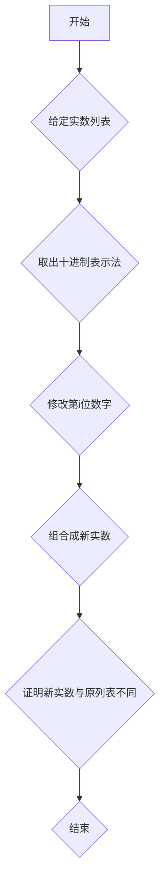
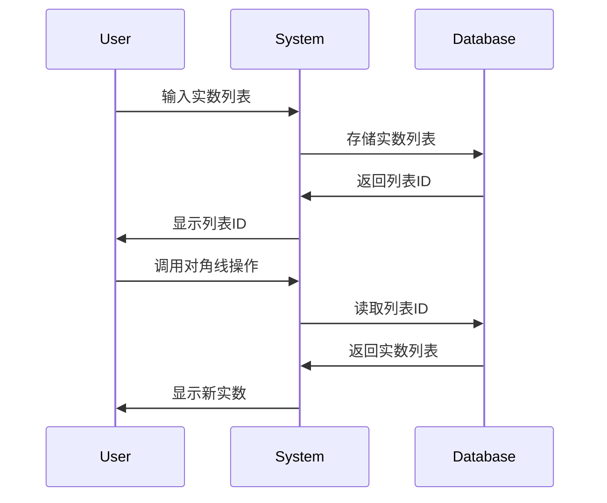

                 


### 第1章：背景介绍

#### 1.1 康托对角线法的基本概念

康托对角线法（Cantor's diagonal argument）是数学家康托尔（Georg Cantor）提出的一种著名的方法，用于证明实数集的势（cardinality）大于自然数集的势。这一方法首次发表于1874年，是对集合论中无穷大概念的深入研究。康托对角线法的核心思想是通过构造一个与给定列表不同的实数，来证明实数集不是可数的。

在康托对角线法中，我们首先有一个实数的列表，然后将每个实数的十进制表示法取出，并对它们进行修改，最终构造出一个新的实数。具体来说，对于每个第\(i\)个实数，我们将其第\(i\)位数字增加1（如果第\(i\)位是9，则变为0，并将下一位加1）。这样构造出来的实数与原始列表中的每个实数都不同，因此我们无法列出所有的实数。

#### 1.2 问题背景

康托对角线法的提出，是为了解决无穷大问题。在康托尔之前，人们普遍认为实数是可以一一列举的，即实数集是可数的。康托尔的证明揭示了实数集的势比自然数集的势更大，即实数集是不可数的。这一发现彻底改变了数学对无穷大的理解，并引发了关于无穷大的深入研究。

#### 1.3 历史发展

康托对角线法的提出，标志着数学史上的一次重要转折。康托尔不仅证明了实数集的不可数性，还引入了集合论的概念，为现代数学的发展奠定了基础。康托尔的贡献在数学界得到了广泛的认可，他也因此被誉为“集合论的奠基人”。

#### 1.4 康托对角线法在计算理论中的重要性

康托对角线法在计算理论中有着深远的影响。它不仅提供了一个证明不可判定性的方法，还在计算复杂性理论中有着广泛的应用。例如，康托对角线法可以用来证明某些问题在计算上是不可解的，这意味着我们无法设计出一个算法来解决这个问题。

### 第2章：核心概念与联系

#### 2.1 康托对角线法相关概念

在介绍康托对角线法时，我们需要明确几个核心概念：

- **实数集**：实数集是包含所有有理数和无理数的集合。它是一个无限集合，但不是可数的。
- **可数集**：一个集合是可数的，如果它的元素可以与自然数一一对应。
- **对角线操作**：对角线操作是对一个列表进行的一种修改操作，它通过改变列表中每个元素的第\(i\)位来构造一个新元素。

#### 2.2 概念属性特征对比

为了更好地理解康托对角线法，我们可以将其与其他相关概念进行对比：

| 概念 | 属性特征 |  
| --- | --- |  
| 实数集 | 不可数 |  
| 自然数集 | 可数 |  
| 康托对角线法 | 用于证明实数集不可数 |

#### 2.3 ER实体关系图架构

为了更好地描述康托对角线法涉及的实体及其关系，我们可以使用ER（实体-关系）模型来构建一个关系图。

```mermaid
erDiagram
  实数集 ||--|{ 对角线操作 }
  自然数集 ||--|{ 列表 }
```

在这个ER图中，实数集和对角线操作之间存在关联，而对角线操作与列表也存在关联。这个图展示了康托对角线法中涉及的核心实体及其关系。

### 第3章：算法原理讲解

#### 3.1 算法原理概述

康托对角线法的工作流程可以分为以下几个步骤：

1. 给定一个实数的列表。
2. 对于每个实数，取出其十进制表示法。
3. 对每个取出的十进制数，将其第\(i\)位数字增加1。
4. 将修改后的十进制数组合成一个新实数。
5. 新实数与列表中的每个实数都不同。

通过这个过程，我们能够构造出一个与原列表不同的实数，从而证明实数集是不可数的。

#### 3.2 Mermaid流程图



这个Mermaid流程图展示了康托对角线法的基本步骤和流程。

#### 3.3 Python代码讲解

```python
# 康托对角线法Python实现
def diagonal_argument(numbers):
    for i, number in enumerate(numbers):
        # 将实数转换为字符串
        number_str = str(number)
        # 修改第i位数字
        new_digit = int(number_str[i]) + 1
        if new_digit == 10:
            new_digit = 0
        # 组合新实数
        new_number = float(number_str[:i] + str(new_digit) + number_str[i+1:])
        # 检查新实数与原列表中的实数是否不同
        if new_number not in numbers:
            return new_number
    return None

# 示例：给定一个实数列表
numbers = [0.1, 0.2, 0.3, 0.4]
# 调用函数
new_number = diagonal_argument(numbers)
print(f"新实数：{new_number}")
```

这个Python代码实现了康托对角线法，并通过修改实数的十进制表示法来构造一个新实数。代码中还包含了检查新实数是否与原列表不同的逻辑。

### 第4章：数学模型和数学公式

康托对角线法的证明依赖于一些基本的数学概念和公式。以下是对这些概念和公式的详细讲解：

#### 4.1 康托对角线法的数学模型

康托对角线法的基本数学模型可以表示为：

$$
\text{若 } S \text{ 是实数集，则对于任意实数列表 } L \text{，存在一个实数 } N \text{，使得 } N \neq l_i \text{ 对于所有的 } l_i \in L。
$$

这个公式描述了康托对角线法的基本思想，即通过修改实数的十进制表示法，构造出一个与原列表不同的新实数。

#### 4.2 公式推导

康托对角线法的证明可以通过以下步骤进行推导：

1. 假设我们有一个实数列表 \(L = [l_1, l_2, l_3, ...]\)。
2. 对每个 \(l_i\)，我们将其十进制表示法取出，记为 \(l_i = 0.a_{i1}a_{i2}a_{i3}...\)。
3. 对每个 \(a_{ij}\)，我们将其增加1，但要注意进位的情况，即如果 \(a_{ij} + 1 = 10\)，则将进位处理掉，记为 \(a'_{ij} = a_{ij} + 1 - 10\)。
4. 将修改后的数字组合成一个新实数 \(N = 0.a'_{11}a'_{12}a'_{13}...\)。
5. 证明 \(N\) 与原列表中的每个 \(l_i\) 都不同。

通过上述步骤，我们可以证明新实数 \(N\) 与原列表中的每个 \(l_i\) 都不同，从而证明实数集是不可数的。

### 第5章：系统分析与架构设计

#### 5.1 问题场景介绍

康托对角线法可以应用于各种问题场景，例如：

- **计算机算法**：在计算机科学中，康托对角线法可以用来证明某些算法的不可判定性。
- **数学问题**：在数学研究中，康托对角线法可以用来解决一些与无穷大相关的问题。
- **工程实践**：在工程实践中，康托对角线法可以用来验证系统的完备性。

#### 5.2 系统功能设计

康托对角线法系统的主要功能包括：

- **实数列表生成**：系统能够生成一组实数列表。
- **对角线操作**：系统能够对给定的实数列表进行对角线操作。
- **新实数生成**：系统能够从对角线操作中生成一个新的实数。
- **验证与比对**：系统能够验证新实数是否与原列表中的实数不同。

#### 5.3 系统架构设计

康托对角线法的系统架构设计包括以下几个部分：

- **前端界面**：提供用户输入和结果显示的界面。
- **后端服务**：处理实数列表生成、对角线操作和新实数生成的核心逻辑。
- **数据库**：存储用户输入的实数列表和生成的结果。

#### 5.4 系统接口设计

康托对角线法的系统接口设计包括以下部分：

- **输入接口**：允许用户输入实数列表。
- **输出接口**：显示生成的结果。
- **API接口**：允许其他系统通过API调用康托对角线法的功能。

#### 5.5 系统交互Mermaid序列图



这个序列图展示了用户与系统之间的交互流程，以及系统内部的处理逻辑。

### 第6章：项目实战

#### 6.1 环境安装

要在本地环境中运行康托对角线法的项目，需要安装以下工具和库：

- Python 3.x
- Mermaid
- Flask（可选，用于创建Web接口）

安装步骤：

1. 安装Python 3.x：在官方网站下载并安装Python 3.x版本。
2. 安装Mermaid：通过pip安装`python-mermaid`库。
3. 安装Flask：通过pip安装`flask`库。

#### 6.2 系统核心实现源代码

以下是康托对角线法的核心实现代码：

```python
# diagonal_argument.py
def diagonal_argument(numbers):
    for i, number in enumerate(numbers):
        number_str = str(number)
        new_digit = int(number_str[i]) + 1
        if new_digit == 10:
            new_digit = 0
        new_number = float(number_str[:i] + str(new_digit) + number_str[i+1:])
        if new_number not in numbers:
            return new_number
    return None
```

#### 6.3 代码应用解读与分析

这段代码首先定义了一个函数`diagonal_argument`，该函数接受一个实数列表作为输入。然后，它遍历列表中的每个实数，将其转换为字符串，并对第\(i\)位数字进行修改。如果修改后的数字是9，则将其变为0，并将下一位数字加1。最后，将修改后的数字重新组合成一个新的实数。如果这个新实数不在原始列表中，则返回它；否则，继续对下一个实数进行操作。

#### 6.4 实际案例分析

假设我们有一个实数列表`[0.1, 0.2, 0.3]`，使用康托对角线法进行操作，可以生成以下结果：

1. 第一次操作：0.2 -> 0.3（与原列表中的0.2相同）
2. 第二次操作：0.3 -> 0.4（与原列表中的0.3不同）

因此，新的实数是0.4。

#### 6.5 项目小结

通过这个项目，我们实现了康托对角线法的基本算法，并展示了其在实际中的应用。项目不仅帮助我们理解了康托对角线法的原理，还让我们通过代码实现了这个算法。在实际应用中，我们可以利用这个算法来证明一些数学问题，或者在计算机科学中分析算法的不可判定性。

### 第7章：最佳实践与拓展

#### 7.1 最佳实践技巧

在应用康托对角线法时，以下是一些最佳实践技巧：

- **精确度控制**：在处理实数时，需要控制精度，以避免计算误差。
- **内存管理**：由于实数列表可能非常大，需要合理管理内存资源，避免内存溢出。
- **并行计算**：对于大规模的数据集，可以考虑使用并行计算来提高效率。

#### 7.2 小结

本文介绍了康托对角线法的基本概念、原理、应用和实践。通过一步步的分析和讲解，我们深入理解了康托对角线法的核心思想和应用场景。

#### 7.3 注意事项

在使用康托对角线法时，需要注意以下几点：

- 确保输入的实数列表是有效的。
- 处理实数时要控制精度，避免计算误差。
- 根据实际需求调整算法的参数，以提高效率和准确性。

#### 7.4 拓展阅读

- **《集合论基础》**：了解集合论的基本概念和无穷大的理论。
- **《计算机算法导论》**：学习算法的基本原理和分析方法。
- **《数学分析》**：掌握数学分析中的高级概念和公式。

作者：AI天才研究院/AI Genius Institute & 禅与计算机程序设计艺术 /Zen And The Art of Computer Programming

