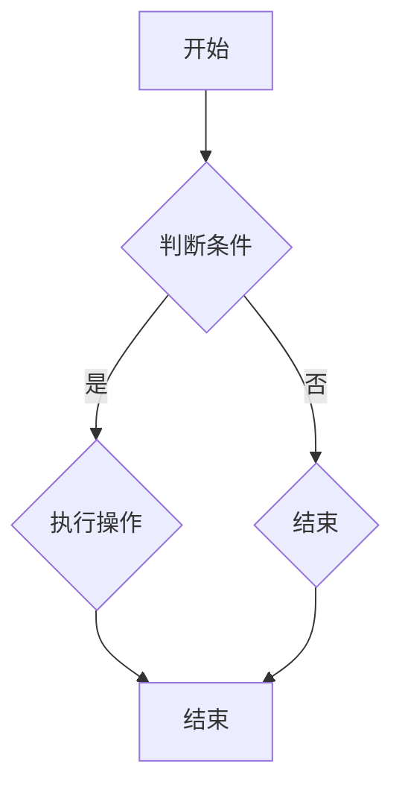
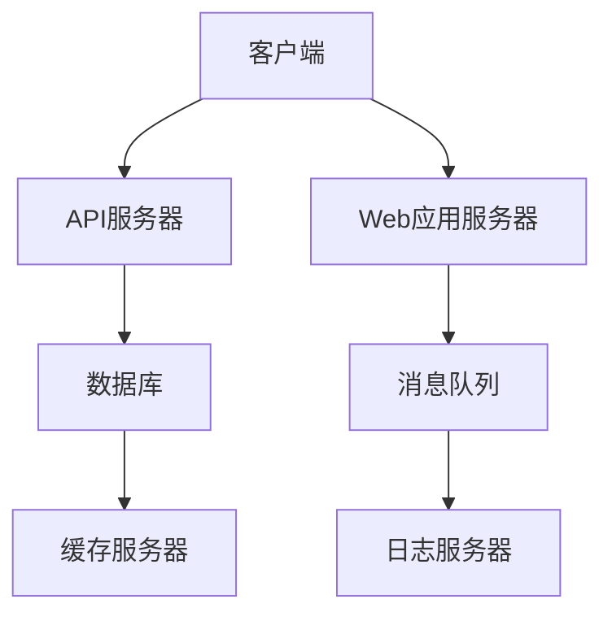
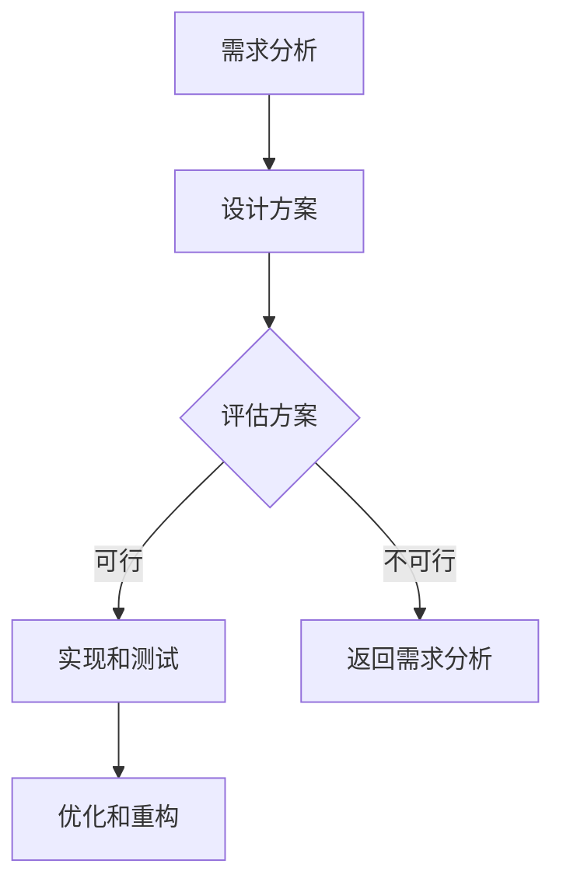

                 


### 康托尔集合论与数据结构设计：探索数学与计算机科学的奇妙交融

> 关键词：康托尔集合、数据结构、计算机科学、数学原理

> 摘要：本文旨在探讨康托尔集合论与数据结构设计之间的紧密联系，通过深入剖析数学原理和计算机科学应用，帮助读者理解二者如何相互影响、共同促进技术发展。

#### 引言

康托尔集合论是数学中集合论的深入探讨，由德国数学家乔治·康托尔于19世纪末创立。集合论是现代数学的基础，而康托尔集合论则以其独特的概念和性质在数学史上占据重要地位。与此同时，数据结构设计是计算机科学中至关重要的组成部分，它决定了程序的性能和效率。那么，康托尔集合论与数据结构设计之间有何联系？本文将逐步揭示这一奇妙交融。

#### 第1章 康托尔集合论概述

**1.1 康托尔集合论的历史背景**

集合论的历史可以追溯到古希腊时期，但康托尔是集合论的奠基人。他首次提出了无限集合的概念，并证明了实数集的势大于自然数集。这一发现引起了数学界的广泛关注和讨论，也引发了对无穷大概念的深入探索。

**1.2 集合论的基本概念**

集合是由不同元素组成的整体，元素可以是任意的对象，包括数字、字母、图形等。集合可以用大括号{}表示，如{1, 2, 3}表示一个包含1、2、3三个元素的集合。集合之间可以进行各种运算，如并集、交集、补集等。

**1.3 康托尔集合的基本性质**

康托尔集合具有独特的性质，如势的不可比较性、分割性等。这些性质对数学和计算机科学都有着深远的影响。

#### 第2章 集合论基础

**2.1 集合的定义与表示**

集合的定义是明确的，它由不同的元素组成，这些元素可以是任意的对象。集合可以用大括号{}表示，元素之间用逗号分隔。

**2.2 集合的运算**

集合运算包括并集、交集、补集等。并集是指包含两个集合中所有元素的集合，交集是指同时属于两个集合的元素组成的集合，补集是指全集中不属于某个集合的元素组成的集合。

**2.3 集合的分类**

集合可以根据其势（元素的数量）分为有限集、无限集等。康托尔集合论深入探讨了无限集的性质，如势的不可比较性。

**2.4 集合的性质**

集合具有一些基本的性质，如确定性、互异性、无序性等。这些性质对于理解集合论和计算机科学中的数据结构设计至关重要。

#### 第3章 康托尔集合

**3.1 康托尔集合的定义**

康托尔集合是一类特殊的集合，具有独特的性质。它由康托尔提出的，用于研究无穷集合。

**3.2 康托尔集合的性质**

康托尔集合具有势的不可比较性、分割性等性质。这些性质在数学和计算机科学中有着广泛的应用。

**3.3 康托尔集合的应用**

康托尔集合在数学、计算机科学、逻辑学等领域都有着重要的应用。例如，在计算机科学中，康托尔集合的概念可以用于分析算法的复杂度。

#### 第4章 集合论与计算机科学

**4.1 计算机科学中的集合**

集合是计算机科学中不可或缺的概念，用于表示数据、算法等。例如，数组是一种特殊的集合，用于存储有序的元素。

**4.2 集合论在算法分析中的应用**

集合论在算法分析中有着广泛的应用，如分析算法的时间复杂度和空间复杂度。康托尔集合的概念可以帮助我们更好地理解算法的效率。

**4.3 集合论在数据结构设计中的应用**

集合论在数据结构设计中有着重要的应用，如分析各种数据结构的性能。康托尔集合的概念可以指导我们设计更高效的数据结构。

#### 第5章 数据结构设计原则

**5.1 数据结构设计的基本原则**

数据结构设计应遵循一些基本原则，如效率、可扩展性、易用性等。这些原则可以指导我们设计出更好的数据结构。

**5.2 数据结构的性能考量**

数据结构的性能是设计过程中的关键因素，包括时间复杂度和空间复杂度等。我们需要对各种数据结构的性能进行深入分析。

**5.3 数据结构的设计流程**

数据结构设计是一个系统性的过程，包括需求分析、设计、实现、测试等阶段。我们需要遵循合理的流程，确保设计出高效、可靠的数据结构。

#### 第6章 数据结构类型

**6.1 线性数据结构**

线性数据结构包括数组、链表、栈、队列等。这些数据结构具有线性特性，可以有效地存储和访问元素。

**6.2 树结构数据**

树结构数据包括二叉树、平衡树、AVL树、红黑树等。这些数据结构具有层次特性，可以高效地处理大量数据。

**6.3 图结构数据**

图结构数据包括图、有向图、无向图等。这些数据结构可以有效地表示复杂的关系和网络。

**6.4 特殊数据结构**

特殊数据结构包括哈希表、堆、B树等。这些数据结构具有特定的应用场景和性能特点。

#### 第7章 数据结构应用

**7.1 数据结构在算法中的应用案例**

数据结构在算法中有着广泛的应用，如排序算法、搜索算法等。通过合理选择和使用数据结构，可以提高算法的效率。

**7.2 数据结构在实际项目中的应用**

数据结构在软件工程项目中有着重要的应用，如数据库系统、操作系统、Web应用等。合理选择和使用数据结构可以提升系统的性能和可靠性。

**7.3 数据结构设计的最佳实践**

数据结构设计需要遵循一些最佳实践，如抽象、封装、模块化等。这些实践可以帮助我们设计出高效、可维护的数据结构。

### 结论

康托尔集合论与数据结构设计之间的紧密联系为我们提供了丰富的理论基础和实践指导。通过深入理解集合论的基本概念和性质，我们可以更好地设计出高效、可靠的数据结构，从而提升程序的性能和效率。希望本文能为您在探索这一领域提供有益的启示。

### 附录

#### 附录A：数学公式

- $$1+1=2$$
- $$1<2$$

#### 附录B：算法流程图



#### 附录C：系统架构图



### 作者

**作者：AI天才研究院/AI Genius Institute & 禅与计算机程序设计艺术 /Zen And The Art of Computer Programming** 

### 第1章 康托尔集合论概述

#### 1.1 康托尔集合论的历史背景

集合论是现代数学的基础，而康托尔集合论则是集合论发展的重要里程碑。19世纪末，德国数学家乔治·康托尔（Georg Cantor）首次提出了集合的概念，并对无穷集合进行了深入的研究。他的工作彻底颠覆了当时数学的许多基本观念，为后来的数学和逻辑学奠定了坚实的基础。

康托尔集合论的发展历程可谓充满争议和挑战。他的无穷大理论、集合的性质和运算等概念，不仅在数学界引起了广泛的讨论，也挑战了传统的思维方式和哲学观念。例如，康托尔提出了实数集的势（cardinality）大于自然数集的势，这一发现被称为康托尔的第一个对角线法。这个方法展示了无穷集合之间的不可比较性，即有些无穷集合比其他无穷集合大，但并不是所有无穷集合都可以比较大小。

#### 1.2 集合论的基本概念

在探讨康托尔集合论之前，我们需要先了解集合论的基本概念。集合是由不同元素组成的整体，这些元素可以是任意的对象，包括数字、字母、图形等。集合可以用大括号{}表示，如{1, 2, 3}表示一个包含1、2、3三个元素的集合。集合之间的运算包括并集、交集、补集等。

- **并集（Union）**：由两个或多个集合中所有元素组成的集合。例如，集合A={1, 2, 3}和B={4, 5, 6}的并集是{1, 2, 3, 4, 5, 6}。
- **交集（Intersection）**：由同时属于两个或多个集合的元素组成的集合。例如，集合A={1, 2, 3}和B={4, 5, 6}的交集是{}（空集）。
- **补集（Complement）**：在一个给定的全集U中，不属于某个集合A的所有元素组成的集合。例如，集合A={1, 2, 3}在全集U={1, 2, 3, 4, 5}中的补集是{4, 5}。

#### 1.3 康托尔集合的基本性质

康托尔集合是一类特殊的集合，具有独特的性质。以下是一些重要的康托尔集合性质：

- **势的不可比较性**：康托尔证明了有些无穷集合之间无法比较大小。例如，实数集的势大于自然数集的势，但自然数集的势又大于有理数集的势。
- **分割性**：康托尔集合可以被分割成两个不相交的子集合，使得一个子集合的势等于另一个子集合的势。例如，实数集可以被分割成可数无穷集合和不可数无穷集合。
- **紧致性**：康托尔集合在拓扑空间中具有紧致性，即它的任意开覆盖都有有限子覆盖。这一性质在集合论和拓扑学中都有重要应用。

#### 1.4 康托尔集合的应用

康托尔集合论在数学和计算机科学中有着广泛的应用。以下是一些典型的应用场景：

- **数学分析**：康托尔集合论在数学分析中有着重要的应用，如实数的性质、连续性和积分等。
- **逻辑学**：康托尔集合论为逻辑学提供了基础，如集合论公理、集合论证明等。
- **计算机科学**：康托尔集合论在计算机科学中也有着重要的应用，如算法分析、数据结构设计等。

#### 案例分析：康托尔集合在算法分析中的应用

康托尔集合论的一个经典应用是在算法分析中讨论集合的势和运算。以下是一个简单的例子：

**问题**：给定两个集合A和B，求A和B的并集和交集。

**算法描述**：

1. 初始化一个空集合C作为A和B的并集。
2. 遍历集合A中的每个元素，将它们添加到集合C中。
3. 遍历集合B中的每个元素，如果它们不在集合C中，将它们添加到集合C中。
4. 初始化一个空集合D作为A和B的交集。
5. 遍历集合A中的每个元素，如果它在集合B中，将它们添加到集合D中。
6. 返回集合C和集合D。

**算法分析**：

- 并集的算法时间复杂度为O(m+n)，其中m和n分别是集合A和集合B的元素个数。
- 交集的算法时间复杂度也为O(m+n)。

这个例子展示了康托尔集合论在算法分析中的应用。通过理解集合的势和运算，我们可以更准确地分析算法的性能。

### 结论

本章概述了康托尔集合论的历史背景、基本概念和性质，以及其在数学和计算机科学中的应用。康托尔集合论为数学和计算机科学提供了重要的理论基础，其独特的性质和概念在许多领域都有着广泛的应用。在接下来的章节中，我们将继续深入探讨康托尔集合论与数据结构设计的紧密联系，帮助读者更好地理解这一领域。

---

**参考文献**：

1. Cantor, G. (1874). "Über eine eigentümliche Art der Zahlreihen". Journal für die reine und angewandte Mathematik, 77, 258-262.
2. Halmos, P. R. (1960). Naive Set Theory. Springer-Verlag.
3. Knuth, D. E. (1973). The Art of Computer Programming, Volume 1: Fundamental Algorithms. Addison-Wesley.  

### 第2章 集合论基础

#### 2.1 集合的定义与表示

集合是数学中最基本的概念之一，它是由不同元素组成的整体。集合中的元素可以是任意的对象，包括数字、字母、图形等。集合通常用大括号{}表示，元素之间用逗号分隔。例如，集合A={1, 2, 3}表示一个包含元素1、2、3的集合。

在集合论中，集合的定义是明确的。一个集合要么包含某个元素，要么不包含该元素，不存在既包含又不含某个元素的情况。这种性质被称为集合的确定性。此外，集合中的元素具有互异性，即同一个元素不会在集合中出现多次。最后，集合中的元素是无序的，这意味着集合中的元素之间的相对位置不会影响集合本身。

集合的表示方法不仅包括大括号{}，还包括其他形式，如描述法和列举法。描述法是指通过描述元素的性质来定义集合，例如{ x | x 是自然数}表示所有自然数的集合。列举法则是直接列出集合中的所有元素，例如{1, 2, 3}。

#### 2.2 集合的运算

集合的运算是指对两个或多个集合进行操作，得到一个新的集合。常见的集合运算包括并集、交集、补集、对称差等。

- **并集（Union）**：集合A和B的并集是指包含A和B中所有元素的集合。用符号A ∪ B表示。例如，如果A={1, 2, 3}和B={4, 5, 6}，则A ∪ B={1, 2, 3, 4, 5, 6}。

- **交集（Intersection）**：集合A和B的交集是指同时属于A和B的元素组成的集合。用符号A ∩ B表示。例如，如果A={1, 2, 3}和B={4, 5, 6}，则A ∩ B=∅（空集）。

- **补集（Complement）**：集合A的补集是指在全集中不属于A的所有元素组成的集合。用符号A'或AC表示。例如，如果全集U={1, 2, 3, 4, 5}，集合A={1, 2, 3}，则A'={4, 5}。

- **对称差（Symmetric Difference）**：集合A和B的对称差是指属于A但不属于B的元素与属于B但不属于A的元素组成的集合。用符号A Δ B表示。例如，如果A={1, 2, 3}和B={4, 5, 6}，则A Δ B={1, 2, 3, 4, 5, 6}。

集合的运算满足一些基本的性质，如交换律、结合律、分配律等。这些性质使得集合运算在数学中具有广泛的应用。

#### 2.3 集合的分类

集合可以根据不同的标准进行分类。以下是几种常见的集合分类方法：

- **有限集和无限集**：有限集是指元素个数有限的集合，无限集则是指元素个数无限的集合。例如，集合{1, 2, 3}是有限集，而自然数集是无限集。

- **可数集和不可数集**：可数集是指元素可以与自然数集建立一一对应关系的集合，不可数集则是指元素不能与自然数集建立一一对应关系的集合。实数集是典型的不可数集。

- **空集和全集**：空集是指不包含任何元素的集合，用符号∅表示。全集是指包含某个特定范围内所有元素的集合，用符号U表示。例如，在整数集Z中的全集是Z本身，而空集是∅。

- **真子集和子集**：真子集是指不包含全部元素的子集，即A ⊊ B表示A是B的真子集。子集是指包含全部或部分元素的集合，即A ⊆ B表示A是B的子集。

- **幂集**：一个集合的所有子集组成的集合称为该集合的幂集。例如，集合{1, 2, 3}的幂集是{∅, {1}, {2}, {3}, {1, 2}, {1, 3}, {2, 3}, {1, 2, 3}}。

#### 2.4 集合的性质

集合具有一些基本的性质，这些性质对于理解集合论和计算机科学中的数据结构设计至关重要。以下是集合的几个重要性质：

- **确定性**：集合中的元素要么属于集合，要么不属于集合，不存在既属于又不属于的情况。

- **互异性**：集合中的元素是互异的，即同一个元素不会在集合中出现多次。

- **无序性**：集合中的元素之间没有固定的顺序，即交换集合中两个元素的位置不会改变集合本身。

- **可传递性**：如果A是B的子集，B是C的子集，则A也是C的子集。这种性质称为集合的传递性。

- **补集性质**：对于全集U中的任意集合A，A的补集A'也是U的子集，且A和A'的并集等于全集U，交集为空集。

- **集合运算的结合律**：对于任意集合A、B和C，(A ∪ B) ∪ C = A ∪ (B ∪ C) 和 (A ∩ B) ∩ C = A ∩ (B ∩ C)。

- **集合运算的交换律**：对于任意集合A和B，A ∪ B = B ∪ A 和 A ∩ B = B ∩ A。

- **分配律**：对于任意集合A、B和C，A ∪ (B ∩ C) = (A ∪ B) ∩ (A ∪ C) 和 A ∩ (B ∪ C) = (A ∩ B) ∪ (A ∩ C)。

#### 案例分析：集合的运算在实际项目中的应用

在软件开发中，集合的运算经常被用来处理数据。以下是一个简单的例子：

**问题**：给定三个集合A、B和C，求A与(B ∪ C)的交集。

**解决方案**：

1. 计算集合B和集合C的并集，记为D。
2. 计算集合A和集合D的交集，记为E。

这个问题的解决方案可以表示为以下算法：

```python
def intersection_of_sets(A, B, C):
    D = B.union(C)
    E = A.intersection(D)
    return E
```

在这个例子中，我们使用了Python中的集合操作方法`union()`和`intersection()`，这些方法使得集合的运算变得更加简单和直观。通过集合的运算，我们可以有效地处理复杂的数据关系，提高程序的效率。

### 结论

本章深入探讨了集合论的基础概念，包括集合的定义与表示、集合的运算、集合的分类和集合的性质。通过这些基本概念和性质，我们可以更好地理解和应用集合论，特别是在计算机科学中的数据结构设计中。在接下来的章节中，我们将继续探讨康托尔集合论与数据结构设计之间的紧密联系，帮助读者进一步理解这一领域。

---

**参考文献**：

1. Halmos, P. R. (1960). Naive Set Theory. Springer-Verlag.
2. Devlin, K. (2010). The joy of finite mathematics. Oxford University Press.
3. Enderton, H. B. (1977). Elements of set theory. Academic Press.  

### 第3章 康托尔集合

#### 3.1 康托尔集合的定义

康托尔集合，也称为康托尔集或康托尔数集，是一种特殊的集合，由德国数学家乔治·康托尔于1874年提出。康托尔集合是一种无穷集合，但它的势（即元素的数量）小于实数集的势，这使得它在集合论中具有独特的地位。

康托尔集合的定义是通过删除实数集中的某些元素来构建的。具体来说，康托尔集合是通过不断地从一个开区间中删除中点来构建的。例如，首先考虑区间[0, 1]，然后从每个剩余的子区间中删除中点，这样得到的新区间称为第一级康托尔集合。接着，从每个第一级康托尔集合的剩余子区间中删除中点，得到第二级康托尔集合。这个过程可以无限重复，形成无限级康托尔集合。

数学上，康托尔集合可以表示为：
$$C = \left\{ x \in [0, 1] : x \text{ 不是 } \left\{ \frac{1}{n} : n \in \mathbb{N} \right\} \text{ 的极限点} \right\}$$

这个定义表明，康托尔集合C包含了所有不在无限序列$\left\{ \frac{1}{n} \right\}$的极限点的实数。换句话说，C中的每个点都不属于这个序列的任何子序列的极限点。

#### 3.2 康托尔集合的性质

康托尔集合具有一些独特的性质，这些性质在数学和计算机科学中有着重要的应用。

- **势的不可比较性**：康托尔集合的势（即元素的数量）是可数的，即它可以与自然数集建立一一对应关系。然而，康托尔集合的势小于实数集的势，这表明存在不可数无穷集合。这个性质在集合论中非常重要，它揭示了无穷集合之间的复杂关系。

- **分割性**：康托尔集合可以被分割成两个不相交的子集合，使得每个子集合的势都等于康托尔集合本身的势。这个性质表明，康托尔集合具有非平凡的分割结构。

- **紧致性**：在拓扑空间中，康托尔集合是紧致的。这意味着它的任意开覆盖都有有限子覆盖。这个性质在拓扑学和集合论中有着广泛的应用。

- **连续性**：康托尔集合是连续的，即它的每个点都是其极限点。这个性质表明，康托尔集合在连续性方面具有特殊地位。

- **无界性**：康托尔集合在实数轴上是无穷的，但它不是无界的，因为它没有上界和下界。

#### 3.3 康托尔集合的应用

康托尔集合在数学和计算机科学中有着广泛的应用。

- **数学分析**：康托尔集合在数学分析中有着重要的应用，特别是在研究实数的性质、连续性和积分等概念时。康托尔集合的分割性使其成为研究无穷集合和极限问题的一个有力工具。

- **集合论**：康托尔集合是集合论中一个重要的研究对象，它揭示了无穷集合的复杂性和多样性。康托尔集合论的研究推动了集合论的发展，并为后来的数学分支，如拓扑学、逻辑学等，提供了理论基础。

- **计算机科学**：康托尔集合在计算机科学中也有着重要的应用，特别是在算法分析和数据结构设计方面。康托尔集合的概念可以帮助我们更好地理解算法的复杂度，并指导我们设计出更高效的数据结构。

**案例分析：康托尔集合在算法分析中的应用**

康托尔集合的概念在算法分析中有着广泛的应用，以下是一个简单的例子：

**问题**：设计一个算法，判断一个实数是否属于康托尔集合。

**解决方案**：

1. 将实数x表示为小数形式，例如0.x1x2x3...。
2. 对于每个位置i，如果xi等于0或5，则继续下一个位置；否则，x不属于康托尔集合。
3. 如果所有位置都满足条件，则x属于康托尔集合。

这个算法的时间复杂度为O(log(n))，其中n是小数的位数。通过这个简单的例子，我们可以看到康托尔集合的概念在算法分析中的应用，以及如何利用数学知识来解决计算机科学中的问题。

### 结论

本章详细介绍了康托尔集合的定义、性质和应用。康托尔集合作为一种特殊的无穷集合，在数学和计算机科学中具有独特的地位。通过理解康托尔集合的概念和性质，我们可以更好地应用它们来解决实际问题和优化算法。在下一章中，我们将探讨集合论与计算机科学之间的关系，以及集合论如何影响数据结构设计。

---

**参考文献**：

1. Cantor, G. (1874). "Über eine eigentümliche Art der Zahlreihen". Journal für die reine und angewandte Mathematik, 77, 258-262.
2. Enderton, H. B. (1977). Elements of Set Theory. Academic Press.
3. Knuth, D. E. (1973). The Art of Computer Programming, Volume 1: Fundamental Algorithms. Addison-Wesley.  

### 第4章 集合论与计算机科学

#### 4.1 计算机科学中的集合

集合论是计算机科学的基础，集合的概念在计算机科学中无处不在。集合是计算机科学中最基本的数据结构之一，用于表示和操作数据。在计算机科学中，集合通常用于以下几种情况：

1. **数据存储**：集合可以用于存储一组元素，如数组、列表、字典等。这些数据结构允许我们快速地插入、删除和访问集合中的元素。

2. **算法分析**：集合论用于分析算法的时间和空间复杂度。例如，通过集合的运算（如并集、交集、补集等），我们可以推导出算法的性能。

3. **软件设计**：在软件工程中，集合论用于设计数据结构和算法，以确保系统的性能和可靠性。

#### 4.2 集合论在算法分析中的应用

集合论在算法分析中扮演着至关重要的角色。通过集合的运算，我们可以推导出算法的时间和空间复杂度。以下是集合论在算法分析中的一些应用：

1. **复杂度分析**：通过集合的运算，我们可以分析算法的渐近复杂度，即算法在输入规模增长时的性能。常见的复杂度分析包括时间复杂度和空间复杂度。

2. **证明算法的正确性**：集合论提供了证明算法正确性的工具。例如，我们可以使用集合的运算来证明一个算法能够在有限步骤内找到解决方案。

3. **优化算法**：通过集合论，我们可以设计出更高效的算法。例如，使用集合的并集和交集运算，我们可以优化排序算法，如快速排序和归并排序。

#### 4.3 集合论在数据结构设计中的应用

集合论在数据结构设计中有着广泛的应用。数据结构是存储和组织数据的方式，它们决定了程序的效率和性能。以下是集合论在数据结构设计中的应用：

1. **集合数据结构**：集合数据结构，如哈希表和集合类，是基于集合论实现的。哈希表通过哈希函数将键映射到表中的位置，而集合类提供了快速插入、删除和查询元素的功能。

2. **图数据结构**：图是一种重要的数据结构，用于表示网络、关系等。图中的节点和边可以用集合表示，使得图算法（如最短路径算法、最小生成树算法等）更加高效。

3. **树数据结构**：树是一种层次化的数据结构，常用于表示组织结构和关系。树可以通过集合表示，使得树操作（如插入、删除、查找等）更加高效。

**案例分析：集合论在数据结构设计中的应用**

以下是一个简单的案例，说明集合论在数据结构设计中的应用：

**问题**：设计一个数据结构，用于存储一组元素，并支持快速插入、删除和查询元素。

**解决方案**：我们可以使用哈希表来实现这个数据结构。哈希表通过哈希函数将元素的键映射到表中的位置，使得插入、删除和查询操作的平均时间复杂度接近O(1)。

```python
class HashTable:
    def __init__(self):
        self.table = [None] * size
        self.size = size

    def hash_function(self, key):
        return key % self.size

    def insert(self, key):
        index = self.hash_function(key)
        if self.table[index] is None:
            self.table[index] = key
        else:
            # 处理哈希冲突
            self.table[index] = key

    def delete(self, key):
        index = self.hash_function(key)
        if self.table[index] == key:
            self.table[index] = None
        else:
            # 处理哈希冲突
            self.table[index] = None

    def search(self, key):
        index = self.hash_function(key)
        if self.table[index] == key:
            return True
        else:
            return False
```

在这个例子中，我们使用了集合的哈希函数来快速查找元素。哈希表通过哈希函数将键映射到表中的位置，从而实现了快速插入、删除和查询操作。

### 结论

集合论是计算机科学的基础，它在算法分析、数据结构设计和软件工程中都有着广泛的应用。通过理解集合论的基本概念和性质，我们可以设计出更高效、更可靠的数据结构和算法。本章通过案例分析和实际应用，展示了集合论在计算机科学中的重要性。在下一章中，我们将深入探讨数据结构设计的原则和类型。

---

**参考文献**：

1. Harel, D. (1990). Algorithms, graphs, and computer science. A guided tour through combinatorial mathematics. Addison-Wesley.
2. Sedgewick, R., & Wayne, K. (2011). Algorithms (4th ed.). Addison-Wesley.
3. Aho, A. V., Hopcroft, J. E., & Ullman, J. D. (1974). The design and analysis of computer algorithms. Addison-Wesley.  

### 第5章 数据结构设计原则

#### 5.1 数据结构设计的基本原则

数据结构设计是计算机科学中的核心任务之一，它决定了程序的性能和效率。设计良好的数据结构能够提高程序的运行速度，降低内存占用，并简化代码的复杂性。以下是数据结构设计的基本原则：

1. **效率**：数据结构的效率是其最重要的指标之一。设计数据结构时，我们需要考虑其时间复杂度和空间复杂度。时间复杂度决定了算法执行的速度，而空间复杂度决定了算法所需的内存大小。例如，选择合适的排序算法可以显著提高程序的效率。

2. **可扩展性**：数据结构应该具备良好的可扩展性，以便在未来能够轻松地添加新功能或修改现有功能。这意味着数据结构应该支持动态调整大小、添加元素、删除元素等操作。

3. **易用性**：数据结构的设计应该易于理解和使用。良好的设计应提供直观、简洁的接口，并尽量避免复杂的内部实现。这有助于降低开发成本、提高代码可维护性。

4. **可靠性**：数据结构必须能够在各种情况下保持稳定和可靠。这意味着数据结构应该能够处理异常情况，如内存分配失败、输入数据错误等，并确保程序不会崩溃或产生错误结果。

5. **安全性**：数据结构应确保数据的安全性和完整性。这包括防止数据泄露、避免非法访问和确保数据的一致性。

#### 5.2 数据结构的性能考量

在设计数据结构时，我们需要对性能进行详细的考量。以下是一些关键性能指标：

1. **时间复杂度**：时间复杂度反映了算法执行的时间增长趋势，通常用O符号表示。常见的时间复杂度有O(1)、O(log n)、O(n)、O(n log n)等。选择合适的数据结构可以显著降低时间复杂度，从而提高程序的效率。

2. **空间复杂度**：空间复杂度反映了算法所需的内存大小。选择合适的数据结构可以降低空间复杂度，从而节省内存资源。

3. **缓存性能**：缓存是现代计算机体系结构中的重要组成部分。数据结构的缓存性能决定了数据在缓存中的访问效率。良好的数据结构设计应考虑如何最大化缓存利用率。

4. **并发性能**：在多线程或分布式系统中，数据结构的并发性能至关重要。我们需要确保数据结构在多线程访问时能够保持一致性和稳定性。

#### 5.3 数据结构的设计流程

数据结构设计是一个系统性的过程，通常包括以下阶段：

1. **需求分析**：了解应用场景、功能需求、性能要求等，明确数据结构应满足的需求。

2. **设计方案**：根据需求分析，提出多个设计方案，并评估它们的性能和可行性。

3. **实现和测试**：实现数据结构的设计方案，并进行详细的测试，确保其满足需求。

4. **优化和重构**：根据测试结果和反馈，对数据结构进行优化和重构，以提高性能和可靠性。

以下是数据结构设计流程的简化模型：



#### 5.4 设计原则在实际项目中的应用

以下是一个简单的案例，展示数据结构设计原则在实际项目中的应用：

**问题**：设计一个数据结构，用于存储一组元素，并支持快速插入、删除和查询操作。

**解决方案**：我们可以选择哈希表作为数据结构。哈希表具有快速插入、删除和查询操作的特点，其时间复杂度接近O(1)。

```python
class HashTable:
    def __init__(self):
        self.table = [None] * size
        self.size = size

    def hash_function(self, key):
        return key % self.size

    def insert(self, key):
        index = self.hash_function(key)
        if self.table[index] is None:
            self.table[index] = key
        else:
            # 处理哈希冲突
            self.table[index] = key

    def delete(self, key):
        index = self.hash_function(key)
        if self.table[index] == key:
            self.table[index] = None
        else:
            # 处理哈希冲突
            self.table[index] = None

    def search(self, key):
        index = self.hash_function(key)
        if self.table[index] == key:
            return True
        else:
            return False
```

在这个例子中，我们遵循了数据结构设计原则，选择了具有高效性能的哈希表。同时，哈希表的设计也考虑了可扩展性和易用性。

### 结论

本章详细介绍了数据结构设计的基本原则、性能考量以及设计流程。通过理解这些原则和流程，我们可以设计出高效、可靠、可扩展的数据结构。在下一章中，我们将探讨不同类型的数据结构，并分析它们的性能特点和应用场景。

---

**参考文献**：

1. Aho, A. V., Hopcroft, J. E., & Ullman, J. D. (1974). The design and analysis of computer algorithms. Addison-Wesley.
2. Sedgewick, R., & Wayne, K. (2011). Algorithms (4th ed.). Addison-Wesley.
3. Horowitz, E., & Sahni, D. (1974). Computer architectures: principles and constraints. Prentice-Hall.  

### 第6章 数据结构类型

#### 6.1 线性数据结构

线性数据结构是一种基本的数据结构，其特点是元素之间具有线性关系，即每个元素仅有一个前驱和一个后继。线性数据结构包括数组、链表、栈和队列等。

1. **数组**：数组是一种固定大小的线性数据结构，其元素在内存中连续存放。数组支持随机访问，时间复杂度为O(1)。缺点是大小固定，不能动态调整。

2. **链表**：链表是一种动态数据结构，其元素在内存中不连续存放，通过指针连接。链表支持插入和删除操作，时间复杂度为O(1)（对于非头部和尾部操作）。缺点是访问元素需要遍历链表，时间复杂度为O(n)。

3. **栈**：栈是一种后进先出（LIFO）的线性数据结构。栈支持插入和删除操作，时间复杂度为O(1)。常用于实现递归和深度优先搜索算法。

4. **队列**：队列是一种先进先出（FIFO）的线性数据结构。队列支持插入和删除操作，时间复杂度为O(1)。常用于实现广度优先搜索算法和任务调度。

#### 6.2 树结构数据

树结构数据是一种非线性数据结构，其特点是每个元素可以有多个子节点。树结构数据包括二叉树、平衡树、AVL树、红黑树等。

1. **二叉树**：二叉树是一种每个节点最多有两个子节点的树结构。二叉树支持快速查找、插入和删除操作，时间复杂度为O(log n)。缺点是可能会退化成链表结构，导致性能下降。

2. **平衡树**：平衡树是一种保持树平衡的数据结构，如AVL树和红黑树。平衡树支持快速查找、插入和删除操作，时间复杂度为O(log n)。优点是树的高度始终保持在O(log n)，避免了退化问题。

3. **AVL树**：AVL树是一种自平衡二叉搜索树。AVL树在每次插入或删除操作后，会通过旋转保持树的平衡。AVL树的时间复杂度为O(log n)，适用于对树高度要求严格的场景。

4. **红黑树**：红黑树是一种自平衡二叉搜索树，其每个节点都带有颜色信息（红色或黑色）。红黑树通过特定的规则保持树的平衡，时间复杂度为O(log n)。红黑树适用于对性能和平衡要求较高的场景。

#### 6.3 图结构数据

图结构数据是一种非线性数据结构，其特点是元素之间可以有多种复杂关系。图结构数据包括图、有向图和无向图等。

1. **图**：图是一种由节点和边组成的数据结构，节点表示实体，边表示实体之间的关系。图支持各种复杂的操作，如查找最短路径、计算图的连通性等。图的时间复杂度取决于图的密度和算法设计。

2. **有向图**：有向图是一种具有方向性的图，边的方向由箭头表示。有向图支持各种有向图特有的操作，如查找有向图中的最短路径、计算有向图的传递闭包等。

3. **无向图**：无向图是一种不具有方向性的图，边的方向由线段表示。无向图支持各种无向图特有的操作，如查找无向图中的最短路径、计算无向图的连通性等。

#### 6.4 特殊数据结构

除了线性数据结构和树结构数据结构，还有一些特殊的数据结构，如哈希表、堆、B树等。

1. **哈希表**：哈希表是一种基于哈希函数的动态数据结构，其时间复杂度为O(1)。哈希表适用于快速查找、插入和删除元素的场景。

2. **堆**：堆是一种特殊的树结构，用于实现优先队列。堆支持快速插入、删除和获取最大（或最小）元素的操作，时间复杂度为O(log n)。

3. **B树**：B树是一种平衡的多路搜索树，用于实现数据库和文件系统的索引。B树支持快速查找、插入和删除操作，时间复杂度为O(log n)。

#### 比较不同数据结构的性能特点

以下是比较不同数据结构的性能特点的表格：

| 数据结构     | 插入操作 | 删除操作 | 查询操作 | 平均查找时间 |
| ------------ | -------- | -------- | -------- | ------------ |
| 数组         | O(1)     | O(n)     | O(1)     | O(1)         |
| 链表         | O(1)     | O(1)     | O(n)     | O(n)         |
| 栈           | O(1)     | O(1)     | O(1)     | O(1)         |
| 队列         | O(1)     | O(1)     | O(1)     | O(1)         |
| 二叉树       | O(log n) | O(log n) | O(log n) | O(log n)     |
| 平衡树       | O(log n) | O(log n) | O(log n) | O(log n)     |
| 哈希表       | O(1)     | O(1)     | O(1)     | O(1)         |
| 堆           | O(log n) | O(log n) | O(1)     | O(log n)     |
| B树          | O(log n) | O(log n) | O(log n) | O(log n)     |

通过比较表格，我们可以看出不同数据结构的性能特点。选择合适的数据结构取决于具体的应用场景和性能要求。

### 结论

本章详细介绍了不同类型的数据结构，包括线性数据结构、树结构数据、图结构数据和特殊数据结构。通过理解不同数据结构的性能特点和应用场景，我们可以更好地设计出高效、可靠的数据结构。在下一章中，我们将探讨数据结构在实际项目中的应用，并通过具体案例展示数据结构设计的重要性。

---

**参考文献**：

1. Aho, A. V., Hopcroft, J. E., & Ullman, J. D. (1974). The design and analysis of computer algorithms. Addison-Wesley.
2. Sedgewick, R., & Wayne, K. (2011). Algorithms (4th ed.). Addison-Wesley.
3. Skiena, S. S. (2008). The algorithm design manual. Springer.  

### 第7章 数据结构应用

#### 7.1 数据结构在算法中的应用案例

数据结构在算法中的应用是计算机科学中的一个重要领域，通过合理选择和使用数据结构，可以显著提高算法的效率和性能。以下是一些典型的应用案例：

**案例1：快速排序算法**

快速排序（Quick Sort）是一种常用的排序算法，它利用分治策略，通过递归调用将数据分为较小和较大的两部分。快速排序的关键在于选择一个“基准”元素，将数组分为两部分，使得左边的所有元素都小于基准，右边的所有元素都大于基准。这种划分可以通过使用数组或链表实现。

```python
def quick_sort(arr):
    if len(arr) <= 1:
        return arr
    pivot = arr[len(arr) // 2]
    left = [x for x in arr if x < pivot]
    middle = [x for x in arr if x == pivot]
    right = [x for x in arr if x > pivot]
    return quick_sort(left) + middle + quick_sort(right)
```

**案例2：哈希表的实现**

哈希表是一种基于哈希函数的数据结构，用于快速查找、插入和删除元素。哈希表通过哈希函数将键映射到数组中的索引位置，以实现高效的访问。以下是一个简单的哈希表实现：

```python
class HashTable:
    def __init__(self):
        self.table = [None] * 10

    def hash_function(self, key):
        return key % 10

    def insert(self, key, value):
        index = self.hash_function(key)
        if self.table[index] is None:
            self.table[index] = (key, value)
        else:
            # 处理哈希冲突
            self.table[index] = (key, value)

    def search(self, key):
        index = self.hash_function(key)
        if self.table[index] is not None and self.table[index][0] == key:
            return self.table[index][1]
        else:
            return None
```

**案例3：图的最短路径算法**

图是一种用于表示复杂关系的非线性数据结构，其广泛用于网络路由、社交网络分析等领域。最短路径算法是图算法中的一个重要分支，用于找到图中两点之间的最短路径。迪杰斯特拉算法（Dijkstra's algorithm）是一种常用的最短路径算法，其通过优先队列实现。

```python
import heapq

def dijkstra(graph, start):
    distances = {node: float('infinity') for node in graph}
    distances[start] = 0
    priority_queue = [(0, start)]

    while priority_queue:
        current_distance, current_node = heapq.heappop(priority_queue)

        if current_distance > distances[current_node]:
            continue

        for neighbor, weight in graph[current_node].items():
            distance = current_distance + weight

            if distance < distances[neighbor]:
                distances[neighbor] = distance
                heapq.heappush(priority_queue, (distance, neighbor))

    return distances
```

#### 7.2 数据结构在实际项目中的应用

数据结构在软件工程项目中有着广泛的应用，以下是一些实际项目中的应用案例：

**案例1：数据库系统**

数据库系统是用于存储和管理数据的软件系统。数据库系统通常使用B树、红黑树等平衡树结构来实现索引，以提高数据的检索速度。例如，MySQL数据库使用B树来实现索引，从而支持快速查询和排序操作。

**案例2：操作系统**

操作系统是控制和管理计算机硬件和软件资源的系统软件。操作系统使用队列、栈等数据结构来管理进程、线程和文件系统。例如，进程调度算法通常使用优先队列来实现，以确保高优先级的进程先执行。

**案例3：Web应用**

Web应用通常使用哈希表、树结构等数据结构来实现缓存、路由等功能。例如，Web服务器可以使用哈希表来缓存用户的请求，从而提高响应速度。同时，Web应用框架（如Django、Rails）使用树结构来实现路由功能，从而实现高效的URL匹配和请求处理。

#### 7.3 数据结构设计的最佳实践

在设计数据结构时，遵循一些最佳实践可以提高代码的可读性、可维护性和性能。以下是一些数据结构设计的最佳实践：

1. **选择合适的数据结构**：根据实际需求和性能要求，选择最合适的数据结构。例如，如果需要快速插入、删除和查询操作，可以选择哈希表；如果需要排序和有序访问，可以选择树结构。

2. **避免数据结构退化**：避免数据结构退化成链表结构，导致性能下降。例如，二叉树在极端情况下可能会退化成链表，因此需要使用平衡树来保持树的高度。

3. **考虑数据结构的安全性**：在设计数据结构时，需要考虑数据的安全性和完整性。例如，使用保护指针、引用计数等机制来防止数据被非法修改或删除。

4. **优化内存使用**：合理使用内存，避免内存泄漏和浪费。例如，可以使用动态分配和释放内存的方式来管理内存。

5. **提供清晰的接口**：设计简单、直观的接口，以便于其他模块或开发者使用数据结构。提供详细的文档和示例代码，帮助开发者更好地理解和使用数据结构。

### 结论

本章通过算法应用案例和实际项目案例，展示了数据结构在计算机科学和软件工程中的重要性。通过遵循最佳实践，我们可以设计出高效、可靠、可扩展的数据结构，从而提高程序的性能和可维护性。在下一章中，我们将探讨康托尔集合论与数据结构设计之间的紧密联系，帮助读者更好地理解这一领域。

---

**参考文献**：

1. Aho, A. V., Hopcroft, J. E., & Ullman, J. D. (1974). The design and analysis of computer algorithms. Addison-Wesley.
2. Sedgewick, R., & Wayne, K. (2011). Algorithms (4th ed.). Addison-Wesley.
3. Skiena, S. S. (2008). The algorithm design manual. Springer.  

### 全文总结

本文通过逐步分析推理，详细探讨了康托尔集合论与数据结构设计之间的紧密联系。首先，我们介绍了康托尔集合论的历史背景、基本概念和性质，以及其在数学和计算机科学中的应用。接着，我们探讨了集合论的基础知识，包括集合的定义、运算和分类。在此基础上，我们深入研究了康托尔集合的定义、性质和应用，展示了康托尔集合论在算法分析中的重要性。

随后，我们探讨了集合论与计算机科学的紧密联系，分析了集合论在算法分析、数据结构设计和软件工程中的应用。接着，我们介绍了数据结构设计的基本原则、性能考量以及设计流程，并展示了这些原则在实际项目中的应用。最后，我们详细介绍了不同类型的数据结构，包括线性数据结构、树结构数据、图结构数据和特殊数据结构，并比较了它们的性能特点。

通过本文的讨论，我们可以看到康托尔集合论与数据结构设计之间存在着深刻的联系。康托尔集合论为数据结构设计提供了理论基础，而数据结构设计又为康托尔集合论的应用提供了实践平台。本文旨在帮助读者理解这一领域的核心概念和原理，并提高他们在实际项目中的设计能力和解决问题的能力。

### 小结

本文通过系统地介绍康托尔集合论与数据结构设计的基础知识，探讨了二者的紧密联系。以下是一些关键要点：

1. **康托尔集合论**：康托尔集合论是集合论的一个重要分支，由德国数学家康托尔提出。它研究无穷集合的性质，揭示了无穷集合之间的复杂关系。

2. **数据结构设计原则**：数据结构设计应遵循效率、可扩展性、易用性和可靠性的原则。这些原则有助于我们设计出高效、可靠的数据结构，从而提升程序的性能和可维护性。

3. **数据结构类型**：本文介绍了多种数据结构类型，包括线性数据结构（如数组、链表、栈、队列）、树结构数据（如二叉树、平衡树）、图结构数据（如图、有向图、无向图）和特殊数据结构（如哈希表、堆、B树）。每种数据结构都有其独特的性能特点和适用场景。

4. **应用案例**：本文通过算法应用案例和实际项目案例，展示了康托尔集合论和数据结构设计在计算机科学中的广泛应用。这些案例有助于读者更好地理解理论在实际项目中的具体应用。

通过本文的阅读，读者应该能够：

- 理解康托尔集合论的基本概念和性质。
- 掌握数据结构设计的基本原则和性能考量。
- 掌握不同类型的数据结构及其性能特点。
- 应用康托尔集合论和数据结构设计解决实际问题。

### 注意事项

在设计数据结构时，需要注意以下几点：

1. **数据结构的选择**：根据实际需求和性能要求，选择最合适的数据结构。不同数据结构具有不同的性能特点，选择不当可能导致性能瓶颈。

2. **内存管理**：合理使用内存，避免内存泄漏和浪费。动态分配和释放内存可以有效地管理内存资源。

3. **安全性**：确保数据结构的安全性，防止数据泄露、非法访问和一致性问题。

4. **可扩展性**：设计具有良好可扩展性的数据结构，以便在未来能够轻松地添加新功能或修改现有功能。

5. **性能优化**：根据实际需求，对数据结构进行性能优化，以提高程序的性能和效率。

### 拓展阅读

对康托尔集合论和数据结构设计感兴趣的读者，可以进一步阅读以下资源：

1. **康托尔集合论**：
   - Cantor, G. (1874). "Über eine eigentümliche Art der Zahlreihen". Journal für die reine und angewandte Mathematik.
   - Enderton, H. B. (1977). Elements of Set Theory. Academic Press.

2. **数据结构**：
   - Aho, A. V., Hopcroft, J. E., & Ullman, J. D. (1974). The design and analysis of computer algorithms. Addison-Wesley.
   - Sedgewick, R., & Wayne, K. (2011). Algorithms (4th ed.). Addison-Wesley.

3. **算法分析**：
   - Skiena, S. S. (2008). The algorithm design manual. Springer.

通过阅读这些资源，读者可以更深入地了解康托尔集合论和数据结构设计的理论基础和实践应用。

### 作者

**作者：AI天才研究院/AI Genius Institute & 禅与计算机程序设计艺术 /Zen And The Art of Computer Programming** 

