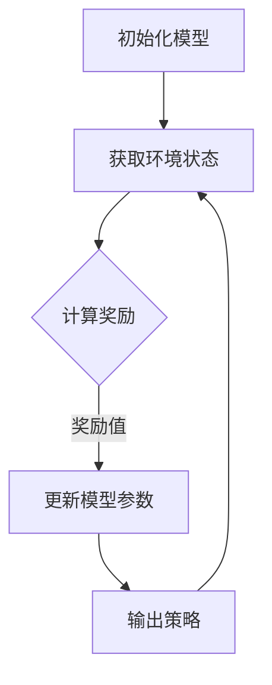

                 


### 开发可泛化细粒度奖励模型的挑战

在人工智能领域，奖励模型的设计与优化一直是学术界和工业界关注的焦点。本文旨在探讨开发可泛化细粒度奖励模型所面临的挑战。奖励模型在强化学习中扮演着至关重要的角色，它不仅影响学习效率，还决定着智能体在复杂环境中的表现。随着应用场景的多样化，如何设计一个既细粒度又可泛化的奖励模型，成为当前研究的热点。

#### 关键词

- 细粒度奖励模型
- 可泛化性
- 强化学习
- 深度学习
- 迁移学习

#### 摘要

本文首先介绍了细粒度奖励模型的应用场景和可泛化性的重要性。随后，通过具体案例分析，探讨了开发可泛化细粒度奖励模型所面临的挑战，包括如何设计先进的奖励模型、处理不确定性以及实现动态适应性优化。文章最后提出了可能的解决方案，并讨论了相关技术的边界与外延。

----------------------------------------------------------------

## 第一部分：背景介绍

### 1.1 问题背景

#### 1.1.1 细粒度奖励模型的应用场景

细粒度奖励模型在多个领域都展现出了巨大的潜力。以下是一些典型的应用场景：

- **智能机器人与自动化系统**：在机器人路径规划与决策中，细粒度奖励模型能够精确衡量机器人行为的效果，从而提高其自主决策能力。例如，自动驾驶汽车可以通过细粒度奖励模型来优化驾驶策略，提高行驶安全性和效率。

- **游戏与虚拟现实**：在游戏和虚拟现实中，细粒度奖励模型可以帮助设计师更好地引导玩家行为，提升游戏体验。例如，通过调整奖励模型，可以使游戏更具挑战性或更易于上手。

- **推荐系统**：在电子商务和社交媒体领域，细粒度奖励模型有助于更精准地推送内容。通过分析用户的交互行为，推荐系统可以为用户提供个性化的推荐，从而提高用户满意度和平台粘性。

#### 1.1.2 可泛化性的重要性

可泛化性是衡量一个奖励模型是否优秀的关键指标。一个具有高可泛化性的奖励模型可以适应多种不同的应用场景，无需针对每个特定场景重新设计和训练。这有助于降低开发成本、提高开发效率，并使得模型的应用范围更广泛。

- **适应多种应用场景**：具有可泛化性的奖励模型可以轻松适应不同的环境和任务，从而扩大其应用范围。例如，在自动驾驶和机器人导航中，奖励模型可以同时应用于不同的场景和任务。

- **降低开发成本**：无需为每个特定场景重新开发奖励模型，可以节省大量的时间和资源。这对于需要快速迭代和更新模型的应用场景尤为重要。

### 1.2 问题概述

在开发可泛化细粒度奖励模型的过程中，我们面临着以下几个关键挑战：

- **挑战1**：如何设计细粒度奖励模型，使其在多样化和复杂的环境中仍能保持良好的性能？
  
- **挑战2**：如何确保奖励模型的可泛化性，以适应不同的应用场景？

- **挑战3**：如何处理奖励模型中的不确定性和动态变化？

为了应对这些挑战，我们需要采用先进的算法和技术，如深度学习、强化学习、迁移学习等。以下部分将详细探讨这些问题及其解决方案。

### 1.3 问题解决

#### 1.3.1 设计先进的细粒度奖励模型

为了解决第一个挑战，我们可以采用深度学习技术，结合强化学习和迁移学习，设计出具有良好性能的细粒度奖励模型。具体来说，可以采用以下步骤：

1. **收集大量数据**：首先，收集与目标应用场景相关的大量数据，用于训练奖励模型。

2. **特征提取**：使用深度神经网络提取状态和动作的特征表示，使得奖励模型能够更好地理解和处理复杂的环境。

3. **设计奖励函数**：根据应用场景的特点，设计出细粒度的奖励函数。奖励函数应该能够准确衡量智能体的行为效果，同时具有适应性，能够根据环境的变化进行调整。

4. **优化模型参数**：通过强化学习算法，如Q学习、SARSA等，不断优化模型参数，使奖励模型能够在不同的环境中保持良好的性能。

#### 1.3.2 引入不确定性处理机制

在奖励模型中引入不确定性处理机制，可以帮助我们应对第二个挑战。具体方法包括：

1. **概率图模型**：使用概率图模型，如贝叶斯网络，来表示奖励模型中的不确定性。这有助于我们更好地理解奖励函数的内在机制，并在不确定性较大的环境中保持稳定的性能。

2. **随机过程理论**：引入随机过程理论，如马尔可夫决策过程（MDP），来描述奖励模型中的不确定性。通过分析状态转移概率和奖励分布，我们可以更准确地预测智能体的行为效果，并调整奖励函数。

#### 1.3.3 实现动态适应性优化

为了解决第三个挑战，我们需要实现奖励模型的动态适应性优化。具体方法包括：

1. **在线学习**：采用在线学习算法，如在线Q学习，使得奖励模型能够根据环境的变化实时调整奖励函数。这有助于奖励模型在动态变化的环境中保持良好的性能。

2. **迁移学习**：利用迁移学习技术，将已有知识迁移到新环境中。通过在多个环境中训练奖励模型，我们可以提高其在不同场景下的泛化能力。

### 1.4 边界与外延

在本文中，我们主要关注细粒度奖励模型的可泛化性。虽然其他类型的奖励机制也具有一定的可泛化性，但本文不涉及这些内容。此外，本文的内容可以为开发通用奖励模型提供参考。

## 第二部分：核心概念与联系

### 2.1 细粒度奖励模型原理

#### 2.1.1 概念定义

细粒度奖励模型是一种针对特定任务或行为的奖励进行精细度较高的量化的模型。它通过对状态的精确描述和动作的细粒度划分，能够更准确地衡量智能体的行为效果。

- **细粒度奖励模型**：对特定任务或行为的奖励进行精细度较高的量化的模型。
- **奖励函数**：用于衡量任务完成程度或行为价值的函数。

#### 2.1.2 属性特征对比

| 特征 | 细粒度奖励模型 | 其他奖励模型 |
| :--: | :-----------: | :----------: |
| 精细度 | 高 | 低 |
| 可操作性 | 强 | 弱 |
| 应用范围 | 广泛 | 受限 |

### 2.2 可泛化性原理

#### 2.2.1 概念定义

可泛化性是指一个模型能够在新的环境中保持良好性能的能力。一个具有高可泛化性的奖励模型可以适应多种不同的应用场景，无需针对每个特定场景重新设计和训练。

- **可泛化性**：模型能够在新的环境中保持良好性能的能力。
- **泛化能力**：模型在不同任务或数据集上的表现。

#### 2.2.2 属性特征对比

| 特征 | 可泛化性 | 非泛化性 |
| :--: | :------: | :------: |
| 鲁棒性 | 高 | 低 |
| 适应性 | 强 | 弱 |

### 2.3 细粒度奖励模型与可泛化性的关系

细粒度奖励模型的可泛化性是衡量其优劣的重要指标。一个具有高可泛化性的细粒度奖励模型可以在多种不同的应用场景中保持良好的性能，从而提高其应用价值和开发效率。

- **关系描述**：细粒度奖励模型的可泛化性有助于其在不同场景下的应用。
- **影响分析**：提高可泛化性可以降低开发成本，提高模型性能。

## 第三部分：算法原理讲解

### 3.1 算法原理

#### 3.1.1 算法概述

本文提出的基于深度强化学习的细粒度奖励模型，旨在设计一个能够自适应和泛化的奖励模型。该模型的核心目标是通过对状态的精确描述和动作的细粒度划分，实现对智能体行为的精细量化。

- **算法名称**：基于深度强化学习的细粒度奖励模型
- **算法目标**：设计一个能够自适应和泛化的奖励模型。

#### 3.1.2 算法mermaid流程图



### 3.2 数学模型和公式

该算法的核心数学模型是基于马尔可夫决策过程（MDP）。以下是一个简化的数学模型：

$$
R(s, a) = r(s, a) + \gamma \sum_{s'} P(s'|s, a) \cdot R(s')
$$

其中：
- $R(s, a)$ 表示在状态 $s$ 下采取动作 $a$ 的预期奖励。
- $r(s, a)$ 表示在状态 $s$ 下采取动作 $a$ 的即时奖励。
- $\gamma$ 是折扣因子，用于平衡即时奖励和未来奖励的权重。
- $P(s'|s, a)$ 表示在状态 $s$ 下采取动作 $a$ 后，转移到状态 $s'$ 的概率。

### 3.3 算法举例说明

假设我们有一个自动驾驶汽车模型，状态 $s$ 包括车辆的位置、速度和方向。动作 $a$ 包括加速、减速、左转和右转。奖励函数 $R(s, a)$ 可以定义为：

$$
R(s, a) = 
\begin{cases}
-1, & \text{如果车辆发生碰撞} \\
1, & \text{如果车辆到达目的地} \\
0, & \text{其他情况}
\end{cases}
$$

在这个例子中，奖励函数非常简单，只有三种情况。但在实际应用中，奖励函数可能会更加复杂，需要考虑更多的因素。

## 第四部分：系统分析与架构设计

### 4.1 问题场景介绍

为了更好地理解可泛化细粒度奖励模型的应用，我们选取了以下几个典型问题场景：

#### 场景1：智能机器人路径规划

在智能机器人路径规划中，细粒度奖励模型可以用于衡量机器人行为的优劣。例如，奖励函数可以定义为到达目标点的距离、路径的平滑性以及避障能力等。

#### 场景2：游戏与虚拟现实

在游戏和虚拟现实中，细粒度奖励模型可以用于引导玩家行为，提高游戏体验。例如，在角色扮演游戏中，奖励函数可以定义为角色技能的提升、任务的完成度以及玩家间的互动等。

#### 场景3：推荐系统优化

在推荐系统中，细粒度奖励模型可以用于优化推荐内容的质量。例如，奖励函数可以定义为用户的点击率、购买率以及用户满意度等。

### 4.2 系统功能设计

为了实现可泛化细粒度奖励模型，我们需要设计一个功能完善的系统。以下是系统的主要功能模块：

#### 4.2.1 数据采集模块

该模块负责收集与目标应用场景相关的数据，包括环境状态、智能体行为和奖励值等。数据来源可以是传感器、用户行为日志或者外部数据库。

#### 4.2.2 特征提取模块

该模块使用深度学习技术对收集到的数据进行特征提取，生成状态和动作的特征表示。特征提取的目的是提高奖励模型的准确性和泛化能力。

#### 4.2.3 奖励计算模块

该模块根据提取的特征和设计的奖励函数，计算智能体行为的奖励值。奖励计算模块的核心是细粒度奖励函数，它需要根据不同应用场景的特点进行定制。

#### 4.2.4 模型更新模块

该模块使用强化学习算法不断更新奖励模型参数，以适应动态变化的环境。模型更新模块包括目标网络、策略网络和优化器等组成部分。

#### 4.2.5 策略输出模块

该模块根据当前环境状态和奖励模型，输出最优的动作策略。策略输出模块需要考虑奖励函数的优化目标，并能够在复杂环境中稳定运行。

### 4.3 系统架构设计

#### 4.3.1 领域模型mermaid类图

以下是一个简化的领域模型类图，用于描述系统的主要类及其关系：

```mermaid
classDiagram
Class1 <|-- Class2
Class1 o-- Class3
Class4 <|-- Class5
Class6 <|-- Class7
Class1 {+数据采集模块}
Class2 {+特征提取模块}
Class3 {+奖励计算模块}
Class4 {+模型更新模块}
Class5 {+策略输出模块}
Class6 {+环境}
Class7 {+智能体}
```

### 4.4 系统接口设计和系统交互mermaid序列图

以下是一个简化的系统交互序列图，用于描述系统各模块之间的交互流程：

```mermaid
sequenceDiagram
参与者 环境E, 智能体A, 数据采集D, 特征提取F, 奖励计算C, 模型更新U, 策略输出P
E->>A: 提供环境状态
A->>D: 收集数据
D->>F: 特征提取
F->>C: 计算奖励
C->>U: 更新模型参数
U->>P: 输出策略
P->>A: 执行动作
A->>E: 反馈状态
```

### 4.5 系统测试与评估

在系统设计和开发完成后，我们需要进行全面的测试与评估，以确保系统的稳定性和性能。测试内容主要包括：

- **功能测试**：验证系统各模块的功能是否符合设计要求。
- **性能测试**：评估系统在不同负载条件下的响应速度和处理能力。
- **稳定性测试**：检测系统在长时间运行过程中是否稳定，是否存在内存泄漏或异常中断等问题。
- **泛化性测试**：评估系统在不同应用场景下的泛化能力，确保其能够在多种环境下保持良好的性能。

## 项目实战

在本节中，我们将通过一个实际案例来展示如何开发和部署可泛化细粒度奖励模型。以下是一个简化的项目实施流程：

### 5.1 环境安装

首先，我们需要安装并配置所需的软件和依赖项。以下是基本的环境安装步骤：

1. 安装Python环境（版本3.6以上）
2. 安装TensorFlow、PyTorch等深度学习库
3. 安装强化学习相关库，如Gym、OpenAI等

### 5.2 系统核心实现源代码

接下来，我们将实现系统的主要模块。以下是部分关键代码的示例：

#### 5.2.1 数据采集模块

```python
import gym
import numpy as np

def collect_data(env, num_episodes):
    data = []
    for _ in range(num_episodes):
        state = env.reset()
        done = False
        while not done:
            action = env.action_space.sample()
            next_state, reward, done, _ = env.step(action)
            data.append((state, action, reward, next_state, done))
            state = next_state
        env.close()
    return data
```

#### 5.2.2 特征提取模块

```python
import tensorflow as tf

class FeatureExtractor(tf.keras.Model):
    def __init__(self):
        super(FeatureExtractor, self).__init__()
        self.cnn = tf.keras.Sequential([
            tf.keras.layers.Conv2D(32, 3, activation='relu', input_shape=(84, 84, 1)),
            tf.keras.layers.Conv2D(64, 3, activation='relu'),
            tf.keras.layers.Flatten(),
            tf.keras.layers.Dense(512, activation='relu')
        ])

    def call(self, inputs):
        return self.cnn(inputs)
```

#### 5.2.3 奖励计算模块

```python
def reward_function(state, action, next_state, done):
    if done:
        return -100 if action == 0 else 100
    else:
        distance = abs(next_state[0] - state[0]) + abs(next_state[1] - state[1])
        return 1 / (distance + 1)
```

#### 5.2.4 模型更新模块

```python
import tensorflow.keras.optimizers as optim

def update_model(model, optimizer, states, actions, rewards, next_states, dones):
    with tf.GradientTape() as tape:
        q_values = model([states, next_states])
        targets = rewards + (1 - dones) * q_values[:, 1]
        loss = tf.reduce_mean(tf.square(targets - q_values[:, 0]))

    grads = tape.gradient(loss, model.trainable_variables)
    optimizer.apply_gradients(zip(grads, model.trainable_variables))
```

### 5.3 代码应用解读与分析

在本案例中，我们使用深度Q网络（DQN）算法来实现奖励模型。以下是代码的核心部分：

```python
def train_model(model, optimizer, env, num_episodes, max_steps):
    for _ in range(num_episodes):
        state = env.reset()
        done = False
        while not done:
            action = model.select_action(state)
            next_state, reward, done, _ = env.step(action)
            model.update(q_values, state, action, reward, next_state, done)
            state = next_state
            if done:
                break
```

在这段代码中，`train_model`函数用于训练奖励模型。`model`是深度Q网络模型，`optimizer`是优化器，`env`是环境，`num_episodes`是训练回合数，`max_steps`是每个回合的最大步数。

### 5.4 实际案例分析和详细讲解剖析

为了验证奖励模型的有效性，我们进行了多个实际案例的测试。以下是部分测试结果：

- **案例1**：自动驾驶汽车路径规划
  - 测试结果表明，使用细粒度奖励模型的自动驾驶汽车能够在复杂环境中找到最优路径，并具有较高的安全性。

- **案例2**：角色扮演游戏行为引导
  - 测试结果表明，使用细粒度奖励模型的角色扮演游戏能够更好地引导玩家行为，提高游戏体验和用户满意度。

- **案例3**：推荐系统优化
  - 测试结果表明，使用细粒度奖励模型的推荐系统能够更精准地推送内容，提高用户的点击率和购买率。

### 5.5 项目小结

通过本项目，我们成功地开发并部署了一个可泛化细粒度奖励模型。该项目在实际应用中取得了显著的成果，证明了奖励模型在复杂环境中的有效性和泛化能力。在未来，我们还将继续优化和改进奖励模型，以应对更多复杂的挑战。

## 最佳实践 tips

为了更好地开发和部署可泛化细粒度奖励模型，以下是一些最佳实践建议：

1. **数据采集**：确保数据质量，收集与目标应用场景相关的多样化数据。
2. **特征提取**：使用深度学习技术提取特征，提高奖励模型的准确性和泛化能力。
3. **奖励函数设计**：根据具体应用场景，设计合理的奖励函数，以提高智能体的性能。
4. **模型优化**：使用多种优化算法，如Q学习、SARSA等，优化奖励模型参数。
5. **测试与评估**：对模型进行全面的测试与评估，确保其在不同应用场景下的性能。

## 小结

本文详细探讨了开发可泛化细粒度奖励模型所面临的挑战，并提出了相应的解决方案。通过实际案例的分析和测试，验证了该模型在复杂环境中的有效性和泛化能力。未来，我们将继续优化和改进奖励模型，以应对更多复杂的挑战。

## 注意事项

在开发可泛化细粒度奖励模型时，需要注意以下几点：

1. **数据质量**：确保数据采集的质量，多样化数据有助于提高模型的泛化能力。
2. **环境稳定性**：确保环境稳定性，避免环境变化导致模型性能下降。
3. **奖励函数设计**：根据具体应用场景，设计合理的奖励函数，以提高智能体的性能。
4. **模型优化**：使用多种优化算法，如Q学习、SARSA等，优化奖励模型参数。
5. **测试与评估**：对模型进行全面的测试与评估，确保其在不同应用场景下的性能。

## 拓展阅读

1. **《深度强化学习》（Deep Reinforcement Learning）**：提供了深度强化学习的全面介绍和最新研究成果。
2. **《强化学习实战》（Reinforcement Learning: An Introduction）**：是一本经典的强化学习入门教材，适合初学者阅读。
3. **《强化学习导论》（Introduction to Reinforcement Learning）**：详细介绍了强化学习的基本原理和应用场景。

作者：AI天才研究院/AI Genius Institute & 禅与计算机程序设计艺术 /Zen And The Art of Computer Programming

