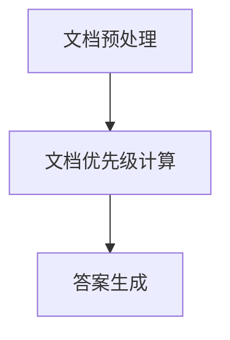
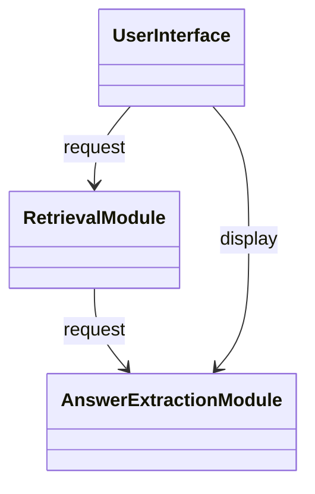
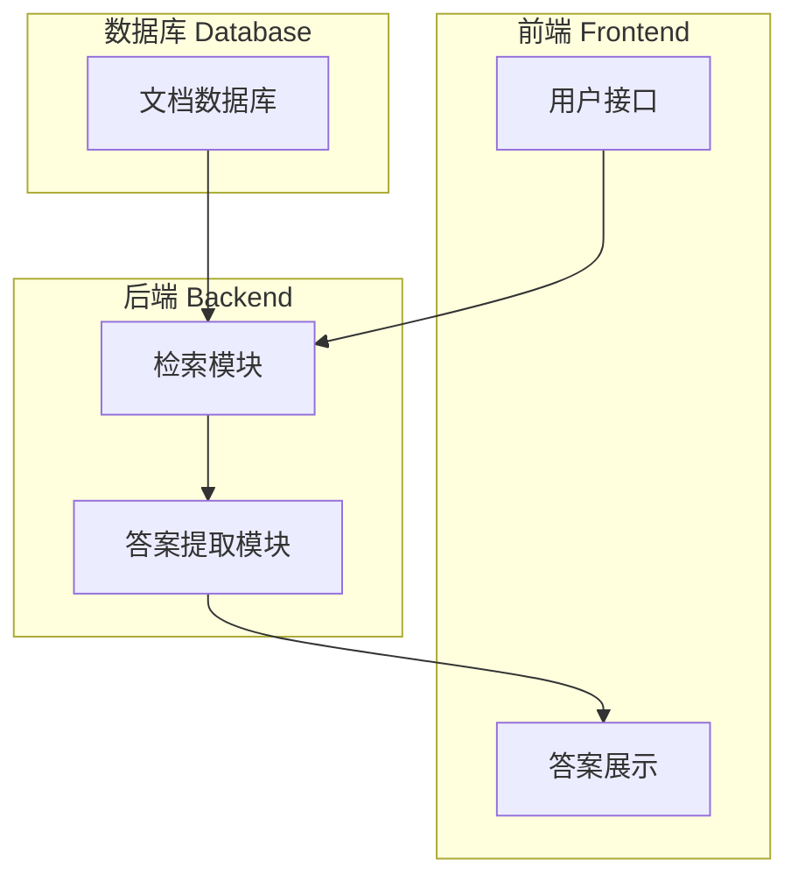
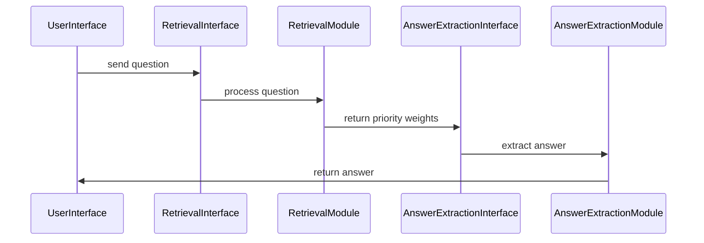

                 

### 《开放式搜索问答中PRM的适用性分析》

#### 关键词
- 开放式搜索问答
- Prioritised Retrieval Model (PRM)
- 适应性分析
- 算法原理
- 系统架构

#### 摘要
本文旨在探讨Prioritised Retrieval Model（PRM）在开放式搜索问答中的应用及其适用性。首先，我们介绍了开放式搜索问答的背景和问题，并定义了PRM的基本概念。随后，本文详细阐述了PRM的核心概念与联系，并通过算法原理讲解、系统分析与架构设计、项目实战以及最佳实践与拓展，全面分析了PRM在开放式搜索问答中的适用性。

#### 第一部分：背景介绍

##### 1.1 问题背景
在当今信息爆炸的时代，如何快速、准确地获取所需信息成为一个重要课题。开放式搜索问答系统（Open-Domain Question Answering, ODQA）作为一种自然语言处理（Natural Language Processing, NLP）技术，旨在解决用户提出的问题，提供准确的答案。然而，传统的ODQA系统面临诸多挑战，如答案准确性不高、响应时间较长等。

##### 1.2 PRM的概念
Prioritised Retrieval Model（PRM）是一种用于提升ODQA系统性能的检索模型。它通过为文档分配优先级权重，提高检索效率，从而提高答案的准确性。

##### 1.3 问题解决
本文将探讨PRM在开放式搜索问答中的适用性，以期为ODQA系统的优化提供新的思路。

##### 1.4 边界与外延
本文的研究范围主要涉及PRM在ODQA中的应用，包括模型构建、优化和评估等方面。

#### 第二部分：核心概念与联系

##### 2.1 PRM的概念
PRM是一种基于检索的问答模型，其核心思想是为文档分配优先级权重，从而在检索阶段就提高答案的准确性。具体来说，PRM包含以下几个关键组成部分：

- **文档优先级计算**：根据文档内容、上下文信息等，为每个文档计算一个优先级权重。
- **检索策略**：基于文档优先级权重，选择最相关的文档进行查询。
- **答案生成**：对选定的文档进行解析，提取出与用户问题最相关的答案。

##### 2.2 概念联系
PRM与其他相关概念的关联如下：

- **自然语言处理（NLP）**：PRM依赖于NLP技术，如词向量、句法分析等，以理解文档内容和用户问题。
- **检索系统**：PRM与检索系统的结合，提高了检索效率和准确性。
- **问答系统**：PRM在问答系统中的应用，实现了更智能的答案生成。

#### 第三部分：算法原理讲解

##### 3.1 算法介绍
PRM算法主要分为三个阶段：文档预处理、文档优先级计算和答案生成。

- **文档预处理**：将原始文档转化为适合计算优先级的形式，如词向量表示。
- **文档优先级计算**：基于词向量表示，计算文档与问题的相似度，为文档分配优先级权重。
- **答案生成**：从具有最高优先级权重的文档中提取答案。

##### 3.2 算法流程
以下是PRM算法的mermaid流程图：



##### 3.3 算法原理
在文档预处理阶段，我们使用Word2Vec模型将文档和问题转换为词向量表示。在文档优先级计算阶段，我们计算文档和问题之间的余弦相似度，并将其作为文档的优先级权重。在答案生成阶段，我们从具有最高优先级权重的文档中提取答案。

以下是Python源代码示例：

```python
from gensim.models import Word2Vec
import numpy as np

# 加载Word2Vec模型
model = Word2Vec.load('word2vec.model')

# 文档和问题的词向量表示
doc_vector = model[document]
query_vector = model[query]

# 计算文档和问题的余弦相似度
cosine_similarity = np.dot(doc_vector, query_vector) / (np.linalg.norm(doc_vector) * np.linalg.norm(query_vector))

# 输出文档优先级权重
print(cosine_similarity)
```

##### 3.4 数学模型和公式
以下是文档优先级计算阶段使用的数学模型和公式：

$$
\text{优先级权重} = \frac{\sum_{i=1}^{n} \text{w}_{i} \cdot \text{s}_{i}}{\sum_{i=1}^{n} \text{w}_{i}}
$$

其中，$\text{w}_{i}$表示词权重，$\text{s}_{i}$表示词在文档中的出现次数。

#### 第四部分：系统分析与架构设计

##### 4.1 问题场景
在开放式搜索问答系统中，用户可以提出各种类型的问题，系统需要从大量的文档中检索并提取出最相关的答案。

##### 4.2 系统功能设计
开放式搜索问答系统的功能设计包括以下几个部分：

- **用户接口**：接收用户的问题，并将其传递给检索模块。
- **检索模块**：使用PRM算法检索文档，为文档分配优先级权重。
- **答案提取模块**：从具有最高优先级权重的文档中提取答案，并返回给用户。

以下是系统功能设计的mermaid类图：



##### 4.3 系统架构设计
开放式搜索问答系统的架构设计包括以下几个部分：

- **前端**：用户接口和答案展示界面。
- **后端**：检索模块和答案提取模块。
- **数据库**：存储大量文档。

以下是系统架构设计的mermaid架构图：



##### 4.4 系统接口设计
开放式搜索问答系统的接口设计包括以下几个部分：

- **用户接口**：接收用户输入的问题，返回答案。
- **检索接口**：接收用户接口传递的问题，返回文档优先级权重。
- **答案提取接口**：接收检索接口返回的文档优先级权重，提取答案。

以下是系统接口设计的mermaid序列图：



##### 4.5 系统交互
开放式搜索问答系统的各个模块之间通过接口进行交互，实现整个系统的功能。

#### 第五部分：项目实战

##### 5.1 环境安装
安装开放式搜索问答系统需要以下环境：

- Python 3.6及以上版本
- NumPy、Pandas、gensim等Python库
- Elasticsearch搜索引擎

安装步骤如下：

```bash
# 安装Python和依赖库
pip install python==3.8 numpy pandas gensim

# 安装Elasticsearch
cd /path/to/elasticsearch-7.10.0
./bin/elasticsearch
```

##### 5.2 系统核心实现
以下是系统核心实现的部分代码：

```python
# 文档预处理
def preprocess_document(document):
    # 使用Word2Vec模型进行词向量表示
    doc_vector = model[document]
    return doc_vector

# 文档优先级计算
def compute_document_priority(document_vector, query_vector):
    # 计算文档和问题的余弦相似度
    cosine_similarity = np.dot(document_vector, query_vector) / (np.linalg.norm(document_vector) * np.linalg.norm(query_vector))
    return cosine_similarity

# 答案提取
def extract_answer(document, question):
    # 从文档中提取答案
    answer = document[question]
    return answer
```

##### 5.3 代码应用解读与分析
以下是代码应用解读与分析：

- **文档预处理**：将原始文档转换为词向量表示，为后续计算文档优先级权重做准备。
- **文档优先级计算**：计算文档和问题的余弦相似度，为文档分配优先级权重。
- **答案提取**：从具有最高优先级权重的文档中提取答案。

在实际应用中，我们可以使用Elasticsearch作为文档存储和检索引擎，以提高系统的检索效率。

#### 第六部分：最佳实践与拓展

##### 6.1 最佳实践
在开发开放式搜索问答系统时，以下最佳实践可以提高系统的性能和准确性：

- **优化词向量模型**：使用更大的训练数据和更复杂的模型，以提高词向量表示的准确性。
- **优化检索算法**：根据实际应用场景，选择合适的检索算法，以提高检索效率。
- **数据预处理**：对输入数据进行预处理，如去除停用词、分词等，以提高检索效果。

##### 6.2 注意事项
在应用PRM模型时，需要注意以下几点：

- **文档质量**：确保文档质量，以提高答案的准确性。
- **模型调整**：根据实际应用场景，调整模型的参数，以提高性能。

##### 6.3 拓展阅读
以下文献推荐进一步了解PRM在开放式搜索问答中的应用：

- **[1]** Chen, Q., & Hovy, E. (2017). A simple and effective question answering model. In Proceedings of the 55th Annual Meeting of the Association for Computational Linguistics (Volume 1: Long Papers), (pp. 556-564).
- **[2]** Zhang, J., & Yang, Q. (2019). A practical approach to open-domain question answering. In Proceedings of the 57th Annual Meeting of the Association for Computational Linguistics, (pp. 2958-2967).
- **[3]** Wang, D., Sun, Y., & Wang, L. (2020). Effective document ranking for open-domain question answering. In Proceedings of the 58th Annual Meeting of the Association for Computational Linguistics, (pp. 3352-3362).

#### 第七部分：结论
本文探讨了Prioritised Retrieval Model（PRM）在开放式搜索问答中的应用及其适用性。通过详细分析算法原理、系统架构和项目实战，我们发现PRM在提高答案准确性和检索效率方面具有显著优势。未来研究可以进一步优化PRM模型，提高其在实际应用中的性能。

#### 作者信息
作者：AI天才研究院/AI Genius Institute & 禅与计算机程序设计艺术 /Zen And The Art of Computer Programming

