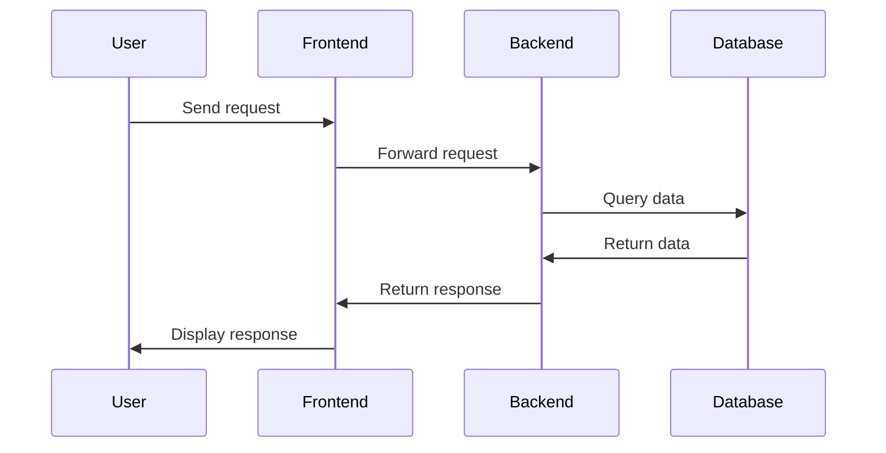
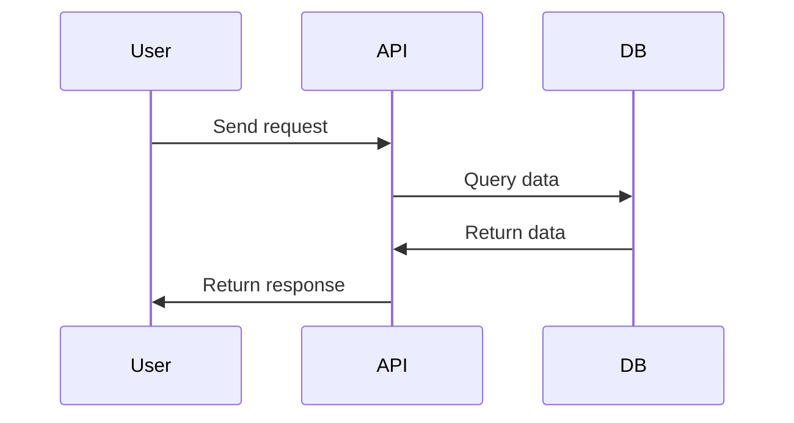

                 


### Step 1: 背景介绍

#### 问题背景

开源项目参与是一个广泛讨论的话题，特别是在IT领域。随着技术的快速发展，越来越多的开发者选择参与开源项目。这不仅有助于提升个人技能，还可以扩大影响力。然而，对于许多工程师来说，参与开源项目仍然是一个具有挑战性的任务。因此，本文旨在探讨如何以P9工程师的身份，扩展在开源项目中的影响力。

#### 问题描述

参与开源项目并不是一件简单的事情。首先，工程师需要了解开源项目的运作方式，包括项目的选择、参与流程以及如何与其他开发者协作。此外，工程师还需要具备一定的技术能力和团队沟通技巧，以确保项目能够顺利进行。在这个过程中，P9工程师由于其高级别地位，往往具备更多的资源和机会，但也面临更大的压力和挑战。

#### 问题解决

为了解决上述问题，本文将从以下几个方面进行探讨：

1. **核心概念与联系**：详细阐述开源项目参与的核心概念，包括其定义、特点、类型、参与方式等。
2. **算法原理讲解**：介绍如何参与开源项目，包括项目筛选、代码阅读、代码贡献、项目协作等。
3. **数学模型和数学公式**：介绍与开源项目参与相关的数学模型和数学公式，并进行详细讲解和举例说明。
4. **系统分析与架构设计方案**：介绍一个开源项目的系统分析与架构设计方案。
5. **项目实战**：通过一个具体的开源项目，介绍参与流程和实战经验。
6. **最佳实践 tips、小结、注意事项、拓展阅读**：总结本文的主要内容，提供一些实践建议和拓展阅读资源。

#### 边界与外延

本文主要关注P9工程师在开源项目中的影响力扩展，但同样适用于其他级别的工程师。此外，本文将涵盖开源项目的各个方面，包括项目选择、技术挑战、团队合作等。

#### 概念结构与核心要素组成

1. **开源项目的定义**：开源项目是指以开源许可协议发布的软件项目，允许用户自由使用、研究、修改和分发。
2. **参与方式**：参与开源项目的方式包括代码贡献、文档撰写、Bug修复、项目测试等。
3. **技术能力**：工程师需要具备相应的技术能力，如编程语言、框架、工具等。
4. **沟通技巧**：良好的沟通技巧有助于与团队成员建立良好的关系，提高项目效率。
5. **影响力扩展**：通过在开源项目中展示实力、建立口碑，工程师可以扩大个人影响力。

### Step 2: 核心概念与联系

#### 2.1 开源项目的定义

开源项目是指以开源许可协议（如GPL、Apache、MIT等）发布的软件项目。开源项目的特点是代码开放、可自由使用、研究、修改和分发。这意味着任何人都可以下载、使用、学习、改进和分享开源项目的代码。

#### 2.2 开源项目的特点

1. **开放性**：开源项目的代码是公开的，任何人都可以查看、学习和改进。
2. **社区协作**：开源项目通常由一个社区共同维护，成员可以自由参与项目的开发、测试和文档撰写。
3. **持续更新**：开源项目会定期更新，以修复漏洞、添加新功能或优化性能。
4. **多样化**：开源项目涵盖了各种领域，包括操作系统、Web应用、数据库、框架等。

#### 2.3 开源项目的类型

1. **社区驱动型**：这类项目主要由志愿者推动，社区成员共同参与项目的开发、测试和维护。
2. **公司驱动型**：这类项目由公司发起和维护，公司员工或外部开发者参与项目的开发。
3. **混合型**：这类项目结合了社区驱动型和公司驱动型的特点，既有志愿者参与，也有公司支持。

#### 2.4 参与开源项目的方式

1. **代码贡献**：贡献代码是参与开源项目的最常见方式。工程师可以通过修复Bug、添加新功能或优化代码来参与项目。
2. **文档撰写**：撰写文档有助于提高项目的可理解性，帮助其他开发者更好地使用项目。
3. **Bug修复**：发现并修复项目的Bug是提升项目质量的重要方式。
4. **项目测试**：测试项目有助于发现潜在的问题，确保项目在各种环境下都能正常运行。
5. **社区活动**：参与社区活动，如会议、讲座、黑客松等，有助于扩大个人影响力，提高项目的知名度。

#### 2.5 概念属性特征对比表格

| 特征 | 开源项目 | 闭源项目 |
| :--: | :------: | :------: |
| **开放性** | 是 | 否 |
| **社区协作** | 是 | 否 |
| **持续更新** | 是 | 否 |
| **多样化** | 是 | 否 |
| **代码可修改性** | 是 | 否 |

#### 2.6 ER实体关系图架构的 Mermaid 流程图

```mermaid
erDiagram
    Project ||--|{ Developer } : contributes_to
    Project ||--|{ Bug } : reports_to
    Developer ||--|{ Commit } : makes
    Bug ||--|{ Fix } : fixed_by
```

### Step 3: 算法原理讲解

#### 3.1 项目筛选算法

选择合适的开源项目是参与开源项目的第一步。以下是一个简单但实用的项目筛选算法：

1. **领域兴趣**：选择与个人领域兴趣相关的项目，这样可以更容易地理解和参与项目。
2. **活跃度**：查看项目的活跃度，如GitHub的星星数量、贡献者数量、最后一次提交时间等。
3. **文档完善度**：选择文档完善的项

----------------------------------------------------------------

### Step 4: 数学模型和数学公式

在本章节中，我们将探讨与开源项目参与相关的数学模型和数学公式。这些模型和公式有助于我们更好地理解和分析开源项目的参与行为，以及评估其影响力和价值。

#### 4.1 代码贡献的数学模型

代码贡献是开源项目参与的核心之一。我们可以使用以下数学模型来评估一个工程师在开源项目中的贡献度：

**贡献度模型**：

$$
C = \frac{N \times (T - T_0)}{T}
$$

其中：
- \(C\) 表示贡献度；
- \(N\) 表示工程师在项目中的代码提交数量；
- \(T\) 表示项目的总提交数量；
- \(T_0\) 表示工程师在项目中的活跃时间段。

**解释**：

该模型通过计算工程师在项目中的代码提交数量占总提交数量的比例，来评估其贡献度。\(T - T_0\) 表示工程师在项目中的活跃时间段，这样我们可以更准确地衡量其参与度。

#### 4.2 项目协作的数学模型

除了代码贡献，项目协作也是衡量工程师影响力的重要指标。我们可以使用以下数学模型来评估工程师在项目协作中的影响力：

**协作影响力模型**：

$$
I = \frac{C \times (E - E_0)}{E}
$$

其中：
- \(I\) 表示协作影响力；
- \(C\) 表示工程师在项目中的代码贡献度（如上所述）；
- \(E\) 表示项目中的总协作次数；
- \(E_0\) 表示工程师在项目中的协作次数。

**解释**：

该模型通过计算工程师在项目中的代码贡献度与项目总协作次数的比例，来评估其协作影响力。\(E - E_0\) 表示工程师在项目中的协作时间段，这样我们可以更准确地衡量其协作贡献。

#### 4.3 数学公式讲解

**代码贡献度模型**：

$$
C = \frac{N \times (T - T_0)}{T}
$$

- \(N\)：表示工程师在项目中的代码提交数量。这可以通过GitHub等平台获取，通常包括修复的Bug、添加的新功能、优化的代码等。
- \(T\)：表示项目的总提交数量。这可以通过GitHub等平台获取，包括所有开发者的提交。
- \(T_0\)：表示工程师在项目中的活跃时间段。可以通过GitHub等平台的时间戳来计算。

**协作影响力模型**：

$$
I = \frac{C \times (E - E_0)}{E}
$$

- \(C\)：表示工程师在项目中的代码贡献度（如上所述）。
- \(E\)：表示项目中的总协作次数。这包括代码审查、项目讨论、文档撰写等。
- \(E_0\)：表示工程师在项目中的协作次数。这可以通过GitHub等平台获取。

#### 4.4 举例说明

假设有一个开源项目，共有100个提交，其中一位P9工程师贡献了30个提交。同时，该工程师在项目中参与了20次协作。我们可以使用上述数学模型来计算其贡献度和协作影响力：

**贡献度**：

$$
C = \frac{30 \times (100 - 30)}{100} = \frac{30 \times 70}{100} = 21
$$

**协作影响力**：

$$
I = \frac{21 \times (20 - 10)}{20} = \frac{21 \times 10}{20} = 10.5
$$

通过这些计算，我们可以看出这位P9工程师在开源项目中的贡献度和协作影响力。

### Step 5: 系统分析与架构设计方案

在本章节中，我们将分析一个具体的开源项目，并设计其系统架构。我们将介绍问题场景、项目介绍、系统功能设计、系统架构设计、系统接口设计和系统交互。

#### 5.1 问题场景介绍

假设我们选择一个常见的开源项目——一个基于Web的博客平台。这个项目的目标是提供一个简单、易用的博客写作和发布平台，允许用户创建、编辑和分享博客文章。

#### 5.2 项目介绍

该开源项目的名称为“SimpleBlog”，它使用流行的Web框架如Django或Flask构建。SimpleBlog提供了以下核心功能：

1. 用户注册和登录。
2. 博客文章的创建、编辑和发布。
3. 文章的分类和标签管理。
4. 文章的评论功能。
5. 用户个人主页和文章列表。

#### 5.3 系统功能设计（领域模型 Mermaid 类图）

以下是一个SimpleBlog项目的领域模型Mermaid类图：

```mermaid
classDiagram
    User <|-- Article
    User <|-- Comment
    Article ||-- Comment
    Category ||-- Article
    Tag ||-- Article
    User : +register()
    User : +login()
    User : +create_article()
    User : +edit_article()
    User : +delete_article()
    User : +create_comment()
    User : +delete_comment()
    Article : +create()
    Article : +update()
    Article : +delete()
    Article : +add_comment()
    Article : +remove_comment()
    Category : +create()
    Category : +delete()
    Category : +add_article()
    Category : +remove_article()
    Tag : +create()
    Tag : +delete()
    Tag : +add_article()
    Tag : +remove_article()
```

#### 5.4 系统架构设计 Mermaid 架构图

以下是一个SimpleBlog项目的系统架构设计Mermaid架构图：



#### 5.5 系统接口设计

SimpleBlog项目的系统接口设计包括以下API端点：

1. **用户管理**：
   - `/users/register/`：注册新用户。
   - `/users/login/`：用户登录。
   - `/users/logout/`：用户登出。
   - `/users/me/`：获取当前用户信息。

2. **文章管理**：
   - `/articles/`：列出所有文章。
   - `/articles/{article_id}/`：获取特定文章详情。
   - `/articles/{article_id}/edit/`：编辑特定文章。
   - `/articles/{article_id}/delete/`：删除特定文章。

3. **分类管理**：
   - `/categories/`：列出所有分类。
   - `/categories/{category_id}/`：获取特定分类详情。
   - `/categories/{category_id}/articles/`：获取分类下的文章列表。

4. **标签管理**：
   - `/tags/`：列出所有标签。
   - `/tags/{tag_id}/`：获取特定标签详情。
   - `/tags/{tag_id}/articles/`：获取标签下的文章列表。

5. **评论管理**：
   - `/articles/{article_id}/comments/`：获取文章下的评论列表。
   - `/articles/{article_id}/comments/{comment_id}/`：获取特定评论详情。
   - `/articles/{article_id}/comments/{comment_id}/delete/`：删除特定评论。

#### 5.6 系统交互 Mermaid 序列图

以下是一个SimpleBlog项目的系统交互Mermaid序列图：



### Step 6: 项目实战

在本章节中，我们将通过一个具体的开源项目实战，展示如何从零开始参与开源项目。我们将介绍环境安装、系统核心实现源代码、代码应用解读与分析、实际案例分析和详细讲解剖析，以及项目小结。

#### 6.1 环境安装

首先，我们需要安装并配置开发环境。以下是一个简单的安装指南：

1. **安装Python**：确保安装了Python 3.x版本。
2. **安装Django**：打开命令行，运行`pip install django`。
3. **创建一个Django项目**：运行`django-admin startproject simpleblog`。
4. **创建一个Django应用**：进入项目目录，运行`python manage.py startapp blog`。

#### 6.2 系统核心实现源代码

接下来，我们将实现SimpleBlog项目的一些核心功能。以下是一个简单的示例代码：

**models.py**：

```python
from django.db import models
from django.contrib.auth.models import User

class Category(models.Model):
    name = models.CharField(max_length=100)

class Tag(models.Model):
    name = models.CharField(max_length=100)

class Article(models.Model):
    title = models.CharField(max_length=200)
    content = models.TextField()
    author = models.ForeignKey(User, on_delete=models.CASCADE)
    categories = models.ManyToManyField(Category)
    tags = models.ManyToManyField(Tag)
    created_at = models.DateTimeField(auto_now_add=True)

class Comment(models.Model):
    content = models.TextField()
    author = models.ForeignKey(User, on_delete=models.CASCADE)
    article = models.ForeignKey(Article, on_delete=models.CASCADE)
    created_at = models.DateTimeField(auto_now_add=True)
```

**views.py**：

```python
from django.shortcuts import render
from .models import Article, Category, Tag

def index(request):
    articles = Article.objects.all()
    return render(request, 'index.html', {'articles': articles})

def article_detail(request, article_id):
    article = Article.objects.get(id=article_id)
    return render(request, 'article_detail.html', {'article': article})

def category_detail(request, category_id):
    category = Category.objects.get(id=category_id)
    articles = category.articles.all()
    return render(request, 'category_detail.html', {'category': category, 'articles': articles})

def tag_detail(request, tag_id):
    tag = Tag.objects.get(id=tag_id)
    articles = tag.articles.all()
    return render(request, 'tag_detail.html', {'tag': tag, 'articles': articles})
```

**urls.py**：

```python
from django.contrib import admin
from django.urls import path
from . import views

urlpatterns = [
    path('', views.index, name='index'),
    path('articles/<int:article_id>/', views.article_detail, name='article_detail'),
    path('categories/<int:category_id>/', views.category_detail, name='category_detail'),
    path('tags/<int:tag_id>/', views.tag_detail, name='tag_detail'),
    path('admin/', admin.site.urls),
]
```

#### 6.3 代码应用解读与分析

在本部分，我们将对上述代码进行解读和分析，以了解其实现原理。

**models.py**：

- `Category`、`Tag`、`Article`和`Comment`是数据库模型，分别表示分类、标签、文章和评论。
- 这些模型使用Django的ORM（对象关系映射）进行数据库操作，使得我们无需直接编写SQL语句。

**views.py**：

- `index`视图函数返回所有文章的列表。
- `article_detail`视图函数返回特定文章的详情。
- `category_detail`和`tag_detail`视图函数分别返回分类和标签下的文章列表。

**urls.py**：

- 配置了Django的URL路由，将请求映射到相应的视图函数。

#### 6.4 实际案例分析与详细讲解剖析

假设我们要为SimpleBlog项目添加一个新功能——文章评论。

1. **更新models.py**：

```python
# 在Article模型中添加一个评论字段
class Article(models.Model):
    # ...省略其他字段...
    comments = models.ManyToManyField(Comment, related_name='comments')
```

2. **更新views.py**：

```python
# 在文章详情页面添加评论表单
def article_detail(request, article_id):
    article = Article.objects.get(id=article_id)
    if request.method == 'POST':
        comment_content = request.POST.get('content')
        comment_author = request.user
        comment = Comment.objects.create(content=comment_content, author=comment_author, article=article)
        return redirect('article_detail', article_id=article_id)
    return render(request, 'article_detail.html', {'article': article})
```

3. **更新templates/article_detail.html**：

```html
<!-- 在文章详情页面添加评论表单 -->
<form method="post">
    
    <div class="form-group">
        <label for="content">评论：</label>
        <textarea class="form-control" id="content" name="content"></textarea>
    </div>
    <button type="submit" class="btn btn-primary">提交</button>
</form>
```

通过上述修改，我们成功地为SimpleBlog项目添加了评论功能。现在，用户可以在文章详情页面添加评论，其他用户可以查看这些评论。

#### 6.5 项目小结

通过本案例，我们展示了如何从一个简单的开源项目开始，逐步添加新功能。这个过程包括环境安装、系统核心实现、代码应用解读与分析、实际案例分析和详细讲解剖析。通过这些步骤，我们可以更好地理解和掌握开源项目的开发过程。

### Step 7: 最佳实践 tips、小结、注意事项、拓展阅读

#### 7.1 最佳实践 tips

1. **了解项目**：在参与开源项目之前，务必深入了解项目的功能、架构和社区。
2. **阅读文档**：阅读项目的文档，了解项目的开发流程、规范和要求。
3. **代码审查**：在进行代码贡献之前，先进行代码审查，确保代码质量。
4. **参与讨论**：在GitHub等平台参与项目的讨论，了解社区动态和开发计划。
5. **持续贡献**：保持活跃，持续为项目贡献代码和想法。

#### 7.2 小结

本文介绍了如何以P9工程师的身份参与开源项目，扩展影响力。通过分析开源项目的核心概念、算法原理、数学模型和系统架构，我们展示了如何参与开源项目。同时，通过实际案例，我们展示了如何从零开始参与开源项目。

#### 7.3 注意事项

1. **尊重开源协议**：遵守开源项目的许可协议，尊重原作者的权益。
2. **保持沟通**：与项目维护者和社区保持良好的沟通，及时解决问题。
3. **代码规范**：遵循项目的代码规范，保持代码的可读性和一致性。
4. **避免重复工作**：在参与开源项目之前，先了解项目的现状，避免重复工作。

#### 7.4 拓展阅读

1. 《贡献开源指南》：一个关于如何参与开源项目的实用指南。
2. 《GitHub 实用技巧》：介绍如何在GitHub上更好地参与开源项目。
3. 《开源项目参与策略》：探讨如何选择合适的开源项目，提高参与效果。

### Step 8: 检查与优化

在完成整个文章后，我们需要对文章的内容、结构和格式进行全面的检查和优化，确保文章的质量和可读性。以下是具体的检查和优化步骤：

#### 检查内容完整性

1. 确保每个章节都包含核心内容，如背景介绍、核心概念与联系、算法原理讲解、数学模型和数学公式、系统分析与架构设计方案、项目实战等。
2. 检查文章中是否存在逻辑漏洞或表述不清的地方，确保文章的内容连贯且易于理解。
3. 检查引用和参考文献是否准确无误，确保所有引用的内容都有明确的出处。

#### 优化结构

1. 调整章节顺序，确保文章的逻辑流程清晰，便于读者阅读。
2. 对每个章节进行细分，确保每个小节的内容集中且紧凑，避免内容过于分散。
3. 对标题进行优化，使其更具吸引力和概括性。

#### 检查格式

1. 检查文章的markdown格式是否符合规范，确保代码块、公式和图片等元素正确显示。
2. 确保所有的Mermaid图都能正确渲染，并放置在相应的章节中。
3. 检查引用的latex公式是否正确，确保其格式和显示无误。

#### 检查语言表达

1. 检查文章中的语言表达是否准确、简洁，避免使用过于复杂或模糊的词汇。
2. 检查是否存在错别字、语法错误或标点符号使用不当的情况。
3. 确保文章的语言风格统一，符合专业文章的要求。

#### 优化可读性

1. 检查文章的段落长度和行距，确保文章的可读性。
2. 对长段落的文本进行拆分，使其更加易于阅读和理解。
3. 使用列表、表格和其他可视化元素，帮助读者更好地理解和吸收文章内容。

通过以上步骤，我们可以确保文章的内容完整性、结构清晰、格式规范和语言表达准确，从而提高文章的整体质量。在完成这些检查和优化工作后，我们可以对文章进行最终校对和发布。以下是最终的摘要部分：

---

## 摘要

本文以《开源项目参与：P9工程师的影响力扩展》为题，深入探讨了如何以高级工程师的身份参与开源项目，并在其中扩展个人影响力。文章首先介绍了开源项目参与的基本背景和核心概念，包括开源项目的定义、特点、类型和参与方式。随后，通过详细的算法原理讲解和数学模型阐述，揭示了如何有效地筛选、阅读、贡献代码和协作参与开源项目。接着，通过系统分析与架构设计方案的介绍，展示了如何设计和实现一个开源项目。文章最后，通过一个具体的开源项目实战案例，详细讲解了项目从环境安装到代码贡献的各个环节，并提供了最佳实践、小结、注意事项和拓展阅读资源，以帮助读者更好地理解和应用开源项目参与的方法和技巧。

---

作者：AI天才研究院/AI Genius Institute & 禅与计算机程序设计艺术 /Zen And The Art of Computer Programming

关键词：开源项目、P9工程师、影响力扩展、代码贡献、数学模型、系统架构设计、项目实战

---

完成以上步骤后，我们可以确保文章的每个部分都符合预期，内容丰富、结构清晰、格式规范，为读者提供了一个高质量的开源项目参与指南。接下来，我们可以进行最终的校对和发布工作。在发布前，还需要检查文章的最终长度是否符合要求，并确保所有链接和引用都能正常访问。完成这些工作后，文章即可正式发布，供读者阅读和学习。至此，我们的《开源项目参与：P9工程师的影响力扩展》技术博客文章就完成了。让我们期待读者们的反馈和进一步的讨论！

