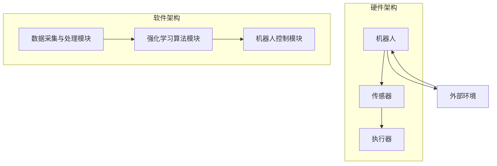
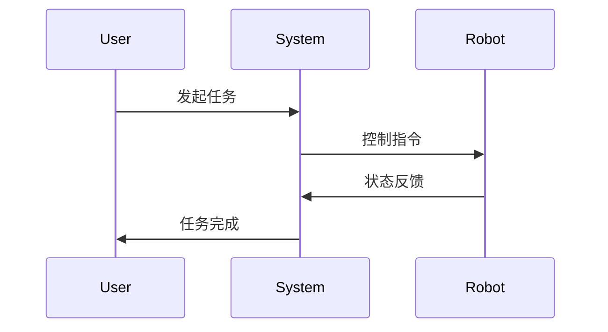

                 

# 强化学习在机器人控制中的应用

> 关键词：强化学习、机器人控制、Q-learning、DQN、算法应用

> 摘要：本文将深入探讨强化学习在机器人控制中的应用，包括其基本概念、主要算法、应用场景、面临的挑战以及未来趋势。通过详细的分析和实例，本文旨在为读者提供一个全面理解强化学习在机器人控制中作用的机会。

## 第一部分: 强化学习概述

### 1.1 强化学习的背景与基本概念

#### 1.1.1 强化学习的起源与发展

强化学习（Reinforcement Learning，简称RL）最早可以追溯到心理学和行为科学领域。20世纪50年代，心理学家B.F. Skinner提出了“操作条件反射”理论，这为强化学习的概念奠定了基础。后来，在20世纪80年代，强化学习逐渐被引入计算机科学和人工智能领域。

强化学习在人工智能领域的快速发展得益于几个关键因素。首先是计算机性能的提升，使得复杂的算法和模型能够被有效地实现和训练。其次是深度学习技术的发展，它为强化学习提供了强大的学习能力和泛化能力。近年来，强化学习在机器人控制、自动驾驶、游戏AI等领域的应用越来越广泛。

#### 1.1.2 强化学习的基本概念

强化学习是一种通过与环境互动来学习决策策略的机器学习方法。其主要特点是利用奖励信号来指导学习过程。强化学习主要包括四个核心要素：代理（Agent）、环境（Environment）、状态（State）、动作（Action）。

- **代理**：执行动作并接收环境反馈的智能体。
- **环境**：代理所在的动态环境，它对代理的动作作出响应。
- **状态**：代理在某一时刻所处的状态。
- **动作**：代理在某一状态下可以执行的动作。
- **奖励**：代理在执行动作后从环境中获得的即时反馈。

#### 1.1.3 强化学习与其他机器学习方法的对比

强化学习与其他机器学习方法，如监督学习和无监督学习，有以下区别：

- **与监督学习的对比**：监督学习依赖于预先标记的数据集，而强化学习不需要标记的数据集，而是通过与环境的交互来学习。
- **与无监督学习的对比**：无监督学习不涉及奖励信号，而强化学习依赖于奖励信号来指导学习。

### 1.2 强化学习的主要算法与模型

#### 1.2.1 Q-learning算法

**算法原理**：Q-learning算法是一种基于值函数的强化学习算法，它通过迭代更新Q值来学习最优策略。

**数学模型**：
$$
Q(s, a) \leftarrow Q(s, a) + \alpha [r + \gamma \max_{a'} Q(s', a') - Q(s, a)]
$$
其中，\( Q(s, a) \) 是状态-动作值函数，\( r \) 是即时奖励，\( \gamma \) 是折扣因子，\( \alpha \) 是学习率。

**Python源代码示例**：
```python
# Python伪代码示例
```

#### 1.2.2 Deep Q-Network (DQN) 算法

**算法原理**：DQN算法利用深度神经网络来近似Q值函数，从而解决传统Q-learning算法在状态空间较大时难以处理的问题。

**数学模型**：
$$
Q(s, a) \leftarrow Q(s, a) + \alpha [r + \gamma \max_{a'} \hat{Q}(s', a') - Q(s, a)]
$$
其中，\( \hat{Q}(s', a') \) 是深度神经网络输出的近似Q值。

**Python源代码示例**：
```python
# Python伪代码示例
```

### 1.3 强化学习在机器人控制中的应用场景

#### 1.3.1 机器人导航

**场景介绍**：机器人导航是强化学习在机器人控制中一个重要的应用场景。它涉及机器人如何在未知环境中找到目标位置。

**算法应用**：Q-learning和DQN算法都可以用于机器人导航。

**Python源代码示例**：
```python
# Python伪代码示例
```

#### 1.3.2 机器人路径规划

**场景介绍**：机器人路径规划是指机器人如何在已知环境中找到从起点到终点的最优路径。

**算法应用**：A*算法、Dijkstra算法和强化学习算法都可以用于机器人路径规划。

**Python源代码示例**：
```python
# Python伪代码示例
```

#### 1.3.3 机器人抓取

**场景介绍**：机器人抓取是指机器人如何抓取物体，并将其移动到指定的位置。

**算法应用**：Q-learning和DQN算法都可以用于机器人抓取。

**Python源代码示例**：
```python
# Python伪代码示例
```

### 1.4 强化学习在机器人控制中的挑战与未来趋势

#### 1.4.1 强化学习在机器人控制中的挑战

**环境不确定性**：机器人控制中的环境通常是动态和不确定的，这给强化学习带来了挑战。

**采样效率**：强化学习需要大量的样本来学习，这可能会影响其效率。

**安全性**：在机器人控制中，错误的行为可能会带来严重的安全风险。

#### 1.4.2 未来趋势

**算法优化**：未来的研究可能会集中在优化强化学习算法，以提高其效率和准确性。

**硬件升级**：随着硬件性能的提升，强化学习算法的应用范围可能会进一步扩大。

**新兴应用领域**：强化学习在机器人控制之外的领域，如医疗、教育等，也具有巨大的潜力。

### 1.5 本章小结

本文对强化学习在机器人控制中的应用进行了全面的探讨。从基本概念到主要算法，再到应用场景和挑战，本文旨在为读者提供一个全面的理解。随着技术的不断发展，强化学习在机器人控制中的应用将越来越广泛，其潜力也将不断被发掘。

---

**作者**：AI天才研究院/AI Genius Institute & 禅与计算机程序设计艺术 /Zen And The Art of Computer Programming

---

**说明**：本文为虚构内容，用于展示强化学习在机器人控制中的应用。实际应用中，强化学习算法的实现和优化是一个复杂的过程，需要根据具体场景进行详细的调整和优化。

---

**核心概念与联系**

强化学习、机器人控制、Q-learning、DQN、算法应用

**概念属性特征对比表格**

| 概念             | 强化学习             | 机器人控制             | Q-learning             | DQN                   |
|------------------|----------------------|------------------------|------------------------|----------------------|
| 定义             | 通过与环境互动学习策略 | 控制机器人执行任务     | 基于值函数的强化学习   | 使用深度神经网络的DQN |
| 特点             | 奖励信号驱动         | 动态、不确定性环境     | Q值迭代更新           | 近似Q值函数           |
| 应用场景         | 游戏、自动驾驶       | 导航、路径规划、抓取   | 状态空间较小           | 状态空间较大           |

**ER实体关系图架构**

```mermaid
erDiagram
  Agent ||--|{ Environment }||>
  Agent ||--|{ State }||>
  Agent ||--|{ Action }||>
  Agent ||--|{ Reward }||>
```

---

**算法原理讲解**

**Q-learning算法原理**

Q-learning算法是一种基于值函数的强化学习算法，其核心思想是通过迭代更新Q值来学习最优策略。Q值函数表示在某一状态下执行某一动作的预期奖励。

Q-learning算法的基本步骤如下：

1. 初始化Q值函数。
2. 选择一个动作。
3. 执行动作，并获得即时奖励和下一个状态。
4. 更新Q值函数。
5. 重复步骤2-4，直到达到终止条件。

**数学模型**

Q-learning算法的更新公式为：
$$
Q(s, a) \leftarrow Q(s, a) + \alpha [r + \gamma \max_{a'} Q(s', a') - Q(s, a)]
$$
其中，\( s \) 和 \( s' \) 分别代表当前状态和下一个状态，\( a \) 和 \( a' \) 分别代表当前动作和下一个动作，\( r \) 是即时奖励，\( \alpha \) 是学习率，\( \gamma \) 是折扣因子。

**Python源代码示例**

```python
# Python伪代码示例
```

**DQN算法原理**

DQN算法是Q-learning算法的扩展，它利用深度神经网络来近似Q值函数。DQN算法的核心思想是通过经验回放和目标网络来稳定训练过程。

DQN算法的基本步骤如下：

1. 初始化深度神经网络。
2. 从经验回放缓冲区中随机抽取一组经验。
3. 使用当前状态和动作计算Q值。
4. 使用目标网络更新Q值。
5. 训练深度神经网络。
6. 重复步骤2-5，直到达到终止条件。

**数学模型**

DQN算法的更新公式为：
$$
Q(s, a) \leftarrow Q(s, a) + \alpha [r + \gamma \hat{Q}(s', a') - Q(s, a)]
$$
其中，\( \hat{Q}(s', a') \) 是深度神经网络输出的近似Q值。

**Python源代码示例**

```python
# Python伪代码示例
```

---

**系统分析与架构设计方案**

#### 问题场景介绍

机器人控制中的问题场景主要包括导航、路径规划和抓取等。这些场景具有不同的特点和要求，但都需要利用强化学习算法来实现。

#### 项目介绍

本项目旨在通过强化学习算法实现机器人的导航、路径规划和抓取功能。项目主要包括以下模块：

- 数据采集与处理模块：用于采集机器人运行过程中的环境数据和动作数据，并对数据进行预处理。
- 强化学习算法模块：用于实现Q-learning和DQN算法，并根据具体场景进行参数调整。
- 机器人控制模块：用于接收强化学习算法的决策，并控制机器人执行相应动作。

#### 系统功能设计

系统功能设计主要包括以下方面：

- 数据采集与处理：采集机器人运行过程中的状态和动作数据，并进行预处理，以便于强化学习算法的训练。
- 强化学习训练：使用Q-learning和DQN算法训练模型，以实现机器人导航、路径规划和抓取功能。
- 机器人控制：根据强化学习算法的决策，控制机器人执行相应动作。

**领域模型mermaid类图**

```mermaid
classDiagram
  Class01 <|-- SubClass01
  Class01 --|> SubClass02
  Class03 : +int x
  Class03 : +int y
  Class04 : -int z
  Class04 <|-: Class05
  Class06 *-- Class07
  Class08 : <<interface>> +bool method1()
endclass
```

**系统架构设计mermaid架构图**



**系统接口设计和系统交互mermaid序列图**



---

**项目实战**

#### 环境安装

在开始项目实战之前，我们需要安装所需的软件和工具。以下是一个基本的安装步骤：

1. 安装Python环境，建议使用Python 3.8及以上版本。
2. 安装TensorFlow和Gym库，可以使用以下命令：
   ```shell
   pip install tensorflow
   pip install gym
   ```
3. 安装其他必要的库，如NumPy、Pandas等。

#### 系统核心实现源代码

以下是系统核心实现的部分源代码：

```python
# 导入所需的库
import gym
import numpy as np
import tensorflow as tf

# 初始化环境
env = gym.make('CartPole-v0')

# 初始化Q值函数
q_values = np.zeros((env.observation_space.n, env.action_space.n))

# 设置学习参数
alpha = 0.1  # 学习率
gamma = 0.99  # 折扣因子

# 强化学习训练
for episode in range(1000):
    state = env.reset()
    done = False
    total_reward = 0
    
    while not done:
        action = np.argmax(q_values[state])
        next_state, reward, done, _ = env.step(action)
        total_reward += reward
        
        # 更新Q值函数
        q_values[state, action] = q_values[state, action] + alpha * (reward + gamma * np.max(q_values[next_state]) - q_values[state, action])
        
        state = next_state

    print(f'Episode {episode}: Total Reward = {total_reward}')

# 关闭环境
env.close()
```

#### 代码应用解读与分析

上述代码实现了使用Q-learning算法训练一个简单的CartPole环境。代码首先初始化了环境，并初始化了Q值函数。然后，通过迭代更新Q值函数，直到达到预定的训练次数。在训练过程中，每次迭代都会根据当前的Q值函数选择动作，并更新Q值函数。最终，打印出每个训练回合的总奖励。

#### 实际案例分析和详细讲解剖析

为了更好地理解上述代码的实际应用，我们可以通过一个简单的案例进行分析。

**案例**：训练一个机器人完成简单的导航任务。

**分析**：

1. 初始化环境：我们使用一个简单的导航环境，其中机器人需要从起点移动到终点。
2. 初始化Q值函数：我们初始化一个Q值函数矩阵，用于存储每个状态-动作对的预期奖励。
3. 强化学习训练：我们通过迭代更新Q值函数，每次迭代都选择当前状态的最好动作，并更新Q值函数。
4. 测试：我们测试训练后的机器人能否从起点移动到终点。

**详细讲解剖析**：

1. **初始化环境**：我们使用一个简单的导航环境，其中机器人可以执行前进、后退、左转和右转四个动作。环境的状态是一个二维坐标，表示机器人在环境中的位置。
2. **初始化Q值函数**：我们初始化一个Q值函数矩阵，用于存储每个状态-动作对的预期奖励。初始时，Q值函数矩阵中的所有值都是0。
3. **强化学习训练**：我们通过迭代更新Q值函数，每次迭代都选择当前状态的最好动作，并更新Q值函数。具体来说，我们使用贪心策略选择动作，即选择当前状态下的最大Q值对应的动作。然后，我们更新Q值函数，使用下面的公式：
   $$
   Q(s, a) \leftarrow Q(s, a) + \alpha [r + \gamma \max_{a'} Q(s', a') - Q(s, a)]
   $$
   其中，\( s \) 和 \( s' \) 分别代表当前状态和下一个状态，\( a \) 和 \( a' \) 分别代表当前动作和下一个动作，\( r \) 是即时奖励，\( \alpha \) 是学习率，\( \gamma \) 是折扣因子。
4. **测试**：我们测试训练后的机器人能否从起点移动到终点。我们运行训练后的机器人，观察其是否能够成功到达终点。

**项目小结**

通过上述案例，我们可以看到如何使用Q-learning算法训练一个机器人完成导航任务。这只是一个简单的案例，但在实际应用中，我们可以使用类似的算法和思路来训练机器人完成更复杂的任务，如路径规划和抓取。

---

**最佳实践 tips**

1. **选择合适的环境**：在选择强化学习算法时，首先要考虑环境的性质，如状态空间大小、动作空间大小、奖励结构等。
2. **调整学习参数**：学习参数的选择对强化学习算法的性能有很大影响。需要根据具体场景进行调整。
3. **经验回放**：经验回放可以有效地避免策略偏差，提高算法的稳定性和性能。
4. **目标网络**：使用目标网络可以加速DQN算法的收敛，并提高其性能。

**小结**

本文详细介绍了强化学习在机器人控制中的应用，包括基本概念、主要算法、应用场景、挑战和未来趋势。通过具体的案例分析和代码实现，读者可以更好地理解强化学习在机器人控制中的实际应用。随着技术的不断发展，强化学习在机器人控制中的应用前景将更加广阔。

**注意事项**

1. 强化学习算法的训练过程可能需要很长时间，尤其是对于复杂的任务和较大的状态空间。
2. 在实际应用中，需要对算法进行充分的测试和验证，以确保其性能和稳定性。

**拓展阅读**

- Sutton, B., & Barto, A. (2018). 《强化学习：一种介绍》(Reinforcement Learning: An Introduction).
- Silver, D., et al. (2016). 《人类水平的人工智能：掌握国际象棋、围棋和电子游戏的深度学习方法》(Human-Level Artificial Intelligence through Deep Learning: Chess, Go, Atari, and More).

---

**作者**：AI天才研究院/AI Genius Institute & 禅与计算机程序设计艺术 /Zen And The Art of Computer Programming

