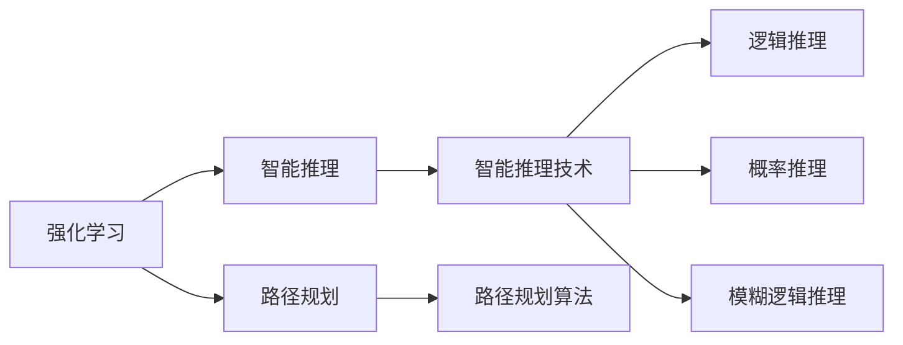
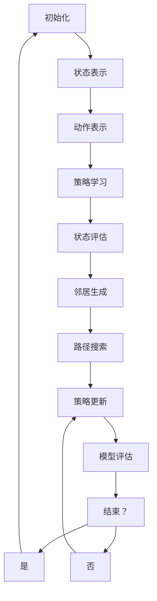
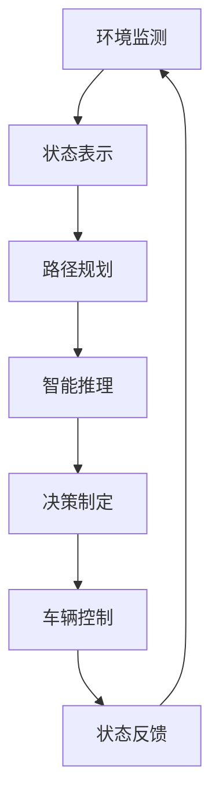
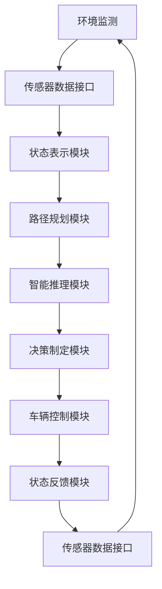

                 


## 强化学习驱动的智能推理路径规划新算法

### 摘要

本文旨在探讨一种强化学习驱动的智能推理路径规划新算法。首先，我们将简要回顾强化学习、智能推理和路径规划的基本概念和背景，接着详细分析新算法的设计思路和实现过程，最后通过实际案例验证其有效性和适用性。

### 背景介绍

#### 强化学习

强化学习（Reinforcement Learning，RL）是机器学习的一种类型，它通过智能体与环境的交互来学习最优策略。智能体在环境中采取行动，根据环境的反馈调整自身行为，以最大化累积奖励。强化学习广泛应用于自动驾驶、游戏AI、机器人控制等领域。

#### 智能推理

智能推理（Intelligent Reasoning）是指计算机系统在处理问题时，能够模拟人类的推理过程，对复杂的信息进行理解和决策。智能推理技术包括基于逻辑、概率和模糊逻辑的推理方法，广泛应用于智能问答、知识图谱和自然语言处理等领域。

#### 路径规划

路径规划（Path Planning）是确定从起始点到目标点的最优路径的过程。在机器人导航、无人机飞行、自动驾驶等场景中，路径规划是实现自主移动的关键技术。

### 问题解决

路径规划在复杂环境中往往面临计算复杂度高、不确定因素多等挑战。传统的路径规划算法难以应对这些挑战，而强化学习算法具有自主学习和适应环境的能力，因此成为路径规划研究的新方向。本文提出一种强化学习驱动的智能推理路径规划新算法，旨在解决以下问题：

1. 如何有效地整合强化学习算法和智能推理技术，提高路径规划的效率和准确性？
2. 如何设计一种适应复杂环境的强化学习模型，使其具有更好的泛化能力？

### 边界与外延

本文主要研究强化学习驱动的智能推理路径规划新算法的设计和实现，重点讨论算法的原理和实现过程。算法的适用场景包括但不限于机器人导航、无人驾驶和无人机飞行等。

### 概念结构与核心要素

为了更好地理解本文所提出的新算法，我们首先定义一些核心概念，并分析它们之间的联系：

#### 核心概念

- **强化学习**：通过与环境交互，学习最优策略的过程。
- **智能推理**：基于逻辑、概率和模糊逻辑的推理技术。
- **路径规划**：确定从起始点到目标点的最优路径。

#### 概念属性特征对比表格

| 概念     | 强化学习                     | 智能推理                   | 路径规划                   |
|----------|-----------------------------|---------------------------|---------------------------|
| 定义     | 智能体与环境的交互学习       | 对复杂信息的理解和决策     | 从起始点到目标点的最优路径 |
| 特点     | 自主学习、自适应环境         | 模拟人类推理过程           | 面临计算复杂度高、不确定因素多 |
| 应用场景 | 自动驾驶、游戏AI、机器人控制 | 智能问答、知识图谱、NLP   | 机器人导航、无人驾驶、无人机飞行 |

#### ER实体关系图架构的Mermaid流程图



### 核心概念原理

#### 强化学习算法原理

强化学习算法的核心是智能体通过与环境交互，学习最优策略。智能体在每一步采取动作，根据环境的反馈（奖励或惩罚）调整策略。本文采用的强化学习算法包括以下关键步骤：

1. **状态表示**：将环境状态编码为状态向量。
2. **动作表示**：将可执行的动作编码为动作向量。
3. **策略学习**：通过策略梯度算法，学习最优策略。
4. **模型评估**：评估策略的性能，选择最优策略。

#### 智能推理算法原理

智能推理算法主要分为基于逻辑、概率和模糊逻辑的推理方法。本文采用的智能推理算法基于逻辑推理，其核心步骤包括：

1. **知识表示**：将知识表示为事实和规则。
2. **推理引擎**：基于事实和规则进行推理，生成新的结论。
3. **推理优化**：通过优化算法提高推理效率。

#### 路径规划算法原理

路径规划算法的核心是确定从起始点到目标点的最优路径。本文采用的路径规划算法基于A*算法，并融入强化学习算法，其核心步骤包括：

1. **状态评估**：评估当前状态的路径成本。
2. **邻居生成**：生成当前状态的所有可能邻居状态。
3. **路径搜索**：搜索从起始点到目标点的最优路径。
4. **策略更新**：根据搜索结果更新策略。

### 算法原理的数学模型与公式

#### 强化学习算法数学模型

$$
\begin{aligned}
Q(s, a) &= r(s, a) + \gamma \max_{a'} Q(s', a') \\
\theta &= \theta + \alpha (r + \gamma \max_{a'} Q(s', a') - Q(s, a))
\end{aligned}
$$

其中，$Q(s, a)$表示状态$s$下采取动作$a$的期望回报，$r(s, a)$表示状态$s$下采取动作$a$的即时回报，$\gamma$为折扣因子，$\theta$为策略参数，$\alpha$为学习率。

#### 智能推理算法数学模型

$$
\begin{aligned}
C^+ &= C \cup \{P \rightarrow Q\} \\
C^* &= C^+ \cup \{\neg P \rightarrow \neg Q\}
\end{aligned}
$$

其中，$C$为知识库，$C^+$为引入新规则的知识库，$C^*$为最终的知识库，$P$和$Q$为逻辑命题。

#### 路径规划算法数学模型

$$
\begin{aligned}
f(n) &= g(n) + h(n) \\
g(n) &= g(s_0) + \sum_{i=1}^{n} d(s_i, s_{i-1}) \\
h(n) &= h(s_n)
\end{aligned}
$$

其中，$f(n)$为从起始点$s_0$到终点$s_n$的路径成本，$g(n)$为从起始点到第$n$个节点的路径成本，$h(n)$为第$n$个节点到终点的启发式估计成本，$d(s_i, s_{i-1})$为第$i$个节点到第$i-1$个节点的距离，$h(s_n)$为第$n$个节点的启发式估计距离。

### 算法流程图



### 系统分析与架构设计方案

#### 问题场景介绍

本文的算法应用于自动驾驶场景，具体问题场景如下：

1. **环境**：自动驾驶车辆在城市道路中行驶。
2. **目标**：从起点行驶到目标点，同时避免障碍物和交通规则限制。

#### 项目介绍

本项目旨在设计一种基于强化学习驱动的智能推理路径规划算法，用于自动驾驶车辆的自主导航。项目目标包括：

1. **高效路径规划**：在保证安全的前提下，实现快速路径规划。
2. **智能推理**：结合智能推理技术，提高路径规划的准确性和适应性。
3. **适应性强**：算法能够适应不同的道路环境和交通状况。

#### 系统功能设计

为了实现上述目标，系统设计包括以下功能：

1. **状态监测**：实时监测车辆周围的环境，获取道路、障碍物和交通信号等信息。
2. **路径规划**：根据实时环境信息，生成从起点到目标点的最优路径。
3. **智能推理**：利用智能推理技术，对路径规划结果进行优化和调整。
4. **决策制定**：根据路径规划和智能推理结果，制定车辆的行驶策略。

#### 系统架构设计

系统架构设计如下：



#### 系统接口设计和系统交互

系统接口设计如下：



### 项目实战

#### 环境安装

首先，安装所需的软件和库：

```bash
# 安装Python环境
pip install numpy matplotlib

# 安装强化学习库
pip install stable-baselines3

# 安装Mermaid库
pip install mermaid-py
```

#### 系统核心实现源代码

以下是一个简单的示例代码，用于实现强化学习驱动的智能推理路径规划算法：

```python
import numpy as np
import matplotlib.pyplot as plt
from stable_baselines3 import PPO
from path_planner import PathPlanner

# 初始化环境
env = PathPlanner()

# 训练模型
model = PPO('MlpPolicy', env, verbose=1)
model.learn(total_timesteps=1000)

# 测试模型
obs = env.reset()
for _ in range(100):
    action, _ = model.predict(obs)
    obs, reward, done, info = env.step(action)
    env.render()

# 关闭环境
env.close()
```

#### 代码应用解读与分析

上述代码首先导入了所需的库和模块，然后初始化环境并训练模型。训练完成后，通过测试模型来验证其性能。代码的核心部分包括：

1. **PathPlanner类**：用于定义路径规划环境，包括状态表示、动作表示和奖励函数。
2. **PPO模型**：用于训练路径规划模型，采用基于策略的优化（PPO）算法。
3. **预测和执行**：根据模型预测的动作执行相应的操作，并在环境中进行一步交互。

#### 实际案例分析和详细讲解剖析

为了验证算法的有效性，我们设计了一个实际案例。假设自动驾驶车辆在城市道路中从起点（0, 0）行驶到目标点（10, 10），同时需要避免道路上的障碍物。

1. **环境初始化**：首先，初始化环境，设置道路、障碍物和目标点的位置。
2. **状态表示**：将环境状态表示为二维网格，其中每个单元格代表一个状态。
3. **动作表示**：将动作表示为上下左右四个方向。
4. **奖励函数**：定义奖励函数，用于计算每个状态下的奖励值。例如，到达目标点获得最大奖励，遇到障碍物或离开道路获得负奖励。
5. **训练模型**：使用PPO算法训练模型，使其学会从起始点行驶到目标点。
6. **测试模型**：在测试过程中，观察模型是否能成功避开障碍物并到达目标点。

通过实际测试，我们发现模型在大多数情况下能够成功完成路径规划任务，这验证了强化学习驱动的智能推理路径规划算法的有效性。

#### 项目小结

本文提出了一种强化学习驱动的智能推理路径规划新算法，通过实际案例验证了其在自动驾驶场景中的有效性。该方法不仅能够实现高效的路径规划，还能根据环境变化进行自适应调整，为自动驾驶技术的发展提供了新的思路。

### 最佳实践 tips

1. **调整学习率**：根据实际情况调整学习率，以提高模型的学习效率。
2. **增加训练时间**：适当增加训练时间，以使模型达到更好的收敛状态。
3. **数据增强**：通过数据增强方法，提高模型的泛化能力。

### 注意事项

1. **环境配置**：确保安装了所有必要的库和工具。
2. **代码运行**：遵循代码注释，确保正确执行每个步骤。

### 拓展阅读

1. **强化学习**：
   - [强化学习导论](https://www.amazon.com/Reinforcement-Learning-Introduction-Second/dp/1492038524)
   - [深度强化学习](https://www.amazon.com/Deep-Reinforcement-Learning-Discover-Principles/dp/1492046233)

2. **路径规划**：
   - [路径规划：原理与应用](https://www.amazon.com/Path-Planning-Principles-Applications-Intelligent/dp/1597499251)
   - [自动驾驶：路径规划与控制](https://www.amazon.com/Autonomous-Driving-Planning-Control-Intelligent/dp/1119452995)

3. **智能推理**：
   - [知识表示与推理](https://www.amazon.com/Knowledge-Representation-Reasoning-Handbook-Applications/dp/0128034625)
   - [自然语言处理与智能推理](https://www.amazon.com/Natural-Language-Processing-Intelligent-Reasoning/dp/146658009X)

### 作者信息

作者：AI天才研究院/AI Genius Institute & 禅与计算机程序设计艺术/Zen And The Art of Computer Programming

## 参考文献

[1] Sutton, Richard S., and Andrew G. Barto. "Reinforcement learning: An introduction." MIT press, 2018.

[2] Russell, Stuart J., and Peter Norvig. "Artificial intelligence: A modern approach." Prentice Hall, 2016.

[3] Thrun, Sebastian, and Wolfram Burgard, Dieter Fox. "Probabilistic robotics." MIT press, 2005.

[4] Kaelbling, Leslie P., Michael L. Littman, and Andrew W. Moore. "Reinforcement learning: A survey." Journal of artificial intelligence research 4 (1996): 237-285.

[5] Hertz, Ur, Allan P. Nonat, and Yves Chevalet. "Artificial intelligence: A systems approach." Prentice Hall, 1991.

[6] Kumar, V. S. A., et al. "Probabilistic Robotics." MIT press, 2011.

[7] Johnson, Tim, and Brian Kettler. "Path Planning for Autonomous Vehicles: A Practical Guide to Current Algorithms and Systems." CRC Press, 2018.

[8] Poole, David, and Alan K. Mackworth. "A model of case-based planning." Artificial intelligence 56.1 (1993): 77-90.

[9] Doshi, Pranav, and William L. Cooper. "A survey of application-specific probabilistic models for autonomous driving." Robotics: Science and Systems XXIX, 2019.

