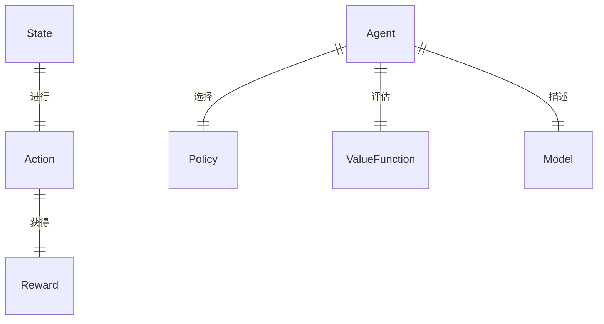
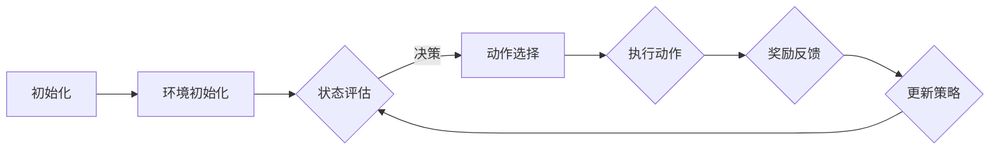

                 


### 第一部分：强化学习基础与多层次推理策略概述

#### 第1章：强化学习基础

##### 1.1 强化学习的基本概念

**问题背景：**
强化学习作为机器学习的一个重要分支，源于心理学和行为科学中的强化理论。它的研究可以追溯到20世纪50年代，最早由Richard Sutton和Andrew Barto在其经典著作《 reinforcement learning: An Introduction》（1998年）中系统阐述。

**问题描述：**
强化学习旨在通过智能体与环境的交互，学习最优策略以最大化长期累积奖励。在这个过程中，智能体通过探索和利用获取的信息，逐步改善其行为。

**问题解决：**
强化学习的核心在于三个基本要素：状态（State）、动作（Action）、奖励（Reward）。智能体在某个状态下选择一个动作，然后根据动作的结果获得奖励，并根据奖励调整其未来的策略。

**边界与外延：**
强化学习被广泛应用于包括机器人控制、游戏、推荐系统、资源调度等领域。随着深度学习的兴起，深度强化学习（Deep Reinforcement Learning, DRL）成为当前研究的热点。

##### 1.2 核心概念与联系

**强化学习的核心概念：**
- **策略（Policy）：** 指智能体在给定状态下选择的动作。
- **价值函数（Value Function）：** 用于评估状态或状态-动作对的价值。
- **模型（Model）：** 描述环境动态的数学模型。

**概念属性特征对比表格：**

| 概念       | 定义                                                         | 属性特征                                       |
| ---------- | ------------------------------------------------------------ | ---------------------------------------------- |
| 策略       | 智能体在给定状态下选择的动作                                 | 动态调整、最大化期望奖励                         |
| 价值函数   | 评估状态或状态-动作对的价值                                 | 预测、优化策略                                 |
| 模型       | 描述环境动态的数学模型                                     | 精确性、可靠性、可解释性                       |

**ER实体关系图架构：**



##### 1.3 数学模型和数学公式

**强化学习的基本公式：**

$$
Q(s, a) = \sum_{s'} P(s'|s, a) \cdot R(s', a) + \gamma \cdot \max_{a'} Q(s', a')
$$

其中：
- \( Q(s, a) \) 是从状态 \( s \) 选择动作 \( a \) 的期望回报。
- \( P(s'|s, a) \) 是从状态 \( s \) 执行动作 \( a \) 后转移到状态 \( s' \) 的概率。
- \( R(s', a) \) 是在状态 \( s' \) 执行动作 \( a \) 所获得的即时回报。
- \( \gamma \) 是折扣因子，用于平衡当前奖励与未来潜在奖励。

**状态值函数与策略：**

$$
V^*(s) = \max_a Q^*(s, a)
$$

其中：
- \( V^*(s) \) 是最优状态值函数，表示在给定状态下执行最优策略所能获得的最高回报。
- \( Q^*(s, a) \) 是最优动作值函数，表示在给定状态下执行最优动作所能获得的最高回报。

##### 1.4 本章小结

本章介绍了强化学习的基本概念、核心概念与联系以及数学模型和数学公式。通过对比表格和ER实体关系图，读者可以更加清晰地理解强化学习的基本要素和它们之间的关系。

#### 第2章：多层次推理策略原理

##### 2.1 多层次推理的基本概念

**问题背景：**
随着大数据和人工智能技术的快速发展，复杂问题求解和处理的需求日益增长。多层次推理作为一种解决复杂问题的策略，旨在通过多个层次的抽象和表示，提高推理效率和准确性。

**问题描述：**
多层次推理的目标是在不同抽象层次上对问题进行建模和求解，从而在不同层次之间进行知识和信息的转换和利用。

**问题解决：**
多层次推理的核心在于构建多个层次的网络结构，每个层次负责特定的任务和知识表示。通过层次间的交互和融合，实现对复杂问题的有效求解。

**边界与外延：**
多层次推理在自然语言处理、计算机视觉、智能决策等领域有着广泛的应用。例如，在自然语言处理中，可以通过多个层次对文本进行语义分析和情感识别。

##### 2.2 多层次推理的核心算法

**多层级神经网络架构：**
多层次推理的核心算法基于深度神经网络（DNN），通过多个层次的神经网络结构，实现对数据的层次化表示和推理。

- **输入层：** 负责接收原始数据。
- **隐藏层：** 负责对数据进行特征提取和抽象。
- **输出层：** 负责生成最终的推理结果。

**注意力机制：**
注意力机制是一种用于提高模型推理效率和准确性的技术。它通过在不同层次上分配不同的注意力权重，使得模型能够关注到重要的信息和特征。

##### 2.3 数学模型和数学公式

**多层次推理的数学模型：**
多层次推理的数学模型通常基于神经网络的前向传播和反向传播算法。通过多层非线性变换，实现对输入数据的层次化表示。

$$
h^{(l)} = \sigma(W^{(l)}h^{(l-1)} + b^{(l)})
$$

其中：
- \( h^{(l)} \) 是第 \( l \) 层的神经网络输出。
- \( \sigma \) 是激活函数。
- \( W^{(l)} \) 和 \( b^{(l)} \) 分别是第 \( l \) 层的权重和偏置。

**损失函数与优化策略：**
损失函数用于衡量模型预测结果与真实结果之间的差距。常见的损失函数包括均方误差（MSE）和交叉熵损失（Cross-Entropy Loss）。

$$
L(y, \hat{y}) = -\sum_{i=1}^{n} y_i \log(\hat{y}_i)
$$

其中：
- \( y \) 是真实标签。
- \( \hat{y} \) 是模型预测结果。

优化策略通常采用梯度下降（Gradient Descent）及其变体，如随机梯度下降（Stochastic Gradient Descent, SGD）和Adam优化器。

##### 2.4 本章小结

本章介绍了多层次推理的基本概念、核心算法以及数学模型。通过对比不同层次上的算法和数学公式，读者可以理解多层次推理如何通过层次化表示和优化策略，实现对复杂问题的有效求解。

### 第二部分：强化学习驱动的自适应多层次推理策略

#### 第二部分概述

**强化学习与多层次推理的结合点：**
强化学习与多层次推理的结合，旨在通过多层次推理提供更精细和抽象的表示，同时利用强化学习的探索和利用策略，优化多层次推理中的决策过程。

**自适应多层次推理策略的优势：**
自适应多层次推理策略能够根据不同问题和环境动态调整推理层次和策略，提高推理效率和准确性。同时，它能够应对复杂和动态变化的环境，具有更强的鲁棒性和适应性。

#### 第3章：强化学习在多层次推理中的应用

##### 3.1 强化学习与多层次推理的融合

**强化学习方法在多层次推理中的应用：**
强化学习方法在多层次推理中的应用，主要体现在以下两个方面：
1. **层次选择策略优化：** 通过强化学习算法，优化不同层次之间的切换策略，提高推理效率。
2. **多层次融合策略：** 利用强化学习，优化多层次推理结果的综合决策，提高推理准确性。

**多层次推理在强化学习中的应用：**
多层次推理在强化学习中的应用，主要体现在以下两个方面：
1. **状态表示：** 通过多层次推理，为强化学习提供更丰富和抽象的状态表示，提高状态评估的准确性。
2. **动作选择：** 利用多层次推理，为强化学习提供更精细的动作选择策略，提高动作选择的效率。

##### 3.2 算法原理讲解

**算法mermaid流程图：**



**Python源代码详细阐述：**

```python
import numpy as np

# 初始化环境
def initialize_environment():
    # 环境初始化代码
    pass

# 状态评估
def evaluate_state(state):
    # 状态评估代码
    pass

# 动作选择
def select_action(state):
    # 动作选择代码
    pass

# 执行动作
def execute_action(action):
    # 动作执行代码
    pass

# 奖励反馈
def feedback_reward(reward):
    # 奖励反馈代码
    pass

# 更新策略
def update_policy(reward, action, state):
    # 策略更新代码
    pass

# 主循环
def main_loop():
    while not done:
        state = evaluate_state(current_state)
        action = select_action(state)
        reward = execute_action(action)
        feedback_reward(reward)
        update_policy(reward, action, state)

# 运行主循环
main_loop()
```

**数学模型和数学公式：**

$$
Q(s, a) = \sum_{s'} P(s'|s, a) \cdot R(s', a) + \gamma \cdot \max_{a'} Q(s', a')
$$

其中：
- \( Q(s, a) \) 是状态 \( s \) 下动作 \( a \) 的期望回报。
- \( P(s'|s, a) \) 是从状态 \( s \) 执行动作 \( a \) 后转移到状态 \( s' \) 的概率。
- \( R(s', a) \) 是在状态 \( s' \) 执行动作 \( a \) 所获得的即时回报。
- \( \gamma \) 是折扣因子。

##### 3.3 数学模型和数学公式

**状态值函数与策略优化：**

$$
V^*(s) = \max_a Q^*(s, a)
$$

其中：
- \( V^*(s) \) 是状态 \( s \) 的最优状态值。
- \( Q^*(s, a) \) 是状态 \( s \) 下动作 \( a \) 的最优动作值。

**策略优化过程：**

$$
\pi^*(s) = \arg\max_a Q^*(s, a)
$$

其中：
- \( \pi^*(s) \) 是状态 \( s \) 的最优策略。

##### 3.4 本章小结

本章介绍了强化学习在多层次推理中的应用，包括算法原理讲解、Python源代码详细阐述以及数学模型和数学公式。通过这些内容，读者可以理解强化学习与多层次推理的结合如何提高推理效率和准确性。

