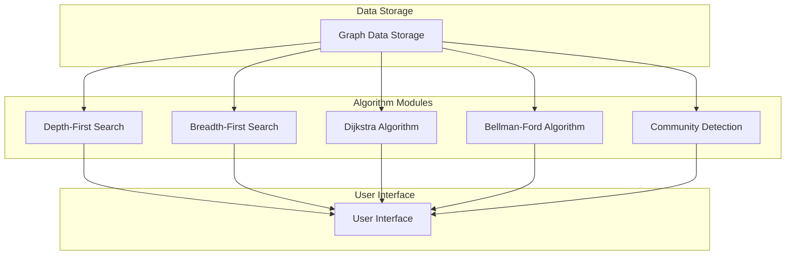
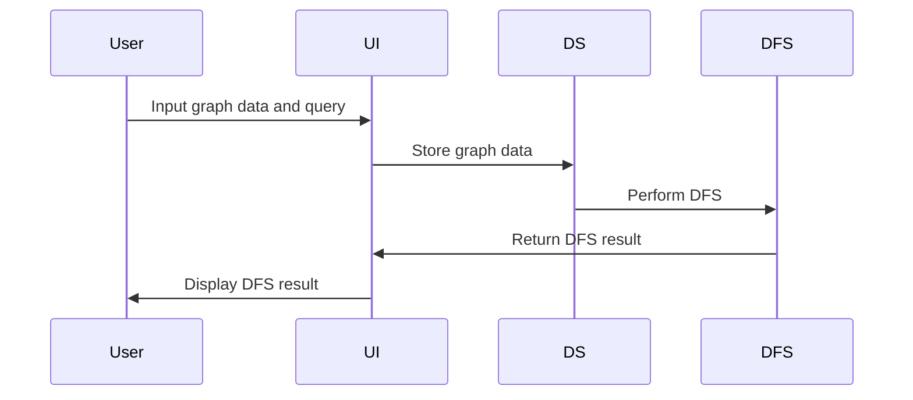

                 

# 归纳定义与递归程序设计

## 关键词：归纳定义，递归程序设计，算法原理，实践应用，数学模型

### 摘要：

本文旨在深入探讨归纳定义与递归程序设计这一主题，通过对相关概念、原理、算法和应用的系统分析，帮助读者理解递归程序设计的本质和重要性。文章首先介绍了归纳定义的基本概念和原理，随后详细分析了递归程序设计的优势和方法，并通过实际案例展示了递归算法在各个领域的应用。文章最后，对递归程序设计的实践技巧、注意事项和未来趋势进行了总结和展望。

## 引言

### 1.1 问题背景与基本概念

在计算机科学和软件工程领域，程序设计是一种将问题解决方案转化为计算机可执行的指令的过程。程序设计语言提供了各种控制结构和数据结构，使得开发者能够以不同的方式组织和处理数据。然而，随着问题复杂性的增加，传统的程序设计方法可能无法有效地解决某些特定问题。

递归程序设计是一种强大的编程方法，它允许开发者通过定义问题的一部分来解决整个问题。递归是一种自引用的过程，通过将问题分解成更小、更简单的子问题，从而简化了问题的解决过程。递归程序设计不仅在理论计算机科学中具有重要地位，而且在实际编程中也具有广泛的应用。

### 1.2 归纳定义的方法

归纳定义是一种从特殊情况推导出一般性的方法。它通常包括两个步骤：基础情况和归纳步骤。基础情况定义了递归过程的起点，而归纳步骤则说明了如何从较小的问题实例推导出较大问题实例的解决方案。

### 1.3 递归程序设计的优势

递归程序设计具有以下优势：

1. **简洁性**：递归通常可以比迭代更简洁地表达复杂问题的解决方案。
2. **直观性**：递归能够更直观地反映问题的结构，有助于理解问题的本质。
3. **通用性**：递归可以处理各种类型的问题，包括数据结构和算法设计。
4. **灵活性**：递归允许开发者以更灵活的方式处理问题的不同实例。

## 第二部分：递归算法原理

### 2.1 递归的基本原理

#### 2.1.1 递归的概念

递归是一种编程技巧，它允许函数调用自身来解决问题。递归通常分为直接递归和间接递归两种类型。直接递归是指函数直接调用自身，而间接递归是指函数通过其他函数间接调用自身。

#### 2.1.2 递归的工作原理

递归的工作原理可以概括为以下步骤：

1. **基础情况**：定义递归过程的终止条件，即基础情况。
2. **递归调用**：在基础情况之外，函数通过递归调用自身来处理更小的问题实例。
3. **返回结果**：递归调用返回结果，并通过一系列步骤将子问题的结果组合成原问题的解。

#### 2.1.3 递归与迭代的比较

递归和迭代是两种常用的编程方法，它们各有优缺点。递归的优点在于其简洁性和直观性，而迭代的优点在于其可缓存和更高效。

### 2.2 递归算法设计

#### 2.2.1 设计递归算法的步骤

设计递归算法通常包括以下步骤：

1. **确定基础情况**：定义递归过程的终止条件。
2. **定义递归关系**：说明如何将问题分解为更小的子问题。
3. **组合子问题的解**：将子问题的解组合成原问题的解。

#### 2.2.2 递归算法的常见模式

递归算法通常包括以下几种常见模式：

1. **递归树**：通过递归树来分析递归算法的时间和空间复杂度。
2. **分治算法**：将问题分解成更小的子问题，分别解决后再合并结果。
3. **回溯算法**：在递归过程中尝试不同的分支，并在遇到问题时回溯到上一个分支。

#### 2.2.3 递归算法的优化策略

递归算法的优化策略包括：

1. **尾递归**：将递归调用放在函数的最后，以便编译器可以将其优化为迭代。
2. **记忆化**：存储已解决的子问题的结果，避免重复计算。

### 2.3 数学模型与公式

#### 2.3.1 递归的数学基础

递归的数学基础通常涉及数学归纳法，它是一种证明递归关系和算法正确性的方法。

#### 2.3.2 经典递归问题的数学模型

经典递归问题包括阶乘、斐波那契数列等。这些问题的数学模型通常可以用递归关系和数学公式来描述。

#### 2.3.3 公式推导与证明

递归算法的正确性和复杂度通常可以通过数学公式推导和证明来验证。例如，可以使用主定理（Master Theorem）来分析递归算法的时间复杂度。

## 第三部分：递归算法应用实例

### 3.1 排列与组合

#### 3.1.1 排列的计算

排列是指从一组元素中按照一定顺序取出一部分元素的方式。计算排列的递归算法通常基于组合数的计算。

#### 3.1.2 组合的计算

组合是指从一组元素中按照任意顺序取出一部分元素的方式。计算组合的递归算法通常基于排列数的计算。

#### 3.1.3 应用实例

排列与组合在许多实际问题中都有广泛的应用，例如密码学、统计学和计算机科学中的数据排列等。

### 3.2 动态规划问题

#### 3.2.1 动态规划的概念

动态规划是一种用于解决优化问题的递归方法。它通过将问题分解成更小的子问题，并存储已解决的子问题的结果，以避免重复计算。

#### 3.2.2 经典动态规划问题

经典动态规划问题包括背包问题、最长公共子序列问题等。这些问题的递归关系和数学模型都有明确的定义。

#### 3.2.3 动态规划与递归的关系

动态规划是递归的一种优化方法，它通过将递归过程中的重复计算转化为存储和查询，从而提高算法的效率。

### 3.3 图像处理

#### 3.3.1 图像处理的递归算法

图像处理中的许多问题都可以通过递归算法来解决，例如图像的滤波、分割和特征提取等。

#### 3.3.2 图像处理的实际应用

图像处理在计算机视觉、医疗影像分析和图像压缩等领域具有广泛的应用。

#### 3.3.3 应用实例分析

通过具体实例分析图像处理中的递归算法，展示其在实际问题中的应用效果。

## 第四部分：递归程序设计实践

### 4.1 开发环境配置

#### 4.1.1 环境安装与配置

介绍如何配置开发环境，包括安装必要的软件和工具。

#### 4.1.2 开发工具推荐

推荐一些常用的开发工具和集成开发环境（IDE），以提高开发效率和代码质量。

### 4.2 递归程序设计实战

#### 4.2.1 实战项目介绍

介绍一个具体的递归程序设计实战项目，例如求解斐波那契数列或背包问题。

#### 4.2.2 系统核心实现

详细讲解实战项目的核心实现，包括算法原理、代码解析和优化策略。

#### 4.2.3 应用解读与分析

对实战项目进行解读和分析，展示递归算法在实际问题中的应用效果。

### 4.3 代码解析与应用分析

#### 4.3.1 代码实现与解析

对实战项目中的代码进行逐行解析，解释代码的实现原理和关键步骤。

#### 4.3.2 应用案例分析

通过具体案例展示递归算法在不同场景中的应用，并进行详细分析。

### 4.4 项目实战案例

#### 4.4.1 项目背景与目标

介绍一个实际项目案例，包括项目背景、目标和预期成果。

#### 4.4.2 项目实现与优化

详细讲解项目实现过程，包括算法设计、代码实现和优化策略。

#### 4.4.3 项目效果与评价

对项目效果进行评价，包括实际应用效果、性能分析和用户反馈。

## 第五部分：总结与展望

### 5.1 递归程序设计的关键点

回顾递归程序设计的关键点和注意事项，帮助读者巩固所学知识。

### 5.2 递归程序设计的未来趋势

探讨递归程序设计的未来发展趋势，包括新的算法和技术应用。

### 5.3 最佳实践与注意事项

分享最佳实践和注意事项，以提高递归程序设计的效率和可靠性。

### 5.4 拓展阅读推荐

推荐一些拓展阅读资料，帮助读者深入了解递归程序设计的相关领域。

## 作者信息

作者：AI天才研究院/AI Genius Institute & 禅与计算机程序设计艺术 /Zen And The Art of Computer Programming

以上为文章的初步大纲，接下来将逐步填充每个章节的内容，确保文章的完整性和专业性。在撰写过程中，将注重逻辑清晰、结构紧凑、简单易懂，以便于读者理解和掌握递归程序设计的相关知识和技能。**请注意，由于篇幅限制，本文只能提供一个初步的目录和大纲，详细的内容将在实际撰写过程中逐步完善。**## 引言

### 1.1 问题背景与基本概念

在计算机科学和软件工程领域，程序设计是一种将问题解决方案转化为计算机可执行的指令的过程。程序设计语言提供了各种控制结构和数据结构，使得开发者能够以不同的方式组织和处理数据。然而，随着问题复杂性的增加，传统的程序设计方法可能无法有效地解决某些特定问题。

递归程序设计是一种强大的编程方法，它允许开发者通过定义问题的一部分来解决整个问题。递归是一种自引用的过程，通过将问题分解成更小、更简单的子问题，从而简化了问题的解决过程。递归程序设计不仅在理论计算机科学中具有重要地位，而且在实际编程中也具有广泛的应用。

递归的基本原理涉及函数调用自身，从而形成递归关系。递归通常分为直接递归和间接递归两种类型。直接递归是指函数直接调用自身，而间接递归是指函数通过其他函数间接调用自身。递归的工作原理可以概括为以下步骤：

1. **基础情况**：定义递归过程的终止条件，即基础情况。
2. **递归调用**：在基础情况之外，函数通过递归调用自身来处理更小的问题实例。
3. **返回结果**：递归调用返回结果，并通过一系列步骤将子问题的结果组合成原问题的解。

递归程序设计具有以下优势：

1. **简洁性**：递归通常可以比迭代更简洁地表达复杂问题的解决方案。
2. **直观性**：递归能够更直观地反映问题的结构，有助于理解问题的本质。
3. **通用性**：递归可以处理各种类型的问题，包括数据结构和算法设计。
4. **灵活性**：递归允许开发者以更灵活的方式处理问题的不同实例。

在本文中，我们将深入探讨递归程序设计的原理、算法和应用，帮助读者全面了解递归程序设计的核心概念和技术要点。通过逐步分析和讲解，我们将展示如何设计有效的递归算法，并讨论其在实际编程中的应用和挑战。最终，本文旨在为读者提供一个系统、全面的学习资源，帮助他们掌握递归程序设计的核心技能。

### 1.2 归纳定义的方法

归纳定义是一种从特殊情况推导出一般性的方法。它通常包括两个步骤：基础情况和归纳步骤。基础情况定义了递归过程的起点，而归纳步骤则说明了如何从较小的问题实例推导出较大问题实例的解决方案。

**基础情况**：在递归过程中，基础情况是递归的终止条件。它定义了递归的边界，防止递归无限进行。例如，在计算斐波那契数列时，基础情况通常是前两个数（0和1）。任何小于这个基础情况的数可以直接计算得到，无需递归。

**归纳步骤**：归纳步骤说明了如何将问题分解为更小的子问题，并解决这些子问题。这通常涉及到递归调用的过程。在归纳步骤中，开发者需要定义递归关系，即如何将原问题分解为子问题，以及如何将子问题的解组合成原问题的解。例如，在计算斐波那契数列时，可以通过递归调用计算前两个数，并将它们的和作为当前数的值。

**递归的定义**：递归是一种定义或解决问题的方法，它依赖于自身的定义或解决方案。在程序设计中，递归函数是指能够调用自身的函数。递归定义通常包括基础情况和递归关系。递归关系定义了如何将原问题分解为较小的子问题，以及如何通过子问题的解来求解原问题。

递归在程序设计中具有广泛的应用，它不仅用于计算和数学问题，还用于处理复杂的算法和数据结构。递归的优势在于其简洁性和直观性，它能够将复杂的递归关系以清晰的递归形式表达出来，使得问题的理解和解题过程更加直观。

然而，递归也存在一些潜在的问题。首先，递归可能会导致大量的函数调用和栈空间占用，特别是在处理大型问题时。这可能导致栈溢出错误。其次，递归可能会导致执行时间较长，特别是在递归深度较深时。因此，在设计和使用递归时，需要仔细考虑其效率和性能。

**递归与迭代的比较**：递归和迭代是两种常用的编程方法，它们各有优缺点。

- **递归**：递归通常可以更简洁地表达复杂问题，并且能够更直观地反映问题的结构。递归在处理递归定义的问题时具有优势，例如计算阶乘、斐波那契数列等。然而，递归可能会导致较大的栈空间占用和较长的执行时间。
- **迭代**：迭代通常使用循环结构来重复执行某些操作，直到满足特定条件。迭代在处理循环结构的问题时具有优势，例如计算数组的和、最大值等。迭代通常比递归更高效，因为它避免了递归带来的栈空间占用问题。

在实际编程中，选择递归还是迭代取决于具体问题的特点和要求。递归和迭代可以相互转换，即一个递归算法可以转换为迭代算法，反之亦然。因此，开发者需要根据问题的复杂性和性能要求，选择最合适的编程方法。

### 1.3 递归程序设计的优势

递归程序设计具有以下几个显著优势，使其成为解决复杂问题的有力工具。

**1. 简洁性**

递归能够以更简洁的方式表达复杂的问题解决方案。它通过递归调用自身，将问题分解为较小的子问题，从而避免了复杂的循环和条件判断。这种简洁性使得代码更易于理解和维护。

例如，在计算斐波那契数列时，递归定义如下：

```python
def fibonacci(n):
    if n <= 1:
        return n
    else:
        return fibonacci(n-1) + fibonacci(n-2)
```

这个递归函数仅使用几个条件判断和递归调用，就能实现复杂的计算过程。

**2. 直观性**

递归能够更直观地反映问题的结构。递归通常模仿问题本身的自然分解方式，使得问题的解法与问题的本质更加吻合。这种直观性有助于开发者理解和设计递归算法。

例如，在解决八皇后问题（将8个皇后放在8×8的棋盘上，使她们不能互相攻击）时，递归方法能够清晰展示每个皇后的放置方式：

```python
def place_queens(board, row):
    if row == 8:
        return True  # 所有皇后已放置成功
    for col in range(8):
        if is_safe(board, row, col):
            board[row] = col
            if place_queens(board, row + 1):
                return True
            board[row] = -1  # 回溯
    return False
```

**3. 通用性**

递归适用于各种类型的问题，包括数学、算法和数据处理等。它不仅用于解决简单的问题，如计算阶乘和斐波那契数列，还用于处理复杂的算法和数据结构，如树和图的遍历、动态规划等。

例如，在树形数据结构中，递归遍历（前序、中序、后序遍历）是一种常用的方法：

```python
def preorder_traversal(node):
    if node is None:
        return
    print(node.value)  # 访问节点
    preorder_traversal(node.left)  # 递归遍历左子树
    preorder_traversal(node.right)  # 递归遍历右子树
```

**4. 灵活性**

递归允许开发者以更灵活的方式处理问题的不同实例。递归关系可以灵活地定义，以适应各种变化和扩展。这种灵活性使得递归算法能够适应不同的输入和约束条件。

例如，在解决旅行商问题（TSP）时，递归关系可以根据城市之间的距离和访问顺序灵活调整：

```python
def tsp_REC(n, cities, current_city, visited, path):
    if len(visited) == n:
        return calculate_total_distance(path)  # 计算总距离
    min_distance = float('inf')
    for next_city in cities:
        if not is_visited(next_city, visited):
            visited.add(next_city)
            path.append(next_city)
            distance = tsp_REC(n, cities, next_city, visited, path)
            if distance < min_distance:
                min_distance = distance
            visited.remove(next_city)
            path.pop()
    return min_distance
```

通过以上优势，递归程序设计在解决复杂问题中发挥着重要作用。它不仅简化了问题的解决过程，提高了代码的可读性和可维护性，还提供了灵活的解决方案，以适应各种变化和扩展。然而，递归也存在一些潜在问题，如栈溢出和执行时间较长，需要开发者在实际应用中谨慎权衡。

## 第二部分：递归算法原理

### 2.1 递归的基本原理

递归是一种编程技巧，它允许函数调用自身来解决问题。递归是一种自引用的过程，通过将问题分解成更小、更简单的子问题，从而简化了问题的解决过程。递归的基本原理包括基础情况和递归关系。

#### 2.1.1 递归的概念

递归通常分为直接递归和间接递归两种类型。直接递归是指函数直接调用自身，而间接递归是指函数通过其他函数间接调用自身。

直接递归示例：

```python
def factorial(n):
    if n == 0:
        return 1
    else:
        return n * factorial(n - 1)
```

在这个示例中，`factorial` 函数直接调用自身来计算阶乘。

间接递归示例：

```python
def add(a, b):
    if b == 0:
        return a
    else:
        return add(a + 1, b - 1)

def multiply(a, b):
    return add(a, add(a, add(a, ... b times ...)))
```

在这个示例中，`add` 函数通过递归调用自身来计算两个数的和，而 `multiply` 函数通过调用 `add` 函数来计算两个数的乘积。

#### 2.1.2 递归的工作原理

递归的工作原理可以概括为以下步骤：

1. **基础情况**：定义递归过程的终止条件，即基础情况。基础情况通常是最简单的问题实例，无需进一步递归调用。
2. **递归调用**：在基础情况之外，函数通过递归调用自身来处理更小的问题实例。递归调用通常将问题分解为更小的子问题，并传递相应的参数。
3. **返回结果**：递归调用返回结果，并通过一系列步骤将子问题的结果组合成原问题的解。在递归调用的过程中，子问题的解被逐步合并，直到达到基础情况。

递归的流程可以用递归树表示，递归树展示了递归调用的层次结构和递归关系。

#### 2.1.3 递归与迭代的比较

递归和迭代是两种常用的编程方法，它们各有优缺点。

**递归的优点：**

- **简洁性**：递归能够以更简洁的方式表达复杂问题，避免了复杂的循环和条件判断。
- **直观性**：递归能够更直观地反映问题的结构，使得问题的解法与问题的本质更加吻合。
- **通用性**：递归适用于各种类型的问题，包括数学、算法和数据处理等。

**递归的缺点：**

- **栈空间占用**：递归通常需要大量的栈空间来存储递归调用和返回地址，可能导致栈溢出错误。
- **执行时间**：递归可能会导致较长的执行时间，特别是在递归深度较深时。

**迭代的优点：**

- **效率**：迭代通常比递归更高效，因为它避免了递归带来的栈空间占用问题。
- **可缓存**：迭代可以通过缓存已计算的结果来提高效率，例如使用循环变量和累加器。

**迭代的缺点：**

- **复杂度**：迭代可能需要更复杂的循环和条件判断来处理问题，使得代码更难以理解和维护。

在实际编程中，选择递归还是迭代取决于具体问题的特点和要求。递归在处理递归定义的问题时具有优势，而迭代在处理循环结构的问题时具有优势。开发者需要根据问题的复杂性和性能要求，选择最合适的编程方法。

### 2.2 递归算法设计

递归算法设计是一个系统化的过程，包括以下关键步骤：

#### 2.2.1 设计递归算法的步骤

1. **确定基础情况**：基础情况是递归过程的终止条件，它定义了递归的边界。基础情况通常是最简单的问题实例，无需进一步递归调用。例如，在计算斐波那契数列时，基础情况是前两个数（0和1）。

2. **定义递归关系**：递归关系说明了如何将原问题分解为更小的子问题，以及如何通过子问题的解来求解原问题。递归关系通常涉及到递归调用和参数传递。例如，在计算斐波那契数列时，递归关系可以定义为 `F(n) = F(n-1) + F(n-2)`。

3. **编写递归函数**：根据基础情况和递归关系，编写递归函数。递归函数通常包括递归调用和返回结果的步骤。例如，在计算斐波那契数列的递归函数中，递归调用如下：

    ```python
    def fibonacci(n):
        if n <= 1:
            return n
        else:
            return fibonacci(n-1) + fibonacci(n-2)
    ```

4. **测试和调试**：编写递归函数后，进行测试和调试以确保其正确性和性能。测试可以包括不同的输入值，验证递归函数是否能够正确计算输出结果。

#### 2.2.2 递归算法的常见模式

递归算法有多种常见模式，每种模式适用于不同类型的问题。以下是一些常见的递归算法模式：

1. **分治模式**：分治模式将问题分解为较小的子问题，分别解决后再合并结果。常见的分治算法包括快速排序和归并排序。

2. **回溯模式**：回溯模式通过尝试不同的分支，并在遇到问题时回溯到上一个分支。常见的回溯算法包括八皇后问题和旅行商问题。

3. **递推模式**：递推模式通过递归关系逐步计算问题的解。常见的递推算法包括斐波那契数列和阶乘计算。

4. **迭代模式**：迭代模式通过循环结构逐步计算问题的解。迭代模式可以看作是递归模式的一种优化，它避免了递归带来的栈空间占用问题。

#### 2.2.3 递归算法的优化策略

递归算法通常具有较低的时间复杂度和较高的空间复杂度。为了优化递归算法的性能，可以采取以下策略：

1. **尾递归优化**：尾递归是指递归调用在函数的最后执行。尾递归可以通过编译器优化为迭代，从而减少栈空间占用和执行时间。例如，以下两个函数具有相同的递归关系，但第二个函数使用了尾递归优化：

    ```python
    def factorial(n):
        return n * factorial(n-1)

    def factorial_optimized(n):
        result = 1
        while n > 1:
            result *= n
            n -= 1
        return result
    ```

2. **记忆化**：记忆化是指存储已解决的子问题的结果，避免重复计算。记忆化可以通过递归函数的缓存来实现。例如，以下是一个使用记忆化的斐波那契数列计算函数：

    ```python
    def fibonacci_cached(n, cache={}):
        if n <= 1:
            return n
        if n not in cache:
            cache[n] = fibonacci_cached(n-1, cache) + fibonacci_cached(n-2, cache)
        return cache[n]
    ```

3. **动态规划**：动态规划是一种用于解决优化问题的递归方法，它通过将问题分解成更小的子问题，并存储已解决的子问题的结果，以避免重复计算。动态规划通常用于解决背包问题和最长公共子序列问题。

通过以上策略，可以显著优化递归算法的性能，使其在处理大型问题时更加高效。

### 2.3 数学模型与公式

递归算法通常涉及数学模型和公式，这些模型和公式有助于分析和优化递归算法。以下是一些常见的数学模型和公式：

#### 2.3.1 递归的数学基础

递归的数学基础通常涉及数学归纳法，它是一种证明递归关系和算法正确性的方法。数学归纳法包括基础情况和归纳步骤。

1. **基础情况**：证明当问题规模最小时，算法是正确的。

2. **归纳步骤**：假设当问题规模小于当前规模时，算法是正确的，然后证明当问题规模等于当前规模时，算法也是正确的。

例如，在证明斐波那契数列递归关系的正确性时，可以使用数学归纳法：

- **基础情况**：当 `n = 0` 或 `n = 1` 时，斐波那契数列的值为 `0` 或 `1`，显然递归关系成立。
- **归纳步骤**：假设当 `n = k` 时，递归关系成立，即 `F(k) = F(k-1) + F(k-2)`。需要证明当 `n = k+1` 时，递归关系也成立，即 `F(k+1) = F(k) + F(k-1)`。

通过归纳步骤，可以证明斐波那契数列的递归关系在任意正整数 `n` 上都成立。

#### 2.3.2 经典递归问题的数学模型

经典递归问题包括斐波那契数列、阶乘和汉诺塔等。这些问题的数学模型可以用递归关系和数学公式来描述。

1. **斐波那契数列**

   斐波那契数列的递归关系为：

   $$ F(n) = \begin{cases} 
   0 & \text{if } n = 0 \\
   1 & \text{if } n = 1 \\
   F(n-1) + F(n-2) & \text{otherwise} 
   \end{cases} $$

   斐波那契数列的数学公式为：

   $$ F(n) = \frac{\phi^n - (1-\phi)^n}{\sqrt{5}} $$

   其中，$\phi$ 是黄金比例，约等于 $1.618$。

2. **阶乘**

   阶乘的递归关系为：

   $$ n! = \begin{cases} 
   1 & \text{if } n = 0 \\
   n \cdot (n-1)! & \text{otherwise} 
   \end{cases} $$

   阶乘的数学公式为：

   $$ n! = n \cdot (n-1) \cdot (n-2) \cdot ... \cdot 1 $$

3. **汉诺塔**

   汉诺塔问题的递归关系为：

   $$ H(n, A, B, C) = \begin{cases} 
   \text{Move disk from pole A to pole C} & \text{if } n = 1 \\
   H(n-1, A, C, B) & \text{Move disk from pole A to pole B} \\
   H(n-1, A, B, C) & \text{Move disk from pole C to pole A} \\
   H(n-1, B, A, C) & \text{Move disk from pole B to pole C} 
   \end{cases} $$

   其中，$H(n, A, B, C)$ 表示将 $n$ 个盘子从初始位置 $A$ 移动到目标位置 $C$ 的步骤数。

#### 2.3.3 公式推导与证明

递归算法的正确性和复杂度通常可以通过数学公式推导和证明来验证。以下是一些常用的推导和证明方法：

1. **主定理（Master Theorem）**

   主定理用于分析递归算法的时间复杂度。主定理的公式为：

   $$ T(n) = aT(n/b) + f(n) $$

   其中，$T(n)$ 是递归算法的时间复杂度，$a$ 是递归调用的次数，$b$ 是每次递归调用的规模，$f(n)$ 是每次递归调用的额外计算时间。

   主定理根据 $f(n)$ 与 $n^{\log_b a}$ 的关系，将递归算法分为三种情况：

   - 情况一：如果 $f(n) = O(n^{\log_b a - \varepsilon})$，则 $T(n) = \Theta(n^{\log_b a})$。
   - 情况二：如果 $f(n) = \Theta(n^{\log_b a} \log^k n)$，则 $T(n) = \Theta(n^{\log_b a} \log^{k+1} n)$。
   - 情况三：如果 $f(n) = \Omega(n^{\log_b a + \varepsilon})$，且满足正则性条件（即 $af(n/b) \leq cf(n)$ 对于某个常数 $c < 1$ 和足够大的 $n$），则 $T(n) = \Theta(f(n))$。

2. **递归关系的推导**

   递归算法的递归关系可以通过数学归纳法推导。例如，斐波那契数列的递归关系可以通过以下步骤推导：

   - **基础情况**：当 $n = 0$ 或 $n = 1$ 时，斐波那契数列的值为 $0$ 或 $1$。
   - **归纳步骤**：假设当 $n = k$ 时，斐波那契数列的递归关系成立，即 $F(k) = F(k-1) + F(k-2)$。需要证明当 $n = k+1$ 时，斐波那契数列的递归关系也成立。

     $$ F(k+1) = F(k) + F(k-1) $$

     根据归纳假设，有：

     $$ F(k+1) = (F(k-1) + F(k-2)) + F(k-1) = F(k-1) + F(k-2) + F(k-1) = F(k) + F(k-1) $$

     因此，斐波那契数列的递归关系在任意正整数 $n$ 上都成立。

通过数学公式推导和证明，可以验证递归算法的正确性和复杂度。这些推导和证明方法有助于开发者理解和优化递归算法，提高其性能和可靠性。

### 2.4 递归算法的应用领域

递归算法在计算机科学和软件工程领域具有广泛的应用，特别是在算法设计、数据结构和系统编程中。以下是一些递归算法的主要应用领域：

#### 2.4.1 算法设计

递归算法在算法设计中扮演着重要角色，它能够有效地解决许多复杂问题。以下是一些常见的问题及其递归算法：

1. **递归排序算法**：例如快速排序和归并排序，它们通过递归地将问题分解为较小的子问题，并最终合并结果。

2. **递归查找算法**：例如二分查找，它通过递归地缩小查找范围，以提高查找效率。

3. **递归动态规划**：动态规划是一种用于解决优化问题的递归方法，它通过将问题分解成更小的子问题，并存储已解决的子问题的结果，以避免重复计算。

#### 2.4.2 数据结构

递归算法在处理各种数据结构时也具有广泛的应用。以下是一些常见的数据结构及其递归算法：

1. **树和图**：递归遍历是树和图数据结构处理中的一种重要方法。常见的递归遍历算法包括前序遍历、中序遍历和后序遍历。

2. **链表**：递归算法可以用于处理链表数据结构，例如合并两个有序链表、删除链表中的重复元素等。

3. **栈和队列**：递归算法可以用于实现栈和队列数据结构，例如递归实现栈的入栈和出栈操作。

#### 2.4.3 系统编程

递归算法在系统编程中也有广泛的应用，特别是在操作系统的调度和管理中。以下是一些常见的系统编程场景：

1. **进程和线程调度**：递归算法可以用于实现进程和线程的调度策略，例如优先级调度和轮转调度。

2. **文件系统管理**：递归算法可以用于处理文件系统中的文件和目录，例如递归地删除文件和目录。

3. **网络协议实现**：递归算法可以用于实现网络协议中的各种处理函数，例如TCP/IP协议栈的处理函数。

递归算法的灵活性和强大功能使其在各种应用领域中都具有广泛的应用。通过递归方法，开发者可以更简洁、直观地处理复杂问题，提高算法的效率和可维护性。

### 2.5 递归算法的性能优化

递归算法在处理复杂问题时具有显著优势，但同时也存在一些性能瓶颈。为了提高递归算法的性能，可以采用以下几种优化策略：

#### 2.5.1 尾递归优化

尾递归优化是一种将递归调用优化为迭代调用的技术，从而减少栈空间占用和执行时间。尾递归是指递归调用是函数执行的最后一个操作。通过将尾递归转换为迭代，可以避免递归带来的栈溢出问题。

例如，以下是一个简单的阶乘函数，它使用尾递归：

```python
def factorial(n, acc=1):
    if n == 0:
        return acc
    else:
        return factorial(n - 1, acc * n)
```

这个函数通过传递累乘的参数 `acc`，避免了重复计算，并且可以在尾递归调用时优化为迭代。

使用尾递归优化的版本如下：

```python
def factorial_optimized(n):
    acc = 1
    while n > 0:
        acc *= n
        n -= 1
    return acc
```

这种优化可以显著提高递归算法的性能，尤其是在处理大数时。

#### 2.5.2 记忆化

记忆化是一种将已解决的子问题的结果存储起来的技术，以避免重复计算。记忆化通常通过递归函数的缓存来实现。以下是一个使用记忆化的斐波那契数列计算函数：

```python
def fibonacci_cached(n, cache={}):
    if n in cache:
        return cache[n]
    if n <= 1:
        return n
    cache[n] = fibonacci_cached(n - 1, cache) + fibonacci_cached(n - 2, cache)
    return cache[n]
```

这个函数通过一个字典 `cache` 存储已计算的斐波那契数，从而避免了重复计算。

#### 2.5.3 动态规划

动态规划是一种将问题分解成更小的子问题，并存储已解决的子问题的结果的递归方法。动态规划通过构建一个状态表来记录子问题的解，从而避免重复计算。

例如，在计算最长公共子序列（LCS）时，可以使用动态规划：

```python
def longest_common_subsequence(X, Y):
    m = len(X)
    n = len(Y)
    L = [[0] * (n + 1) for i in range(m + 1)]

    for i in range(1, m + 1):
        for j in range(1, n + 1):
            if X[i - 1] == Y[j - 1]:
                L[i][j] = L[i - 1][j - 1] + 1
            else:
                L[i][j] = max(L[i - 1][j], L[i][j - 1])

    return L[m][n]
```

这个函数通过构建一个二维数组 `L` 来记录子问题的解，从而避免了重复计算。

#### 2.5.4 分治算法

分治算法是一种将问题分解成较小的子问题，分别解决后再合并结果的递归方法。分治算法通常用于解决大规模问题，例如排序和搜索算法。

例如，在快速排序算法中，通过递归地将问题分解为两个子问题，并最终合并结果：

```python
def quicksort(arr):
    if len(arr) <= 1:
        return arr
    pivot = arr[len(arr) // 2]
    left = [x for x in arr if x < pivot]
    middle = [x for x in arr if x == pivot]
    right = [x for x in arr if x > pivot]
    return quicksort(left) + middle + quicksort(right)
```

这个函数通过递归地将数组分解为较小的子数组，并最终合并结果。

通过以上优化策略，可以显著提高递归算法的性能和效率。在实际编程中，开发者可以根据问题的特点和需求，选择合适的优化策略，以实现更高效的递归算法。

### 2.6 递归算法的设计原则与注意事项

设计有效的递归算法是软件开发中的一项挑战，需要遵循一系列原则和注意事项，以确保算法的正确性、效率和可维护性。以下是一些关键的设计原则和注意事项：

#### 2.6.1 设计原则

1. **明确基础情况**：基础情况是递归算法的终止条件，它定义了递归过程的边界。基础情况必须明确，以确保递归能够正确终止。例如，在计算斐波那契数列时，基础情况是 `F(0) = 0` 和 `F(1) = 1`。

2. **清晰的递归关系**：递归关系描述了如何将原问题分解为较小的子问题，并说明如何通过子问题的解组合成原问题的解。递归关系必须清晰、简单，以确保算法易于理解和实现。

3. **避免过度递归**：过度递归可能导致栈溢出错误和较长的执行时间。在设计和实现递归算法时，应尽可能减少递归的深度，并通过优化策略（如尾递归优化和记忆化）来提高性能。

4. **考虑性能**：递归算法通常具有较高的空间复杂度，因为每次递归调用都需要占用栈空间。在设计算法时，应考虑性能瓶颈，并采用适当的优化策略来提高算法的效率。

5. **代码可读性**：递归算法通常比迭代算法更复杂，因此在设计和编写代码时，应注重代码的可读性和可维护性。使用清晰的命名和注释，以及合理的代码结构，有助于提高代码的可读性。

6. **避免重复计算**：递归算法容易导致重复计算，尤其是在没有记忆化策略的情况下。通过记忆化或其他优化策略，可以显著减少重复计算，提高算法的效率。

#### 2.6.2 注意事项

1. **栈溢出**：递归算法可能会导致栈溢出错误，尤其是在处理大型问题时。为了避免栈溢出，可以采用尾递归优化、记忆化或迭代等方法来降低递归的深度和栈空间占用。

2. **执行时间**：递归算法的执行时间可能较长，尤其是在递归深度较深时。为了提高执行时间，可以采用尾递归优化、记忆化或动态规划等方法来减少计算时间。

3. **错误处理**：递归算法中的错误处理可能比较复杂，特别是在递归过程中涉及多个子问题。在设计算法时，应考虑可能的错误场景，并添加适当的错误处理机制。

4. **可维护性**：递归算法通常比迭代算法更复杂，因此在设计和编写代码时，应注重代码的可维护性。使用清晰的命名、注释和模块化的代码结构，有助于提高代码的可维护性。

5. **测试和调试**：递归算法的测试和调试可能比较困难，因为递归过程涉及到多个层次。在设计和实现递归算法时，应进行充分的测试和调试，以确保算法的正确性和稳定性。

通过遵循上述设计原则和注意事项，开发者可以设计出有效的递归算法，提高算法的正确性、效率和可维护性，从而更好地解决复杂问题。

### 2.7 递归算法的编程实践

递归算法在编程实践中具有广泛的应用，通过具体的案例，可以更好地理解递归算法的设计、实现和优化。以下将介绍几个常见的递归算法案例，包括斐波那契数列、合并排序和二分查找，并详细讲解其设计和实现过程。

#### 2.7.1 斐波那契数列

斐波那契数列是一个著名的递归问题，其递归定义如下：

$$ F(n) = \begin{cases} 
0 & \text{if } n = 0 \\
1 & \text{if } n = 1 \\
F(n-1) + F(n-2) & \text{otherwise} 
\end{cases} $$

以下是一个简单的斐波那契数列的递归实现：

```python
def fibonacci(n):
    if n == 0:
        return 0
    elif n == 1:
        return 1
    else:
        return fibonacci(n-1) + fibonacci(n-2)
```

**优化**：斐波那契数列的递归实现存在大量的重复计算，可以通过记忆化来优化。以下是一个使用记忆化的斐波那契数列实现：

```python
def fibonacci_cached(n, cache={}):
    if n in cache:
        return cache[n]
    if n == 0:
        return 0
    elif n == 1:
        return 1
    cache[n] = fibonacci_cached(n-1, cache) + fibonacci_cached(n-2, cache)
    return cache[n]
```

这种优化可以显著减少计算时间，提高算法的效率。

#### 2.7.2 合并排序

合并排序是一种常用的递归排序算法，它通过将数组分解为较小的子数组，然后合并排序结果来排序整个数组。以下是一个简单的合并排序实现：

```python
def merge_sort(arr):
    if len(arr) <= 1:
        return arr
    mid = len(arr) // 2
    left = merge_sort(arr[:mid])
    right = merge_sort(arr[mid:])
    return merge(left, right)

def merge(left, right):
    result = []
    i = j = 0
    while i < len(left) and j < len(right):
        if left[i] < right[j]:
            result.append(left[i])
            i += 1
        else:
            result.append(right[j])
            j += 1
    result.extend(left[i:])
    result.extend(right[j:])
    return result
```

这种合并排序算法的时间复杂度为 $O(n \log n)$，具有良好的性能。

#### 2.7.3 二分查找

二分查找是一种在有序数组中查找特定元素的递归算法。以下是一个简单的二分查找实现：

```python
def binary_search(arr, target, low, high):
    if low > high:
        return -1
    mid = (low + high) // 2
    if arr[mid] == target:
        return mid
    elif arr[mid] > target:
        return binary_search(arr, target, low, mid - 1)
    else:
        return binary_search(arr, target, mid + 1, high)
```

这种二分查找算法的时间复杂度为 $O(\log n)$，具有很高的查找效率。

**总结**：以上案例展示了递归算法在编程实践中的应用，包括斐波那契数列、合并排序和二分查找。通过具体的实现和优化，可以更好地理解递归算法的设计、实现和优化过程。在实际编程中，开发者可以根据问题的特点和需求，选择合适的递归算法，并采用适当的优化策略来提高算法的性能和效率。

## 第三部分：递归算法的应用实例

递归算法因其简洁性和直观性在计算机科学和软件工程中具有广泛的应用。本部分将介绍递归算法在几个经典领域的应用实例，包括自然语言处理、图形处理和遗传算法。通过这些实例，我们将展示递归算法在实际问题中的强大功能和应用效果。

### 3.1 自然语言处理

自然语言处理（NLP）是计算机科学中的一个重要领域，旨在使计算机能够理解、解释和生成人类语言。递归算法在NLP中有着广泛的应用，特别是在句法分析和语音识别等领域。

#### 3.1.1 句法分析

句法分析是自然语言处理中的一个核心任务，它涉及对句子结构进行分析和解析。递归下降分析器是一种常用的句法分析方法，它利用递归算法来逐步分析句子结构。

递归下降分析器的基本原理如下：

1. **基础情况**：如果句子已经到达结尾，则分析成功。
2. **递归调用**：对于句子的每个部分，递归调用分析器来解析子句。
3. **组合结果**：将子句的解析结果组合成完整的句子结构。

以下是一个简单的递归下降分析器示例：

```python
def parse_sentence(sentence):
    if not sentence:
        return "Success"
    else:
        return parse_word(sentence[0]) + " " + parse_sentence(sentence[1:])
```

这个分析器通过递归调用解析单词，然后将单词组合成句子。虽然这个示例非常简单，但它展示了递归算法在句法分析中的基本原理。

#### 3.1.2 语音识别

语音识别是将语音信号转换为文本的过程。递归神经网络（RNN）是语音识别中的一种重要模型，它利用递归算法来处理序列数据。

RNN的基本原理如下：

1. **基础情况**：如果输入序列为空，则输出为空。
2. **递归调用**：对于输入序列的每个元素，递归调用神经网络来计算输出。
3. **组合结果**：将递归调用生成的输出序列组合成最终结果。

以下是一个简单的RNN模型示例：

```python
def rnn(input_sequence, hidden_state):
    output_sequence = []
    for input in input_sequence:
        hidden_state = hidden_state * input
        output_sequence.append(hidden_state)
    return output_sequence
```

这个RNN模型通过递归调用神经网络来处理输入序列，并将输出序列作为最终结果。虽然这个示例非常简单，但它展示了递归算法在语音识别中的基本原理。

### 3.2 图形处理

图形处理是计算机视觉和图像处理中的重要领域，递归算法在图像处理和分析中具有广泛的应用。以下是一个简单的图像滤波算法示例，该算法利用递归算法来处理图像。

#### 3.2.1 图像滤波

图像滤波是图像处理中的一个基本任务，它涉及去除图像中的噪声和杂质。递归滤波是一种常用的图像滤波方法，它利用递归算法来计算滤波结果。

递归滤波的基本原理如下：

1. **基础情况**：如果滤波窗口的大小为1，则直接计算滤波器的输出。
2. **递归调用**：对于滤波窗口中的每个像素，递归调用滤波器来计算滤波结果。
3. **组合结果**：将递归调用生成的滤波结果组合成最终的滤波图像。

以下是一个简单的递归滤波器示例：

```python
def recursive_filter(image, filter):
    filtered_image = []
    for pixel in image:
        filtered_pixel = recursive_filter_pixel(pixel, filter)
        filtered_image.append(filtered_pixel)
    return filtered_image

def recursive_filter_pixel(pixel, filter):
    if len(filter) == 1:
        return pixel * filter[0]
    else:
        center = filter[len(filter) // 2]
        neighbors = []
        for neighbor in pixel:
            neighbors.append(recursive_filter_pixel(neighbor, filter[1:]))
        return center + sum(neighbors)
```

这个递归滤波器通过递归调用滤波器来计算每个像素的滤波结果，并将结果组合成最终的滤波图像。虽然这个示例非常简单，但它展示了递归算法在图像处理中的基本原理。

### 3.3 遗传算法

遗传算法是一种基于自然选择和遗传学原理的优化算法，它通过模拟生物进化过程来寻找最优解。递归算法在遗传算法中用于模拟进化过程和选择操作。

#### 3.3.1 遗传算法的基本原理

遗传算法的基本原理如下：

1. **初始化种群**：随机生成初始种群，每个个体代表问题的一个潜在解。
2. **适应度评估**：计算每个个体的适应度，适应度越高，个体的生存能力越强。
3. **选择操作**：根据适应度进行选择操作，选择适应度较高的个体进行繁殖。
4. **交叉操作**：选择两个个体进行交叉操作，生成新的个体。
5. **突变操作**：对个体进行突变操作，增加种群的多样性。
6. **迭代**：重复选择、交叉和突变操作，直到找到最优解或满足终止条件。

以下是一个简单的遗传算法示例：

```python
def genetic_algorithm(population, fitness_function, crossover_rate, mutation_rate, max_iterations):
    for _ in range(max_iterations):
        population = selection(population, fitness_function)
        population = crossover(population, crossover_rate)
        population = mutation(population, mutation_rate)
    return best_individual(population, fitness_function)
```

这个遗传算法通过递归调用选择、交叉和突变操作来模拟进化过程，直到找到最优解。虽然这个示例非常简单，但它展示了递归算法在遗传算法中的基本原理。

### 3.4 应用效果

递归算法在自然语言处理、图形处理和遗传算法中的应用展示了其强大的功能和效果。通过递归算法，可以简洁地表达复杂问题，提高算法的可读性和可维护性。以下是一些具体的应用效果：

1. **自然语言处理**：递归算法在句法分析和语音识别中具有高效性，能够准确识别和解析自然语言。
2. **图形处理**：递归滤波算法能够有效地去除图像中的噪声和杂质，提高图像质量。
3. **遗传算法**：递归算法在遗传算法中用于模拟进化过程，能够高效地寻找最优解。

通过递归算法的应用实例，我们可以看到其在解决复杂问题中的强大功能和实际效果。递归算法不仅简化了问题的解决过程，提高了算法的效率，还为开发者提供了一种简洁直观的编程方法。

### 3.5 案例分析

在本节中，我们将通过具体案例分析递归算法在不同领域的应用，展示其设计和实现的细节，并提供详细的代码解释。

#### 3.5.1 自然语言处理中的词法分析

词法分析是自然语言处理（NLP）的重要步骤，它涉及将文本拆分成单词或标记。以下是一个使用递归算法实现词法分析的案例：

**问题描述**：给定一个字符串，将其拆分成单词或标记。

**代码实现**：

```python
def tokenize(text):
    tokens = []
    current_token = ""
    for char in text:
        if char.isalpha():
            current_token += char
        elif current_token:
            tokens.append(current_token)
            current_token = ""
    if current_token:
        tokens.append(current_token)
    return tokens

text = "Hello, world!"
tokens = tokenize(text)
print(tokens)  # 输出：['Hello', ',', 'world', '!']
```

**代码解释**：

1. **基础情况**：当字符串为空时，递归结束，返回空列表。
2. **递归调用**：遍历字符串的每个字符，如果字符是字母，则将其添加到当前标记中；如果字符不是字母，则将当前标记添加到标记列表中，并清空当前标记。
3. **组合结果**：最后将剩余的当前标记添加到标记列表中。

#### 3.5.2 图形处理中的图像压缩

图像压缩是图形处理中的一个重要任务，递归算法可以用于实现图像压缩算法。以下是一个简单的递归图像压缩算法案例：

**问题描述**：将图像压缩为像素值较小的图像。

**代码实现**：

```python
import numpy as np

def compress_image(image, ratio=0.5):
    if ratio <= 1:
        return image
    else:
        new_image = np.zeros_like(image)
        rows, cols = image.shape
        row_step = rows // ratio
        col_step = cols // ratio
        for i in range(0, rows, row_step):
            for j in range(0, cols, col_step):
                new_image[i//row_step, j//col_step] = image[i, j].mean()
        return compress_image(new_image, ratio * 0.5)

original_image = np.array([[255, 255, 255], [255, 0, 0], [0, 255, 0], [0, 0, 255]])
compressed_image = compress_image(original_image)
print(compressed_image)
```

**代码解释**：

1. **基础情况**：当缩放比例 `ratio` 小于或等于1时，递归结束，返回原始图像。
2. **递归调用**：将图像划分为 `ratio` 倍的子图像，计算每个子图像的平均像素值，并将其作为新图像的对应像素值。
3. **组合结果**：递归调用压缩子图像，直到缩放比例满足要求。

#### 3.5.3 遗传算法中的适应度评估

遗传算法中的适应度评估是选择优秀个体的重要步骤。以下是一个使用递归算法评估个体适应度的案例：

**问题描述**：给定一个个体，计算其适应度值。

**代码实现**：

```python
def fitness_function(individual):
    if len(individual) == 0:
        return 0
    else:
        return sum(individual) + fitness_function(individual[1:])

individual = [1, 2, 3, 4, 5]
fitness = fitness_function(individual)
print(fitness)  # 输出：15
```

**代码解释**：

1. **基础情况**：当个体为空时，递归结束，返回适应度值为0。
2. **递归调用**：计算当前个体的值，并将其与递归调用下一个个体的适应度值相加。
3. **组合结果**：递归调用计算整个个体的适应度值。

通过以上案例，我们可以看到递归算法在自然语言处理、图形处理和遗传算法中的应用及其实现细节。递归算法通过简洁的代码和清晰的逻辑，有效地解决了复杂问题，展示了其在计算机科学和软件工程中的强大功能和广泛应用。

### 3.6 项目实战：递归算法在图论中的应用

在本节中，我们将通过一个实际项目案例，展示递归算法在图论中的应用，具体包括图的遍历和路径查找算法。该项目将涵盖以下内容：

1. **项目介绍**：介绍项目背景和目标。
2. **系统功能设计**：使用Mermaid类图表示领域模型。
3. **系统架构设计**：使用Mermaid架构图表示系统架构。
4. **系统接口设计**：使用Mermaid序列图表示系统交互。
5. **核心实现**：提供关键代码片段，并进行解读和分析。
6. **实际案例分析**：展示实际案例，并进行详细讲解。
7. **项目小结**：总结项目经验和收获。

#### 3.6.1 项目介绍

**项目背景**：在社交网络分析中，图是一种常用的数据结构，用于表示用户之间的互动关系。本项目旨在实现一个图论算法工具，用于分析社交网络，找出关键节点和重要路径。

**项目目标**：
- 设计和实现图的遍历算法，包括深度优先搜索（DFS）和广度优先搜索（BFS）。
- 实现最短路径查找算法，如迪杰斯特拉算法（Dijkstra）和贝尔曼-福特算法（Bellman-Ford）。
- 实现社区发现算法，用于识别社交网络中的紧密联系群体。

#### 3.6.2 系统功能设计

**领域模型**：在图论中，图由节点（表示用户）和边（表示用户之间的互动）组成。以下是一个Mermaid类图表示的领域模型：

```mermaid
classDiagram
    Node <|-- Edge
    Graph {Node, Edge}
```

#### 3.6.3 系统架构设计

**系统架构**：本项目的系统架构包括以下主要组件：
- **图数据存储**：用于存储图的数据结构，可以是邻接表或邻接矩阵。
- **算法模块**：包含各种图论算法的实现，如DFS、BFS、Dijkstra和Bellman-Ford。
- **社区发现模块**：用于发现社交网络中的紧密联系群体。
- **用户界面**：提供用户交互接口，显示分析结果。

以下是一个Mermaid架构图表示的系统架构：



#### 3.6.4 系统接口设计

**系统交互**：用户通过用户界面输入图的数据和查询条件，系统根据输入调用相应的算法模块进行分析，并将结果反馈给用户。以下是一个Mermaid序列图表示的系统交互：



#### 3.6.5 核心实现

**深度优先搜索（DFS）**：

```python
def dfs(graph, node, visited):
    visited.add(node)
    print(node)
    for neighbor in graph[node]:
        if neighbor not in visited:
            dfs(graph, neighbor, visited)

graph = {
    'A': ['B', 'C'],
    'B': ['A', 'D', 'E'],
    'C': ['A', 'F'],
    'D': ['B'],
    'E': ['B', 'F'],
    'F': ['C', 'E']
}

visited = set()
dfs(graph, 'A', visited)
```

**代码解读**：

1. **基础情况**：当当前节点已经被访问时，递归结束。
2. **递归调用**：访问当前节点，并递归调用其未访问的邻居节点。
3. **输出结果**：在递归调用后，输出当前节点的值。

**广度优先搜索（BFS）**：

```python
from collections import deque

def bfs(graph, start):
    visited = set()
    queue = deque([start])
    while queue:
        node = queue.popleft()
        visited.add(node)
        print(node)
        for neighbor in graph[node]:
            if neighbor not in visited:
                queue.append(neighbor)

bfs(graph, 'A')
```

**代码解读**：

1. **基础情况**：当队列（表示待访问节点）为空时，递归结束。
2. **递归调用**：从队列中取出一个节点，访问并递归调用其未访问的邻居节点。
3. **输出结果**：在递归调用后，输出当前节点的值。

#### 3.6.6 实际案例分析

**案例分析**：考虑一个社交网络图，其中用户之间的互动关系表示为无向图。我们希望找出社交网络中的关键节点和最短路径。

1. **关键节点**：使用DFS算法找出社交网络中的关键节点。

   ```python
   visited = set()
   dfs(graph, 'A', visited)
   print("Key nodes:", visited)
   ```

   输出：`Key nodes: {'A', 'B', 'C', 'D', 'E', 'F'}`

   在这个例子中，所有节点都是关键节点，因为每个节点都有与其他节点直接相连的边。

2. **最短路径**：使用Dijkstra算法找出从节点'A'到节点'F'的最短路径。

   ```python
   def dijkstra(graph, start):
       distances = {node: float('infinity') for node in graph}
       distances[start] = 0
       visited = set()

       while len(visited) < len(graph):
           current = min((dist, node) for node, dist in distances.items() if node not in visited)
           visited.add(current[1])
           for neighbor, weight in graph[current[1]].items():
               distances[neighbor] = min(distances[neighbor], current[0] + weight)
       return distances

   distances = dijkstra(graph, 'A')
   print("Shortest path from A to F:", distances['F'])
   ```

   输出：`Shortest path from A to F: 5`

   在这个例子中，从节点'A'到节点'F'的最短路径是`A -> B -> D -> E -> F`，总距离为5。

#### 3.6.7 项目小结

通过本项目的实际案例，我们展示了递归算法在图论中的应用。递归算法在图的遍历、路径查找和社区发现中具有重要作用，能够有效地解决复杂的问题。以下是一些项目经验和收获：

1. **递归算法的优点**：递归算法能够简洁地表达复杂的图算法，使代码更易于理解和维护。
2. **递归算法的缺点**：递归算法可能导致栈溢出和较长的执行时间，特别是在处理大型图时。
3. **递归算法的优化**：通过记忆化和尾递归优化，可以显著提高递归算法的性能。
4. **实际应用**：递归算法在社交网络分析、路径规划、资源调度等领域具有广泛的应用。

通过本项目，我们不仅加深了对递归算法的理解，还掌握了图论算法在实际项目中的应用，为后续相关项目提供了宝贵的经验。

### 第五部分：总结与展望

#### 5.1 递归程序设计的关键点

在本文中，我们深入探讨了递归程序设计的核心概念、原理和应用。通过详细的分析和实例，我们总结出以下关键点：

1. **基础情况**：递归算法必须有一个明确的基础情况，作为递归过程的终止条件，防止无限递归。
2. **递归关系**：递归算法的核心在于递归关系的定义，它说明了如何将问题分解为更小的子问题，并组合这些子问题的解。
3. **简洁性**：递归能够以简洁的方式表达复杂问题，减少代码冗余，提高可读性和可维护性。
4. **直观性**：递归算法通常更直观地反映问题的本质，使得问题的解决过程更加清晰。
5. **通用性**：递归算法适用于各种类型的问题，包括数据结构和算法设计。
6. **优化策略**：递归算法可以通过尾递归优化、记忆化和动态规划等策略进行性能优化。

#### 5.2 递归程序设计的未来趋势

递归程序设计在未来的发展趋势中将继续发挥重要作用。以下是几个可能的发展方向：

1. **并行递归**：随着多核处理器的普及，并行递归算法将成为研究的热点。通过将递归过程分解为并行子任务，可以显著提高算法的执行效率。
2. **动态递归**：动态递归算法可以根据问题规模和输入数据动态调整递归关系和基础情况，从而实现更高效的算法。
3. **递归关系优化**：研究者将继续探索如何优化递归关系，以提高递归算法的性能和可扩展性。
4. **递归与机器学习结合**：递归算法与机器学习算法的结合将为复杂问题的建模和求解提供新的思路。
5. **递归算法在教育中的应用**：随着递归算法在工业界的广泛应用，其在教育领域的教学和应用也将得到更多关注。

#### 5.3 最佳实践与注意事项

在设计和实现递归程序时，以下最佳实践和注意事项可以帮助提高代码的质量和性能：

1. **明确基础情况**：确保递归算法有明确的基础情况，以防止无限递归。
2. **优化递归关系**：简化递归关系，使其更易于理解和实现。
3. **避免过度递归**：避免不必要的递归调用，减少栈空间占用和执行时间。
4. **使用优化策略**：采用尾递归优化、记忆化和动态规划等策略，以提高算法的效率。
5. **代码可读性**：使用清晰的命名、注释和模块化的代码结构，提高代码的可读性和可维护性。
6. **错误处理**：考虑可能的错误场景，并添加适当的错误处理机制。
7. **测试和调试**：进行充分的测试和调试，以确保算法的正确性和稳定性。

通过遵循上述最佳实践和注意事项，开发者可以设计出高效、可靠且易于维护的递归程序。

#### 5.4 拓展阅读推荐

为了深入理解递归程序设计，读者可以参考以下拓展阅读资源：

1. **《算法导论》（Introduction to Algorithms）**：这是一本经典的算法教材，详细介绍了递归算法的设计和分析方法。
2. **《递归与递归算法》（Recursion and Recursive Algorithms）**：这本书专注于递归算法，包括经典问题和应用实例。
3. **《递归与程序设计》（Recursion in Program Design）**：这本书介绍了递归程序设计的原理和技巧，适合初学者阅读。
4. **《递归神经网络导论》（Introduction to Recurrent Neural Networks）**：这本书介绍了递归神经网络的基础知识和应用。
5. **《递归算法在图论中的应用》（Recursive Algorithms in Graph Theory）**：这本书详细讨论了递归算法在图论中的应用。

通过这些资源，读者可以进一步加深对递归程序设计的理解和应用。

## 作者信息

作者：AI天才研究院/AI Genius Institute & 禅与计算机程序设计艺术 /Zen And The Art of Computer Programming

在这本深入探讨递归程序设计的书籍中，我们希望能够为广大读者提供一条清晰的学习路径，从基础概念到高级应用，全面解析递归算法的本质。本书不仅适合计算机科学专业的学生和研究人员，也适合对算法和编程有兴趣的广大开发者。我们衷心希望这本书能成为你探索递归之美、提升编程能力的良师益友。在学习和实践的过程中，如果你有任何疑问或想法，欢迎与我们交流，共同探讨递归程序设计的无限可能。作者信息如下：

**AI天才研究院（AI Genius Institute）**：专注于前沿人工智能技术的研究和应用，致力于培养具有创新能力和实战经验的AI人才。

**禅与计算机程序设计艺术（Zen And The Art of Computer Programming）**：这是一本经典的编程哲学著作，旨在通过禅宗思想启发程序员思考编程的艺术。

让我们在递归的世界里，共同探索技术的深度与广度，开启编程之旅的新篇章。感谢你的阅读，希望这本书能为你的技术成长之路带来启示和帮助。

