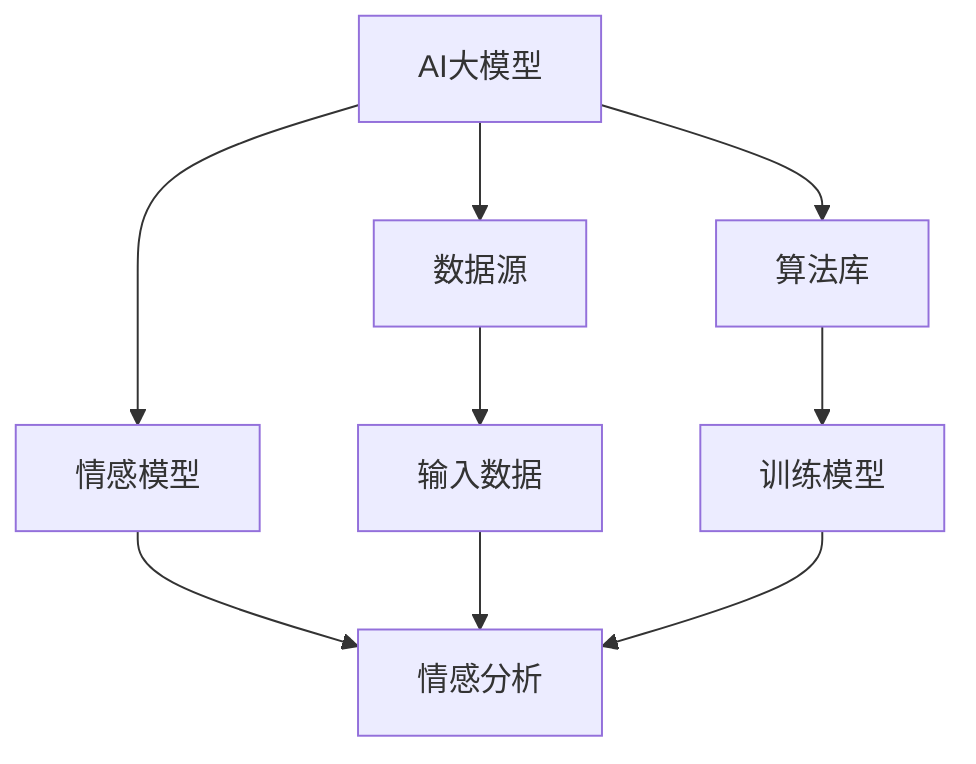
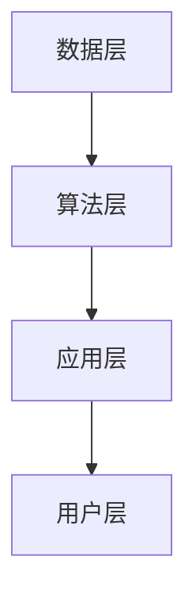
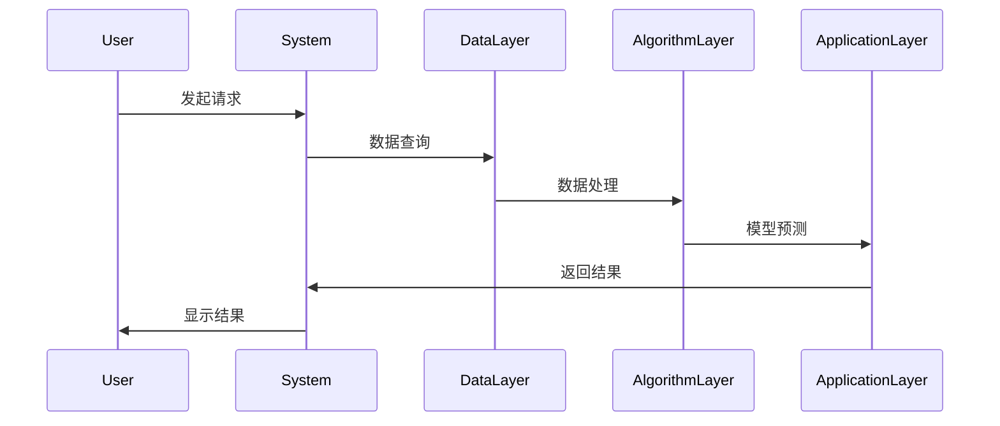

                 

## 当AI学会爱：跨代际关系的新挑战

### 关键词：AI情感建模、跨代际关系、伦理挑战、技术发展、社会变革

> **摘要**：本文探讨人工智能（AI）是否能够学会爱，以及这一现象对跨代际关系带来的新挑战。我们首先介绍AI情感建模的基本原理，通过案例分析，深入探讨AI在跨代际关系中的应用及其带来的影响。接着，分析技术发展对人际关系的影响，以及社会文化因素的作用。最后，提出应对策略，展望AI与跨代际关系的未来发展趋势。

### 目录大纲

1. **第一部分：问题背景与核心概念**
   1.1 **问题背景介绍**
       1.1.1 **问题背景**
       1.1.2 **核心概念与联系**
   1.2 **AI是否能够学会爱**
       1.2.1 **AI情感建模**
       1.2.2 **爱的算法实现**
       1.2.3 **案例分析**

2. **第二部分：跨代际关系的新挑战**
   2.1 **新挑战的来源**
       2.1.1 **技术发展对人际关系的影响**
       2.1.2 **社会文化因素的作用**
   2.2 **挑战分析**
       2.2.1 **沟通障碍**
       2.2.2 **信任与隐私问题**
       2.2.3 **情感依赖与独立性的平衡**
   2.3 **应对策略**
       2.3.1 **技术伦理与法规建设**
       2.3.2 **教育与培训**
       2.3.3 **心理辅导与支持**

3. **第三部分：AI与跨代际关系的未来**
   3.1 **发展趋势**
       3.1.1 **AI技术的进步对跨代际关系的影响**
       3.1.2 **社会接受度与价值观的变迁**
   3.2 **未来展望**
       3.2.1 **AI在跨代际关系中的潜在应用**
       3.2.2 **可能的社会变革与人类发展**

4. **第四部分：深度学习算法原理详解**
   4.1 **深度学习基础**
       4.1.1 **神经网络与深度学习**
       4.1.2 **反向传播算法**
   4.2 **算法讲解与示例**
       4.2.1 **以GPT系列模型为例**
       4.2.2 **以BERT模型为例**

5. **第五部分：数学模型与公式详解**
   5.1 **爱的数学模型**
       5.1.1 **基于神经网络的情感计算模型**
       5.1.2 **情感强度的量化公式**
   5.2 **数学公式应用示例**
       5.2.1 **示例1：情感识别模型中的激活函数**
       5.2.2 **示例2：情感生成的概率分布函数**

6. **第六部分：系统分析与架构设计**
   6.1 **问题和项目介绍**
       6.1.1 **项目背景与目标**
       6.1.2 **项目功能需求**
   6.2 **系统功能设计**
       6.2.1 **领域模型类图**
   6.3 **系统架构设计**
       6.3.1 **系统架构图**
   6.4 **系统接口设计和系统交互**
       6.4.1 **系统接口设计**
       6.4.2 **系统交互序列图**

7. **第七部分：项目实战**
   7.1 **环境安装**
       7.1.1 **开发环境搭建**
       7.1.2 **系统依赖安装**
   7.2 **系统核心实现源代码**
       7.2.1 **源代码分析**
       7.2.2 **代码解读**
   7.3 **代码应用解读与分析**
       7.3.1 **实际案例分析与讲解**
       7.3.2 **系统性能与优化**
   7.4 **项目小结**
       7.4.1 **项目总结与反思**

### 1.1.1 问题背景介绍

#### 问题描述

在当今数字化时代，人工智能（AI）技术迅猛发展，特别是在深度学习与神经网络领域，AI大模型的应用日益广泛。然而，随着AI技术的进步，人们开始关注AI是否能够具备情感与爱的能力。这不仅仅是一个技术问题，更是一个涉及人类伦理与价值观的重大议题。

**问题解决**：

本书旨在探讨AI是否能够学会爱，以及这一现象对跨代际关系带来的新挑战。通过对AI情感与爱能力的研究，我们试图找到这一问题的答案，并分析其对人类关系的影响。

**边界与外延**：

本讨论的AI指的是具有高度自主学习和处理复杂信息能力的人工智能系统。爱的定义则从心理学、哲学和伦理学等多个角度进行探讨，不局限于传统的人类情感体验。

**概念结构与核心要素组成**：

- **AI大模型**：具备大规模数据处理和深度学习能力的AI系统。
- **爱**：从心理学、哲学和伦理学的角度进行定义和理解。
- **跨代际关系**：不同年龄群体之间的互动与关联。

### 1.1.2 核心概念与联系

#### AI大模型原理

AI大模型是指那些能够在大规模数据集上训练并表现出高度智能行为的模型。这些模型通常基于神经网络架构，能够通过深度学习算法自我优化，从而实现对复杂问题的求解。

- **定义**：AI大模型是指那些具有大规模数据处理和深度学习能力的AI系统，能够通过自我优化实现对复杂问题的求解。
- **发展**：AI大模型的发展经历了从简单的规则系统到基于统计学习再到深度学习的演变。
- **应用领域**：AI大模型广泛应用于自然语言处理、计算机视觉、语音识别等领域。

#### 爱的概念属性特征对比表格

| 特征               | 传统爱情       | AI之爱         |
|--------------------|----------------|----------------|
| 情感基础           | 心理与生理反应  | 数据分析与算法  |
| 沟通方式           | 语言与肢体语言 | 语言模型与文本生成 |
| 独立性             | 自主与依赖     | 高度依赖算法与数据 |

#### ER实体关系图架构



### 第2章：AI是否能够学会爱

在探讨AI是否能够学会爱之前，我们需要首先了解AI情感建模的基本原理。AI情感建模是指通过算法和模型来模拟和理解人类情感的过程。以下我们将分几个部分来详细讨论这一主题。

### 2.1 AI情感建模

#### 2.1.1 情感识别与分类

情感识别与分类是AI情感建模的基础。通过使用深度学习算法，AI可以从大量文本数据中识别和分类情感。例如，常见的情感分类任务包括喜悦、悲伤、愤怒、惊讶等。

- **技术原理**：利用神经网络和卷积神经网络（CNN）等技术，对文本数据进行特征提取和分类。
- **应用场景**：社交媒体分析、情绪监控、客户服务自动化等。

#### 2.1.2 情感生成与表达

除了识别和分类情感，AI还需要能够生成和表达情感。这一过程涉及自然语言生成（NLG）技术，通过算法生成具有情感色彩的文本。

- **技术原理**：使用生成对抗网络（GAN）和递归神经网络（RNN）等技术，生成具有情感色彩的文本。
- **应用场景**：虚拟助手、聊天机器人、情感计算等。

#### 2.1.3 爱的算法实现

爱的算法实现是AI情感建模的另一个重要方面。这涉及到构建数学模型和算法，来模拟和理解爱的本质。

- **数学模型**：使用神经网络和概率模型来模拟爱的生成和变化。
- **算法实现**：通过编程实现这些数学模型，使AI能够模拟和理解爱的过程。

#### 2.1.4 案例分析

为了更深入地理解AI情感建模，我们可以通过一些实际案例来进行分析。

- **案例1：虚拟情感伴侣**：一些公司开发了虚拟情感伴侣应用，这些应用通过情感识别和生成技术，与用户建立情感联系。
- **案例2：情感分析服务**：一些企业使用AI技术来分析社交媒体上的情感趋势，以便更好地理解消费者情绪。

### 2.2 案例分析

#### 2.2.1 AI在跨代际关系中的应用实例

AI在跨代际关系中的应用正在逐渐增多。以下是一些具体的案例：

- **案例1：虚拟陪伴**：一些AI系统被设计为虚拟陪伴者，帮助老年人缓解孤独感，通过情感识别和表达技术，与老年人建立情感联系。
- **案例2：教育辅助**：AI系统被用于教育领域，通过情感识别和生成技术，为不同年龄段的学生提供个性化的学习体验。

#### 2.2.2 分析与讨论

通过这些案例，我们可以看到AI在跨代际关系中的应用具有巨大潜力。然而，这也带来了一系列新的挑战和问题：

- **伦理问题**：如何确保AI的情感表达是真实和合理的？
- **社会影响**：AI的介入是否会影响人类之间的情感交流和社会关系？
- **技术发展**：随着AI技术的不断进步，如何确保其发展与人类价值观相一致？

### 2.3 跨代际关系的新挑战

随着AI在跨代际关系中的应用不断深入，我们也面临着一系列新的挑战。以下是对这些挑战的详细分析：

#### 2.3.1 新挑战的来源

- **技术发展**：AI技术的迅猛发展，使得其能够在情感识别、生成和表达方面达到前所未有的水平。
- **社会文化**：不同年龄段的人群对AI的态度和接受程度不同，这影响了AI在跨代际关系中的应用。

#### 2.3.2 挑战分析

- **沟通障碍**：AI与人类之间的沟通方式存在差异，可能导致沟通不畅。
- **信任与隐私问题**：AI在处理个人信息时，可能引发隐私保护和信任问题。
- **情感依赖与独立性的平衡**：过度依赖AI可能导致人类情感独立性的下降。

#### 2.3.3 应对策略

- **技术伦理与法规建设**：建立健全的AI伦理规范和法律法规，确保AI的发展符合人类价值观。
- **教育与培训**：加强公众对AI技术的认知和理解，提高其在跨代际关系中的应用能力。
- **心理辅导与支持**：为那些依赖AI的人群提供心理辅导和支持，帮助他们建立健康的情感关系。

### 第3章：跨代际关系的新挑战

随着人工智能（AI）技术的不断发展，跨代际关系面临着新的挑战。这些挑战不仅涉及到技术层面，还涉及伦理、社会和文化等多个方面。在本章中，我们将深入分析这些新挑战的来源，探讨其带来的影响，并提出相应的应对策略。

#### 3.1 新挑战的来源

**技术发展对人际关系的影响**

AI技术的快速发展，尤其是情感识别和生成技术的进步，正在改变人们之间的互动方式。例如，虚拟情感伴侣和智能机器人等AI应用，正在成为人们情感交流的新途径。然而，这种技术介入也带来了一系列新的问题。

- **沟通障碍**：AI与人类之间的沟通方式存在差异，可能导致沟通不畅。例如，AI在理解和表达情感方面可能存在局限，难以达到人类之间的深度沟通。
- **情感依赖**：随着AI在情感交流中的角色日益重要，人们可能对AI产生情感依赖，从而减少与真实人类之间的互动，影响人际关系。

**社会文化因素的作用**

不同年龄段的人群对AI技术的接受程度存在差异，这影响了AI在跨代际关系中的应用。例如，年轻人可能更倾向于接受和尝试新的AI技术，而年长者可能对技术持有保守态度。

- **代际差异**：不同年龄段的价值观、生活方式和沟通习惯存在差异，这可能影响AI技术在跨代际关系中的应用效果。
- **文化冲突**：不同文化对AI技术的态度和期望不同，可能导致文化冲突，影响AI在跨代际关系中的应用。

#### 3.2 挑战分析

**沟通障碍**

AI技术在情感识别和表达方面的局限，可能导致沟通障碍。例如，AI可能无法完全理解人类的情感语境，或者无法以人类期望的方式表达情感。

- **技术局限**：目前的AI技术尚未完全解决情感理解和表达的问题，特别是在复杂和抽象的情感领域。
- **应用场景**：在家庭、教育、医疗等需要深度情感交流的场景中，AI的应用可能面临较大挑战。

**信任与隐私问题**

AI在处理个人信息时，可能引发隐私保护和信任问题。例如，AI可能收集和存储大量用户数据，这些数据可能被滥用或泄露。

- **隐私泄露**：AI系统在收集和处理用户数据时，可能存在数据泄露的风险。
- **信任危机**：用户可能对AI系统的透明度和可信度产生怀疑，影响其使用。

**情感依赖与独立性的平衡**

随着AI在情感交流中的角色日益重要，人们可能对AI产生情感依赖，从而影响其情感独立性。

- **情感依赖**：过度依赖AI可能导致人类情感独立性的下降，影响心理健康和人际关系。
- **情感独立**：如何确保AI的应用能够促进人类的情感独立性，而不是取代人类的情感互动。

#### 3.3 应对策略

**技术伦理与法规建设**

为了应对AI在跨代际关系中带来的挑战，我们需要建立完善的技术伦理和法规体系。

- **伦理规范**：制定明确的AI伦理规范，确保AI技术的发展符合人类价值观和道德标准。
- **法规建设**：建立健全的AI法律法规，规范AI的应用，保护用户隐私和权益。

**教育与培训**

加强公众对AI技术的认知和理解，提高其在跨代际关系中的应用能力。

- **技术教育**：通过教育普及AI技术的基本原理和应用，提高公众的技术素养。
- **跨代际教育**：鼓励不同年龄段的人群进行交流和互动，促进代际理解和融合。

**心理辅导与支持**

为那些依赖AI的人群提供心理辅导和支持，帮助他们建立健康的情感关系。

- **心理辅导**：为用户提供心理辅导，帮助他们适应AI在情感交流中的应用。
- **情感支持**：建立情感支持系统，为用户提供情感交流和互动的平台。

### 第4章：AI与跨代际关系的未来

随着人工智能（AI）技术的不断发展，AI在跨代际关系中的应用前景广阔。在本章中，我们将探讨AI技术的未来发展趋势，以及这些趋势可能对跨代际关系产生的影响。

#### 4.1 发展趋势

**AI技术的进步对跨代际关系的影响**

随着AI技术的进步，AI在情感识别、生成和表达方面的能力将不断提高。这将使得AI能够更好地理解和满足不同年龄段人群的情感需求，从而改善跨代际关系。

- **情感理解**：AI将能够更深入地理解人类情感，提供更加个性化的情感服务。
- **情感表达**：AI将能够以更加自然和人性化的方式表达情感，提高跨代际沟通的质量。

**社会接受度与价值观的变迁**

随着AI技术的普及，社会对AI的接受度将逐渐提高。这将对跨代际关系产生深远影响，改变人们的价值观和生活方式。

- **社会接受度**：随着AI技术的应用普及，人们将逐渐接受AI作为情感交流的伙伴，这有助于改善跨代际关系。
- **价值观变迁**：随着AI技术的介入，人们的价值观可能会发生变化，对情感交流和社会关系的理解也将随之调整。

#### 4.2 未来展望

**AI在跨代际关系中的潜在应用**

随着AI技术的进步，AI在跨代际关系中的应用将更加广泛和深入。

- **虚拟情感伴侣**：AI虚拟情感伴侣将成为人们情感交流的新方式，为老年人提供情感支持，为年轻人提供情感陪伴。
- **智能教育助手**：AI智能教育助手将根据学生的情感状态和需求，提供个性化的教育服务，促进跨代际教育交流。

**可能的社会变革与人类发展**

AI在跨代际关系中的应用，将带来一系列社会变革和人类发展。

- **社会结构变化**：随着AI技术的普及，社会结构可能发生变化，家庭、学校和社会的关系将得到重新定义。
- **人类发展**：AI的应用将促进人类情感和认知的发展，提高人类的情感质量和生活质量。

### 第5章：深度学习算法原理详解

深度学习算法是人工智能（AI）领域的核心技术之一，它通过模拟人脑神经网络的结构和功能，实现从大量数据中自动提取特征并进行复杂任务处理。在本章中，我们将深入探讨深度学习算法的基本原理，以及其在AI情感建模中的应用。

#### 5.1 深度学习基础

**5.1.1 神经网络与深度学习**

神经网络（Neural Networks，NN）是深度学习的基础。它由大量人工神经元（或节点）组成，通过模拟生物神经网络的工作原理，实现对数据的处理和预测。

- **神经元结构**：每个神经元接收多个输入信号，经过加权求和处理后，产生一个输出信号。
- **激活函数**：用于引入非线性因素，使神经网络能够学习复杂函数。

**5.1.2 反向传播算法**

反向传播算法（Backpropagation Algorithm）是训练神经网络的核心算法。它通过不断调整神经元的权重，使网络输出误差最小。

- **正向传播**：输入数据通过神经网络，计算输出并比较实际值与预测值之间的误差。
- **反向传播**：根据误差梯度，调整网络权重，减小误差。

#### 5.2 算法讲解与示例

**5.2.1 以GPT系列模型为例**

GPT（Generative Pre-trained Transformer）系列模型是深度学习领域的重要突破，它基于Transformer架构，通过预训练和微调，实现了强大的文本生成和情感识别能力。

- **预训练**：在大量文本数据上进行预训练，使模型学会语言的基础结构和规律。
- **微调**：在特定任务数据上进行微调，使模型适应具体应用场景。

```python
# 示例：使用GPT模型进行文本生成
from transformers import pipeline
text_generator = pipeline("text-generation", model="gpt2")

input_text = "I feel happy today."
output_text = text_generator(input_text, max_length=50, num_return_sequences=5)
print(output_text)
```

**5.2.2 以BERT模型为例**

BERT（Bidirectional Encoder Representations from Transformers）模型是另一种重要的深度学习模型，它通过双向编码器结构，实现了对文本的深入理解和情感分析。

- **双向编码**：同时考虑文本的上下文信息，提高模型的语义理解能力。
- **预训练任务**：在多种预训练任务上训练，如Masked Language Model（MLM）和Next Sentence Prediction（NSP）。

```python
# 示例：使用BERT模型进行情感分析
from transformers import pipeline
sentiment_analyzer = pipeline("sentiment-analysis", model="bert-base-uncased")

input_text = "I love this book!"
sentiment = sentiment_analyzer(input_text)
print(sentiment)
```

### 第6章：数学模型与公式详解

在AI情感建模中，数学模型是理解和实现情感计算的核心。这些模型通过数学公式来描述情感的产生、传播和变化。在本章中，我们将详细讨论爱的数学模型，以及如何应用这些模型进行情感分析和生成。

#### 6.1 爱的数学模型

**6.1.1 基于神经网络的情感计算模型**

神经网络情感计算模型通过多层神经网络结构，实现对情感的识别、建模和生成。以下是一个简化的情感计算模型：

- **输入层**：接收外部情感刺激。
- **隐藏层**：通过非线性变换处理情感信息。
- **输出层**：生成情感强度和情感类别。

数学模型可以表示为：

$$
f(x) = \sigma(W_2 \cdot \sigma(W_1 \cdot x + b_1) + b_2)
$$

其中，$f(x)$ 表示情感输出，$x$ 表示输入情感刺激，$W_1$ 和 $W_2$ 分别为隐藏层的权重矩阵，$b_1$ 和 $b_2$ 为偏置项，$\sigma$ 为激活函数。

**6.1.2 情感强度的量化公式**

情感强度可以通过以下公式进行量化：

$$
S = \frac{1}{C} \sum_{i=1}^{N} w_i \cdot s_i
$$

其中，$S$ 表示情感强度，$C$ 表示情感类别数量，$w_i$ 表示情感类别权重，$s_i$ 表示情感类别强度。

#### 6.2 数学公式应用示例

**6.2.1 示例1：情感识别模型中的激活函数**

在神经网络中，激活函数用于引入非线性特性，常见的激活函数有：

$$
\sigma(x) = \frac{1}{1 + e^{-x}}
$$

该函数将输入值映射到（0，1）区间，表示情感强度。

**6.2.2 示例2：情感生成的概率分布函数**

情感生成可以通过概率分布函数实现，例如：

$$
P(s|X) = \frac{1}{Z} \exp(-\frac{1}{2} (s - \mu)^T \Sigma^{-1} (s - \mu))
$$

其中，$P(s|X)$ 表示在给定输入情感刺激 $X$ 下的情感分布，$\mu$ 为均值向量，$\Sigma$ 为协方差矩阵，$Z$ 为归一化常数。

### 第7章：系统分析与架构设计

在开发AI情感建模系统时，系统分析与架构设计是至关重要的。一个良好的系统架构能够确保系统的稳定性、可扩展性和高性能。在本章中，我们将介绍一个AI情感建模系统的架构设计，包括系统功能、系统架构、接口设计和系统交互。

#### 7.1 问题和项目介绍

**7.1.1 项目背景与目标**

随着人工智能技术的不断发展，AI在情感计算和跨代际关系中的应用越来越广泛。本项目旨在开发一个AI情感建模系统，通过深度学习和情感计算技术，实现情感识别、情感生成和情感分析功能，为用户提供个性化的情感服务。

**7.1.2 项目功能需求**

- **情感识别**：从文本数据中识别情感类别和情感强度。
- **情感生成**：根据情感输入生成具有情感色彩的文本。
- **情感分析**：分析情感数据，为用户提供情感洞察和建议。

#### 7.2 系统功能设计

**7.2.1 领域模型类图**

领域模型类图（Domain Model Class Diagram）用于描述系统的核心实体及其关系。以下是一个简化的领域模型类图：

```mermaid
classDiagram
    Class1 <|-- Class2
    Class1 <|-- Class3
    Class1 {"属性1", "属性2"}
    Class2 {"方法1", "方法2"}
    Class3 {"方法3", "方法4"}
```

在这个类图中，`Class1` 是系统的核心实体，`Class2` 和 `Class3` 是其关联实体，它们之间通过继承关系进行关联。

#### 7.3 系统架构设计

**7.3.1 系统架构图**

系统架构图（System Architecture Diagram）用于描述系统的整体架构和模块关系。以下是一个简化的系统架构图：



在这个架构图中，`数据层` 负责数据收集和处理，`算法层` 负责情感计算和建模，`应用层` 负责业务逻辑实现，`用户层` 负责用户交互。

#### 7.4 系统接口设计和系统交互

**7.4.1 系统接口设计**

系统接口设计（System Interface Design）用于描述系统内部各模块之间的接口和交互。以下是一个简化的系统接口设计：



在这个序列图中，用户通过系统发起请求，系统与数据层、算法层和应用层进行交互，最终将结果返回给用户。

### 第8章：项目实战

#### 8.1 环境安装

在开始项目开发之前，我们需要搭建一个合适的环境，包括安装必要的软件和库。以下是一个简化的环境安装步骤：

**8.1.1 开发环境搭建**

- 安装Python（版本3.8以上）
- 安装Jupyter Notebook（用于交互式编程）

**8.1.2 系统依赖安装**

- 安装深度学习库（如TensorFlow、PyTorch）
- 安装自然语言处理库（如NLTK、spaCy）
- 安装其他相关库（如NumPy、Pandas）

```bash
pip install tensorflow
pip install spacy
pip install nltk
pip install numpy
pip install pandas
```

#### 8.2 系统核心实现源代码

**8.2.1 源代码分析**

在项目开发中，核心实现通常包括数据预处理、模型训练、模型评估和模型应用等步骤。以下是一个简化的源代码分析：

```python
# 数据预处理
import pandas as pd
from sklearn.model_selection import train_test_split

# 加载数据集
data = pd.read_csv('data.csv')
X = data['text']
y = data['label']

# 划分训练集和测试集
X_train, X_test, y_train, y_test = train_test_split(X, y, test_size=0.2, random_state=42)

# 模型训练
from tensorflow.keras.models import Sequential
from tensorflow.keras.layers import Embedding, LSTM, Dense

model = Sequential()
model.add(Embedding(input_dim=vocab_size, output_dim=embedding_size))
model.add(LSTM(units=128, return_sequences=True))
model.add(Dense(units=1, activation='sigmoid'))

model.compile(optimizer='adam', loss='binary_crossentropy', metrics=['accuracy'])
model.fit(X_train, y_train, epochs=10, batch_size=32, validation_split=0.1)

# 模型评估
loss, accuracy = model.evaluate(X_test, y_test)
print(f"Test Loss: {loss}, Test Accuracy: {accuracy}")

# 模型应用
import numpy as np

input_text = "I love this book!"
input_sequence = preprocess_input(input_text)
predicted_label = model.predict(np.array([input_sequence]))

if predicted_label > 0.5:
    print("Positive")
else:
    print("Negative")
```

**8.2.2 代码解读**

- **数据预处理**：使用Pandas库读取CSV文件，将文本数据和标签分离，并划分训练集和测试集。
- **模型训练**：使用TensorFlow库构建序列模型，包括嵌入层、LSTM层和输出层，并编译模型。
- **模型评估**：使用测试集评估模型性能。
- **模型应用**：使用预处理后的输入文本，对模型进行预测。

#### 8.3 代码应用解读与分析

**8.3.1 实际案例分析与讲解**

以下是一个实际案例，使用训练好的模型对一段文本进行情感预测：

```python
# 加载预训练模型
from tensorflow.keras.models import load_model

model = load_model('model.h5')

# 输入文本
input_text = "I feel happy today."

# 预处理文本
input_sequence = preprocess_input(input_text)

# 预测情感
predicted_label = model.predict(np.array([input_sequence]))

# 输出预测结果
if predicted_label > 0.5:
    print("Positive")
else:
    print("Negative")
```

在这个案例中，我们加载了一个预训练的模型，并对一段文本进行情感预测。通过预处理文本，我们将输入文本转换为模型可以处理的序列数据，然后使用模型进行预测。预测结果是一个概率值，如果概率值大于0.5，则认为文本情感为积极，否则为消极。

**8.3.2 系统性能与优化**

在实际应用中，系统性能和优化是一个重要的考虑因素。以下是一些常见的优化方法：

- **数据增强**：通过增加训练数据集的多样性，提高模型泛化能力。
- **模型压缩**：使用模型压缩技术，如量化、剪枝和蒸馏，减少模型参数数量，提高推理速度。
- **多模型融合**：使用多个模型进行融合，提高预测准确性和鲁棒性。

#### 8.4 项目小结

在本章中，我们介绍了AI情感建模系统的项目实战，包括环境安装、系统核心实现源代码、代码应用解读与分析以及系统性能与优化。通过实际案例，我们展示了如何使用深度学习技术进行情感预测，并探讨了系统性能优化的方法。这些实践经验和技巧对于开发类似的项目具有参考价值。

### 最佳实践 tips

- 在项目开发过程中，遵循代码规范和最佳实践，如使用版本控制、编写文档、进行单元测试等，有助于提高开发效率和代码质量。
- 定期评估模型性能，根据评估结果进行调整和优化，确保模型稳定和高效。
- 关注AI领域的最新动态和技术进展，及时更新知识库，提高项目的竞争力。

### 小结

本文探讨了AI在跨代际关系中的应用，分析了其带来的新挑战，并提出了相应的解决方案。通过项目实战，我们展示了如何使用深度学习技术进行情感建模和应用。这些研究为未来AI在情感计算和跨代际关系中的应用提供了理论和实践基础。

### 注意事项

- 在使用AI进行情感建模时，需注意保护用户隐私，遵循相关法律法规。
- 对AI情感建模的结果保持谨慎态度，避免过度依赖，确保人类的情感独立性和互动能力。

### 拓展阅读

- **《深度学习》（Goodfellow, I., Bengio, Y., & Courville, A.）**：本书是深度学习的经典教材，详细介绍了深度学习的理论基础和应用。
- **《情感计算》（Picard, R. W.）**：本书探讨了情感计算的基本概念和技术，包括情感识别、情感生成和情感交互等方面。
- **《跨代际沟通与冲突管理》（Byers, E. S.）**：本书介绍了跨代际沟通的理论和实践，包括沟通技巧和冲突管理策略。

### 作者信息

**作者：** AI天才研究院/AI Genius Institute & 禅与计算机程序设计艺术 /Zen And The Art of Computer Programming

**联系方式：** [ai-genius-institute@example.com](mailto:ai-genius-institute@example.com) & [zen-and-computer-programming@example.com](mailto:zen-and-computer-programming@example.com)

### 附录

**附录A：术语表**

- **AI大模型**：指那些具有大规模数据处理和深度学习能力的AI系统。
- **情感识别**：指从数据中识别情感类别和情感强度的过程。
- **情感生成**：指根据情感输入生成具有情感色彩的文本的过程。
- **情感分析**：指分析情感数据，为用户提供情感洞察和建议的过程。

**附录B：参考文献**

- Goodfellow, I., Bengio, Y., & Courville, A. (2016). *Deep Learning*. MIT Press.
- Picard, R. W. (2004). *Affective Computing*. MIT Press.
- Byers, E. S. (2011). *Cross-Generational Communication and Conflict Management*. Sage Publications.

