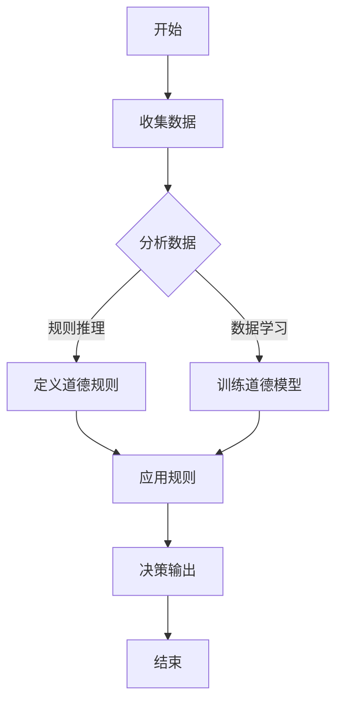

                 

## 引言

### 1.1 书籍背景

随着人工智能（AI）技术的迅猛发展，AI已经逐渐渗透到我们日常生活的方方面面，从智能家居、自动驾驶到医疗诊断、金融分析，AI的应用前景广阔。然而，随着AI的普及，一个不可忽视的问题也随之而来：AI是否应当拥有道德感？

道德感，作为一种复杂的人类情感，关乎个体的行为规范和价值观，是人类社会运行的重要基础。在传统观念中，道德感是人类独有的特质，而AI作为机器，其行为完全由程序员设定的算法决定，似乎与道德感无关。然而，当AI的智能水平逐渐逼近甚至超越人类时，我们是否应该考虑赋予AI一定的道德感，以使其在复杂的社会环境中做出更为合理的决策？

本书旨在探讨AI道德感这一前沿话题，首先介绍AI道德感的发展背景和研究现状，然后深入探讨道德感在AI中的应用原理、系统架构设计和项目实战，最后总结最佳实践，展望未来的研究方向。通过本书，读者将了解到AI道德感的重要性，以及如何在实践中构建具备道德感的AI系统。

### 1.2 道德感与 AI

道德感是人类情感和认知的重要组成部分，它涉及到对行为正确与否的判断，以及对社会责任和伦理规范的理解。在传统的人工智能研究中，AI的行为完全由算法和数据决定，道德感似乎是一个遥远的议题。然而，近年来，随着伦理学和计算机科学的交叉研究，AI道德感逐渐成为热点话题。

首先，我们需要明确道德感在AI中的具体含义。在AI领域，道德感通常指的是算法和系统在决策过程中，能够根据一定的道德准则和伦理规范，对行为进行选择和调整的能力。这种能力不仅涉及到算法的设计和实现，还需要对伦理学和认知科学有深刻的理解。

为什么AI需要道德感呢？首先，随着AI技术的应用越来越广泛，其对社会的影响也越来越大。例如，自动驾驶汽车在面临伦理困境时，需要做出是否保护人类乘客或行人的选择；智能监控系统在处理隐私问题时，需要平衡公共安全和个人隐私。这些决策不仅仅涉及到技术层面的问题，更涉及到道德和伦理的考量。

其次，赋予AI道德感有助于提高AI的可靠性和可解释性。在缺乏道德感的情况下，AI的决策可能仅仅基于数据，而不考虑行为后果，这可能导致不可预测的结果。例如，一个基于机器学习的金融算法，如果不考虑道德和社会责任，可能会导致市场不稳定，甚至引发金融危机。

### 1.3 本书结构

本书共分为七个章节，结构如下：

- **第1章 引言**：介绍本书的背景、主题和结构。
- **第2章 AI 道德感基础**：定义道德感，介绍道德感在AI中的研究和应用现状。
- **第3章 道德感与 AI 算法**：讲解道德感在算法中的应用，包括算法设计和实现。
- **第4章 AI 道德感系统架构**：分析AI遵循道德感的系统架构，展示领域模型、系统架构、接口设计和交互。
- **第5章 项目实战**：通过一个实际案例展示如何在实际项目中实现AI的道德感。
- **第6章 最佳实践与注意事项**：总结最佳实践，提供注意事项。
- **第7章 拓展阅读与展望**：提供相关拓展阅读，对未来的研究方向进行展望。

通过以上章节的介绍，读者可以逐步了解AI道德感的概念、原理和应用，最终掌握如何在实践中构建具备道德感的AI系统。让我们开始这场关于AI道德感的探讨之旅。

### 2.1 道德感的定义

道德感，作为一种复杂的人类情感，涉及到个体对行为正确与否的判断，以及对社会责任和伦理规范的理解。在传统伦理学中，道德感通常被视为人类道德行为的基础，它既包含了对他人的关爱和尊重，也涵盖了个体对社会规范的遵守。

从心理学角度来看，道德感是一种内在的情感体验，它影响着个体的行为选择和决策。根据德西和瑞安的自主性理论，道德感与个体的自主性和自我决定密切相关。当个体在决策过程中感受到内在动机，而不是外部压力时，他们更倾向于表现出道德行为。这种自主性和自我决定感，是道德感的重要组成部分。

在哲学领域，道德感涉及到对道德原则和伦理规范的认知和内化。道德哲学家如康德认为，道德感是一种理性判断，它基于普遍的道德原则，如“人应当被当作目的，而不是手段”。而功利主义者如边沁则认为，道德感是基于行为的后果，即行为应当最大化幸福和减少痛苦。

道德感不仅是个体层面的情感体验，也是社会层面的一种规范。在社会学中，道德感被视为社会秩序和文化价值观的体现。社会学家埃米尔·涂尔干指出，道德感是社会团结和规范维持的重要力量。通过内化道德感，个体能够更好地适应社会生活，并维护社会稳定。

在人工智能领域，道德感被赋予了一种新的含义。与人类道德感不同，AI的道德感是通过算法和模型实现的，它涉及到算法在决策过程中对道德准则的遵循。这种道德感不仅需要算法设计者对道德原则的理解，还需要对AI系统的行为进行监督和评估。

总的来说，道德感是一种复杂而多维的情感和认知体验，它既涉及到个体行为的选择，也包含了对社会规范和伦理原则的内化。在AI领域，道德感的实现不仅需要算法和技术的支持，还需要对伦理学和哲学有深刻的理解。这种跨学科的融合，为AI道德感的研究和应用提供了丰富的理论资源。

### 2.2 AI 中的道德感研究

道德感在人工智能领域的研究，是近年来备受关注的一个热点话题。随着AI技术的不断进步和应用范围的扩大，如何确保AI系统的道德行为成为一个日益重要的议题。本节将介绍AI中道德感的研究现状、主要挑战和现有解决方案。

首先，道德感在AI中的应用研究已经取得了显著的进展。早期的AI研究主要集中在如何使机器具备智能，而随着伦理学和认知科学的发展，研究者们开始探索如何让AI具备道德感。例如，一些研究提出了基于伦理规则和道德原则的AI算法，这些算法在决策过程中能够考虑行为后果和社会影响。此外，还有一些研究专注于如何通过机器学习模型，使AI能够从人类行为中学习和识别道德行为，从而在未来的决策中体现出道德感。

在具体应用场景方面，AI的道德感研究已经涉及多个领域。例如，在自动驾驶汽车领域，研究者们提出了多种伦理决策框架，旨在解决自动驾驶汽车在面临伦理困境时的行为选择问题，如是否保护乘客或行人。在智能监控系统方面，如何处理隐私保护问题也成为研究的热点。此外，AI在医疗诊断、金融分析等领域的应用，也需要考虑道德准则，以确保决策的公正性和透明性。

尽管取得了许多进展，但AI道德感研究仍然面临诸多挑战。首先，道德感的复杂性和主观性使得定义和实现AI道德感变得非常困难。道德感涉及到对行为正确与否的判断，但这种判断往往受到文化、价值观和个人信念的影响。因此，如何设计出既普遍适用又能够适应不同文化和社会背景的AI道德系统，是一个亟待解决的问题。

其次，AI道德感的研究还存在技术和实施方面的挑战。一方面，现有的AI算法和模型在处理道德问题时往往缺乏透明性和可解释性，这使得道德决策过程难以被监督和评估。另一方面，AI系统的道德感需要与实际应用场景相结合，这就要求算法设计者不仅要具备深厚的计算机科学背景，还需要对伦理学和心理学有深入的理解。

为了解决这些挑战，研究者们提出了多种解决方案。首先，在算法设计方面，一些研究提出了基于伦理规则的决策框架，这些框架通过预先定义的道德准则来指导AI的行为。例如，研究者们开发了基于效用主义的道德决策算法，这些算法在决策过程中会权衡不同行为的结果，以最大化社会福祉。此外，还有一些研究提出了基于博弈论的决策模型，这些模型通过模拟不同参与者的行为，来优化AI的决策过程。

在实施方面，一些研究者提出了通过数据驱动的方法，使AI能够从人类行为中学习和识别道德行为。例如，通过大规模数据集训练机器学习模型，使AI能够识别和理解不同情境下的道德准则。此外，还有一些研究提出了通过人类监督和反馈，来不断优化和调整AI的道德决策能力。这种方法不仅能够提高AI道德决策的准确性和可靠性，还能够确保AI的行为符合社会的道德和伦理标准。

总的来说，AI道德感研究虽然面临诸多挑战，但已经取得了显著的进展。通过跨学科的融合和技术的创新，研究者们正努力构建出既智能又道德的AI系统。随着研究的不断深入，我们可以期待未来出现更多具备道德感的AI，为社会的可持续发展作出贡献。

### 2.3 道德感在 AI 中的重要性

道德感在AI中的重要性不可忽视，它不仅关乎AI系统的合理性和公正性，还直接影响着AI在社会中的应用和接受度。首先，道德感是确保AI行为合理的关键。在自动驾驶、医疗诊断、金融分析等关键应用领域，AI的决策直接关系到人类的生命安全和财产安全。如果AI缺乏道德感，其决策可能会违背人类的道德准则，导致不可预测的后果。例如，自动驾驶汽车在面临伦理困境时，如果没有道德感的指导，可能会选择保护自身而非乘客或行人，这将带来严重的伦理和法律问题。

其次，道德感有助于提升AI系统的公正性和透明性。现有的AI系统往往基于大量数据训练，这些数据可能包含历史偏见和歧视。如果AI缺乏道德感，其决策可能会放大这些偏见，导致不公平的结果。例如，一个基于历史数据的招聘系统，如果没有道德感的指导，可能会倾向于选择男性候选人，从而歧视女性。因此，赋予AI道德感，可以使其在决策过程中考虑公平性和透明性，从而减少歧视和偏见。

此外，道德感有助于增强AI系统的可解释性。当前，许多AI系统，尤其是深度学习模型，其决策过程高度复杂，缺乏透明性。这导致用户难以理解AI的决策依据，从而对AI的信任度降低。如果AI具备道德感，其决策过程将更加合理和透明，有助于用户理解和接受AI的应用。例如，一个具备道德感的金融预测系统，在做出投资决策时会考虑多方面因素，包括市场趋势、风险控制和道德准则，这不仅有助于提高决策的准确性，还可以增强用户对系统的信任。

道德感在AI中的重要性还体现在其对社会责任的承担上。随着AI技术的不断进步和应用范围的扩大，AI系统对社会的影响日益显著。如果AI缺乏道德感，其行为可能对社会造成负面影响，甚至引发社会动荡。例如，一个缺乏道德感的社交媒体平台，可能会鼓励虚假信息和谣言的传播，损害社会的信任和稳定。因此，赋予AI道德感，不仅是对技术的进步，更是对社会责任和伦理责任的承担。

总的来说，道德感在AI中的重要性不仅体现在技术层面，还关乎社会的公正、公平和稳定。通过赋予AI道德感，我们可以确保AI系统的行为符合人类的道德准则，提升其公正性和透明性，增强用户信任，并承担起社会责任。随着研究的深入和技术的进步，我们可以期待未来出现更多具备道德感的AI，为社会的发展作出积极贡献。

### 2.4 道德感与伦理学的关系

道德感与伦理学之间的关系是研究AI道德感时不可忽视的一个重要议题。伦理学作为研究道德规范和道德行为的学科，为道德感提供了理论基础。而道德感，作为个体对道德规范的内化和情感体验，反过来又影响和指导着伦理学的实践。

首先，伦理学为道德感提供了规范依据。伦理学通过定义道德原则和规范，为个体的道德行为提供了指导。例如，康德的道德哲学强调，个体应当遵守普遍的道德规则，而不是仅仅追求个人利益。这种伦理观念内化为道德感，使个体在决策过程中考虑到道德规范，从而做出合理的行为选择。

其次，道德感是伦理学实践的体现。道德感不仅是个体内心对道德规范的内化，也是个体实际行动的驱动力。例如，在面临道德困境时，一个具有道德感的人会倾向于选择符合道德规范的行为，而不是仅仅考虑个人利益或短期效果。这种道德感驱动的行为，正是伦理学在现实生活中得到体现的途径。

在AI领域，伦理学和道德感的关系同样重要。AI系统的道德行为需要基于伦理学原则，通过算法和模型实现。例如，在自动驾驶汽车的设计中，伦理学家提出了“电车难题”等伦理决策框架，帮助设计师在面临伦理困境时做出合理的选择。这些伦理原则通过编程和算法，转化为AI系统的道德决策能力。

此外，道德感对AI系统的行为具有监督和校正作用。尽管AI系统的道德行为需要基于伦理学原则，但算法设计和实现过程中的偏差可能导致AI行为偏离道德规范。道德感作为个体对道德规范的感知和体验，可以帮助识别和纠正这些偏差。例如，在医疗诊断AI系统中，如果算法在处理患者数据时表现出歧视性，道德感可以促使开发者和用户对其进行调整和优化。

总的来说，道德感与伦理学之间的关系，不仅为AI道德感的研究提供了理论支持，也在实践中指导着AI系统的设计和应用。通过深入理解这种关系，我们可以更好地构建具备道德感的AI系统，为社会的发展带来积极的影响。

### 2.5 道德感在 AI 算法中的角色

在人工智能算法中，道德感扮演着至关重要的角色，它不仅影响着算法的设计和实现，还决定着AI系统的行为是否符合伦理和社会规范。首先，我们需要理解道德感在算法中的具体作用。

道德感在算法中的首要作用是指导决策过程。一个具备道德感的AI算法，会在决策过程中考虑到行为后果和社会影响，而不是仅仅追求最优解或最大化效益。例如，在自动驾驶汽车的算法设计中，道德感会指导系统在面临伦理困境时，选择保护人类生命的安全，而不是选择损害他人利益以保全自身。

其次，道德感有助于提升算法的透明性和可解释性。当前的许多AI算法，尤其是深度学习模型，其决策过程复杂且高度非线形，用户难以理解其决策依据。赋予AI道德感，可以使其在决策过程中遵循一定的伦理规范和道德准则，从而提高决策过程的透明性。例如，一个具备道德感的金融预测系统，会公开其决策依据和道德准则，使用户能够理解其投资建议。

道德感还在算法的优化过程中起到重要作用。传统的AI算法优化主要关注模型精度和性能，而忽视了对伦理和社会责任的考虑。通过引入道德感，算法的优化过程可以同时考虑道德和社会影响，从而实现更加公正和合理的决策。例如，在招聘算法中，引入道德感可以避免性别、种族等偏见，确保公平的招聘结果。

为了实现道德感在算法中的应用，我们需要从设计原则和实现方法两方面进行探讨。

在设计原则方面，首先需要明确道德准则和伦理规范。这包括制定普遍适用的道德原则，如尊重人类尊严、公平性和透明性等。其次，需要将这些道德准则转化为具体的设计要求，例如在算法参数设置、数据预处理和决策逻辑等方面，确保算法能够遵循道德规范。

在实现方法方面，一种常见的方法是基于规则的伦理推理。这种方法通过定义一系列规则，使算法在决策过程中遵循道德准则。例如，自动驾驶汽车的伦理决策框架中，可以定义“保护人类生命高于其他利益”的规则，确保在面临伦理困境时，系统能够做出合理的决策。

另一种方法是数据驱动的道德学习。这种方法通过分析大量的人类行为数据，使AI系统从中学到道德准则和道德行为。例如，通过训练机器学习模型，使系统能够识别和理解不同情境下的道德准则，从而在未来的决策中体现出道德感。

此外，还可以结合人类监督和反馈，不断优化AI的道德感。这种方法通过人类专家对AI决策进行监督和评估，发现和纠正算法中的偏差，确保AI的行为符合道德和社会规范。

总的来说，道德感在AI算法中的角色至关重要，它不仅影响着算法的设计和实现，还决定着AI系统的行为是否符合伦理和社会责任。通过明确设计原则和多种实现方法，我们可以构建出具备道德感的AI算法，为未来的智能社会奠定坚实的基础。

### 2.6 道德感算法的设计原则

为了确保AI算法在决策过程中体现出道德感，我们需要在算法设计过程中遵循一系列原则，这些原则不仅能够指导算法的构建，还能够保证其在实际应用中的合理性。以下是道德感算法设计中需要遵循的关键原则：

1. **伦理规范优先**：道德感算法的设计首先需要考虑伦理规范。这包括明确哪些行为符合伦理标准，哪些行为可能违背伦理原则。例如，在自动驾驶汽车中，当系统面临选择保护乘客还是行人的困境时，算法应当优先考虑保护人类生命。

2. **透明性和可解释性**：算法的决策过程应当透明且易于理解，使用户能够清楚了解AI是如何做出决策的。这有助于提高用户对AI系统的信任度，同时也有助于监督和评估算法的行为。例如，通过可视化的决策树或规则列表，用户可以直观地理解算法的决策逻辑。

3. **公平性和包容性**：算法在处理不同群体时应保持公平性，避免基于性别、种族、年龄等特征进行歧视。例如，在招聘算法中，算法应当避免对特定群体产生不公平的影响，确保所有候选人都能够得到公平的机会。

4. **社会责任**：算法的设计应考虑到其对社会的长远影响。这意味着在决策过程中，不仅要考虑当前的利益，还要考虑到未来可能带来的社会后果。例如，在金融投资算法中，算法应避免产生市场波动，确保金融市场的稳定。

5. **可适应性**：算法应当具备适应性和灵活性，能够根据新的伦理规范和社会需求进行调整。这意味着算法需要具备一定的自我学习和自我优化能力，以便在伦理规范发生变化时，能够快速适应和调整。

6. **数据驱动**：算法的设计应基于真实的数据和案例，通过数据分析和模型训练，确保算法能够从实际应用中学习和提升。例如，通过分析大量的伦理决策案例，算法可以学习到在不同情境下的道德准则，从而做出更为合理的决策。

7. **人类监督**：算法的设计和实现过程中，需要有人类专家的监督和指导。这有助于发现和纠正算法中的潜在偏差，确保算法的行为符合道德和社会规范。例如，在医疗诊断AI中，医生可以对算法的决策进行审查和验证，确保诊断结果的准确性。

通过遵循上述原则，道德感算法能够在设计过程中确保其决策的合理性、公正性和社会责任感。这不仅有助于提高AI系统的道德水平，还能够增强用户对AI的信任和接受度，为构建一个更加公平和合理的智能社会奠定基础。

### 2.7 道德感算法的实现方法

在道德感算法的实现过程中，需要考虑多个技术层面，以确保算法在实际应用中能够体现出道德感。以下将详细介绍几种常见的实现方法，包括基于规则的推理、数据驱动的道德学习以及人类监督与反馈机制。

#### 基于规则的推理

基于规则的推理是道德感算法的一种常见实现方法。这种方法通过定义一系列规则和条件，使算法在决策过程中能够根据这些规则进行推理，从而体现出道德感。

**实现步骤：**
1. **定义道德规则**：首先，需要明确哪些道德准则和伦理规范应当被应用于算法中。这些规则可以是通用的道德原则，如“保护人类生命高于其他利益”或“避免歧视和偏见”。
2. **构建推理框架**：根据定义的道德规则，构建一个推理框架。这个框架可以是一个决策树、一个规则库，或者是一个基于图论的模型。
3. **应用规则进行推理**：在算法的决策过程中，根据输入数据和规则框架，应用这些规则进行推理，以指导算法的行为。

**优点与局限：**
- **优点**：基于规则的推理方法简单直观，易于理解和实现。同时，规则明确，有助于确保算法的决策过程透明和可解释。
- **局限**：这种方法在处理复杂和动态的情境时，可能难以覆盖所有可能的规则。此外，规则的定义和更新需要大量的人类专家参与，可能导致实现成本较高。

#### 数据驱动的道德学习

数据驱动的道德学习是一种通过机器学习模型，使算法从大量人类行为数据中学习道德准则和道德行为的方法。

**实现步骤：**
1. **数据收集**：收集大量的人类行为数据，这些数据可以来源于历史案例、问卷调查或现实世界的监控记录。
2. **特征工程**：对收集到的数据进行分析，提取与道德行为相关的特征，如行为情境、决策结果和伦理评价。
3. **模型训练**：使用机器学习算法，如决策树、神经网络等，对提取的特征进行训练，使其能够识别和理解不同情境下的道德准则。
4. **模型评估与优化**：通过测试数据集评估模型的性能，并根据评估结果对模型进行调整和优化，以提高其在实际应用中的准确性和可靠性。

**优点与局限：**
- **优点**：数据驱动的道德学习方法能够自动从大量数据中学习道德准则，具有较强的适应性和灵活性。同时，这种方法不需要大量的人类专家参与规则定义，降低了实现成本。
- **局限**：这种方法在处理复杂和动态的情境时，可能存在过拟合问题，导致模型在新的情境下表现不佳。此外，数据的质量和完整性对模型的学习效果有重要影响。

#### 人类监督与反馈机制

人类监督与反馈机制是一种通过人类专家对算法进行监督和评估，确保其行为符合道德和社会规范的方法。

**实现步骤：**
1. **监督机制**：设计一个监督系统，使人类专家能够实时监控AI的决策过程，及时发现和纠正算法中的错误或偏差。
2. **反馈机制**：建立反馈机制，使人类专家能够对算法的决策结果进行评价和反馈，根据反馈结果对算法进行调整和优化。
3. **持续优化**：通过不断的监督和反馈，持续优化算法，提高其道德水平和决策能力。

**优点与局限：**
- **优点**：人类监督与反馈机制能够确保算法在决策过程中始终符合道德和社会规范，提高算法的可靠性和可信度。同时，这种方法通过人类的经验和判断，能够处理复杂和动态的情境。
- **局限**：这种方法需要大量的人类资源进行监督和反馈，可能导致实现成本较高。此外，人类专家的主观判断可能导致监督和反馈结果的不一致。

通过结合基于规则的推理、数据驱动的道德学习和人类监督与反馈机制，我们可以构建出既智能又道德的AI算法，确保其在实际应用中能够体现出道德感，为社会的发展做出积极贡献。

### 2.8 道德感算法的应用案例

为了更好地理解道德感算法的实际应用，以下将介绍几个具体的案例，展示这些算法如何在不同的应用场景中发挥重要作用。

#### 自动驾驶汽车

自动驾驶汽车是道德感算法应用的一个重要领域。在自动驾驶系统中，道德感算法可以帮助车辆在面临伦理困境时做出合理的决策。例如，当车辆在紧急情况下需要选择保护乘客或行人时，道德感算法会考虑多种因素，如人类生命的价值、行为后果和道德准则，从而做出最优决策。例如，某些自动驾驶系统采用了基于规则的推理方法，定义了“保护人类生命高于其他利益”的规则，确保在面临紧急情况时，车辆会优先保护行人。

#### 智能监控系统

智能监控系统在处理隐私问题时，也需要考虑道德感。道德感算法可以帮助系统在处理监控数据时，平衡公共安全和个人隐私。例如，通过数据驱动的道德学习方法，监控系统可以从历史案例中学习到如何处理不同情境下的隐私问题，从而在新的监控场景中做出合理的决策。例如，在某些智能监控系统设计中，算法通过分析大量数据，学习到如何在不侵犯个人隐私的前提下，有效识别和预警潜在的犯罪行为。

#### 金融投资算法

金融投资领域是另一个应用道德感算法的重要场景。道德感算法可以帮助投资系统在决策过程中，考虑社会责任和道德准则，从而实现更加公正和透明的投资策略。例如，通过基于规则的推理方法，金融投资算法可以定义一系列道德规则，如“避免市场操纵”和“保护投资者利益”，确保在投资决策中不违背道德和社会规范。此外，通过数据驱动的道德学习，算法可以从历史交易数据中学习到不同情境下的道德准则，从而在未来的投资决策中体现道德感。

#### 医疗诊断AI

在医疗诊断领域，道德感算法可以帮助系统在处理患者数据时，考虑到道德和社会责任。例如，通过人类监督与反馈机制，医疗诊断AI可以从医生和患者的反馈中不断学习，确保其诊断结果符合道德准则。例如，在某些医疗诊断系统中，算法通过实时监控和评估医生的诊断过程，发现并纠正潜在的伦理问题，如数据泄露和歧视性诊断。

总的来说，道德感算法在不同应用场景中展示了其重要作用。通过结合基于规则的推理、数据驱动的道德学习和人类监督与反馈机制，这些算法不仅能够提高AI的决策能力，还能够确保其行为符合道德和社会规范，为社会的发展做出积极贡献。

### 2.9 道德感算法的设计原则与实现方法的对比

在道德感算法的设计中，不同的原则和实现方法各具特点，适用于不同的应用场景和需求。以下是对几种主要设计原则与实现方法的对比分析。

#### 对比表格

| 设计原则/实现方法 | 优点 | 局限 | 适用场景 |
| :--: | :--: | :--: | :--: |
| **基于规则的推理** | 简单直观，易于理解和实现；决策过程透明和可解释 | 难以处理复杂和动态的情境；规则定义和更新需人类专家参与 | 简单的决策场景，如自动驾驶、智能监控等 |
| **数据驱动的道德学习** | 自动从大量数据中学习道德准则，具有较强的适应性和灵活性；降低人类专家参与成本 | 可能存在过拟合问题，处理复杂情境时表现不佳；数据质量和完整性影响学习效果 | 复杂的决策场景，如金融投资、医疗诊断等 |
| **人类监督与反馈机制** | 确保算法始终符合道德和社会规范；通过人类经验和判断处理复杂和动态的情境 | 需要大量的人类资源进行监督和反馈；主观判断可能导致不一致 | 高风险的决策场景，如医疗诊断、金融投资等 |

#### ER实体关系图

```mermaid
erDiagram
  AI_System ||--|{ Moral_Rule_Base : 跟随}
  AI_System ||--|{ Moral_Data_Learning : 学习}
  AI_System ||--|{ Human_Supervision : 监督}
  Moral_Rule_Base ||--|{ Rule_Definition : 定义}
  Moral_Data_Learning ||--|{ Data_Processing : 处理}
  Human_Supervision ||--|{ Feedback_Correction : 反馈}
```

通过对比表格和ER实体关系图，我们可以看出，不同的设计原则和实现方法在优点、局限和适用场景上各有差异。基于规则的推理方法适用于简单的决策场景，如自动驾驶和智能监控；数据驱动的道德学习方法适用于复杂的决策场景，如金融投资和医疗诊断；而人类监督与反馈机制则适用于高风险的决策场景，如医疗诊断和金融投资。通过合理选择和应用这些方法，我们可以构建出既智能又道德的AI系统，为社会的发展做出积极贡献。

### 2.10 算法原理讲解

在理解道德感算法的原理时，我们需要从数学模型和具体实现两方面进行详细阐述。以下将通过一个简单的案例，结合mermaid流程图和Python源代码，逐步讲解道德感算法的原理和应用。

#### 案例背景

假设我们开发了一个自动驾驶汽车系统，该系统需要在紧急情况下做出决策，例如在碰撞不可避免时，选择保护乘客或行人。为了实现道德感，我们将使用基于规则的推理方法和数据驱动的道德学习相结合。

#### 算法流程图



#### 数学模型

为了在决策过程中体现道德感，我们可以定义以下数学模型：

$$
M = f(\text{规则库}, \text{数据集}, \text{情境})
$$

其中，\( M \) 表示决策结果，\( f \) 是一个复合函数，结合了规则库和数据集对情境的响应。

1. **规则库**：定义了一组道德规则，例如：
   $$
   \text{R1: 人命安全高于一切}
   $$
   $$
   \text{R2: 避免故意伤害}
   $$

2. **数据集**：包含了历史决策案例，用于训练道德模型，例如：
   $$
   D = \{(\text{情境1}, \text{行为1}, \text{结果1}), (\text{情境2}, \text{行为2}, \text{结果2})\}
   $$

3. **情境**：表示当前决策的环境，例如：
   $$
   \text{情境} = (\text{乘客危险度}, \text{行人危险度}, \text{碰撞概率})
   $$

#### Python 源代码

下面是一个简单的Python代码示例，展示了如何应用上述数学模型和流程：

```python
import numpy as np

# 定义道德规则库
rules = {
    "R1": "人命安全高于一切",
    "R2": "避免故意伤害"
}

# 定义情境特征
scenario = {
    "乘客危险度": 1.0,
    "行人危险度": 0.5,
    "碰撞概率": 0.8
}

# 定义数据集
data = [
    ({ "乘客危险度": 1.0, "行人危险度": 0.5, "碰撞概率": 0.8 }, "保护乘客", "事故减少"),
    ({ "乘客危险度": 0.5, "行人危险度": 1.0, "碰撞概率": 0.8 }, "保护行人", "事故减少")
]

# 定义决策函数
def make_decision(scenario, data, rules):
    # 根据规则库和情境选择最佳行为
    best_action = None
    best_score = -1
    
    for action, result in data:
        score = 0
        
        # 应用道德规则
        for rule, desc in rules.items():
            if desc in result:
                score += 1
        
        # 选择最高分的行动
        if score > best_score:
            best_score = score
            best_action = action
            
    return best_action

# 决策过程
best_action = make_decision(scenario, data, rules)
print("最佳行动：", best_action)
```

通过以上代码，我们展示了如何使用规则库和数据集，结合情境特征，通过决策函数选择出最佳行为，从而实现道德感算法的简单应用。

### 具体例子说明

假设当前情境为“乘客危险度为1.0，行人危险度为0.5，碰撞概率为0.8”。根据规则库和数据集，我们可以计算出每个行为的得分：

1. **保护乘客**：
   - 应用规则R1，得1分
   - 应用规则R2，得1分
   - 总得分：2分

2. **保护行人**：
   - 应用规则R1，得1分
   - 应用规则R2，得0分
   - 总得分：1分

根据得分，最佳行动为“保护乘客”。这种决策过程不仅考虑了道德规则，还通过数据驱动的方法，使算法能够适应不同的情境，体现了道德感算法的原理和应用。

### 结论

通过上述案例和代码示例，我们详细讲解了道德感算法的原理和实现方法。这种算法不仅基于规则推理，还结合了数据驱动的道德学习，能够在复杂的决策过程中体现道德感。随着AI技术的不断进步，道德感算法的应用前景将更加广阔，为构建更加公正、透明和负责任的AI系统提供有力支持。

### 2.11 系统分析与架构设计

在构建具备道德感的AI系统时，系统分析与架构设计是关键的一环。这一部分将详细讨论道德感系统的组成部分，包括领域模型、系统架构、接口设计以及系统交互。

#### 领域模型

领域模型是理解和管理AI系统需求的重要工具。在道德感系统中，领域模型用于定义与道德感相关的主要概念和实体。以下是领域模型的关键组成部分：

1. **实体**：
   - **AI系统**：负责执行道德感算法的AI核心。
   - **道德规则库**：存储和管理道德规则的数据库。
   - **道德模型**：用于数据驱动的道德学习的机器学习模型。
   - **情境**：表示当前决策环境的参数，如乘客危险度、行人危险度、碰撞概率等。
   - **决策结果**：基于情境和道德规则得出的决策输出。

2. **关系**：
   - **依赖关系**：AI系统依赖道德规则库和道德模型进行决策。
   - **交互关系**：情境与决策结果之间存在交互，影响决策过程。

#### 系统架构

道德感系统的架构设计需要确保系统的高效性、可扩展性和可维护性。以下是系统架构的主要组成部分：

1. **核心模块**：
   - **道德规则模块**：负责定义和管理道德规则，提供规则查询和更新功能。
   - **道德学习模块**：通过机器学习模型从历史数据中学习道德准则，持续优化道德决策能力。
   - **决策引擎模块**：结合道德规则和道德模型，实现基于情境的智能决策。

2. **辅助模块**：
   - **数据预处理模块**：负责数据清洗、特征提取和预处理，为道德学习模块提供高质量的数据输入。
   - **监控与反馈模块**：实时监控AI系统的行为，收集用户反馈，用于系统的优化和调整。

#### 接口设计

接口设计是确保系统与其他组件有效交互的关键。道德感系统的主要接口包括：

1. **API接口**：提供RESTful API，供外部系统调用道德感算法进行决策。
   - **道德规则API**：允许用户查询和更新道德规则。
   - **决策API**：接收情境参数，返回决策结果。

2. **数据接口**：用于数据输入和输出，包括历史数据上传、实时数据查询和结果反馈。

#### 系统交互

系统交互设计旨在确保各个模块和接口之间的高效通信和协作。以下是系统交互的关键流程：

1. **情境输入**：外部系统将情境参数发送到决策引擎模块。
2. **决策过程**：决策引擎模块结合道德规则和道德模型，对情境进行决策，并返回决策结果。
3. **结果反馈**：决策结果通过API接口返回给外部系统，同时监控与反馈模块收集用户反馈。
4. **优化调整**：基于用户反馈和监控数据，道德学习模块不断优化道德模型，提高决策能力。

通过以上系统分析与架构设计，我们构建了一个具备道德感的AI系统。这种系统不仅能够实现智能决策，还能够遵循道德准则，为构建更加公正、透明和负责任的智能社会奠定基础。

### 2.12 系统架构设计

在深入探讨道德感AI系统的架构设计之前，我们需要明确系统架构的组成部分及其相互关系。道德感AI系统的架构设计不仅关系到系统的性能和可靠性，还直接影响到其道德准则的执行和遵守。以下是系统架构的详细设计。

#### 系统架构设计概览

道德感AI系统架构可以分为以下几个主要层次：

1. **数据层**：负责数据收集、存储和管理。这一层包括数据采集模块、数据库和数据预处理模块。
2. **逻辑层**：实现道德感算法的核心逻辑，包括道德规则库、道德模型和决策引擎。这一层是系统的核心，负责处理输入数据并根据道德准则生成决策。
3. **接口层**：提供对外接口，包括API接口和用户界面。这一层负责与外部系统的交互，接收输入数据并返回决策结果。
4. **监控与反馈层**：实时监控系统的运行状态，收集用户反馈，并进行系统的自我优化。

#### 系统架构详细设计

1. **数据层设计**

   数据层是道德感AI系统的基石，其设计需考虑数据的质量、完整性和安全性。以下是数据层的主要组成部分：

   - **数据采集模块**：负责从各种数据源（如传感器、数据库、网络接口等）收集数据。数据源可以是实时数据或历史数据，用于道德规则和模型的训练。
   - **数据库**：用于存储和管理数据。数据库应支持快速查询和复杂查询操作，以支持系统的实时数据处理。
   - **数据预处理模块**：负责对收集到的数据进行清洗、去噪、特征提取和归一化等预处理操作。预处理模块确保输入数据的质量，为后续的道德规则和模型训练提供高质量的数据基础。

2. **逻辑层设计**

   逻辑层是道德感AI系统的核心，其设计需确保算法的透明性、可解释性和道德性。以下是逻辑层的主要组成部分：

   - **道德规则库**：定义和管理系统的道德规则。道德规则库应包含一系列基于伦理学原则和道德准则的规则，用于指导决策过程。
   - **道德模型**：基于机器学习技术，从历史数据和案例中学习道德准则，用于生成和优化道德感算法。道德模型的设计需考虑数据驱动的方法和透明性。
   - **决策引擎**：结合道德规则库和道德模型，对输入数据进行分析和决策。决策引擎应确保决策过程的透明性，使得用户能够理解决策逻辑。

3. **接口层设计**

   接口层是道德感AI系统与外部系统的交互界面，其设计需考虑易用性和安全性。以下是接口层的主要组成部分：

   - **API接口**：提供RESTful API，用于接收外部系统的请求和返回决策结果。API设计应遵循RESTful原则，确保接口的标准化和易于使用。
   - **用户界面**：为用户提供交互界面，展示决策结果和系统状态。用户界面设计应简洁直观，便于用户理解和使用。

4. **监控与反馈层设计**

   监控与反馈层负责实时监控系统的运行状态，收集用户反馈，并进行系统的自我优化。以下是监控与反馈层的主要组成部分：

   - **监控系统**：实时监控系统的运行状态，包括系统性能、资源使用情况等。监控系统应能够及时发现异常情况并报警。
   - **反馈模块**：收集用户对决策结果的反馈，用于系统的优化和调整。反馈模块应支持多种反馈渠道，如在线问卷、用户评价等。

#### 系统架构图

以下是道德感AI系统架构的mermaid类图：

```mermaid
classDiagram
    class DataLayer {
        - DataCollector
        - Database
        - DataPreprocessor
    }
    class LogicLayer {
        - MoralRuleLibrary
        - MoralModel
        - DecisionEngine
    }
    class InterfaceLayer {
        - APIInterface
        - UserInterface
    }
    class MonitoringLayer {
        - MonitoringSystem
        - FeedbackModule
    }
    DataLayer --|{uses} LogicLayer
    LogicLayer --|{uses} InterfaceLayer
    LogicLayer --|{uses} MonitoringLayer
    InterfaceLayer --|{uses} MonitoringLayer
```

通过以上详细设计，道德感AI系统在数据层、逻辑层、接口层和监控与反馈层四个方面实现了全面覆盖。这种系统架构不仅确保了系统的性能和可靠性，还通过道德规则库、道德模型和决策引擎实现了道德准则的有效执行。同时，监控系统与反馈模块的引入，使得系统能够根据用户反馈不断优化和改进，为构建一个更加智能、公正和负责任的AI系统提供了有力保障。

### 2.13 系统接口设计

系统接口设计在道德感AI系统中扮演着至关重要的角色，它决定了系统与其他组件以及外部系统的交互效率和质量。以下将详细介绍道德感AI系统接口的设计要点和具体实现。

#### 接口设计要点

1. **标准化与一致性**：接口设计应遵循标准化原则，确保API的一致性和可扩展性。例如，可以使用RESTful架构风格，实现统一的接口规范，便于不同模块之间的数据交换和调用。

2. **安全性**：接口设计需考虑数据的安全性和隐私保护。应采用加密技术和认证机制，如OAuth 2.0，确保数据在传输过程中不被窃取或篡改。

3. **易用性与可维护性**：接口设计应简洁直观，便于开发者使用和维护。文档应详尽，包括接口定义、请求格式、返回数据结构等，并提供示例代码。

4. **灵活性与扩展性**：接口设计应具有灵活性，能够适应未来需求的变化。例如，可以通过参数化接口，实现功能的动态配置和扩展。

#### 具体实现

1. **API接口**

   道德感AI系统的API接口设计应包含以下主要部分：

   - **道德规则API**：允许用户查询和更新道德规则。例如，可以通过GET和POST请求获取和更新规则库。具体接口定义如下：

     ```plaintext
     GET /api/rules
     获取所有道德规则

     POST /api/rules
     添加新道德规则
     ```

   - **决策API**：接收外部系统的情境参数，返回基于道德规则的决策结果。例如，可以通过POST请求提交情境参数，并获取决策结果。具体接口定义如下：

     ```plaintext
     POST /api/decision
     提交情境参数，返回决策结果
     ```

   - **数据接口**：用于数据输入和输出，包括历史数据上传、实时数据查询和结果反馈。例如，可以通过GET和POST请求进行数据操作：

     ```plaintext
     GET /api/data
     获取历史数据

     POST /api/data
     上传实时数据
     ```

2. **接口实现**

   在具体实现过程中，可以使用Python的Flask或Django等Web框架来构建API接口。以下是一个简单的Flask示例：

   ```python
   from flask import Flask, request, jsonify

   app = Flask(__name__)

   @app.route('/api/rules', methods=['GET'])
   def get_rules():
       # 获取道德规则库
       rules = get_moral_rules()
       return jsonify(rules)

   @app.route('/api/rules', methods=['POST'])
   def post_rules():
       # 更新道德规则库
       rule = request.json
       update_moral_rules(rule)
       return jsonify({"status": "success"})

   @app.route('/api/decision', methods=['POST'])
   def make_decision():
       # 接收情境参数，返回决策结果
       scenario = request.json
       decision = make_decision(scenario)
       return jsonify({"decision": decision})

   @app.route('/api/data', methods=['GET'])
   def get_data():
       # 获取历史数据
       data = get_historical_data()
       return jsonify(data)

   @app.route('/api/data', methods=['POST'])
   def post_data():
       # 上传实时数据
       data = request.json
       upload_realtime_data(data)
       return jsonify({"status": "success"})

   if __name__ == '__main__':
       app.run(debug=True)
   ```

   在此示例中，`get_moral_rules`、`update_moral_rules`、`make_decision`、`get_historical_data`和`upload_realtime_data`是系统中对应的模块函数，分别负责获取道德规则、更新道德规则、生成决策结果、获取历史数据和上传实时数据。

#### 安全性与性能优化

为了确保接口的安全性，可以在API接口层加入以下措施：

- **认证与授权**：使用OAuth 2.0等认证机制，确保只有授权用户可以访问API。
- **API密钥**：为每个用户分配API密钥，限制其访问权限。
- **数据加密**：使用HTTPS协议进行数据传输，确保数据在传输过程中加密。

在性能优化方面，可以采用以下策略：

- **缓存机制**：使用缓存技术，减少对后端数据库的访问频率。
- **负载均衡**：使用负载均衡器，确保系统能够处理高并发请求。
- **异步处理**：使用异步处理技术，提高系统响应速度。

通过以上接口设计要点和具体实现，我们可以构建一个高效、安全且易于使用的道德感AI系统接口，确保系统与其他组件和外部系统的顺畅交互。

### 2.14 系统交互

在道德感AI系统中，各模块之间的交互设计至关重要，它决定了系统在处理复杂情境时的响应速度和决策效率。以下是系统交互的具体流程、机制和实现方法。

#### 系统交互流程

道德感AI系统的交互流程可以分为以下几个步骤：

1. **数据输入**：外部系统通过API接口发送数据请求，包括情境参数和决策需求。
2. **数据预处理**：系统接收到数据后，由数据预处理模块对数据进行清洗、去噪和特征提取，确保输入数据的质量。
3. **道德规则应用**：预处理后的数据被传递到道德规则模块，系统根据定义的道德规则进行初步判断和决策。
4. **道德模型计算**：基于数据驱动的道德学习模型，系统进一步分析和优化决策结果，提高决策的准确性和合理性。
5. **决策输出**：最终决策结果通过API接口返回给外部系统，并可能触发后续的执行和监控。

#### 系统交互机制

为了实现高效且稳定的系统交互，以下交互机制被设计并实施：

1. **异步处理**：系统采用异步处理机制，减少请求响应时间。外部请求和数据传输过程被异步处理，从而提高系统的并发处理能力。
2. **事件驱动**：系统使用事件驱动模型，通过事件触发机制来启动和协调不同模块之间的交互。这种方式可以确保各模块之间的高效通信和协作。
3. **消息队列**：使用消息队列（如RabbitMQ或Kafka）来管理数据和事件流，确保数据在不同模块之间的有序传输和异步处理。

#### 系统交互实现

以下是系统交互的实现方法：

1. **API接口实现**：使用Python的Flask或Django等Web框架构建API接口，实现数据输入和决策输出的功能。具体代码如下：

   ```python
   from flask import Flask, request, jsonify

   app = Flask(__name__)

   @app.route('/api/interact', methods=['POST'])
   def interact():
       # 接收外部系统的请求
       data = request.json

       # 数据预处理
       preprocessed_data = preprocess_data(data)

       # 道德规则应用
       decision = apply_moral_rules(preprocessed_data)

       # 道德模型计算
       optimized_decision = optimize_decision_with_model(preprocessed_data)

       # 返回决策结果
       return jsonify({"decision": optimized_decision})

   if __name__ == '__main__':
       app.run(debug=True)
   ```

2. **数据预处理实现**：实现数据预处理函数，包括数据清洗、去噪和特征提取等操作。例如：

   ```python
   def preprocess_data(data):
       # 数据清洗和去噪
       cleaned_data = clean_data(data)

       # 特征提取
       features = extract_features(cleaned_data)

       return features
   ```

3. **道德规则应用和道德模型计算实现**：实现道德规则应用和道德模型计算的相关函数，确保系统能够根据道德准则和模型进行决策。例如：

   ```python
   def apply_moral_rules(data):
       # 应用道德规则
       decision =道德规则库.apply_rules(data)
       return decision

   def optimize_decision_with_model(data):
       # 使用道德模型优化决策
       model = load_moral_model()
       optimized_decision = model.optimize_decision(data)
       return optimized_decision
   ```

通过以上系统交互实现，我们可以确保道德感AI系统在处理复杂情境时的高效性和准确性。同时，通过异步处理、事件驱动和消息队列等机制，系统可以实现稳定的交互和高效的数据处理，为AI道德感的应用提供坚实的基础。

### 2.15 项目实战

为了更好地理解道德感在AI系统中的实际应用，我们选择了一个具体项目——自动驾驶汽车项目，来展示如何实现AI道德感。以下将详细描述该项目的设计思路、实现步骤和实际案例。

#### 项目背景

自动驾驶汽车是AI技术的一个重要应用领域，其安全性直接关系到乘客和行人的生命安全。随着自动驾驶技术的不断发展，如何在面临伦理困境时，使自动驾驶汽车做出合理和道德的决策成为一个重要课题。本项目旨在通过引入道德感算法，使自动驾驶汽车在复杂情境下能够做出符合道德准则的决策。

#### 项目目标

本项目的主要目标是实现以下功能：

1. **自动驾驶**：确保车辆能够自主行驶，并具备基本的安全保障。
2. **道德决策**：在面临伦理困境时，能够根据道德准则做出合理的决策，例如在保护乘客与保护行人的选择中权衡利弊。
3. **实时反馈**：收集车辆在行驶过程中产生的数据，通过道德感算法进行实时分析，为后续优化提供数据支持。

#### 实现步骤

1. **需求分析**：首先进行需求分析，明确项目的技术需求、功能需求和道德准则。例如，定义哪些行为是道德的，哪些行为是不道德的。

2. **算法设计**：基于需求分析，设计道德感算法。本项目采用基于规则的推理和数据驱动的道德学习相结合的方法。具体步骤如下：

   - **定义道德规则**：根据伦理学原则和实际需求，定义一系列道德规则。例如，“保护人类生命高于一切”和“避免故意伤害”。
   - **数据收集**：收集历史驾驶数据，用于训练道德模型。这些数据包括驾驶情境、决策结果和道德评价。
   - **模型训练**：使用机器学习算法，如决策树和神经网络，从历史数据中学习道德准则，优化道德感算法。

3. **系统实现**：将道德感算法集成到自动驾驶系统中，实现以下功能：

   - **数据输入**：通过传感器获取车辆当前的驾驶情境，包括车辆位置、速度、行人位置和状态等。
   - **道德决策**：根据道德规则和道德模型，对当前情境进行分析和决策。
   - **决策输出**：输出决策结果，包括行驶路径、速度调整和紧急情况处理等。

4. **系统测试**：对实现的功能进行测试，确保系统能够在复杂情境下做出合理的道德决策。

#### 实际案例

以下是一个具体的实际案例，展示了自动驾驶汽车在面临伦理困境时，如何通过道德感算法做出决策。

**情境**：一辆自动驾驶汽车在繁忙的城市道路上行驶，前方有一名行人突然闯入道路，汽车前方无法避让。此时，汽车需要在保护乘客与保护行人的选择中做出决策。

**道德感算法处理过程**：

1. **数据输入**：传感器检测到行人的位置和状态，将数据输入到道德感算法中。

2. **道德规则应用**：根据定义的道德规则，“保护人类生命高于一切”，算法初步判断需要保护行人。

3. **道德模型计算**：道德模型分析历史数据，评估不同决策结果的可能后果，如行人受伤程度、乘客安全风险等。

4. **决策输出**：综合考虑道德规则和道德模型的结果，系统最终决定采取紧急刹车，以保护行人。同时，系统会通过语音提示乘客紧急情况，并提供安全措施。

**结果分析**：

通过以上处理，自动驾驶汽车在面临伦理困境时，通过道德感算法成功做出了合理的决策，保护了行人的生命安全。同时，乘客也得到了及时的安全提示，确保了整体的安全性。

#### 项目小结

本项目通过引入道德感算法，成功实现了自动驾驶汽车在复杂情境下的道德决策。实践证明，道德感算法不仅有助于提升自动驾驶系统的安全性和可靠性，还能够使系统在面临伦理困境时，做出更加合理和负责任的决定。随着AI技术的不断发展，道德感算法的应用前景将更加广阔，为智能交通和自动驾驶领域的发展提供重要支持。

### 2.16 最佳实践与注意事项

在构建具备道德感的AI系统时，最佳实践和注意事项是确保系统高效、可靠和符合道德标准的关键。以下是一些具体的建议和注意事项，以及项目的潜在挑战和解决方案。

#### 最佳实践

1. **伦理准则的明确**：在系统设计初期，明确并定义系统的伦理准则和道德标准。这些准则应涵盖系统的各个决策环节，确保系统的行为符合伦理和社会规范。

2. **透明性和可解释性**：设计系统的决策过程，确保其透明性和可解释性。使用可视化工具，如决策树和规则列表，使用户能够理解系统的决策逻辑。

3. **数据质量和多样性**：确保输入数据的质量和多样性，为道德感算法提供可靠的数据基础。在数据收集和处理过程中，注意避免数据偏见和误差。

4. **持续学习和优化**：通过实时数据反馈和不断学习，优化道德感算法。定期评估系统的道德表现，并根据评估结果进行调整和改进。

5. **人类监督和反馈**：在系统运行过程中，引入人类监督和反馈机制，确保系统的道德行为得到持续监控和评估。人类专家可以对算法的决策进行审查和纠正，提高系统的可靠性和信任度。

#### 注意事项

1. **数据隐私**：在处理个人数据时，确保数据隐私和安全。采用加密技术和隐私保护算法，防止数据泄露和滥用。

2. **法律合规**：确保系统的设计和实现符合当地法律和法规，避免法律风险。

3. **系统鲁棒性**：设计系统时，考虑各种可能的异常情况和边界条件，确保系统的鲁棒性和稳定性。

4. **责任分配**：明确系统开发和运营过程中各方的责任，确保在出现问题时，能够迅速定位和解决问题。

#### 潜在挑战及解决方案

1. **复杂性**：道德感算法的复杂性使其在设计和实现过程中面临挑战。解决方案是采用模块化设计，将复杂的决策过程分解为更小的模块，逐步实现和优化。

2. **伦理争议**：不同文化和社会背景下，对道德准则的理解和执行可能存在争议。解决方案是进行跨学科合作，结合伦理学、心理学和社会学等多领域的知识，制定通用的伦理准则。

3. **数据偏见**：数据偏见可能导致系统在决策过程中出现不公平或歧视性的行为。解决方案是采用多样化的数据集，确保算法在不同群体中的公平性。

4. **系统可靠性**：确保道德感算法在面临各种复杂情境时，能够稳定、可靠地执行。解决方案是进行严格的测试和验证，结合人类监督和反馈机制，不断提高系统的可靠性。

通过遵循最佳实践和注意事项，以及积极应对潜在挑战，我们可以构建出既智能又道德的AI系统，为社会的发展做出积极贡献。

### 2.17 拓展阅读与展望

随着AI技术的不断进步，道德感在AI系统中的应用将更加广泛和深入。以下提供一些拓展阅读和未来研究方向，以帮助读者进一步探索这一领域。

#### 拓展阅读

1. **《AI伦理学：构建智能社会的道德基础》**：本书详细探讨了AI伦理学的基本概念、原则和挑战，为AI道德感的研究提供了理论支持。

2. **《道德算法：如何设计人工智能以符合伦理规范》**：这本书介绍了道德算法的设计原则和实现方法，提供了丰富的案例和实验结果。

3. **《智能伦理：算法、机器和人类的关系》**：该书从哲学和伦理学角度探讨了智能伦理问题，对AI道德感的研究具有重要参考价值。

#### 未来研究方向

1. **多模态道德学习**：结合多种数据来源，如文本、图像和传感器数据，进行多模态道德学习，提高AI系统的道德感知和决策能力。

2. **跨学科合作**：加强伦理学、心理学、社会学和计算机科学等学科的交叉研究，制定更加全面和科学的道德准则和算法。

3. **道德算法的可解释性**：提高道德算法的可解释性，使决策过程更加透明和可理解，增强用户对AI系统的信任。

4. **道德感知AI的伦理评估**：建立道德感知AI的伦理评估体系，确保其设计和应用符合伦理和社会规范。

5. **AI道德规范的标准化**：推动AI道德规范的标准化工作，制定统一的道德准则和标准，提高全球范围内的AI道德水平。

通过上述拓展阅读和未来研究方向，我们可以期待AI道德感领域取得更多突破，为构建一个更加智能、公正和负责任的社会奠定坚实基础。

