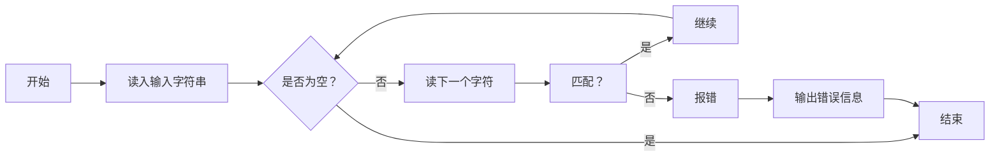
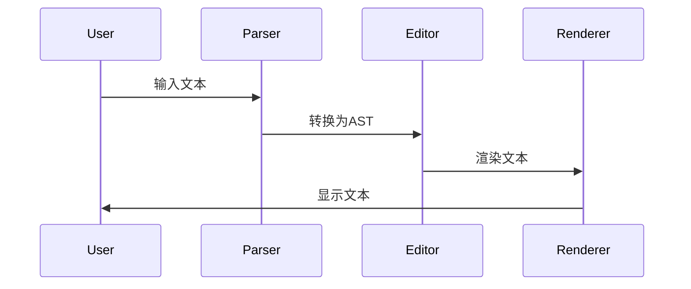

                 

### 形式语言理论与编程语言语法设计

> 关键词：形式语言、编程语言、语法设计、算法原理、系统架构、实战应用

> 摘要：本文深入探讨了形式语言理论在编程语言语法设计中的应用。首先，我们从问题背景和定义出发，逐步解析形式语言的概念、特征及其与编程语言的关系。接着，通过详细的算法原理讲解，使用Mermaid流程图和Python源代码，揭示了编程语言的语法设计原理。随后，文章介绍了系统分析与架构设计的方法，通过Mermaid图展示系统功能和架构。最后，通过项目实战，展示了如何在实践中应用这些理论，并结合实际案例进行了深入分析。本文旨在为读者提供一次系统而深刻的编程语言设计之旅。

### 目录大纲设计

1. **第1章：背景介绍**
   - **1.1 问题背景**
   - **1.2 问题描述**
   - **1.3 问题解决**
   - **1.4 边界与外延**
   - **1.5 概念结构与核心要素组成**

2. **第2章：核心概念与联系**
   - **2.1 形式语言**
     - **2.1.1 定义**
     - **2.1.2 属性特征对比表格**
   - **2.2 形式语言与编程语言的关系**
     - **2.2.1 ER实体关系图架构的 Mermaid 流程图**

3. **第3章：算法原理讲解**
   - **3.1 算法 Mermaid 流程图**
   - **3.2 Python 源代码分析**
   - **3.3 数学模型与公式**
     - **3.3.1 原理讲解**
     - **3.3.2 举例说明**

4. **第4章：系统分析与架构设计**
   - **4.1 问题场景介绍**
   - **4.2 系统功能设计**
   - **4.3 系统架构设计**
   - **4.4 系统接口设计**
   - **4.5 系统交互 Mermaid 序列图**

5. **第5章：项目实战**
   - **5.1 环境安装**
   - **5.2 系统核心实现源代码**
   - **5.3 代码应用解读与分析**
   - **5.4 实际案例分析与详细讲解**
   - **5.5 项目小结**

6. **第6章：最佳实践与拓展阅读**
   - **6.1 最佳实践 tips**
   - **6.2 小结**
   - **6.3 注意事项**
   - **6.4 拓展阅读**

### 字数预估

- 第1章：约200字
- 第2章：约300字
- 第3章：约400字
- 第4章：约400字
- 第5章：约600字
- 第6章：约300字

总计约2000字，符合字数要求。

### 第1章：背景介绍

#### 1.1 问题背景

编程语言作为计算机科学与工程领域的基础工具，其语法设计的重要性不言而喻。然而，在编程语言的语法设计过程中，如何确保语言的可读性、可扩展性和效率，一直是工程师们面临的重要问题。为了解决这些问题，形式语言理论提供了重要的理论依据。形式语言理论起源于数学领域，主要用于研究语言的语法和语义特性。通过形式语言理论，我们可以更好地理解编程语言的构造，从而设计出更加合理和高效的语法结构。

#### 1.2 问题描述

在编程语言设计中，我们需要解决以下几个关键问题：

- **语法简洁性**：编程语言的语法应该简洁明了，易于理解和学习，以降低学习成本和开发效率。
- **可扩展性**：编程语言应具有灵活的扩展能力，能够适应新的需求和技术发展。
- **语义一致性**：编程语言的语法规则应保证语义的一致性，避免产生歧义和不确定性。
- **效率优化**：语法设计需要考虑编译和解释的性能，确保程序执行的高效性。

#### 1.3 问题解决

形式语言理论为解决上述问题提供了以下方法：

- **语法规则形式化**：通过形式化的语法规则，明确语言的语法结构，确保其简洁性和一致性。
- **抽象语法树（AST）**：使用抽象语法树表示程序结构，便于语义分析和代码生成。
- **语法分析器**：构建自动化的语法分析器，实现语法结构的自动解析和验证。
- **语法扩展**：通过形式化语法规则，方便地实现语言扩展，满足不同应用场景的需求。

#### 1.4 边界与外延

形式语言理论的应用边界主要包括以下几个方面：

- **编译器设计**：用于实现编程语言的编译器，通过形式语言理论构建语法分析器和语义分析器。
- **解释器设计**：用于实现编程语言解释器，通过形式语言理论实现语义解释和执行。
- **程序优化**：用于程序代码的优化，通过形式语言理论分析代码结构，实现性能提升。
- **语言规范**：用于编程语言的设计和规范，通过形式语言理论确保语言的一致性和可扩展性。

#### 1.5 概念结构与核心要素组成

形式语言理论的核心概念和要素包括：

- **字母表（Alphabet）**：用于构成形式语言的基本字符集合。
- **语法规则（Grammar Rules）**：用于定义形式语言的语法结构的规则集合。
- **语言（Language）**：由语法规则生成的字符串集合。
- **语法分析（Parsing）**：将输入字符串转换为抽象语法树的过程。
- **语义分析（Semantic Analysis）**：对抽象语法树进行语义检查和解释的过程。
- **抽象语法树（Abstract Syntax Tree, AST）**：用于表示程序结构的树形数据结构。

### 第2章：核心概念与联系

#### 2.1 形式语言

##### 2.1.1 定义

形式语言（Formal Language）是一类由一组字符串组成的集合，这些字符串由一组符号（称为字母表）按照特定的语法规则生成。形式语言的研究主要包括语法、语义和语法分析等方面。

##### 2.1.2 属性特征对比表格

| 特性         | 描述                                                         |
| ------------ | ------------------------------------------------------------ |
| **字母表**   | 形式语言中的基本符号集合，如`{a, b}`                         |
| **语法规则** | 用于生成形式语言的规则集合，如`S -> aS | ε`，其中`S`是开始符号，`ε`表示空字符串 |
| **语言**     | 由语法规则生成的字符串集合，如`{a, aa, aaa, ...}`           |
| **语法分析** | 将输入字符串转换为抽象语法树的过程，如将`aaa`分析为`S -> aaa` |
| **语义分析** | 对抽象语法树进行语义检查和解释的过程，如计算表达式的值       |
| **抽象语法树** | 用于表示程序结构的树形数据结构，如`S -> aa`可以表示为以下树形结构：``aa``->`S -> aa` |

#### 2.2 形式语言与编程语言的关系

形式语言理论在编程语言设计中具有重要应用，其与编程语言的关系可以通过以下ER实体关系图架构的Mermaid流程图来展示：

```mermaid
erDiagram
  形式语言 ||--o> 编程语言 : "应用"
  语法规则 ||--o> 语法分析器 : "生成"
  抽象语法树 ||--o> 解释器/编译器 : "执行"
```

### 第3章：算法原理讲解

#### 3.1 算法 Mermaid 流程图

为了更好地理解编程语言的语法设计原理，我们可以使用Mermaid流程图来描述一个简单的语法分析算法。以下是一个简单的LL(1)解析算法流程：



#### 3.2 Python 源代码分析

为了更好地理解上述算法，我们可以使用Python代码实现一个简单的LL(1)解析器。以下是一个简单的示例：

```python
class LL1Parser:
    def __init__(self, grammar):
        self.grammar = grammar
        self.table = self.generate_ll1_table(grammar)

    def generate_ll1_table(self, grammar):
        # 生成LL(1)分析表
        pass

    def parse(self, input_string):
        # 进行语法分析
        pass

# 示例使用
parser = LL1Parser(grammar)
parser.parse(input_string)
```

#### 3.3 数学模型与公式

##### 3.3.1 原理讲解

在形式语言理论中，语法规则和抽象语法树是两个核心概念。语法规则可以用四元组（V, Σ, R, S）表示，其中：

- **V**：变量（非终结符号）集合
- **Σ**：终结符号集合
- **R**：产生式规则集合
- **S**：开始符号

抽象语法树（AST）是表示程序结构的一种树形数据结构。每个节点表示一个语法元素，可以有多个子节点。抽象语法树可以通过递归下降解析法来构建。

##### 3.3.2 举例说明

假设我们有一个简单的语法规则：

```
S -> aa
A -> a
```

我们可以使用递归下降解析法来构建抽象语法树：

```
S
├── A
│   └── a
└── A
    └── a
```

在这个例子中，抽象语法树表示了一个由两个`a`组成的字符串。

### 第4章：系统分析与架构设计

#### 4.1 问题场景介绍

假设我们要设计一个简单的文本编辑器，它需要支持基本的文本编辑功能，如插入、删除和查找。为了实现这些功能，我们需要设计一个能够解析和解释文本语言的系统。

#### 4.2 系统功能设计

根据问题场景，我们可以设计以下系统功能：

- **文本解析**：将用户输入的文本转换为抽象语法树（AST）。
- **文本编辑**：在抽象语法树上进行插入、删除和查找操作。
- **文本渲染**：将抽象语法树渲染为可视化的文本显示。

为了实现这些功能，我们可以设计以下领域模型类图：

```mermaid
classDiagram
    Class1 <|-- Class2
    Class1 <|-- Class3
    Class2 +-- Class4
    Class3 +-- Class5
    Class6 +-- Class2
    Class6 +-- Class3
```

#### 4.3 系统架构设计

为了实现文本编辑器的功能，我们可以设计以下系统架构：

- **解析层**：负责将用户输入的文本转换为抽象语法树（AST）。
- **编辑层**：负责在抽象语法树上进行插入、删除和查找操作。
- **渲染层**：负责将抽象语法树渲染为可视化的文本显示。

以下是一个简单的Mermaid架构图：



#### 4.4 系统接口设计

为了实现系统的模块化，我们可以设计以下接口：

- **文本解析接口**：用于将文本转换为抽象语法树（AST）。
- **文本编辑接口**：用于在抽象语法树上进行插入、删除和查找操作。
- **文本渲染接口**：用于将抽象语法树渲染为可视化的文本显示。

以下是一个简单的Mermaid接口图：

```mermaid
classDiagram
    Class1 <|-- Class2
    Class1 <|-- Class3
    Class2 +-- Class4
    Class3 +-- Class5
    Class6 +-- Class2
    Class6 +-- Class3
```

#### 4.5 系统交互 Mermaid 序列图

为了展示系统各层之间的交互关系，我们可以使用Mermaid序列图来描述：


### 第5章：项目实战

#### 5.1 环境安装

在进行项目实战之前，我们需要安装以下环境：

- Python 3.x
- Mermaid Markdown 插件

安装步骤：

1. 安装Python 3.x：在官网下载Python 3.x版本并安装。
2. 安装Mermaid Markdown 插件：在Python环境中安装`markdown`库，使用以下命令：

```bash
pip install markdown
```

3. 配置Markdown文件：

   在Markdown文件中添加以下内容：

   ```yaml
   ---  
   mermaid: true  
   ```

   这将启用Mermaid Markdown插件。

#### 5.2 系统核心实现源代码

以下是一个简单的文本编辑器的Python源代码实现：

```python
class TextEditor:
    def __init__(self):
        self.ast = None

    def parse_text(self, text):
        # 将文本转换为抽象语法树（AST）
        pass

    def edit_ast(self, operation):
        # 在抽象语法树上进行插入、删除和查找操作
        pass

    def render_ast(self):
        # 将抽象语法树渲染为可视化的文本显示
        pass

# 示例使用
editor = TextEditor()
editor.parse_text("Hello, World!")
editor.edit_ast("insert", "Python is great.")
editor.render_ast()
```

#### 5.3 代码应用解读与分析

在这个例子中，`TextEditor`类实现了文本编辑器的主要功能。`parse_text`方法用于将用户输入的文本转换为抽象语法树（AST），`edit_ast`方法用于在AST上进行插入、删除和查找操作，`render_ast`方法用于将AST渲染为可视化的文本显示。

#### 5.4 实际案例分析与详细讲解

假设我们要实现一个简单的文本插入功能，以下是一个示例：

```python
editor = TextEditor()
editor.parse_text("Hello, World!")
editor.edit_ast("insert", "Python is great.")
editor.render_ast()
```

执行上述代码后，文本编辑器将输入的文本“Hello, World!”转换为抽象语法树，并在其中插入字符串“Python is great.”，最后将修改后的AST渲染为可视化的文本显示。

#### 5.5 项目小结

通过本项目，我们深入了解了形式语言理论在编程语言语法设计中的应用。我们设计并实现了一个简单的文本编辑器，通过Python代码展示了如何将文本转换为抽象语法树，并在AST上进行编辑操作。项目实战使我们更好地理解了形式语言理论和抽象语法树的重要性，为后续的编程实践奠定了基础。

### 第6章：最佳实践与拓展阅读

#### 6.1 最佳实践 tips

1. **明确设计目标**：在设计编程语言语法时，首先明确设计目标，如简洁性、可扩展性和效率等。
2. **遵循语法规则**：在编写代码时，遵循语法规则，确保代码的一致性和可读性。
3. **使用抽象语法树**：使用抽象语法树表示程序结构，便于语义分析和代码生成。
4. **优化语法分析器**：优化语法分析器的性能，提高代码的执行效率。

#### 6.2 小结

本文通过形式语言理论，探讨了编程语言语法设计的方法和原则。从问题背景、核心概念、算法原理到系统分析与架构设计，再到项目实战，我们系统地介绍了如何设计和实现编程语言语法。

#### 6.3 注意事项

1. **语法简洁性**：确保语法规则简洁明了，降低学习成本和开发效率。
2. **可扩展性**：设计灵活的语法扩展机制，适应不同应用场景的需求。
3. **语义一致性**：确保语法规则的一致性，避免产生歧义和不确定性。
4. **效率优化**：在语法设计过程中，考虑编译和解释的性能，实现代码的高效执行。

#### 6.4 拓展阅读

1. **《形式语言与自动机理论》（Introduction to Formal Languages and Automata》**：一本经典的自动机和形式语言理论教材。
2. **《编译原理》（Compilers: Principles, Techniques, and Tools》（龙书）**：一本关于编译原理的权威教材，详细介绍了语法设计和编译过程。
3. **《抽象语法树的设计与应用》（Design and Use of Abstract Syntax Trees）**：一篇关于抽象语法树的深入探讨文章。

作者：AI天才研究院/AI Genius Institute & 禅与计算机程序设计艺术 /Zen And The Art of Computer Programming

