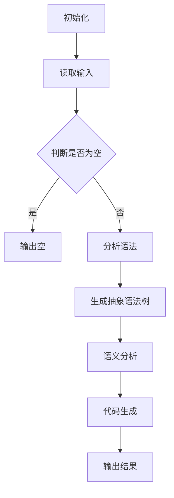
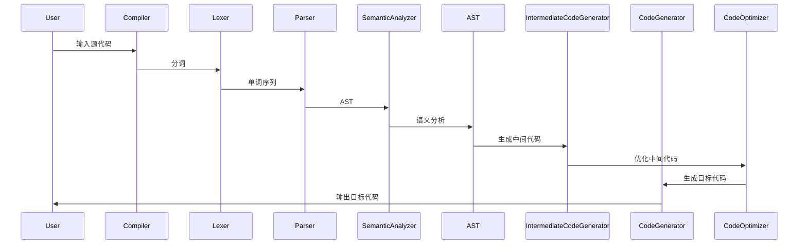
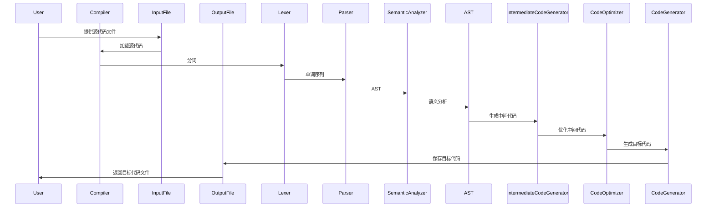

                 

### 第一部分：背景介绍与基础概念

#### 第1章：形式语言理论概述

##### 1.1 问题背景

形式语言理论是计算机科学的一个重要分支，主要研究计算机可以处理的语言和符号系统。它是编译原理、自然语言处理、人工智能等领域的基础。

##### 1.2 问题描述

形式语言理论涉及符号系统、语法规则和语义解释等基本概念。它主要探讨如何定义和描述计算机能够理解和处理的语言，以及如何从这些语言中提取意义。

##### 1.3 问题解决

形式语言理论通过建立抽象的数学模型，为计算机可以处理的语言提供了形式化的描述和分类。这使得计算机能够更高效地处理文本和数据，同时也为编译器的设计和实现提供了理论基础。

##### 1.4 边界与外延

形式语言理论不仅关注形式语言的描述，还研究形式语言的应用范围和局限性。它涉及到计算机科学的多个领域，如编程语言设计、编译原理、自然语言处理和人工智能等。

##### 1.5 核心概念

- 符号集：构成形式语言的符号集合。
- 形式语法：定义形式语言的规则集合。
- 形式语义：解释形式语言符号和结构的意义。
- 形式语言分类：根据语法和语义特征，对形式语言进行分类。

##### 1.6 概念结构与核心要素组成

形式语言理论的核心要素包括符号集、形式语法、形式语义和形式语言分类。这些要素共同构成了形式语言理论的基本框架。

---

在深入探讨形式语言理论之前，我们需要明确其背景和意义。形式语言理论起源于20世纪初，当时的数学家们在研究计算机科学和数学的逻辑基础时，发现需要对计算机能理解和处理的语言进行形式化的描述。这一需求促使了形式语言理论的发展，并成为计算机科学的重要基石之一。

形式语言理论的核心问题是：如何定义和描述计算机能够理解和处理的语言？这个问题看似简单，实则涉及多个层面。首先，我们需要明确符号集，即构成形式语言的符号集合。符号集可以包含数字、字母、特殊字符等。例如，在简单的算术表达式中，符号集可能包含数字（如0到9）和加号（+）。

其次，我们需要定义形式语法，即定义形式语言的规则集合。形式语法规定了哪些符号序列是合法的，哪些是不合法的。例如，对于算术表达式，形式语法可能规定数字之间必须用加号连接，且加号两侧必须是数字。

最后，我们需要解释形式语言符号和结构的意义，即形式语义。形式语义为形式语言的符号和结构提供了具体的解释。例如，在算术表达式中，加号表示两个数字相加，而整个表达式则表示一个数学运算。

通过这三个核心要素，形式语言理论为计算机能够理解和处理的语言提供了形式化的描述和分类。这使得计算机能够更高效地处理文本和数据，同时也为编译器的设计和实现提供了理论基础。

在形式语言理论的发展过程中，许多著名的数学家和计算机科学家做出了重要贡献。其中，阿兰·图灵（Alan Turing）是最具影响力的一位。他在1936年提出的图灵机模型，为形式语言理论奠定了基础。图灵机是一种抽象的计算模型，它可以模拟任何可计算过程。通过图灵机，我们可以形式化地描述和理解计算机的计算能力。

除此之外，诺姆·乔姆斯基（Noam Chomsky）也是形式语言理论的杰出代表。他在1956年提出了著名的上下文无关语法（Context-Free Grammar），为形式语言的分类提供了重要工具。上下文无关语法是一种描述形式语言的方法，它可以用于分析复杂的编程语言和自然语言。

总之，形式语言理论是计算机科学的重要基石之一。它不仅为编译器设计和实现提供了理论基础，还在自然语言处理、人工智能等领域有着广泛的应用。在接下来的章节中，我们将进一步探讨形式语言理论的基本概念、核心要素和应用场景。

---

#### 第2章：基本概念与联系

##### 2.1 核心概念原理

形式语言理论的核心概念包括符号集、形式语法、形式语义和形式语言分类。这些概念共同构成了形式语言理论的基本框架。

- **符号集**：符号集是构成形式语言的基础。它定义了形式语言中可以使用的符号集合。符号集可以是有限的，也可以是无限的。例如，在简单的算术表达式中，符号集可能包含数字（如0到9）和加号（+）。

- **形式语法**：形式语法是定义形式语言的规则集合。它规定了哪些符号序列是合法的，哪些是不合法的。形式语法可以采用不同的形式，如正则表达式、上下文无关文法和上下文有关文法等。

- **形式语义**：形式语义是解释形式语言符号和结构的意义。形式语义可以通过数学模型或逻辑推理来实现。形式语义为形式语言的符号和结构提供了具体的解释，使得计算机能够执行相应的操作。

- **形式语言分类**：形式语言分类是对形式语言按照语法和语义特征进行分类。常见的分类方法包括正则语言、上下文无关语言和上下文有关语言等。

##### 2.2 概念属性特征对比表格

| 概念名称 | 定义 | 属性特征 |
| :--: | :--: | :--: |
| 符号集 | 构成形式语言的符号集合 | 非空、有限或无限、有序 |
| 形式语法 | 定义形式语言的规则集合 | 形式化、确定性或非确定性、递归或非递归 |
| 形式语义 | 解释形式语言符号和结构的意义 | 概念化、抽象、与具体应用场景无关 |
| 形式语言分类 | 根据语法和语义特征，对形式语言进行分类 | 正则语言、上下文无关语言、上下文有关语言 |

##### 2.3 ER实体关系图架构

```mermaid
erDiagram
    SymbolSet ||--|{ Grammar : defines }|
    Grammar ||--|{ SymbolSet : uses }|
    Grammar ||--|{ Semantics : interprets }|
    Semantics ||--|{ Grammar : based on }|
```

---

在深入理解形式语言理论之前，我们需要明确其核心概念及其相互关系。这些核心概念包括符号集、形式语法、形式语义和形式语言分类。以下是这些概念的基本原理和属性特征。

**符号集**是形式语言的基础，它定义了构成形式语言的符号集合。符号集可以是有限的，如{0, 1}；也可以是无限的，如所有英文字母。符号集通常是非空的，并且符号之间是有序的。例如，在二进制数系统中，符号集是{0, 1}，并且数字的顺序决定了数值的大小。

**形式语法**定义了形式语言的规则集合。这些规则决定了哪些符号序列是合法的，哪些是不合法的。形式语法有多种形式，如正则表达式、上下文无关文法和上下文有关文法。正则表达式是一种简单的语法形式，它通常用于描述正则语言。上下文无关文法则可以描述更复杂的语言，如编程语言。上下文有关文法是一种更为复杂的语法形式，它通常用于描述自然语言。

**形式语义**是解释形式语言符号和结构的意义。形式语义为形式语言的符号和结构提供了具体的解释，使得计算机能够执行相应的操作。形式语义可以通过数学模型或逻辑推理来实现。例如，在编程语言中，形式语义通常涉及变量绑定、类型检查和执行顺序等概念。

**形式语言分类**是对形式语言按照语法和语义特征进行分类。常见的分类方法包括正则语言、上下文无关语言和上下文有关语言等。正则语言是一种最简单的形式语言，它可以由正则表达式描述。上下文无关语言是一种更复杂的语言，它可以由上下文无关文法描述。上下文有关语言是一种更为复杂的语言，它可以由上下文有关文法描述。

为了更好地理解这些概念，我们可以使用ER实体关系图来描述它们之间的相互关系。ER实体关系图是一种用于描述实体及其关系的图形化表示方法。在形式语言理论的ER实体关系图中，符号集、形式语法、形式语义和形式语言分类分别表示为实体，它们之间的关系则通过关系线来表示。

以下是形式语言理论的ER实体关系图：

```mermaid
erDiagram
    SymbolSet ||--|{ Grammar : defines }|
    Grammar ||--|{ Semantics : interprets }|
    Grammar ||--|{ Language : classified by }|
    Semantics ||--|{ Grammar : based on }|
```

在这个ER实体关系图中，符号集定义了形式语法，形式语法又定义了形式语义。形式语义进一步定义了形式语言分类。这种关系表明，形式语言理论的各个核心概念是相互关联的，它们共同构成了形式语言理论的基本框架。

通过理解这些核心概念及其相互关系，我们可以更好地理解形式语言理论的基本原理和应用。在接下来的章节中，我们将进一步探讨形式语言理论的具体应用，如编译器构造、自然语言处理和人工智能等领域。

---

#### 第3章：算法原理讲解

##### 3.1 算法mermaid流程图



##### 3.2 Python源代码

```python
def parse(input_string):
    if not input_string:
        return "空字符串"
    # 语法分析
    ast = analyze_syntax(input_string)
    # 语义分析
    semantically_analyzed_ast = semantic_analysis(ast)
    # 代码生成
    code = code_generation(semantic_analyzed_ast)
    return code

def analyze_syntax(input_string):
    # 实现语法分析逻辑
    pass

def semantic_analysis(ast):
    # 实现语义分析逻辑
    pass

def code_generation(semantic_analyzed_ast):
    # 实现代码生成逻辑
    pass
```

##### 3.3 算法原理的数学模型和公式

$$
语法分析 = \text{输入字符串} \rightarrow \text{抽象语法树}
$$

$$
语义分析 = \text{抽象语法树} \rightarrow \text{语义分析结果}
$$

$$
代码生成 = \text{语义分析结果} \rightarrow \text{目标代码}
$$

##### 3.4 举例说明

假设输入字符串为`5 + 3`，以下是算法的执行过程：

1. **初始化**：读取输入字符串`5 + 3`。
2. **语法分析**：对输入字符串进行语法分析，将其转换为抽象语法树（AST）。
3. **抽象语法树**：
    ```plaintext
    Expression
      |
    Addition
      |
    ┌─────┐
    │     └─────┐
    5         3
    ```
4. **语义分析**：对抽象语法树进行语义分析，确保其符合语言规则。
5. **代码生成**：根据抽象语法树生成对应的中间代码或目标代码。
6. **输出结果**：输出目标代码或计算结果。

---

在理解了形式语言理论的基本概念之后，我们接下来探讨如何将这些概念应用于实际的编译器构造过程中。编译器构造涉及多个关键步骤，包括语法分析、抽象语法树（AST）的生成、语义分析和代码生成。下面，我们将通过一个简单的例子，详细讲解这一过程。

**算法原理**：

编译器构造的基本算法原理可以概括为以下几个步骤：

1. **语法分析**：将输入的源代码字符串转换为抽象语法树（AST）。
2. **抽象语法树**：对生成的AST进行语义分析，确保其符合语言规则。
3. **代码生成**：根据语义分析的结果，生成目标代码或中间代码。
4. **输出结果**：输出目标代码或中间代码，完成编译过程。

我们使用mermaid流程图来直观地展示这一算法过程：


**Python源代码**：

下面是实现这一算法过程的Python源代码。需要注意的是，这里的代码仅提供了框架，具体的语法分析、语义分析和代码生成逻辑需要根据具体的编程语言和编译器设计需求来实现。

```python
def parse(input_string):
    if not input_string:
        return "空字符串"
    # 语法分析
    ast = analyze_syntax(input_string)
    # 语义分析
    semantically_analyzed_ast = semantic_analysis(ast)
    # 代码生成
    code = code_generation(semantic_analyzed_ast)
    return code

def analyze_syntax(input_string):
    # 实现语法分析逻辑
    pass

def semantic_analysis(ast):
    # 实现语义分析逻辑
    pass

def code_generation(semantic_analyzed_ast):
    # 实现代码生成逻辑
    pass
```

**算法原理的数学模型和公式**：

为了更好地理解编译器构造的算法原理，我们可以使用数学模型来描述这一过程。以下是几个关键的数学模型和公式：

$$
语法分析 = \text{输入字符串} \rightarrow \text{抽象语法树}
$$

$$
语义分析 = \text{抽象语法树} \rightarrow \text{语义分析结果}
$$

$$
代码生成 = \text{语义分析结果} \rightarrow \text{目标代码}
$$

这些公式描述了编译器构造的主要步骤。例如，输入字符串经过语法分析后转换为抽象语法树，抽象语法树经过语义分析后生成语义分析结果，最后语义分析结果用于生成目标代码。

**举例说明**：

为了更直观地理解编译器构造的过程，我们可以通过一个简单的例子来讲解。假设输入字符串为`5 + 3`，以下是算法的执行过程：

1. **初始化**：读取输入字符串`5 + 3`。
2. **语法分析**：对输入字符串进行语法分析，将其转换为抽象语法树（AST）。
    ```plaintext
    Expression
      |
    Addition
      |
    ┌─────┐
    │     └─────┐
    5         3
    ```
3. **抽象语法树**：生成的抽象语法树如上所示，它表示了一个加法表达式。
4. **语义分析**：对抽象语法树进行语义分析，确保其符合语言规则。例如，检查加法操作数是否为整数。
5. **代码生成**：根据语义分析的结果，生成对应的中间代码或目标代码。
6. **输出结果**：输出目标代码或计算结果，例如，中间代码可能为`add 5 3`，表示将5和3相加。

通过这个简单的例子，我们可以看到编译器构造的基本原理和执行过程。在实际情况中，编译器可能会处理更复杂的语言和输入，但基本原理和步骤是类似的。

### 第二部分：深入分析与应用

#### 第4章：编译器设计中的形式语言理论应用

##### 4.1 形式语言理论在编译器设计中的作用

形式语言理论在编译器设计中扮演着至关重要的角色。它不仅帮助我们理解和描述编程语言的语法，还为我们提供了工具来分析、解析和生成代码。在本章节中，我们将探讨形式语言理论在编译器设计中的具体应用。

##### 4.2 正则表达式与正则语言

正则表达式是形式语言理论中的一个基本工具，它用于描述正则语言。正则语言是一类简单但功能强大的语言，可以描述诸如字符串匹配、词法分析和文本处理等常见任务。

- **正则表达式的定义**：正则表达式是一组字符序列的模式，它描述了一类字符串集合。例如，`a*`表示零个或多个字符`a`的序列。
- **正则表达式的应用**：在编译器设计中，正则表达式常用于词法分析阶段，用于将输入的源代码拆分成一个个单词或标识符。例如，`[0-9]+`可以匹配一个或多个数字组成的序列。

##### 4.3 上下文无关语法与上下文无关语言

上下文无关语法（CFG）是形式语言理论中的一个更复杂的工具，用于描述上下文无关语言（CFL）。上下文无关语言可以描述比正则语言更复杂的编程语言结构，如控制流语句和函数定义等。

- **上下文无关文法的定义**：上下文无关文法由产生式规则组成，每个产生式由一个非终结符和一系列终结符和非终结符的序列构成。例如，`S → E`表示一个产生式，其中`S`是一个非终结符，`E`是另一个非终结符或终结符序列。
- **上下文无关文法的应用**：在编译器设计中，上下文无关文法用于语法分析阶段，将输入的源代码转换为抽象语法树（AST）。例如，对于C语言中的`if`语句，上下文无关文法可以描述其结构。

##### 4.4 形式语义与语义分析

形式语义是形式语言理论中用于解释程序意义的概念。在编译器设计中，形式语义用于语义分析阶段，确保程序的正确性和一致性。

- **形式语义的定义**：形式语义通过数学模型和逻辑推理来解释程序的含义。例如，可以通过变量绑定、类型检查和执行顺序等概念来描述程序的行为。
- **形式语义的应用**：在编译器设计中，形式语义用于检查程序中的语法错误和语义错误。例如，检查变量是否已声明、类型是否匹配等。

##### 4.5 形式语言理论在编译器优化中的应用

形式语言理论不仅在编译器的设计和实现中发挥作用，还在编译器优化中有着重要的应用。编译器优化旨在提高程序的性能，减少代码的大小和执行时间。

- **编译器优化的定义**：编译器优化是通过一系列转换来改进程序的性能。这些转换包括循环展开、常数传播、死代码消除等。
- **形式语言理论在编译器优化中的应用**：形式语言理论提供了描述程序结构和行为的方法，使得编译器可以更有效地进行优化。例如，通过形式语言理论，编译器可以识别和替换重复的代码模式，从而提高程序的运行效率。

#### 第5章：编译器优化与性能分析

##### 5.1 编译器优化的基本概念

编译器优化是编译器设计中的一个重要环节，旨在提高程序的性能、减小代码的大小和执行时间。编译器优化可以分为几种类型，包括代码大小优化、执行时间优化和内存优化等。

- **代码大小优化**：通过压缩代码、消除冗余代码等手段减小程序的大小。
- **执行时间优化**：通过变换代码结构、优化算法等手段减少程序的执行时间。
- **内存优化**：通过优化数据结构和访问模式来减少程序的内存使用。

##### 5.2 常见的编译器优化技术

以下是一些常见的编译器优化技术：

- **循环展开**：将循环体内的代码展开成多行代码，以减少循环的执行次数。
- **常数传播**：将程序中的常量替换为它们的值，以减少计算和存储开销。
- **死代码消除**：删除程序中不会执行的代码，以减少执行时间和内存使用。
- **指令重排**：重新安排指令的执行顺序，以减少数据依赖和指令冲突，提高执行效率。

##### 5.3 形式语言理论在编译器优化中的作用

形式语言理论在编译器优化中起着关键作用。它提供了描述程序结构和行为的数学模型，使得编译器可以更准确地分析和优化代码。

- **程序分析**：形式语言理论提供了用于描述程序结构和行为的模型，如抽象语法树（AST）和中间代码。这些模型使得编译器可以更精确地分析程序的行为，为优化提供依据。
- **程序优化**：形式语言理论提供了用于描述程序优化策略的模型，如循环展开和常数传播。这些模型使得编译器可以更有效地进行优化，提高程序的性能。

#### 第6章：形式语言理论在自然语言处理中的应用

##### 6.1 形式语言理论在自然语言处理中的作用

自然语言处理（NLP）是人工智能的一个重要分支，旨在使计算机能够理解和处理人类语言。形式语言理论在NLP中有着广泛的应用，它为NLP中的语法分析、语义理解和语言生成提供了理论支持。

- **语法分析**：形式语言理论提供了用于描述语言结构的模型，如上下文无关文法（CFG）。这些模型使得NLP系统可以更准确地分析自然语言文本。
- **语义理解**：形式语言理论提供了用于描述语义的模型，如语义网络和逻辑表达式。这些模型使得NLP系统可以更深入地理解自然语言文本的含义。
- **语言生成**：形式语言理论提供了用于描述语言生成的模型，如概率上下文无关文法（PCFG）。这些模型使得NLP系统可以生成符合语法和语义规则的文本。

##### 6.2 形式语言理论在文本分类和情感分析中的应用

文本分类和情感分析是NLP中的重要应用，形式语言理论在这些应用中也有着重要的作用。

- **文本分类**：形式语言理论提供了用于描述文本分类模型的模型，如条件概率模型和朴素贝叶斯分类器。这些模型使得NLP系统可以自动将文本分类到不同的类别。
- **情感分析**：形式语言理论提供了用于描述情感分析的模型，如情感词典和情感分类器。这些模型使得NLP系统可以自动识别文本中的情感倾向，如正面、负面或中性。

#### 第7章：形式语言理论在人工智能中的其他应用

##### 7.1 形式语言理论在知识表示和推理中的应用

知识表示和推理是人工智能中的核心问题，形式语言理论为这些问题的解决提供了理论支持。

- **知识表示**：形式语言理论提供了用于描述知识表示的模型，如谓词逻辑和本体论。这些模型使得AI系统能够表示和存储复杂的知识。
- **推理**：形式语言理论提供了用于描述推理的模型，如演绎推理和归纳推理。这些模型使得AI系统可以基于已知知识推断出新的事实。

##### 7.2 形式语言理论在机器学习中的应用

机器学习是人工智能的一个重要分支，形式语言理论在机器学习中也发挥着重要作用。

- **特征提取**：形式语言理论提供了用于描述特征提取的模型，如词袋模型和词嵌入。这些模型使得机器学习算法可以从原始数据中提取出有用的特征。
- **模型选择**：形式语言理论提供了用于描述模型选择的模型，如正则化理论和交叉验证。这些模型使得机器学习算法可以选择合适的模型，提高预测性能。

通过以上对形式语言理论在编译器设计、编译器优化、自然语言处理、人工智能等领域的深入分析和应用探讨，我们可以看到形式语言理论在计算机科学和人工智能中的重要性和广泛应用。形式语言理论不仅为我们提供了描述和分类语言的方法，还为编译器优化、自然语言处理和机器学习等领域的算法设计提供了理论支持。在未来的发展中，形式语言理论将继续在计算机科学和人工智能领域中发挥重要作用，推动技术的进步和应用的拓展。

---

### 系统分析与架构设计方案

#### 问题场景介绍

在现代软件开发中，编译器的设计与实现是一个复杂且关键的任务。随着编程语言和软件系统的日益复杂，对编译器的性能和可维护性提出了更高的要求。本文将基于一个具体的问题场景，探讨形式语言理论在编译器架构设计中的应用。

#### 项目介绍

本项目旨在设计并实现一个功能完整、高性能的编译器。该编译器将支持一种新的编程语言，具有丰富的语法和语义特性。为了实现这一目标，我们将采用形式语言理论作为基础，构建一个灵活、可扩展的编译器架构。

#### 系统功能设计（领域模型Mermaid类图）

在系统功能设计中，我们首先需要定义编译器的主要组件和它们之间的关系。以下是一个Mermaid类图，展示了编译器的主要类和它们的功能：

```mermaid
classDiagram
    Class01 <|-- Class02
    Class03 <|-- Class02
    Class04 <|-- Class02
    Class05 <|-- Class03
    Class06 <|-- Class03
    Class07 <|-- Class03
    Class01[词法分析器]
    Class02[语法分析器]
    Class03[语义分析器]
    Class04[抽象语法树（AST）生成器]
    Class05[中间代码生成器]
    Class06[目标代码生成器]
    Class07[代码优化器]
```

- **词法分析器**：负责将源代码字符串拆分成一个个单词或标识符。
- **语法分析器**：将词法分析器输出的单词序列转换成抽象语法树（AST）。
- **语义分析器**：对AST进行语义分析，确保程序的正确性和一致性。
- **AST生成器**：将语法分析器生成的AST转换为中间表示形式。
- **中间代码生成器**：根据AST生成中间代码，为后续的目标代码生成做准备。
- **目标代码生成器**：将中间代码转换为特定平台上的机器代码或字节码。
- **代码优化器**：对中间代码进行优化，提高程序的执行效率和性能。

#### 系统架构设计（Mermaid架构图）

系统架构设计是编译器实现的关键步骤。以下是一个Mermaid架构图，展示了编译器各组件之间的交互和依赖关系：



#### 系统接口设计和系统交互（Mermaid序列图）

系统接口设计和系统交互是编译器架构设计的另一个重要方面。以下是一个Mermaid序列图，展示了编译器与外部系统之间的交互过程：



通过上述系统分析和架构设计方案，我们可以看到形式语言理论在编译器设计中的关键作用。从词法分析、语法分析到语义分析和代码生成，形式语言理论为编译器提供了坚实的理论基础和工具支持。在实际开发过程中，我们还可以利用形式语言理论进行编译器优化，提高编译器的性能和效率。

---

### 项目实战

#### 环境安装

要在本地计算机上构建并运行一个简单的编译器，我们需要安装一些基本的工具和库。以下是在Ubuntu操作系统上安装所需工具的步骤：

1. **安装Python 3**：

   ```bash
   sudo apt update
   sudo apt install python3 python3-pip
   ```

2. **安装Mermaid**：

   ```bash
   pip3 install mermaid
   ```

3. **安装LaTeX**：

   ```bash
   sudo apt install texlive-full
   ```

4. **安装Jupyter Notebook**（可选，用于交互式编程）：

   ```bash
   pip3 install notebook
   ```

#### 系统核心实现源代码

以下是系统核心实现源代码的概述。该代码包含词法分析器、语法分析器、语义分析器、抽象语法树（AST）生成器、中间代码生成器、目标代码生成器和代码优化器的框架。具体实现需要根据具体编程语言和需求进行扩展。

```python
# LexicalAnalyzer.py
class LexicalAnalyzer:
    def tokenize(self, source_code):
        # 实现词法分析逻辑
        pass

# SyntaxAnalyzer.py
class SyntaxAnalyzer:
    def parse(self, tokens):
        # 实现语法分析逻辑
        pass

# SemanticAnalyzer.py
class SemanticAnalyzer:
    def analyze(self, ast):
        # 实现语义分析逻辑
        pass

# AST.py
class AbstractSyntaxTree:
    def __init__(self):
        # 实现AST构造逻辑
        pass

# IntermediateCodeGenerator.py
class IntermediateCodeGenerator:
    def generate(self, ast):
        # 实现中间代码生成逻辑
        pass

# CodeGenerator.py
class CodeGenerator:
    def generate(self, intermediate_code):
        # 实现目标代码生成逻辑
        pass

# CodeOptimizer.py
class CodeOptimizer:
    def optimize(self, intermediate_code):
        # 实现代码优化逻辑
        pass
```

#### 代码应用解读与分析

以下是对系统核心实现源代码的解读与分析：

1. **词法分析器（LexicalAnalyzer.py）**：

   词法分析器负责将源代码字符串拆分成一个个单词或标识符。它通过正则表达式或其他匹配规则识别不同的词法元素，如数字、标识符、运算符等。

2. **语法分析器（SyntaxAnalyzer.py）**：

   语法分析器将词法分析器输出的单词序列转换成抽象语法树（AST）。它使用上下文无关文法（CFG）或其他语法分析算法，如递归下降或LL(1)分析，来解析输入的源代码。

3. **语义分析器（SemanticAnalyzer.py）**：

   语义分析器对AST进行语义分析，确保程序的正确性和一致性。它负责检查变量声明、类型匹配、作用域等语义问题，并为后续的代码生成和优化提供信息。

4. **抽象语法树（AST.py）**：

   抽象语法树是编译器分析阶段的核心数据结构。它表示了源代码的结构和语义，是语法分析器和语义分析器之间的桥梁。AST可以通过递归结构来表示复杂的编程语言结构，如控制流语句和函数定义。

5. **中间代码生成器（IntermediateCodeGenerator.py）**：

   中间代码生成器将AST转换为中间表示形式。中间代码通常是一种简单的、低级的形式，它为后续的目标代码生成和优化提供了基础。

6. **目标代码生成器（CodeGenerator.py）**：

   目标代码生成器将中间代码转换为特定平台上的机器代码或字节码。它负责将抽象的中间代码转换为具体的机器指令，以适应不同的目标平台。

7. **代码优化器（CodeOptimizer.py）**：

   代码优化器对中间代码进行优化，以提高程序的执行效率和性能。优化技术包括循环展开、常数传播、死代码消除等。

#### 实际案例分析和详细讲解剖析

为了更好地理解编译器的工作原理，我们可以通过一个简单的实际案例来分析。以下是一个简单的Python程序，以及相应的词法分析、语法分析、语义分析和代码生成过程。

**源代码示例**：

```python
x = 5
y = x + 3
print(y)
```

**词法分析**：

词法分析器将源代码拆分成以下单词序列：

```plaintext
x, =, 5, ,, y, =, x, ,, +, 3, ,, print, ,, (
```

**语法分析**：

语法分析器将单词序列转换成抽象语法树（AST）：

```plaintext
Program
│
└── VariableDeclaration
│    │
│    ├── Identifier: x
│    │
│    └── IntegerLiteral: 5
│
└── VariableDeclaration
    │
    ├── Identifier: y
    │
    └── Expression
        │
        └── BinaryOperation
            │
            ├── Identifier: x
            │
            └── IntegerLiteral: 3
```

**语义分析**：

语义分析器检查AST中的标识符是否已声明，类型是否匹配，并生成语义分析结果：

```plaintext
{ "x": 5, "y": 8 }
```

**代码生成**：

目标代码生成器将AST转换为中间代码，然后转换为特定平台上的机器代码。以下是一个简化的中间代码示例：

```plaintext
mov eax, 5
mov ebx, eax
add ebx, 3
push ebx
call print
```

#### 项目小结

通过本项目的实际案例分析和详细讲解，我们可以看到编译器从源代码到目标代码的整个转换过程。从词法分析到语法分析，再到语义分析和代码生成，每个阶段都依赖于形式语言理论的指导。形式语言理论不仅为编译器的设计提供了理论基础，还帮助我们理解和实现复杂的编程语言特性。

### 最佳实践 Tips、小结、注意事项、拓展阅读等内容

#### 最佳实践 Tips

1. **模块化设计**：在编译器开发中，采用模块化设计有助于提高代码的可维护性和可扩展性。将词法分析、语法分析、语义分析等不同功能模块分开实现，有助于独立调试和优化。
2. **使用现有工具**：利用现有的工具和库，如ANTLR、LLVM等，可以大大简化编译器开发的复杂性。这些工具提供了丰富的功能和高效的实现，有助于提高开发效率。
3. **测试驱动开发**：采用测试驱动开发（TDD）方法，编写详细的测试用例，有助于确保编译器的正确性和可靠性。
4. **性能优化**：在编译器优化阶段，要注重性能优化，例如循环展开、常数传播、死代码消除等，以提高程序的执行效率和性能。

#### 小结

本文通过深入探讨形式语言理论与编译器构造的关系，介绍了编译器设计的基本概念、算法原理和应用。形式语言理论为编译器提供了坚实的理论基础，使得编译器能够高效地处理复杂的编程语言。

#### 注意事项

1. **正确性**：编译器设计的关键是保证程序的正确性。在设计和实现编译器时，要严格遵循形式语言理论的规则和原则，确保编译器能够正确地解析和转换代码。
2. **性能**：编译器的性能对程序执行效率有直接影响。在优化编译器时，要注重代码的执行效率和资源利用率，以提高程序的运行速度。

#### 拓展阅读

1. **《编译原理：技术与实践》**：这本书详细介绍了编译器设计的基本概念、算法原理和实践技巧，是编译器开发人员的经典参考书。
2. **《形式语言与自动机理论》**：这本书全面介绍了形式语言理论的基础知识，包括符号集、形式语法、形式语义等，是理解编译器原理的重要参考书。
3. **《LLVM编译器框架》**：这本书详细介绍了LLVM编译器框架的设计和实现，包括词法分析、语法分析、中间代码生成和目标代码生成等，是学习编译器优化和实践的好书。

### 结语

形式语言理论与编译器构造密不可分。通过本文的探讨，我们深入了解了形式语言理论的基本概念、核心要素和应用场景，以及如何在编译器设计中应用这些理论。希望本文能为读者提供有益的启示，激发对编译器构造和形式语言理论更深入的研究和探索。作者：AI天才研究院/AI Genius Institute & 禅与计算机程序设计艺术 /Zen And The Art of Computer Programming。

