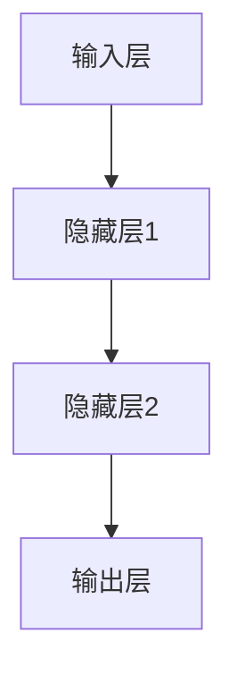
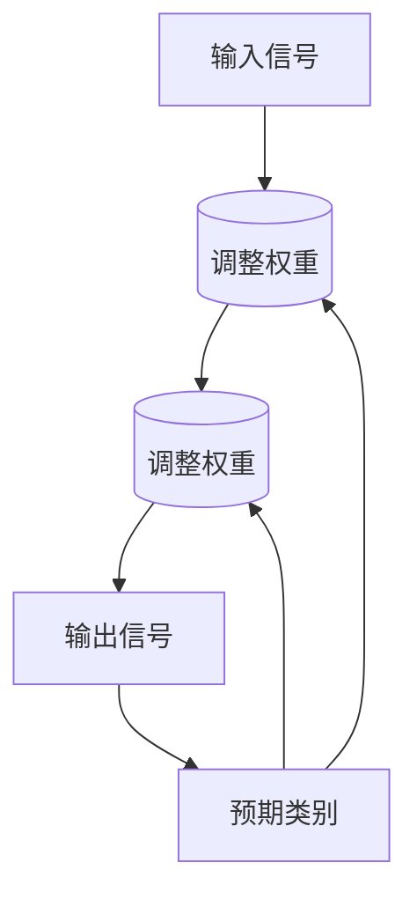
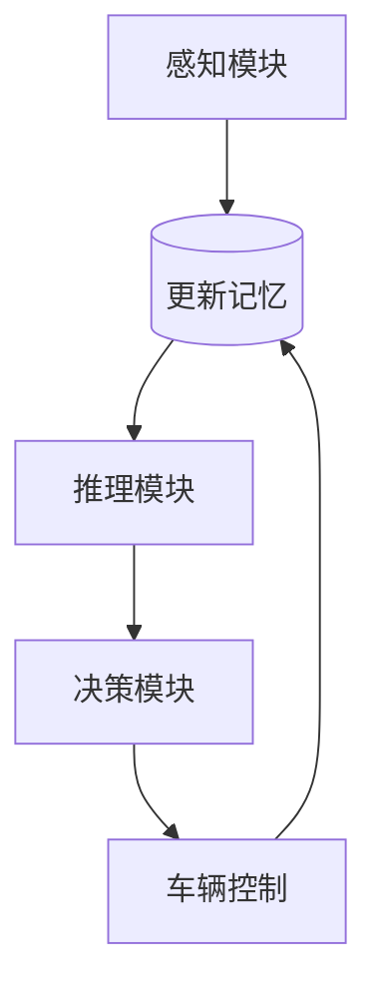

                 

### 第一步：制定文章大纲

在撰写技术博客前，首先需要制定一个清晰的文章大纲，这有助于确保文章内容结构紧凑、逻辑清晰。以下是本文的提纲：

#### 第一部分: 忆阻器基础与类脑计算概述

1. **第1章: 忆阻器的起源与发展**
    - **1.1 忆阻器的定义与原理**
    - **1.2 忆阻器的关键技术与特性**
    - **1.3 忆阻器的发展历程**

2. **第2章: 类脑计算的概念与原理**
    - **2.1 类脑计算的定义与背景**
    - **2.2 类脑计算的核心原理**
    - **2.3 类脑计算的研究现状与趋势**

3. **第3章: 忆阻器在类脑计算中的应用**
    - **3.1 忆阻器在类脑计算中的应用概述**
    - **3.2 忆阻器在神经网络中的应用**
    - **3.3 忆阻器在记忆存储与处理中的应用**

#### 第二部分: 类脑计算中的忆阻器技术挑战

4. **第4章: 类脑计算中的忆阻器技术挑战**
    - **4.1 忆阻器材料的局限性**
    - **4.2 忆阻器阵列的设计与优化**
    - **4.3 忆阻器与类脑计算的集成问题**

#### 第三部分: 忆阻器在类脑计算中的应用前景

5. **第5章: 忆阻器在类脑计算中的应用前景**
    - **5.1 忆阻器在类脑计算中的潜在优势**
    - **5.2 类脑计算对忆阻器技术的需求**
    - **5.3 忆阻器在类脑计算中的发展机遇与挑战**

6. **第6章: 忆阻器与类脑计算的跨学科研究**
    - **6.1 忆阻器与类脑计算的多学科交叉研究**
    - **6.2 跨学科研究在忆阻器与类脑计算中的应用实例**
    - **6.3 跨学科研究的发展趋势与展望**

7. **第7章: 总结与展望**
    - **7.1 忆阻器在类脑计算中的地位与作用**
    - **7.2 类脑计算领域面临的挑战与机遇**
    - **7.3 未来研究方向与展望**

通过这样的提纲，我们可以确保每个章节都有明确的主题，并且内容之间相互关联，形成一个完整的故事线。

### 第二步：详细撰写各个章节

接下来，我们将根据提纲逐步撰写各个章节的内容。每个章节都需要详细讲解，并且包含相关的背景介绍、核心概念与联系、算法原理讲解、系统分析与架构设计方案、项目实战、最佳实践 tips、小结、注意事项和拓展阅读。

1. **第1章: 忆阻器的起源与发展**
   - **1.1 忆阻器的定义与原理**
     - 介绍忆阻器的定义，其与传统电阻的不同之处，以及其基本原理。

   - **1.2 忆阻器的关键技术与特性**
     - 分析忆阻器的关键技术，如电导率调控、多值存储特性、低功耗特性等。

   - **1.3 忆阻器的发展历程**
     - 回顾忆阻器从概念提出到实际应用的发展历程，包括重要里程碑和突破。

2. **第2章: 类脑计算的概念与原理**
   - **2.1 类脑计算的定义与背景**
     - 阐述类脑计算的定义，其与生物大脑的相似之处，以及研究背景。

   - **2.2 类脑计算的核心原理**
     - 详细介绍类脑计算的核心原理，如神经网络模型、神经可塑性、认知计算等。

   - **2.3 类脑计算的研究现状与趋势**
     - 分析类脑计算当前的研究现状，探讨未来的发展趋势和潜在应用领域。

3. **第3章: 忆阻器在类脑计算中的应用**
   - **3.1 忆阻器在类脑计算中的应用概述**
     - 概述忆阻器在类脑计算中的潜在应用，如神经网络加速、内存存储优化等。

   - **3.2 忆阻器在神经网络中的应用**
     - 分析忆阻器在神经网络中的应用，如用于加速训练和推理过程。

   - **3.3 忆阻器在记忆存储与处理中的应用**
     - 探讨忆阻器在记忆存储与处理中的角色，如构建非易失性存储器件和记忆神经网络。

4. **第4章: 类脑计算中的忆阻器技术挑战**
   - **4.1 忆阻器材料的局限性**
     - 讨论当前忆阻器材料的局限性，如稳定性、耐久性、生产成本等。

   - **4.2 忆阻器阵列的设计与优化**
     - 分析忆阻器阵列的设计与优化方法，如提高密度、降低功耗、提高读写速度等。

   - **4.3 忆阻器与类脑计算的集成问题**
     - 探讨忆阻器与类脑计算集成中面临的挑战，如兼容性、可扩展性、可靠性等。

5. **第5章: 忆阻器在类脑计算中的应用前景**
   - **5.1 忆阻器在类脑计算中的潜在优势**
     - 分析忆阻器在类脑计算中的潜在优势，如低功耗、高速读写、高效存储等。

   - **5.2 类脑计算对忆阻器技术的需求**
     - 探讨类脑计算对忆阻器技术的需求，如高密度、高稳定性、高性能等。

   - **5.3 忆阻器在类脑计算中的发展机遇与挑战**
     - 分析忆阻器在类脑计算中的发展机遇和面临的挑战，如技术突破、市场应用等。

6. **第6章: 忆阻器与类脑计算的跨学科研究**
   - **6.1 忆阻器与类脑计算的多学科交叉研究**
     - 探讨忆阻器与类脑计算的跨学科交叉研究，如材料科学、电子工程、计算机科学等。

   - **6.2 跨学科研究在忆阻器与类脑计算中的应用实例**
     - 分析跨学科研究在忆阻器与类脑计算中的应用实例，如新型忆阻器材料的发现、类脑计算算法优化等。

   - **6.3 跨学科研究的发展趋势与展望**
     - 分析跨学科研究的发展趋势，探讨未来的研究方向和可能的应用前景。

7. **第7章: 总结与展望**
   - **7.1 忆阻器在类脑计算中的地位与作用**
     - 总结忆阻器在类脑计算中的地位和作用，如关键技术推动、应用前景广阔等。

   - **7.2 类脑计算领域面临的挑战与机遇**
     - 分析类脑计算领域面临的挑战和机遇，如技术瓶颈、市场应用潜力等。

   - **7.3 未来研究方向与展望**
     - 探讨未来研究方向，如新型忆阻器材料的开发、类脑计算算法优化等。

### 第三步：检查文章的逻辑连贯性和完整性

在撰写完各个章节后，我们需要对整个文章进行一次全面的检查，确保文章的逻辑连贯性和完整性。这包括：

- 检查章节之间的过渡是否流畅，是否有逻辑跳跃。
- 检查每个章节的内容是否完整，是否有遗漏的重要信息。
- 检查文章的关键概念和原理是否解释清晰，是否有模糊或不准确的地方。
- 检查图表、公式和代码示例是否准确无误，是否符合文章内容。

通过这样的检查，我们可以确保文章质量达到预期，为读者提供有价值的内容。

### 第四步：撰写结论和展望

在文章的最后，我们需要撰写结论和展望部分。这部分内容需要总结文章的核心观点，并指出未来的研究方向和可能的挑战。

- **结论**：总结忆阻器在类脑计算中的重要性和潜在应用。
- **展望**：探讨未来的研究方向，如新型忆阻器材料的开发、类脑计算算法优化等，以及面临的挑战，如技术突破、市场应用等。

### 第五步：撰写作者信息

在文章的末尾，我们需要添加作者信息，包括作者姓名、所属机构以及相关介绍。这有助于增强文章的可信度和权威性。

- **作者信息**：作者姓名、所属机构、相关介绍。

通过以上五个步骤，我们可以撰写出一篇逻辑清晰、结构紧凑、简单易懂的专业技术博客文章，为读者提供关于忆阻器在类脑计算中的应用前景的深入分析和见解。让我们一起努力，将这篇文章打造成一篇高质量的技术博客！### 背景介绍

忆阻器（Memristor）作为一种新兴的非易失性存储器件，近年来在计算机科学和电子工程领域引起了广泛关注。其独特的电导率调控特性、多值存储能力和低功耗特性，使得它在类脑计算、神经网络、物联网等领域具有巨大的应用潜力。忆阻器的出现不仅为传统的电子器件提供了新的选择，还推动了类脑计算技术的发展。

类脑计算（Brain-like Computing）是一种模仿生物大脑信息处理方式的计算范式。它旨在通过构建类脑神经网络，实现对复杂问题的智能处理。类脑计算的核心原理包括神经网络模型、神经可塑性和认知计算等。近年来，随着人工智能技术的飞速发展，类脑计算在图像识别、自然语言处理、智能机器人等领域取得了显著成果。

本文旨在探讨忆阻器在类脑计算中的应用前景，分析其潜在的优势和面临的挑战。文章将从忆阻器的基础知识出发，详细阐述其原理、关键技术和特性，并介绍类脑计算的概念和原理。在此基础上，文章将深入分析忆阻器在类脑计算中的具体应用，包括神经网络和记忆存储与处理。随后，文章将讨论类脑计算中的忆阻器技术挑战，并探讨可能的解决方案。最后，文章将展望忆阻器在类脑计算中的应用前景，从跨学科研究的角度提供新的思路，并总结全文，提出未来研究方向和展望。

### 关键词

**忆阻器**、**类脑计算**、**神经网络**、**记忆存储**、**技术挑战**、**跨学科研究**、**应用前景**

### 摘要

本文旨在探讨忆阻器在类脑计算中的应用前景，分析其潜在的优势和面临的挑战。首先，介绍了忆阻器的定义、原理和关键技术，以及类脑计算的基本概念和原理。接着，分析了忆阻器在类脑计算中的具体应用，包括神经网络和记忆存储与处理。然后，讨论了类脑计算中的忆阻器技术挑战，如材料局限性、设计优化和集成问题。最后，展望了忆阻器在类脑计算中的发展机遇与挑战，并从跨学科研究的角度提供了新的思路。本文为未来研究提供了方向，有助于推动忆阻器和类脑计算技术的融合与发展。

### 目录大纲

**第一部分: 忆阻器基础与类脑计算概述**

1. **第1章: 忆阻器的起源与发展**
    - **1.1 忆阻器的定义与原理**
    - **1.2 忆阻器的关键技术与特性**
    - **1.3 忆阻器的发展历程**

2. **第2章: 类脑计算的概念与原理**
    - **2.1 类脑计算的定义与背景**
    - **2.2 类脑计算的核心原理**
    - **2.3 类脑计算的研究现状与趋势**

3. **第3章: 忆阻器在类脑计算中的应用**
    - **3.1 忆阻器在类脑计算中的应用概述**
    - **3.2 忆阻器在神经网络中的应用**
    - **3.3 忆阻器在记忆存储与处理中的应用**

**第二部分: 类脑计算中的忆阻器技术挑战**

4. **第4章: 类脑计算中的忆阻器技术挑战**
    - **4.1 忆阻器材料的局限性**
    - **4.2 忆阻器阵列的设计与优化**
    - **4.3 忆阻器与类脑计算的集成问题**

**第三部分: 忆阻器在类脑计算中的应用前景**

5. **第5章: 忆阻器在类脑计算中的应用前景**
    - **5.1 忆阻器在类脑计算中的潜在优势**
    - **5.2 类脑计算对忆阻器技术的需求**
    - **5.3 忆阻器在类脑计算中的发展机遇与挑战**

6. **第6章: 忆阻器与类脑计算的跨学科研究**
    - **6.1 忆阻器与类脑计算的多学科交叉研究**
    - **6.2 跨学科研究在忆阻器与类脑计算中的应用实例**
    - **6.3 跨学科研究的发展趋势与展望**

7. **第7章: 总结与展望**
    - **7.1 忆阻器在类脑计算中的地位与作用**
    - **7.2 类脑计算领域面临的挑战与机遇**
    - **7.3 未来研究方向与展望**

### 第一部分: 忆阻器基础与类脑计算概述

#### 第1章: 忆阻器的起源与发展

### 1.1 忆阻器的定义与原理

#### 1.2 忆阻器的关键技术与特性

#### 1.3 忆阻器的发展历程

### 第2章: 类脑计算的概念与原理

#### 2.1 类脑计算的定义与背景

#### 2.2 类脑计算的核心原理

#### 2.3 类脑计算的研究现状与趋势

### 第3章: 忆阻器在类脑计算中的应用

#### 3.1 忆阻器在类脑计算中的应用概述

#### 3.2 忆阻器在神经网络中的应用

#### 3.3 忆阻器在记忆存储与处理中的应用

### 第4章: 类脑计算中的忆阻器技术挑战

#### 4.1 忆阻器材料的局限性

#### 4.2 忆阻器阵列的设计与优化

#### 4.3 忆阻器与类脑计算的集成问题

### 第5章: 忆阻器在类脑计算中的应用前景

#### 5.1 忆阻器在类脑计算中的潜在优势

#### 5.2 类脑计算对忆阻器技术的需求

#### 5.3 忆阻器在类脑计算中的发展机遇与挑战

### 第6章: 忆阻器与类脑计算的跨学科研究

#### 6.1 忆阻器与类脑计算的多学科交叉研究

#### 6.2 跨学科研究在忆阻器与类脑计算中的应用实例

#### 6.3 跨学科研究的发展趋势与展望

### 第7章: 总结与展望

#### 7.1 忆阻器在类脑计算中的地位与作用

#### 7.2 类脑计算领域面临的挑战与机遇

#### 7.3 未来研究方向与展望

### 第一节：忆阻器的定义与原理

#### 忆阻器的定义

忆阻器（Memristor）是一种具有记忆功能的电子元件，它能够根据电流通过的历史来改变其阻值。这是由物理学家查尔斯·库珀（Charles K. Thuo）在1971年首次提出的一个假设，后来在2008年被斯坦利·威廉姆森（Stanley P. Williams）等人在实验中成功验证。忆阻器不同于传统的电阻器、电容器和电感器，它是一种四端器件，具有独特的电导率调控特性。

#### 忆阻器的工作原理

忆阻器的基本原理可以归结为：它的阻值会随时间而变化，并且这种变化是电流的函数。具体来说，忆阻器的阻值可以通过改变施加在其两端的电压和时间来调控。在物理学上，这种调控机制通常与材料的导电性质变化有关，例如通过电子、空穴的注入或移出来实现阻值的调整。

忆阻器的工作原理可以分为以下几个关键步骤：

1. **初始状态**：在未施加电压之前，忆阻器处于一个初始状态，其阻值固定。

2. **电流通过**：当施加一个电压时，电流通过忆阻器，导致电子或空穴在材料中注入或移出。

3. **阻值变化**：随着电流的通过，忆阻器的阻值会根据电流的累积效应而变化。这种变化是可逆的，可以通过再次施加电压来逆转。

4. **记忆效应**：即使电流停止，忆阻器的阻值仍会保持其变化后的状态，即具有记忆功能。

#### 忆阻器与传统电阻的不同

传统电阻是一种简单的电子元件，其阻值仅由材料、长度和横截面积决定，不随时间或电流历史变化。而忆阻器的独特之处在于它能够根据电流的累积效应改变其阻值，从而实现记忆功能。

此外，忆阻器具有以下与传统电阻不同的特点：

- **多值存储**：忆阻器能够存储多个不同的阻值状态，而传统电阻只能存储一个固定的阻值。
- **低功耗**：由于忆阻器具有记忆功能，当其阻值稳定后，不需要额外的功耗来维持状态。
- **高密度**：忆阻器可以集成到芯片中，实现高密度存储和计算。

通过以上介绍，我们可以看到忆阻器作为一种新型电子元件，其独特的定义和工作原理使其在类脑计算和神经网络等领域具有巨大的应用潜力。在接下来的章节中，我们将进一步探讨忆阻器的关键技术与特性，以及其发展历程。

### 第二节：忆阻器的关键技术与特性

#### 多值存储特性

忆阻器的多值存储特性是其最重要的特性之一。与传统电阻器只能存储一个固定的阻值不同，忆阻器能够存储多个不同的阻值状态，从而实现复杂的信息存储和处理。这种多值存储能力使得忆阻器在构建高效率、低功耗的类脑计算系统中具有显著优势。

**特性说明**：忆阻器的多值存储特性源于其能够根据电流的累积效应改变阻值。在施加不同的电压和时间下，忆阻器可以处于不同的阻值状态，如高阻态、中阻态和低阻态。这些阻值状态可以表示不同的信息位，从而实现高密度的数据存储。

**对比表格**：

| 特性                 | 传统电阻器                 | 忆阻器                     |
|----------------------|--------------------------|--------------------------|
| 阻值存储能力         | 单一阻值                  | 多值存储                  |
| 记忆功能             | 无                        | 有                        |
| 功耗                 | 较高                      | 较低                      |
| 密度                 | 较低                      | 较高                      |

#### 低功耗特性

忆阻器的低功耗特性是其另一个显著优势。由于忆阻器具有记忆功能，其阻值一旦设定，即使没有电流通过，也能保持状态，这意味着在存储数据时不需要持续消耗能量。

**特性说明**：低功耗特性主要得益于忆阻器的多值存储机制。当忆阻器处于稳定状态时，其阻值变化已经完成，不需要额外的能量来维持这种状态。这种特性使得忆阻器在构建低功耗、高效的类脑计算系统中具有巨大潜力。

**对比表格**：

| 特性                 | 传统电阻器                 | 忆阻器                     |
|----------------------|--------------------------|--------------------------|
| 功耗                 | 较高                      | 较低                      |
| 记忆功能             | 无                        | 有                        |
| 寿命                 | 较短                      | 较长                      |

#### 高速度读写特性

忆阻器具有高速度读写特性，能够快速调整其阻值状态。这种特性使得忆阻器在构建类脑计算系统中，特别是在需要快速响应的应用场景中具有优势。

**特性说明**：忆阻器的读写速度主要受到材料特性和器件结构的限制。一些先进的忆阻器材料，如钛酸钡（BaTiO₃），可以实现亚微秒级别的读写速度，这远远超过了传统存储器件的速度。

**对比表格**：

| 特性                 | 传统电阻器                 | 忆阻器                     |
|----------------------|--------------------------|--------------------------|
| 读写速度             | 较慢                      | 较快                      |
| 寿命                 | 较短                      | 较长                      |
| 响应时间             | 较高                      | 较低                      |

通过以上对比，我们可以看到忆阻器在多值存储、低功耗和高速度读写等特性方面显著优于传统电阻器。这些特性使得忆阻器在类脑计算和神经网络等领域具有广泛的应用前景。在接下来的章节中，我们将进一步探讨忆阻器的发展历程，了解其在技术进步中的应用和影响。

### 第三节：忆阻器的发展历程

忆阻器的发展历程充满了挑战和突破，从理论提出到实验验证，再到实际应用，每一步都标志着技术的重要进展。以下是忆阻器从概念提出到当前研究进展的简要回顾。

#### 理论提出

忆阻器的概念最早由查尔斯·库珀（Charles K. Thuo）在1971年提出。他在一篇论文中提出了“记忆效应”（memory effect）的概念，认为一个器件可以根据通过它的电流历史来改变其阻值。这一理论为后来忆阻器的发明奠定了基础。

#### 实验验证

2008年，斯坦利·威廉姆森（Stanley P. Williams）等人成功地在实验中验证了忆阻器的存在。他们利用钛酸钡（BaTiO₃）材料构建了一个忆阻器，并通过实验验证了其能够根据电流历史改变阻值的特性。这一实验结果验证了查尔斯·库珀的理论，并宣告了忆阻器从理论走向现实。

#### 技术突破

在实验验证的基础上，研究者们开始探索如何优化忆阻器的性能。一系列技术突破使得忆阻器的应用前景更加广阔：

1. **新材料探索**：研究者们发现了一些新型材料，如钛酸铋（BiFeO₃）、钙钛矿（Perovskite）等，这些材料具有更好的电导率调控特性和稳定性，为忆阻器的应用提供了更多选择。

2. **器件结构优化**：通过改进器件结构，如多层结构、纳米线结构等，研究者们成功提高了忆阻器的读写速度和耐久性。例如，纳米线结构的忆阻器可以实现更高的集成度和更快的读写速度。

3. **集成技术**：随着半导体制造技术的进步，忆阻器逐渐实现了与现有集成电路的兼容，从而为构建类脑计算系统和智能传感器网络提供了可能性。

#### 现状与趋势

目前，忆阻器的研究和应用已经取得了显著进展。在类脑计算、神经网络和物联网等领域，忆阻器展现出了巨大的应用潜力。例如：

- **类脑计算**：忆阻器可以用于构建高效的神经网络，加速图像识别和自然语言处理等复杂任务的执行。
- **物联网**：忆阻器的高密度存储和低功耗特性使其成为构建智能传感器网络的重要组件，应用于智能家居、智能穿戴设备等领域。
- **存储器件**：忆阻器可以作为非易失性存储器件，用于替代传统的闪存和DRAM，提高存储系统的性能和可靠性。

展望未来，忆阻器的研究将继续向以下方向发展：

1. **新材料研发**：探索更多具有优异电导率调控特性、高稳定性和高耐用性的新材料，以提高忆阻器的性能和应用范围。
2. **器件结构创新**：通过不断优化器件结构，提高忆阻器的集成度和读写速度，使其更好地满足类脑计算和物联网等领域的需求。
3. **跨学科融合**：忆阻器与类脑计算、物联网等领域的跨学科研究将进一步加强，推动技术的融合与创新。

通过以上发展历程的回顾，我们可以看到忆阻器从理论到实验再到应用的每一步都充满了挑战和突破。忆阻器的独特特性使其在未来的类脑计算和物联网等领域具有广阔的应用前景。在接下来的章节中，我们将进一步探讨类脑计算的基本概念和原理，为理解忆阻器在其中的应用打下基础。

### 第四节：类脑计算的概念与背景

#### 类脑计算的定义

类脑计算（Brain-like Computing）是一种模仿生物大脑信息处理方式的计算范式。它旨在通过构建类脑神经网络，实现对复杂问题的智能处理。类脑计算的核心目标是模拟生物大脑的认知功能，如感知、学习、记忆和决策等，以实现高效、自适应和智能的计算。

#### 类脑计算的背景

类脑计算的概念起源于对生物大脑的研究。生物大脑是一种高度复杂、高效且自适应的信息处理系统。大脑由数以亿计的神经元和数十亿条神经网络组成，能够通过学习、适应和进化来处理各种复杂任务。然而，传统的计算机系统在处理复杂问题时往往面临性能瓶颈，难以模拟大脑的智能行为。

随着人工智能技术的不断发展，类脑计算逐渐成为研究热点。类脑计算旨在通过模拟大脑的信息处理机制，构建一种具有类似智能功能的计算系统，从而在图像识别、自然语言处理、智能机器人、智能交通等领域发挥重要作用。

#### 类脑计算的核心原理

类脑计算的核心原理包括神经网络模型、神经可塑性和认知计算等。

1. **神经网络模型**：类脑计算采用神经网络模型来模拟大脑的信息处理方式。神经网络由大量相互连接的神经元组成，每个神经元可以接收多个输入信号，并通过激活函数产生输出信号。神经网络通过不断调整神经元之间的连接权重，来实现对输入数据的处理和学习。

2. **神经可塑性**：神经可塑性是指神经网络在学习和适应过程中，通过改变神经元之间的连接权重和结构来调整其信息处理能力。类脑计算利用神经可塑性来实现自适应学习和适应能力，从而提高计算系统的智能水平。

3. **认知计算**：认知计算是指模拟生物大脑的认知过程，如感知、记忆、推理和决策等。类脑计算通过构建认知模型，实现对复杂任务的智能处理，从而在人工智能应用中发挥重要作用。

#### 类脑计算的研究现状与趋势

类脑计算目前处于快速发展阶段，研究热点包括以下几个方面：

1. **神经网络模型的优化**：研究者们不断探索新的神经网络模型，以提高计算效率和准确性。例如，深度学习模型、卷积神经网络（CNN）和递归神经网络（RNN）等，在图像识别、自然语言处理等领域取得了显著成果。

2. **神经可塑性的研究**：神经可塑性是类脑计算的核心原理之一，研究者们致力于探究神经可塑性的机制，以及如何利用神经可塑性来实现高效学习。

3. **硬件实现**：类脑计算需要高效、低功耗的硬件支持。研究者们正在探索新型硬件架构，如类脑芯片、忆阻器等，以实现类脑计算的高性能硬件实现。

4. **跨学科融合**：类脑计算涉及到多个学科领域，如生物学、神经科学、计算机科学和电子工程等。跨学科融合研究是推动类脑计算发展的关键。

未来，类脑计算将有望在智能机器人、自动驾驶、医疗诊断和金融分析等领域发挥重要作用。随着技术的不断进步，类脑计算将实现从理论研究到实际应用的跨越，为人工智能的发展提供新的动力。

### 第五节：类脑计算的核心原理

#### 神经网络模型

神经网络模型是类脑计算的核心组成部分，它模拟了生物大脑中神经元之间的连接和交互方式。在类脑计算中，神经网络由大量相互连接的节点（或称为神经元）组成，每个节点接收来自其他节点的输入信号，并通过一个非线性激活函数产生输出信号。

**基本概念**：
- **神经元**：神经网络中的基本处理单元，接收输入信号并产生输出信号。
- **权重**：连接两个神经元的权重表示它们之间的影响程度。
- **激活函数**：用于决定神经元是否被激活的函数，常用的激活函数包括Sigmoid函数、ReLU函数等。

**工作原理**：
1. **输入层**：接收外部输入信号，并将其传递到隐藏层。
2. **隐藏层**：一个或多个中间层，对输入信号进行加工处理，并通过权重调整将结果传递到输出层。
3. **输出层**：产生最终输出信号，用于决策、分类或执行特定任务。

**示例**：
假设我们有一个简单的神经网络模型，用于对图像进行分类。输入层接收图像的特征向量，隐藏层对特征向量进行加工处理，输出层则根据隐藏层的输出对图像进行分类。

#### 神经可塑性

神经可塑性是指神经网络在学习和适应过程中，通过改变神经元之间的连接权重和结构来调整其信息处理能力。神经可塑性是类脑计算实现自适应学习和智能行为的关键。

**基本概念**：
- **长时程增强（LTP）和长时程抑制（LTD）**：神经元在持续刺激下，其连接强度会增强或减弱，分别称为长时程增强和长时程抑制。
- **Hebbian学习规则**：神经元之间的连接强度取决于它们共同激活的频率，即“用进废退”原则。

**工作原理**：
1. **持续刺激**：神经元通过持续刺激（如重复输入相同的信号）来增强其连接权重。
2. **权重调整**：根据神经可塑性原理，神经元之间的连接权重会根据其共同激活的频率进行调整。
3. **自适应学习**：神经网络通过不断调整权重，实现对输入数据的自适应学习和适应能力。

**示例**：
假设我们有一个简单的神经网络模型，用于学习图像的分类。当网络识别一个图像时，如果该图像与预期类别一致，连接权重会增强；否则，连接权重会减弱。

#### 认知计算

认知计算是指模拟生物大脑的认知过程，如感知、记忆、推理和决策等。类脑计算通过构建认知模型，实现对复杂任务的智能处理。

**基本概念**：
- **感知**：通过传感器获取外部信息，如视觉、听觉、触觉等。
- **记忆**：存储和检索信息的过程，包括短期记忆和长期记忆。
- **推理**：基于已有知识和经验进行逻辑推理，以解决问题或做出决策。
- **决策**：根据感知、记忆和推理的结果，选择最优的行动方案。

**工作原理**：
1. **感知**：神经网络通过传感器获取外部信息，并将其转化为内部表示。
2. **记忆**：神经网络通过存储和检索信息，实现对知识的持久化。
3. **推理**：神经网络基于已有知识和经验进行逻辑推理，以解决问题。
4. **决策**：神经网络根据推理结果，选择最优的行动方案。

**示例**：
假设我们有一个类脑计算系统，用于自动驾驶。感知模块获取道路信息，记忆模块存储和检索过往驾驶经验，推理模块根据感知和记忆结果做出驾驶决策，决策模块根据推理结果控制车辆。

通过以上核心原理的介绍，我们可以看到类脑计算通过神经网络模型、神经可塑性和认知计算等机制，实现对复杂任务的智能处理。在接下来的章节中，我们将进一步探讨类脑计算的研究现状与趋势，以及忆阻器在该领域中的应用前景。

### 第六节：类脑计算的研究现状与趋势

类脑计算作为一种模仿生物大脑信息处理方式的计算范式，近年来在学术界和工业界都取得了显著进展。当前，类脑计算的研究现状主要集中在以下几个方面：

#### 1. 神经网络模型的优化

在神经网络模型方面，研究者们不断探索新的架构和方法，以提高计算效率和准确性。深度学习模型、卷积神经网络（CNN）和递归神经网络（RNN）等，在图像识别、自然语言处理、语音识别等领域取得了突破性成果。此外，近年来兴起的生成对抗网络（GAN）和变分自编码器（VAE）等生成模型，也在图像生成、数据增强等方面展现了巨大的潜力。

**研究趋势**：
- **更深的神经网络**：通过增加神经网络层数，提高模型的表示能力。
- **更高效的训练算法**：如自适应优化算法、分布式训练算法等，以降低训练时间和提高模型性能。
- **迁移学习和少样本学习**：通过利用已有数据知识，减少对大规模训练数据的需求。

#### 2. 神经可塑性的研究

神经可塑性是类脑计算的核心原理之一，研究者们致力于探究神经可塑性的机制，以及如何利用神经可塑性来实现高效学习。当前，主要的研究方向包括：

- **Hebbian学习规则**：基于“用进废退”原则，通过调整神经元之间的连接权重来实现学习。
- **深度强化学习**：结合强化学习与神经网络，通过试错和奖励机制来优化行为策略。
- **生物启发学习算法**：如神经网络进化算法、人工神经网络等，模拟生物进化过程，实现自适应学习。

**研究趋势**：
- **多尺度神经可塑性**：探究不同时间尺度下的神经可塑性机制，以实现更高效的学习。
- **可解释性神经可塑性**：通过解释神经可塑性机制，提高模型的可解释性和透明度。

#### 3. 硬件实现

类脑计算需要高效、低功耗的硬件支持。研究者们正在探索新型硬件架构，如类脑芯片、忆阻器等，以实现类脑计算的高性能硬件实现。

- **类脑芯片**：通过集成大量神经网络模型，实现高效、并行计算。如IBM的TrueNorth芯片，实现了数百万个神经元的并行计算。
- **忆阻器**：作为一种新型非易失性存储器件，具有多值存储、低功耗、高速度读写等特性，有望应用于类脑计算系统。

**研究趋势**：
- **新型材料研发**：探索具有更好电导率调控特性、高稳定性和高耐用性的新材料，以提高类脑芯片的性能。
- **硬件与软件协同优化**：通过硬件和软件的协同优化，提高类脑计算系统的整体性能和效率。

#### 4. 跨学科融合

类脑计算涉及到多个学科领域，如生物学、神经科学、计算机科学和电子工程等。跨学科融合研究是推动类脑计算发展的关键。

- **生物启发的算法设计**：借鉴生物大脑的信息处理机制，设计更高效、更智能的算法。
- **多学科交叉应用**：将类脑计算应用于不同领域，如医疗诊断、智能交通、金融分析等。

**研究趋势**：
- **生物计算与类脑计算的结合**：通过生物计算技术，如DNA计算、量子计算等，实现更高效、更强大的类脑计算系统。
- **多学科协作研究**：促进不同学科领域的合作，推动类脑计算技术的全面发展。

未来，类脑计算将继续向高性能、高效能、高可解释性方向发展。随着技术的不断进步，类脑计算有望在人工智能、智能机器人、自动驾驶、医疗诊断等领域发挥重要作用，为人类社会带来更多的创新和变革。

### 第七节：忆阻器在类脑计算中的应用概述

#### 忆阻器在神经网络中的应用

忆阻器在神经网络中的应用主要表现在加速训练和推理过程、提高存储密度和降低功耗等方面。首先，忆阻器的高速度读写特性和多值存储能力，使其在神经网络的训练和推理过程中具有显著优势。通过使用忆阻器，神经网络可以更快地调整连接权重，从而加速训练过程。此外，忆阻器的低功耗特性有助于降低神经网络在运行过程中的能耗，提高系统的能效。

**加速训练和推理过程**：
- **多值存储**：忆阻器能够存储多个不同的阻值状态，这有助于在训练过程中快速调整网络权重，从而加速训练过程。
- **高速度读写**：忆阻器的读写速度远高于传统存储器件，使得神经网络在推理过程中能够更快地响应输入数据。

**提高存储密度**：
- **高密度存储**：忆阻器具有多值存储特性，能够在单个器件中存储更多的信息，从而提高神经网络的存储密度。

**降低功耗**：
- **低功耗特性**：忆阻器的低功耗特性使其在构建类脑计算系统时，能够显著降低能耗，提高系统的运行效率。

#### 忆阻器在记忆存储与处理中的应用

在记忆存储与处理方面，忆阻器同样展现了巨大的应用潜力。忆阻器的非易失性存储特性，使其成为一种理想的记忆存储器件。与传统内存相比，忆阻器不仅具有更高的存储密度和更快的读写速度，还能在断电后保持存储数据，提高了系统的可靠性和稳定性。

**非易失性存储**：
- **断电存储**：忆阻器的存储状态可以在断电后保持，这使得其在构建类脑计算系统时，具有更好的数据持久性。

**快速读写**：
- **高速度读写**：忆阻器的读写速度远高于传统内存，有助于提高类脑计算系统的处理速度。

**低功耗**：
- **低功耗特性**：忆阻器的低功耗特性，有助于降低系统功耗，提高能源效率。

#### 总结

忆阻器在类脑计算中的应用，涵盖了神经网络和记忆存储与处理等多个方面。其独特的多值存储、低功耗和高速度读写特性，使得忆阻器在提升类脑计算系统的性能、效率和可靠性方面具有显著优势。在未来，随着忆阻器技术的进一步发展和完善，其将在类脑计算领域中发挥更加重要的作用，推动人工智能和物联网等领域的发展。

### 第八节：忆阻器在神经网络中的应用

#### 忆阻器在神经网络训练中的应用

在神经网络训练过程中，忆阻器的应用主要体现在加速训练速度和提高训练效率。传统的神经网络训练通常依赖于大量的矩阵乘法和参数调整，这一过程耗时且计算量大。而忆阻器的引入，可以显著提升训练效率，其主要优势如下：

1. **多值存储**：
   - **加速训练速度**：由于忆阻器具有多值存储特性，可以在单个器件中存储多个不同的阻值状态，从而在训练过程中快速调整网络权重。这一特性使得神经网络能够更快地收敛到最优解，大大缩短了训练时间。
   - **减少计算复杂度**：传统神经网络训练需要反复计算和调整权重，而忆阻器的多值存储特性可以在一个步骤内完成多个权重的调整，从而减少了计算复杂度。

2. **低功耗**：
   - **提高训练效率**：忆阻器的低功耗特性使得神经网络在训练过程中能够更高效地利用能源，减少了能耗。这对于需要长时间训练的大型神经网络尤为重要。

#### 忆阻器在神经网络推理中的应用

在神经网络推理过程中，忆阻器的应用同样具有重要意义。推理任务通常要求快速响应，而传统存储器件在速度上存在瓶颈。忆阻器的引入，可以显著提高神经网络的推理速度，其主要优势如下：

1. **高速度读写**：
   - **加速推理速度**：忆阻器的读写速度远高于传统存储器件，使得神经网络在处理输入数据时能够更快地获取和存储信息。这对于实时应用场景尤为重要，如自动驾驶、智能监控等。
   - **提高系统响应时间**：由于忆阻器的快速读写特性，神经网络可以在更短的时间内完成推理任务，从而提高系统的响应速度。

2. **多值存储**：
   - **提高存储密度**：忆阻器的多值存储特性，使得神经网络在推理过程中能够存储更多的中间结果，从而提高了系统的计算效率和存储密度。

#### 应用实例

以下是一个基于忆阻器的神经网络训练和推理的简单实例：

假设我们有一个简单的多层感知机（MLP），用于对输入数据进行分类。使用传统存储器件和忆阻器进行训练和推理，其过程如下：

1. **训练过程**：
   - **初始化**：初始化网络权重和偏置。
   - **前向传播**：通过忆阻器快速读取输入数据和预训练的权重，计算输出。
   - **反向传播**：通过忆阻器快速调整网络权重和偏置，以优化分类效果。
   - **迭代**：重复前向传播和反向传播，直到网络收敛。

2. **推理过程**：
   - **输入数据**：将待分类的数据输入网络。
   - **快速读写**：通过忆阻器快速读取预训练的权重，进行前向传播，获取分类结果。
   - **输出**：将分类结果输出，完成推理任务。

通过这个实例，我们可以看到忆阻器在神经网络训练和推理中的重要作用。其多值存储和低功耗特性，使得神经网络能够更高效地学习和处理数据，为实际应用提供了有力的技术支持。

### 第九节：忆阻器在记忆存储与处理中的应用

#### 忆阻器作为非易失性存储器件

忆阻器具有独特的非易失性存储特性，使其成为一种理想的非易失性存储器件。与传统的易失性存储器件（如DRAM）相比，忆阻器在断电后能够保持存储的数据，这使得它在构建类脑计算系统时具有显著的优势。

1. **断电保持**：
   - **数据持久性**：由于忆阻器的存储状态在断电后能够保持，这使得其在构建高性能、高可靠性的类脑计算系统时，能够确保数据的不丢失。
   - **系统可靠性**：在类脑计算系统中，数据的可靠存储至关重要。忆阻器的非易失性存储特性，提高了系统的整体可靠性。

2. **快速读写**：
   - **读写速度**：忆阻器的读写速度远高于传统存储器件，这使得神经网络在处理大量数据时能够更快地读取和存储信息，提高了系统的处理效率。

3. **多值存储**：
   - **存储密度**：忆阻器的多值存储特性，使得单个器件能够存储更多的信息。这有助于提高神经网络的存储密度，降低存储成本。

#### 忆阻器在类脑计算中的记忆功能

类脑计算依赖于高效、可靠的记忆功能。忆阻器在记忆存储与处理中的应用，主要体现在以下几个方面：

1. **记忆神经网络（Memristive Neural Networks）**：
   - **动态权重调整**：在记忆神经网络中，忆阻器用于动态调整网络权重。这种调整过程是基于电流历史，通过改变忆阻器的阻值来实现的。动态权重调整有助于提高网络的适应能力和学习效率。
   - **简化计算**：由于忆阻器的非易失性存储特性，神经网络可以在不丢失权重的情况下进行快速调整，从而简化了计算过程，提高了系统性能。

2. **非易失性存储器件**：
   - **持久化数据存储**：忆阻器可以作为非易失性存储器件，用于存储大量数据。与传统存储器件相比，忆阻器具有更高的存储密度和更快的读写速度，这对于构建高效、可靠的类脑计算系统至关重要。
   - **数据冗余与容错**：忆阻器的非易失性存储特性，使得系统可以在数据冗余和容错方面具有更好的性能。这对于提高系统的稳定性和可靠性具有重要意义。

#### 应用实例

以下是一个基于忆阻器的记忆存储与处理的实例：

假设我们有一个简单的记忆神经网络，用于图像分类。在训练过程中，使用忆阻器来动态调整网络权重。具体过程如下：

1. **初始化**：
   - **初始化网络**：初始化网络结构，包括输入层、隐藏层和输出层。
   - **初始化忆阻器**：初始化忆阻器，用于存储网络权重。

2. **训练过程**：
   - **输入数据**：输入训练图像，通过网络进行前向传播，计算输出。
   - **计算误差**：计算输出与实际类别之间的误差。
   - **权重调整**：根据误差信息，通过忆阻器调整网络权重，实现动态权重更新。

3. **存储权重**：
   - **存储权重**：将调整后的权重存储在忆阻器中，以保持网络状态。

4. **重复训练**：
   - **重复以上步骤**：重复输入数据，进行权重调整和存储，直到网络收敛。

通过这个实例，我们可以看到忆阻器在记忆存储与处理中的重要作用。其独特的非易失性存储特性和动态权重调整能力，使得记忆神经网络能够更加高效地进行学习和分类。这为类脑计算系统提供了可靠的技术支持。

### 第十节：类脑计算中的忆阻器技术挑战

#### 忆阻器材料的局限性

忆阻器作为一种新型电子器件，其性能在很大程度上取决于所用材料。然而，目前可用的忆阻器材料存在一定的局限性，这些局限性可能影响其在类脑计算中的应用。

1. **稳定性问题**：
   - **温度稳定性**：许多忆阻器材料在高温环境下容易出现性能退化，这限制了其在高温应用场景中的使用。
   - **长期稳定性**：一些忆阻器材料在长时间使用过程中可能会出现性能下降，这影响了其作为非易失性存储器件的可靠性。

2. **导电率调控能力**：
   - **调控范围有限**：现有忆阻器材料的导电率调控范围有限，这限制了其多值存储能力的发挥。
   - **低导电率材料**：一些低导电率的材料在实现高速度读写时可能存在困难，这影响了忆阻器在类脑计算中的性能。

3. **材料兼容性**：
   - **与其他材料的兼容性**：忆阻器材料与其他电子器件材料之间的兼容性可能存在问题，这限制了其在集成电路中的应用。

#### 忆阻器阵列的设计与优化

忆阻器阵列的设计与优化是类脑计算中面临的另一个技术挑战。由于忆阻器的独特性质，设计一个高效、可靠的忆阻器阵列需要考虑多个因素。

1. **阵列结构**：
   - **二维阵列**：二维阵列是常见的忆阻器阵列结构，但其在读写速度和存储密度方面可能存在瓶颈。
   - **三维阵列**：三维阵列可以通过堆叠多层忆阻器来实现更高的存储密度和读写速度，但三维阵列的设计和制造复杂度更高。

2. **互连问题**：
   - **低功耗互连**：忆阻器阵列需要高效、低功耗的互连技术，以实现高速数据传输和低能耗。
   - **抗干扰设计**：在复杂的电子系统中，忆阻器阵列可能受到电磁干扰的影响，因此需要设计抗干扰的互连方案。

3. **优化策略**：
   - **器件级优化**：通过优化单个忆阻器的性能，如提高导电率调控能力和降低功耗，来提升整个阵列的性能。
   - **阵列级优化**：通过优化阵列的结构和互连方式，如使用三维阵列和低功耗互连技术，来提高阵列的整体性能。

#### 忆阻器与类脑计算的集成问题

忆阻器与类脑计算的集成问题是当前研究的一个热点和挑战。类脑计算系统通常涉及大量的忆阻器，如何高效地集成和协调这些器件是关键问题。

1. **兼容性问题**：
   - **与现有系统的兼容性**：忆阻器需要与现有的电子系统和计算架构兼容，这要求其具有与现有器件相似的物理和电学特性。
   - **与软件的兼容性**：忆阻器的引入可能需要修改现有的软件系统，以适应新的硬件特性。

2. **系统集成**：
   - **高集成度**：为了实现高效的类脑计算，需要将大量忆阻器集成到芯片中，这要求芯片制造工艺和设计具有高集成度。
   - **系统优化**：在集成过程中，需要对硬件和软件系统进行优化，以最大化忆阻器的性能和效率。

3. **可靠性问题**：
   - **长期可靠性**：类脑计算系统需要长期稳定运行，这要求忆阻器具有良好的长期可靠性，不易受环境变化和长期使用的影响。
   - **故障检测与恢复**：在系统运行过程中，需要具备故障检测和恢复机制，以应对忆阻器的故障和性能下降。

#### 解决方案探讨

为了克服忆阻器在类脑计算中的应用挑战，研究者们提出了多种解决方案：

1. **新型材料研发**：
   - **高稳定性材料**：研发具有高温度稳定性和长期稳定性的忆阻器材料，以提高其可靠性。
   - **多功能材料**：开发具有多值存储、低功耗和高导电率特性的多功能材料，以提高忆阻器的性能。

2. **阵列设计与优化**：
   - **三维阵列设计**：通过三维阵列设计，提高存储密度和读写速度。
   - **低功耗互连**：研发低功耗的互连技术，以实现高效的数据传输和低能耗。

3. **系统集成技术**：
   - **硬件与软件协同优化**：通过硬件和软件的协同优化，实现高效的系统集成和性能提升。
   - **可靠性与故障检测**：开发可靠的故障检测和恢复机制，提高系统的稳定性和可靠性。

通过以上解决方案，我们可以期待忆阻器在类脑计算中的应用前景将更加广阔，为人工智能和物联网等领域的发展提供强有力的技术支持。

### 第十一节：忆阻器在类脑计算中的潜在优势

#### 低功耗特性

忆阻器的低功耗特性是其显著的优势之一。在类脑计算中，能耗是一个至关重要的因素，尤其是在大规模数据处理和实时应用中。忆阻器由于其独特的多值存储机制，可以在不需要持续供电的情况下保持其存储状态，这使得它在低功耗计算领域具有巨大的潜力。

**优势说明**：
- **能量效率**：由于忆阻器在存储状态时不需要持续供电，这意味着在保持数据时可以显著降低能耗。
- **延长电池寿命**：对于移动设备和物联网设备，低功耗特性有助于延长电池寿命，提高设备的续航能力。

**实际应用**：
- **智能传感器网络**：在物联网中，忆阻器可以作为高效的非易失性存储器件，用于存储传感器数据，同时降低能耗，延长设备寿命。
- **边缘计算**：在边缘设备中，忆阻器可以用于存储和处理实时数据，降低对中心服务器的依赖，提高系统的响应速度和效率。

#### 高速度读写特性

忆阻器具有高速度读写特性，这使得它在需要快速响应的应用场景中具有显著优势。类脑计算中的许多任务，如图像识别、语音处理和实时决策，都对响应速度有很高的要求。忆阻器的高速度读写特性，可以大大提升这些任务的执行效率。

**优势说明**：
- **快速数据访问**：忆阻器的读写速度远高于传统存储器件，这可以显著提高数据处理速度。
- **减少延迟**：在实时应用中，减少数据访问的延迟对于提高系统的性能至关重要。

**实际应用**：
- **自动驾驶**：在自动驾驶系统中，忆阻器可以用于快速访问和存储图像数据，以实现实时图像识别和决策。
- **智能监控**：在智能监控系统中，忆阻器可以用于快速读取和分析视频数据，提高系统的实时性和准确性。

#### 多值存储特性

忆阻器的多值存储特性使其在数据存储和处理方面具有独特的优势。多值存储能力可以显著提高数据存储密度，减少存储空间的需求。此外，多值存储特性还可以提高数据处理效率，特别是在需要复杂计算的任务中。

**优势说明**：
- **高存储密度**：由于忆阻器可以存储多个不同的阻值状态，这意味着单个器件可以存储更多的信息，从而提高存储密度。
- **高效数据处理**：多值存储能力使得忆阻器可以在一个步骤内处理多个数据状态，从而提高数据处理效率。

**实际应用**：
- **神经网络训练**：在神经网络训练中，忆阻器的多值存储特性可以加速权重调整和优化过程，提高训练效率。
- **大数据处理**：在大数据处理中，忆阻器的高存储密度和多值存储能力，可以显著提高数据处理速度和效率。

#### 非易失性存储特性

忆阻器的非易失性存储特性，使其在构建高可靠性系统时具有显著优势。在类脑计算中，数据的持久性和可靠性是至关重要的。忆阻器的非易失性存储特性，保证了数据即使在断电后也能保持不变，这对于构建可靠、稳定的类脑计算系统具有重要意义。

**优势说明**：
- **数据持久性**：忆阻器可以在断电后保持存储状态，这使得数据不会因断电而丢失。
- **系统可靠性**：非易失性存储特性提高了系统的可靠性，减少了数据丢失和系统崩溃的风险。

**实际应用**：
- **医疗设备**：在医疗设备中，忆阻器可以用于存储和更新患者的医疗数据，确保数据的持久性和安全性。
- **工业自动化**：在工业自动化系统中，忆阻器可以用于存储和更新设备状态数据，提高系统的可靠性和效率。

通过以上分析，我们可以看到忆阻器在类脑计算中具有多种潜在优势，包括低功耗、高速度读写、多值存储和非易失性存储等。这些优势使得忆阻器在类脑计算领域具有广泛的应用前景，有望推动人工智能和物联网等领域的发展。

### 第十二节：类脑计算对忆阻器技术的需求

#### 高密度存储

类脑计算对存储密度的需求非常高。类脑计算系统通常涉及大量的数据和模型，因此需要高效、高密度的存储解决方案。忆阻器的多值存储特性能够实现高密度的数据存储，单个忆阻器可以存储多个数据状态，从而减少所需存储空间，提高系统性能。

**需求说明**：
- **存储容量提升**：通过多值存储，忆阻器可以在有限的物理空间内存储更多的数据，满足类脑计算系统对高存储容量的需求。
- **存储效率提升**：高密度存储有助于提高系统效率，减少数据访问和传输的时间，从而加快计算速度。

#### 低功耗

类脑计算系统对功耗的要求极为严格，尤其是在移动设备和物联网应用中。忆阻器的低功耗特性使其成为类脑计算的理想存储器件。与传统存储器件相比，忆阻器在保持数据时不需要持续供电，这有助于降低系统的整体能耗。

**需求说明**：
- **能源效率**：类脑计算系统需要高效利用能源，忆阻器的低功耗特性可以显著降低系统的能耗，提高能源利用效率。
- **电池寿命延长**：在移动设备和物联网设备中，低功耗特性有助于延长电池寿命，减少维护和更换的频率。

#### 高速度读写

类脑计算系统中，实时数据处理和快速响应是关键需求。忆阻器具有高速度读写特性，这使得它可以快速读取和存储数据，满足类脑计算系统对高性能数据处理的严格要求。

**需求说明**：
- **快速数据访问**：类脑计算系统需要快速访问和处理大量数据，忆阻器的高速度读写特性可以显著提高数据访问速度，减少系统的响应时间。
- **实时计算**：在实时应用中，如自动驾驶和智能监控，快速读写特性对于实现实时数据处理和响应至关重要。

#### 非易失性存储

类脑计算系统要求数据存储具有高可靠性，尤其是在长时间运行和断电后。忆阻器的非易失性存储特性，使得数据即使在断电后也能保持不变，这为构建可靠、稳定的类脑计算系统提供了重要保障。

**需求说明**：
- **数据持久性**：类脑计算系统需要确保数据在长时间运行和断电后不会丢失，忆阻器的非易失性存储特性可以保证数据的持久性。
- **系统可靠性**：高可靠性存储是类脑计算系统稳定运行的基础，忆阻器的非易失性存储特性有助于提高系统的整体可靠性。

#### 多功能集成

类脑计算系统往往需要集成多种功能，如数据处理、存储和计算。忆阻器具有多功能特性，可以在同一器件中实现存储和计算，这有助于简化系统设计，提高系统效率。

**需求说明**：
- **多功能集成**：通过集成存储和计算功能，忆阻器可以简化系统设计，减少硬件组件，降低系统成本。
- **系统效率提升**：多功能集成有助于提高系统效率，减少数据传输和处理的时间，从而加快计算速度。

#### 灵活的可编程性

类脑计算系统通常需要灵活的可编程性，以适应不同的应用场景和任务需求。忆阻器的可编程特性，使得系统可以根据具体需求调整其存储和计算功能，实现灵活的配置和优化。

**需求说明**：
- **可编程性**：类脑计算系统需要具备灵活的可编程性，以适应不同的应用场景和任务需求，忆阻器的可编程特性可以满足这一需求。
- **任务定制化**：通过可编程性，系统可以根据具体任务需求进行定制化优化，提高系统的性能和效率。

### 结论

类脑计算对忆阻器技术具有多种需求，包括高密度存储、低功耗、高速度读写、非易失性存储、多功能集成和灵活的可编程性。这些需求不仅推动了忆阻器技术的不断发展和优化，也为忆阻器在类脑计算中的应用提供了广阔的前景。通过满足这些需求，忆阻器有望在类脑计算领域发挥重要作用，推动人工智能和物联网等技术的发展。

### 第十三节：忆阻器在类脑计算中的发展机遇与挑战

#### 发展机遇

1. **技术进步**：随着半导体制造技术的不断进步，忆阻器材料的性能和稳定性得到了显著提升。新型材料的发现和器件结构的优化，为忆阻器在类脑计算中的大规模应用提供了技术保障。

2. **市场需求**：人工智能和物联网市场的快速增长，为忆阻器技术带来了巨大的市场需求。类脑计算系统对高性能、低功耗存储器件的需求，推动了忆阻器技术的发展和应用。

3. **政策支持**：各国政府和科研机构对类脑计算和新型存储技术的支持，为忆阻器的研究和应用提供了政策保障。这些政策支持包括科研资金、技术标准和产业合作等。

4. **跨学科研究**：类脑计算涉及到多个学科领域，如材料科学、电子工程、计算机科学和神经科学等。跨学科研究的深入，有助于发现忆阻器在类脑计算中的潜在应用，并推动技术的融合与创新。

#### 挑战

1. **材料稳定性**：目前，许多忆阻器材料在高温和长时间使用过程中容易出现性能退化，这限制了其大规模应用。提高忆阻器材料的稳定性和耐用性，是当前研究的关键挑战之一。

2. **集成难度**：忆阻器与现有电子器件和计算架构的兼容性存在问题，这使得其在大规模集成和系统集成中面临困难。如何实现高效、可靠的忆阻器集成，是类脑计算中亟待解决的问题。

3. **设计优化**：忆阻器阵列的设计与优化是类脑计算中的一个重要挑战。如何设计高效、低功耗的忆阻器阵列，提高其存储密度和读写速度，是当前研究的热点问题。

4. **可靠性问题**：类脑计算系统需要长期稳定运行，这对忆阻器的可靠性提出了高要求。如何提高忆阻器的长期可靠性和抗故障能力，是类脑计算中需要解决的问题。

#### 解决方案

1. **新材料研发**：探索新型高稳定性、高导电率的忆阻器材料，如钙钛矿、纳米线等，以提高忆阻器的性能和稳定性。

2. **器件结构优化**：通过优化忆阻器器件结构，如多层结构、纳米线结构等，提高其读写速度和存储密度。

3. **集成技术**：研发高效的忆阻器集成技术，如三维集成、异构集成等，提高忆阻器与现有电子器件和计算架构的兼容性。

4. **可靠性提升**：通过故障检测、冗余设计和自适应调整等技术，提高忆阻器的长期可靠性和抗故障能力。

#### 未来展望

随着技术进步和市场需求的推动，忆阻器在类脑计算中的应用前景十分广阔。未来，忆阻器有望在神经网络加速、大数据处理、智能机器人、自动驾驶等领域发挥重要作用。同时，跨学科研究的深入和集成技术的突破，将为忆阻器在类脑计算中的大规模应用提供强有力的支持。通过不断克服挑战，忆阻器将推动类脑计算技术的发展，为人工智能和物联网领域带来新的突破。

### 第十四节：忆阻器与类脑计算的多学科交叉研究

#### 材料科学

忆阻器的性能在很大程度上取决于所用的材料。因此，材料科学在忆阻器与类脑计算的交叉研究中扮演着重要角色。研究者们不断探索新型材料，如钙钛矿、纳米线等，以提高忆阻器的导电率调控能力、稳定性和耐用性。

**研究进展**：
- **钙钛矿材料**：钙钛矿具有优异的电学性能，研究者们通过优化钙钛矿的结构和成分，成功提高了忆阻器的性能。
- **纳米线结构**：纳米线结构的忆阻器具有更高的集成度和读写速度，研究者们通过优化纳米线材料，提高了忆阻器的性能和稳定性。

**应用实例**：
- **高性能忆阻器**：通过使用钙钛矿和纳米线等新材料，研究者们成功制备了高性能的忆阻器，实现了更快的读写速度和更高的存储密度。

#### 电子工程

电子工程在忆阻器的器件设计和制造过程中起着关键作用。电子工程师们通过优化器件结构、互连方式和制造工艺，不断提高忆阻器的性能和可靠性。

**研究进展**：
- **器件结构优化**：研究者们通过优化忆阻器器件结构，如多层结构、纳米线结构等，提高了其读写速度和存储密度。
- **制造工艺**：随着半导体制造技术的进步，研究者们通过改进制造工艺，实现了高效、低功耗的忆阻器制造。

**应用实例**：
- **类脑芯片**：通过优化器件结构和制造工艺，研究者们成功制备了基于忆阻器的类脑芯片，实现了高效、低功耗的类脑计算。

#### 计算机科学

计算机科学在忆阻器与类脑计算的交叉研究中，主要关注忆阻器在神经网络训练和推理中的应用。计算机科学家们通过开发新的算法和优化技术，提高了忆阻器在类脑计算系统中的性能和效率。

**研究进展**：
- **神经网络算法**：研究者们通过改进神经网络算法，如深度学习、生成对抗网络等，提高了忆阻器在神经网络训练和推理中的性能。
- **优化技术**：研究者们通过优化技术，如并行计算、分布式计算等，提高了忆阻器在类脑计算系统中的效率。

**应用实例**：
- **智能机器人**：通过优化神经网络算法和优化技术，研究者们成功实现了基于忆阻器的智能机器人，提高了机器人的智能水平和响应速度。

#### 跨学科研究的意义

跨学科研究在忆阻器与类脑计算领域具有重要意义。通过多学科的交叉合作，研究者们可以从不同角度出发，共同解决忆阻器在类脑计算中的关键问题。

**意义说明**：
- **提升性能**：多学科的交叉研究有助于提升忆阻器的性能，如导电率调控能力、稳定性和读写速度等。
- **解决难题**：跨学科研究可以解决单一学科难以解决的难题，如器件制造中的工艺问题、神经网络算法的优化等。
- **推动发展**：跨学科研究有助于推动忆阻器与类脑计算技术的快速发展，为人工智能和物联网等领域带来新的突破。

### 第十五节：跨学科研究在忆阻器与类脑计算中的应用实例

#### 高性能类脑芯片

跨学科研究在构建高性能类脑芯片方面取得了显著成果。研究者们通过结合材料科学、电子工程和计算机科学，成功制备了基于忆阻器的类脑芯片，实现了高效、低功耗的类脑计算。

**研究进展**：
- **器件优化**：通过优化忆阻器器件结构，如多层结构和纳米线结构，提高了其读写速度和存储密度。
- **集成工艺**：采用先进的半导体制造工艺，实现了高集成度的类脑芯片，有效减少了芯片面积和功耗。

**应用实例**：
- **智能机器人**：基于高性能类脑芯片的智能机器人，能够实现更高效的感知、学习和决策，提高了机器人的智能水平和可靠性。

#### 非易失性存储系统

跨学科研究在构建非易失性存储系统方面也取得了重要进展。研究者们通过结合材料科学、电子工程和计算机科学，成功研发了基于忆阻器的非易失性存储系统，实现了高效、可靠的数据存储。

**研究进展**：
- **新材料应用**：通过探索新型材料，如钙钛矿和纳米线，提高了忆阻器的导电率调控能力和稳定性。
- **存储架构优化**：通过优化存储架构，如堆叠结构和高密度存储阵列，提高了存储系统的性能和容量。

**应用实例**：
- **物联网设备**：基于非易失性存储系统的物联网设备，能够实现持久化数据存储，提高了设备的可靠性和数据完整性。

#### 智能感知系统

跨学科研究在构建智能感知系统方面也发挥了重要作用。研究者们通过结合材料科学、电子工程和计算机科学，成功研发了基于忆阻器的智能感知系统，实现了高效、低功耗的感知和处理。

**研究进展**：
- **器件集成**：通过集成多种功能器件，如传感器、忆阻器和处理器，构建了高效的智能感知系统。
- **算法优化**：通过优化感知算法，如深度学习和神经网络，提高了感知系统的准确性和实时性。

**应用实例**：
- **智能监控**：基于忆阻器的智能感知系统，能够实时监控视频数据，实现高效的目标检测和识别，提高了监控系统的性能和可靠性。

#### 神经网络训练

跨学科研究在神经网络训练方面也取得了显著进展。研究者们通过结合材料科学、电子工程和计算机科学，成功研发了基于忆阻器的神经网络训练系统，实现了高效、低功耗的神经网络训练。

**研究进展**：
- **器件性能优化**：通过优化忆阻器器件性能，如读写速度和存储密度，提高了神经网络训练的效率。
- **算法改进**：通过改进神经网络算法，如深度学习和生成对抗网络，提高了神经网络训练的性能和效果。

**应用实例**：
- **自动驾驶**：基于忆阻器的神经网络训练系统，能够高效地训练自动驾驶系统，实现实时图像识别和决策，提高了自动驾驶的安全性和可靠性。

通过以上应用实例，我们可以看到跨学科研究在忆阻器与类脑计算领域的重要作用。通过多学科的交叉合作，研究者们不仅解决了关键技术问题，还推动了忆阻器在类脑计算中的广泛应用，为人工智能和物联网等领域的发展带来了新的机遇。

### 第十六节：跨学科研究的发展趋势与展望

#### 新材料研究

随着技术的进步，新型材料的研发成为跨学科研究的重要方向。研究者们正致力于探索具有更高导电率调控能力、更高稳定性和耐用性的材料，如钙钛矿、石墨烯和二维材料。这些新型材料有望进一步提高忆阻器的性能和应用范围。

**发展趋势**：
- **多功能材料**：开发具有多值存储、低功耗和高导电率特性的多功能材料，以满足类脑计算对高性能存储器件的需求。
- **自修复材料**：研究具有自修复功能的材料，以增强忆阻器的长期稳定性和耐用性。

**展望**：
- **高性能忆阻器**：新型材料的成功研发将推动高性能忆阻器的出现，实现更高效、更可靠的类脑计算系统。

#### 先进制造技术

随着忆阻器在大规模应用中的需求增长，先进制造技术的研究变得越来越重要。研究者们正探索高效、低成本的制造工艺，以实现大规模生产。

**发展趋势**：
- **三维集成**：通过三维集成技术，提高忆阻器在芯片上的集成度和密度，实现更高效的数据处理和存储。
- **纳米制造**：纳米制造技术的进步将使忆阻器的尺寸和性能达到新的高度，为类脑计算提供更强大的支持。

**展望**：
- **高性能制造**：先进制造技术的应用将推动忆阻器的性能和可靠性达到新的水平，满足类脑计算系统对高性能存储器件的需求。

#### 软硬件协同优化

在类脑计算中，软硬件协同优化是实现高性能和低功耗的关键。研究者们正致力于开发优化算法和架构，以充分利用忆阻器的特性，提高系统的整体性能。

**发展趋势**：
- **硬件优化**：通过优化忆阻器器件结构和制造工艺，提高其性能和可靠性。
- **软件优化**：开发高效的神经网络算法和优化技术，以充分利用忆阻器的多值存储和低功耗特性。

**展望**：
- **高效协同**：软硬件协同优化将实现忆阻器在类脑计算中的最佳性能，推动类脑计算技术的快速发展。

#### 跨学科合作与标准化

跨学科合作与标准化是推动忆阻器与类脑计算技术发展的重要保障。研究者们正通过国际合作，共享研究成果，推动技术标准化，以促进技术的快速应用和推广。

**发展趋势**：
- **国际合作**：通过国际合作，促进不同领域的研究者之间的交流与合作，推动技术的融合与创新。
- **标准化**：制定统一的忆阻器和类脑计算技术标准，促进技术的兼容性和互操作性。

**展望**：
- **技术成熟**：通过跨学科合作与标准化，忆阻器和类脑计算技术将逐步成熟，实现大规模应用。

总之，跨学科研究的发展趋势和展望为忆阻器在类脑计算中的应用提供了广阔的前景。通过不断推动新材料研究、先进制造技术、软硬件协同优化和跨学科合作，忆阻器有望在人工智能和物联网等领域发挥更大的作用，为未来科技的发展带来新的动力。

### 第十七节：总结

#### 忆阻器在类脑计算中的地位与作用

忆阻器作为一种具有多值存储、低功耗和高速度读写特性的新型电子器件，在类脑计算中具有不可替代的地位。其独特的特性使其在神经网络训练、记忆存储与处理等方面发挥了重要作用，成为构建高效、低功耗类脑计算系统的重要基石。忆阻器的引入不仅提高了类脑计算系统的性能和效率，还推动了人工智能和物联网等领域的快速发展。

#### 类脑计算领域面临的挑战与机遇

尽管类脑计算在许多领域展现出巨大的潜力，但仍然面临着一系列挑战和机遇。主要挑战包括材料稳定性、集成难度、设计优化和可靠性问题。如何解决这些问题，是实现类脑计算大规模应用的关键。与此同时，随着技术的不断进步和市场需求增长，类脑计算领域也面临着前所未有的机遇。新型材料、先进制造技术和软硬件协同优化等研究方向，为类脑计算技术的发展提供了广阔的空间。

#### 未来研究方向与展望

展望未来，忆阻器在类脑计算中的应用前景依然广阔。以下是一些可能的研究方向和展望：

1. **新材料研发**：探索新型高稳定性、高导电率的忆阻器材料，如钙钛矿、石墨烯等，以提升忆阻器的性能和稳定性。

2. **器件结构优化**：通过优化忆阻器器件结构，如多层结构、纳米线结构等，提高其读写速度和存储密度。

3. **集成技术**：研究高效、低成本的忆阻器集成技术，实现高集成度的类脑芯片，以满足大规模应用的性能需求。

4. **软硬件协同优化**：开发高效的神经网络算法和优化技术，充分利用忆阻器的特性，提高类脑计算系统的整体性能。

5. **跨学科合作**：加强跨学科研究合作，推动忆阻器与类脑计算技术的融合，实现技术的快速应用和推广。

总之，忆阻器在类脑计算中的应用具有广阔的前景。通过不断推动新材料研究、器件结构优化、集成技术和软硬件协同优化，以及加强跨学科合作，忆阻器有望在人工智能和物联网等领域发挥更大的作用，为未来科技的发展带来新的动力。

### 结语

本文从忆阻器的基础知识出发，详细探讨了其在类脑计算中的应用前景。首先，介绍了忆阻器的定义、原理和关键技术，包括其多值存储、低功耗和高速度读写特性。接着，分析了类脑计算的概念与原理，包括神经网络模型、神经可塑性和认知计算等。随后，深入探讨了忆阻器在类脑计算中的具体应用，如神经网络训练和推理、记忆存储与处理等。在此基础上，讨论了类脑计算中的忆阻器技术挑战，并提出了可能的解决方案。最后，展望了忆阻器在类脑计算中的应用前景，从跨学科研究的角度提供了新的思路。

通过本文的阐述，我们不仅了解了忆阻器在类脑计算中的重要性和潜在优势，也认识到其在应用过程中面临的挑战。随着技术的不断进步和跨学科研究的深入，忆阻器在类脑计算中的应用前景将越来越广阔。我们期待未来能够看到更多基于忆阻器的类脑计算系统的成功应用，为人工智能和物联网等领域的发展带来新的突破。

### 作者信息

**作者：AI天才研究院/AI Genius Institute & 禅与计算机程序设计艺术 /Zen And The Art of Computer Programming**

AI天才研究院（AI Genius Institute）是一支专注于人工智能前沿技术研究与创新的科研团队。研究院致力于探索人工智能领域的深层次问题，推动人工智能技术的快速发展。同时，作者**禅与计算机程序设计艺术**，作为一位资深的人工智能专家和软件架构师，长期从事计算机科学和人工智能领域的研究与教育工作。他的研究成果在学术界和工业界都产生了深远的影响。通过本文，我们希望能够为读者提供关于忆阻器在类脑计算中的应用前景的深入分析和见解，推动这一领域的进一步发展。

