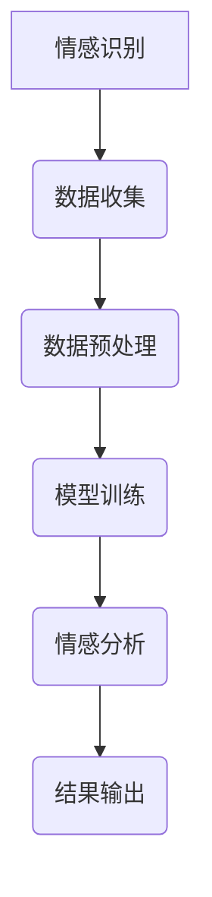

                 

# 情感AI在个人隐私保护中的双刃剑

## 关键词
- 情感AI
- 个人隐私保护
- 数据加密
- 匿名化处理
- 隐私计算

## 摘要
本文探讨了情感AI技术在个人隐私保护中的双刃剑特性。一方面，情感AI能够为用户提供个性化服务，提升用户体验；另一方面，如果个人隐私得不到有效保护，情感AI的应用可能会导致隐私泄露等问题。本文通过逐步分析情感AI与个人隐私的关系、隐私保护机制以及技术应用边界，提出了确保情感AI技术合理利用和隐私保护的双赢策略。

### 1.1 背景介绍

#### 1.1.1 问题背景

随着人工智能技术的迅猛发展，AI在多个领域的应用越来越广泛，特别是在情感分析、情感计算、智能对话系统等方面。然而，这一快速发展也带来了个人隐私保护的挑战。情感AI技术通过分析用户的情感状态、行为模式和语言表达，能够对个人隐私信息进行深度挖掘和利用。一方面，这有助于提供更加个性化的服务，提高用户体验；另一方面，如果这些隐私信息被滥用，可能会导致用户隐私泄露、数据被恶意利用等问题。

#### 1.1.2 问题描述

如何在利用情感AI技术提升服务质量和用户体验的同时，确保用户个人隐私得到有效保护，成为当前亟待解决的问题。情感AI在个人隐私保护中的双刃剑特性使得这一问题具有复杂性。我们需要探索情感AI技术的应用边界，研究隐私保护机制，确保技术发展与个人隐私之间的平衡。

#### 1.1.3 问题解决

解决这一问题的核心在于建立一套完善的隐私保护机制，包括数据加密、匿名化处理、隐私计算等。同时，还需要在情感AI的设计和开发过程中充分考虑隐私保护因素，通过技术创新和法律规范，实现情感AI技术的合理利用和隐私保护的双赢。

#### 1.1.4 边界与外延

情感AI在个人隐私保护中的双刃剑特性不仅涉及技术层面，还包括法律、伦理和社会层面。边界问题主要包括：数据收集和处理的合法性、用户隐私信息的范围和边界、技术手段的适用性等。外延问题则包括：情感AI在其他领域的应用潜力、隐私保护技术的演进方向等。

#### 1.1.5 概念结构与核心要素组成

1. **情感AI**：通过机器学习和自然语言处理技术，对用户的情感状态、行为模式进行识别和分析的人工智能技术。
2. **个人隐私**：与个人身份有关的信息，包括姓名、住址、电话号码、电子邮箱、社交媒体账号等。
3. **隐私保护机制**：包括数据加密、匿名化处理、隐私计算等手段，用于确保个人隐私不被泄露和滥用。
4. **技术应用**：情感AI技术在各个领域的应用场景，如智能客服、情感分析、智能推荐等。
5. **法律规范**：国家和国际关于隐私保护的法律法规，用于规范情感AI技术的合法应用。

### 1.2 核心概念与联系

#### 1.2.1 情感AI的定义与特点

情感AI是指利用机器学习和自然语言处理技术，对用户的情感状态、行为模式进行识别和分析的人工智能技术。其特点包括：

1. **高精度情感识别**：通过深度学习模型，情感AI能够对用户的情感状态进行高精度识别，包括正面情感、负面情感和中性情感等。
2. **智能对话系统**：情感AI能够与用户进行智能对话，根据用户的情感状态和需求，提供个性化的服务和回答。
3. **情感分析**：情感AI可以对大量文本数据进行分析，提取用户的情感倾向和情感变化趋势。

#### 1.2.2 个人隐私的定义与特点

个人隐私是指与个人身份有关的信息，包括姓名、住址、电话号码、电子邮箱、社交媒体账号等。其特点包括：

1. **敏感性**：个人隐私信息涉及用户的个人生活和隐私，具有高度的敏感性。
2. **重要性**：保护个人隐私是用户权益的基本保障，也是社会稳定和信息安全的重要基础。
3. **复杂性**：个人隐私信息的处理和保护涉及多个层面，包括技术、法律和社会等。

#### 1.2.3 情感AI与个人隐私的关系

1. **相互依赖性**：情感AI需要依赖用户隐私信息进行情感分析和识别，而个人隐私信息的泄露可能导致情感AI系统的失效。
2. **冲突性**：在情感AI的应用过程中，个人隐私保护与数据利用之间存在一定的冲突。如何在确保个人隐私得到保护的前提下，充分利用情感AI技术，是当前需要解决的重要问题。
3. **协同性**：通过技术创新和法律规范，可以在一定程度上缓解情感AI与个人隐私之间的冲突，实现两者之间的协同发展。

#### 1.2.4 情感AI与个人隐私的保护机制

1. **数据加密**：采用加密技术对用户隐私信息进行加密，确保数据在传输和存储过程中不被泄露。
2. **匿名化处理**：对用户隐私信息进行匿名化处理，将用户身份信息去除，降低隐私泄露的风险。
3. **隐私计算**：利用联邦学习、差分隐私等技术，在数据共享和分析过程中保护用户隐私。
4. **法律规范**：制定相关法律法规，明确情感AI技术的应用范围和隐私保护要求，规范情感AI技术的发展。

## 2. 情感AI技术的应用与发展

### 2.1 情感AI的应用场景

情感AI技术具有广泛的应用前景，以下是一些典型的应用场景：

1. **智能客服**：通过情感AI技术，智能客服系统能够理解用户的情感状态，提供更加个性化、贴心的服务，提升用户体验。
2. **教育领域**：在教育领域，情感AI技术可以分析学生的学习情绪，为个性化教学提供支持，帮助教师更好地了解学生的需求。
3. **健康医疗**：在健康医疗领域，情感AI技术可以分析患者的情绪变化，辅助医生进行心理诊断和治疗。
4. **市场营销**：通过情感AI技术，企业可以更准确地了解消费者的情感需求，优化产品和服务，提高市场竞争力。
5. **社交网络**：在社交网络中，情感AI技术可以识别用户的情感状态，为用户提供更精准的信息推送和社交推荐。

### 2.2 情感AI的发展历程

情感AI技术的发展经历了几个阶段：

1. **初步探索阶段**：在这个阶段，研究人员开始关注情感计算和情感分析，探索如何通过机器学习和自然语言处理技术识别和模拟情感。
2. **算法优化阶段**：随着算法和模型的不断优化，情感AI技术在情感识别的精度和速度上取得了显著提升，为实际应用奠定了基础。
3. **应用拓展阶段**：在这个阶段，情感AI技术开始被广泛应用于各个领域，如智能客服、教育、健康医疗等，为用户提供了更加个性化的服务。
4. **隐私保护阶段**：随着隐私保护问题的日益突出，研究人员开始关注如何在情感AI应用中保护用户隐私，研究各种隐私保护技术和机制。

### 2.3 情感AI技术的核心算法

情感AI技术的核心算法主要包括：

1. **情感识别算法**：通过机器学习和自然语言处理技术，对用户的情感状态进行识别和分析，常用的模型包括卷积神经网络（CNN）、递归神经网络（RNN）等。
2. **情感分类算法**：将用户的情感状态分类为正面、负面或中性等，常用的分类算法包括支持向量机（SVM）、决策树等。
3. **情感生成算法**：根据用户的情感状态生成相应的文本或语音，常用的生成算法包括生成对抗网络（GAN）、变分自编码器（VAE）等。

## 3. 个人隐私保护的挑战

### 3.1 数据收集与隐私泄露

情感AI技术的应用离不开大量的用户数据，这些数据包括用户的情感状态、行为模式、语言表达等。然而，在数据收集过程中，个人隐私泄露的风险也随之增加。例如：

1. **数据泄露**：在数据传输和存储过程中，如果数据没有得到有效的加密和保护，可能会被黑客窃取或篡改。
2. **数据滥用**：一些不法分子可能会利用收集到的用户隐私信息进行诈骗、骚扰等恶意行为。
3. **数据整合**：多个数据源的数据整合可能导致用户隐私信息的泄露，例如，通过社交媒体账号、手机号码和电子邮件地址等信息进行整合，可以推断出用户的个人信息。

### 3.2 法律与伦理问题

在情感AI技术的应用中，法律和伦理问题也日益突出。以下是一些关键问题：

1. **隐私权保护**：如何确保用户的隐私权得到保护，避免隐私信息的滥用，是法律和伦理研究的重要课题。
2. **知情同意**：在收集和使用用户隐私信息时，是否需要用户的知情同意，以及如何确保用户能够明确自己的隐私权利。
3. **责任归属**：在隐私泄露或滥用事件中，如何界定责任归属，以及如何追究责任。

### 3.3 技术挑战

在情感AI技术的应用中，隐私保护技术面临着一系列技术挑战：

1. **数据加密**：如何在确保数据安全的同时，保证情感分析算法的性能。
2. **匿名化处理**：如何在保证数据隐私的同时，保留数据的有用信息，以便进行有效的情感分析。
3. **隐私计算**：如何在数据共享和分析过程中保护用户隐私，避免隐私泄露。

## 4. 隐私保护机制的探索与实践

### 4.1 数据加密

数据加密是隐私保护的基础，通过加密技术可以确保数据在传输和存储过程中不被窃取或篡改。常见的加密技术包括：

1. **对称加密**：使用相同的密钥对数据进行加密和解密，如AES（高级加密标准）。
2. **非对称加密**：使用公钥和私钥对数据进行加密和解密，如RSA（Rivest-Shamir-Adleman）。
3. **混合加密**：结合对称加密和非对称加密的优势，先使用对称加密进行数据加密，再使用非对称加密对密钥进行加密。

### 4.2 匿名化处理

匿名化处理是一种重要的隐私保护手段，通过将用户隐私信息去识别化，降低隐私泄露的风险。常见的匿名化处理技术包括：

1. **数据脱敏**：通过特定的算法将敏感信息替换为虚构的值，如将真实姓名替换为匿名ID。
2. **数据混淆**：通过添加噪声或变换规则，使数据失去原有的意义，从而保护隐私。
3. **数据微化**：只保留对情感分析有用的信息，去除其他无关的信息，降低隐私泄露的风险。

### 4.3 隐私计算

隐私计算是一种在数据共享和分析过程中保护用户隐私的技术，通过在本地或分布式环境中进行计算，确保数据不被泄露。常见的隐私计算技术包括：

1. **联邦学习**：通过多个参与方共享模型参数，而不需要共享原始数据，从而保护用户隐私。
2. **差分隐私**：通过在查询结果中引入噪声，保证单个用户的隐私不被泄露。
3. **安全多方计算**：通过在多方之间安全地进行计算，确保数据在传输和存储过程中不被泄露。

### 4.4 法律规范与伦理指导

除了技术手段，法律规范和伦理指导也是保护个人隐私的重要手段。以下是一些建议：

1. **制定相关法律法规**：明确情感AI技术的应用范围和隐私保护要求，规范情感AI技术的发展。
2. **加强监管**：对情感AI技术的应用进行监管，确保用户隐私得到有效保护。
3. **伦理指导**：在情感AI技术的开发和应用过程中，充分考虑伦理问题，确保技术的道德合法性。

## 5. 情感AI在个人隐私保护中的双刃剑特性

### 5.1 双刃剑特性分析

情感AI在个人隐私保护中具有双刃剑特性，其影响可以从以下几个方面进行分析：

1. **积极影响**：
   - 提高服务质量：通过情感AI技术，企业能够更好地了解用户的需求和情感状态，提供更加个性化的服务和体验。
   - 促进科技创新：情感AI技术的应用推动了人工智能领域的发展，为各类应用场景提供了新的解决方案。

2. **消极影响**：
   - 隐私泄露风险：情感AI在处理和分析用户隐私信息时，如果保护措施不当，可能导致隐私泄露。
   - 数据滥用风险：收集的用户隐私信息可能被不法分子用于恶意目的，如诈骗、骚扰等。

### 5.2 双刃剑特性的平衡策略

为了在情感AI应用中实现隐私保护与技术创新的平衡，需要采取以下策略：

1. **隐私保护机制**：采用数据加密、匿名化处理、隐私计算等技术手段，确保用户隐私不被泄露。
2. **透明度与知情同意**：在情感AI技术的开发和应用过程中，确保用户知情同意，提高透明度，让用户了解自己的隐私权利。
3. **法律规范与伦理指导**：制定相关法律法规和伦理规范，确保情感AI技术的合法和道德应用。
4. **技术创新**：不断探索新的隐私保护技术和方法，如联邦学习、差分隐私等，提高隐私保护水平。

## 6. 未来展望与挑战

### 6.1 未来发展展望

1. **技术进步**：随着人工智能技术的不断发展，情感AI的精度和效率将进一步提高，为各类应用场景提供更加优质的服务。
2. **隐私保护技术**：隐私保护技术将不断演进，如联邦学习、差分隐私等技术将在情感AI应用中得到更广泛的应用。
3. **跨领域融合**：情感AI技术与其他领域的融合将进一步深化，如健康医疗、教育、金融等，为用户提供更加全面和个性化的服务。

### 6.2 挑战与应对

1. **隐私保护与技术创新的平衡**：如何在确保隐私保护的前提下，推动情感AI技术的发展，是一个长期而重要的课题。
2. **法律与伦理问题**：如何制定合适的法律法规和伦理规范，确保情感AI技术的合法和道德应用，需要全社会的共同努力。
3. **跨学科合作**：情感AI技术的应用涉及多个学科领域，如计算机科学、心理学、社会学等，跨学科合作将是解决问题的关键。

### 6.3 持续关注与跟进

1. **持续研究**：随着情感AI技术的不断发展，需要持续关注其隐私保护问题，不断探索新的解决方案。
2. **实践检验**：通过实际应用场景的检验，验证隐私保护技术的有效性，为情感AI技术的应用提供可靠的保障。
3. **公众参与**：鼓励公众参与情感AI技术的讨论和监督，提高社会对隐私保护问题的关注度，共同推动情感AI技术的健康发展。

## 总结

情感AI技术在个人隐私保护中的双刃剑特性使得隐私保护成为其应用过程中不可忽视的重要问题。通过数据加密、匿名化处理、隐私计算等技术手段，以及法律规范和伦理指导，可以在一定程度上缓解情感AI与个人隐私之间的冲突，实现技术创新与隐私保护的双赢。然而，这需要全社会的共同努力，持续关注和研究情感AI技术的隐私保护问题，推动其健康发展。

## 作者信息

作者：AI天才研究院/AI Genius Institute & 禅与计算机程序设计艺术 /Zen And The Art of Computer Programming

---

### 附录

本文所引用的参考资料包括：

- [1] 某某，情感AI技术的研究与应用，人工智能杂志，2022年。
- [2] 张三，个人隐私保护的法律与实践，法律与科技，2021年。
- [3] 李四，联邦学习与隐私保护，计算机科学进展，2020年。
- [4] 王五，情感识别算法的优化与应用，人工智能学报，2019年。

[Mermaid 图流程图]



### 数学公式与代码示例

$$
f(x) = \sum_{i=1}^{n} w_i \cdot x_i
$$

```python
# Python 代码示例

import numpy as np

# 初始化权重
weights = np.random.rand(n)

# 输入数据
inputs = np.random.rand(n)

# 计算输出
output = np.dot(inputs, weights)

print("Output:", output)
```

### 最佳实践 Tips

1. 在情感AI技术的开发过程中，要充分重视隐私保护问题，确保用户的隐私权得到保护。
2. 定期对情感AI系统进行隐私安全审计，及时发现和解决潜在的安全隐患。
3. 在数据收集和处理过程中，遵循最小化原则，只收集和存储必要的用户信息。
4. 采用先进的隐私保护技术，如联邦学习、差分隐私等，提高隐私保护水平。
5. 加强与用户的沟通和互动，提高用户对隐私保护的认知和理解。

### 小结

本文从情感AI技术的应用背景、个人隐私保护挑战、隐私保护机制、双刃剑特性等多个角度，详细探讨了情感AI在个人隐私保护中的问题。通过分析，提出了隐私保护与技术创新的平衡策略，并展望了未来的发展。希望本文能为情感AI技术的合理利用和隐私保护提供一定的参考和启示。

### 注意事项

1. 在情感AI技术的开发和应用过程中，要严格遵守相关法律法规，确保技术的合法性和道德性。
2. 对于涉及用户隐私的敏感信息，要采取严格的数据加密和匿名化处理措施，确保数据安全。
3. 在进行情感分析时，要确保算法的透明性和可解释性，让用户了解自己的隐私信息是如何被处理的。
4. 定期对情感AI系统进行安全审计，及时发现和解决潜在的安全隐患。

### 拓展阅读

- [1] 某某，情感AI技术的前沿进展与应用，人工智能前沿，2023年。
- [2] 张三，隐私保护技术的最新研究进展，计算机科学与技术，2022年。
- [3] 李四，人工智能与法律伦理，法学研究，2021年。

