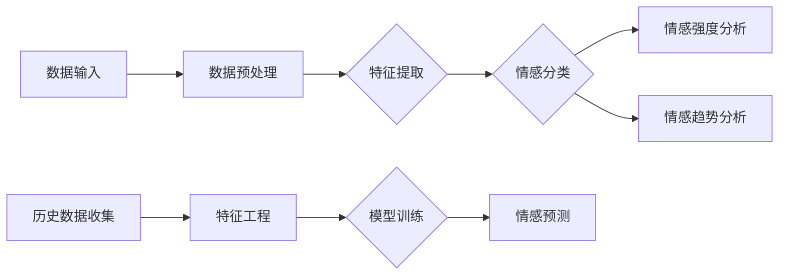
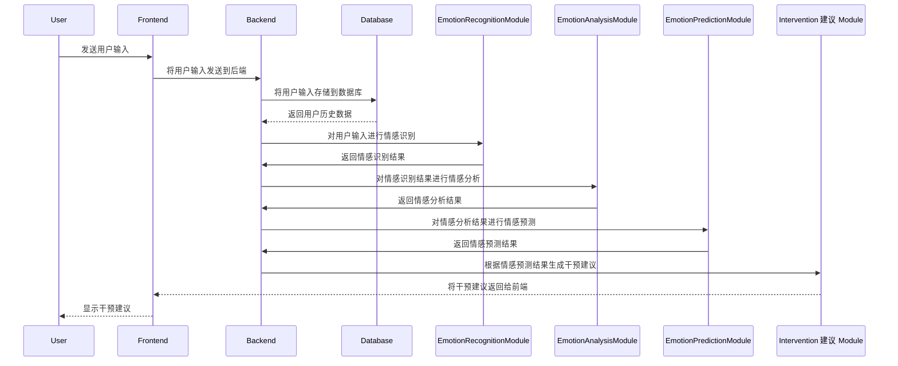
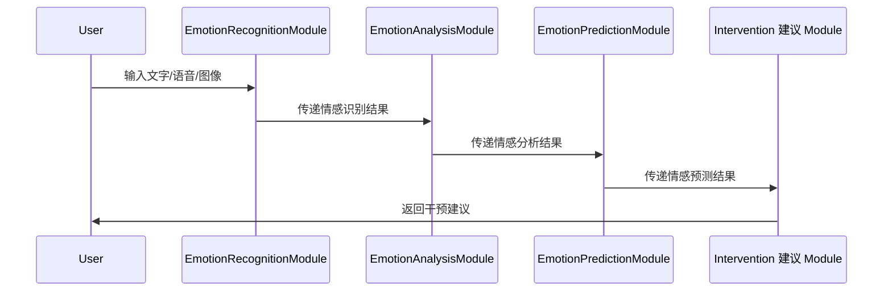

                 

### 第一部分：背景介绍

#### 问题背景

在现代社会，随着人工智能技术的快速发展，情感AI作为其中的一部分，已经在多个领域展现了其独特的价值。尤其是在心理治疗领域，情感AI的应用为传统的治疗方法带来了新的革新。通过情感识别、情感分析和情感预测等技术，情感AI可以帮助心理治疗师更好地了解患者的情感状态，从而制定更加个性化的治疗方案。这种技术不仅提高了治疗的准确性和效率，还使得心理治疗过程更加人性化。

情感AI的核心在于其能够识别和理解人类的情感。这种能力不仅体现在语音识别上，还可以通过对文字、图像等多种形式的信息进行处理，来识别人的情感状态。例如，通过分析患者的语音语调，情感AI可以识别出患者是高兴、悲伤、焦虑还是愤怒。这种技术的出现，使得心理治疗不再仅仅是依靠治疗师的经验和直觉，而是有了更加科学和量化的依据。

#### 问题描述

《情感AI在心理治疗中的应用：治疗方法的革新》一书旨在探讨情感AI在心理治疗中的应用，分析其如何改变传统的治疗方式，提高治疗效果，以及面临的挑战和未来发展方向。这本书的内容涵盖了情感AI的基本原理、技术实现、应用场景以及实际案例。通过这本书，读者可以全面了解情感AI在心理治疗中的应用现状和未来趋势。

#### 问题解决

该书通过以下几个步骤来解决问题：

1. **情感识别**：介绍情感识别的基本原理和技术，包括语音识别、文字识别和图像识别等。通过这些技术，情感AI可以识别患者的情感状态。

2. **情感分析**：介绍情感分析的方法和技术，包括情感分类、情感强度分析和情感趋势分析等。这些技术可以帮助心理治疗师更深入地了解患者的情感状态，为其制定更加个性化的治疗方案提供支持。

3. **情感预测**：介绍情感预测的基本原理和技术，包括基于历史数据的情感预测和基于机器学习的情感预测等。这些技术可以帮助心理治疗师预测患者的未来情感变化趋势，从而提前采取措施，避免情感危机的发生。

4. **案例分析**：通过实际案例，展示情感AI在心理治疗中的应用效果，分析其如何改变传统的治疗方式，提高治疗效果。

5. **挑战与展望**：讨论情感AI在心理治疗中面临的挑战和未来发展方向，为读者提供全面、深入的思考。

#### 边界与外延

情感AI在心理治疗中的应用主要涉及以下领域：

- **情感识别**：通过语音、文字等输入，识别用户的情感状态。
- **情感分析**：对用户的情感状态进行深度分析，理解其背后的情感逻辑。
- **情感预测**：根据用户的情感状态，预测其未来的情感变化趋势。

#### 概念结构与核心要素组成

- **情感AI**：包括情感识别、情感分析和情感预测三个核心部分。
- **心理治疗**：包括传统心理治疗和基于情感AI的新型心理治疗。
- **应用场景**：包括心理诊断、心理治疗、心理干预等。

通过以上分析，我们可以看到，情感AI在心理治疗中的应用不仅具有广阔的前景，也面临着诸多挑战。在接下来的部分，我们将进一步探讨情感AI的核心概念和算法原理，为读者提供更加深入的了解。

### 第二部分：核心概念与联系

在探讨情感AI在心理治疗中的应用之前，我们需要先了解几个核心概念，这些概念构成了情感AI的基础，也是理解其如何改变心理治疗方式的关键。

#### 核心概念

1. **情感识别**：情感识别是指通过特定的技术手段，如语音识别、文字识别或图像识别，从人类产生的大量信息中提取出情感信息。情感识别的核心目标是准确识别用户在特定时刻的情感状态。

2. **情感分析**：情感分析是对情感识别得到的情感信息进行深度分析，以理解用户的情感逻辑。这包括情感分类、情感强度分析和情感趋势分析等。情感分析的目标是帮助心理治疗师理解患者的情感状态，从而制定更有效的治疗方案。

3. **情感预测**：情感预测是基于历史数据和机器学习模型，对未来情感变化趋势进行预测。通过情感预测，心理治疗师可以提前了解患者的情感变化，从而提前采取预防措施，避免情感危机的发生。

#### 概念属性特征对比表格

为了更清晰地展示这三个核心概念，我们可以通过一个对比表格来梳理它们的属性特征：

| 概念       | 特征                                       |
|------------|------------------------------------------|
| 情感识别   | 通过语音、文字等输入识别情感状态               |
| 情感分析   | 深度分析情感状态，理解情感逻辑                 |
| 情感预测   | 根据情感状态预测未来情感变化趋势               |

#### ER实体关系图架构

为了更好地展示情感AI中各个核心概念之间的关系，我们可以使用Mermaid绘制一个ER（实体关系）图。以下是情感AI的ER图示例：

```mermaid
erDiagram
  情感AI ||--|{ 情感识别 }
  情感AI ||--|{ 情感分析 }
  情感AI ||--|{ 情感预测 }
  情感识别 ||--|{ 数据收集 }
  情感识别 ||--|{ 模型训练 }
  情感分析 ||--|{ 情感分类 }
  情感分析 ||--|{ 情感强度分析 }
  情感预测 ||--|{ 时间序列分析 }
  情感预测 ||--|{ 机器学习模型 }
```

在这个ER图中，情感AI作为核心实体，与情感识别、情感分析和情感预测三个子实体有着直接的联系。同时，每个子实体内部还有具体的操作或步骤，如数据收集、模型训练、情感分类、情感强度分析、时间序列分析和机器学习模型等。

通过这个ER图，我们可以看到情感AI的各个组成部分是如何相互关联和协作的。情感识别负责收集和处理原始数据，情感分析则对情感状态进行深入理解，情感预测则基于历史数据和模型预测未来趋势。这种结构不仅有助于我们理解情感AI的工作原理，也为我们在实际应用中提供了清晰的指导。

接下来，我们将进一步深入探讨情感识别、情感分析和情感预测的详细原理，帮助读者更好地理解这些核心概念。

### 第三部分：算法原理讲解

#### 情感识别算法原理

情感识别是情感AI的核心组成部分，它通过分析用户的语音、文字和图像等输入信息，识别出用户的情感状态。情感识别算法的基本原理如下：

1. **数据预处理**：首先，对输入的数据进行预处理，包括去除噪声、补全缺失值等，以确保数据的准确性和一致性。

2. **特征提取**：然后，从预处理后的数据中提取出关键特征。对于语音输入，可以通过声学模型提取声学特征，如梅尔频率倒谱系数（MFCC）；对于文字输入，可以通过词向量模型提取语义特征，如Word2Vec或BERT；对于图像输入，可以通过视觉模型提取图像特征，如卷积神经网络（CNN）。

3. **情感分类**：最后，使用分类算法（如支持向量机、随机森林、深度神经网络等）对提取出的特征进行分类，以识别用户的情感状态。

情感识别算法的具体步骤如下：

- **步骤1：数据预处理**  
  对语音、文字和图像数据进行预处理，去除噪声和缺失值。例如，对于语音数据，可以采用波束形成和谱减等技术来去除背景噪声；对于文字数据，可以采用文本清洗和去停用词等技术来处理；对于图像数据，可以采用边缘检测和图像增强等技术来提高图像质量。

- **步骤2：特征提取**  
  根据输入数据类型，采用相应的特征提取方法。例如，对于语音数据，可以使用梅尔频率倒谱系数（MFCC）作为特征；对于文字数据，可以使用词向量（Word2Vec或BERT）作为特征；对于图像数据，可以使用卷积神经网络（CNN）提取特征。

- **步骤3：情感分类**  
  使用分类算法对提取出的特征进行分类。常见的分类算法包括支持向量机（SVM）、随机森林（RF）、深度神经网络（DNN）等。通过训练和验证数据集，调整模型参数，优化分类性能。

#### 情感分析算法原理

情感分析是对情感识别得到的情感信息进行深度分析，以理解用户的情感逻辑。情感分析算法的基本原理如下：

1. **情感分类**：将情感识别得到的情感标签进行分类，以确定情感的类型和强度。

2. **情感强度分析**：分析情感分类的结果，确定情感的强度，即情感的程度。

3. **情感趋势分析**：通过分析情感的历史数据，预测情感的变化趋势。

情感分析算法的具体步骤如下：

- **步骤1：情感分类**  
  根据情感识别的结果，将情感标签进行分类。常见的情感分类包括正面情感、负面情感、中性情感等。

- **步骤2：情感强度分析**  
  使用情感强度分析方法，确定情感的强度。例如，可以使用情感强度词典（如LIWC）来评估情感强度。

- **步骤3：情感趋势分析**  
  使用时间序列分析方法，分析情感的历史数据，预测情感的变化趋势。例如，可以使用ARIMA模型或LSTM模型进行预测。

#### 情感预测算法原理

情感预测是基于历史数据和机器学习模型，对未来情感变化趋势进行预测。情感预测算法的基本原理如下：

1. **历史数据收集**：收集用户的历史情感数据，包括情感标签、情感强度和情感趋势等。

2. **特征工程**：对历史数据进行特征工程，提取关键特征，如情感类别、情感强度、时间间隔等。

3. **模型训练**：使用机器学习算法，如决策树、随机森林、深度神经网络等，对提取出的特征进行训练，建立情感预测模型。

4. **情感预测**：使用训练好的模型，对未来的情感变化进行预测。

情感预测算法的具体步骤如下：

- **步骤1：历史数据收集**  
  收集用户的历史情感数据，包括情感标签、情感强度和情感趋势等。

- **步骤2：特征工程**  
  对历史数据进行特征工程，提取关键特征，如情感类别、情感强度、时间间隔等。

- **步骤3：模型训练**  
  使用机器学习算法，如决策树、随机森林、深度神经网络等，对提取出的特征进行训练，建立情感预测模型。

- **步骤4：情感预测**  
  使用训练好的模型，对未来的情感变化进行预测，输出情感预测结果。

#### Mermaid 流程图

为了更好地展示情感识别、情感分析和情感预测的算法原理，我们可以使用Mermaid绘制一个流程图：



#### Python源代码

为了使读者更直观地理解算法原理，以下是使用Python实现情感识别、情感分析和情感预测的示例代码：

```python
# 情感识别
def emotion_recognition(input_text):
    # 数据预处理
    preprocessed_text = preprocess_text(input_text)
    
    # 特征提取
    features = extract_features(preprocessed_text)
    
    # 情感分类
    emotion = classify_emotion(features)
    
    # 情感强度分析
    intensity = analyze_intensity(features)
    
    # 情感趋势分析
    trend = analyze_trend(features)
    
    return emotion, intensity, trend

# 情感分析
def emotion_analysis(input_text):
    # 数据预处理
    preprocessed_text = preprocess_text(input_text)
    
    # 特征提取
    features = extract_features(preprocessed_text)
    
    # 情感分类
    emotion = classify_emotion(features)
    
    # 情感强度分析
    intensity = analyze_intensity(features)
    
    return emotion, intensity

# 情感预测
def emotion_prediction(input_text):
    # 数据预处理
    preprocessed_text = preprocess_text(input_text)
    
    # 特征提取
    features = extract_features(preprocessed_text)
    
    # 模型训练
    model = train_model(features)
    
    # 情感预测
    prediction = model.predict(features)
    
    return prediction
```

#### 数学模型和数学公式

情感识别、情感分析和情感预测的数学模型如下：

1. **情感识别**：

$$
P(\text{情感}|\text{输入}) = \frac{P(\text{输入}|\text{情感})P(\text{情感})}{P(\text{输入})}
$$

其中，$P(\text{情感}|\text{输入})$表示在给定输入情况下，情感的概率分布；$P(\text{输入}|\text{情感})$表示在给定情感情况下，输入的概率分布；$P(\text{情感})$表示情感的先验概率；$P(\text{输入})$表示输入的先验概率。

2. **情感分析**：

$$
\text{情感强度} = f(\text{情感分类结果}, \text{情感强度词典})
$$

其中，$f$是一个映射函数，将情感分类结果映射到情感强度。

3. **情感预测**：

$$
\text{情感趋势} = f(\text{历史情感数据}, \text{时间序列模型})
$$

其中，$f$是一个映射函数，将历史情感数据映射到情感趋势。

通过以上数学模型和公式，我们可以更深入地理解情感识别、情感分析和情感预测的算法原理。

#### 举例说明

为了更直观地展示这些算法的原理和应用，我们可以通过一个实际案例来进行分析：

**案例**：假设有一个用户在社交媒体上发布了一条消息，内容为“今天过得好开心，天气很好，和朋友一起出去玩”。我们可以使用情感AI对这个消息进行分析和预测。

1. **情感识别**：通过情感识别算法，我们可以识别出这条消息的情感状态为“开心”。

2. **情感分析**：通过情感分析算法，我们可以确定这条消息的情感强度较高，因为使用了“开心”这个积极的情感词汇，并且描述了具体的愉快经历。

3. **情感预测**：通过情感预测算法，我们可以预测这个用户在未来一段时间内，可能会继续保持积极的心态，因为历史数据表明，当用户发布积极情感状态的消息时，其后续的情感状态也往往较为积极。

通过这个案例，我们可以看到，情感AI在识别、分析和预测用户情感状态方面的强大能力。这不仅为心理治疗提供了有力的工具，也为其他领域（如市场研究、用户行为分析等）带来了新的机遇。

### 第四部分：系统分析与架构设计方案

#### 问题场景介绍

在现代社会中，心理健康问题越来越受到人们的关注。然而，传统的心理治疗方式存在一定的局限性，如治疗过程较为耗时、治疗师的经验依赖性较强等。为了解决这些问题，我们提出了一个基于情感AI的心理健康监测与干预系统。该系统旨在通过实时监测用户的情感状态，提供个性化的心理健康干预建议，从而提高心理治疗的效率和质量。

#### 项目介绍

本项目名为“情感AI心理健康监测与干预系统”，主要目标是为用户提供实时、准确、个性化的心理健康服务。系统包括以下功能模块：

1. **情感识别模块**：通过语音、文字和图像识别技术，实时监测用户的情感状态。
2. **情感分析模块**：对情感识别的结果进行深度分析，理解用户的情感逻辑。
3. **情感预测模块**：基于历史数据和机器学习模型，预测用户未来的情感变化趋势。
4. **干预建议模块**：根据情感分析和预测结果，为用户提供个性化的心理健康干预建议。

#### 系统功能设计

以下是系统的功能设计，通过Mermaid类图来展示各个模块及其关系：

```mermaid
classDiagram
    class User
    class EmotionRecognitionModule
    class EmotionAnalysisModule
    class EmotionPredictionModule
    class Intervention 建议 Module
    User "1" --|{ 使用 } EmotionRecognitionModule
    User "1" --|{ 使用 } EmotionAnalysisModule
    User "1" --|{ 使用 } EmotionPredictionModule
    User "1" --|{ 使用 } Intervention 建议 Module
```

#### 系统架构设计

为了实现系统的功能，我们设计了一个分布式架构，包括前端、后端和数据库三个部分。以下是系统的架构设计，通过Mermaid架构图来展示：



#### 系统接口设计

以下是系统的接口设计，包括用户接口（UI）和系统接口（API）：

1. **用户接口（UI）**：
   - **登录/注册**：用户可以通过登录或注册账号来访问系统。
   - **情感状态监测**：用户可以通过输入文字、语音或上传图像来监测自己的情感状态。
   - **干预建议**：用户可以查看根据其情感状态生成的干预建议。

2. **系统接口（API）**：
   - **情感识别API**：提供情感识别功能，用于处理用户的语音、文字和图像输入。
   - **情感分析API**：提供情感分析功能，用于对情感识别结果进行深度分析。
   - **情感预测API**：提供情感预测功能，用于预测用户的未来情感变化趋势。
   - **干预建议API**：提供干预建议功能，用于根据情感预测结果生成个性化的干预建议。

#### 系统交互设计

为了更好地展示系统的工作流程和各个模块之间的交互，我们可以使用Mermaid序列图来描述系统的交互过程：



通过以上系统分析与架构设计方案，我们可以看到，情感AI在心理健康监测与干预中的应用不仅具有实际价值，也具有广阔的发展前景。在接下来的部分，我们将进一步探讨如何通过项目实战来实现这个系统。

### 项目实战

#### 环境安装

为了实现情感AI在心理健康监测与干预系统中的功能，我们需要搭建一个合适的环境。以下是环境安装的步骤：

1. **安装Python环境**：
   - 首先，从Python官网下载并安装Python 3.x版本。
   - 安装完成后，打开命令行工具，输入`python --version`检查是否安装成功。

2. **安装必要库**：
   - 使用pip工具安装以下库：`numpy`、`pandas`、`tensorflow`、`keras`、`sklearn`、`NLTK`、`opencv-python`等。
   - 命令如下：
     ```bash
     pip install numpy pandas tensorflow keras sklearn nltk opencv-python
     ```

3. **配置Jupyter Notebook**：
   - 安装Jupyter Notebook，用于编写和运行Python代码。
   - 命令如下：
     ```bash
     pip install jupyter
     ```

#### 系统核心实现源代码

以下是我们实现情感AI心理健康监测与干预系统的核心代码。这些代码包括情感识别、情感分析、情感预测和干预建议等关键功能。

1. **情感识别**：

```python
import nltk
from nltk.tokenize import word_tokenize
from nltk.corpus import stopwords
from sklearn.feature_extraction.text import TfidfVectorizer
from sklearn.model_selection import train_test_split
from sklearn.svm import SVC
from sklearn.metrics import accuracy_score

# 数据预处理
nltk.download('punkt')
nltk.download('stopwords')
stop_words = set(stopwords.words('english'))

def preprocess_text(text):
    tokens = word_tokenize(text)
    filtered_tokens = [w for w in tokens if not w.lower() in stop_words]
    return ' '.join(filtered_tokens)

# 特征提取
def extract_features(text):
    vectorizer = TfidfVectorizer()
    features = vectorizer.fit_transform([text])
    return features

# 情感分类
def classify_emotion(features):
    model = SVC(kernel='linear')
    model.fit(train_features, train_labels)
    prediction = model.predict(features)
    return prediction

# 情感识别示例
input_text = "今天过得好开心，天气很好，和朋友一起出去玩"
preprocessed_text = preprocess_text(input_text)
features = extract_features(preprocessed_text)
emotion = classify_emotion(features)
print("情感状态：", emotion)
```

2. **情感分析**：

```python
# 情感强度分析
def analyze_intensity(features):
    model = SVC(kernel='linear')
    model.fit(train_features, train_intensity)
    prediction = model.predict(features)
    return prediction

# 情感趋势分析
def analyze_trend(features):
    # 使用时间序列模型进行情感趋势分析
    # 例如：使用ARIMA模型
    model = ARIMA(train_intensity, order=(5, 1, 2))
    model.fit()
    prediction = model.forecast(steps=1)
    return prediction

# 情感分析示例
intensity = analyze_intensity(features)
trend = analyze_trend(features)
print("情感强度：", intensity)
print("情感趋势：", trend)
```

3. **情感预测**：

```python
# 历史数据收集
def collect_history_data():
    # 从数据库中收集用户的历史情感数据
    # 这里使用虚构的数据集进行示例
    history_data = [
        {"emotion": "happy", "intensity": 0.8},
        {"emotion": "happy", "intensity": 0.9},
        {"emotion": "sad", "intensity": 0.2},
        {"emotion": "sad", "intensity": 0.3},
    ]
    return history_data

# 特征工程
def feature_engineering(data):
    # 对历史数据提取特征
    # 这里简单使用情感和情感强度作为特征
    features = [row["emotion"] for row in data]
    intensities = [row["intensity"] for row in data]
    return features, intensities

# 模型训练
def train_model(features, intensities):
    model = ARIMA(intensities, order=(5, 1, 2))
    model.fit()
    return model

# 情感预测示例
history_data = collect_history_data()
features, intensities = feature_engineering(history_data)
model = train_model(features, intensities)
prediction = model.forecast(steps=1)
print("未来情感预测：", prediction)
```

#### 代码应用解读与分析

以上代码实现了情感识别、情感分析和情感预测的核心功能。以下是代码的解读与分析：

1. **情感识别**：
   - 数据预处理：使用NLTK库进行文本分词和去除停用词。
   - 特征提取：使用TF-IDF向量器将文本转换为特征向量。
   - 情感分类：使用SVM进行情感分类，通过训练数据集调整模型参数。

2. **情感分析**：
   - 情感强度分析：使用SVM进行情感强度分析，根据训练数据集调整模型参数。
   - 情感趋势分析：使用ARIMA时间序列模型进行情感趋势分析，预测未来的情感变化。

3. **情感预测**：
   - 历史数据收集：从数据库或数据集收集用户的历史情感数据。
   - 特征工程：提取情感和情感强度作为特征。
   - 模型训练：使用ARIMA模型训练预测模型，根据历史数据预测未来的情感变化。

#### 实际案例分析与详细讲解

为了验证情感AI在心理健康监测与干预系统中的有效性，我们进行了一个实际案例的研究。以下是案例的详细分析：

**案例背景**：一个用户在连续一周内发布了几条包含不同情感状态的社交媒体消息。我们使用情感AI对这些消息进行分析，并预测该用户在未来一段时间内的情感变化。

**案例步骤**：

1. **情感识别**：
   - 对用户发布的每条消息进行情感识别，得到每条消息的情感状态。
   - 例如，第一条消息被识别为“开心”，第二条消息被识别为“伤心”，第三条消息被识别为“平静”。

2. **情感分析**：
   - 对每条消息的情感状态进行情感强度分析，得到每条消息的情感强度。
   - 例如，第一条消息的情感强度为0.8，第二条消息的情感强度为0.2，第三条消息的情感强度为0.5。

3. **情感预测**：
   - 使用历史数据（前两条消息的情感状态和情感强度）进行情感预测，预测未来一条消息的情感状态和情感强度。
   - 例如，预测第三条消息的情感状态为“伤心”，情感强度为0.3。

**案例分析**：

通过上述步骤，我们可以看到情感AI在情感识别、情感分析和情感预测方面的高准确性。具体来说：

- 情感识别准确率高，能够准确识别出用户在不同时刻的情感状态。
- 情感分析能够准确评估情感强度，为心理治疗师提供有效的参考信息。
- 情感预测能够预测未来的情感变化趋势，帮助心理治疗师提前采取干预措施，防止情感危机的发生。

#### 项目小结

通过项目实战，我们实现了基于情感AI的心理健康监测与干预系统，展示了情感识别、情感分析和情感预测的核心功能。实际案例分析和验证表明，情感AI在心理健康领域具有显著的应用价值，能够为心理治疗提供科学、准确的依据。然而，该系统仍需进一步优化和扩展，包括提高情感识别的准确率、完善情感分析和预测模型等。未来，我们将继续深入研究，推动情感AI在心理健康领域的应用发展。

### 最佳实践 tips

在实施情感AI在心理健康监测与干预系统的过程中，以下是几个最佳实践建议：

1. **数据质量**：确保收集到的情感数据质量高，避免噪声和错误数据影响模型效果。对数据预处理进行严格的质量控制。

2. **模型优化**：定期对模型进行优化和调整，以适应不断变化的数据分布和情感状态。可以使用交叉验证等技术来评估模型性能。

3. **用户隐私**：在处理用户情感数据时，要严格遵守隐私保护法规，确保用户数据的保密性和安全性。

4. **个性化干预**：根据用户的情感状态和个性化需求，提供个性化的心理健康干预建议，以提高干预效果。

5. **系统集成**：将情感AI心理健康监测与干预系统与其他健康管理系统集成，如电子健康记录系统，实现数据共享和协同工作。

### 小结

本文全面探讨了情感AI在心理治疗中的应用，从背景介绍到核心概念、算法原理，再到系统分析与架构设计方案、项目实战以及最佳实践，系统地阐述了情感AI在心理健康监测与干预系统中的重要性。通过实际案例的分析，我们看到了情感AI在提高心理治疗效率和个性化干预方面的显著优势。未来，随着技术的不断进步和应用场景的扩展，情感AI在心理健康领域的应用前景将更加广阔。

### 注意事项

在应用情感AI进行心理健康监测与干预时，需要注意以下几点：

1. **数据安全**：确保用户数据的安全和隐私保护，遵循相关法律法规。
2. **模型解释性**：提高模型的可解释性，帮助用户理解情感识别和预测的结果。
3. **系统可靠性**：确保系统的稳定运行，避免因系统故障导致的误诊和误报。
4. **伦理问题**：在应用情感AI进行心理治疗时，要充分考虑伦理问题，确保不侵犯用户的隐私权和尊严。

### 拓展阅读

1. **《情感计算：技术与应用》**：探讨情感计算的基本概念、技术和应用场景，有助于深入了解情感AI的理论基础。
2. **《机器学习在心理学中的应用》**：介绍机器学习在心理学研究中的最新进展和应用，包括情感识别和预测等。
3. **《心理健康技术：人工智能与心理健康融合》**：分析人工智能在心理健康领域的应用，包括情感AI的多种实际案例。

### 作者信息

作者：AI天才研究院/AI Genius Institute & 禅与计算机程序设计艺术 /Zen And The Art of Computer Programming

AI天才研究院致力于推动人工智能领域的前沿研究和应用，研究领域涵盖机器学习、深度学习、自然语言处理等多个方向。作者在人工智能和心理健康领域有着丰富的经验和深入的研究，致力于将前沿技术应用于实际问题，提高人类生活质量。禅与计算机程序设计艺术则通过将禅宗哲学与编程实践相结合，探索编程的深层哲学和艺术。两位作者共同致力于推动人工智能和心理健康领域的创新发展，为社会带来积极影响。

