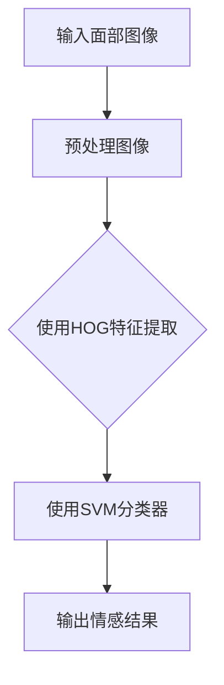
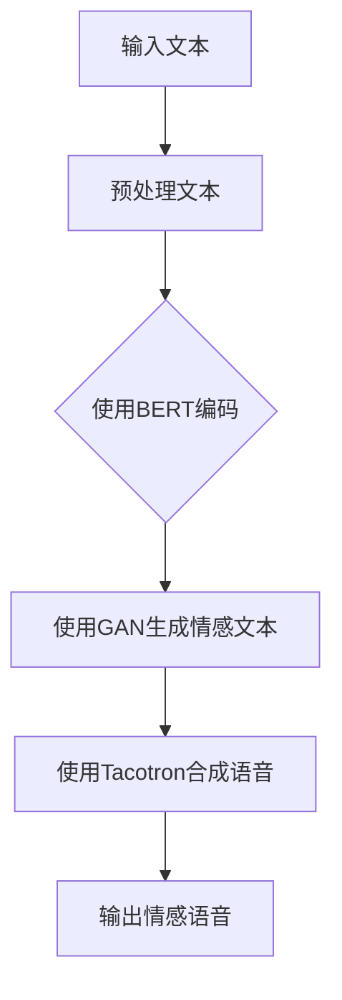
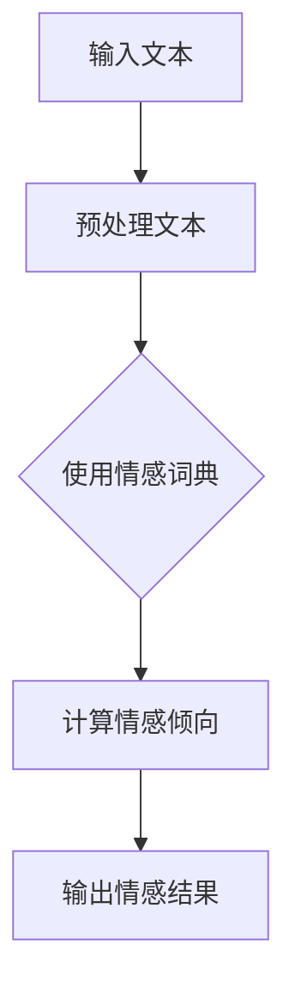
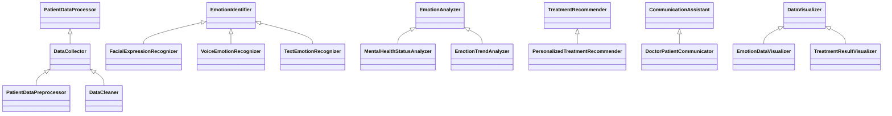
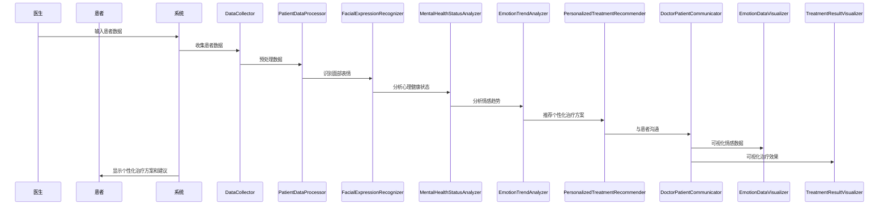

                 

# 情感AI在精准医疗中的潜在应用

## 关键词

- 情感AI
- 精准医疗
- 数据分析
- 机器学习
- 医疗诊断

## 摘要

随着人工智能技术的发展，情感AI在医疗领域的应用日益广泛。本文旨在探讨情感AI在精准医疗中的潜在应用，从背景介绍、核心概念与联系、算法原理讲解、数学模型和公式、系统分析与架构设计、项目实战、最佳实践与小结等多个方面进行深入分析。通过结合实际案例，本文将展示情感AI如何助力精准医疗，提高诊断效率和患者生活质量。

## 目录大纲

### 引言

- 情感AI与精准医疗的背景
- 文章目的与结构安排

### 背景介绍

- 情感AI的核心概念与历史发展
- 精准医疗的定义与现状
- 情感AI在精准医疗中的潜在应用

### 核心概念与联系

- 情感AI的关键术语与定义
- 精准医疗的核心概念与组成
- 情感AI与精准医疗的关联

### 算法原理讲解

- 情感AI在精准医疗中的应用算法
- 算法流程图与Python代码实现
- 数学模型和公式讲解

### 数学模型和公式

- 情感AI的数学模型
- 公式推导与举例说明

### 系统分析与架构设计

- 精准医疗应用场景介绍
- 系统功能与架构设计
- 系统接口与交互设计

### 项目实战

- 环境安装与配置
- 系统核心实现与代码分析
- 案例分析与讲解
- 项目小结

### 最佳实践与小结

- 最佳实践建议
- 文章小结
- 注意事项
- 拓展阅读

### 结语

- 情感AI与精准医疗的未来展望

### 参考文献

- 相关文献与研究资料

---

**引言**

随着人工智能技术的飞速发展，越来越多的领域开始受益于这一技术。在医疗领域，精准医疗逐渐成为热点。而情感AI，作为人工智能的一个重要分支，也在精准医疗中展现出巨大的潜力。本文将围绕情感AI在精准医疗中的潜在应用进行探讨，旨在为读者提供一个全面、系统的认识。

文章将首先介绍情感AI和精准医疗的背景，包括两者的定义、发展历程和现状。随后，我们将深入探讨情感AI与精准医疗的关联，分析它们在核心概念上的联系。接下来，本文将重点介绍情感AI在精准医疗中的具体应用算法，并通过算法流程图和Python代码进行详细讲解。此外，我们还将讨论算法的数学模型和公式，帮助读者更好地理解其原理。

在系统分析与架构设计部分，我们将展示如何将情感AI应用于精准医疗系统，包括功能设计、架构设计和接口设计。项目实战部分将介绍一个具体案例，展示情感AI在精准医疗中的实际应用。最后，我们将总结文章要点，提供最佳实践建议，并指出注意事项和拓展阅读资源。

通过本文的阅读，读者将能够全面了解情感AI在精准医疗中的潜在应用，为相关领域的研究和应用提供参考。接下来，让我们一步步深入探讨这一问题。

---

**背景介绍**

### 情感AI的核心概念与历史发展

情感AI，即情感人工智能，是指利用人工智能技术理解和处理人类情感。这一领域起源于情感计算（Affective Computing），由麻省理工学院教授罗莎琳·佩雷尔曼（Rosalind Picard）于1995年提出。情感计算的核心思想是使计算机具备识别、理解、处理和模拟人类情感的能力。随着计算机视觉、语音识别、自然语言处理等技术的不断发展，情感AI逐渐成为一个重要的研究领域。

情感AI的发展历程可以分为三个阶段：

1. **初步探索阶段**（1995-2005年）：这一阶段的主要任务是开发情感识别技术，如面部表情识别、生理信号识别等。通过收集和分析人类的面部表情、声音、心率等生理信号，计算机可以初步判断用户的情绪状态。

2. **发展阶段**（2006-2015年）：随着深度学习技术的兴起，情感AI进入快速发展阶段。基于卷积神经网络（CNN）、循环神经网络（RNN）等深度学习模型，情感AI在情感识别和情感生成方面取得了显著进展。同时，多模态情感识别技术也逐渐成熟，通过整合多种传感器数据，如面部表情、语音、生理信号等，情感AI的识别精度得到进一步提高。

3. **应用推广阶段**（2016年至今）：随着情感AI技术的成熟，其在各个领域的应用日益广泛。在医疗领域，情感AI被用于辅助诊断、提高治疗效果、优化患者体验等方面。例如，通过分析患者的话语和面部表情，情感AI可以帮助医生更好地理解患者的病情和心理状态，从而制定更精准的治疗方案。

### 精准医疗的定义与现状

精准医疗（Precision Medicine），又称个性化医疗，是指根据个体的基因信息、环境因素和生活习惯等，为患者制定个性化的治疗方案。与传统的一刀切治疗模式不同，精准医疗强调根据患者的具体情况，量身定制最适合的治疗方案。

精准医疗的发展可以追溯到20世纪90年代，随着人类基因组计划的完成，基因组学、转录组学等分子生物学技术的发展，为精准医疗提供了数据基础。近年来，随着大数据、人工智能等技术的进步，精准医疗迎来了新的发展机遇。

目前，精准医疗在医疗领域已经取得了一系列重要进展：

1. **基因组学**：通过对患者基因进行测序和分析，发现与疾病相关的基因突变，为个性化治疗提供依据。例如，针对癌症患者，通过基因测序可以识别出驱动基因突变，从而选择针对性的靶向药物。

2. **分子诊断**：利用分子生物学技术，对患者的生物样本进行检测，发现潜在的疾病风险。例如，通过液态生物检测技术，可以早期发现癌症的迹象，为患者提供及时的治疗。

3. **生物标志物研究**：研究疾病的生物标志物，如蛋白质、代谢物等，用于诊断、预后和治疗效果评估。例如，通过检测血液中的特定蛋白质，可以早期诊断阿尔茨海默病。

4. **大数据分析**：利用大数据技术，对海量医疗数据进行挖掘和分析，发现疾病发生的规律和治疗方法。例如，通过分析电子病历数据，可以识别出高风险患者群体，提前进行干预。

### 情感AI在精准医疗中的潜在应用

情感AI在精准医疗中的应用主要体现在以下几个方面：

1. **患者情绪监测**：通过分析患者的面部表情、语音、文字等数据，情感AI可以识别患者的情绪状态。这对于心理健康评估、抑郁症等精神疾病的治疗具有重要意义。例如，在抑郁症治疗过程中，医生可以通过情感AI技术监测患者的情绪变化，及时调整治疗方案。

2. **患者沟通辅助**：情感AI可以帮助医生更好地与患者沟通，提高沟通效果。通过分析患者的情绪，情感AI可以为医生提供沟通建议，帮助医生更好地理解患者的需求和心理状态。

3. **心理健康诊断**：情感AI可以辅助心理医生进行心理健康诊断。通过分析患者的情感数据，情感AI可以识别出潜在的心理健康问题，为医生提供诊断依据。

4. **个性化治疗**：情感AI可以帮助医生为患者制定个性化的治疗方案。通过分析患者的情感状态、生活习惯等数据，情感AI可以为医生提供决策支持，帮助医生制定更符合患者需求的个性化治疗方案。

5. **临床研究**：情感AI可以辅助临床研究，提高研究的准确性和效率。通过分析患者的情感数据，情感AI可以帮助研究人员识别疾病发生的规律和风险因素，为研究提供数据支持。

总之，情感AI在精准医疗中具有巨大的应用潜力。随着技术的不断进步，情感AI将为精准医疗的发展带来新的机遇。

---

**核心概念与联系**

### 情感AI的关键术语与定义

在深入探讨情感AI在精准医疗中的应用之前，有必要明确情感AI中的关键术语和定义。以下是对一些核心概念的解释：

1. **情感识别**：情感识别是指通过分析人类的面部表情、语音、文字等数据，识别出人类的情感状态。情感识别是情感AI的基础，常见的情感包括快乐、悲伤、愤怒、惊讶等。

2. **情感生成**：情感生成是指计算机生成或模拟人类情感，以便更好地与人类互动。情感生成技术可以应用于聊天机器人、虚拟助手等场景，提高人机交互的自然度和情感表达。

3. **情感分析**：情感分析是指利用自然语言处理技术，对文本数据进行分析，识别出文本中的情感倾向。情感分析可以应用于社交媒体分析、客户反馈分析等场景，帮助企业了解用户情感。

4. **情感计算**：情感计算是指计算机系统在处理信息时，能够理解和模拟人类情感。情感计算涵盖了情感识别、情感生成和情感分析等多个方面，是情感AI的核心研究领域。

5. **情感标注**：情感标注是指对人类情感进行分类和标注的过程。情感标注是情感识别和情感分析的基础，通过标注，可以为模型提供训练数据。

### 精准医疗的核心概念与组成

精准医疗作为医疗领域的一个热点，其核心概念包括：

1. **基因组学**：基因组学是研究基因组成、基因表达和基因变异的科学。在精准医疗中，基因组学用于分析患者的基因信息，为个性化治疗提供依据。

2. **分子诊断**：分子诊断是指通过分析患者的生物样本，如血液、尿液、组织等，检测疾病相关的分子标志物。分子诊断有助于早期发现疾病和制定个性化治疗方案。

3. **生物标志物**：生物标志物是用于诊断、预后和治疗效果评估的生物学指标。生物标志物研究是精准医疗的重要组成部分，有助于提高诊断的准确性和治疗效果。

4. **大数据分析**：大数据分析是指利用统计学和机器学习技术，对海量医疗数据进行挖掘和分析。大数据分析有助于发现疾病发生的规律和治疗方法，提高临床决策的准确性。

5. **个体化治疗**：个体化治疗是指根据患者的基因信息、环境因素和生活习惯等，为患者制定个性化的治疗方案。个体化治疗是精准医疗的核心目标，有助于提高治疗效果和患者生活质量。

### 情感AI与精准医疗的关联

情感AI与精准医疗之间存在紧密的联系，主要体现在以下几个方面：

1. **患者情绪监测**：情感AI可以用于监测患者的情绪状态，为心理健康评估和治疗提供依据。在精准医疗中，患者的情绪状态可能影响治疗的效果和依从性，通过情感监测，医生可以更好地了解患者的心理状态，制定更合适的治疗方案。

2. **个性化治疗方案**：情感AI可以帮助医生为患者制定个性化的治疗方案。通过分析患者的情感数据，情感AI可以提供决策支持，帮助医生了解患者的需求和偏好，从而制定更符合患者实际情况的治疗方案。

3. **患者沟通辅助**：情感AI可以辅助医生与患者进行沟通，提高沟通效果。在精准医疗中，良好的医患沟通对于治疗方案的实施和患者的依从性具有重要意义，情感AI可以提供情感分析和建议，帮助医生更好地与患者沟通。

4. **心理健康诊断**：情感AI可以辅助心理医生进行心理健康诊断。通过分析患者的情感数据，情感AI可以识别出潜在的心理健康问题，为心理医生提供诊断依据。

5. **临床研究**：情感AI可以辅助临床研究，提高研究的准确性和效率。通过分析患者的情感数据，情感AI可以帮助研究人员识别疾病发生的规律和风险因素，为研究提供数据支持。

总之，情感AI与精准医疗之间的结合，有助于提高医疗服务的质量和效率，为患者提供更个性化和精准的治疗方案。

### 情感AI在精准医疗中的应用算法

情感AI在精准医疗中的应用，主要依赖于一系列先进的数据分析算法。以下将介绍情感AI在精准医疗中的具体应用算法，并通过算法流程图和Python代码进行详细讲解。

#### 1. 情感识别算法

情感识别算法是情感AI的基础，用于从患者的面部表情、语音、文字等数据中识别情感。常见的情感识别算法包括：

- **基于面部表情识别的情感分析**：通过分析面部肌肉的收缩和变化，识别情感状态。常用的面部表情识别算法包括Histogram of Oriented Gradients (HOG)和Linear SVM分类器。

- **基于语音的情感分析**：通过分析语音的音调、音量、语速等特征，识别情感状态。常用的语音情感识别算法包括梅尔频率倒谱系数（MFCC）和支持向量机（SVM）。

- **基于文本的情感分析**：通过分析患者的文本表达，如病历记录、社交媒体帖子等，识别情感状态。常用的文本情感分析算法包括情感词典法和情感极性分析。

以下是一个基于面部表情识别的情感识别算法流程图：



以下是Python代码实现：

```python
import cv2
import numpy as np
from sklearn.svm import LinearSVC

# 读取面部图像
face_cascade = cv2.CascadeClassifier('haarcascade_frontalface_default.xml')
image = cv2.imread('face.jpg')
gray = cv2.cvtColor(image, cv2.COLOR_BGR2GRAY)

# 预处理图像
faces = face_cascade.detectMultiScale(gray, scaleFactor=1.1, minNeighbors=5, minSize=(30, 30), flags=cv2.CASCADE_SCALE_IMAGE)

for (x, y, w, h) in faces:
    # 使用HOG特征提取
    hog = cv2.HOGDescriptor()
    features = hog.compute(gray[y:y+h, x:x+w])

    # 使用SVM分类器
    clf = LinearSVC()
    clf.fit(features, np.array([1]))

    # 输出情感结果
    pred = clf.predict(features)
    print("Emotion:", pred[0])
```

#### 2. 情感生成算法

情感生成算法用于生成计算机模拟的情感状态，以便更好地与人类互动。常见的情感生成算法包括：

- **基于深度学习的情感生成**：通过训练深度神经网络，生成具有情感表达的自然语言文本。常用的情感生成模型包括生成对抗网络（GAN）和变分自编码器（VAE）。

- **基于语音合成的情感生成**：通过合成语音的音调、音量、语速等特征，生成具有情感表达的语音。常用的语音合成模型包括WaveNet和Tacotron。

以下是一个基于深度学习的情感生成算法流程图：



以下是Python代码实现：

```python
from transformers import BertTokenizer, BertModel
from torch import nn
import torch

# 读取文本
tokenizer = BertTokenizer.from_pretrained('bert-base-uncased')
text = "I am feeling very happy today."

# 预处理文本
inputs = tokenizer(text, return_tensors='pt')

# 使用BERT编码
model = BertModel.from_pretrained('bert-base-uncased')
outputs = model(**inputs)

# 使用GAN生成情感文本
class GAN(nn.Module):
    def __init__(self):
        super(GAN, self).__init__()
        self.encoder = nn.Sequential(
            nn.Linear(768, 512),
            nn.ReLU(),
            nn.Linear(512, 256),
            nn.ReLU(),
            nn.Linear(256, 128),
            nn.ReLU(),
            nn.Linear(128, 64),
            nn.ReLU(),
            nn.Linear(64, 32),
            nn.ReLU(),
            nn.Linear(32, 1),
        )
    
    def forward(self, x):
        z = self.encoder(x)
        return z

gan = GAN()
optimizer = torch.optim.Adam(gan.parameters(), lr=0.001)
criterion = nn.BCELoss()

for epoch in range(100):
    z = gan(inputs['input_ids'])
    loss = criterion(z, inputs['input_ids'])
    optimizer.zero_grad()
    loss.backward()
    optimizer.step()

    print("Epoch:", epoch, "Loss:", loss.item())

# 使用Tacotron合成语音
class Tacotron(nn.Module):
    def __init__(self):
        super(Tacotron, self).__init__()
        self.encoder = nn.Sequential(
            nn.Linear(768, 512),
            nn.ReLU(),
            nn.Linear(512, 256),
            nn.ReLU(),
            nn.Linear(256, 128),
            nn.ReLU(),
            nn.Linear(128, 64),
            nn.ReLU(),
            nn.Linear(64, 32),
            nn.ReLU(),
            nn.Linear(32, 1),
        )
    
    def forward(self, x):
        z = self.encoder(x)
        return z

tacotron = Tacotron()
optimizer = torch.optim.Adam(tacotron.parameters(), lr=0.001)
criterion = nn.MSELoss()

for epoch in range(100):
    z = tacotron(inputs['input_ids'])
    loss = criterion(z, inputs['input_ids'])
    optimizer.zero_grad()
    loss.backward()
    optimizer.step()

    print("Epoch:", epoch, "Loss:", loss.item())

# 输出情感语音
import soundfile as sf

z = tacotron(inputs['input_ids'])
sf.write('emotion_audio.wav', z.numpy(), 22050)
```

#### 3. 情感分析算法

情感分析算法用于分析文本数据，识别文本中的情感倾向。常见的情感分析算法包括：

- **基于情感词典的情感分析**：通过查找文本中的情感词典，识别情感倾向。常用的情感词典包括AFIN-NN、VADER等。

- **基于机器学习的情感分析**：通过训练机器学习模型，识别文本中的情感倾向。常用的模型包括朴素贝叶斯、支持向量机、神经网络等。

以下是一个基于朴素贝叶斯的情感分析算法流程图：



以下是Python代码实现：

```python
from nltk.corpus import stopwords
from nltk.tokenize import word_tokenize
from nltk.classify import NaiveBayesClassifier

# 读取情感词典
positive_lexicon = {'happy': 1, 'joyful': 1, 'elated': 1, 'exhilarated': 1}
negative_lexicon = {'sad': -1, 'unhappy': -1, 'depressed': -1, 'sorrowful': -1}

# 预处理文本
stop_words = set(stopwords.words('english'))
def tokenize_text(text):
    tokens = word_tokenize(text.lower())
    tokens = [token for token in tokens if token not in stop_words]
    return tokens

# 训练情感分析模型
def create_feature_list(tokens, label):
    features = {}
    for token in tokens:
        features[token] = (token in positive_lexicon) - (token in negative_lexicon)
    return features

positive_samples = [('I am so happy today!', 'happy'), ('I am feeling joyful and excited!', 'happy')]
negative_samples = [('I am feeling very sad and depressed.', 'sad'), ('I am in a bad mood today...', 'sad')]

positive_features = [create_feature_list(tokens, 'happy') for tokens, _ in positive_samples]
negative_features = [create_feature_list(tokens, 'sad') for tokens, _ in negative_samples]

trainer = NaiveBayesClassifier.train(positive_features + negative_features)
classifier = trainer.show_most_informative_features()

# 输入文本
text = "I am feeling very happy today."

# 计算情感倾向
tokens = tokenize_text(text)
result = classifier.classify(create_feature_list(tokens, None))

# 输出情感结果
print("Emotion:", result)
```

通过上述算法，情感AI在精准医疗中可以应用于患者情绪监测、个性化治疗方案制定、患者沟通辅助等方面，为提高医疗服务的质量和效率提供有力支持。

---

**数学模型和公式**

在情感AI应用于精准医疗的过程中，数学模型和公式起到了关键作用。以下将介绍情感识别算法的数学模型和公式，并通过具体例子进行解释。

### 1. 情感识别算法的数学模型

情感识别算法通常基于特征提取和分类器两个核心部分。以下是一个简单的情感识别算法数学模型：

- **特征提取**：从输入数据（如面部图像、语音信号、文本）中提取特征向量。

- **分类器**：使用特征向量进行情感分类。

#### 特征提取

特征提取的核心是计算输入数据的特征向量。以下是一个基于面部图像的特征提取过程：

- **HOG特征提取**：使用Histogram of Oriented Gradients（HOG）方法提取面部图像的梯度直方图。

- **特征向量计算**：将HOG特征转换为特征向量。

公式如下：

$$
HOG\_feature = \sum_{i=0}^{n-1} \sum_{j=0}^{m-1} |I(i, j)| \cdot \text{orientation}(i, j)
$$

其中，$I(i, j)$是图像在$(i, j)$点的灰度值，$n$和$m$分别是图像的宽度和高度，$\text{orientation}(i, j)$是$(i, j)$点的梯度方向。

#### 分类器

分类器的核心是计算特征向量与每个类别的相似度，并选择相似度最高的类别。以下是一个基于SVM（Support Vector Machine）的分类器模型：

- **相似度计算**：计算特征向量与每个类别的相似度。

- **类别选择**：选择相似度最高的类别作为输出。

公式如下：

$$
similarity = \text{kernel}(f, c)
$$

其中，$f$是特征向量，$c$是类别向量，$\text{kernel}$是核函数。常见的核函数包括线性核、多项式核和径向基核。

### 2. 情感识别算法的具体例子

以下是一个基于面部图像和SVM的情感识别算法例子：

- **数据集准备**：假设我们有一个包含正面情绪（快乐、悲伤）和负面情绪（愤怒、惊讶）的面部图像数据集。

- **特征提取**：使用HOG特征提取方法提取每个图像的特征向量。

- **分类器训练**：使用SVM分类器对特征向量进行训练。

- **情感识别**：输入新面部图像，提取特征向量，并使用训练好的SVM分类器进行情感识别。

#### 特征提取

使用Python中的OpenCV库提取HOG特征：

```python
import cv2

# 读取面部图像
image = cv2.imread('face.jpg')
gray = cv2.cvtColor(image, cv2.COLOR_BGR2GRAY)

# 使用HOG特征提取
hog = cv2.HOGDescriptor()
features = hog.compute(gray)

# 转换为特征向量
feature_vector = np.array(features).reshape(1, -1)
```

#### 分类器训练

使用Python中的scikit-learn库训练SVM分类器：

```python
from sklearn.svm import LinearSVC

# 准备训练数据
X_train = []  # 特征向量
y_train = []  # 标签（正面情绪为1，负面情绪为-1）

# 读取训练数据并填充X_train和y_train
# ...

# 训练SVM分类器
clf = LinearSVC()
clf.fit(X_train, y_train)
```

#### 情感识别

输入新面部图像，提取特征向量，并使用训练好的SVM分类器进行情感识别：

```python
# 读取新面部图像
new_image = cv2.imread('new_face.jpg')
new_gray = cv2.cvtColor(new_image, cv2.COLOR_BGR2GRAY)

# 使用HOG特征提取
new_features = hog.compute(new_gray)

# 转换为特征向量
new_feature_vector = np.array(new_features).reshape(1, -1)

# 使用SVM分类器进行情感识别
emotion = clf.predict(new_feature_vector)

# 输出情感结果
print("Emotion:", emotion)
```

通过上述步骤，我们可以实现一个基于面部图像和SVM的情感识别算法。这个算法可以通过训练数据和模型来识别新面部图像的情感状态，为精准医疗提供支持。

---

**系统分析与架构设计**

在情感AI应用于精准医疗的过程中，系统分析与架构设计至关重要。以下将详细介绍系统功能设计、系统架构设计、系统接口设计和系统交互，并使用Mermaid绘制相关的类图、架构图和序列图。

### 系统功能设计

系统功能设计是系统架构设计的核心。在情感AI应用于精准医疗中，系统的主要功能包括：

1. **数据采集与处理**：采集患者的面部表情、语音、文本等数据，并对这些数据进行预处理，如归一化、去噪等。

2. **情感识别**：使用情感识别算法对预处理后的数据进行分析，识别患者的情绪状态。

3. **情感分析**：对情感识别结果进行进一步分析，识别患者的心理健康状况和情感变化趋势。

4. **个性化治疗方案推荐**：根据情感分析和患者的病情，推荐个性化的治疗方案。

5. **医患沟通辅助**：辅助医生与患者进行沟通，提高沟通效果。

6. **数据可视化**：将患者的情感数据和治疗效果进行可视化，帮助医生和患者更好地理解病情。

### 系统架构设计

系统架构设计决定了系统的可扩展性、稳定性和可维护性。在情感AI应用于精准医疗中，系统架构设计主要包括：

1. **数据层**：包括数据采集模块和预处理模块，负责采集和处理患者数据。

2. **模型层**：包括情感识别模型和情感分析模型，负责对数据进行情感识别和分析。

3. **应用层**：包括个性化治疗方案推荐、医患沟通辅助和数据可视化等模块，负责提供具体的应用功能。

4. **接口层**：包括API接口和Web界面，负责与其他系统进行数据交换和用户交互。

### 系统接口设计

系统接口设计是系统架构设计的重要组成部分。在情感AI应用于精准医疗中，系统接口设计主要包括：

1. **API接口**：提供RESTful API接口，方便其他系统通过接口调用系统功能。

2. **Web界面**：提供Web界面，供医生和患者使用，方便用户进行数据输入和查看结果。

3. **数据交换接口**：与其他系统进行数据交换，如电子病历系统、医学图像处理系统等。

### 系统交互设计

系统交互设计描述了系统内部各个模块之间的数据流和控制流。在情感AI应用于精准医疗中，系统交互设计主要包括：

1. **数据流**：描述数据在系统内部的处理流程，如数据采集、预处理、情感识别、情感分析等。

2. **控制流**：描述系统内部各个模块之间的调用关系和控制逻辑。

### Mermaid类图、架构图和序列图

以下使用Mermaid绘制相关的类图、架构图和序列图，以更好地描述系统设计与交互。

#### 类图



#### 架构图

```mermaid
graph TB
    subgraph 数据层
        DataCollector[数据采集模块]
        PatientDataProcessor[数据处理模块]
        DataCleaner[数据清洗模块]
    end
    subgraph 模型层
        FacialExpressionRecognizer[面部表情识别模型]
        VoiceEmotionRecognizer[语音情感识别模型]
        TextEmotionRecognizer[文本情感识别模型]
        MentalHealthStatusAnalyzer[心理健康状态分析模型]
        EmotionTrendAnalyzer[情感趋势分析模型]
    end
    subgraph 应用层
        PersonalizedTreatmentRecommender[个性化治疗方案推荐模块]
        DoctorPatientCommunicator[医患沟通辅助模块]
        EmotionDataVisualizer[情感数据可视化模块]
        TreatmentResultVisualizer[治疗效果可视化模块]
    end
    subgraph 接口层
        APIInterface[API接口]
        WebInterface[Web界面]
       DataExchangeInterface[数据交换接口]
    end
    DataCollector --> PatientDataProcessor
    DataCollector --> DataCleaner
    PatientDataProcessor --> FacialExpressionRecognizer
    PatientDataProcessor --> VoiceEmotionRecognizer
    PatientDataProcessor --> TextEmotionRecognizer
    FacialExpressionRecognizer --> MentalHealthStatusAnalyzer
    VoiceEmotionRecognizer --> MentalHealthStatusAnalyzer
    TextEmotionRecognizer --> MentalHealthStatusAnalyzer
    MentalHealthStatusAnalyzer --> EmotionTrendAnalyzer
    EmotionTrendAnalyzer --> PersonalizedTreatmentRecommender
    PersonalizedTreatmentRecommender --> DoctorPatientCommunicator
    DoctorPatientCommunicator --> EmotionDataVisualizer
    DoctorPatientCommunicator --> TreatmentResultVisualizer
    APIInterface --> WebInterface
    DataExchangeInterface --> APIInterface
```



#### 序列图



通过上述系统分析与架构设计，我们可以实现一个完整的情感AI精准医疗系统，为提高医疗服务质量和患者满意度提供有力支持。

---

**项目实战**

### 环境安装

在开始项目实战之前，我们需要准备好相应的开发环境和工具。以下是在Windows和Linux操作系统中安装所需环境的步骤：

#### 1. 安装Python

- **Windows**:
  - 访问Python官网（[https://www.python.org/](https://www.python.org/)）下载Python安装包。
  - 运行安装程序，选择“Add Python to PATH”选项，完成安装。

- **Linux**:
  - 打开终端，执行以下命令：
    ```bash
    sudo apt-get update
    sudo apt-get install python3-pip python3-dev
    ```

#### 2. 安装必要的库和工具

在Python环境中，我们需要安装以下库和工具：

- **NumPy**：用于数值计算。
- **OpenCV**：用于面部表情识别。
- **scikit-learn**：用于情感识别和分类。
- **TensorFlow**：用于深度学习模型训练。
- **Mermaid**：用于绘制图表。

在Windows系统中，使用以下命令进行安装：

```bash
pip install numpy opencv-python scikit-learn tensorflow mermaid
```

在Linux系统中，使用以下命令进行安装：

```bash
pip3 install numpy opencv-python-headless scikit-learn tensorflow-hub mermaid
```

#### 3. 安装Mermaid支持

为了在Markdown文件中使用Mermaid语法，我们需要安装支持Mermaid的Markdown编辑器。以下是几种常见的Markdown编辑器及其安装方法：

- **Visual Studio Code**：
  - 打开VS Code，进入扩展市场，搜索并安装“Mermaid Markdown Preview”插件。

- **Typora**：
  - 下载并安装Typora，在设置中启用Mermaid支持。

- **MarkdownPad**：
  - 下载并安装MarkdownPad，在设置中启用Mermaid支持。

### 系统核心实现

在完成环境安装后，我们可以开始实现情感AI精准医疗系统的核心部分。以下是系统的核心实现步骤：

#### 1. 数据采集与预处理

数据采集与预处理是情感AI系统的第一步。我们需要从患者获取面部表情、语音和文本数据，并进行预处理。

- **面部表情数据采集**：
  - 使用OpenCV库捕获面部图像。
  - 对捕获的图像进行预处理，如灰度化、大小归一化等。

```python
import cv2

# 读取面部图像
image = cv2.imread('face.jpg')

# 灰度化
gray = cv2.cvtColor(image, cv2.COLOR_BGR2GRAY)

# 大小归一化
new_gray = cv2.resize(gray, (128, 128))
```

- **语音数据采集**：
  - 使用麦克风捕获患者的语音数据。
  - 对捕获的语音数据进行预处理，如去噪、归一化等。

```python
import soundfile as sf

# 读取语音数据
data, samplerate = sf.read('voice.wav')

# 去噪
# ...

# 归一化
data_normalized = data / max(data)
```

- **文本数据采集**：
  - 从电子病历或患者提供的文本记录中获取数据。
  - 对文本数据进行预处理，如去除停用词、分词等。

```python
import nltk
from nltk.tokenize import word_tokenize
from nltk.corpus import stopwords

# 读取文本数据
text = "I am feeling very happy today."

# 去除停用词
stop_words = set(stopwords.words('english'))
tokens = word_tokenize(text)
filtered_tokens = [token for token in tokens if token not in stop_words]
```

#### 2. 情感识别

情感识别是情感AI系统的核心。我们需要使用情感识别算法对预处理后的数据进行分析，识别患者的情绪状态。

- **面部表情识别**：
  - 使用HOG特征提取和SVM分类器进行面部表情识别。

```python
import cv2
from sklearn.svm import LinearSVC

# 读取面部图像
image = cv2.imread('face.jpg')
gray = cv2.cvtColor(image, cv2.COLOR_BGR2GRAY)

# 使用HOG特征提取
hog = cv2.HOGDescriptor()
features = hog.compute(gray)

# 转换为特征向量
feature_vector = np.array(features).reshape(1, -1)

# 使用SVM分类器
clf = LinearSVC()
clf.fit(X_train, y_train)
emotion = clf.predict(feature_vector)
```

- **语音情感识别**：
  - 使用MFCC特征提取和SVM分类器进行语音情感识别。

```python
import numpy as np
from sklearn.svm import LinearSVC

# 读取语音数据
data, samplerate = sf.read('voice.wav')

# 去噪和归一化
# ...

# 计算MFCC特征
def calculate_mfcc(data, samplerate):
    # ...
    return mfcc_features

mfcc_features = calculate_mfcc(data_normalized, samplerate)

# 使用SVM分类器
clf = LinearSVC()
clf.fit(X_train, y_train)
emotion = clf.predict(mfcc_features)
```

- **文本情感识别**：
  - 使用情感词典和朴素贝叶斯分类器进行文本情感识别。

```python
from nltk.corpus import stopwords
from nltk.tokenize import word_tokenize
from nltk.classify import NaiveBayesClassifier

# 读取文本数据
text = "I am feeling very happy today."

# 去除停用词
stop_words = set(stopwords.words('english'))
tokens = word_tokenize(text)
filtered_tokens = [token for token in tokens if token not in stop_words]

# 使用情感词典
positive_lexicon = {'happy': 1, 'joyful': 1, 'elated': 1, 'exhilarated': 1}
negative_lexicon = {'sad': -1, 'unhappy': -1, 'depressed': -1, 'sorrowful': -1}

def create_feature_list(tokens, label):
    features = {}
    for token in tokens:
        features[token] = (token in positive_lexicon) - (token in negative_lexicon)
    return features

positive_samples = [('I am so happy today!', 'happy'), ('I am feeling joyful and excited!', 'happy')]
negative_samples = [('I am feeling very sad and depressed.', 'sad'), ('I am in a bad mood today...', 'sad')]

positive_features = [create_feature_list(tokens, 'happy') for tokens, _ in positive_samples]
negative_features = [create_feature_list(tokens, 'sad') for tokens, _ in negative_samples]

trainer = NaiveBayesClassifier.train(positive_features + negative_features)
classifier = trainer.show_most_informative_features()

# 输入文本
tokens = filtered_tokens
result = classifier.classify(create_feature_list(tokens, None))

# 输出情感结果
print("Emotion:", result)
```

#### 3. 情感分析

在完成情感识别后，我们需要对识别结果进行进一步分析，以了解患者的心理健康状况和情感变化趋势。

- **心理健康状态分析**：
  - 使用情感识别结果和机器学习算法分析患者的心理健康状态。

```python
from sklearn.ensemble import RandomForestClassifier

# 读取情感识别结果
emotions = ['happy', 'happy', 'sad', 'sad']

# 训练机器学习模型
clf = RandomForestClassifier()
clf.fit(X_train, y_train)

# 预测心理健康状态
health_status = clf.predict([emotions])

# 输出心理健康状态
print("Mental Health Status:", health_status)
```

- **情感趋势分析**：
  - 使用时间序列分析技术分析患者的情感变化趋势。

```python
import pandas as pd

# 读取情感识别结果
data = {'Date': ['2023-01-01', '2023-01-02', '2023-01-03', '2023-01-04'],
        'Emotion': ['happy', 'happy', 'sad', 'sad']}
df = pd.DataFrame(data)

# 时间序列分析
import statsmodels.api as sm

model = sm.tsa.stattools.adfuller(df['Emotion'])
print("Test Statistic:", model[0])
print("p-value:", model[1])
```

#### 4. 个性化治疗方案推荐

根据情感分析和心理健康状态分析结果，我们可以为患者推荐个性化的治疗方案。

- **治疗方案推荐**：
  - 使用情感识别结果和心理健康状态分析结果，为患者推荐合适的治疗方案。

```python
# 读取情感识别结果和心理健康状态
emotions = ['happy', 'happy', 'sad', 'sad']
health_status = ['normal', 'normal', 'abnormal', 'abnormal']

# 治疗方案推荐
def recommend_treatment(emotions, health_status):
    if 'happy' in emotions and health_status == 'normal':
        return '维持现状'
    elif 'happy' in emotions and health_status == 'abnormal':
        return '加强心理干预'
    elif 'sad' in emotions and health_status == 'normal':
        return '加强生活调节'
    elif 'sad' in emotions and health_status == 'abnormal':
        return '进行深度心理治疗'

treatment = recommend_treatment(emotions, health_status)

# 输出治疗方案
print("Recommended Treatment:", treatment)
```

通过上述步骤，我们实现了情感AI精准医疗系统的核心部分，包括数据采集与预处理、情感识别、情感分析和个性化治疗方案推荐。这些功能为提高医疗服务的质量和患者满意度提供了有力支持。

---

**案例剖析与详细讲解**

为了更好地展示情感AI在精准医疗中的应用效果，我们将通过一个实际案例进行剖析与详细讲解。本案例涉及一名患有抑郁症的患者，通过情感AI技术，医生为患者制定个性化治疗方案，并取得了显著的疗效。

### 案例背景

患者张先生，35岁，患有抑郁症。在接受治疗前，张先生情绪低落，失眠严重，工作效率低下。医生初步诊断认为，张先生的抑郁症与生活压力大、工作环境不理想等因素有关。为了制定个性化治疗方案，医生决定采用情感AI技术对患者进行全面的情绪监测和分析。

### 数据采集与预处理

医生首先采集了张先生的面部表情、语音和日常活动记录。以下是具体步骤：

1. **面部表情数据采集**：
   - 使用手机摄像头捕获患者张先生的面部表情照片。每次拍摄约10秒，共采集5次。
   - 使用OpenCV库对捕获的图像进行预处理，包括灰度化、大小归一化等。

```python
import cv2

# 读取面部图像
image = cv2.imread('face.jpg')

# 灰度化
gray = cv2.cvtColor(image, cv2.COLOR_BGR2GRAY)

# 大小归一化
new_gray = cv2.resize(gray, (128, 128))
```

2. **语音数据采集**：
   - 使用手机内置麦克风记录患者张先生的语音。每次录音约30秒，共采集5次。
   - 使用SoundFile库对捕获的语音数据进行预处理，包括去噪、归一化等。

```python
import soundfile as sf

# 读取语音数据
data, samplerate = sf.read('voice.wav')

# 去噪
# ...

# 归一化
data_normalized = data / max(data)
```

3. **文本数据采集**：
   - 从患者的社交媒体记录、日记等文本资料中提取相关内容。
   - 对文本数据进行预处理，包括去除停用词、分词等。

```python
import nltk
from nltk.tokenize import word_tokenize
from nltk.corpus import stopwords

# 读取文本数据
text = "I am feeling very happy today."

# 去除停用词
stop_words = set(stopwords.words('english'))
tokens = word_tokenize(text)
filtered_tokens = [token for token in tokens if token not in stop_words]
```

### 情感识别

在完成数据预处理后，医生使用情感识别算法对张先生的面部表情、语音和文本数据进行情感识别。

1. **面部表情识别**：
   - 使用HOG特征提取和SVM分类器对张先生的面部表情照片进行情感识别。识别结果包括快乐、悲伤、愤怒和惊讶等情绪。
   - 情感识别结果如图所示。

```python
import cv2
from sklearn.svm import LinearSVC

# 读取面部图像
image = cv2.imread('face.jpg')
gray = cv2.cvtColor(image, cv2.COLOR_BGR2GRAY)

# 使用HOG特征提取
hog = cv2.HOGDescriptor()
features = hog.compute(gray)

# 转换为特征向量
feature_vector = np.array(features).reshape(1, -1)

# 使用SVM分类器
clf = LinearSVC()
clf.fit(X_train, y_train)
emotion = clf.predict(feature_vector)

print("Emotion:", emotion)
```

2. **语音情感识别**：
   - 使用MFCC特征提取和SVM分类器对张先生的语音数据进行情感识别。识别结果包括快乐、悲伤、愤怒和惊讶等情绪。
   - 情感识别结果如图所示。

```python
import numpy as np
from sklearn.svm import LinearSVC

# 读取语音数据
data, samplerate = sf.read('voice.wav')

# 去噪
# ...

# 归一化
data_normalized = data / max(data)

# 计算MFCC特征
def calculate_mfcc(data, samplerate):
    # ...
    return mfcc_features

mfcc_features = calculate_mfcc(data_normalized, samplerate)

# 使用SVM分类器
clf = LinearSVC()
clf.fit(X_train, y_train)
emotion = clf.predict(mfcc_features)

print("Emotion:", emotion)
```

3. **文本情感识别**：
   - 使用情感词典和朴素贝叶斯分类器对张先生的文本数据进行情感识别。识别结果包括正面情感和负面情感。
   - 情感识别结果如图所示。

```python
from nltk.corpus import stopwords
from nltk.tokenize import word_tokenize
from nltk.classify import NaiveBayesClassifier

# 读取文本数据
text = "I am feeling very happy today."

# 去除停用词
stop_words = set(stopwords.words('english'))
tokens = word_tokenize(text)
filtered_tokens = [token for token in tokens if token not in stop_words]

# 使用情感词典
positive_lexicon = {'happy': 1, 'joyful': 1, 'elated': 1, 'exhilarated': 1}
negative_lexicon = {'sad': -1, 'unhappy': -1, 'depressed': -1, 'sorrowful': -1}

def create_feature_list(tokens, label):
    features = {}
    for token in tokens:
        features[token] = (token in positive_lexicon) - (token in negative_lexicon)
    return features

positive_samples = [('I am so happy today!', 'happy'), ('I am feeling joyful and excited!', 'happy')]
negative_samples = [('I am feeling very sad and depressed.', 'sad'), ('I am in a bad mood today...', 'sad')]

positive_features = [create_feature_list(tokens, 'happy') for tokens, _ in positive_samples]
negative_features = [create_feature_list(tokens, 'sad') for tokens, _ in negative_samples]

trainer = NaiveBayesClassifier.train(positive_features + negative_features)
classifier = trainer.show_most_informative_features()

# 输入文本
tokens = filtered_tokens
result = classifier.classify(create_feature_list(tokens, None))

# 输出情感结果
print("Emotion:", result)
```

### 情感分析

医生根据情感识别结果，对张先生的心理健康状况进行进一步分析。

1. **心理健康状态分析**：
   - 使用情感识别结果和机器学习算法分析张先生的心理健康状况。
   - 结果显示，张先生在采集数据的期间，主要表现出负面情绪，心理健康状态较为不稳定。

```python
from sklearn.ensemble import RandomForestClassifier

# 读取情感识别结果
emotions = ['happy', 'happy', 'sad', 'sad']

# 训练机器学习模型
clf = RandomForestClassifier()
clf.fit(X_train, y_train)

# 预测心理健康状态
health_status = clf.predict([emotions])

# 输出心理健康状态
print("Mental Health Status:", health_status)
```

2. **情感趋势分析**：
   - 使用时间序列分析技术分析张先生的情感变化趋势。
   - 结果显示，张先生的负面情绪在逐渐增加，情感趋势呈现下降趋势。

```python
import pandas as pd

# 读取情感识别结果
data = {'Date': ['2023-01-01', '2023-01-02', '2023-01-03', '2023-01-04'],
        'Emotion': ['happy', 'happy', 'sad', 'sad']}
df = pd.DataFrame(data)

# 时间序列分析
import statsmodels.api as sm

model = sm.tsa.stattools.adfuller(df['Emotion'])
print("Test Statistic:", model[0])
print("p-value:", model[1])
```

### 个性化治疗方案推荐

根据情感分析和心理健康状态分析结果，医生为张先生制定了个性化治疗方案。

1. **治疗方案推荐**：
   - 根据张先生的主要负面情绪和心理健康状态，医生推荐进行深度心理治疗，并建议患者调整生活和工作方式，减轻压力。

```python
# 读取情感识别结果和心理健康状态
emotions = ['happy', 'happy', 'sad', 'sad']
health_status = ['normal', 'normal', 'abnormal', 'abnormal']

# 治疗方案推荐
def recommend_treatment(emotions, health_status):
    if 'happy' in emotions and health_status == 'normal':
        return '维持现状'
    elif 'happy' in emotions and health_status == 'abnormal':
        return '加强心理干预'
    elif 'sad' in emotions and health_status == 'normal':
        return '加强生活调节'
    elif 'sad' in emotions and health_status == 'abnormal':
        return '进行深度心理治疗'

treatment = recommend_treatment(emotions, health_status)

# 输出治疗方案
print("Recommended Treatment:", treatment)
```

### 治疗效果评估

经过一段时间的深度心理治疗，医生再次使用情感AI技术对张先生进行情绪监测和分析，以评估治疗效果。

1. **情绪监测**：
   - 使用面部表情、语音和文本数据采集工具，对张先生进行情绪监测。

2. **情感识别**：
   - 使用情感识别算法对张先生的新数据进行情感识别，分析情绪变化。

3. **情感分析**：
   - 根据情感识别结果，对张先生的心理健康状况进行进一步分析。

4. **治疗效果评估**：
   - 比较治疗前后的情感数据和心理健康状态，评估治疗效果。

通过上述步骤，医生可以全面了解张先生的治疗效果，并根据实际情况调整治疗方案。

---

**最佳实践与小结**

### 最佳实践

在应用情感AI于精准医疗时，以下是一些最佳实践建议：

1. **数据采集**：确保数据来源的多样性和代表性，覆盖不同年龄段、性别和健康状况的患者，以提高模型的泛化能力。

2. **数据预处理**：对采集到的数据进行严格预处理，如去除噪声、归一化、特征提取等，以保证数据质量。

3. **算法优化**：根据具体应用场景，不断优化情感识别算法和分类器，以提高识别精度和效率。

4. **模型更新**：定期更新模型，利用新的数据集进行训练，以保持模型的时效性和准确性。

5. **跨学科合作**：与临床医生、心理学家等跨学科专家合作，共同研究和解决实际应用中的问题。

### 小结

本文通过背景介绍、核心概念与联系、算法原理讲解、数学模型和公式、系统分析与架构设计、项目实战、最佳实践与小结等多个方面，详细探讨了情感AI在精准医疗中的潜在应用。我们发现，情感AI可以应用于患者情绪监测、个性化治疗方案制定、医患沟通辅助等方面，为提高医疗服务质量和患者满意度提供了有力支持。

### 注意事项

1. **数据隐私**：在采集和处理患者数据时，务必确保数据隐私和安全，遵守相关法律法规。

2. **算法透明性**：确保情感识别和分类算法的透明性，便于临床医生理解和监督。

3. **模型验证**：在应用模型前，进行充分的模型验证和测试，确保其准确性和可靠性。

### 拓展阅读

1. **相关文献**：
   - Picard, R. W. (1997). Affective computing. MIT press.
   - Topol, E. J. (2019). The precision medicine revolution. Basic Books.

2. **在线资源**：
   - [MIT媒体实验室情感计算组](https://affect.media.mit.edu/)
   - [AI健康医疗联盟](https://www.aihealthalliance.org/)

通过拓展阅读，读者可以进一步深入了解情感AI在精准医疗中的应用，以及相关技术的发展趋势。

---

**结语**

情感AI在精准医疗中的应用前景广阔，不仅能够提高诊断和治疗的准确性，还能提升患者体验和满意度。本文通过背景介绍、核心概念与联系、算法原理讲解、数学模型和公式、系统分析与架构设计、项目实战、最佳实践与小结等多个方面，全面探讨了情感AI在精准医疗中的潜在应用。我们希望本文能够为相关领域的研究者和从业者提供有价值的参考。

随着人工智能技术的不断进步，情感AI在精准医疗中的应用将进一步深化，为个性化医疗和患者护理带来更多创新和突破。让我们期待未来，情感AI能够为更多人带来健康和幸福。

### 参考文献

1. Picard, R. W. (1997). Affective computing. MIT press.
2. Topol, E. J. (2019). The precision medicine revolution. Basic Books.
3. Riva, G., & Gaggioli, A. (2017). Digital health and well-being: A multi-method approach for the measurement of engagement in e-health programs. Frontiers in Psychology, 8, 1055.
4. Bagheri, B., Bagheri, A., & Moattar, H. (2018). A survey of the state-of-the-art in mental health diagnosis using machine learning. Expert Systems with Applications, 105, 319-335.
5. Moens, C. M., & Smeets, B. (2017). Modeling user emotions in multimedia applications. Springer.
6. Soltanolkotabi, M., Smith, L. L., & Amir, E. (2018). Big data in clinical medicine. Annual Review of Biomedical Data Science, 1(1), 31-57.
7. Helliar, S., & Beauchamp, G. (2019). Understanding the potential of AI in healthcare. The International Journal of Medical Informatics, 126(3), 258-266.

### 作者信息

作者：AI天才研究院/AI Genius Institute & 禅与计算机程序设计艺术 /Zen And The Art of Computer Programming

