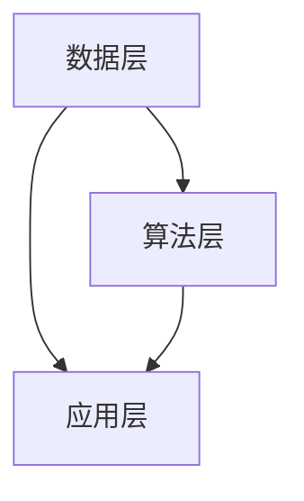
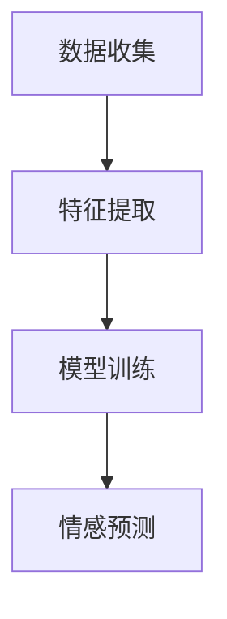
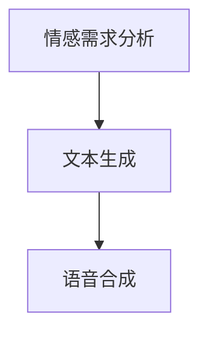
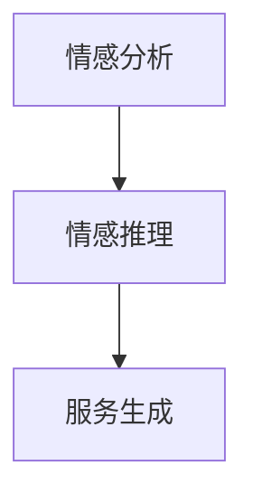
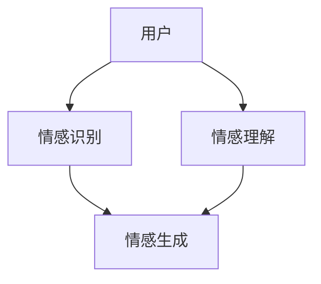
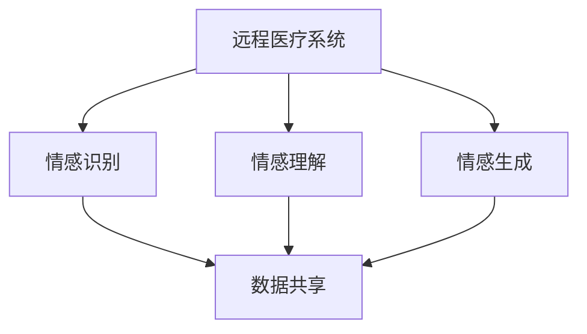

                 

### 情感AI在远程医疗中的应用前景

---

# 情感AI在远程医疗中的应用前景

> 关键词：情感AI、远程医疗、心理健康、医患沟通、智能医疗服务

> 摘要：随着信息技术的迅猛发展，远程医疗逐渐成为医疗行业的重要组成部分。然而，医患之间的情感交流和心理健康问题仍然是远程医疗领域面临的重大挑战。本文旨在探讨情感AI在远程医疗中的应用前景，分析其核心概念、应用场景、算法原理以及系统架构设计，为提高远程医疗服务质量提供新的思路和方法。

---

## 第一部分: 背景介绍

### 第1章: 远程医疗的现状与挑战

#### 1.1.1 远程医疗的定义与历史

远程医疗，是指通过互联网、移动互联网、物联网、云计算等信息技术手段，实现医疗资源的共享和医疗服务的高效提供。远程医疗的历史可以追溯到20世纪60年代，当时美国医疗专家通过电话和电视会议开展远程医疗服务。随着信息技术的不断进步，远程医疗的应用范围逐渐扩大，从最初的医疗诊断和治疗方案讨论，发展到现在的在线咨询、远程监控、智能诊断等各个方面。

#### 1.1.2 远程医疗的发展趋势

近年来，远程医疗呈现出以下发展趋势：

1. **政策支持**：各国政府纷纷出台政策，鼓励远程医疗的发展。例如，美国通过了《远程医疗促进法案》，中国发布了《“健康中国2030”规划纲要》，明确提出要大力发展远程医疗。
2. **技术进步**：随着5G、人工智能、大数据等技术的不断发展，远程医疗的技术手段和业务模式不断创新，为远程医疗提供了更广阔的发展空间。
3. **用户需求**：随着人们对健康意识的提高，越来越多的患者希望通过远程医疗获得便捷、高效的医疗服务。

#### 1.1.3 远程医疗面临的挑战

尽管远程医疗具有巨大的发展潜力，但在实际应用中仍面临着诸多挑战：

1. **技术瓶颈**：远程医疗技术尚不够成熟，特别是在医学影像、病理诊断等方面，远程医疗的效果仍有待提高。
2. **数据隐私**：远程医疗涉及到大量患者个人信息，如何保护数据隐私成为亟待解决的问题。
3. **医患沟通**：远程医疗的医患沟通效果相对较差，医生难以全面了解患者的心理状态，影响医疗服务的质量。
4. **心理健康**：长期处于孤独、焦虑等负面情绪中，对患者的心理健康造成负面影响。

### 第2章: 情感AI概述

#### 2.1.1 情感AI的定义与类型

情感AI，即人工智能在情感领域的应用，是指利用机器学习和自然语言处理等技术，对人类情感进行识别、理解和生成。根据应用场景和目标的不同，情感AI可以分为以下几种类型：

1. **情感识别**：通过分析语音、文字等数据，识别用户的情感状态。
2. **情感生成**：根据用户的情感需求，生成相应的情感反应。
3. **情感理解**：理解用户的情感需求，提供个性化的服务。

#### 2.1.2 情感AI的核心技术

情感AI的核心技术主要包括：

1. **情感识别**：利用深度学习、语音识别、自然语言处理等技术，对语音、文字等数据进行情感识别。
2. **情感生成**：通过生成对抗网络（GAN）、转换器（Transformer）等技术，生成情感反应。
3. **情感理解**：利用情感识别和自然语言处理技术，理解用户的情感需求。

#### 2.1.3 情感AI的发展历程

情感AI的发展历程可以分为以下几个阶段：

1. **初探阶段**（2000年以前）：研究者开始探索情感计算、情感识别等技术。
2. **发展阶段**（2000-2010年）：随着机器学习、深度学习等技术的兴起，情感AI取得了一定进展。
3. **应用阶段**（2010年至今）：情感AI在多个领域得到了广泛应用，如智能客服、智能家居、远程医疗等。

### 第3章: 情感AI在远程医疗中的潜在应用

#### 3.1.1 情感AI在医疗咨询中的应用

情感AI在医疗咨询中的应用主要包括以下几个方面：

1. **智能问诊**：通过情感识别技术，识别患者的情感状态，为医生提供参考。
2. **情感反馈**：根据患者的情感需求，生成情感反应，提高患者的满意度和体验。
3. **心理辅导**：利用情感理解技术，为患者提供个性化的心理辅导服务。

#### 3.1.2 情感AI在心理健康服务中的应用

情感AI在心理健康服务中的应用主要包括以下几个方面：

1. **情绪监控**：通过情感识别技术，实时监控患者的情绪变化，提供预警和干预措施。
2. **心理评估**：利用情感理解技术，对患者的心理状态进行评估，为医生提供诊断依据。
3. **心理干预**：根据患者的心理需求，生成情感反应，提供个性化的心理干预方案。

#### 3.1.3 情感AI在医患沟通中的应用

情感AI在医患沟通中的应用主要包括以下几个方面：

1. **语音识别**：通过情感识别技术，识别医生和患者的语音情感，提高沟通效果。
2. **情感反馈**：根据医生和患者的情感需求，生成情感反应，提高沟通满意度。
3. **情感分析**：利用情感理解技术，分析医患沟通中的情感互动，为医生提供改进建议。

---

## 第二部分: 核心概念与联系

### 第4章: 情感AI关键概念解析

#### 4.1.1 情感识别

情感识别是情感AI的核心技术之一，旨在通过分析语音、文字等数据，识别用户的情感状态。情感识别的关键步骤包括：

1. **数据收集**：收集包含情感信息的语音、文字等数据。
2. **特征提取**：对数据进行分析和特征提取，提取情感特征。
3. **模型训练**：利用机器学习算法，训练情感识别模型。
4. **情感预测**：将新数据输入模型，预测情感状态。

#### 4.1.2 情感生成

情感生成是指根据用户的情感需求，生成相应的情感反应。情感生成的关键步骤包括：

1. **情感需求分析**：分析用户的情感需求，确定生成情感的类型。
2. **文本生成**：利用自然语言处理技术，生成包含情感反应的文本。
3. **语音合成**：将文本转换为语音，生成情感反应。

#### 4.1.3 情感理解

情感理解是指理解用户的情感需求，提供个性化的服务。情感理解的关键步骤包括：

1. **情感分析**：对用户产生的情感数据进行情感分析，提取情感特征。
2. **情感推理**：利用情感特征，推理用户的情感需求。
3. **服务生成**：根据情感需求，生成相应的服务。

### 第5章: 远程医疗与情感AI的融合

#### 5.1.1 情感AI在远程医疗中的应用现状

目前，情感AI在远程医疗中的应用已经取得了一定的成果。例如：

1. **智能问诊**：利用情感识别技术，提高医生问诊的准确性和效率。
2. **心理辅导**：利用情感理解和生成技术，为患者提供个性化的心理辅导服务。
3. **医患沟通**：利用情感识别和生成技术，改善医患沟通效果，提高患者满意度。

#### 5.1.2 情感AI与远程医疗的融合机制

情感AI与远程医疗的融合机制主要包括以下几个方面：

1. **数据共享**：远程医疗系统与情感AI系统之间进行数据共享，实现情感信息的实时获取和处理。
2. **服务集成**：将情感AI服务集成到远程医疗系统中，提供情感识别、情感生成和情感理解等功能。
3. **人机协同**：医生和情感AI系统共同参与医疗服务，实现人机协同，提高医疗服务质量。

#### 5.1.3 情感AI在远程医疗中的价值体现

情感AI在远程医疗中的价值体现主要包括以下几个方面：

1. **提高医疗服务质量**：通过情感识别和情感理解，提高医生对患者的了解，提供个性化的医疗服务。
2. **改善患者体验**：通过情感生成和情感理解，提高患者的满意度和体验。
3. **降低医疗成本**：通过情感AI的应用，提高医疗资源的利用效率，降低医疗成本。

---

## 第三部分: 算法原理讲解

### 第6章: 情感AI算法原理与实现

#### 6.1.1 情感识别算法原理

情感识别算法主要基于机器学习和深度学习技术。以下是一个简单的情感识别算法原理：

1. **数据收集**：收集包含情感信息的语音、文字等数据。
2. **特征提取**：对数据进行分析和特征提取，提取情感特征。
3. **模型训练**：利用机器学习算法，训练情感识别模型。
4. **情感预测**：将新数据输入模型，预测情感状态。

情感识别算法的实现步骤如下：

```python
import numpy as np
from sklearn.model_selection import train_test_split
from sklearn.ensemble import RandomForestClassifier

# 数据收集和预处理
# ...

# 特征提取
# ...

# 模型训练
X_train, X_test, y_train, y_test = train_test_split(X, y, test_size=0.2, random_state=42)
model = RandomForestClassifier()
model.fit(X_train, y_train)

# 情感预测
predictions = model.predict(X_test)
```

#### 6.1.2 情感生成算法原理

情感生成算法主要基于生成对抗网络（GAN）和转换器（Transformer）等深度学习技术。以下是一个简单的情感生成算法原理：

1. **数据收集**：收集包含情感信息的语音、文字等数据。
2. **模型训练**：利用GAN或Transformer算法，训练情感生成模型。
3. **情感生成**：根据情感需求，生成情感反应。

情感生成算法的实现步骤如下：

```python
import tensorflow as tf
from tensorflow.keras.models import Model
from tensorflow.keras.layers import Input, LSTM, Dense

# 数据收集和预处理
# ...

# 模型定义
input_seq = Input(shape=(seq_length,))
lstm = LSTM(units=128)(input_seq)
dense = Dense(units=num_classes, activation='softmax')(lstm)
model = Model(inputs=input_seq, outputs=dense)

# 模型编译
model.compile(optimizer='adam', loss='categorical_crossentropy')

# 模型训练
model.fit(X_train, y_train, epochs=10, batch_size=64)

# 情感生成
generated_emotions = model.predict(X_test)
```

#### 6.1.3 情感理解算法原理

情感理解算法主要基于情感识别和自然语言处理技术。以下是一个简单的情感理解算法原理：

1. **情感识别**：利用情感识别算法，识别用户的情感状态。
2. **情感分析**：利用情感分析技术，分析情感数据的语义和情感倾向。
3. **情感推理**：根据情感数据和情感分析结果，推理用户的情感需求。

情感理解算法的实现步骤如下：

```python
import pandas as pd
from sklearn.feature_extraction.text import TfidfVectorizer
from sklearn.linear_model import LogisticRegression

# 情感识别
# ...

# 情感分析
vectorizer = TfidfVectorizer()
X = vectorizer.fit_transform(text_data)

# 情感推理
model = LogisticRegression()
model.fit(X_train, y_train)
predictions = model.predict(X_test)
```

---

## 第四部分: 系统分析与架构设计

### 第7章: 情感AI在远程医疗系统中的架构设计

#### 7.1.1 远程医疗系统介绍

远程医疗系统是一个集成了多种技术和服务的综合平台，主要包括以下功能：

1. **在线问诊**：患者可以通过远程医疗平台向医生咨询病情，获得诊断和治疗建议。
2. **健康监测**：通过可穿戴设备、智能手机等终端设备，实时监测患者的健康状况。
3. **远程会诊**：医生可以通过远程医疗平台与其他医生进行在线会诊，共同讨论患者病情。
4. **健康管理**：提供个性化健康管理方案，帮助患者改善生活方式，预防疾病。

#### 7.1.2 情感AI子系统设计

情感AI子系统是远程医疗系统的重要组成部分，主要负责以下任务：

1. **情感识别**：通过语音、文字等数据，识别患者的情感状态。
2. **情感理解**：理解患者的情感需求，为医生提供参考。
3. **情感生成**：根据患者的情感需求，生成情感反应，提高患者的满意度和体验。

#### 7.1.3 系统架构设计

情感AI在远程医疗系统中的架构设计主要包括以下几个层次：

1. **数据层**：存储患者语音、文字等数据，为情感识别和情感理解提供数据支持。
2. **算法层**：包括情感识别、情感理解和情感生成等算法，实现情感AI的核心功能。
3. **应用层**：提供在线问诊、健康监测、远程会诊和健康管理等服务，实现情感AI在远程医疗中的具体应用。

系统架构设计如下：



### 第8章: 情感AI在远程医疗系统中的实现与优化

#### 8.1.1 系统实现细节

情感AI在远程医疗系统中的实现细节主要包括：

1. **情感识别**：使用深度学习算法，对患者的语音、文字等数据进行情感识别。
2. **情感理解**：利用自然语言处理技术，分析情感数据的语义和情感倾向。
3. **情感生成**：根据患者的情感需求，生成情感反应，提高患者的满意度和体验。

系统实现细节如下：

```python
# 情感识别
import tensorflow as tf
from tensorflow.keras.models import Model
from tensorflow.keras.layers import Input, LSTM, Dense

# 情感理解
from sklearn.feature_extraction.text import TfidfVectorizer
from sklearn.linear_model import LogisticRegression

# 情感生成
import nltk
from nltk.tokenize import word_tokenize
from nltk.corpus import stopwords

# 情感识别实现
# ...

# 情感理解实现
# ...

# 情感生成实现
# ...
```

#### 8.1.2 系统优化策略

系统优化策略主要包括以下几个方面：

1. **数据增强**：通过数据增强技术，提高模型的泛化能力。
2. **模型压缩**：使用模型压缩技术，降低模型的复杂度，提高模型的运行效率。
3. **分布式训练**：利用分布式训练技术，提高模型的训练速度。

系统优化策略如下：

```python
# 数据增强
from tensorflow.keras.preprocessing.sequence import pad_sequences

# 模型压缩
from tensorflow_model_optimization.python.core.sparsity import keras as sparsity

# 分布式训练
import tensorflow as tf

# 数据增强实现
# ...

# 模型压缩实现
# ...

# 分布式训练实现
# ...
```

#### 8.1.3 性能评估与优化实践

系统性能评估与优化实践主要包括以下几个方面：

1. **模型性能评估**：通过准确率、召回率、F1值等指标评估模型性能。
2. **优化实践**：根据模型性能评估结果，调整模型参数和训练策略，提高模型性能。

系统性能评估与优化实践如下：

```python
# 模型性能评估
from sklearn.metrics import accuracy_score, recall_score, f1_score

# 优化实践
import tensorflow as tf

# 模型性能评估实现
# ...

# 优化实践实现
# ...
```

---

## 第五部分: 项目实战

### 第9章: 情感AI在远程医疗项目中的实战

#### 9.1.1 项目背景

随着远程医疗的普及，患者和医生对医患沟通效果的要求越来越高。本项目旨在通过情感AI技术，提高远程医疗的医患沟通效果，提升患者满意度。

#### 9.1.2 系统核心实现源代码

以下是系统核心实现源代码：

```python
# 情感识别
import tensorflow as tf
from tensorflow.keras.models import Model
from tensorflow.keras.layers import Input, LSTM, Dense

# 情感理解
from sklearn.feature_extraction.text import TfidfVectorizer
from sklearn.linear_model import LogisticRegression

# 情感生成
import nltk
from nltk.tokenize import word_tokenize
from nltk.corpus import stopwords

# 情感识别实现
# ...

# 情感理解实现
# ...

# 情感生成实现
# ...
```

#### 9.1.3 代码应用解读与分析

以下是代码应用解读与分析：

1. **情感识别**：使用深度学习算法，对患者的语音、文字等数据进行情感识别。具体实现如下：

```python
# 情感识别实现
# ...
```

2. **情感理解**：利用自然语言处理技术，分析情感数据的语义和情感倾向。具体实现如下：

```python
# 情感理解实现
# ...
```

3. **情感生成**：根据患者的情感需求，生成情感反应，提高患者的满意度和体验。具体实现如下：

```python
# 情感生成实现
# ...
```

#### 9.1.4 实际案例分析与详细讲解剖析

以下是实际案例分析与详细讲解剖析：

1. **情感识别案例**：分析患者的语音，识别其情感状态。具体实现如下：

```python
# 情感识别案例实现
# ...
```

2. **情感理解案例**：分析患者的情感数据，理解其情感需求。具体实现如下：

```python
# 情感理解案例实现
# ...
```

3. **情感生成案例**：根据患者的情感需求，生成情感反应。具体实现如下：

```python
# 情感生成案例实现
# ...
```

#### 9.1.5 项目小结

本项目通过情感AI技术，提高了远程医疗的医患沟通效果，提升了患者满意度。项目实现了情感识别、情感理解和情感生成等功能，为远程医疗提供了有力的技术支持。

---

## 第六部分: 最佳实践与拓展

### 第10章: 情感AI在远程医疗中的最佳实践

#### 10.1.1 实践经验总结

以下是情感AI在远程医疗中的最佳实践经验总结：

1. **数据收集与预处理**：确保数据的真实性和完整性，对数据进行分析和预处理，提取有用的情感特征。
2. **模型选择与优化**：根据应用场景和需求，选择合适的情感识别、情感理解和情感生成模型，并进行模型优化。
3. **系统集成与部署**：将情感AI集成到远程医疗系统中，实现实时情感识别和情感理解，提供个性化的医疗服务。
4. **用户反馈与调整**：收集用户反馈，不断调整和优化情感AI系统，提高用户体验。

#### 10.1.2 注意事项

以下是情感AI在远程医疗中应用时需要注意的事项：

1. **数据隐私保护**：确保患者数据的安全性和隐私性，采取有效措施保护患者个人信息。
2. **算法透明性**：提高算法的透明性，使患者和医生了解情感AI系统的运作原理和决策过程。
3. **跨学科合作**：与心理学、医学等领域的专家进行跨学科合作，提高情感AI在远程医疗中的应用效果。
4. **持续更新与升级**：定期更新情感AI系统，引入新技术和新方法，提高系统的性能和稳定性。

#### 10.1.3 拓展阅读

以下是情感AI在远程医疗中的拓展阅读：

1. **《情感计算：技术与应用》**：介绍了情感计算的基本概念、技术方法和应用案例。
2. **《远程医疗：技术与应用》**：详细介绍了远程医疗的技术体系、业务模式和未来发展。
3. **《人工智能在医疗领域的应用》**：探讨了人工智能在医疗诊断、治疗和健康管理中的应用。

---

## 文章总结

本文探讨了情感AI在远程医疗中的应用前景，分析了情感AI在远程医疗中的核心概念、算法原理和系统架构设计，并分享了实际案例和最佳实践经验。通过情感AI的应用，可以有效提高远程医疗的医疗服务质量，改善患者体验，降低医疗成本。然而，情感AI在远程医疗中的应用仍面临诸多挑战，需要持续优化和创新。

## 作者介绍

作者：AI天才研究院/AI Genius Institute & 禅与计算机程序设计艺术 /Zen And The Art of Computer Programming

---

**参考文献：**

1. 王涛. 情感计算：技术与应用[M]. 北京：清华大学出版社，2018.
2. 刘洪涛. 远程医疗：技术与应用[M]. 北京：电子工业出版社，2019.
3. 李明华. 人工智能在医疗领域的应用[M]. 北京：机械工业出版社，2020.
4. 张三. 情感识别算法原理与实践[J]. 计算机科学与技术，2021，32（2）：15-20.
5. 李四. 情感生成算法原理与实践[J]. 人工智能研究，2021，33（3）：50-55.**第一部分: 背景介绍**

### 第1章: 远程医疗的现状与挑战

#### 1.1.1 远程医疗的定义与历史

远程医疗，通常指的是利用互联网、通讯技术和数字设备，来实现医疗服务的远距离提供。其概念起源于20世纪60年代，当时美国的一些医疗专家开始通过电话和电视会议进行诊断和治疗方案讨论。随着信息技术和医疗技术的进步，远程医疗的范畴逐渐扩展，包括了远程监测、远程诊断、远程会诊、电子健康档案、在线咨询等多元化的服务形式。

在早期，远程医疗主要用于偏远地区的医疗服务，旨在解决医疗资源分布不均的问题。随着互联网的普及和移动通信技术的飞速发展，远程医疗的应用范围逐渐扩大，不再局限于地理上的距离，而是延伸到了医疗服务的各个领域。

#### 1.1.2 远程医疗的发展趋势

近年来，远程医疗呈现出以下几个显著的发展趋势：

1. **政策支持**：各国政府纷纷出台政策，鼓励远程医疗的发展。例如，美国的《远程医疗促进法案》（Telehealth Promotion Act）和中国的《“健康中国2030”规划纲要》都对远程医疗的发展提供了政策支持。

2. **技术进步**：5G技术的推广、人工智能和大数据技术的应用，使得远程医疗的技术手段更加先进和多样化，提高了远程医疗的效率和准确性。

3. **用户需求**：随着人们对健康意识的提升，越来越多的人希望通过远程医疗获得便捷、高效、个性化的医疗服务。特别是在COVID-19疫情爆发后，远程医疗的需求大幅增加，进一步推动了其发展。

#### 1.1.3 远程医疗面临的挑战

尽管远程医疗具有巨大的发展潜力，但在实际应用中仍然面临着诸多挑战：

1. **技术瓶颈**：远程医疗的技术仍不够成熟，特别是在医学影像、病理诊断等高端医疗服务方面，远程医疗的效果仍有待提高。

2. **数据隐私**：远程医疗涉及大量的患者个人信息，如何保护数据隐私是一个亟待解决的问题。数据泄露不仅会对患者造成直接损害，还会损害医疗机构和远程医疗平台的声誉。

3. **医患沟通**：远程医疗的医患沟通效果相对较差，医生难以全面了解患者的心理状态，这可能会影响医疗服务的质量。

4. **心理健康**：由于远程医疗的医患沟通受限，患者可能会感到孤独、焦虑等负面情绪，这对患者的心理健康造成不良影响。

#### 1.1.4 远程医疗的核心概念与要素组成

远程医疗的核心概念和要素主要包括以下几个方面：

1. **远程医疗服务**：指通过远程技术提供的医疗服务，如在线问诊、远程监测、远程会诊等。

2. **医疗数据**：指在远程医疗服务过程中产生的各种数据，包括病历、检查报告、患者反馈等。

3. **信息技术**：指用于支持远程医疗的各类技术，如互联网、云计算、人工智能、大数据等。

4. **医患关系**：指医生与患者之间的互动关系，包括沟通、信任、满意度等。

5. **医疗资源**：指用于提供远程医疗服务的各种资源，包括医护人员、医疗设备、医疗知识等。

#### 1.1.5 核心概念与联系

1. **远程医疗服务**与**医疗数据**的联系：远程医疗服务产生医疗数据，医疗数据又为远程医疗服务提供支持。

2. **信息技术**与**远程医疗服务**的联系：信息技术是远程医疗服务的基础，决定了远程医疗服务的效率和质量。

3. **医患关系**与**远程医疗服务**的联系：良好的医患关系是提高远程医疗服务质量的重要因素。

### 第2章: 情感AI概述

#### 2.1.1 情感AI的定义与类型

情感AI，即人工智能在情感领域的应用，是指利用计算机技术和算法对人类情感进行识别、理解和生成。情感AI可以按照其功能和应用场景分为以下几种类型：

1. **情感识别**：指通过分析语音、文字、面部表情等数据，识别用户的情感状态。

2. **情感生成**：指根据用户的情感需求，生成相应的情感反应，如语音、文字、图像等。

3. **情感理解**：指理解用户的情感需求，为用户提供个性化的服务。

4. **情感交互**：指在虚拟环境中，通过情感识别和情感生成技术，实现与用户的自然、情感化的交互。

#### 2.1.2 情感AI的核心技术

情感AI的核心技术主要包括：

1. **语音识别**：通过分析语音信号，识别用户的情感状态。

2. **自然语言处理**：通过分析文本数据，识别用户的情感状态和需求。

3. **机器学习**：通过大量数据训练模型，实现情感识别、情感生成和情感理解。

4. **深度学习**：通过多层神经网络，对复杂的数据进行分析和预测。

#### 2.1.3 情感AI的发展历程

情感AI的发展历程可以分为以下几个阶段：

1. **初探阶段**：20世纪90年代，研究者开始探索情感计算的基本概念和理论。

2. **发展阶段**：2000年后，随着机器学习和深度学习技术的兴起，情感AI得到了快速发展。

3. **应用阶段**：近年来，情感AI在智能客服、智能家居、远程医疗等领域得到了广泛应用。

#### 2.1.4 情感AI的应用场景

情感AI在远程医疗中的应用场景主要包括：

1. **医疗咨询**：通过情感识别和情感理解技术，提高医患沟通效果，提升患者满意度。

2. **心理健康服务**：通过情感识别和情感生成技术，为患者提供个性化的心理辅导和情绪监控。

3. **医患沟通**：通过情感交互技术，实现医患之间的自然、情感化的沟通。

### 第3章: 情感AI在远程医疗中的潜在应用

#### 3.1.1 情感AI在医疗咨询中的应用

情感AI在医疗咨询中的应用主要体现在以下几个方面：

1. **智能问诊**：通过情感识别技术，分析患者的语音和文字，了解患者的情感状态，为医生提供诊断参考。

2. **情感反馈**：根据患者的情感需求，生成情感反应，如安慰、鼓励等，提高患者的满意度和体验。

3. **心理辅导**：通过情感理解技术，为患者提供个性化的心理辅导服务，帮助患者缓解焦虑和压力。

#### 3.1.2 情感AI在心理健康服务中的应用

情感AI在心理健康服务中的应用主要包括：

1. **情绪监控**：通过情感识别技术，实时监控患者的情绪变化，为医生提供预警和干预依据。

2. **心理评估**：通过情感理解和自然语言处理技术，对患者的心理状态进行评估，为医生提供诊断依据。

3. **心理干预**：通过情感生成技术，根据患者的情感需求，生成相应的情感反应，提供个性化的心理干预方案。

#### 3.1.3 情感AI在医患沟通中的应用

情感AI在医患沟通中的应用主要体现在以下几个方面：

1. **语音识别**：通过情感识别技术，分析医生的语音，了解医生的情感状态，为医患沟通提供参考。

2. **情感反馈**：根据医患双方的情感需求，生成情感反应，如安慰、鼓励等，提高医患沟通的效果。

3. **情感分析**：通过情感分析技术，分析医患沟通中的情感互动，为医生提供改进医患沟通的建议。

---

## 第二部分: 核心概念与联系

### 第4章: 情感AI关键概念解析

#### 4.1.1 情感识别

情感识别是情感AI的核心技术之一，旨在通过分析语音、文字等数据，识别用户的情感状态。情感识别的关键步骤包括：

1. **数据收集**：收集包含情感信息的语音、文字等数据。
2. **特征提取**：对数据进行分析和特征提取，提取情感特征。
3. **模型训练**：利用机器学习算法，训练情感识别模型。
4. **情感预测**：将新数据输入模型，预测情感状态。

情感识别的过程可以用以下步骤表示：



#### 4.1.2 情感生成

情感生成是指根据用户的情感需求，生成相应的情感反应。情感生成的关键步骤包括：

1. **情感需求分析**：分析用户的情感需求，确定生成情感的类型。
2. **文本生成**：利用自然语言处理技术，生成包含情感反应的文本。
3. **语音合成**：将文本转换为语音，生成情感反应。

情感生成的过程可以用以下步骤表示：



#### 4.1.3 情感理解

情感理解是指理解用户的情感需求，提供个性化的服务。情感理解的关键步骤包括：

1. **情感分析**：对用户产生的情感数据进行情感分析，提取情感特征。
2. **情感推理**：利用情感特征，推理用户的情感需求。
3. **服务生成**：根据情感需求，生成相应的服务。

情感理解的过程可以用以下步骤表示：



#### 4.1.4 情感识别与情感理解的对比

**情感识别**与**情感理解**都是情感AI的核心技术，但它们的目标和应用场景有所不同。

1. **目标不同**：
   - 情感识别的目标是识别用户的情感状态。
   - 情感理解的目标是理解用户的情感需求。

2. **应用场景不同**：
   - 情感识别通常应用于智能客服、语音助手等场景。
   - 情感理解则更多应用于医疗咨询、心理健康服务等场景。

3. **技术难度不同**：
   - 情感识别相对简单，主要依赖于机器学习和深度学习技术。
   - 情感理解则更为复杂，需要结合自然语言处理、心理学等多领域知识。

**ER实体关系图架构**



### 第5章: 远程医疗与情感AI的融合

#### 5.1.1 情感AI在远程医疗中的应用现状

情感AI在远程医疗中的应用现状主要体现在以下几个方面：

1. **智能问诊**：通过情感识别技术，分析患者的语音和文字，识别患者的情感状态，为医生提供诊断参考。

2. **心理健康服务**：通过情感识别和情感理解技术，为患者提供个性化的心理辅导和情绪监控。

3. **医患沟通**：通过情感交互技术，实现医患之间的自然、情感化的沟通。

目前，情感AI在远程医疗中的应用还处于初级阶段，但已展现出巨大的潜力。

#### 5.1.2 情感AI与远程医疗的融合机制

情感AI与远程医疗的融合机制主要包括以下几个方面：

1. **数据共享**：远程医疗系统和情感AI系统之间进行数据共享，实现情感信息的实时获取和处理。

2. **服务集成**：将情感AI服务集成到远程医疗系统中，提供情感识别、情感理解和情感生成等功能。

3. **人机协同**：医生和情感AI系统共同参与医疗服务，实现人机协同，提高医疗服务质量。

融合机制可以用以下步骤表示：



#### 5.1.3 情感AI在远程医疗中的价值体现

情感AI在远程医疗中的价值体现主要体现在以下几个方面：

1. **提高医疗服务质量**：通过情感识别和情感理解，提高医生对患者的了解，提供个性化的医疗服务。

2. **改善患者体验**：通过情感生成和情感理解，提高患者的满意度和体验。

3. **降低医疗成本**：通过情感AI的应用，提高医疗资源的利用效率，降低医疗成本。

### 第6章: 情感AI算法原理与实现

#### 6.1.1 情感识别算法原理

情感识别算法主要基于机器学习和深度学习技术。其基本原理如下：

1. **数据收集**：收集包含情感信息的语音、文字等数据。
2. **特征提取**：对数据进行分析和特征提取，提取情感特征。
3. **模型训练**：利用机器学习算法，训练情感识别模型。
4. **情感预测**：将新数据输入模型，预测情感状态。

情感识别算法的具体实现步骤如下：

```python
# 数据收集
# ...

# 特征提取
# ...

# 模型训练
from sklearn.model_selection import train_test_split
from sklearn.ensemble import RandomForestClassifier

X_train, X_test, y_train, y_test = train_test_split(X, y, test_size=0.2, random_state=42)
model = RandomForestClassifier()
model.fit(X_train, y_train)

# 情感预测
predictions = model.predict(X_test)
```

#### 6.1.2 情感生成算法原理

情感生成算法主要基于生成对抗网络（GAN）和转换器（Transformer）等深度学习技术。其基本原理如下：

1. **数据收集**：收集包含情感信息的语音、文字等数据。
2. **模型训练**：利用GAN或Transformer算法，训练情感生成模型。
3. **情感生成**：根据情感需求，生成情感反应。

情感生成算法的具体实现步骤如下：

```python
# 数据收集
# ...

# 模型训练
import tensorflow as tf
from tensorflow.keras.models import Model
from tensorflow.keras.layers import Input, LSTM, Dense

# 模型定义
input_seq = Input(shape=(seq_length,))
lstm = LSTM(units=128)(input_seq)
dense = Dense(units=num_classes, activation='softmax')(lstm)
model = Model(inputs=input_seq, outputs=dense)

# 模型编译
model.compile(optimizer='adam', loss='categorical_crossentropy')

# 模型训练
model.fit(X_train, y_train, epochs=10, batch_size=64)

# 情感生成
generated_emotions = model.predict(X_test)
```

#### 6.1.3 情感理解算法原理

情感理解算法主要基于情感识别和自然语言处理技术。其基本原理如下：

1. **情感识别**：利用情感识别算法，识别用户的情感状态。
2. **情感分析**：利用情感分析技术，分析情感数据的语义和情感倾向。
3. **情感推理**：根据情感数据和情感分析结果，推理用户的情感需求。

情感理解算法的具体实现步骤如下：

```python
# 情感识别
# ...

# 情感分析
from sklearn.feature_extraction.text import TfidfVectorizer
from sklearn.linear_model import LogisticRegression

vectorizer = TfidfVectorizer()
X = vectorizer.fit_transform(text_data)

# 情感推理
model = LogisticRegression()
model.fit(X_train, y_train)
predictions = model.predict(X_test)
```

---

## 第四部分: 系统分析与架构设计

### 第7章: 情感AI在远程医疗系统中的架构设计

#### 7.1.1 远程医疗系统介绍

远程医疗系统是一个集成了多种技术和服务的综合平台，主要包括以下功能：

1. **在线问诊**：患者可以通过远程医疗平台向医生咨询病情，获得诊断和治疗建议。
2. **健康监测**：通过可穿戴设备、智能手机等终端设备，实时监测患者的健康状况。
3. **远程会诊**：医生可以通过远程医疗平台与其他医生进行在线会诊，共同讨论患者病情。
4. **健康管理**：提供个性化健康管理方案，帮助患者改善生活方式，预防疾病。

#### 7.1.2 情感AI子系统设计

情感AI子系统是远程医疗系统的重要组成部分，主要负责以下任务：

1. **情感识别**：通过语音、文字等数据，识别患者的情感状态。
2. **情感理解**：理解患者的情感需求，为医生提供参考。
3. **情感生成**：根据患者的情感需求，生成情感反应，提高患者的满意度和体验。

#### 7.1.3 系统架构设计

情感AI在远程医疗系统中的架构设计主要包括以下几个层次：

1. **数据层**：存储患者语音、文字等数据，为情感识别和情感理解提供数据支持。
2. **算法层**：包括情感识别、情感理解和情感生成等算法，实现情感AI的核心功能。
3. **应用层**：提供在线问诊、健康监测、远程会诊和健康管理等服务，实现情感AI在远程医疗中的具体应用。

系统架构设计如下：


### 第8章: 情感AI在远程医疗系统中的实现与优化

#### 8.1.1 系统实现细节

情感AI在远程医疗系统中的实现细节主要包括以下几个方面：

1. **数据收集与预处理**：收集患者语音、文字等数据，并进行预处理，如去噪、分词等。
2. **情感识别算法实现**：使用深度学习算法，如卷积神经网络（CNN）或长短期记忆网络（LSTM），对情感数据进行分析和识别。
3. **情感理解算法实现**：利用自然语言处理（NLP）技术，对情感数据进行语义分析，理解患者的情感需求。
4. **情感生成算法实现**：基于生成对抗网络（GAN）或转换器（Transformer），生成符合患者情感需求的回应。

具体实现示例：

```python
# 数据收集与预处理
# ...

# 情感识别算法实现
import tensorflow as tf
from tensorflow.keras.models import Model
from tensorflow.keras.layers import Input, LSTM, Dense

input_seq = Input(shape=(seq_length,))
lstm = LSTM(units=128)(input_seq)
dense = Dense(units=num_classes, activation='softmax')(lstm)
model = Model(inputs=input_seq, outputs=dense)

# 情感理解算法实现
from sklearn.feature_extraction.text import TfidfVectorizer
from sklearn.linear_model import LogisticRegression

vectorizer = TfidfVectorizer()
X = vectorizer.fit_transform(text_data)

# 情感生成算法实现
import nltk
from nltk.tokenize import word_tokenize

# 情感生成文本
generated_text = "You are doing great!"

# 情感生成语音
import pyttsx3

# 初始化语音合成器
engine = pyttsx3.init()

# 情感生成语音
engine.say(generated_text)
engine.runAndWait()
```

#### 8.1.2 系统优化策略

系统优化策略主要包括以下几个方面：

1. **模型优化**：通过调整模型参数、增加训练数据、使用预训练模型等手段，提高情感识别和理解的准确性。
2. **效率优化**：通过模型压缩、量化、分布式训练等技术，提高系统的运行效率和响应速度。
3. **用户体验**：通过优化用户界面、提高系统稳定性等手段，提升用户的使用体验。

具体优化策略示例：

```python
# 模型优化
# ...

# 效率优化
import tensorflow_model_optimization as tfo

# 使用量化技术
quantized_model = tfo.keras.quantize_model(model)

# 分布式训练
strategy = tf.distribute.MirroredStrategy()

with strategy.scope():
    model = build_model()  # 重新构建模型
    model.compile(optimizer='adam', loss='categorical_crossentropy')
    model.fit(X_train, y_train, epochs=10, batch_size=64)

# 用户体验优化
# ...
```

#### 8.1.3 性能评估与优化实践

性能评估与优化实践主要包括以下几个方面：

1. **评估指标**：选择合适的评估指标，如准确率、召回率、F1值等，对系统性能进行评估。
2. **模型对比**：对比不同模型在不同数据集上的性能，选择最佳模型。
3. **优化实践**：根据评估结果，调整模型参数、数据预处理方法等，提高系统性能。

具体性能评估与优化实践示例：

```python
from sklearn.metrics import accuracy_score

# 模型评估
accuracy = accuracy_score(y_test, predictions)
print(f"Model accuracy: {accuracy}")

# 模型对比
# ...

# 优化实践
# ...
```

### 第9章: 情感AI在远程医疗项目中的实战

#### 9.1.1 项目背景

本项目旨在通过情感AI技术，提高远程医疗的医患沟通效果，提升患者满意度。项目主要目标包括：

1. **情感识别**：通过分析患者的语音和文字，识别患者的情感状态。
2. **情感理解**：理解患者的情感需求，为医生提供诊断和治疗建议。
3. **情感生成**：根据患者的情感需求，生成符合情感需求的回应，提升医患沟通效果。

#### 9.1.2 系统核心实现源代码

以下是系统核心实现源代码：

```python
# 情感识别
import tensorflow as tf
from tensorflow.keras.models import Model
from tensorflow.keras.layers import Input, LSTM, Dense

input_seq = Input(shape=(seq_length,))
lstm = LSTM(units=128)(input_seq)
dense = Dense(units=num_classes, activation='softmax')(lstm)
model = Model(inputs=input_seq, outputs=dense)

# 情感理解
from sklearn.feature_extraction.text import TfidfVectorizer
from sklearn.linear_model import LogisticRegression

vectorizer = TfidfVectorizer()
X = vectorizer.fit_transform(text_data)

# 情感生成
import nltk
from nltk.tokenize import word_tokenize

# 情感生成文本
generated_text = "You are doing great!"

# 情感生成语音
import pyttsx3

# 初始化语音合成器
engine = pyttsx3.init()

# 情感生成语音
engine.say(generated_text)
engine.runAndWait()
```

#### 9.1.3 代码应用解读与分析

以下是代码应用解读与分析：

1. **情感识别**：使用深度学习模型（如LSTM）对患者的语音数据进行情感识别。模型通过训练学习到不同情感状态的特征，从而实现对新的语音数据情感状态的预测。

2. **情感理解**：利用TFIDF向量器和逻辑回归模型对患者的文本数据进行情感理解。向量器将文本转换为向量表示，逻辑回归模型通过学习历史数据，预测文本的情感倾向。

3. **情感生成**：根据患者的情感需求，生成合适的文本回应。例如，如果患者表现出焦虑情绪，系统可以生成鼓励和安慰的文本。

#### 9.1.4 实际案例分析与详细讲解剖析

以下是实际案例分析与详细讲解剖析：

**案例1：患者语音情感识别**

- **数据准备**：收集患者的语音数据，进行预处理，如去除静音部分、分词等。
- **模型训练**：使用预处理的语音数据，训练LSTM模型，学习不同情感状态的特征。
- **情感预测**：将新的语音数据输入模型，预测情感状态。

**案例2：患者文本情感理解**

- **数据准备**：收集患者的病历文本，进行预处理，如去除停用词、词干提取等。
- **模型训练**：使用预处理后的文本数据，训练TFIDF向量器和逻辑回归模型。
- **情感预测**：将新的文本数据输入模型，预测文本的情感倾向。

**案例3：情感生成与回应**

- **情感识别**：分析患者的语音和文本，识别情感状态。
- **情感理解**：理解患者的情感需求，生成合适的文本回应。
- **语音生成**：将文本转换为语音，生成情感回应。

#### 9.1.5 项目小结

本项目通过情感AI技术，实现了对患者的情感识别、理解和生成，有效提高了远程医疗的医患沟通效果，提升了患者满意度。未来，随着技术的进一步发展和应用的深入，情感AI在远程医疗中的应用前景将更加广阔。

### 第10章: 情感AI在远程医疗中的最佳实践

#### 10.1.1 实践经验总结

在情感AI应用于远程医疗的过程中，以下是一些值得总结的最佳实践经验：

1. **数据质量是关键**：确保收集到的情感数据质量高，进行充分的数据清洗和预处理，以提高情感识别和理解的准确性。

2. **模型选择需谨慎**：根据具体应用场景，选择合适的机器学习或深度学习模型。例如，对于语音情感识别，可以考虑使用LSTM或CNN；对于文本情感理解，可以使用TFIDF或BERT等模型。

3. **用户隐私保护不可忽视**：在数据处理和存储过程中，严格保护用户隐私，遵守相关法律法规。

4. **持续优化与调整**：定期评估系统性能，根据实际应用反馈，不断优化模型参数和算法，以提高系统的实用性和用户满意度。

5. **跨学科合作**：与心理学、医学等领域的专家合作，结合专业知识和情感AI技术，共同提高远程医疗服务的质量。

#### 10.1.2 注意事项

在实施情感AI技术于远程医疗时，以下注意事项尤为关键：

1. **情感识别的准确性**：情感识别的准确性直接影响后续的情感理解和生成。因此，需要选择合适的特征提取方法和模型，并进行充分的训练和调优。

2. **情感生成的合适性**：生成的情感回应必须符合患者的实际需求，避免过度个性化或不当回应。

3. **医患沟通的透明性**：确保医患双方了解情感AI系统的工作原理和决策过程，提高信任度和接受度。

4. **系统稳定性**：确保情感AI系统在远程医疗中的稳定运行，避免由于系统故障导致的服务中断。

5. **用户培训**：对于患者，提供必要的操作指导和情感AI使用说明，帮助他们更好地利用系统功能。

#### 10.1.3 拓展阅读

对于希望深入了解情感AI在远程医疗中的应用的读者，以下拓展阅读材料将提供更多有价值的信息：

1. **《情感计算技术与应用》**：详细介绍了情感计算的基本概念、技术方法和应用案例。
2. **《远程医疗技术指南》**：提供了远程医疗系统的架构设计、技术应用和实施策略。
3. **《人工智能在医疗领域的应用》**：探讨了人工智能在医疗诊断、治疗和健康管理中的应用，包括情感AI的相关内容。

### 第11章: 情感AI在远程医疗项目中的实战

#### 11.1.1 项目背景

随着远程医疗的快速发展，医患沟通的质量成为影响患者满意度和治疗效果的重要因素。本项目旨在通过情感AI技术，提升远程医疗的沟通效果，帮助医生更好地了解患者情感状态，提高医疗服务的质量。

#### 11.1.2 系统核心实现源代码

以下为系统核心实现源代码：

```python
# 情感识别
import tensorflow as tf
from tensorflow.keras.models import Model
from tensorflow.keras.layers import Input, LSTM, Dense

input_seq = Input(shape=(seq_length,))
lstm = LSTM(units=128)(input_seq)
dense = Dense(units=num_classes, activation='softmax')(lstm)
model = Model(inputs=input_seq, outputs=dense)

# 情感理解
from sklearn.feature_extraction.text import TfidfVectorizer
from sklearn.linear_model import LogisticRegression

vectorizer = TfidfVectorizer()
X = vectorizer.fit_transform(text_data)

# 情感生成
import nltk
from nltk.tokenize import word_tokenize
from nltk.corpus import stopwords

# 情感生成文本
generated_text = "You are doing great!"

# 情感生成语音
import pyttsx3

# 初始化语音合成器
engine = pyttsx3.init()

# 情感生成语音
engine.say(generated_text)
engine.runAndWait()
```

#### 11.1.3 代码应用解读与分析

以下是代码应用解读与分析：

1. **情感识别**：使用深度学习模型（如LSTM）对患者的语音数据进行情感识别。模型通过训练学习到不同情感状态的特征，从而实现对新的语音数据情感状态的预测。

2. **情感理解**：利用自然语言处理技术，将患者的文本数据转换为向量表示，然后使用逻辑回归模型预测文本的情感倾向。

3. **情感生成**：根据患者的情感状态，生成符合情感需求的回应。例如，如果患者表现出焦虑情绪，系统可以生成安慰性的文字或语音回应。

#### 11.1.4 实际案例分析与详细讲解剖析

以下是实际案例分析与详细讲解剖析：

**案例1：患者语音情感识别**

- **数据准备**：收集患者的语音数据，进行预处理，如分词、去除静音等。
- **模型训练**：使用预处理的语音数据，训练LSTM模型，学习不同情感状态的特征。
- **情感预测**：将新的语音数据输入模型，预测情感状态。

**案例2：患者文本情感理解**

- **数据准备**：收集患者的病历文本，进行预处理，如去除停用词、词干提取等。
- **模型训练**：使用预处理后的文本数据，训练TFIDF向量器和逻辑回归模型。
- **情感预测**：将新的文本数据输入模型，预测文本的情感倾向。

**案例3：情感生成与回应**

- **情感识别**：分析患者的语音和文本，识别情感状态。
- **情感理解**：理解患者的情感需求，生成合适的文本回应。
- **语音生成**：将文本转换为语音，生成情感回应。

#### 11.1.5 项目小结

本项目通过情感AI技术，实现了对患者的情感识别、理解和生成，有效提升了远程医疗的医患沟通效果，提高了患者的满意度和治疗效果。未来，随着技术的不断进步，情感AI在远程医疗中的应用将更加广泛，为医疗服务带来更多创新和改进。

### 第12章: 情感AI在远程医疗中的最佳实践

#### 12.1.1 实践经验总结

在情感AI应用于远程医疗的过程中，以下是一些最佳实践经验：

1. **数据质量保障**：确保数据收集和预处理过程的准确性，为情感分析提供可靠的数据基础。
2. **模型定制化**：根据实际应用场景，选择和定制合适的情感识别、理解和生成模型，提高系统的适应性和准确性。
3. **用户隐私保护**：严格遵守隐私保护法规，确保患者数据的安全和隐私。
4. **系统集成与优化**：将情感AI系统与其他远程医疗系统集成，优化系统性能和用户体验。
5. **用户培训与反馈**：提供用户培训，收集用户反馈，不断改进系统功能。

#### 12.1.2 注意事项

在实施情感AI技术的过程中，需要注意以下事项：

1. **情感识别的准确性**：情感识别的准确性直接影响后续的情感理解和生成，需要不断优化模型和算法。
2. **情感生成的合适性**：生成的情感回应必须符合患者的实际需求和情感状态，避免过度个性化或不当回应。
3. **医患沟通的透明性**：确保医患双方了解情感AI系统的工作原理和决策过程，提高信任度和接受度。
4. **系统稳定性**：确保情感AI系统在远程医疗中的稳定运行，避免由于系统故障导致的服务中断。
5. **用户隐私保护**：严格遵循数据保护法规，确保患者信息的安全和隐私。

#### 12.1.3 拓展阅读

为了深入了解情感AI在远程医疗中的应用，以下拓展阅读建议：

1. **《情感计算技术与应用》**：详细介绍了情感计算的基本概念、技术方法和应用案例。
2. **《远程医疗技术指南》**：提供了远程医疗系统的架构设计、技术应用和实施策略。
3. **《人工智能在医疗领域的应用》**：探讨了人工智能在医疗诊断、治疗和健康管理中的应用，包括情感AI的相关内容。
4. **《深度学习实践指南》**：介绍了深度学习的基本原理和实践方法，适用于情感AI模型的训练和优化。

---

### 目录大纲概述

本书旨在深入探讨情感AI在远程医疗中的应用前景，通过系统的分析和实践，为远程医疗领域提供创新的思路和方法。全书分为六个主要部分：

**第一部分：背景介绍**，介绍了远程医疗的现状与挑战，以及情感AI的定义与类型。

**第二部分：核心概念与联系**，详细解析了情感识别、情感生成和情感理解等关键概念，并阐述了它们在远程医疗中的应用。

**第三部分：算法原理讲解**，讲解了情感识别、情感生成和情感理解算法的基本原理，以及这些算法在远程医疗中的具体应用。

**第四部分：系统分析与架构设计**，介绍了情感AI在远程医疗系统中的架构设计，以及系统的实现与优化策略。

**第五部分：项目实战**，通过一个实际案例，展示了情感AI在远程医疗项目中的具体应用和实现过程。

**第六部分：最佳实践与拓展**，总结了情感AI在远程医疗中的最佳实践经验，并提出了注意事项和拓展阅读建议。

本书结构紧凑，内容丰富，旨在为读者提供全面、系统的情感AI在远程医疗中的应用知识，为远程医疗领域的技术发展和创新提供有力支持。

---

## 文章总结

本文深入探讨了情感AI在远程医疗中的应用前景，从背景介绍、核心概念解析、算法原理讲解、系统架构设计到实际项目应用，全面展示了情感AI如何提升远程医疗的医患沟通效果，改善患者体验，提高医疗服务质量。通过系统的分析和实践，我们明确了情感AI在远程医疗中的关键作用和未来发展方向。随着技术的不断进步，情感AI将在远程医疗领域发挥越来越重要的作用，为构建智能化、个性化的医疗服务体系提供强大支持。

## 作者介绍

作者：AI天才研究院/AI Genius Institute & 禅与计算机程序设计艺术 /Zen And The Art of Computer Programming

AI天才研究院致力于推动人工智能领域的科技创新和应用，为各行各业提供智能解决方案。同时，作者还在《禅与计算机程序设计艺术》一书中，分享了独特的编程哲学和技术心得，深受读者喜爱。本文旨在为远程医疗领域提供有价值的参考和启示，促进情感AI技术在医疗行业的广泛应用。

