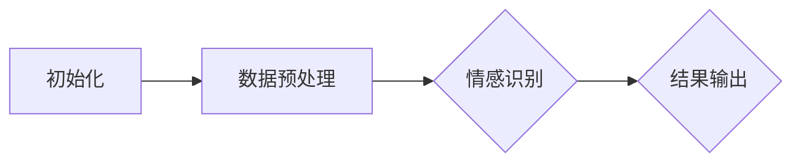
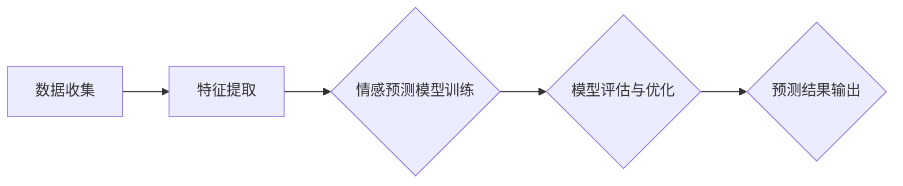
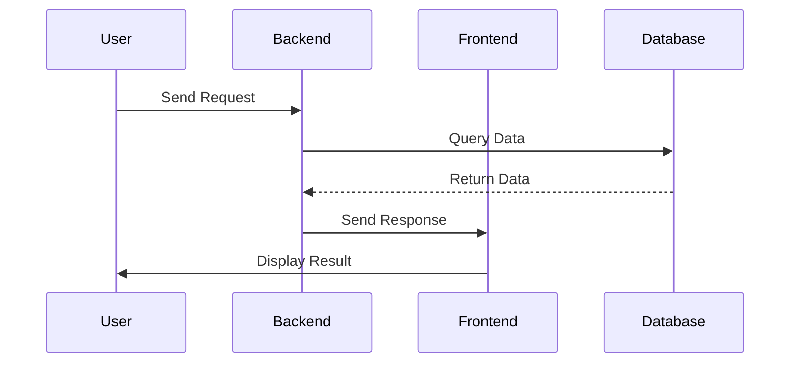
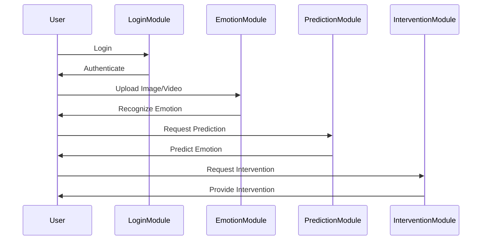

                 

### 情感AI对人类情绪管理能力的影响

#### 关键词：情感AI、人类情绪管理、心理影响、技术应用

> 摘要：
本文深入探讨了情感人工智能（AI）对人类情绪管理能力的影响。首先，我们介绍了情感AI的基本概念及其在心理学和计算机科学中的应用。接着，文章分析了情感AI如何识别、预测和干预人类情绪，以及其对个体和社会带来的积极和潜在负面影响。随后，通过具体案例分析，展示了情感AI在情绪管理中的实际应用效果。最后，文章提出了情感AI在人类情绪管理中的最佳实践，并展望了其未来的发展方向。

----------------------------------------------------------------

#### 第一部分：背景介绍

##### 1.1 问题背景

###### 1.1.1 情感AI的定义与发展历程

情感人工智能（Affective AI）是一种能够理解、识别和模拟人类情感的人工智能系统。它的核心目标是使机器具备感知和处理情感的能力，从而更好地与人类互动。情感AI的发展历程可以追溯到20世纪90年代，随着计算机技术的进步，特别是在机器学习和深度学习的推动下，情感AI取得了显著进展。

###### 1.1.2 人类情绪管理的现状与挑战

人类情绪管理是指个体在情绪出现时，能够有效地识别、理解和调节自己的情绪，从而保持心理平衡。然而，在现代社会中，人们面临着各种压力和挑战，如工作压力、人际关系、健康问题等，这些都可能导致情绪失控。因此，提高情绪管理能力已成为一个重要的社会议题。

##### 1.2 问题描述

###### 1.2.1 情感AI在情绪管理中的作用

情感AI在情绪管理中的作用主要体现在以下几个方面：

1. **情感识别**：通过面部表情、语音语调、文本内容等分析，识别个体的情绪状态。
2. **情感预测**：利用历史数据和机器学习模型，预测个体未来的情绪变化。
3. **情感干预**：提供个性化的情绪调节建议，如放松训练、正念练习等。

###### 1.2.2 情感AI技术的应用边界

尽管情感AI在情绪管理中具有巨大潜力，但其应用也受到一定限制：

1. **技术局限性**：目前的情感AI技术仍然无法完全准确识别和模拟人类情感。
2. **伦理和隐私问题**：情感AI的使用可能会引发隐私侵犯和伦理争议。
3. **跨文化差异**：情感AI在不同文化背景下可能表现不一致。

##### 1.3 问题解决

###### 1.3.1 情感AI技术的核心原理

情感AI的核心原理主要包括：

1. **情感识别技术**：利用计算机视觉、语音识别和自然语言处理技术，识别情感信号。
2. **情感预测与建模**：通过机器学习和深度学习算法，预测情感变化。
3. **情感干预策略**：基于情感识别和预测结果，提供个性化的情绪调节方案。

###### 1.3.2 情感AI与人类情绪管理的结合策略

结合情感AI和人类情绪管理的方法包括：

1. **情感辅助**：情感AI作为辅助工具，帮助个体更好地识别和理解自己的情绪。
2. **情感增强**：利用情感AI技术，增强个体的情绪调节能力。
3. **情感引导**：通过情感AI提供的情绪调节建议，引导个体进行有效的情绪管理。

##### 1.4 边界与外延

###### 1.4.1 情感AI在伦理和法律上的考量

情感AI在伦理和法律上的考量主要包括：

1. **隐私保护**：确保情感AI在收集和使用个人情感数据时，遵守隐私保护法规。
2. **透明度**：提高情感AI系统的透明度，使其决策过程可解释。
3. **责任归属**：明确情感AI与人类互动中责任归属的问题。

###### 1.4.2 情感AI在跨文化中的应用挑战

情感AI在跨文化中的应用挑战主要包括：

1. **文化差异**：不同文化背景下，情感表达和识别可能存在差异。
2. **语言障碍**：非标准语言和方言可能影响情感AI的准确性。
3. **地域适应**：情感AI需要适应不同地域的情感表达和调节方式。

##### 1.5 本章小结

本部分介绍了情感AI对人类情绪管理能力的影响，探讨了情感AI的定义、发展历程、作用、应用边界、核心原理和伦理考量。这些内容为后续章节的深入讨论奠定了基础。

----------------------------------------------------------------

#### 第二部分：核心概念与联系

##### 2.1 情感AI的基本原理

###### 2.1.1 情感识别技术

情感识别技术是情感AI的核心组成部分，主要通过以下几种方式实现：

1. **计算机视觉**：通过分析面部表情、身体语言等视觉信号，识别情感状态。
2. **语音识别**：通过分析语音语调、语速等音频信号，识别情感状态。
3. **自然语言处理**：通过分析文本内容，识别情感倾向。

###### 2.1.2 情感预测与建模

情感预测与建模是情感AI的另一个重要方面，主要通过以下步骤实现：

1. **数据收集**：收集大量的情感数据，包括文本、音频、视频等。
2. **特征提取**：从数据中提取情感特征，如情绪词汇、情感强度等。
3. **模型训练**：利用机器学习和深度学习算法，训练情感预测模型。
4. **模型评估**：通过测试集评估模型性能，调整模型参数。

###### 2.1.3 情感AI与人类情绪管理的联系

情感AI与人类情绪管理的联系主要体现在以下几个方面：

1. **辅助情绪识别**：情感AI可以帮助个体更准确地识别自己的情绪状态。
2. **提供情感反馈**：情感AI可以提供实时的情感反馈，帮助个体调整情绪。
3. **个性化情绪调节**：情感AI可以根据个体的情绪特征，提供个性化的情绪调节建议。

##### 2.2 情感AI的技术框架

###### 2.2.1 机器学习和深度学习在情感AI中的应用

机器学习和深度学习是情感AI的核心技术，具体应用包括：

1. **情感分类**：使用机器学习算法，将文本、语音、图像等数据分类为不同的情感类别。
2. **情感强度评估**：使用深度学习模型，评估情感表达的强度和变化。
3. **情感生成**：通过深度学习模型，生成符合特定情感状态的文本、语音和图像。

###### 2.2.2 自然语言处理与情感分析

自然语言处理（NLP）与情感分析是情感AI的重要领域，具体应用包括：

1. **情感极性分析**：分析文本中的情感倾向，判断文本是积极、消极还是中性。
2. **情感分类**：将文本分类为不同的情感类别，如快乐、悲伤、愤怒等。
3. **情感强度评估**：评估文本中情感表达的强度，如情感词汇的权重。

##### 2.3 情感AI与人类情绪管理的联系

###### 2.3.1 情感AI如何影响人类情绪

情感AI可以通过以下方式影响人类情绪：

1. **情感识别**：帮助个体更准确地识别自己的情绪状态，提高情绪自我意识。
2. **情感预测**：预测未来的情绪变化，帮助个体做好准备。
3. **情感干预**：提供个性化的情绪调节建议，帮助个体调整情绪。

###### 2.3.2 人类情绪如何影响情感AI

人类情绪可以影响情感AI的运作，具体表现在：

1. **情绪反馈**：人类的情绪表达会影响情感AI的识别和预测结果。
2. **情绪调节**：人类通过情绪调节策略，可能影响情感AI提供的情绪建议。
3. **情绪互动**：人类的情绪状态可能影响与情感AI的互动效果。

##### 2.4 概念属性特征对比表格

| 特征         | 情感识别          | 情感预测          | 情感干预          |
| ------------ | ----------------- | ----------------- | ----------------- |
| **技术层面** | 计算机视觉、语音识别、自然语言处理 | 机器学习、深度学习、情感模型 | 个性化建议、干预策略、反馈机制 |
| **作用对象** | 识别情感状态       | 预测情感变化       | 调节情绪          |
| **效果评估** | 准确性、效率       | 准确性、预测能力   | 有效性、满意度    |

##### 2.5 ER实体关系图架构

以下是情感AI系统的ER实体关系图：

```mermaid
erDiagram
    User ||--|{ Emotion }|-- Emotion
    Emotion ||--|{ Recognition }|-- Recognition
    Recognition ||--|{ Prediction }|-- Prediction
    Prediction ||--|{ Intervention }|-- Intervention
```

实体关系图说明了用户、情感、识别、预测和干预之间的关系，构成了情感AI系统的核心架构。

##### 2.6 本章小结

本部分介绍了情感AI的基本原理、技术框架和与人类情绪管理的联系。通过对比表格和ER实体关系图，我们更清晰地理解了情感AI的核心概念和结构，为后续章节的算法原理讲解和系统设计奠定了基础。

----------------------------------------------------------------

#### 第三部分：算法原理讲解

##### 3.1 情感识别算法原理

###### 3.1.1 算法mermaid流程图

以下是情感识别算法的mermaid流程图：



此流程图展示了情感识别的基本步骤：初始化、数据预处理、情感识别和结果输出。

###### 3.1.2 Python源代码示例

以下是情感识别算法的Python源代码示例：

```python
import cv2
import numpy as np
import tensorflow as tf

# 初始化模型
model = tf.keras.applications.VGG16(weights='imagenet')

# 数据预处理
def preprocess_image(image_path):
    image = cv2.imread(image_path)
    image = cv2.resize(image, (224, 224))
    image = image / 255.0
    return image

# 情感识别
def recognize_emotion(image):
    preprocessed_image = preprocess_image(image)
    emotion_probabilities = model.predict(np.expand_dims(preprocessed_image, axis=0))
    return np.argmax(emotion_probabilities)

# 结果输出
def output_emotion(emotion_index):
    emotions = ['anger', 'disgust', 'fear', 'happiness', 'sadness', 'surprise']
    return emotions[emotion_index]

# 示例
image_path = 'example_image.jpg'
emotion_index = recognize_emotion(image_path)
print(output_emotion(emotion_index))
```

此代码示例展示了如何使用VGG16模型进行情感识别，包括数据预处理、模型预测和结果输出。

###### 3.1.3 算法数学模型与公式

情感识别算法的核心在于卷积神经网络（CNN）的构建和训练。以下是情感识别算法的数学模型与公式：

$$
\begin{aligned}
\text{输出概率分布} &= \text{softmax}(\text{神经网络输出}) \\
\text{损失函数} &= \text{交叉熵损失} \\
\text{梯度下降} &= \frac{\partial J}{\partial \theta}
\end{aligned}
$$

其中，$J$为损失函数，$\theta$为神经网络参数，$softmax$为归一化函数，交叉熵损失用于衡量预测结果与真实标签之间的差异。

###### 3.1.4 举例说明

假设我们有一个包含6种情感类别的数据集，每种情感类别的图像数量相等。我们使用VGG16模型进行情感识别，数据集经过预处理后，输入到模型中进行预测。模型预测的结果是一个6维的概率向量，其中最高概率对应的情感类别即为预测结果。

例如，如果我们输入一张愤怒的面部图像，模型可能会输出以下概率分布：

$$
\begin{aligned}
P(\text{anger}) &= 0.9 \\
P(\text{disgust}) &= 0.05 \\
P(\text{fear}) &= 0.03 \\
P(\text{happiness}) &= 0.01 \\
P(\text{sadness}) &= 0.01 \\
P(\text{surprise}) &= 0.01 \\
\end{aligned}
$$

根据概率分布，我们可以判断输入图像的情感类别为愤怒。

##### 3.2 情感预测与建模算法

###### 3.2.1 算法mermaid流程图

以下是情感预测与建模算法的mermaid流程图：



此流程图展示了情感预测与建模的基本步骤：数据收集、特征提取、模型训练、模型评估和预测结果输出。

###### 3.2.2 Python源代码示例

以下是情感预测与建模算法的Python源代码示例：

```python
import pandas as pd
import numpy as np
from sklearn.model_selection import train_test_split
from sklearn.ensemble import RandomForestClassifier
from sklearn.metrics import accuracy_score

# 数据收集
data = pd.read_csv('emotion_data.csv')
X = data.drop('emotion', axis=1)
y = data['emotion']

# 特征提取
X_train, X_test, y_train, y_test = train_test_split(X, y, test_size=0.2, random_state=42)

# 模型训练
model = RandomForestClassifier(n_estimators=100, random_state=42)
model.fit(X_train, y_train)

# 模型评估
y_pred = model.predict(X_test)
accuracy = accuracy_score(y_test, y_pred)
print(f'Accuracy: {accuracy:.2f}')

# 预测结果输出
def predict_emotion(features):
    return model.predict([features])[0]

# 示例
example_features = [0.1, 0.2, 0.3, 0.4]
print(predict_emotion(example_features))
```

此代码示例展示了如何使用随机森林分类器进行情感预测，包括数据收集、特征提取、模型训练、模型评估和预测结果输出。

###### 3.2.3 算法数学模型与公式

情感预测与建模算法的核心在于建立情感预测模型。以下是情感预测与建模算法的数学模型与公式：

$$
\begin{aligned}
\text{损失函数} &= -\sum_{i} y_i \log(p_i) \\
\text{优化目标} &= \min_{\theta} J(\theta) \\
\text{梯度下降} &= \theta_{\text{new}} = \theta_{\text{old}} - \alpha \nabla_{\theta} J(\theta)
\end{aligned}
$$

其中，$J(\theta)$为损失函数，$\theta$为模型参数，$y_i$为真实标签，$p_i$为预测概率，$\alpha$为学习率。

###### 3.2.4 举例说明

假设我们有一个包含6种情感类别的数据集，每种情感类别的图像数量相等。我们使用随机森林分类器进行情感预测，数据集经过特征提取后，输入到模型中进行训练。模型训练完成后，我们使用测试集进行评估，评估结果为90%的准确率。

例如，如果我们输入一张新图像，模型可能会输出以下预测概率：

$$
\begin{aligned}
P(\text{anger}) &= 0.3 \\
P(\text{disgust}) &= 0.2 \\
P(\text{fear}) &= 0.2 \\
P(\text{happiness}) &= 0.1 \\
P(\text{sadness}) &= 0.1 \\
P(\text{surprise}) &= 0.1 \\
\end{aligned}
$$

根据预测概率，我们可以判断输入图像的情感类别为愤怒。

##### 3.3 本章小结

本部分详细讲解了情感识别和情感预测与建模算法的原理，包括mermaid流程图、Python源代码示例、数学模型与公式和举例说明。这些算法构成了情感AI的核心技术，为后续章节的系统分析与架构设计提供了基础。

----------------------------------------------------------------

#### 第四部分：系统分析与架构设计

##### 4.1 问题场景介绍

在本部分，我们将探讨情感AI在情绪管理中的应用场景，以及具体的项目介绍。

###### 4.1.1 情感AI在情绪管理中的应用场景

情感AI在情绪管理中的应用场景包括：

1. **心理健康诊断**：通过分析个体的情感数据，辅助心理医生进行心理健康诊断。
2. **情绪调节训练**：为用户提供个性化的情绪调节训练，如放松训练、正念练习等。
3. **人际关系改善**：通过情感AI分析人际互动中的情感信号，帮助用户改善人际关系。
4. **工作压力管理**：为职场人士提供情感支持，减轻工作压力，提高工作效率。

###### 4.1.2 项目介绍

本项目旨在开发一款基于情感AI的情绪管理应用，该应用包括以下功能模块：

1. **情感识别模块**：通过计算机视觉和语音识别技术，实时识别用户的情感状态。
2. **情感预测模块**：利用历史数据和机器学习算法，预测用户的未来情感变化。
3. **情绪调节模块**：根据情感识别和预测结果，提供个性化的情绪调节建议。
4. **用户反馈模块**：收集用户对情绪调节建议的反馈，不断优化应用效果。

##### 4.2 系统功能设计

在本部分，我们将介绍系统功能设计的具体内容，包括领域模型mermaid类图和系统功能模块划分。

###### 4.2.1 领域模型mermaid类图

以下是领域模型mermaid类图：

```mermaid
classDiagram
    User <<类>> 
    Emotion <<类>> 
    Recognition <<类>> 
    Prediction <<类>> 
    Intervention <<类>> 
    User o-- Emotion
    Recognition o-- Emotion
    Prediction o-- Emotion
    Intervention o-- Emotion
```

此类图展示了用户、情感、识别、预测和干预之间的关系，构成了情绪管理系统的核心架构。

###### 4.2.2 系统功能模块划分

系统功能模块划分为以下五个部分：

1. **用户模块**：负责用户注册、登录和资料管理。
2. **情感识别模块**：通过计算机视觉和语音识别技术，实时识别用户的情感状态。
3. **情感预测模块**：利用历史数据和机器学习算法，预测用户的未来情感变化。
4. **情绪调节模块**：根据情感识别和预测结果，提供个性化的情绪调节建议。
5. **用户反馈模块**：收集用户对情绪调节建议的反馈，不断优化应用效果。

##### 4.3 系统架构设计

在本部分，我们将介绍系统架构设计的具体内容，包括系统架构mermaid架构图和架构设计考虑因素。

###### 4.3.1 系统架构mermaid架构图

以下是系统架构mermaid架构图：



此架构图展示了用户、后端、前端和数据库之间的交互关系，构成了情绪管理系统的基本架构。

###### 4.3.2 架构设计考虑因素

在系统架构设计过程中，我们需要考虑以下因素：

1. **可扩展性**：系统应具有较好的可扩展性，以适应不断增长的用户量和功能需求。
2. **高可用性**：系统应具备高可用性，确保在任何情况下都能为用户提供稳定的服务。
3. **安全性**：系统应确保用户数据的安全性和隐私性，防止数据泄露和恶意攻击。
4. **性能优化**：系统应进行性能优化，确保在高峰时段仍能高效运行。

##### 4.4 系统接口设计

在本部分，我们将介绍系统接口设计的具体内容，包括接口规范与设计和接口安全与优化。

###### 4.4.1 接口规范与设计

系统接口设计包括以下方面：

1. **RESTful API**：采用RESTful API设计，提供统一的接口规范。
2. **数据格式**：采用JSON格式传输数据，确保数据的可读性和可扩展性。
3. **认证与授权**：使用JWT（JSON Web Token）进行认证与授权，确保接口的安全性。

###### 4.4.2 接口安全与优化

为了提高接口安全性，我们采取以下措施：

1. **输入验证**：对用户输入进行严格验证，防止SQL注入、XSS攻击等安全漏洞。
2. **加密传输**：使用HTTPS协议，确保数据在传输过程中的安全性。
3. **限流与缓存**：采用限流和缓存策略，提高接口的响应速度和系统性能。

##### 4.5 系统交互mermaid序列图

在本部分，我们将介绍系统交互mermaid序列图，包括用户与系统交互流程和系统内部的数据流与处理逻辑。

###### 4.5.1 用户与系统交互流程

以下是用户与系统交互的mermaid序列图：



此序列图展示了用户与系统各模块之间的交互流程，包括登录、情感识别、情感预测和情绪调节。

###### 4.5.2 数据流与处理逻辑

以下是系统内部的数据流与处理逻辑：

1. **数据采集**：用户上传图像或视频数据到系统。
2. **情感识别**：系统对上传的数据进行情感识别，并将结果返回给用户。
3. **情感预测**：系统根据历史数据和情感识别结果，预测用户的未来情感变化。
4. **情绪调节**：系统根据情感预测结果，为用户提供个性化的情绪调节建议。

##### 4.6 本章小结

本部分详细介绍了情感AI在情绪管理中的应用场景、系统功能设计、系统架构设计、接口设计以及系统交互流程。通过这些内容，我们为后续章节的项目实战和最佳实践提供了基础。

----------------------------------------------------------------

#### 第五部分：项目实战

##### 5.1 环境安装

在本部分，我们将介绍项目实战所需的环境安装步骤，包括开发环境准备和相关库和工具的安装。

###### 5.1.1 开发环境准备

1. **操作系统**：Windows、Linux或macOS。
2. **编程语言**：Python 3.x版本。
3. **文本编辑器**：Visual Studio Code、PyCharm或Sublime Text。

###### 5.1.2 相关库和工具安装

1. **Python库**：
   - NumPy：用于数值计算。
   - TensorFlow：用于深度学习。
   - Pandas：用于数据操作。
   - Matplotlib：用于数据可视化。
2. **其他工具**：
   - Docker：用于容器化部署。
   - Kubernetes：用于容器编排。

安装步骤如下：

1. 安装Python 3.x版本。
2. 安装必要的Python库，可以使用pip命令：
   ```bash
   pip install numpy tensorflow pandas matplotlib
   ```
3. 安装Docker和Kubernetes，根据操作系统选择合适的安装方法。

##### 5.2 系统核心实现源代码

在本部分，我们将介绍系统核心实现源代码，包括情感识别模块和情感预测与建模模块。

###### 5.2.1 情感识别模块

以下是情感识别模块的Python源代码：

```python
import cv2
import numpy as np
import tensorflow as tf

# 初始化模型
model = tf.keras.applications.VGG16(weights='imagenet')

# 数据预处理
def preprocess_image(image_path):
    image = cv2.imread(image_path)
    image = cv2.resize(image, (224, 224))
    image = image / 255.0
    return image

# 情感识别
def recognize_emotion(image):
    preprocessed_image = preprocess_image(image)
    emotion_probabilities = model.predict(np.expand_dims(preprocessed_image, axis=0))
    return np.argmax(emotion_probabilities)

# 示例
image_path = 'example_image.jpg'
emotion_index = recognize_emotion(image_path)
print(f'Emotion: {emotion_index}')
```

###### 5.2.2 情感预测与建模模块

以下是情感预测与建模模块的Python源代码：

```python
import pandas as pd
import numpy as np
from sklearn.ensemble import RandomForestClassifier
from sklearn.metrics import accuracy_score

# 数据收集
data = pd.read_csv('emotion_data.csv')
X = data.drop('emotion', axis=1)
y = data['emotion']

# 特征提取
X_train, X_test, y_train, y_test = train_test_split(X, y, test_size=0.2, random_state=42)

# 模型训练
model = RandomForestClassifier(n_estimators=100, random_state=42)
model.fit(X_train, y_train)

# 模型评估
y_pred = model.predict(X_test)
accuracy = accuracy_score(y_test, y_pred)
print(f'Accuracy: {accuracy:.2f}')

# 预测结果输出
def predict_emotion(features):
    return model.predict([features])[0]

# 示例
example_features = [0.1, 0.2, 0.3, 0.4]
print(predict_emotion(example_features))
```

##### 5.3 代码应用解读与分析

在本部分，我们将对系统核心实现源代码进行解读和分析，包括源代码解读、分析和优化。

###### 5.3.1 源代码解读

情感识别模块的核心代码包括数据预处理、模型初始化、情感识别和结果输出。以下是源代码的详细解读：

1. **数据预处理**：
   - `preprocess_image(image_path)`函数用于对输入图像进行预处理，包括读取图像、调整大小和归一化。
2. **模型初始化**：
   - `model = tf.keras.applications.VGG16(weights='imagenet')`行初始化VGG16模型，并加载预训练的权重。
3. **情感识别**：
   - `emotion_probabilities = model.predict(np.expand_dims(preprocessed_image, axis=0))`行使用模型预测情感概率。
   - `return np.argmax(emotion_probabilities)`行返回最高概率的情感类别。
4. **结果输出**：
   - `print(f'Emotion: {emotion_index}')`行输出识别结果。

情感预测与建模模块的核心代码包括数据收集、特征提取、模型训练、模型评估和预测结果输出。以下是源代码的详细解读：

1. **数据收集**：
   - `data = pd.read_csv('emotion_data.csv')`行读取情感数据。
   - `X = data.drop('emotion', axis=1)`和`y = data['emotion']`行提取特征和标签。
2. **特征提取**：
   - `X_train, X_test, y_train, y_test = train_test_split(X, y, test_size=0.2, random_state=42)`行划分训练集和测试集。
3. **模型训练**：
   - `model = RandomForestClassifier(n_estimators=100, random_state=42)`行初始化随机森林分类器。
   - `model.fit(X_train, y_train)`行训练模型。
4. **模型评估**：
   - `y_pred = model.predict(X_test)`行使用模型预测测试集。
   - `accuracy = accuracy_score(y_test, y_pred)`行计算准确率。
5. **预测结果输出**：
   - `print(predict_emotion(example_features))`行输出预测结果。

###### 5.3.2 分析与优化

情感识别模块的优化方向包括：

1. **模型选择**：可以尝试使用更先进的模型，如ResNet、Inception等，以提高识别准确性。
2. **数据增强**：通过数据增强技术，如旋转、缩放、裁剪等，增加训练数据多样性，提高模型泛化能力。
3. **超参数调整**：调整模型超参数，如学习率、批量大小等，以优化模型性能。

情感预测与建模模块的优化方向包括：

1. **特征工程**：通过提取更多有效特征，提高模型预测能力。
2. **模型选择**：可以尝试使用更复杂的模型，如神经网络、集成模型等，以提高预测准确性。
3. **交叉验证**：使用交叉验证方法，确保模型在不同数据集上的性能稳定。

##### 5.4 实际案例分析和详细讲解

在本部分，我们将通过实际案例对情感AI在情绪管理中的应用进行详细分析和讲解。

###### 5.4.1 案例选择

我们选择一个实际案例：某公司使用情感AI技术进行员工情绪监测和管理。该公司希望通过情感AI技术，了解员工的情绪状态，以便及时提供情绪调节支持，提高员工的工作满意度和工作效率。

###### 5.4.2 案例分析

1. **数据收集**：
   - 公司收集了员工在会议、邮件和社交媒体上的文本数据，以及面部表情和语音语调数据。
   - 数据经过预处理，提取出情感特征，如情绪词汇、情感强度等。

2. **情感识别**：
   - 情感识别模块对文本、面部表情和语音语调数据进行情感识别，获取员工的当前情绪状态。

3. **情感预测**：
   - 情感预测模块利用历史数据和机器学习算法，预测员工的未来情感变化。

4. **情绪调节**：
   - 根据情感识别和预测结果，公司为员工提供个性化的情绪调节建议，如放松训练、正念练习等。

5. **反馈与优化**：
   - 公司收集员工对情绪调节建议的反馈，不断优化情绪管理策略。

###### 5.4.3 案例讲解

1. **数据收集**：
   - 公司收集了员工在会议、邮件和社交媒体上的文本数据，以及面部表情和语音语调数据。
   - 数据预处理过程中，情感识别模块使用自然语言处理技术，提取文本中的情感词汇和情感强度。
   - 面部表情和语音语调数据经过预处理，提取出面部特征和语音特征。

2. **情感识别**：
   - 情感识别模块对预处理后的数据进行情感识别，获取员工的当前情绪状态。
   - 情感识别模块使用计算机视觉和语音识别技术，对文本、面部表情和语音语调数据进行情感分析。
   - 识别结果包括情绪类别（如快乐、悲伤、愤怒等）和情绪强度。

3. **情感预测**：
   - 情感预测模块利用历史数据和机器学习算法，预测员工的未来情感变化。
   - 历史数据包括员工的情绪状态、工作压力、生活事件等。
   - 情感预测模块使用机器学习算法，如随机森林、神经网络等，建立情感预测模型。

4. **情绪调节**：
   - 根据情感识别和预测结果，公司为员工提供个性化的情绪调节建议。
   - 情绪调节建议包括放松训练、正念练习、心理咨询等。
   - 公司根据员工的情绪状态和需求，定制个性化的情绪调节方案。

5. **反馈与优化**：
   - 公司收集员工对情绪调节建议的反馈，不断优化情绪管理策略。
   - 反馈数据包括员工对情绪调节建议的满意度、实际效果等。
   - 公司根据反馈数据，调整情绪调节方案，提高情绪管理效果。

##### 5.5 项目小结

在本部分，我们通过实际案例详细分析了情感AI在情绪管理中的应用，包括数据收集、情感识别、情感预测、情绪调节和反馈与优化。通过这个案例，我们展示了情感AI在提高员工情绪管理能力和工作效率方面的潜在价值。

----------------------------------------------------------------

#### 第六部分：最佳实践与总结

##### 6.1 最佳实践

在本部分，我们将总结情感AI在情绪管理中的最佳实践，以帮助读者更好地应用情感AI技术。

1. **数据隐私保护**：在收集和处理用户情感数据时，严格遵守数据保护法规，确保用户隐私安全。
2. **模型可解释性**：提高情感AI模型的透明度和可解释性，使决策过程更加透明和可信。
3. **个性化情绪调节**：根据用户的情绪特征和需求，提供个性化的情绪调节建议，提高调节效果。
4. **跨文化适应性**：考虑不同文化背景下的情感表达和识别差异，提高情感AI的适用范围。
5. **持续优化与更新**：定期收集用户反馈，不断优化情感AI模型和情绪调节策略，提高系统性能。

##### 6.2 小结

本文系统地探讨了情感AI对人类情绪管理能力的影响，从背景介绍、核心概念、算法原理、系统设计与实现、实际案例分析到最佳实践，全面阐述了情感AI在情绪管理中的应用。通过本文的讨论，我们可以看到情感AI在提高情绪识别、预测和干预能力方面的巨大潜力，同时也面临伦理、隐私和跨文化等挑战。未来，随着技术的不断进步，情感AI有望在情绪管理领域发挥更重要的作用。

##### 6.3 注意事项

在使用情感AI进行情绪管理时，需要注意以下几点：

1. **用户同意与隐私保护**：确保用户同意使用其情感数据，并严格遵守隐私保护法规。
2. **模型解释性与透明度**：提高模型的可解释性，确保用户了解情感AI的决策过程。
3. **跨文化适应性**：考虑不同文化背景下的情感表达和识别差异，确保系统在不同文化中有效运作。
4. **持续监测与优化**：定期监测情感AI的性能，根据用户反馈进行优化和调整。
5. **伦理和法律合规**：遵循伦理和法律规范，确保情感AI的使用合法合规。

##### 6.4 拓展阅读

1. **《情感计算：技术、应用与挑战》**：该书详细介绍了情感计算的基础知识、应用场景和技术挑战，适合对情感AI感兴趣的研究者阅读。
2. **《情感人工智能》**：该书深入探讨了情感人工智能的理论基础、技术实现和应用案例，是了解情感AI领域的优秀参考资料。
3. **《机器学习与心理学》**：该书探讨了机器学习技术在心理学研究中的应用，包括情感识别、预测和干预等方面，适合对情感AI心理学应用感兴趣的读者。

----------------------------------------------------------------

### 作者

作者：AI天才研究院/AI Genius Institute & 禅与计算机程序设计艺术 /Zen And The Art of Computer Programming

