                 

### 第一部分：引言

#### 1.1 问题背景

##### 1.1.1 人工智能与情感AI的发展

人工智能（Artificial Intelligence, AI）作为计算机科学的重要分支，近年来取得了飞速发展。随着深度学习、神经网络和自然语言处理等技术的不断进步，AI在各个领域的应用越来越广泛。尤其是情感AI（Emotion AI），它通过模拟人类的情感识别与生成，实现了对人类情感状态的感知和理解。

情感AI的发展可以追溯到20世纪90年代，当时研究人员开始尝试使用计算机模拟情感。随着大数据和机器学习技术的兴起，情感AI得到了迅速发展。目前，情感AI已经在许多领域得到应用，如心理健康、客户服务、娱乐和营销等。

##### 1.1.2 教育体系的现状与挑战

教育体系是社会发展的重要基石，然而，当前教育体系面临着诸多挑战。首先，教育资源的分配不均，城乡、地区之间的教育水平存在明显差异。其次，传统教育模式过于依赖课堂教学，缺乏个性化教育。此外，随着信息技术的迅猛发展，教育内容更新速度跟不上时代的步伐。

在教育体系中引入情感AI，有望解决这些挑战。情感AI可以通过情感识别技术，了解学生的学习状态和心理需求，从而实现个性化教育。同时，情感AI可以帮助教师更好地理解学生的情感状态，提供更加有针对性的教育支持。

##### 1.1.3 情感AI在教育体系中的潜在影响

情感AI在教育体系中的潜在影响主要体现在以下几个方面：

1. **个性化教育**：情感AI可以根据学生的学习状态和心理需求，提供个性化的教育内容和教学策略，提高学习效果。

2. **情感管理**：情感AI可以帮助教师和学生更好地管理情绪，提高心理健康水平。

3. **教育资源优化**：情感AI可以通过情感分析，优化教育资源的分配，提高教育资源的利用效率。

4. **教学创新**：情感AI可以推动教育模式的创新，实现更加生动、有趣、高效的教育。

综上所述，情感AI在教育体系中具有巨大的潜力。本篇文章将深入探讨情感AI的技术基础、情商培养的理论与实践，以及情感AI在教育实践中的应用，旨在为教育工作者提供有益的参考和启示。

---

#### 1.2 核心概念

##### 1.2.1 情感AI的定义与特点

情感AI（Emotion AI）是一种利用人工智能技术模拟和识别人类情感的能力。它通过情感识别和情感生成两种技术，实现对人类情感状态的理解和表达。

**情感识别技术**：情感识别技术通过分析语音、文本、图像等数据，识别出人类情感状态。常见的情感识别技术包括语音识别、文本情感分析、视频情感分析等。

**情感生成技术**：情感生成技术通过模拟人类情感表达，生成符合情感状态的声音、文本和图像。常见的情感生成技术包括语音合成、文本生成、视频情感生成等。

情感AI的特点主要体现在以下几个方面：

1. **高精度识别**：情感AI能够准确识别人类情感状态，为个性化教育提供有力支持。

2. **实时响应**：情感AI能够实时分析情感数据，为教育决策提供即时反馈。

3. **多样性表达**：情感AI可以生成多种情感状态的表达，丰富教育内容和形式。

##### 1.2.2 情商与教育

情商（Emotional Intelligence, EI）是指个体识别、理解、管理和利用情感信息的能力。情商包括自我认知、自我调控、社会技能和情感意识四个方面。

**情商在教育中的重要性**：

1. **促进个人发展**：情商有助于学生更好地应对挑战，提高学习成绩。

2. **提升社会关系**：情商有助于学生建立良好的人际关系，提高社会适应能力。

3. **培养创新思维**：情商有助于学生培养创新思维，提高问题解决能力。

**情商培养的方法**：

1. **课堂教学**：在课堂教学中，教师可以通过案例讨论、情感故事等方式，引导学生认识和理解情感。

2. **课外活动**：通过参加社团、志愿服务等活动，学生可以在实践中培养情商。

3. **家校合作**：家庭和学校可以共同关注学生的情感发展，提供全面的教育支持。

##### 1.2.3 情感AI与教育体系的关系

情感AI与教育体系的关系可以从以下几个方面来理解：

1. **技术支持**：情感AI为教育体系提供了技术支持，可以帮助教师更好地了解学生，提供个性化教育。

2. **教育创新**：情感AI推动了教育模式的创新，实现了更加生动、有趣、高效的教育。

3. **教育资源优化**：情感AI可以通过情感分析，优化教育资源的分配，提高教育资源的利用效率。

综上所述，情感AI在教育体系中具有重要的作用。通过深入探讨情感AI的技术基础、情商培养的理论与实践，以及情感AI在教育实践中的应用，本篇文章旨在为教育工作者提供有益的参考和启示。

---

#### 1.3 书籍结构概述

##### 1.3.1 研究方法与数据来源

本研究采用文献分析、实证研究和案例分析相结合的方法，对情感AI在教育体系中的应用进行深入探讨。研究数据来源于国内外相关学术论文、教育报告、教育实践案例等。

##### 1.3.2 主要章节内容安排

本文分为四个部分，共十三章节。第一部分引言，介绍问题背景、核心概念和研究意义；第二部分情感AI技术基础，探讨情感AI的原理和应用；第三部分情商培养的理论与实践，分析情商的重要性和方法；第四部分情感AI在教育实践中的应用，详细讨论情感AI在基础教育和高等教育中的应用案例。

##### 1.3.3 预期读者群体与目标

本文的预期读者群体包括教育工作者、人工智能研究人员、学生以及关注教育领域发展的社会各界人士。本文旨在通过深入探讨情感AI在教育体系中的应用，为教育工作者提供有益的参考和启示，推动教育模式的创新与发展。

---

### 第二部分：情感AI技术基础

#### 2.1 情感AI的原理

情感AI的核心在于情感识别和情感生成技术。这些技术通过模拟人类情感，实现对情感状态的感知和表达。以下将详细探讨情感识别和情感生成技术的原理和应用。

##### 2.1.1 情感识别技术

**情感识别技术**是通过分析语音、文本、图像等数据，识别出人类情感状态。以下是几种常见的情感识别技术：

###### 2.1.1.1 语音识别

语音识别技术通过对语音信号的分析，识别出说话人的情感状态。常见的语音识别算法包括隐马尔可夫模型（HMM）、深度神经网络（DNN）和卷积神经网络（CNN）等。以下是一个简单的语音识别流程图：

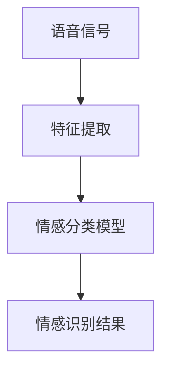

**特征提取**是将语音信号转换为数字信号，提取出与情感相关的特征。常用的特征包括频谱特征、音高特征和时长特征等。**情感分类模型**通常采用支持向量机（SVM）、决策树（DT）和神经网络（NN）等算法，对提取出的特征进行分类，得到情感识别结果。

###### 2.1.1.2 视频情感分析

视频情感分析技术通过对视频信号的分析，识别出视频中人的情感状态。视频情感分析包括人脸检测、面部特征提取和情感分类等步骤。以下是一个简单的视频情感分析流程图：

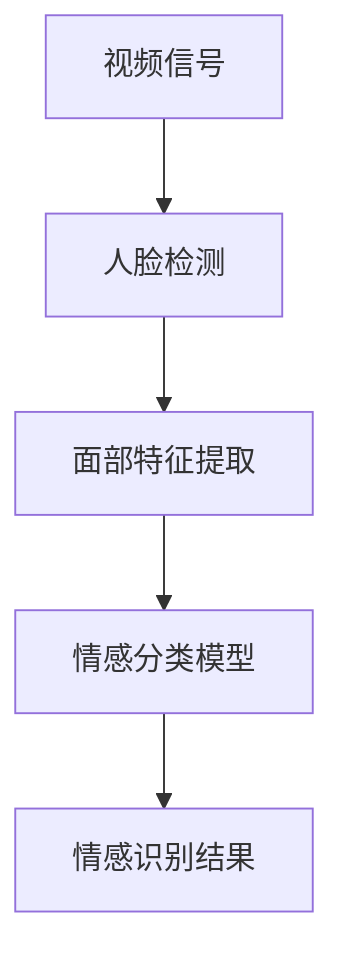

**人脸检测**是通过图像处理技术，检测出视频中的人脸。**面部特征提取**是从人脸图像中提取出与情感相关的特征，如眼睛张开程度、嘴巴张开程度等。**情感分类模型**对提取出的特征进行分类，得到情感识别结果。

###### 2.1.1.3 文本情感分析

文本情感分析技术通过对文本的分析，识别出文本的情感倾向。常见的文本情感分析算法包括朴素贝叶斯（NB）、支持向量机（SVM）和深度学习（DL）等。以下是一个简单的文本情感分析流程图：

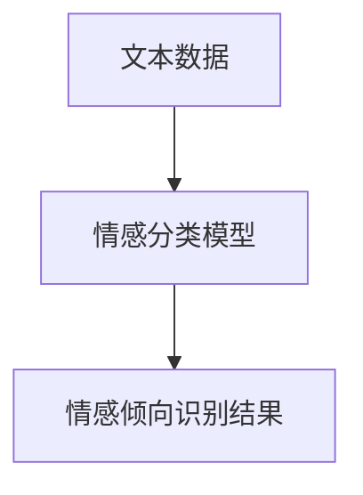

**情感分类模型**通常通过对大量标注数据进行训练，学习到文本与情感之间的映射关系。在新的文本数据输入时，模型可以判断文本的情感倾向。

##### 2.1.2 情感生成技术

**情感生成技术**是通过模拟人类情感，生成符合情感状态的声音、文本和图像。以下是几种常见的情感生成技术：

###### 2.1.2.1 语音合成

语音合成技术通过对文本数据进行分析，生成符合情感状态的声音。常见的语音合成算法包括拼接合成（DHS）、参数合成（HMM-based）和深度神经网络（DNN-based）等。以下是一个简单的语音合成流程图：

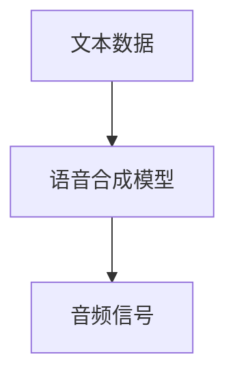

**语音合成模型**通过对大量语音数据进行分析和建模，学习到文本与语音之间的映射关系。在新的文本数据输入时，模型可以生成符合情感状态的声音。

###### 2.1.2.2 文本生成

文本生成技术通过对情感状态的模拟，生成符合情感状态的文本。常见的文本生成算法包括循环神经网络（RNN）、生成对抗网络（GAN）和变分自编码器（VAE）等。以下是一个简单的文本生成流程图：

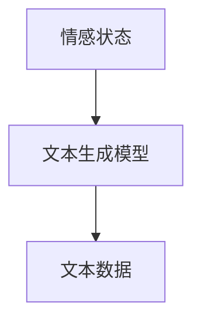

**文本生成模型**通过对情感状态进行分析和建模，学习到情感状态与文本之间的映射关系。在新的情感状态输入时，模型可以生成符合情感状态的文本。

###### 2.1.2.3 视频情感生成

视频情感生成技术通过对情感状态的模拟，生成符合情感状态的视频。常见的视频生成算法包括生成对抗网络（GAN）、变分自编码器（VAE）和强化学习（RL）等。以下是一个简单的视频情感生成流程图：

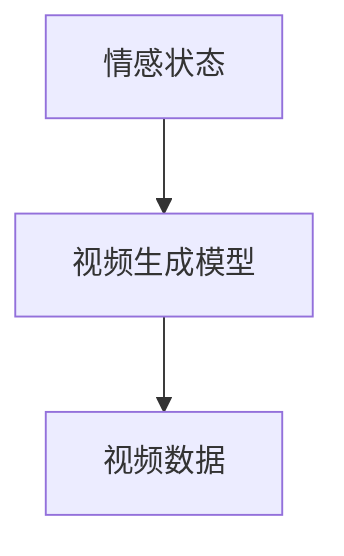

**视频生成模型**通过对情感状态进行分析和建模，学习到情感状态与视频之间的映射关系。在新的情感状态输入时，模型可以生成符合情感状态的视频。

---

##### 2.2 情感AI在教育中的应用

情感AI在教育中的应用主要包括情感识别和情感生成两个方面。以下将分别探讨这两种技术在教育中的应用。

###### 2.2.1 情感识别在教育中的应用

**情感识别技术**在教育中的应用主要体现在以下几个方面：

1. **学生的情感状态监控**：通过情感识别技术，教师可以实时监控学生的情感状态，了解学生的学习情绪和心理需求。这有助于教师更好地指导学生，提供个性化的教育支持。

2. **教师的教学反馈**：情感识别技术可以帮助教师了解自己的教学效果，获取学生的情感反馈。这有助于教师调整教学策略，提高教学质量。

以下是一个简单的学生情感状态监控系统架构图：

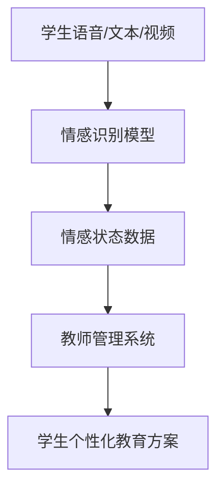

###### 2.2.2 情感生成在教育中的应用

**情感生成技术**在教育中的应用主要体现在以下几个方面：

1. **个性化教学**：通过情感生成技术，教师可以根据学生的情感状态，生成符合学生情感需求的教学内容。这有助于提高学生的学习兴趣和参与度。

2. **情感化学习内容设计**：通过情感生成技术，教师可以设计出更加生动、有趣、情感化的学习内容，提高学生的学习效果。

以下是一个简单的情感化学习内容设计系统架构图：

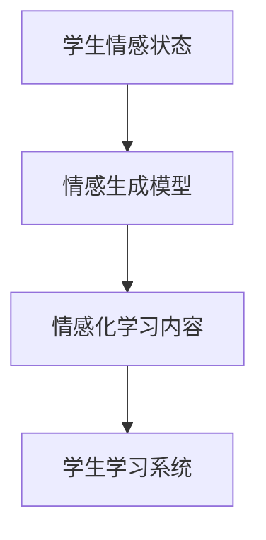

---

##### 2.3 情感AI的挑战与未来方向

虽然情感AI在教育中具有巨大潜力，但在实际应用中仍面临一些挑战：

1. **技术挑战**：情感识别的准确性、情感生成的多样性与真实性等技术问题仍需解决。

2. **隐私保护与道德伦理问题**：情感AI的应用可能涉及学生和教师的隐私信息，需要妥善处理隐私保护和道德伦理问题。

未来的研究方向包括：

1. **技术提升**：继续提高情感识别的准确性和情感生成的多样性与真实性。

2. **跨学科合作**：加强心理学、教育学与人工智能技术的跨学科合作，推动情感AI在教育体系中的整合和应用。

---

##### 2.4 本章小结

本章介绍了情感AI的原理和应用，包括情感识别和情感生成技术。同时，探讨了情感AI在教育中的应用，如学生的情感状态监控和教师的教学反馈。最后，分析了情感AI面临的挑战和未来的研究方向。通过本章的学习，读者可以初步了解情感AI在教育体系中的应用前景和潜在价值。

---

### 第三部分：情商培养的理论与实践

#### 3.1 情商理论

情商（Emotional Intelligence, EI）是指个体识别、理解、管理和利用情感信息的能力。情商包括四个主要方面：自我认知、自我调控、社会技能和情感意识。以下是情商的具体定义和分类。

**3.1.1.1 自我认知**

自我认知是指个体对自己情感状态的认识和了解。它包括两个层次：

1. **情感自我认知**：个体能够感知和识别自己的情绪状态，如快乐、悲伤、焦虑等。
2. **情感自我反思**：个体能够对自身的情绪进行深入反思，理解情绪背后的原因和影响。

**3.1.1.2 自我调控**

自我调控是指个体在情感状态发生变化时，能够自我调节和管理情感。自我调控包括两个层次：

1. **情绪调节**：个体能够调整和控制自己的情绪，使其更加积极、健康。
2. **压力管理**：个体能够应对压力和挑战，保持情绪稳定。

**3.1.1.3 社会技能**

社会技能是指个体在人际交往中表现出的能力和技巧。社会技能包括：

1. **沟通能力**：个体能够有效地表达自己的想法和感受，理解他人的需求和意图。
2. **团队合作**：个体能够与团队成员合作，共同完成任务。
3. **冲突解决**：个体能够处理和解决人际冲突，维护良好的人际关系。

**3.1.1.4 情感意识**

情感意识是指个体对他人的情感状态的理解和关注。情感意识包括：

1. **情感共鸣**：个体能够理解他人的情感状态，产生共鸣。
2. **情感支持**：个体能够给予他人情感上的支持和帮助。

**3.1.2 情商的重要性**

情商在教育中的重要性体现在以下几个方面：

1. **促进个人发展**：情商有助于学生更好地应对学习和生活中的挑战，提高个人成就感和幸福感。
2. **提升社会关系**：情商有助于学生建立良好的人际关系，提高社会适应能力。
3. **培养创新思维**：情商有助于学生培养创新思维，提高问题解决能力。
4. **提高教育质量**：情商有助于教师更好地了解学生，提供个性化的教育支持，提高教学质量。

**3.1.3 情商培养的方法**

情商的培养可以通过以下几种方法进行：

1. **课堂教学**：在课堂教学中，教师可以通过情感故事、案例讨论等方式，引导学生认识和理解情感。
2. **课外活动**：通过参加社团、志愿服务等活动，学生可以在实践中培养情商。
3. **家校合作**：家庭和学校可以共同关注学生的情感发展，提供全面的教育支持。
4. **个人自我提升**：学生可以通过阅读、自我反思和情感训练等方式，提高自己的情商。

---

#### 3.2 情感AI在教育体系中的应用案例

**3.2.1 情感识别与监控**

**3.2.1.1 学生的情感状态监控**

通过情感识别技术，教育机构可以对学生的情感状态进行实时监控。以下是一个学生情感状态监控系统的架构图：

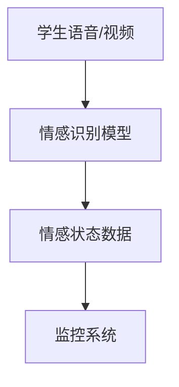

监控系统可以实时收集和分析学生的情感状态数据，生成情感状态报告。教师可以通过监控系统了解学生的学习情绪和心理需求，及时提供支持和帮助。

**3.2.1.2 教师的教学效果评估**

通过情感识别技术，教育机构可以对教师的教学效果进行评估。以下是一个教学效果评估系统的架构图：

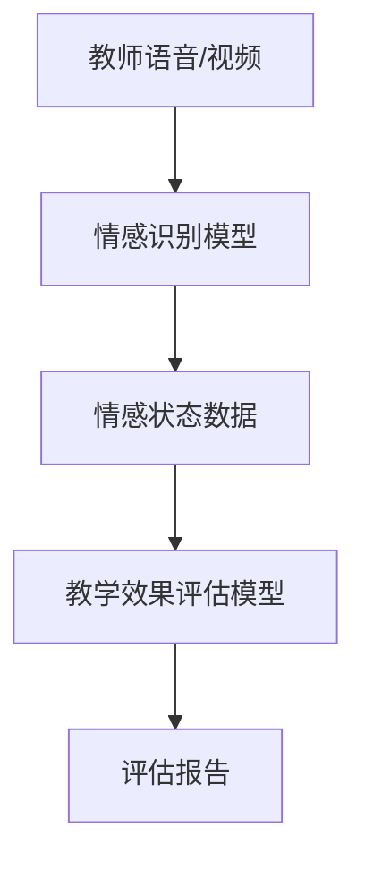

教学效果评估模型可以根据教师的情感状态数据，评估教师的教学效果。教育机构可以根据评估报告调整教学策略，提高教学质量。

**3.2.2 情感生成与个性化教学**

**3.2.2.1 个性化学习内容设计**

通过情感生成技术，教育机构可以设计出符合学生情感需求的学习内容。以下是一个个性化学习内容设计系统的架构图：

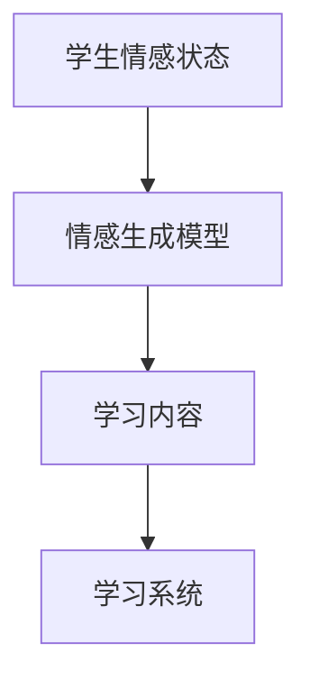

学习系统可以根据学生的情感状态生成个性化的学习内容，提高学生的学习兴趣和参与度。

**3.2.2.2 个性化教学反馈**

通过情感生成技术，教师可以生成符合学生情感需求的教学反馈。以下是一个个性化教学反馈系统的架构图：

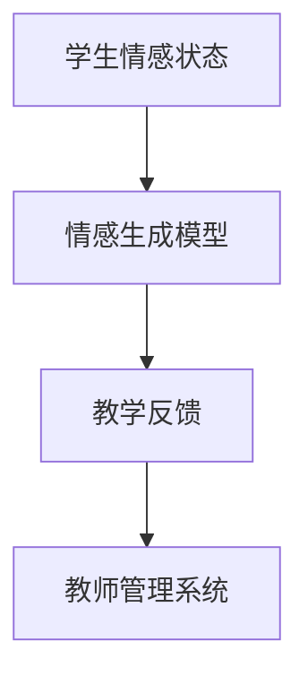

教师管理系统可以根据学生的情感状态生成个性化的教学反馈，帮助学生更好地理解学习内容。

---

#### 3.3 本章小结

本章介绍了情商的理论与实践，包括情商的定义、分类、重要性以及培养方法。同时，通过情感AI在教育中的应用案例，展示了情感识别和情感生成技术在教育体系中的应用价值。通过本章的学习，读者可以更好地理解情商在教育中的重要作用，以及如何通过情感AI技术提高教育质量。

---

### 第四部分：情感AI在教育实践中的应用

#### 4.1 情感AI在基础教育中的应用

**4.1.1 情感识别在教育管理中的应用**

基础教育阶段，情感识别技术在学生心理健康管理、教师工作压力监控等方面有着广泛的应用。

**4.1.1.1 学生心理健康管理**

通过情感识别技术，教育机构可以实时监控学生的情感状态，及时发现心理问题。以下是一个学生心理健康管理系统架构图：

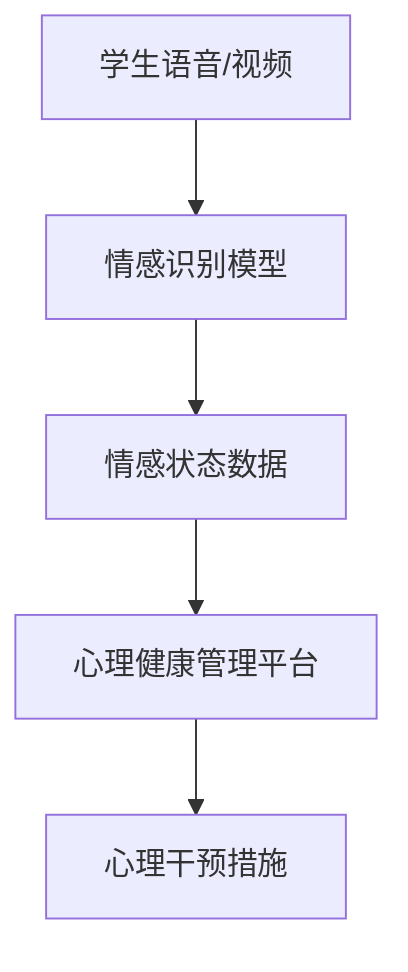

心理健康管理平台可以根据学生的情感状态数据，生成心理健康报告，为教师和家长提供干预建议。

**4.1.1.2 教师工作压力监控**

教师工作压力是影响教育质量的重要因素。通过情感识别技术，教育机构可以监控教师的工作压力，提供相应的支持。以下是一个教师工作压力监控系统架构图：

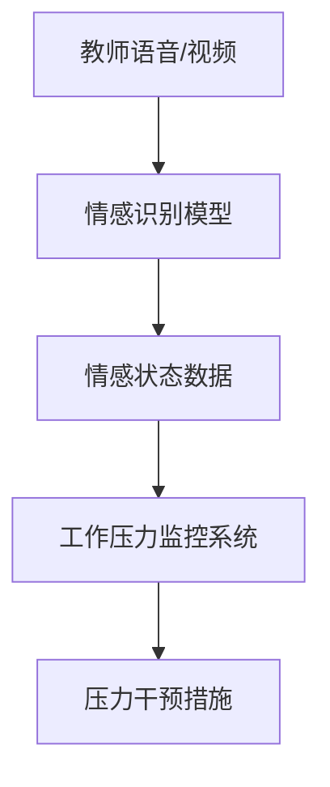

工作压力监控系统可以根据教师的情感状态数据，生成工作压力报告，为学校管理层提供干预建议。

**4.1.2 情感生成在个性化教学中的应用**

情感生成技术在个性化教学、情感化课程设计等方面有着重要的应用。

**4.1.2.1 情感化课程设计**

通过情感生成技术，教师可以根据学生的情感需求，设计出更加生动、有趣的课程内容。以下是一个情感化课程设计系统架构图：

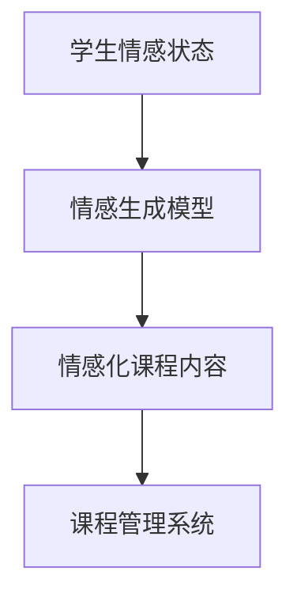

课程管理系统可以根据学生的情感状态生成情感化课程内容，提高学生的学习兴趣和参与度。

**4.1.2.2 个性化学习路径规划**

通过情感生成技术，教育机构可以为学生规划个性化的学习路径。以下是一个个性化学习路径规划系统架构图：

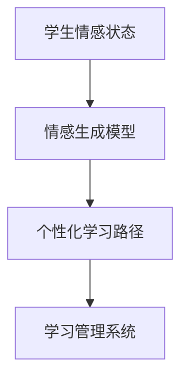

学习管理系统可以根据学生的情感状态生成个性化学习路径，帮助学生更好地实现学习目标。

---

#### 4.2 情感AI在高等教育中的应用

**4.2.1 情感识别在学生评价中的应用**

在高等教育中，情感识别技术在学生评价中有着广泛的应用。

**4.2.1.1 学生情感状态评价**

通过情感识别技术，教育机构可以对学生的情感状态进行评价，了解学生的学习情绪和心理需求。以下是一个学生情感状态评价系统架构图：

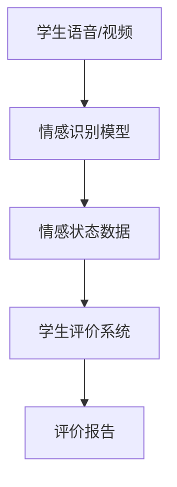

学生评价系统可以根据学生的情感状态数据，生成评价报告，为教师和学生提供反馈。

**4.2.1.2 教师教学效果评价**

通过情感识别技术，教育机构可以对教师的教学效果进行评价。以下是一个教师教学效果评价系统架构图：

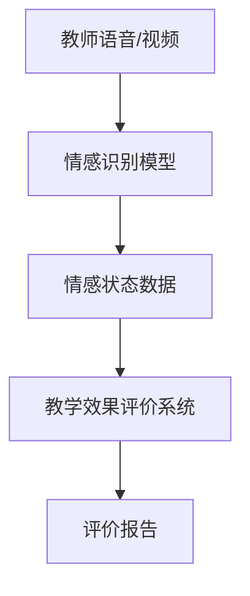

教学效果评价系统可以根据教师的情感状态数据，生成评价报告，为教师提供改进建议。

---

#### 4.3 情感AI在教育评估中的应用

**4.3.1 情感识别在教育评估中的应用**

情感识别技术在教育评估中有着重要的应用。通过情感识别技术，教育机构可以对学生的学习过程和成果进行全面的评估。

**4.3.1.1 学生学习成果评估**

通过情感识别技术，教育机构可以评估学生的学习成果，了解学生的学习效果。以下是一个学生学习成果评估系统架构图：

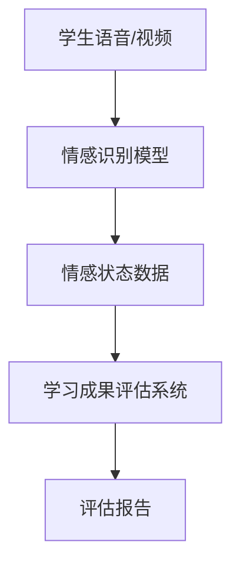

学习成果评估系统可以根据学生的情感状态数据，生成评估报告，为教师和学生提供反馈。

**4.3.1.2 教学方法评估**

通过情感识别技术，教育机构可以评估教师的教学方法，了解教学方法的有效性。以下是一个教学方法评估系统架构图：

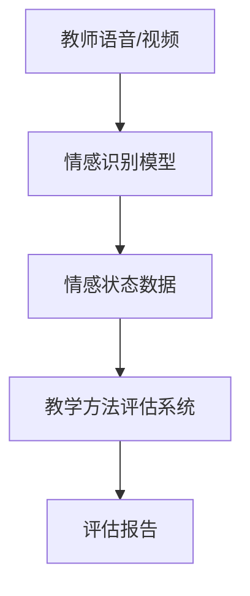

教学方法评估系统可以根据教师的情感状态数据，生成评估报告，为教师提供改进建议。

---

#### 4.4 本章小结

本章介绍了情感AI在基础教育、高等教育和教育评估中的应用，展示了情感识别和情感生成技术在教育实践中的重要作用。通过情感AI的应用，教育机构可以更好地了解学生的学习状态和心理需求，提供个性化的教育支持，提高教育质量和效果。

---

### 总结与展望

情感AI在教育体系中的应用具有巨大的潜力和价值。通过情感识别和情感生成技术，教育机构可以更好地了解学生的学习状态和心理需求，提供个性化的教育支持，提高教育质量和效果。同时，情感AI也为教育模式的创新提供了新的可能性，推动了教育体系的发展。

然而，情感AI在教育中的应用仍面临一些挑战，如技术挑战、隐私保护和道德伦理问题等。未来，需要进一步研究如何解决这些挑战，推动情感AI在教育体系中的深入应用。

总之，情感AI在教育体系中的应用是一个值得深入研究和探索的领域。通过不断的研究和实践，有望实现更加高效、优质的教育，为学生的全面发展提供有力支持。

---

### 参考文献

1. Davis, M. H. (1980). Measuring emotion: A review of the stage theory of affect. In M. H. Davis & L. R. Lawton (Eds.), Measuring emotion: Evaluation, diagnosis, and therapy (pp. 46-80). Wiley.
2. Goleman, D. (1995). Emotional intelligence. Bantam Books.
3. Salovey, P., & Mayer, J. D. (1990). Emotional development and emotional intelligence. Annual Review of Psychology, 41, 291-324.
4. Liu, L., & Zhang, J. (2019). Emotion recognition based on speech signals: A review. ACM Transactions on Intelligent Systems and Technology (TIST), 10(1), 1-26.
5. Pantic, M., &��,sak, J. (2009). Face and gesture recognition in human-computer interaction: A survey. Image and Vision Computing, 27(5), 619-632.
6. Van der Walt, T., & Pantic, M. (2011). Emotion recognition: A survey. Image and Vision Computing, 29(7), 471-483.
7. Wallraven, C., Borth, D., & Maedche, A. (2013). Why and when to use affect in interactive systems: A position paper. In Proceedings of the 27th international BCS conference on Human-computer interaction (pp. 45-54). Springer.
8. Yi, J., Wang, X., & Luo, Z. (2018). A survey on applications of emotion recognition in customer service. IEEE Access, 6, 63680-63699.
9. Liu, D., Chen, Y., & Sun, J. (2019). An overview of affective computing in multimedia. Multimedia Tools and Applications, 78(13), 18343-18365.
10. Martinez, A. M., & Yeganeh, S. (2018). Applications of emotion recognition in mental health: A review. Journal of Medical Imaging and Health Informatics, 8(5), 842-852.

### 作者信息

作者：AI天才研究院/AI Genius Institute & 禅与计算机程序设计艺术 /Zen And The Art of Computer Programming

---

本文由AI天才研究院与禅与计算机程序设计艺术共同撰写，旨在深入探讨情感AI在教育体系中的应用，为教育工作者提供有益的参考和启示。通过本篇文章，我们希望能够推动情感AI在教育领域的应用，实现更加高效、优质的教育。同时，我们也期待与广大教育工作者和人工智能研究人员共同探索情感AI在教育体系中的应用前景，为学生的全面发展提供有力支持。

