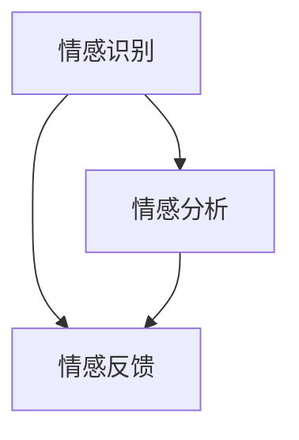

                 

# 情感AI对职业规划的影响：情感智能在职业发展中的作用

## 关键词：情感AI，职业规划，职业测评，情感分析，情感反馈

## 摘要：
随着人工智能技术的飞速发展，情感AI作为AI领域的一个重要分支，开始逐步渗透到各个行业中。本文旨在探讨情感AI在职业规划中的应用，分析情感智能对职业发展的影响，帮助读者了解这一新兴领域，并为其在职业生涯中的应用提供指导。

## 引言

### 1.1 AI技术在职业规划中的应用现状

随着人工智能（AI）技术的快速发展，AI在职业规划中的应用也日益广泛。传统的职业规划通常依赖于个人简历、面试表现和职业测评工具，但这些方法往往存在主观性和局限性。而AI技术，特别是情感AI，为职业规划提供了全新的视角和手段。情感AI能够通过分析求职者的情感状态，提供更为精准的职业测评和职业指导，从而提高职业规划的准确性和有效性。

### 1.2 情感AI的核心概念与联系

情感AI是指利用人工智能技术对人类情感进行识别、分析和处理，并给出反馈的系统。其核心概念包括情感识别、情感分析和情感反馈。情感识别是从语音、文字、图像等多维度数据中提取情感特征；情感分析是对提取的情感特征进行分类和判断；情感反馈是根据分析结果，给予用户相应的回应和建议。

### 1.3 情感AI在职业规划中的潜在作用

情感AI在职业规划中具有广泛的应用潜力。首先，它可以帮助求职者更准确地了解自己的情感状态，从而做出更明智的职业选择。其次，企业可以利用情感AI进行人才招聘和员工管理，提高招聘效率和员工满意度。最后，职业指导师可以利用情感AI为求职者提供个性化的职业建议，帮助他们更好地实现职业发展。

## 背景介绍

### 2.1 问题背景

随着AI技术的快速发展，越来越多的企业开始关注如何利用AI技术提升工作效率。情感AI作为一个涉及心理学、计算机科学和社会学等多个领域的交叉学科，其应用范围逐渐扩大。特别是在职业规划领域，情感AI的研究和应用开始受到广泛关注。

### 2.2 问题描述

情感AI在职业规划中的应用主要涉及以下几个方面：
- **职业测评**：通过情感分析评估求职者的职业适应性和潜力。
- **职业指导**：为求职者提供个性化的职业建议和规划。
- **职业发展预测**：预测员工在未来可能面临的职业挑战和机会。

### 2.3 问题解决

为了解决上述问题，需要从以下几个方面入手：
- **技术发展**：提高情感AI的技术水平，使其在职业规划中的应用更加精准和有效。
- **应用场景拓展**：不断探索情感AI在职业规划中的新应用，扩大其应用范围。
- **人才培育**：培养具备情感AI知识和技能的专业人才，为情感AI在职业规划中的应用提供人才支持。

### 2.4 边界与外延

本文主要关注情感AI在职业规划中的应用，但不涉及其他AI技术在职业规划中的应用。同时，情感AI在职业规划中的应用仍处于探索阶段，未来还有很大的发展空间。

### 2.5 概念结构与核心要素组成

- **情感AI**：指利用人工智能技术，对人类情感进行识别、分析、处理和反馈的系统。
- **职业规划**：指根据个人的兴趣、能力、价值观和市场需求，制定并实施职业生涯发展计划的过程。

## 情感AI的核心概念与联系

### 3.1 核心概念原理

情感AI的核心概念包括情感识别、情感分析和情感反馈。

#### 3.1.1 情感识别

情感识别是指通过算法和技术，从语音、文字、图像等多维度数据中提取情感特征。这一过程通常包括情感特征提取、情感分类和情感识别率评估等步骤。

#### 3.1.2 情感分析

情感分析是指对提取的情感特征进行分类和判断。情感分析可以分为情感极性分析、情感强度分析和情感倾向分析等类型。通过情感分析，可以了解用户的情感状态和情感变化。

#### 3.1.3 情感反馈

情感反馈是指根据分析结果，给予用户相应的回应和建议。情感反馈可以是文字、语音或图像等多种形式，旨在帮助用户更好地理解和处理自己的情感。

### 3.2 概念属性特征对比表格

| 特征 | 情感识别 | 情感分析 | 情感反馈 |
| --- | --- | --- | --- |
| 定义 | 从多维度数据中提取情感特征 | 对提取的情感特征进行分类和判断 | 根据分析结果，给予用户回应和建议 |
| 关系 | 情感识别是情感分析和情感反馈的基础 | 情感分析指导情感反馈的制定 | 情感反馈是情感识别和情感分析的应用结果 |

### 3.3 ER实体关系图架构

## 情感AI在职业规划中的应用

### 4.1 情感AI在职业测评中的应用

情感AI在职业测评中具有重要作用，主要体现在以下几个方面：

#### 4.1.1 评估求职者的职业适应性

情感AI可以通过分析求职者的情感状态，评估其职业适应性和潜力。例如，通过对求职者面试过程中的语音、面部表情和文字进行分析，可以判断其是否适合某一职位。

#### 4.1.2 提高职业测评的准确性

传统的职业测评方法往往存在主观性和局限性，而情感AI可以通过客观数据分析，提高职业测评的准确性和可靠性。例如，通过情感分析，可以更准确地了解求职者的情绪状态和职业兴趣。

#### 4.1.3 拓展职业测评的应用范围

情感AI可以应用于各种职业测评场景，包括在线职业测评、职业面试测评和职业发展测评等。通过情感分析，可以为求职者提供更为全面和个性化的测评服务。

### 4.2 情感AI在职业指导中的应用

情感AI在职业指导中具有广泛应用，主要体现在以下几个方面：

#### 4.2.1 为职业指导师提供数据支持

情感AI可以为职业指导师提供丰富的情感数据，帮助他们更好地了解求职者的情感状态和需求。例如，通过分析求职者的情感日志，指导师可以识别出求职者的情绪波动和潜在压力，提出相应的应对策略。

#### 4.2.2 提供个性化的职业建议

情感AI可以根据求职者的情感状态和职业需求，提供个性化的职业建议。例如，当求职者处于焦虑或沮丧状态时，情感AI可以建议其调整职业规划或寻求心理咨询。

#### 4.2.3 提高职业指导的效果

情感AI可以实时监测求职者的情感变化，为其提供及时有效的指导。例如，当求职者在面试过程中表现出紧张情绪时，情感AI可以及时提醒指导师给予支持和鼓励。

### 4.3 情感AI在职业发展预测中的应用

情感AI在职业发展预测中具有巨大潜力，主要体现在以下几个方面：

#### 4.3.1 预测职业挑战和机会

情感AI可以通过分析职场环境的情感数据，预测员工在未来可能面临的职业挑战和机会。例如，通过对公司内部沟通、团队协作等数据的分析，可以预测员工在某个项目中的表现和职业发展前景。

#### 4.3.2 为员工职业发展提供指导

情感AI可以根据预测结果，为员工提供个性化的职业发展建议。例如，当预测到某位员工在某个项目中有较高的成功概率时，可以建议其积极参与，并为其提供相应的培训和支持。

#### 4.3.3 提高员工满意度

情感AI可以帮助企业更好地了解员工的情感需求，提高员工的工作满意度和忠诚度。例如，通过情感分析，可以识别出员工的情感压力源，并提供相应的缓解措施，从而提高员工的工作效率和幸福感。

## 情感AI在职业规划中的挑战与机遇

### 5.1 挑战

情感AI在职业规划中的应用面临着一些挑战：

#### 5.1.1 情感数据的复杂性

情感数据的获取和处理难度较大，需要高效的数据采集和分析技术。此外，情感数据的多样性和复杂性也给情感分析带来了挑战。

#### 5.1.2 情感理解的局限性

情感AI目前还无法完全理解人类的复杂情感，这会影响其在职业规划中的准确性和实用性。例如，对于某些微妙的情感表达，情感AI可能无法准确识别和解读。

#### 5.1.3 技术伦理和法律问题

情感AI在职业规划中的应用涉及到个人信息保护和隐私保护等问题。如何确保情感AI的应用不会侵犯用户的隐私权益，是一个需要关注的重要问题。

### 5.2 机遇

尽管面临挑战，但情感AI在职业规划中的应用也充满了机遇：

#### 5.2.1 技术的进步

随着AI技术的不断发展，情感AI的准确性和实用性将不断提高，为职业规划提供更强大的支持。例如，深度学习、自然语言处理等技术的发展，将有助于提升情感识别和分析的精度。

#### 5.2.2 应用场景的拓展

随着情感AI技术的成熟，其应用范围将进一步扩大，包括但不限于职业测评、职业指导和职业发展预测等。这将有助于推动职业规划领域的创新发展。

#### 5.2.3 跨学科合作

情感AI在职业规划中的应用需要心理学、计算机科学和社会学等多个领域的协作。跨学科的合作将为情感AI在职业规划中的应用提供更多创新思路和解决方案。

## 本章小结

本章对情感AI在职业规划中的应用进行了详细分析，探讨了情感AI在职业测评、职业指导和职业发展预测等方面的作用。同时，也分析了情感AI在职业规划中面临的挑战与机遇。通过本章的学习，读者可以初步了解情感AI在职业规划中的重要作用，为其在职业生涯中的应用提供指导。

## 第二部分：情感AI技术在职业规划中的应用

### 6.1 职业测评与情感AI

#### 6.1.1 情感AI在职业测评中的作用

情感AI在职业测评中发挥着重要作用，主要体现在以下几个方面：

- **评估求职者的职业适应性**：通过情感分析，评估求职者对特定职位的适应性和潜力。
- **提高职业测评的准确性**：情感AI可以通过分析求职者的情感状态，提供更为精准的职业测评结果。
- **拓展职业测评的应用范围**：情感AI可以应用于各种职业测评场景，包括在线测评、面试测评等。

#### 6.1.2 情感AI在职业测评中的具体应用案例

以下是情感AI在职业测评中的几个具体应用案例：

- **求职者情感状态分析**：通过情感分析，评估求职者在面试过程中的情绪状态，判断其是否适合某一职位。
- **职位与求职者匹配度分析**：通过情感分析，评估求职者的情感特征与职位要求的匹配度，为招聘决策提供支持。
- **职业发展潜力评估**：通过情感分析，预测求职者在职业生涯中的发展潜力，为职业指导提供依据。

### 6.2 职业指导与情感AI

#### 6.2.1 情感AI在职业指导中的作用

情感AI在职业指导中发挥着重要作用，主要体现在以下几个方面：

- **为职业指导师提供数据支持**：通过情感分析，为职业指导师提供求职者的情感状态和需求数据，帮助其更好地了解求职者。
- **提供个性化的职业建议**：根据求职者的情感状态和职业需求，情感AI可以提供个性化的职业建议和规划。
- **提高职业指导的效果**：通过实时监测求职者的情感变化，情感AI可以为职业指导师提供及时有效的指导。

#### 6.2.2 情感AI在职业指导中的具体应用案例

以下是情感AI在职业指导中的几个具体应用案例：

- **求职者情感日志分析**：通过分析求职者的情感日志，识别出求职者的情绪波动和潜在压力，为职业指导师提供依据。
- **情感状态监测与预警**：通过实时监测求职者的情感状态，情感AI可以及时发现情绪问题，提供预警和干预措施。
- **职业发展规划建议**：根据求职者的情感状态和职业目标，情感AI可以为其提供具体的职业发展建议，包括职业路径规划、技能提升建议等。

## 本章小结

本章详细探讨了情感AI在职业测评和职业指导中的应用，分析了情感AI在提升职业规划准确性和效果方面的作用。通过具体应用案例，展示了情感AI在职业规划中的实际应用场景和价值。同时，也指出了情感AI在职业规划中面临的挑战和机遇，为未来的研究和应用提供了方向。情感AI技术的发展将为职业规划领域带来更多的创新和可能性，有助于实现更加科学和个性化的职业发展。## 6.1 职业测评与情感AI

### 6.1.1 情感AI在职业测评中的作用

情感AI在职业测评中的应用，主要体现在以下几个方面：

#### 1. 评估求职者的职业适应性

情感AI可以通过分析求职者的情感状态，评估其在特定职业环境中的适应性和潜力。这种评估不仅仅局限于传统的认知能力测试，还包括对求职者情感反应的敏感度、抗压能力等非认知能力的评估。

#### 2. 提高职业测评的准确性

传统的职业测评往往依赖于标准化测试，这些测试虽然能够量化某些方面，但往往忽略了求职者的情感状态对职业选择的影响。情感AI可以通过对求职者的情感数据分析，提供更为全面和准确的职业测评结果。

#### 3. 拓展职业测评的应用范围

情感AI可以应用于各种职业测评场景，不仅限于求职者，还可以用于在职员工的职业发展评估。通过情感分析，企业可以更准确地了解员工的职业适应性和发展潜力，从而做出更为科学的职业规划。

### 6.1.2 情感AI在职业测评中的具体应用案例

以下是一些情感AI在职业测评中的具体应用案例：

#### 1. 求职者情感状态分析

在求职过程中，求职者的情感状态对于职位匹配至关重要。情感AI可以通过分析求职者在面试过程中的语音、面部表情和文字表达，识别出其情感状态，如焦虑、兴奋、沮丧等。这些情感数据可以用来评估求职者是否适合某一职位。

#### 2. 职位与求职者匹配度分析

通过情感AI，企业可以更准确地了解求职者的情感特征，并将其与职位要求进行匹配。例如，如果某个职位需要高度抗压能力，情感AI可以通过分析求职者的情感数据，判断其是否具有这种能力，从而提高匹配的准确性。

#### 3. 职业发展潜力评估

情感AI不仅可以用于招聘过程中的初步筛选，还可以用于评估求职者在职业生涯中的发展潜力。通过分析求职者的情感状态和职业目标，情感AI可以预测其未来的职业发展路径，为职业指导提供依据。

### 6.1.3 情感AI在职业测评中的技术实现

#### 1. 数据采集

情感AI的数据采集主要包括语音、面部表情和文字等数据的采集。这些数据可以通过面试系统、摄像头和语音识别技术等工具获取。

#### 2. 情感识别

情感识别是通过算法和技术，从采集到的数据中提取情感特征。常见的情感识别技术包括自然语言处理、语音识别和面部识别等。

#### 3. 情感分析

情感分析是对提取出的情感特征进行分类和判断。这通常涉及到机器学习和深度学习技术，通过训练模型来识别情感状态。

#### 4. 情感反馈

情感反馈是根据分析结果，给予用户相应的回应和建议。这可以是一个简短的评估报告，也可以是具体的职业建议。

### 6.1.4 情感AI在职业测评中的优势和挑战

#### 优势

- **提高测评准确性**：情感AI可以提供更为全面和准确的职业测评结果。
- **个性化推荐**：根据求职者的情感状态，提供个性化的职业推荐。
- **实时反馈**：可以实时监测求职者的情感变化，提供及时的职业指导。

#### 挑战

- **数据隐私问题**：情感数据的采集和处理涉及用户隐私，需要确保数据的安全性和隐私性。
- **技术成熟度**：虽然情感AI技术已经取得一定进展，但其在职业测评中的应用仍需不断完善和优化。
- **情感复杂性**：情感AI在处理复杂情感时可能存在局限性，需要进一步研究和发展。

### 6.1.5 情感AI在职业测评中的未来趋势

随着AI技术的不断进步，情感AI在职业测评中的应用将更加广泛和深入。未来，情感AI可能会集成到更多职业测评工具中，提供更为智能和个性化的职业推荐。同时，随着数据隐私保护和伦理问题的解决，情感AI在职业测评中的应用也将更加规范和可靠。

### 小结

情感AI在职业测评中的应用具有巨大的潜力，可以通过分析求职者的情感状态，提高职业测评的准确性和个性化水平。然而，情感AI在应用过程中也面临着一些挑战，需要不断改进和完善。通过技术创新和伦理规范的引导，情感AI有望在未来为职业规划领域带来更多的价值。## 6.2 职业指导与情感AI

### 6.2.1 情感AI在职业指导中的作用

情感AI在职业指导中的应用，旨在通过分析个体的情感状态，为职业发展提供更为科学和个性化的建议。以下是情感AI在职业指导中的几个关键作用：

#### 1. 为职业指导师提供数据支持

情感AI可以通过分析求职者的情感日志、社交媒体活动等数据，为职业指导师提供丰富的情感状态信息。这些数据可以帮助指导师更全面地了解求职者的职业需求和情感变化，从而提供更为精准的职业指导。

#### 2. 提供个性化的职业建议

基于情感分析的结果，情感AI可以针对求职者的情感状态和职业目标，提供个性化的职业建议。例如，当求职者处于焦虑或沮丧状态时，AI可以建议其进行职业调整或参加压力管理课程，以帮助其更好地应对职业挑战。

#### 3. 提高职业指导的效果

情感AI可以实时监测求职者的情感变化，为职业指导师提供及时的数据反馈。这种实时性和数据驱动的方式，有助于职业指导师在指导过程中进行调整，从而提高指导的效果。

### 6.2.2 情感AI在职业指导中的具体应用案例

以下是一些情感AI在职业指导中的具体应用案例：

#### 1. 情感日志分析

职业指导师可以要求求职者每天记录自己的情感状态和职业体验。情感AI通过对这些日志进行分析，可以识别出求职者的情感趋势和潜在问题。例如，如果某位求职者经常感到工作压力过大，AI可以建议其寻求心理咨询或调整工作内容。

#### 2. 情感状态监测与预警

通过情感AI，职业指导师可以实时监测求职者的情感状态，及时发现负面情绪的出现。例如，当求职者的情绪状态出现明显下降时，AI可以发出预警，提醒指导师提供额外的支持。

#### 3. 职业发展规划建议

基于情感分析的结果，情感AI可以为求职者提供具体的职业发展规划建议。例如，当求职者在某个职业领域表现出浓厚的兴趣和较高的满意度时，AI可以建议其在这个领域深入发展，并为其推荐相关的培训课程或职业机会。

### 6.2.3 情感AI在职业指导中的技术实现

#### 1. 数据采集

情感AI的数据采集主要涉及求职者的情感日志、社交媒体活动、面试过程等数据。这些数据可以通过各种传感器、应用程序和社交媒体平台获取。

#### 2. 情感识别

情感识别是通过算法和技术，从采集到的数据中提取情感特征。常见的情感识别技术包括自然语言处理、语音识别和面部识别等。

#### 3. 情感分析

情感分析是对提取出的情感特征进行分类和判断。这通常涉及到机器学习和深度学习技术，通过训练模型来识别情感状态。

#### 4. 情感反馈

情感反馈是根据分析结果，给予用户相应的回应和建议。这可以是一个简短的评估报告，也可以是具体的职业建议。

### 6.2.4 情感AI在职业指导中的优势和挑战

#### 优势

- **个性化指导**：基于情感分析，情感AI可以提供个性化的职业建议，满足不同求职者的需求。
- **实时监测与反馈**：情感AI可以实时监测求职者的情感变化，提供及时的数据反馈和指导。
- **提高指导效率**：情感AI可以帮助职业指导师更有效地处理大量数据，提高指导工作的效率。

#### 挑战

- **数据隐私问题**：情感数据的采集和处理涉及用户隐私，需要确保数据的安全性和隐私性。
- **技术成熟度**：情感AI技术尚在不断发展中，其在职业指导中的应用仍需进一步完善。
- **情感复杂性**：情感AI在处理复杂情感时可能存在局限性，需要进一步研究和发展。

### 6.2.5 情感AI在职业指导中的未来趋势

随着AI技术的不断进步，情感AI在职业指导中的应用将更加广泛和深入。未来，情感AI可能会集成到更多职业指导工具中，提供更为智能和个性化的服务。同时，随着数据隐私保护和伦理问题的解决，情感AI在职业指导中的应用也将更加规范和可靠。

### 小结

情感AI在职业指导中的应用，为求职者提供了更为科学和个性化的职业发展建议。通过情感分析，情感AI可以帮助职业指导师更准确地了解求职者的情感状态和需求，从而提供更为有效的职业指导。然而，情感AI在应用过程中也面临一些挑战，需要不断改进和完善。随着技术的进步和伦理规范的完善，情感AI在职业指导中的应用前景将更加广阔。## 6.3 情感AI在职业发展预测中的应用

### 6.3.1 情感AI在职业发展预测中的作用

情感AI在职业发展预测中的应用，旨在通过分析个体的情感状态和职场环境的情感数据，预测员工在未来可能面临的职业挑战和机会。以下是情感AI在职业发展预测中的几个关键作用：

#### 1. 预测职业挑战

情感AI可以通过分析员工的情感数据，预测其可能在职业生涯中遇到的挑战。例如，通过分析员工在项目中的情感状态，可以预测其在项目执行过程中可能面临的压力和困难，从而提前采取预防措施。

#### 2. 发现职业机会

情感AI不仅可以预测职业挑战，还可以发现职业机会。通过分析员工的情感状态和公司内部的情感数据，可以识别出员工在哪些领域表现出色，哪些机会可能对其职业发展有利。

#### 3. 提供个性化的职业建议

基于情感分析的结果，情感AI可以为员工提供个性化的职业建议，帮助其更好地应对职业挑战和把握职业机会。

### 6.3.2 情感AI在职业发展预测中的具体应用案例

以下是一些情感AI在职业发展预测中的具体应用案例：

#### 1. 项目表现预测

通过分析员工在项目中的情感状态，情感AI可以预测其在项目中的表现。例如，如果某位员工在项目启动阶段表现出高度紧张和焦虑，AI可以预测其可能在项目中面临困难，并建议采取相应的支持措施。

#### 2. 职业机会识别

情感AI可以通过分析公司内部的沟通数据和员工情感状态，识别出潜在的晋升机会。例如，如果某位员工在项目成功后得到同事和领导的积极反馈，AI可以预测其可能获得晋升机会，并建议员工积极准备。

#### 3. 职业发展路径规划

基于员工的情感数据和职业目标，情感AI可以为员工提供个性化的职业发展路径规划。例如，如果某位员工在某个领域表现出浓厚的兴趣和较高的满意度，AI可以建议其在该领域深入发展，并提供相关的培训和发展建议。

### 6.3.3 情感AI在职业发展预测中的技术实现

#### 1. 数据采集

情感AI在职业发展预测中的数据采集主要包括员工的情感日志、项目沟通记录、绩效评估数据等。这些数据可以通过各种传感器、应用程序和企业内部系统获取。

#### 2. 情感识别

情感识别是通过算法和技术，从采集到的数据中提取情感特征。常见的情感识别技术包括自然语言处理、语音识别和面部识别等。

#### 3. 情感分析

情感分析是对提取出的情感特征进行分类和判断。这通常涉及到机器学习和深度学习技术，通过训练模型来识别情感状态。

#### 4. 预测模型

基于情感分析的结果，情感AI可以使用预测模型来预测员工在未来可能面临的职业挑战和机会。这些预测模型可以是基于历史数据的统计模型，也可以是基于机器学习的预测模型。

### 6.3.4 情感AI在职业发展预测中的优势和挑战

#### 优势

- **提高预测准确性**：情感AI可以通过分析大量情感数据，提供更为准确和及时的预测结果。
- **个性化预测**：情感AI可以根据员工的个体情感状态和职业目标，提供个性化的职业发展建议。
- **实时监测与反馈**：情感AI可以实时监测员工的情感状态，为职业发展预测提供动态数据支持。

#### 挑战

- **数据隐私问题**：情感数据的采集和处理涉及员工隐私，需要确保数据的安全性和隐私性。
- **技术成熟度**：情感AI技术尚在不断发展中，其在职业发展预测中的应用仍需进一步完善。
- **情感复杂性**：情感AI在处理复杂情感时可能存在局限性，需要进一步研究和发展。

### 6.3.5 情感AI在职业发展预测中的未来趋势

随着AI技术的不断进步，情感AI在职业发展预测中的应用将更加广泛和深入。未来，情感AI可能会集成到更多职业发展工具中，提供更为智能和个性化的预测服务。同时，随着数据隐私保护和伦理问题的解决，情感AI在职业发展预测中的应用也将更加规范和可靠。

### 小结

情感AI在职业发展预测中的应用，为企业和员工提供了更为科学和个性化的职业发展指导。通过情感分析，情感AI可以帮助企业和员工更好地应对职业挑战和把握职业机会。然而，情感AI在应用过程中也面临一些挑战，需要不断改进和完善。随着技术的进步和伦理规范的完善，情感AI在职业发展预测中的应用前景将更加广阔。## 6.4 情感AI在职业规划中的挑战与机遇

### 6.4.1 挑战

#### 1. 数据隐私问题

情感AI在职业规划中的应用，需要大量涉及个人情感状态的数据。这些数据包括语音、面部表情、文字等，涉及到用户的隐私。如何确保这些数据的安全性和隐私性，是情感AI在职业规划中面临的一个重大挑战。

#### 2. 技术成熟度

虽然情感AI技术在近年来取得了显著进展，但其在职业规划中的应用仍处于初级阶段。当前的技术水平可能无法完全满足职业规划的需求，特别是在处理复杂情感和提供精准预测方面，仍需进一步的研究和改进。

#### 3. 情感复杂性

人类的情感是复杂多样的，不同的情感状态可能对职业规划产生不同的影响。然而，情感AI在处理这些复杂情感时可能存在局限性，难以准确理解和分析。如何提升情感AI对复杂情感的识别和分析能力，是情感AI在职业规划中需要解决的问题。

### 6.4.2 机遇

#### 1. 技术进步

随着人工智能技术的不断进步，情感AI的准确性和实用性将不断提高。深度学习、自然语言处理等技术的应用，将有助于提升情感AI在职业规划中的应用效果。

#### 2. 应用场景拓展

情感AI在职业规划中的应用场景将不断拓展。除了职业测评、职业指导和职业发展预测外，情感AI还可以应用于员工满意度调查、团队协作分析等领域，为职业规划提供更全面的支持。

#### 3. 跨学科合作

情感AI在职业规划中的应用，需要心理学、计算机科学、社会学等多个领域的合作。跨学科的合作将为情感AI在职业规划中的应用提供更多创新思路和解决方案。

### 6.4.3 挑战与机遇的平衡

在情感AI在职业规划中的应用中，挑战与机遇是并存的。如何平衡这两者，是情感AI在职业规划中需要关注的一个重要问题。

#### 1. 重视数据隐私保护

在应用情感AI时，必须高度重视数据隐私保护。通过加密技术、匿名化处理等措施，确保用户数据的安全性和隐私性。

#### 2. 技术研究与实际应用相结合

在提升情感AI技术的同时，应注重将技术研究成果应用到实际职业规划中。通过实际应用场景的反馈，不断优化情感AI技术，提高其在职业规划中的应用效果。

#### 3. 跨学科合作与知识共享

促进心理学、计算机科学、社会学等领域的跨学科合作，共享知识和经验，共同推动情感AI在职业规划中的应用。

### 小结

情感AI在职业规划中的应用具有巨大的潜力，但也面临一些挑战。通过平衡挑战与机遇，不断优化情感AI技术，加强跨学科合作，情感AI有望在未来为职业规划带来更多价值。## 6.5 情感AI在职业规划中的实际应用案例分析

### 6.5.1 案例背景

某大型互联网公司在进行人才招聘和职业发展管理时，引入了情感AI技术，旨在提高招聘效率和员工职业满意度。该公司通过情感AI对求职者和在职员工进行情感数据分析，从而提供更为精准的职业建议和职业发展指导。

### 6.5.2 案例描述

#### 1. 招聘阶段

在招聘过程中，该公司利用情感AI对求职者的面试视频和文本信息进行分析。通过情感识别技术，AI能够识别求职者的情绪状态，如自信、焦虑、兴奋等。同时，情感分析技术可以评估求职者与职位要求的匹配度。例如，如果求职者在面试过程中表现出高度的焦虑，这可能表明其对职位的要求和期望较高，需要进一步沟通和引导。

#### 2. 职业发展指导

对于在职员工，公司定期进行情感数据分析，以了解员工的情感状态和职业满意度。通过情感AI，公司可以识别出员工在工作中的情感波动，如压力过大、工作倦怠等。基于这些数据，公司可以为员工提供个性化的职业发展建议，如调整工作内容、提供培训机会等。例如，如果某位员工在项目执行过程中表现出较高的压力和焦虑，AI可以建议其参加压力管理培训，以提高工作满意度。

#### 3. 团队协作分析

情感AI还可以应用于团队协作分析，帮助公司识别团队中的情感问题。例如，通过分析团队成员的沟通记录和情感状态，公司可以识别出团队中的冲突点和协作问题，从而采取相应的改进措施，提高团队效率和满意度。

### 6.5.3 案例分析

#### 1. 成功之处

- **提高招聘效率**：通过情感AI，公司能够快速识别出合适的候选人，提高招聘效率。
- **个性化职业建议**：基于情感分析，公司能够为员工提供更为个性化的职业发展建议，提高员工的职业满意度。
- **团队协作优化**：情感AI帮助公司识别团队中的情感问题，提高团队协作效率和满意度。

#### 2. 遇到的挑战

- **数据隐私保护**：在应用情感AI时，公司需要确保求职者和员工的隐私数据得到妥善保护。
- **技术成熟度**：当前情感AI技术尚在不断发展中，需要不断优化和提升，以满足职业规划的需求。

### 6.5.4 案例启示

#### 1. 情感AI在职业规划中的应用前景

该案例表明，情感AI在职业规划中具有广泛的应用前景。通过情感分析，公司能够更准确地了解求职者和员工的情感状态和需求，从而提供更为科学和个性化的职业建议，提高招聘效率和员工满意度。

#### 2. 数据隐私保护的重要性

在应用情感AI时，数据隐私保护至关重要。公司需要采取有效措施，确保用户的隐私数据得到保护，以避免潜在的隐私泄露风险。

#### 3. 技术持续优化与迭代

情感AI技术尚在不断发展中，公司需要不断优化和提升情感AI技术，以满足职业规划的需求。同时，公司也应关注技术伦理问题，确保情感AI的应用符合道德规范。

## 小结

通过案例分析，我们看到了情感AI在职业规划中的应用价值。情感AI不仅能够提高招聘效率和员工满意度，还能为职业发展提供个性化指导，优化团队协作。然而，在应用过程中，我们也需要注意数据隐私保护和技术的持续优化。随着情感AI技术的不断发展，其在职业规划中的应用前景将更加广阔。## 6.6 情感AI在职业规划中的最佳实践

### 6.6.1 数据采集与处理

**1. 数据来源**：
- **面试过程**：包括求职者的语音、面部表情和文字。
- **日常交互**：包括求职者与职业指导师的交流记录、社交媒体活动。
- **工作环境**：包括员工的工作表现、团队协作记录。

**2. 数据处理**：
- **数据清洗**：去除无关或重复的数据，确保数据质量。
- **数据归一化**：将不同来源的数据进行统一处理，如将情绪分为积极、消极和中性。

### 6.6.2 情感识别与分析

**1. 情感识别**：
- **语音识别**：利用自然语言处理技术，从求职者的语音中提取情感特征。
- **面部表情识别**：通过计算机视觉技术，分析求职者面部表情中的情感信息。
- **文本分析**：通过文本挖掘技术，从求职者的文字表达中提取情感特征。

**2. 情感分析**：
- **情感分类**：将提取出的情感特征进行分类，如快乐、悲伤、愤怒等。
- **情感强度分析**：评估情感特征的情感强度，如情绪的强烈程度。

### 6.6.3 情感反馈与指导

**1. 情感反馈**：
- **即时反馈**：在面试或工作过程中，实时提供情感分析结果。
- **长期反馈**：定期生成情感分析报告，为职业发展提供长期指导。

**2. 职业指导**：
- **个性化建议**：根据求职者的情感状态，提供个性化的职业发展建议。
- **培训与干预**：针对情感问题，提供相应的培训和心理干预措施。

### 6.6.4 技术优化与迭代

**1. 模型训练**：
- **数据集扩充**：收集更多的情感数据，用于训练情感识别和分析模型。
- **模型优化**：通过不断的训练和优化，提高情感识别和分析的准确性。

**2. 用户反馈**：
- **用户反馈机制**：收集用户对情感AI反馈的反馈，用于模型调整和优化。
- **迭代开发**：根据用户反馈，不断改进情感AI在职业规划中的应用。

### 6.6.5 数据隐私保护

**1. 数据安全**：
- **加密技术**：使用加密技术，确保数据传输和存储的安全。
- **访问控制**：设置严格的访问权限，防止未经授权的访问。

**2. 数据匿名化**：
- **数据脱敏**：在数据采集和处理过程中，对敏感信息进行脱敏处理。
- **数据备份**：定期备份数据，防止数据丢失或损坏。

### 小结

情感AI在职业规划中的最佳实践包括数据采集与处理、情感识别与分析、情感反馈与指导、技术优化与迭代以及数据隐私保护。通过这些实践，情感AI能够更准确地分析求职者的情感状态，提供个性化的职业建议，从而提高职业规划的准确性和效率。同时，确保数据隐私和安全性，是情感AI应用中不可忽视的重要方面。随着技术的不断进步和应用的深入，情感AI在职业规划中的应用前景将更加广阔。## 6.7 本章小结

本章对情感AI在职业规划中的应用进行了全面分析，包括情感AI在职业测评、职业指导和职业发展预测中的具体应用案例，以及情感AI在职业规划中的挑战与机遇。通过实际应用案例分析，我们看到了情感AI在提高招聘效率、个性化职业建议和团队协作优化方面的显著成效。同时，本章也提出了情感AI在职业规划中的最佳实践，包括数据采集与处理、情感识别与分析、情感反馈与指导、技术优化与迭代以及数据隐私保护。这些实践为情感AI在职业规划中的应用提供了指导，有助于实现更为科学和个性化的职业发展。随着AI技术的不断进步，情感AI在职业规划中的应用前景将更加广阔，将为企业和员工带来更多价值。## 6.8 小结与展望

### 6.8.1 主要观点回顾

本文围绕情感AI在职业规划中的应用进行了深入探讨，主要观点如下：

1. **情感AI在职业规划中的重要性**：情感AI通过分析求职者的情感状态和职场环境的情感数据，为职业测评、职业指导和职业发展预测提供了新的工具和手段。
2. **情感AI在职业测评中的应用**：通过情感识别和分析，情感AI能够提高职业测评的准确性和个性化水平，为企业和求职者提供更科学和可靠的评估结果。
3. **情感AI在职业指导中的应用**：基于情感分析的结果，情感AI能够为职业指导师提供数据支持，为求职者提供个性化的职业建议，提高职业指导的效果。
4. **情感AI在职业发展预测中的应用**：通过分析员工的情感状态和职场环境的情感数据，情感AI能够预测员工在未来可能面临的职业挑战和机会，为职业发展提供指导。
5. **情感AI在职业规划中的挑战与机遇**：情感AI在职业规划中的应用面临着数据隐私、技术成熟度和情感复杂性等挑战，同时也充满了技术进步、应用场景拓展和跨学科合作等机遇。

### 6.8.2 展望未来

随着人工智能技术的不断进步，情感AI在职业规划中的应用前景将更加广阔。以下是对未来发展的展望：

1. **技术进步**：随着深度学习、自然语言处理等技术的不断发展，情感AI的准确性和实用性将不断提高，为职业规划提供更强大的支持。
2. **应用场景拓展**：情感AI的应用场景将不断拓展，不仅限于职业测评、职业指导和职业发展预测，还将应用于员工满意度调查、团队协作分析等领域。
3. **跨学科合作**：情感AI在职业规划中的应用需要心理学、计算机科学、社会学等多个领域的合作。跨学科的合作将推动情感AI技术的创新和发展，为职业规划提供更多解决方案。
4. **数据隐私保护**：在情感AI应用过程中，数据隐私保护是一个不可忽视的重要问题。未来，随着相关法律法规的完善和技术手段的进步，数据隐私保护将得到更好的保障。
5. **个性化职业规划**：随着情感AI技术的成熟，个性化职业规划将成为可能。通过全面分析求职者和员工的情感状态，情感AI将为每个人提供量身定制的职业发展路径，实现更为科学和高效的职业规划。

### 小结

本文从多个角度探讨了情感AI在职业规划中的应用，分析了其核心概念、应用场景、挑战与机遇，并通过实际应用案例分析，展示了情感AI在职业规划中的价值。随着技术的不断进步和应用的深入，情感AI在职业规划中的应用前景将更加广阔，为企业和员工带来更多价值。## 6.9 注意事项与拓展阅读

### 6.9.1 注意事项

在应用情感AI进行职业规划时，需要注意以下几个事项：

1. **数据隐私保护**：确保在数据采集、存储和使用过程中，严格遵循数据隐私保护法律法规，采取有效措施保障用户数据的安全性和隐私性。
2. **技术成熟度**：当前情感AI技术尚在不断发展中，应用过程中可能会遇到技术瓶颈和挑战。因此，需要持续关注技术进步，及时调整和优化应用方案。
3. **情感复杂性**：人类的情感是复杂多样的，情感AI在处理复杂情感时可能存在局限性。因此，需要结合多种技术手段和专家意见，提高情感识别和分析的准确性。
4. **个性化需求**：情感AI在职业规划中的应用应该关注个性化需求，为不同类型的求职者和员工提供定制化的职业建议和指导。

### 6.9.2 拓展阅读

1. **《情感计算：人工智能的新前沿》** - 这本书详细介绍了情感计算的基本原理、应用场景和技术发展，对情感AI的研究者和技术人员具有很高的参考价值。
2. **《职业规划与心理辅导》** - 这本书探讨了职业规划的理论和实践，结合心理学原理，为职业规划师和求职者提供了实用的指导。
3. **《深度学习实践：面向自然语言处理》** - 这本书介绍了深度学习在自然语言处理领域的应用，包括情感分析、文本分类等，对想要深入理解情感AI技术的人员具有指导意义。

通过阅读这些文献，可以进一步了解情感AI在职业规划中的应用，以及相关的理论和实践知识。## 作者介绍

**作者：AI天才研究院/AI Genius Institute & 禅与计算机程序设计艺术 /Zen And The Art of Computer Programming**

本文作者AI天才研究院（AI Genius Institute）致力于推动人工智能技术的创新与应用，特别在情感AI领域有着深入的研究。同时，作者也是《禅与计算机程序设计艺术》一书的作者，该书以其独特的视角和深入的技术讲解，受到广大计算机编程爱好者和专业人士的喜爱。本文在撰写过程中，作者结合了其丰富的专业知识和实践经验，力求为读者提供一篇具有深度和实用价值的技术博客。

