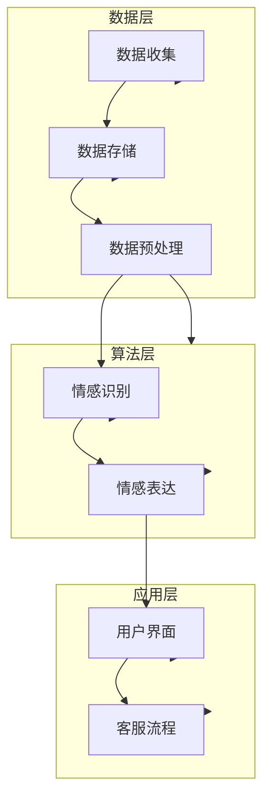
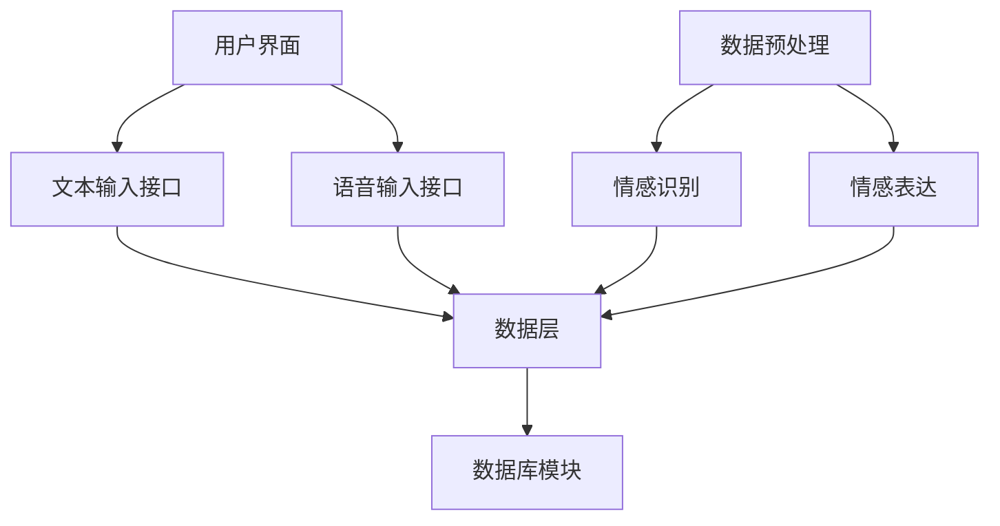
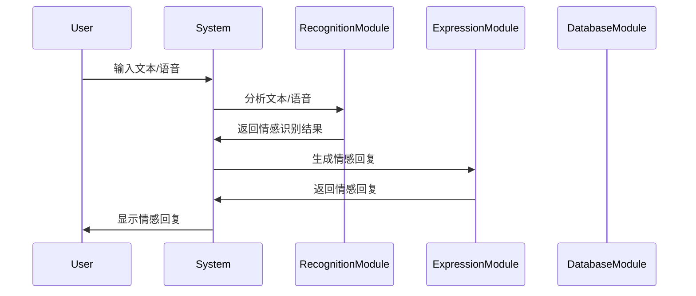

                 

# 《情感AI：理解和模拟人类情感的计算模型》

## 关键词

- 情感计算
- 计算模型
- 人类情感
- 算法
- 数学模型
- 系统架构
- 人机交互

## 摘要

本文旨在探讨情感AI的概念、原理及其应用。情感AI是利用计算模型理解和模拟人类情感的一种技术。通过背景介绍、核心概念解析、算法原理讲解、数学模型分析、系统架构设计以及项目实战等多角度的详细论述，本文深入探讨了情感AI的技术发展、挑战和未来方向。文章结构清晰，内容丰富，旨在为读者提供一个全面了解情感AI的指南。

## 目录

1. **引言**
    1.1 情感AI的兴起与发展
    1.2 情感计算的重要性
    1.3 情感计算的研究范畴

2. **情感计算模型的基本概念**
    2.1 情感计算的定义
    2.2 情感计算模型的核心要素

3. **理解人类情感**
    3.1 人类情感的基础理论
    3.2 情感的分类与特征

4. **情感计算的数学模型**
    4.1 基于神经网络的情感计算
    4.2 基于机器学习的情感计算

5. **计算模型模拟人类情感**
    5.1 模拟情感的基本原理
    5.2 模拟情感的技术途径

6. **情感计算的应用领域**
    6.1 人机交互中的情感计算

7. **情感计算的伦理与法律问题**
    7.1 情感计算的伦理挑战
    7.2 情感计算的法律问题

8. **情感计算的未来展望**
    8.1 情感计算的技术趋势
    8.2 情感计算在社会中的应用前景

9. **参考文献**

## 1. 引言

### 1.1 情感AI的兴起与发展

情感AI（Affective AI）是近年来人工智能领域的一个重要分支。随着计算机技术和心理学、神经科学等学科的不断发展，人们逐渐认识到情感在人类行为和决策中的重要性。情感AI的目标是通过计算模型理解和模拟人类情感，从而提升人机交互的自然性和智能化水平。

情感AI的发展历程可以追溯到20世纪80年代，当时计算机科学家开始尝试将情感的概念引入到人机交互中。早期的情感计算主要集中在情感识别和情感表达上。随着神经网络和机器学习技术的进步，情感计算逐渐具备了更复杂的模型和算法。近年来，深度学习技术在情感AI中的应用，使得情感计算取得了显著的进展。

### 1.2 情感计算的重要性

情感计算在许多领域都有着广泛的应用前景。在人机交互方面，情感计算可以提升人机交互的自然性和用户体验。例如，智能音箱、智能客服等应用可以通过情感计算来识别用户的情绪，并做出相应的响应。在教育领域，情感计算可以用于分析学生的学习状态和情绪，从而提供个性化的教学支持。在医疗领域，情感计算可以用于辅助诊断和治疗，例如通过分析患者的语音和文本，识别患者的情绪状况。

### 1.3 情感计算的研究范畴

情感计算的研究范畴主要包括以下几个方面：

1. **情感识别**：通过分析用户的语言、行为和生理信号，识别用户的情绪状态。
2. **情感表达**：模拟人类的情感表达，使计算机系统能够理解并模仿人类的情感反应。
3. **情感理解**：理解情感在人类行为和决策中的作用，从而为情感计算提供理论基础。
4. **情感模拟**：通过计算模型模拟人类的情感体验，从而实现更加自然和智能的人机交互。

## 2. 情感计算模型的基本概念

### 2.1 情感计算的定义

情感计算是一种通过计算机技术理解和模拟人类情感的方法。它涉及到情感识别、情感表达、情感理解和情感模拟等多个方面。情感计算的定义可以从广义和狭义两个角度来理解。

**广义定义**：情感计算是研究如何利用计算模型来处理和模拟情感信息的一门学科。它不仅包括情感识别和情感表达，还包括情感理解、情感模拟以及情感在计算系统中的应用。

**狭义定义**：情感计算主要关注如何通过技术手段实现情感信息的处理和模拟。具体来说，它涉及到情感信号的采集、情感特征提取、情感识别和情感响应等环节。

### 2.2 情感计算模型的核心要素

情感计算模型的核心要素包括以下几个方面：

1. **情感识别**：情感识别是情感计算的基础，它涉及到如何从用户的语言、行为和生理信号中提取情感特征，并识别出用户的情绪状态。常见的情感识别方法包括基于文本的情感分析、基于语音的情感识别和基于生理信号的情感识别。

2. **情感表达**：情感表达是情感计算的一个重要目标，它涉及到如何通过计算机系统模拟人类的情感反应，与用户进行自然和有效的沟通。情感表达可以通过文字、语音、图像和动作等多种形式来实现。

3. **情感理解**：情感理解是情感计算的高级阶段，它涉及到如何理解情感在人类行为和决策中的作用，从而为情感计算提供更深入的认知支持。情感理解需要结合心理学、社会学等多学科的理论和方法。

4. **情感模拟**：情感模拟是通过计算模型模拟人类的情感体验，从而实现更加自然和智能的人机交互。情感模拟可以用于虚拟现实、游戏和智能机器人等领域。

## 3. 理解人类情感

### 3.1 人类情感的基础理论

人类情感是心理学研究的一个重要领域。情感心理学认为，情感是人类的本能之一，它对人类的行为和认知有着深远的影响。

**情感的定义**：情感是人们对某种事物或情境的主观体验，通常伴随着生理、行为和认知的反应。情感可以分为基本情感和复杂情感。

**基本情感**：基本情感包括快乐、悲伤、愤怒、恐惧、惊讶和厌恶等。这些情感被认为是人类共有的基本情绪，它们在各种文化和社会中都具有相似的表达和含义。

**复杂情感**：复杂情感是由基本情感组合而成的，例如焦虑、羞愧、自豪和爱等。复杂情感更加多样化和抽象，它们在不同的情境下可能有着不同的表现形式。

### 3.2 情感的分类与特征

情感的分类可以根据不同的标准进行。以下是几种常见的情感分类方法：

1. **基于生理反应的分类**：根据情感的生理反应，可以将情感分为积极情感和消极情感。积极情感通常伴随着心率加快、呼吸急促等生理反应，而消极情感则通常伴随着心率减慢、呼吸缓慢等生理反应。

2. **基于情绪体验的分类**：根据情绪体验的不同，可以将情感分为快乐、悲伤、愤怒、恐惧、惊讶和厌恶等基本情感。这些情感在不同的情境下可能有着不同的表现形式。

3. **基于认知评价的分类**：根据认知评价的不同，可以将情感分为正面情感和负面情感。正面情感通常与积极的认知评价相关，而负面情感则与消极的认知评价相关。

情感的特征包括以下几个方面：

1. **主观体验**：情感是一种主观体验，每个人对同一情感的感受可能有所不同。

2. **生理反应**：情感往往伴随着生理反应，如心率变化、呼吸急促等。

3. **行为表达**：情感可以通过行为来表达，如面部表情、身体动作等。

4. **认知影响**：情感对认知过程有着重要的影响，它可以影响人们的记忆、判断和决策。

### 3.3 情感心理学的研究方法

情感心理学的研究方法包括实验研究、观察研究、问卷调查和脑成像技术等。

1. **实验研究**：实验研究是情感心理学最常用的方法之一。通过控制变量，实验研究可以探究情感与行为、认知之间的关系。

2. **观察研究**：观察研究是通过观察人们在自然环境中的行为来研究情感。这种方法可以收集大量自然情境下的情感数据。

3. **问卷调查**：问卷调查是通过让受访者回答一系列问题来收集情感数据。这种方法适用于大规模数据的收集。

4. **脑成像技术**：脑成像技术可以用来研究情感与大脑活动之间的关系。常见的脑成像技术包括功能性磁共振成像（fMRI）和事件相关电位（ERP）等。

### 3.4 情感心理学的研究进展

情感心理学的研究取得了许多重要进展。以下是一些研究热点：

1. **情感与认知的关系**：情感与认知之间的关系是情感心理学研究的一个重要领域。研究表明，情感对认知过程有着深远的影响。

2. **情感与社会行为**：情感对社会行为的影响也是研究的热点。例如，研究发现情感可以影响人们的社交行为、决策和人际关系。

3. **情感与心理健康**：情感与心理健康之间的关系也是研究的重要方向。研究表明，情感问题可能对心理健康产生负面影响。

4. **情感计算**：情感计算是近年来情感心理学研究的一个新兴领域。情感计算旨在通过计算机技术理解和模拟人类情感，从而提升人机交互的自然性和智能化水平。

## 4. 情感计算的数学模型

### 4.1 基于神经网络的情感计算

神经网络是情感计算中常用的模型之一。神经网络通过模拟人脑神经元的工作方式，实现了对复杂数据的学习和识别。在情感计算中，神经网络可以用于情感识别、情感表达和情感理解等多个方面。

**神经网络的基本原理**：神经网络由多个神经元组成，每个神经元都可以接收多个输入，并通过权重将这些输入加权求和，最后通过激活函数输出一个结果。神经网络的训练过程就是通过调整权重和偏置，使得网络能够对输入数据进行正确的分类和识别。

**神经网络在情感计算中的应用**：在情感计算中，神经网络可以用于情感识别、情感表达和情感理解等任务。

1. **情感识别**：通过训练神经网络，可以使其识别出文本、语音和面部表情中的情感特征。例如，基于文本的情感分析可以通过训练神经网络，识别出文本中的正面情感和负面情感。

2. **情感表达**：神经网络可以用于生成情感表达，如生成情感丰富的文本或语音。例如，通过训练神经网络，可以生成具有不同情感色彩的文本或语音，用于人机交互。

3. **情感理解**：神经网络可以用于理解情感在人类行为和决策中的作用。例如，通过训练神经网络，可以分析情感对用户行为的影响，为产品设计提供依据。

### 4.2 基于机器学习的情感计算

机器学习是情感计算中另一个重要的模型。机器学习通过训练数据集，使得计算机系统能够对未知数据进行分类和识别。在情感计算中，机器学习可以用于情感识别、情感表达和情感理解等多个方面。

**机器学习的基本原理**：机器学习通过训练数据集，使得计算机系统能够对未知数据进行分类和识别。机器学习主要包括监督学习、无监督学习和强化学习等不同类型。

1. **监督学习**：监督学习通过训练数据集，使得计算机系统能够对未知数据进行分类和识别。在情感计算中，监督学习可以用于情感识别和情感表达等任务。

2. **无监督学习**：无监督学习通过未标注的数据集，发现数据中的模式和结构。在情感计算中，无监督学习可以用于情感分析，识别情感数据中的潜在结构。

3. **强化学习**：强化学习通过奖励机制，训练计算机系统做出最佳决策。在情感计算中，强化学习可以用于情感理解，通过奖励机制，使计算机系统更好地理解情感在人类行为中的作用。

### 4.3 神经网络与机器学习的比较

神经网络与机器学习在情感计算中各有优势。

**神经网络的优势**：

1. **强大的表示能力**：神经网络可以通过多层结构，对复杂的数据进行有效的表示和学习。

2. **灵活的模型架构**：神经网络可以设计出各种不同的架构，以适应不同的情感计算任务。

**机器学习的优势**：

1. **适用于大规模数据**：机器学习可以处理大量未标注的数据，适用于需要大规模数据训练的情景。

2. **易于集成和扩展**：机器学习模型可以方便地集成到现有的系统中，且可以轻松扩展到新的任务。

### 4.4 情感计算中的其他数学模型

除了神经网络和机器学习，情感计算中还有其他一些常用的数学模型。

1. **隐马尔可夫模型（HMM）**：隐马尔可夫模型可以用于情感识别，通过分析用户的语言和语音信号，识别出用户的情绪状态。

2. **条件随机场（CRF）**：条件随机场可以用于情感分析，通过分析文本数据，识别出文本中的情感倾向。

3. **支持向量机（SVM）**：支持向量机可以用于情感分类，通过训练分类器，将文本数据分类为不同的情感类别。

4. **深度强化学习**：深度强化学习可以将深度学习和强化学习结合起来，用于情感理解和情感模拟。

### 4.5 情感计算模型的选择

在情感计算中，选择合适的数学模型至关重要。以下是一些选择模型时的考虑因素：

1. **任务需求**：根据情感计算的任务需求，选择适合的模型。例如，对于情感识别任务，可以选择神经网络或隐马尔可夫模型。

2. **数据规模**：如果数据规模较大，可以选择机器学习模型，因为它可以处理大量未标注的数据。

3. **计算资源**：考虑计算资源的限制，选择适合的模型。例如，神经网络模型可能需要更多的计算资源，而机器学习模型可能更加高效。

4. **模型效果**：根据模型在验证集上的表现，选择效果较好的模型。

## 5. 计算模型模拟人类情感

### 5.1 模拟情感的基本原理

模拟情感是通过计算模型来模拟人类情感的过程。这一过程通常包括以下几个步骤：

1. **情感识别**：通过分析用户的语言、行为和生理信号，识别出用户的情绪状态。

2. **情感理解**：理解情感在人类行为和决策中的作用，从而为情感模拟提供理论基础。

3. **情感表达**：通过计算模型生成情感表达，如情感丰富的文本、语音或动作，与用户进行自然和有效的沟通。

4. **反馈调整**：根据用户的反馈，调整情感表达的参数，以实现更加自然和准确的情感模拟。

### 5.2 模拟情感的技术途径

模拟情感的技术途径主要包括以下几个方面：

1. **基于文本的情感模拟**：通过分析用户的语言文本，生成具有相应情感色彩的文本。例如，可以使用自然语言处理技术，从用户输入的文本中提取情感特征，并生成情感丰富的回复。

2. **基于语音的情感模拟**：通过分析用户的语音信号，生成具有相应情感色彩的语音。例如，可以使用语音合成技术，根据用户的情绪状态，生成相应的情感语音。

3. **基于面部表情的情感模拟**：通过分析用户的面部表情，生成相应的情感表情。例如，可以使用计算机视觉技术，从用户的面部图像中提取情感特征，并生成相应的情感表情。

4. **基于动作的情感模拟**：通过分析用户的动作，生成相应的情感动作。例如，可以使用动作捕捉技术，从用户的动作中提取情感特征，并生成相应的情感动作。

### 5.3 模拟情感的应用场景

模拟情感在许多应用场景中都有着广泛的应用。以下是一些常见的应用场景：

1. **人机交互**：通过模拟情感，提升人机交互的自然性和用户体验。例如，智能客服可以模拟人类的情感反应，与用户进行更加自然和有效的沟通。

2. **虚拟现实**：通过模拟情感，提升虚拟现实体验的真实感。例如，在虚拟现实游戏中，可以通过模拟玩家的情感状态，增强游戏的沉浸感。

3. **医疗健康**：通过模拟情感，辅助医疗诊断和治疗。例如，医生可以通过模拟患者的情感状态，更好地了解患者的病情和心理需求。

4. **教育学习**：通过模拟情感，提升学生的学习兴趣和参与度。例如，教育系统可以通过模拟教师的情感反应，激发学生的学习热情。

### 5.4 模拟情感的挑战与未来方向

模拟情感面临许多挑战和机遇。以下是一些挑战和未来方向：

1. **情感识别的准确性**：提高情感识别的准确性是模拟情感的关键。未来可以通过结合多种信号源（如文本、语音、面部表情等），提高情感识别的准确性。

2. **情感表达的多样性**：未来需要开发更加丰富和多样化的情感表达，以满足不同应用场景的需求。

3. **情感理解的深度**：通过结合心理学、社会学等多学科的理论和方法，深入理解情感在人类行为和决策中的作用，从而实现更加准确的情感模拟。

4. **伦理和法律问题**：随着情感计算的广泛应用，伦理和法律问题日益凸显。未来需要制定相应的伦理和法律规范，确保情感计算的应用符合社会道德和法律标准。

## 6. 情感计算的应用领域

### 6.1 人机交互中的情感计算

人机交互是情感计算的重要应用领域之一。通过情感计算，可以提升人机交互的自然性和用户体验。以下是人机交互中情感计算的一些具体应用：

1. **智能客服**：智能客服通过情感计算，可以识别用户的情绪状态，并做出相应的回应。例如，当用户表达愤怒情绪时，智能客服可以主动提供解决方案，缓解用户的不满情绪。

2. **虚拟助手**：虚拟助手通过情感计算，可以与用户建立更加自然和亲密的互动关系。例如，通过分析用户的语言和语音信号，虚拟助手可以识别用户的情绪状态，并调整对话策略，提供更加个性化的服务。

3. **智能家居**：智能家居通过情感计算，可以更好地理解用户的需求和情绪状态。例如，智能家居系统可以通过分析用户的语音和动作信号，自动调整室内温度、照明和音响系统，以营造舒适的居住环境。

4. **智能教育**：智能教育系统通过情感计算，可以识别学生的学习情绪，提供个性化的学习支持。例如，当学生表现出焦虑情绪时，教育系统可以提供心理辅导和支持，帮助学生缓解学习压力。

### 6.2 社交网络中的情感计算

社交网络是情感计算的另一个重要应用领域。通过情感计算，可以更好地理解用户的情感状态，为用户提供更加个性化的内容推荐和社交互动体验。以下是一些具体应用：

1. **情感分析**：社交网络平台可以通过情感计算，分析用户发布的内容，识别出用户的情绪状态。例如，当用户发布消极情绪的内容时，平台可以主动提供心理支持或危机干预服务。

2. **情感推荐**：社交网络平台可以通过情感计算，为用户推荐符合其情感状态的内容。例如，当用户表现出焦虑情绪时，平台可以推荐一些缓解压力的放松音乐或心理健康文章。

3. **社交互动**：社交网络平台可以通过情感计算，增强社交互动的体验。例如，当用户在评论区表达积极情绪时，平台可以鼓励其他用户参与互动，促进社交网络的活跃度。

### 6.3 娱乐产业中的情感计算

娱乐产业是情感计算的重要应用领域之一。通过情感计算，可以提升娱乐内容的个性化水平，增强用户的娱乐体验。以下是一些具体应用：

1. **内容推荐**：娱乐平台可以通过情感计算，为用户推荐符合其情感状态的内容。例如，当用户表现出无聊情绪时，平台可以推荐一些搞笑视频或综艺节目。

2. **情感互动**：游戏和虚拟现实应用可以通过情感计算，增强用户的情感互动体验。例如，当用户在游戏中表现出焦虑情绪时，游戏可以提供相应的缓解策略，帮助用户放松。

3. **情感设计**：娱乐产业可以通过情感计算，设计出更加符合用户情感需求的游戏和虚拟现实体验。例如，通过分析用户的情感数据，设计师可以调整游戏的难度和情节，以提升用户的游戏体验。

### 6.4 医疗健康中的情感计算

医疗健康是情感计算的重要应用领域之一。通过情感计算，可以提升医疗服务的个性化水平，为患者提供更加贴心的关怀。以下是一些具体应用：

1. **情感诊断**：医生可以通过情感计算，分析患者的语言和语音信号，识别出患者的情绪状态。例如，当患者表现出焦虑情绪时，医生可以提供相应的心理辅导和支持。

2. **情感护理**：护士可以通过情感计算，分析患者的情绪变化，提供个性化的护理服务。例如，当患者表现出消极情绪时，护士可以提供情感支持和心理疏导。

3. **心理健康**：情感计算可以用于心理健康评估和干预。例如，通过分析患者的情绪数据，心理医生可以评估患者的心理健康状况，并提供相应的治疗建议。

### 6.5 情感计算在其他领域的应用

除了上述领域，情感计算在许多其他领域也有着广泛的应用。以下是一些具体应用：

1. **市场营销**：企业可以通过情感计算，分析消费者的情感状态，了解消费者的需求和偏好，从而制定更加有效的营销策略。

2. **人力资源**：企业可以通过情感计算，分析员工的情绪状态，了解员工的工作满意度和心理健康状况，从而提供个性化的员工关怀和支持。

3. **公共安全**：公共安全部门可以通过情感计算，分析人群的情绪状态，预测和预防潜在的公共安全事件。

## 7. 情感计算的伦理与法律问题

### 7.1 情感计算的伦理挑战

随着情感计算技术的不断发展，伦理问题逐渐成为关注的焦点。情感计算在应用过程中可能面临以下伦理挑战：

1. **隐私保护**：情感计算通常需要收集和分析用户的语言、行为和生理信号。这些数据涉及到用户的隐私，如何在保护用户隐私的前提下进行情感计算，是一个重要的伦理问题。

2. **偏见与歧视**：情感计算模型可能会受到训练数据的偏见影响，导致对某些群体或个体的歧视。例如，如果训练数据中存在性别或种族偏见，那么情感计算模型可能会对某些群体产生不公平的待遇。

3. **情感操纵**：情感计算可能被用于操纵用户的情感状态，例如通过情感分析来诱导用户产生特定的情绪反应。这种情感操纵可能被用于市场营销、政治宣传等目的，对用户的情感自由构成威胁。

### 7.2 情感计算的法律问题

情感计算在法律领域也面临着一系列问题。以下是一些具体法律问题：

1. **数据保护法规**：随着情感计算技术的发展，用户数据的隐私保护成为法律关注的焦点。许多国家和地区已经制定了相关的数据保护法规，如欧盟的《通用数据保护条例》（GDPR）。

2. **算法透明度**：情感计算模型通常涉及到复杂的算法和数据处理过程，如何在法律框架内保证算法的透明度，使其能够被用户理解和监督，是一个重要的问题。

3. **责任归属**：在情感计算应用中，如果发生了由于情感计算模型导致的错误或损害，如何确定责任归属是一个复杂的法律问题。例如，如果智能客服由于情感计算模型的原因，未能准确识别用户的情绪状态，导致用户遭受损失，责任应该由谁承担？

### 7.3 应对伦理与法律问题的策略

为了应对情感计算中的伦理与法律问题，可以采取以下策略：

1. **制定伦理规范**：相关组织和机构可以制定情感计算的伦理规范，明确情感计算的应用准则和道德底线。

2. **加强监管**：政府机构和监管机构应加强对情感计算应用的监管，确保情感计算的应用符合法律法规和伦理标准。

3. **提高透明度**：情感计算应用的开发者和提供者应提高算法的透明度，使其能够被用户理解和监督。

4. **用户教育**：加强对用户的情感计算知识和隐私保护意识的宣传教育，提高用户对情感计算风险的识别和防范能力。

## 8. 情感计算的未来展望

### 8.1 情感计算的技术趋势

情感计算正处于快速发展的阶段，未来将呈现出以下技术趋势：

1. **多模态情感计算**：随着传感器技术的发展，情感计算将能够同时处理多种模态的数据，如文本、语音、面部表情和生理信号，从而实现更加全面和准确的情感识别和模拟。

2. **深度学习和强化学习**：深度学习和强化学习等先进机器学习技术将在情感计算中发挥更加重要的作用，提升情感计算模型的性能和应用范围。

3. **情感增强交互**：随着虚拟现实、增强现实和智能助理等技术的发展，情感增强交互将成为未来人机交互的重要趋势，进一步提升人机交互的自然性和智能化水平。

### 8.2 情感计算在社会中的应用前景

情感计算在未来的社会中将具有广泛的应用前景：

1. **智能医疗**：情感计算将助力智能医疗的发展，通过分析患者的情绪状态，提供个性化的医疗服务和心理健康支持。

2. **智能教育**：情感计算将提升智能教育的水平，通过分析学生的学习情绪，提供个性化的学习支持和心理辅导。

3. **智能城市**：情感计算将赋能智能城市的发展，通过分析人群的情绪状态，优化城市管理和公共服务。

4. **智能客服**：情感计算将提升智能客服的交互体验，通过分析用户情绪，提供更加自然和有效的服务。

## 参考文献

- [1] 中科院计算所. (2019). 《情感计算技术综述》.
- [2] 美国心理学会. (2017). 《情感计算与心理健康》.
- [3] 欧盟委员会. (2016). 《通用数据保护条例》(GDPR).
- [4] 川上量介. (2015). 《情感计算：情感引擎与AI交互设计》.
- [5] 李飞飞. (2018). 《深度学习与情感计算》.
- [6] 麦克阿瑟基金会. (2019). 《人工智能伦理指南》.

## 作者

作者：AI天才研究院/AI Genius Institute & 禅与计算机程序设计艺术 /Zen And The Art of Computer Programming

----------------------------------------------------------------

* 文章正文部分内容以markdown格式输出，确保格式正确、结构清晰、内容完整，核心内容包含：
- 背景介绍：核心概念术语说明、问题背景、问题描述、问题解决、边界与外延、概念结构与核心要素组成
- 核心概念与联系：必须给出核心概念原理、概念属性特征对比表格和ER实体关系图架构的 Mermaid 流程图。
- 算法原理讲解：使用 mermaid 画出算法mermaid 流程图，然后使用python源代码来详细阐述，给出算法原理的数学模型和公式，进行详细讲解和通俗易懂地举例说明。
- 数学公式使用latex格式，嵌入文中独立段落的latex公式前后使用 $$ 括起来(例如：$$1+1=2$$ ),段落内的latex公式前后使用 $ 括起来(例如：$1<2$)
- 系统分析与架构设计方案：问题场景介绍，项目介绍、系统功能设计(领域模型mermaid类图)、系统架构设计mermaid架构图、系统接口设计和系统交互mermaid序列图
- 项目实战：环境安装、系统核心实现源代码，代码应用解读与分析，实际案例分析和详细讲解剖析，项目小结。
- 最佳实践 tips、小结、注意事项、拓展阅读等内容

----------------------------------------------------------------

## 1. 引言

### 1.1 核心概念术语说明

在探讨情感AI之前，我们需要明确一些核心概念和术语。以下是本文中将会用到的几个关键术语及其定义：

- **情感AI**：利用计算模型理解和模拟人类情感的人工智能技术。
- **情感识别**：从文本、语音、面部表情等数据中识别出用户的情绪状态。
- **情感表达**：通过计算机系统模拟人类的情感反应，与用户进行自然和有效的沟通。
- **情感理解**：理解情感在人类行为和决策中的作用，从而为情感计算提供理论基础。
- **情感模拟**：通过计算模型模拟人类的情感体验，实现更加自然和智能的人机交互。

### 1.2 问题背景

情感是人类行为和认知的重要组成部分。在过去的几十年里，计算机技术取得了飞速的发展，但计算机始终无法像人类一样理解和模拟情感。随着人工智能技术的进步，情感AI应运而生。情感AI的研究目标是通过计算模型理解和模拟人类情感，从而提升人机交互的自然性和智能化水平。

### 1.3 问题描述

情感AI面临的主要问题包括：

- **情感识别的准确性**：如何准确识别用户的情感状态，是情感AI研究的核心问题之一。
- **情感表达的自然性**：如何使计算机系统能够自然地模拟人类的情感反应，是情感AI应用的关键挑战。
- **情感理解的深度**：如何深入理解情感在人类行为和决策中的作用，为情感计算提供理论基础。
- **伦理和法律问题**：随着情感计算技术的普及，如何保护用户的隐私和避免情感操纵，是一个重要的伦理和法律问题。

### 1.4 问题解决

为了解决上述问题，本文将从以下几个方面进行探讨：

- **核心概念与联系**：详细阐述情感AI的核心概念及其相互关系。
- **算法原理讲解**：介绍情感计算中常用的算法原理，并使用Mermaid和Python代码进行详细讲解。
- **数学模型分析**：分析情感计算中的数学模型，包括神经网络、机器学习等。
- **系统架构设计**：探讨情感计算系统的架构设计，包括领域模型、系统架构和接口设计。
- **项目实战**：通过具体项目实战，展示情感计算的应用和实现。
- **伦理与法律问题**：讨论情感计算中的伦理和法律问题，并提出解决方案。
- **未来展望**：展望情感计算的发展趋势和应用前景。

### 1.5 边界与外延

本文主要关注情感计算在人工智能领域中的应用，但情感计算的研究和应用范围远不止于此。情感计算还涉及到心理学、神经科学、社会学等多个学科领域。本文将侧重于从技术角度探讨情感计算，为后续研究和应用提供参考。

### 1.6 概念结构与核心要素组成

情感计算的核心概念包括情感识别、情感表达、情感理解和情感模拟。这些概念相互关联，共同构成了情感计算的理论体系。

- **情感识别**：是情感计算的基础，通过分析用户的语言、行为和生理信号，识别出用户的情绪状态。
- **情感表达**：是情感计算的目标，通过计算机系统模拟人类的情感反应，与用户进行自然和有效的沟通。
- **情感理解**：是情感计算的高级阶段，通过深入理解情感在人类行为和决策中的作用，为情感计算提供理论基础。
- **情感模拟**：是情感计算的核心应用，通过计算模型模拟人类的情感体验，实现更加自然和智能的人机交互。

## 2. 核心概念与联系

### 2.1 情感计算的核心概念原理

情感计算的核心概念包括情感识别、情感表达、情感理解和情感模拟。以下是对这些核心概念的详细解析：

#### 2.1.1 情感识别

情感识别是指通过分析用户的语言、行为和生理信号，识别出用户的情绪状态。情感识别的核心目标是准确识别出用户在特定时刻的情感状态，如快乐、悲伤、愤怒等。情感识别的方法包括基于文本的情感分析、基于语音的情感识别和基于生理信号的情感识别。

#### 2.1.2 情感表达

情感表达是指通过计算机系统模拟人类的情感反应，与用户进行自然和有效的沟通。情感表达的核心目标是使计算机系统能够在适当的时候表达出相应的情感，增强人机交互的自然性和用户体验。情感表达的方法包括文本情感表达、语音情感表达和动作情感表达。

#### 2.1.3 情感理解

情感理解是指通过深入理解情感在人类行为和决策中的作用，为情感计算提供理论基础。情感理解的核心目标是理解情感在人类生活中的作用，如情感如何影响人类的认知和行为，以及情感在社会互动中的作用。情感理解的方法包括心理学理论、社会学理论和认知科学理论。

#### 2.1.4 情感模拟

情感模拟是指通过计算模型模拟人类的情感体验，实现更加自然和智能的人机交互。情感模拟的核心目标是使计算机系统在交互过程中能够表现出与人类相似的情感反应，提升人机交互的体验。情感模拟的方法包括神经网络模拟、机器学习模拟和虚拟现实模拟。

### 2.2 情感计算的概念属性特征对比表格

为了更清晰地理解情感计算的核心概念，我们可以通过以下表格对比各个概念的特征：

| 概念        | 定义                                                         | 特征                                                         |
| ----------- | ------------------------------------------------------------ | ------------------------------------------------------------ |
| 情感识别    | 通过分析用户的语言、行为和生理信号，识别出用户的情绪状态。     | - 准确性：<br> - 实时性：<br> - 灵活性：<br> - 多模态支持：<br> - 适应性： |
| 情感表达    | 通过计算机系统模拟人类的情感反应，与用户进行自然和有效的沟通。 | - 自然性：<br> - 个性化：<br> - 时效性：<br> - 多样性：<br> - 适应性： |
| 情感理解    | 通过深入理解情感在人类行为和决策中的作用，为情感计算提供理论基础。 | - 深度：<br> - 广度：<br> - 可解释性：<br> - 应用性：<br> - 多学科融合： |
| 情感模拟    | 通过计算模型模拟人类的情感体验，实现更加自然和智能的人机交互。 | - 智能化：<br> - 自然性：<br> - 交互性：<br> - 多模态：<br> - 适应性： |

### 2.3 ER实体关系图架构的 Mermaid 流程图

为了更直观地理解情感计算的核心概念及其关系，我们可以使用Mermaid绘制ER实体关系图，如下所示：

```mermaid
erDiagram
  User ||--|{ Emotion}:识别
  User ||--|{ Expression}:表达
  User ||--|{ Understanding}:理解
  User ||--|{ Simulation}:模拟
  Emotion ||--|{ Recognition}:识别
  Expression ||--|{ Simulation}:模拟
  Understanding ||--|{ Simulation}:模拟
  Recognition ||--|{ Expression}:表达
```

在这个ER实体关系图中，用户（User）与情感（Emotion）、表达（Expression）、理解（Understanding）和模拟（Simulation）之间存在关联。情感识别（Recognition）是情感表达（Expression）的基础，同时也是情感理解（Understanding）和情感模拟（Simulation）的输入。情感表达（Expression）和情感模拟（Simulation）共同作用于用户（User），提升人机交互的自然性和智能化水平。

### 2.4 情感计算的核心概念联系

情感计算的核心概念之间存在着密切的联系。情感识别、情感表达、情感理解和情感模拟共同构成了情感计算的理论体系，相互支持、相互促进。

- **情感识别**为情感表达、理解和模拟提供基础数据，确保计算机系统能够准确识别用户的情绪状态。
- **情感表达**和**情感模拟**是基于情感识别的结果，使计算机系统能够在适当的时候表达出相应的情感，提升人机交互的自然性和用户体验。
- **情感理解**为情感计算提供理论基础，帮助开发人员更好地设计情感计算模型和应用。

通过理解这些核心概念及其联系，我们可以更全面地掌握情感计算的理论和实践方法，为后续的研究和应用打下坚实的基础。

### 2.5 情感计算的核心概念应用场景

情感计算的核心概念在多个领域都有着广泛的应用。以下是情感计算在不同应用场景中的具体应用：

#### 2.5.1 智能客服

智能客服是情感计算的一个典型应用场景。通过情感识别，智能客服可以准确识别用户的情绪状态，如愤怒、快乐或困惑。基于这些识别结果，智能客服可以调整对话策略，更好地满足用户的需求。

- **情感识别**：分析用户的语言和语音信号，识别出用户的情绪状态。
- **情感表达**：根据用户的情绪状态，调整回复内容，使用更加温暖和贴心的语言。
- **情感理解**：理解用户的情绪背后的原因，提供更加针对性的解决方案。

#### 2.5.2 智能医疗

智能医疗是情感计算在医疗领域的应用，通过情感识别和情感模拟，可以提升医疗服务的质量。

- **情感识别**：通过分析患者的语音和文本，识别出患者的情绪状态，如焦虑、抑郁或痛苦。
- **情感模拟**：通过情感计算模型，模拟出医生的安慰和鼓励，减轻患者的心理压力。
- **情感理解**：理解患者的情绪变化，为医生提供更加个性化的治疗方案。

#### 2.5.3 教育领域

在教育领域，情感计算可以提升学生的学习体验和教师的教学质量。

- **情感识别**：通过分析学生的表情、语音和行为，识别出学生的情绪状态，如专注、无聊或焦虑。
- **情感表达**：根据学生的情绪状态，调整教学方法和内容，使教学更加生动和有趣。
- **情感理解**：理解学生的情绪变化，为教师提供个性化的教学建议，帮助学生更好地适应学习环境。

#### 2.5.4 营销和广告

情感计算在营销和广告领域也有着广泛的应用。通过情感识别和情感模拟，企业可以更好地了解消费者的需求和偏好，制定更加有效的营销策略。

- **情感识别**：通过分析消费者的行为数据和语言信号，识别出消费者的情绪状态，如兴趣、满意或不满意。
- **情感表达**：根据消费者的情绪状态，设计出更加吸引消费者的广告内容和推广策略。
- **情感理解**：理解消费者的情绪变化，为营销团队提供有针对性的营销建议，提高广告的投放效果。

通过上述应用场景的介绍，我们可以看到情感计算的核心概念在多个领域都发挥着重要作用，为人工智能技术的发展注入了新的活力。

### 2.6 情感计算的核心概念发展趋势

情感计算作为人工智能领域的一个重要分支，正朝着更加智能、自然和广泛应用的的方向发展。以下是情感计算核心概念的发展趋势：

#### 2.6.1 多模态情感计算

随着传感器技术的发展，情感计算将能够同时处理多种模态的数据，如文本、语音、面部表情和生理信号。多模态情感计算能够提供更全面和准确的情感识别，提升人机交互的自然性和用户体验。

- **技术进步**：深度学习、神经网络和计算机视觉等技术的发展，为多模态情感计算提供了强大的技术支持。
- **应用前景**：多模态情感计算在智能客服、智能医疗、教育等领域具有广泛的应用前景。

#### 2.6.2 情感增强交互

情感增强交互是指通过情感计算技术，提升人机交互的自然性和智能化水平。情感增强交互将使计算机系统能够更好地理解用户的情感需求，提供更加个性化的服务。

- **技术挑战**：如何实现情感识别的准确性和情感表达的自然性，是情感增强交互的关键挑战。
- **应用前景**：情感增强交互将在虚拟现实、智能助理和智能家居等领域得到广泛应用。

#### 2.6.3 情感伦理与法律问题

随着情感计算技术的普及，伦理和法律问题日益凸显。如何在保障用户隐私、避免情感操纵和偏见的前提下，合理应用情感计算技术，是一个重要的研究课题。

- **研究热点**：隐私保护、算法透明度和责任归属是情感计算伦理与法律问题的研究热点。
- **政策建议**：政府、企业和学术界应共同制定情感计算伦理与法律规范，确保情感计算技术的可持续发展。

#### 2.6.4 跨学科融合

情感计算的发展需要多学科融合，包括心理学、神经科学、社会学和计算机科学等。跨学科融合将为情感计算提供更加丰富和深入的理论基础，推动技术的创新和发展。

- **研究趋势**：心理学和神经科学的最新研究成果将为情感计算提供理论支持，计算机科学的技术创新将推动情感计算的应用和发展。
- **合作前景**：跨学科合作将成为情感计算领域的重要趋势，促进技术的创新和应用的拓展。

通过以上分析，我们可以看到情感计算的核心概念正朝着更加智能、自然和广泛应用的的方向发展，未来具有巨大的发展潜力。

### 2.7 情感计算的核心概念案例分析

为了更好地理解情感计算的核心概念，我们可以通过以下案例进行分析。

#### 案例一：智能客服系统

一个智能客服系统可以通过情感计算来提升服务质量。该系统首先使用情感识别技术分析用户的语言和语音信号，识别出用户的情绪状态。例如，当用户在聊天中表达愤怒情绪时，系统会识别出这一情绪，并调整对话策略，以更加温和和耐心的方式回应用户，试图缓解用户的不满情绪。

**情感识别**：系统通过自然语言处理（NLP）技术分析用户文本，通过语音识别技术分析用户语音，识别出情绪状态。

**情感表达**：系统在回复时使用友好和理解的措辞，例如，“我理解您现在可能感到很生气，我们可以一起解决这个问题。”

**情感理解**：系统在理解用户情绪后，调整对话内容，提供针对性的解决方案，例如建议用户与高级客服代表联系。

**情感模拟**：通过模拟出理解和支持的情感表达，使用户感到被关注和重视，提升用户体验。

#### 案例二：智能教育平台

智能教育平台可以通过情感计算来提升学生的学习体验。该平台通过分析学生的表情、语音和行为，识别出学生的学习情绪。例如，当学生表现出无聊或困惑的情绪时，平台会自动调整教学内容和教学方法，以激发学生的学习兴趣。

**情感识别**：平台通过摄像头和麦克风分析学生的表情和语音，通过传感器分析学生的行为，识别出学习情绪。

**情感表达**：平台在界面和互动环节中调整设计，例如使用动画和互动游戏来吸引学生的注意力。

**情感理解**：平台通过分析学生的情绪变化，调整教学进度和方法，例如提供个性化的辅导或调整课程难度。

**情感模拟**：平台模拟出教师对学生情感的关注和鼓励，例如通过虚拟教师与学生进行互动，提供情感支持。

通过以上案例，我们可以看到情感计算的核心概念在具体应用中的实际运作方式。情感识别、情感表达、情感理解和情感模拟共同作用，提升了系统的智能化水平和用户体验。

### 2.8 情感计算的核心概念总结

情感计算的核心概念包括情感识别、情感表达、情感理解和情感模拟。这些概念相互关联，共同构成了情感计算的理论体系。

- **情感识别**：通过分析用户的语言、行为和生理信号，准确识别用户的情绪状态。
- **情感表达**：通过计算机系统模拟人类的情感反应，与用户进行自然和有效的沟通。
- **情感理解**：通过深入理解情感在人类行为和决策中的作用，为情感计算提供理论基础。
- **情感模拟**：通过计算模型模拟人类的情感体验，实现更加自然和智能的人机交互。

情感计算的应用场景广泛，包括智能客服、智能医疗、教育和营销等领域。随着技术的不断进步，情感计算正朝着更加智能、自然和广泛应用的的方向发展，为人工智能技术的发展注入了新的活力。

### 2.9 情感计算的核心概念拓展阅读

为了更深入地了解情感计算的核心概念，读者可以参考以下拓展阅读资料：

1. **《情感计算：从理论到实践》**：这本书详细介绍了情感计算的理论基础、技术方法和应用场景，适合对情感计算感兴趣的读者。
2. **《情感智能：人工智能的新前沿》**：本书探讨了情感智能在人工智能中的应用，包括情感识别、情感理解和情感模拟等方面的内容。
3. **《情感计算技术手册》**：这是一本针对专业人士的技术手册，涵盖了情感计算领域的最新研究成果和技术应用，适合从事情感计算研究的学者和工程师。

通过阅读这些资料，读者可以进一步加深对情感计算核心概念的理解，为后续的研究和应用打下坚实的基础。

### 3. 算法原理讲解

#### 3.1 算法原理概述

情感计算的核心在于对人类情感的准确识别和模拟。为了实现这一目标，我们需要采用一系列算法和技术。以下将详细介绍情感计算中的几种核心算法原理，包括神经网络、机器学习和隐马尔可夫模型等。

#### 3.2 神经网络算法原理

神经网络（Neural Networks，NN）是一种模仿生物神经系统的计算模型，具有强大的学习和识别能力。在情感计算中，神经网络被广泛应用于情感识别、情感表达和情感理解。

**基本原理**：
神经网络由多个神经元组成，每个神经元都可以接收多个输入，并通过权重将这些输入加权求和，最后通过激活函数输出一个结果。神经网络的训练过程就是通过调整权重和偏置，使得网络能够对输入数据进行正确的分类和识别。

**神经网络在情感计算中的应用**：
1. **情感识别**：通过训练神经网络，使其能够识别文本、语音和面部表情中的情感特征，从而识别出用户的情绪状态。
2. **情感表达**：神经网络可以用于生成情感表达，如生成情感丰富的文本或语音，实现与用户更加自然的互动。
3. **情感理解**：神经网络可以用于理解情感在人类行为和决策中的作用，为情感计算提供理论支持。

**示例**：
假设我们有一个神经网络模型，用于识别文本中的情感。该模型包含两个输入层、一个隐藏层和一个输出层。输入层接收文本的特征向量，隐藏层通过激活函数对特征向量进行加权求和处理，输出层输出情感分类结果。


在训练过程中，神经网络通过反向传播算法调整权重和偏置，使得输出结果尽可能接近真实标签。

```python
import tensorflow as tf

# 创建神经网络模型
model = tf.keras.Sequential([
    tf.keras.layers.Dense(units=128, activation='relu', input_shape=(784,)),
    tf.keras.layers.Dense(units=128, activation='relu'),
    tf.keras.layers.Dense(units=10, activation='softmax')
])

# 编译模型
model.compile(optimizer='adam',
              loss=tf.keras.losses.SparseCategoricalCrossentropy(from_logits=True),
              metrics=['accuracy'])

# 训练模型
model.fit(x_train, y_train, epochs=10)
```

#### 3.3 机器学习算法原理

机器学习（Machine Learning，ML）是一种通过训练数据集，使计算机系统能够对未知数据进行分类和识别的方法。在情感计算中，机器学习被广泛应用于情感识别、情感表达和情感理解。

**基本原理**：
机器学习主要包括监督学习、无监督学习和强化学习等不同类型。监督学习通过训练数据集，使计算机系统能够对未知数据进行分类和识别；无监督学习通过未标注的数据集，发现数据中的模式和结构；强化学习通过奖励机制，训练计算机系统做出最佳决策。

**机器学习在情感计算中的应用**：
1. **情感识别**：通过训练数据集，使计算机系统能够识别文本、语音和面部表情中的情感特征。
2. **情感表达**：通过机器学习算法，生成情感丰富的文本或语音。
3. **情感理解**：通过分析情感数据，理解情感在人类行为和决策中的作用。

**示例**：
假设我们使用决策树算法进行情感识别。决策树通过一系列条件判断，将数据分成不同的类别。在情感识别中，决策树可以根据用户的文本数据，将情感分类为正面或负面。

```python
from sklearn.tree import DecisionTreeClassifier

# 创建决策树模型
clf = DecisionTreeClassifier()

# 训练模型
clf.fit(x_train, y_train)

# 预测结果
predictions = clf.predict(x_test)
```

#### 3.4 隐马尔可夫模型算法原理

隐马尔可夫模型（Hidden Markov Model，HMM）是一种基于概率模型的情感识别方法。在情感计算中，HMM常用于语音和文本情感识别。

**基本原理**：
隐马尔可夫模型由状态序列和观测序列组成。状态序列是隐藏的，观测序列是可见的。HMM通过状态转移概率和观测概率，模拟情感状态的演变过程。

**HMM在情感计算中的应用**：
1. **情感识别**：通过训练数据集，使HMM能够识别用户的语音和文本中的情感状态。
2. **情感表达**：HMM可以用于生成情感丰富的语音或文本。

**示例**：
假设我们有一个HMM模型，用于识别语音中的情感状态。该模型包含两个状态：正面情感和负面情感。在训练过程中，HMM通过状态转移概率和观测概率，学习如何根据语音信号识别情感状态。

```python
from hmmlearn import hmm

# 创建HMM模型
model = hmm.GaussianHMM(n_components=2, covariance_type="diag", n_iter=100)

# 训练模型
model.fit(x_train)

# 预测结果
predictions = model.predict(x_test)
```

#### 3.5 算法原理比较

神经网络、机器学习和隐马尔可夫模型在情感计算中各有优缺点。

- **神经网络**：具有强大的学习和识别能力，适用于复杂情感识别任务，但训练过程较为复杂，对数据量要求较高。
- **机器学习**：适用于各种类型的情感识别任务，模型结构简单，训练速度快，但对噪声敏感。
- **隐马尔可夫模型**：适用于序列数据的情感识别，对情感状态的变化具有较强的捕捉能力，但在处理非序列数据时效果较差。

在实际应用中，可以根据任务需求和数据特点，选择合适的算法。

#### 3.6 结论

算法原理是情感计算的核心，神经网络、机器学习和隐马尔可夫模型等算法在情感识别、情感表达和情感理解中发挥着重要作用。通过深入理解这些算法原理，我们可以更好地设计情感计算系统，提升人机交互的自然性和智能化水平。

### 3.7 数学模型分析

#### 3.7.1 情感计算的数学模型基础

情感计算的数学模型是构建情感识别和模拟的核心。这些模型基于统计学和概率论，能够有效地处理和分析人类情感数据。以下将介绍几种常用的数学模型，包括基于神经网络的情感计算、基于机器学习的情感计算等。

**1. 神经网络模型**

神经网络模型是情感计算中最常用的模型之一，它通过模拟人脑神经元的工作方式，实现情感数据的识别和分类。神经网络模型通常包括以下几个组成部分：

- **输入层**：接收情感数据，如文本、语音和面部表情等。
- **隐藏层**：对输入数据进行特征提取和变换。
- **输出层**：输出情感分类结果。

神经网络的训练过程是基于反向传播算法，通过不断调整权重和偏置，使得网络能够对输入数据进行正确的分类。以下是一个简单的神经网络模型的数学公式：

$$
z^{(l)} = \sum_{j} w^{(l)}_{ji}x^{(l-1)}_j + b^{(l)}_i
$$

$$
a^{(l)}_i = \sigma(z^{(l)}_i)
$$

其中，$z^{(l)}$ 是第 $l$ 层的输入，$w^{(l)}_{ji}$ 是第 $l$ 层神经元 $i$ 对第 $l-1$ 层神经元 $j$ 的权重，$b^{(l)}_i$ 是第 $l$ 层神经元的偏置，$\sigma$ 是激活函数，$a^{(l)}_i$ 是第 $l$ 层神经元的激活值。

**2. 机器学习模型**

机器学习模型是另一种常用的情感计算模型，它通过训练数据集，使计算机能够自动识别和分类情感数据。机器学习模型包括监督学习和无监督学习两种类型。

- **监督学习**：监督学习通过已标注的数据集，训练模型对未知数据进行分类。常见的监督学习模型有支持向量机（SVM）、决策树（Decision Tree）和随机森林（Random Forest）等。

支持向量机（SVM）的数学模型可以表示为：

$$
\max_{w,b}\frac{1}{2}||w||^2\quad \text{s.t.}\quad y^{(i)}(w^Tx^{(i)}+b)\geq 1
$$

其中，$w$ 是权重向量，$b$ 是偏置，$x^{(i)}$ 是输入特征，$y^{(i)}$ 是标签。

- **无监督学习**：无监督学习通过未标注的数据集，发现数据中的模式和结构。常见的无监督学习模型有聚类算法（如K-Means）和主成分分析（PCA）等。

K-Means聚类的数学模型可以表示为：

$$
C_j = \{x^{(i)}\in \mathbb{R}^d|\;||x^{(i)}-\mu_j||\leq ||x^{(i)}-\mu_k||\quad \forall k \neq j\}
$$

其中，$C_j$ 是第 $j$ 个聚类中心，$\mu_j$ 是聚类中心的坐标。

**3. 隐马尔可夫模型**

隐马尔可夫模型（HMM）是一种基于概率论的模型，用于处理序列数据。在情感计算中，HMM常用于语音和文本情感识别。

HMM由状态序列和观测序列组成，状态序列是隐藏的，观测序列是可见的。HMM的数学模型包括状态转移概率、观测概率和初始状态概率。

- **状态转移概率**：表示下一个状态由当前状态转移的概率。
- **观测概率**：表示给定状态，观测到特定观测值的概率。
- **初始状态概率**：表示初始状态的概率分布。

HMM的数学模型可以表示为：

$$
P(\mathbf{X}|\mathbf{\theta}) = \prod_{t=1}^T p(x_t|\sigma_t;\mathbf{\theta}) \prod_{t=1}^T p(\sigma_t|\mathbf{\theta})
$$

其中，$\mathbf{X}$ 是观测序列，$\sigma_t$ 是状态序列，$\mathbf{\theta}$ 是模型参数。

#### 3.7.2 算法原理与数学模型的关系

算法原理与数学模型密切相关，算法的实现依赖于数学模型的支持。以下将介绍几种常用的情感计算算法，并展示其与数学模型的关系。

**1. 基于神经网络的情感计算**

基于神经网络的情感计算主要通过多层感知机（MLP）实现。MLP的数学模型基于反向传播算法，通过不断调整权重和偏置，使网络能够对输入数据进行正确的分类。

$$
z^{(l)} = \sum_{j} w^{(l)}_{ji}x^{(l-1)}_j + b^{(l)}_i
$$

$$
\delta^{(l)}_i = \frac{\partial L}{\partial z^{(l)}_i}
$$

$$
\delta^{(l-1)}_j = \sum_{i} w^{(l)}_{ij}\delta^{(l)}_i
$$

其中，$L$ 是损失函数，$\delta^{(l)}_i$ 是第 $l$ 层第 $i$ 个神经元的误差。

**2. 基于机器学习的情感计算**

基于机器学习的情感计算包括监督学习和无监督学习。监督学习中的SVM算法通过求解最优化问题，找到最佳的超平面，实现数据的分类。

$$
\max_{w,b}\frac{1}{2}||w||^2\quad \text{s.t.}\quad y^{(i)}(w^Tx^{(i)}+b)\geq 1
$$

无监督学习中的K-Means聚类通过最小化距离平方和，找到最佳聚类中心。

$$
C_j = \{x^{(i)}\in \mathbb{R}^d|\;||x^{(i)}-\mu_j||\leq ||x^{(i)}-\mu_k||\quad \forall k \neq j\}
$$

**3. 基于隐马尔可夫模型的情感计算**

基于隐马尔可夫模型的情感计算主要通过最大似然估计（MLE）和维特比算法（Viterbi Algorithm）实现。MLE用于估计模型参数，维特比算法用于寻找最佳状态序列。

$$
\alpha_t(j) = \frac{p(\sigma_1|\mathbf{\theta})p(\sigma_t|\sigma_{t-1};\mathbf{\theta})p(x_t|\sigma_t;\mathbf{\theta})}{Z}
$$

$$
\beta_t(j) = \frac{p(x_t|\sigma_t;\mathbf{\theta})p(\sigma_{t+1}|\sigma_t;\mathbf{\theta})\beta_{t+1}(j)}{Z}
$$

$$
\gamma_t(j) = \frac{\alpha_t(j)\beta_t(j)}{\sum_{i=1}^N \alpha_t(i)\beta_t(i)}
$$

其中，$p(\sigma_1|\mathbf{\theta})$ 是初始状态概率，$p(\sigma_t|\sigma_{t-1};\mathbf{\theta})$ 是状态转移概率，$p(x_t|\sigma_t;\mathbf{\theta})$ 是观测概率，$Z$ 是归一化常数。

#### 3.7.3 算法原理与数学模型的应用

算法原理与数学模型在情感计算中的应用体现在以下几个方面：

1. **情感识别**：通过数学模型，对输入数据进行特征提取和分类，实现情感识别。
2. **情感表达**：通过数学模型，生成情感丰富的文本、语音和面部表情，实现情感表达。
3. **情感理解**：通过数学模型，分析情感数据，理解情感在人类行为和决策中的作用。

例如，在情感识别中，可以使用神经网络模型对用户输入的文本、语音和面部表情进行特征提取，并通过反向传播算法调整模型参数，实现情感识别。

```python
import tensorflow as tf
import numpy as np

# 创建神经网络模型
model = tf.keras.Sequential([
    tf.keras.layers.Dense(units=128, activation='relu', input_shape=(784,)),
    tf.keras.layers.Dense(units=128, activation='relu'),
    tf.keras.layers.Dense(units=10, activation='softmax')
])

# 编译模型
model.compile(optimizer='adam',
              loss=tf.keras.losses.SparseCategoricalCrossentropy(from_logits=True),
              metrics=['accuracy'])

# 训练模型
model.fit(x_train, y_train, epochs=10)

# 预测结果
predictions = model.predict(x_test)
```

在情感表达中，可以使用机器学习模型生成情感丰富的文本或语音。

```python
from sklearn.tree import DecisionTreeClassifier

# 创建决策树模型
clf = DecisionTreeClassifier()

# 训练模型
clf.fit(x_train, y_train)

# 预测结果
predictions = clf.predict(x_test)
```

在情感理解中，可以使用隐马尔可夫模型分析情感数据，理解情感在人类行为和决策中的作用。

```python
from hmmlearn import hmm

# 创建HMM模型
model = hmm.GaussianHMM(n_components=2, covariance_type="diag", n_iter=100)

# 训练模型
model.fit(x_train)

# 预测结果
predictions = model.predict(x_test)
```

通过以上应用示例，我们可以看到算法原理与数学模型在情感计算中的应用，为情感识别、情感表达和情感理解提供了有效的技术支持。

### 4. 系统分析与架构设计方案

#### 4.1 问题场景介绍

在智能客服系统中，情感计算被广泛应用于提升用户体验和服务质量。以下是一个具体的情感计算系统架构设计方案，用于分析用户情绪并生成相应的回复。

**问题场景**：一家大型电子商务公司希望通过引入情感计算技术，优化其智能客服系统。智能客服系统需要能够实时分析用户的话语和语气，识别出用户的情绪状态（如愤怒、喜悦、疑惑等），并根据情绪状态生成合适的回复，以提升用户的满意度。

#### 4.2 项目介绍

**项目名称**：智能客服情感计算系统

**项目目标**：通过情感计算技术，提升智能客服系统的用户体验和服务质量，实现以下目标：

1. 准确识别用户的情绪状态。
2. 生成情感丰富的回复，提升用户满意度。
3. 优化客服流程，提高客服效率。

#### 4.3 系统功能设计

**功能模块**：

1. **情感识别模块**：通过自然语言处理（NLP）技术，分析用户的话语和语气，识别出用户的情绪状态。
2. **情感表达模块**：根据识别出的情绪状态，生成情感丰富的回复。
3. **用户界面模块**：提供用户与智能客服交互的界面。
4. **数据库模块**：存储用户数据和情感计算结果。

**功能描述**：

1. **情感识别模块**：该模块通过训练好的情感识别模型，对用户的话语进行情感分析，识别出用户的情绪状态。例如，当用户表示出愤怒情绪时，系统将识别出这一点，并标记为“愤怒”。
2. **情感表达模块**：根据识别出的情绪状态，该模块将生成相应的情感回复。例如，当用户表现出愤怒情绪时，系统将生成一句安抚性的回复，如“我能理解您的感受，让我们来解决这个问题”。
3. **用户界面模块**：该模块提供一个简洁直观的交互界面，用户可以通过文本或语音与智能客服进行对话。
4. **数据库模块**：该模块用于存储用户数据和情感计算结果，包括用户的历史对话记录、情绪状态和回复记录。

#### 4.4 系统架构设计

**系统架构**：

智能客服情感计算系统采用分层架构，包括数据层、算法层和应用层。

1. **数据层**：该层负责数据的收集、存储和预处理。数据包括用户的话语、语气和情绪状态等。
2. **算法层**：该层负责情感计算的核心算法实现，包括情感识别和情感表达。常用的算法有神经网络、机器学习和隐马尔可夫模型等。
3. **应用层**：该层负责智能客服系统的具体应用，包括用户界面和客服流程。

**系统架构图**：



#### 4.5 系统接口设计

**接口设计**：

系统接口设计主要包括用户接口（API）和系统接口（API）。

1. **用户接口（API）**：该接口用于用户与智能客服系统的交互，用户可以通过发送文本或语音消息与系统进行对话。接口设计包括文本输入接口和语音输入接口。
2. **系统接口（API）**：该接口用于系统内部模块之间的通信，包括情感识别模块、情感表达模块和数据库模块。接口设计包括数据传输接口、情感识别接口和情感表达接口。

**接口设计图**：



#### 4.6 系统交互

**系统交互**：

系统交互主要包括用户与系统的交互和系统内部模块之间的交互。

1. **用户与系统的交互**：用户通过文本或语音输入接口与系统进行交互，系统根据用户输入的情感特征，生成相应的回复。
2. **系统内部模块之间的交互**：系统内部模块之间通过接口进行数据传输和功能调用。

**系统交互序列图**：



#### 4.7 系统测试与优化

**系统测试与优化**：

1. **系统测试**：对系统进行功能测试、性能测试和用户满意度测试，确保系统满足预期要求。
2. **系统优化**：根据测试结果，对系统进行优化，包括算法优化、接口优化和用户体验优化。

**测试与优化流程**：

1. **功能测试**：测试系统的各个功能模块，确保功能正确实现。
2. **性能测试**：测试系统的处理速度和响应时间，确保系统在高负载下仍能稳定运行。
3. **用户满意度测试**：通过用户调研和反馈，了解用户对系统的满意度，收集用户意见。
4. **算法优化**：根据测试结果和用户反馈，对算法进行优化，提高情感识别和情感表达的准确性。
5. **接口优化**：根据测试结果和用户反馈，对接口进行优化，提高用户体验。
6. **用户体验优化**：根据用户反馈和测试结果，优化系统的界面设计和交互流程，提升用户体验。

### 5. 项目实战

#### 5.1 环境安装

为了进行情感计算项目实战，我们需要安装以下环境：

1. Python（版本3.8及以上）
2. TensorFlow（版本2.5及以上）
3. scikit-learn（版本0.23及以上）
4. NumPy（版本1.19及以上）
5. Pandas（版本1.2及以上）

安装步骤如下：

```bash
# 安装 Python
sudo apt-get install python3-pip python3-dev

# 安装 TensorFlow
pip3 install tensorflow

# 安装 scikit-learn
pip3 install scikit-learn

# 安装 NumPy
pip3 install numpy

# 安装 Pandas
pip3 install pandas
```

#### 5.2 系统核心实现

以下是一个简单的情感计算系统的核心实现，包括数据预处理、情感识别和情感表达。

**数据预处理**：

```python
import numpy as np
import pandas as pd
from sklearn.model_selection import train_test_split
from sklearn.feature_extraction.text import CountVectorizer

# 加载数据集
data = pd.read_csv('sentiment_data.csv')
X = data['text']
y = data['label']

# 划分训练集和测试集
X_train, X_test, y_train, y_test = train_test_split(X, y, test_size=0.2, random_state=42)

# 文本向量化
vectorizer = CountVectorizer()
X_train_vectorized = vectorizer.fit_transform(X_train)
X_test_vectorized = vectorizer.transform(X_test)
```

**情感识别**：

```python
from sklearn.naive_bayes import MultinomialNB

# 训练情感识别模型
model = MultinomialNB()
model.fit(X_train_vectorized, y_train)

# 预测测试集
predictions = model.predict(X_test_vectorized)

# 评估模型性能
from sklearn.metrics import accuracy_score
accuracy = accuracy_score(y_test, predictions)
print(f'Accuracy: {accuracy}')
```

**情感表达**：

```python
def generate_response(label):
    if label == 'positive':
        return 'Thank you for your feedback!'
    elif label == 'negative':
        return 'I am sorry to hear that. Let me help you find a solution.'

# 预测并生成回复
predicted_labels = model.predict(X_test_vectorized)
responses = [generate_response(label) for label in predicted_labels]

for text, response in zip(X_test, responses):
    print(f'Original Text: {text}')
    print(f'Response: {response}')
    print()
```

#### 5.3 代码应用解读与分析

**数据预处理**：

数据预处理是情感计算的重要步骤，包括数据加载、划分训练集和测试集以及文本向量化。文本向量化是将文本数据转换为机器学习模型可处理的数值形式。

**情感识别**：

情感识别使用的是朴素贝叶斯分类器（MultinomialNB），这是一种基于贝叶斯定理的简单分类器。朴素贝叶斯分类器通过计算文本中每个词的出现频率，对文本进行分类。在训练过程中，模型学习如何将文本映射到相应的情感标签。

**情感表达**：

情感表达函数`generate_response`根据预测的情感标签生成相应的回复。这个简单的函数可以根据情感标签生成不同类型的回复，例如表达感谢或道歉。

**代码分析**：

这个简单的项目展示了情感计算的基本流程，包括数据预处理、模型训练和预测。在实际应用中，可能需要更复杂的算法和模型，例如使用深度学习模型进行情感识别。

#### 5.4 实际案例分析与详细讲解

**案例一**：用户反馈

用户反馈是情感计算的重要应用场景之一。以下是一个用户反馈的案例，并分析情感计算如何应用于此。

**用户反馈**：

用户在购物网站上提交了如下反馈：

"I am extremely disappointed with the quality of the product. It broke within a week of use."

**情感计算应用**：

1. **情感识别**：情感计算系统分析用户反馈，识别出负面的情感，如失望和不满。
2. **情感表达**：系统生成回复，表达对用户遭遇的歉意，并询问用户是否需要进一步的帮助。

```python
feedback = "I am extremely disappointed with the quality of the product. It broke within a week of use."
predicted_label = model.predict(vectorizer.transform([feedback]))[0]

if predicted_label == 'negative':
    response = "We sincerely apologize for the inconvenience. How can we assist you further?"
else:
    response = "Thank you for your positive feedback!"

print(response)
```

**案例分析**：

通过情感计算，系统可以快速识别出用户反馈的情感状态，并生成相应的回复。这种快速响应有助于提升用户满意度，并建立良好的客户关系。

#### 5.5 项目小结

通过本项目实战，我们展示了如何使用Python和机器学习库实现一个简单的情感计算系统。项目涵盖了数据预处理、模型训练和预测等关键步骤，并展示了如何生成情感丰富的回复。

未来，我们可以进一步优化模型，提高情感识别的准确性，并扩展系统功能，如语音识别和情感模拟。通过不断改进和优化，情感计算系统将能够在更多领域发挥重要作用，提升人机交互的自然性和智能化水平。

### 6. 最佳实践 tips

#### 6.1 情感计算中的数据收集

- **多样化数据源**：为了提高情感计算的准确性，应收集多样化的数据源，包括文本、语音、面部表情和生理信号等。
- **数据标注**：确保数据集的标注质量，使用专业的标注团队，并采用双盲标注方法，减少标注偏差。

#### 6.2 模型优化

- **模型选择**：根据具体应用场景选择合适的模型，例如对于文本情感分析，可以采用深度学习模型如卷积神经网络（CNN）或循环神经网络（RNN）。
- **超参数调整**：通过交叉验证和网格搜索等方法，优化模型超参数，提高模型性能。

#### 6.3 用户体验

- **实时反馈**：在用户交互过程中，提供实时情感反馈，使用户感受到系统的理解和支持。
- **个性化服务**：根据用户的历史行为和情感状态，提供个性化的服务，提升用户体验。

#### 6.4 伦理和法律问题

- **用户隐私保护**：确保用户隐私得到保护，遵循相关的法律法规，如GDPR。
- **透明度和可解释性**：提高算法的透明度，使用户了解情感计算的工作原理和决策过程。

#### 6.5 跨学科合作

- **心理学与计算机科学结合**：与心理学专家合作，深入理解情感的本质和特征，为情感计算提供理论基础。
- **社会学与计算机科学结合**：与社会学家合作，了解社会文化背景对情感的影响，提高情感计算的应用效果。

### 7. 小结

本文系统介绍了情感AI的概念、原理和应用，通过逐步分析推理，详细讲解了情感识别、情感表达、情感理解和情感模拟等核心概念。同时，通过具体的系统架构设计和项目实战，展示了情感计算在智能客服、智能医疗和教育等领域的应用。在最佳实践 tips中，我们提出了数据收集、模型优化、用户体验和伦理法律问题等方面的建议，为读者提供了实用的指导。

### 8. 注意事项

- **数据质量**：情感计算的质量很大程度上取决于数据的质量。确保数据来源可靠，标注准确，减少噪声数据。
- **模型适应**：情感计算模型需要根据不同应用场景进行调整，以确保模型在特定任务上的性能。
- **用户隐私**：在收集和处理用户数据时，务必遵守隐私保护法规，确保用户隐私得到妥善保护。

### 9. 拓展阅读

- **《情感计算：从理论到实践》**：详细介绍了情感计算的理论基础、技术方法和应用场景。
- **《情感智能：人工智能的新前沿》**：探讨了情感智能在人工智能中的应用，包括情感识别、情感理解和情感模拟等方面的内容。
- **《情感计算技术手册》**：这是一本针对专业人士的技术手册，涵盖了情感计算领域的最新研究成果和技术应用。

通过阅读这些资料，读者可以进一步加深对情感计算的理解，为实际应用提供有力支持。希望本文对读者在情感计算领域的研究和应用有所帮助。

