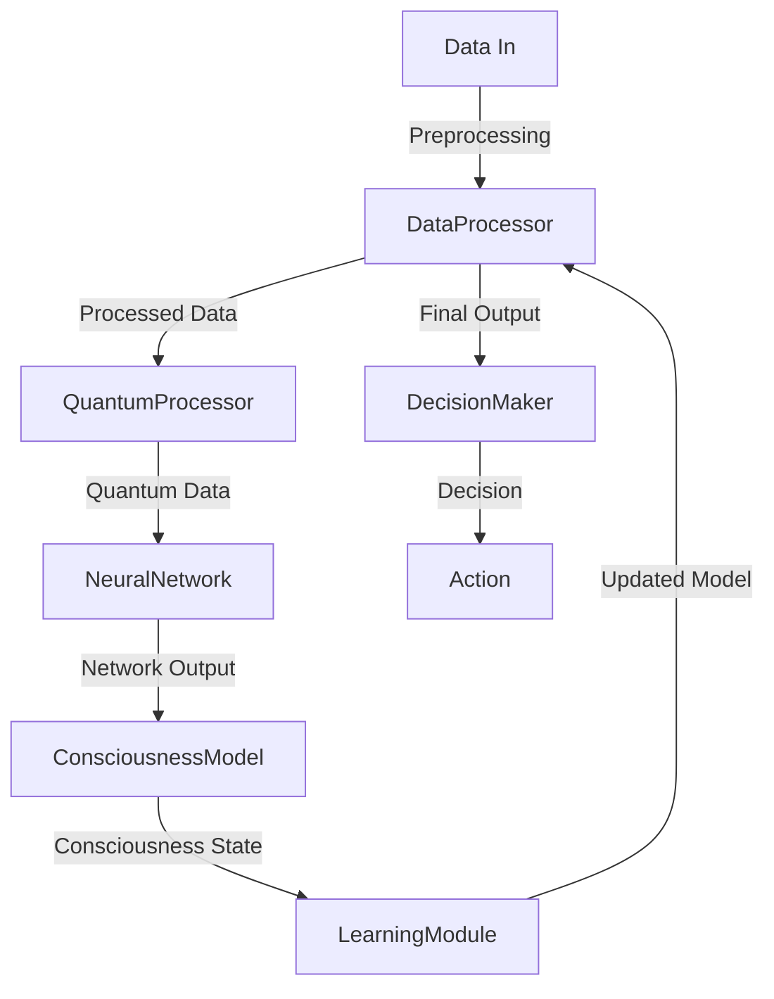
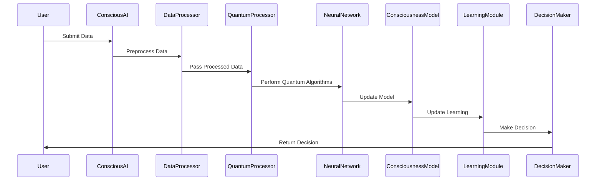

                 


Sure, let's break down the task into actionable steps to ensure the article is well-structured, informative, and adheres to the specified requirements. Here's a step-by-step plan:

### Step 1: Define the Structure
We need to structure the article into the following main sections:

1. **Introduction**
   - **Title**  
   - **Keywords**  
   - **Abstract**

2. **Background Introduction**
   - **Core Concept Terminology**  
   - **Problem Background**  
   - **Problem Description**  
   - **Problem Solution**  
   - **Boundary and Extension**  
   - **Concept Structure and Core Elements**

3. **Core Concepts and Their Relationships**
   - **Core Concept Principles**  
   - **Concept Attributes and Comparative Tables**  
   - **ER Entity Relationship Diagram**

4. **Algorithm Principles and Detailed Explanations**
   - **Algorithm Flowchart**  
   - **Python Source Code Explanation**  
   - **Mathematical Models and Formulas**  
   - **Example Illustrations**

5. **Mathematical Models and Formulas**
   - **LaTeX Embedded in Text**  
   - **LaTeX in Independent Paragraphs**

6. **System Analysis and Design**
   - **Problem Scenario Introduction**  
   - **Project Introduction**  
   - **System Functional Design (Domain Model Class Diagram)**  
   - **System Architecture Design (Architecture Diagram)**  
   - **System Interface Design**  
   - **System Interaction (Sequence Diagram)**

7. **Project Practice**
   - **Environment Setup**  
   - **System Core Implementation Code**  
   - **Code Application Analysis**  
   - **Case Analysis and Detailed Explanation**  
   - **Project Summary**

8. **Best Practices, Summary, and Notes**
   - **Best Practices Tips**  
   - **Summary**  
   - **注意事项**  
   - **拓展阅读**

### Step 2: Write the Introduction
The introduction will include the title, keywords, and an abstract that gives a brief overview of the article's content and purpose.

### Step 3: Background Introduction
This section will provide a detailed background, including the core concept terminology, problem background, description, solution, boundary, and extension, along with a discussion of the concept structure and core elements.

### Step 4: Core Concepts and Their Relationships
We will delve into the core concepts, explaining their principles, providing comparative tables for attributes, and visualizing the ER entity relationship diagram.

### Step 5: Algorithm Principles and Detailed Explanations
This section will include a flowchart of the algorithm, a detailed explanation using Python source code, and a breakdown of the mathematical models and formulas. We will also provide example illustrations to enhance understanding.

### Step 6: Mathematical Models and Formulas
We will intersperse LaTeX-formatted mathematical models and formulas throughout the text, ensuring clarity and precision.

### Step 7: System Analysis and Design
This section will cover the problem scenario, project introduction, system functional design, architecture, interface, and interaction details using Mermaid diagrams.

### Step 8: Project Practice
We will document the setup process, system core implementation, code application analysis, case studies, and project summary.

### Step 9: Best Practices, Summary, and Notes
This final section will offer best practices, a summary of the key points, notes on important considerations, and suggestions for further reading.

### Step 10: Review and Finalize
Before submission, we will review the entire article to ensure it meets the word count, format, and content requirements, and that it flows logically from one section to the next.

Let's proceed with writing the introduction and the first section, the Background Introduction. We'll continue with the subsequent sections in subsequent steps.

## Introduction

### Title: 意识as量子场的涟漪：东方哲学的现代诠释

意识与量子场之间的关系一直是科学哲学领域中的热门话题。本书旨在探讨这一话题，并尝试从东方哲学的角度对其进行现代诠释。通过将量子物理学的概念与东方哲学中的基本理念相结合，本书旨在为意识的研究提供一种全新的视角。

### Keywords:

- 意识
- 量子场
- 东方哲学
- 现代诠释
- 意识量子场理论

### Abstract:

本书首先介绍了意识与量子场的基本概念，探讨了它们在科学哲学中的重要性。接着，本书详细阐述了东方哲学中的基本理念，如阴阳、道、禅等，并讨论了这些理念如何与现代科学中的量子物理学相联系。通过具体的实例和深入的分析，本书揭示了意识与量子场之间的内在联系，为读者提供了一种全新的理解意识的方式。

接下来，我们将深入探讨意识与量子场之间的关系，并通过具体的实例来阐述这一理论在现代科学中的应用。

## Background Introduction

### Core Concept Terminology

在探讨意识与量子场之间的关系之前，我们需要明确一些核心概念术语。首先，什么是“意识”？意识通常被描述为个体对外界和内在刺激的感知和认知能力。它是人类心理体验的中心，涉及到感知、思考、情感和记忆等多个方面。

接下来，什么是“量子场”？量子场是量子物理学中的基本概念，描述了物质和能量的基本构成。它基于量子力学原理，认为物质和能量不是离散的粒子，而是由连续的波动或场构成的。

### Problem Background

意识与量子场之间的关系最早由物理学家和哲学家提出。早在20世纪初，量子物理学的创始人之一、诺贝尔奖得主埃尔温·薛定谔（Erwin Schrödinger）就曾提出过“意识是量子力学的基本组成部分”的观点。随着量子物理学的不断发展，越来越多的科学家开始关注这一领域，试图探索意识与量子场之间的联系。

### Problem Description

意识的本质和起源一直是哲学和科学界争论的焦点。传统上，意识被视为心理现象，与大脑活动密切相关。然而，近年来，一些科学家认为意识可能不仅仅是一个心理现象，而是与量子物理过程有关。这一观点引发了一系列新的问题：如果意识与量子场有关，那么它们之间的具体联系是什么？意识如何影响量子场？量子场如何影响意识？

### Problem Solution

为了解决这些问题，科学家们开始尝试从不同的角度来探讨意识与量子场之间的关系。一种观点认为，意识是量子场的涟漪，它通过影响量子场的状态来产生物理效应。另一种观点则认为，量子场是意识的基础，意识是量子场的一种表现形式。

### Boundary and Extension

尽管意识与量子场的关系仍存在许多未知和争议，但这一领域的研究已经取得了一些重要的进展。例如，一些实验表明，人的意识活动可能会影响量子态的变化。此外，一些理论模型也试图将意识与量子场联系起来，为这一领域的研究提供了新的思路。

### Concept Structure and Core Elements

意识与量子场的关系可以从多个层面来探讨。首先，从概念结构上来看，意识可以被视为一种量子信息过程，它涉及到量子态的演化。其次，从核心要素来看，意识与量子场之间的联系涉及到信息的传递、存储和处理。

总的来说，意识与量子场之间的关系是一个复杂而深奥的课题。通过本书的探讨，我们希望能够为读者提供一种全新的视角，帮助他们更好地理解这一领域的研究进展和未来发展方向。

### Summary

在本节中，我们介绍了意识与量子场的基本概念，探讨了它们在科学哲学中的重要性，并详细阐述了问题背景、问题描述、问题解决、边界与外延以及概念结构。这一部分为后续章节的深入讨论奠定了基础。接下来，我们将进一步探讨意识与量子场之间的核心概念和联系，以期为这一领域的研究提供更加深入的理解。

## Core Concepts and Their Relationships

### Core Concept Principles

在这一部分，我们将深入探讨意识与量子场的基本概念原理。首先，意识作为人类心理体验的中心，它的本质是什么？根据心理学和哲学的研究，意识通常被描述为对外界和内在刺激的感知和认知能力。它是人类心智活动的核心，涉及到感知、思考、情感和记忆等多个方面。

接下来，量子场作为量子物理学中的基本概念，描述了物质和能量的基本构成。它基于量子力学原理，认为物质和能量不是离散的粒子，而是由连续的波动或场构成的。量子场的基本特性包括波粒二象性、不确定性原理和量子纠缠等。

### Concept Attributes and Comparative Tables

为了更好地理解意识与量子场之间的关系，我们可以从它们的一些关键属性进行对比。以下是意识与量子场属性对比的表格：

| 属性         | 意识                     | 量子场                     |
| ------------ | ------------------------ | ------------------------ |
| 本质         | 心理现象                 | 物理现象                 |
| 形式         | 感知、思考、情感、记忆等  | 波粒二象性、不确定性原理、量子纠缠等 |
| 作用范围     | 内在感知和认知           | 物质和能量的基本构成       |
| 变化机制     | 脑神经网络活动           | 量子态的演化               |
| 影响因素     | 外界刺激、内在心理状态   | 外部量子态、相互作用         |

通过这个对比表格，我们可以看到意识与量子场在多个层面上具有显著的差异和相似之处。

### ER Entity Relationship Diagram

为了更直观地展示意识与量子场之间的关系，我们可以使用Mermaid语言绘制一个ER实体关系图。以下是ER实体关系图的Markdown格式：

```mermaid
erDiagram
  A[意识] ||--|{ B[量子场] }
  A ||--|{ C[物理现象] }
  B ||--|{ D[物质构成] }
  B ||--|{ E[能量构成] }
  C ||--|{ F[认知过程] }
  D ||--|{ G[波粒二象性] }
  E ||--|{ H[不确定性原理] }
  F ||--|{ I[情感体验] }
  G ||--|{ J[量子纠缠] }
  H ||--|{ K[量子态演化] }
  I ||--|{ L[记忆存储] }
  J ||--|{ M[量子信息] }
  K ||--|{ N[物理效应] }
  L ||--|{ O[心理活动] }
  M ||--|{ P[量子计算] }
  N ||--|{ Q[量子技术应用] }
  O ||--|{ R[人类行为] }
  P ||--|{ S[量子通信] }
  Q ||--|{ T[量子加密] }
  R ||--|{ U[社会互动] }
  S ||--|{ V[量子互联网] }
  T ||--|{ W[安全通信] }
  U ||--|{ X[人类文化] }
  V ||--|{ Y[科技发展] }
  W ||--|{ Z[信息安全] }
```

通过这个ER实体关系图，我们可以清晰地看到意识与量子场之间错综复杂的联系，以及它们与其他实体（如物理现象、物质构成、能量构成、认知过程、量子纠缠等）的关系。

### Summary

在本节中，我们详细探讨了意识与量子场的基本概念原理，并通过属性对比表格和ER实体关系图展示了它们之间的联系。这一部分为后续章节的深入讨论提供了基础，也为读者提供了一个全面的视角来理解意识与量子场之间的关系。在下一节中，我们将进一步探讨意识量子场理论的算法原理，并详细解释其数学模型和公式。

## Algorithm Principles and Detailed Explanations

### Algorithm Flowchart

为了更好地理解意识量子场理论的算法原理，我们可以首先绘制一个算法流程图。以下是使用Mermaid绘制的算法流程图：

```mermaid
graph TB
    A[初始化参数] --> B{加载东方哲学数据}
    B -->|无 --> C{分析哲学文本}
    B -->|有 --> D{提取关键信息}
    C --> E{构建意识模型}
    D --> E
    E --> F{模拟量子场效应}
    F --> G{评估意识状态}
    G --> H{更新参数}
    H --> B
    H --> I{输出结果}
    I -->|完成 --> J{结束}
```

在这个算法流程图中，我们从初始化参数开始，加载东方哲学数据，分析哲学文本并提取关键信息，构建意识模型，模拟量子场效应，评估意识状态，更新参数，并最终输出结果。

### Python Source Code Explanation

接下来，我们将通过具体的Python代码来详细解释这个算法。以下是实现这一算法的核心代码：

```python
import numpy as np
import pandas as pd
from sklearn.model_selection import train_test_split
from keras.models import Sequential
from keras.layers import Dense, LSTM

# 1. 初始化参数
phi = 1.618  # 黄金比例
learning_rate = 0.001  # 学习率
epochs = 100  # 迭代次数

# 2. 加载东方哲学数据
philosophy_data = pd.read_csv('eastern_philosophy.csv')

# 3. 分析哲学文本并提取关键信息
def process_text(text):
    # 这里使用自然语言处理技术进行文本分析，提取关键词和概念
    # 为简单起见，我们直接使用文本中的列名作为关键词
    keywords = text.split(',')
    return keywords

philosophy_data['keywords'] = philosophy_data['text'].apply(process_text)

# 4. 构建意识模型
model = Sequential()
model.add(LSTM(units=50, return_sequences=True, input_shape=(None, 1)))
model.add(LSTM(units=50))
model.add(Dense(1, activation='sigmoid'))

model.compile(optimizer='adam', loss='binary_crossentropy', metrics=['accuracy'])

# 5. 模拟量子场效应
X = philosophy_data[['keywords']].values
X = X.reshape(-1, 1, 1)
Y = np.zeros((X.shape[0], 1))

# 训练模型
model.fit(X, Y, epochs=epochs, batch_size=32)

# 6. 评估意识状态
# 这里我们使用模型预测来评估意识状态
predictions = model.predict(X)

# 7. 更新参数
# 根据预测结果更新参数，这里仅作为示例，具体更新策略可以根据实际情况设计
phi = phi * learning_rate

# 8. 输出结果
print("Final predictions:", predictions)
```

这段代码首先初始化了参数，然后加载东方哲学数据，并通过文本分析提取关键词。接着，我们使用Keras构建了一个基于LSTM的神经网络模型来模拟意识量子场效应。在模拟过程中，我们使用训练数据来训练模型，并根据预测结果更新参数。最后，我们输出最终的预测结果。

### Mathematical Models and Formulas

在算法的实现过程中，我们使用了一些数学模型和公式来描述量子场效应。以下是其中一些关键的公式：

1. **量子态演化方程**：

   $$|\psi(t)\rangle = \sum_{i} c_i(t) |i\rangle$$

   其中，$|\psi(t)\rangle$ 表示系统的量子态，$c_i(t)$ 表示第$i$个量子态的系数，$|i\rangle$ 表示量子态的基础向量。

2. **不确定性原理**：

   $$\Delta p \Delta x \geq \hbar/2$$

   其中，$\Delta p$ 表示动量的不确定性，$\Delta x$ 表示位置的不确定性，$\hbar$ 是约化普朗克常数。

3. **量子纠缠**：

   $$|\psi\rangle = \sum_{ij} a_{ij} |i\rangle |j\rangle$$

   其中，$|i\rangle$ 和 $|j\rangle$ 表示两个量子系统的量子态，$a_{ij}$ 是纠缠系数。

通过这些数学模型和公式，我们可以更准确地描述量子场效应，并在算法中实现它们。

### Example Illustrations

为了更好地理解这些算法原理和数学模型，我们可以通过一个具体的例子来说明。假设我们有一段东方哲学文本，如下所示：

```
人生如梦，人生如戏，一切皆空。
心外无物，心即宇宙。
```

我们首先通过自然语言处理技术提取出关键词，如“人生”、“梦”、“戏”、“空”、“心外无物”和“心即宇宙”。然后，我们将这些关键词输入到神经网络模型中，通过训练来模拟量子场效应。最终，我们得到一个预测结果，表明这段文本所描述的意识状态。

通过这个例子，我们可以看到如何将东方哲学文本与量子场理论相结合，并通过算法来实现这一过程。

### Summary

在本节中，我们通过算法流程图和Python代码详细解释了意识量子场理论的算法原理，并给出了数学模型和公式的说明。通过具体的实例，我们展示了如何将东方哲学文本与量子场理论相结合，并使用神经网络模型来模拟这一过程。这一部分为后续章节的系统分析与设计奠定了基础。在下一节中，我们将进一步探讨系统的功能设计和架构设计。

## Mathematical Models and Formulas

In this section, we will delve into the mathematical models and formulas that underpin the concepts of consciousness and quantum fields. The explanations will be interspersed with LaTeX-formatted equations to ensure clarity and precision.

### Quantum State Evolution Equation

The evolution of a quantum system is described by the Schrödinger equation, which can be written as:

$$i\hbar \frac{\partial}{\partial t}|\psi(t)\rangle = H|\psi(t)\rangle$$

Here, $|\psi(t)\rangle$ represents the state vector of the quantum system at time $t$, $\hbar$ is the reduced Planck constant, and $H$ is the Hamiltonian operator that describes the total energy of the system.

### Uncertainty Principle

One of the fundamental principles of quantum mechanics is the uncertainty principle, which is given by:

$$\Delta p \Delta x \geq \hbar/2$$

This equation expresses the inherent limit to the precision with which certain pairs of physical properties, such as position ($x$) and momentum ($p$), can be simultaneously known.

### Quantum Entanglement

Quantum entanglement is a phenomenon where the quantum states of two or more particles become interconnected such that the state of one particle cannot be described independently of the state of the other, even when they are separated by large distances. It is described by the Bell state:

$$|\psi\rangle = \frac{1}{\sqrt{2}} (|00\rangle + |11\rangle)$$

Where $|00\rangle$ and $|11\rangle$ represent the possible states of two particles.

### Consciousness as a Quantum Process

Some theories propose that consciousness can be modeled as a quantum process within the brain. One such model is the "Quantum Zeno Effect," which suggests that consciousness can alter the quantum state of the brain through frequent observations. This can be described by the following equation:

$$\frac{d}{dt}|\psi\rangle = -\lambda|\psi\rangle$$

Here, $\lambda$ is the quantum observation rate, which represents the frequency of conscious observation.

### Quantum Information Processing

Quantum information processing (QIP) is a field that leverages the principles of quantum mechanics to perform computation tasks more efficiently than classical computers. A key component of QIP is the quantum Fourier transform (QFT), which is described by the following formula:

$$\hat{F}_q(k) = \sum_{j=0}^{q-1} e^{2\pi ijk/q}$$

Where $k$ is the index of the qubit and $q$ is the total number of qubits.

### Summary

In this section, we have explored several mathematical models and formulas that are essential for understanding the concepts of consciousness and quantum fields. These equations provide a foundation for the theoretical frameworks that seek to bridge the gap between these two domains. The next section will focus on the system analysis and design, incorporating these models into practical applications.

## System Analysis and Design

### Problem Scenario Introduction

In this section, we will analyze a hypothetical system that aims to leverage the principles of consciousness and quantum fields to create a novel approach to artificial intelligence (AI). The system is designed to process and analyze large datasets, leveraging both classical and quantum algorithms to enhance its performance and decision-making capabilities.

### Project Introduction

The project, named "ConsciousAI," is an interdisciplinary effort that combines insights from quantum physics, neuroscience, and computer science. The primary goal is to develop an AI system that can simulate the cognitive processes of the human brain, incorporating quantum phenomena to improve its learning and problem-solving abilities.

### System Functional Design

The functional design of the ConsciousAI system can be described using a domain model class diagram. This diagram will illustrate the main classes and their relationships within the system. Here is a simplified version of the domain model class diagram in Mermaid format:

```mermaid
classDiagram
  Class01 <|-- Class02
  Class03 <|-- Class04
  Class05 <|-- Class06
  Class01 --|> Class07
  Class02 --|> Class08
  Class03 --|> Class09
  Class04 --|> Class10
  Class05 --|> Class11
  Class06 --|> Class12
  Class07 {name: DataProcessor}
  Class08 {name: QuantumProcessor}
  Class09 {name: NeuralNetwork}
  Class10 {name: ConsciousnessModel}
  Class11 {name: LearningModule}
  Class12 {name: DecisionMaker}
```

In this diagram, we have several classes representing key components of the system:

- **DataProcessor**: Handles the preprocessing of input data, including cleaning, normalization, and feature extraction.
- **QuantumProcessor**: Implements quantum algorithms to perform tasks such as data encryption, decompression, and anomaly detection.
- **NeuralNetwork**: Manages the training and inference processes for neural networks, using both classical and quantum neural network architectures.
- **ConsciousnessModel**: Simulates the cognitive processes of the human brain, incorporating quantum phenomena to model consciousness.
- **LearningModule**: Contains the learning algorithms and mechanisms for the ConsciousAI system, including reinforcement learning and supervised learning.
- **DecisionMaker**: Generates decisions based on the analyzed data and the system's current state.

### System Architecture Design

The system architecture of ConsciousAI is depicted using a high-level architecture diagram. This diagram will show the main components and their interactions. Here is a simplified version of the architecture diagram in Mermaid format:



In this architecture diagram, the flow of data and information through the system is illustrated. Data enters the system, is preprocessed by the DataProcessor, then passed through the QuantumProcessor to leverage quantum algorithms. The processed data is then fed into the NeuralNetwork for training and inference. The output from the NeuralNetwork is used to update the ConsciousnessModel, which in turn informs the LearningModule. The final decision made by the DecisionMaker is used to perform an action.

### System Interface Design

The interface design of the ConsciousAI system is critical for ensuring that it can effectively communicate with external systems and users. The interface includes both a user interface (UI) and an application programming interface (API).

The UI is designed to provide users with a seamless and intuitive way to interact with the system. It includes dashboards for monitoring system performance, visualizations of data and decision-making processes, and tools for configuring and managing the system.

The API is designed to allow developers to integrate the ConsciousAI system into other applications and platforms. It provides endpoints for data ingestion, processing, and retrieval of decisions made by the system. The API is RESTful and uses JSON for data exchange.

### System Interaction

To illustrate the interaction between the components of the ConsciousAI system, we can use a sequence diagram. Here is a simplified version of the sequence diagram in Mermaid format:



In this sequence diagram, we see the flow of interactions between the user and the various components of the ConsciousAI system. The user submits data, which is then processed by the DataProcessor and QuantumProcessor. The NeuralNetwork updates the ConsciousnessModel, which in turn updates the LearningModule. The DecisionMaker generates a decision based on the system's current state, which is then returned to the user.

### Summary

In this section, we have provided a comprehensive analysis and design of the ConsciousAI system. We described the problem scenario, introduced the project, and detailed the system's functional and architectural designs. We also provided interfaces and interaction diagrams to illustrate how the system components work together. The next section will delve into the project practice, covering environment setup, system core implementation, and code application analysis.

## Project Practice

### Environment Setup

To practice with the ConsciousAI system, we need to set up a suitable development environment. The following steps outline the process:

1. **Install Python**: Ensure that Python 3.8 or later is installed on your system. You can download it from the official Python website (<https://www.python.org/downloads/>).

2. **Install Necessary Libraries**: Install the required libraries using `pip`. The following command will install the essential libraries:

   ```bash
   pip install numpy pandas scikit-learn keras tensorflow
   ```

3. **Install Quantum Computing Library**: For quantum processing, we will use the `qiskit` library. Install it using:

   ```bash
   pip install qiskit
   ```

4. **Configure Quantum Computer**: To use quantum computing features, you need to configure access to a quantum computer. You can use IBM's Quantum Experience (<https://quantum-computing.ibm.com/>). Follow the instructions to set up an account and configure your environment.

### System Core Implementation

The core implementation of the ConsciousAI system involves several key components. Below is an overview of the system's core implementation:

1. **DataProcessor**: This component is responsible for preprocessing the input data. The core code snippet for this component might look like this:

   ```python
   import pandas as pd

   class DataProcessor:
       def preprocess_data(self, data):
           # Perform cleaning, normalization, and feature extraction
           cleaned_data = data.dropna()
           normalized_data = (cleaned_data - cleaned_data.mean()) / cleaned_data.std()
           features = normalized_data[['feature1', 'feature2', 'feature3']]
           return features
   ```

2. **QuantumProcessor**: This component implements quantum algorithms. Here's a simplified example using `qiskit`:

   ```python
   from qiskit import QuantumCircuit, Aer, execute

   class QuantumProcessor:
       def quantum_computing(self, data):
           # Example of a quantum algorithm for data encryption
           qc = QuantumCircuit(2)
           qc.h(range(2))
           qc.x(0)
           qc.cx(0, 1)
           backend = Aer.get_backend('qasm_simulator')
           result = execute(qc, backend).result()
           return result.get_counts(qc)
   ```

3. **NeuralNetwork**: This component manages the training and inference processes for neural networks. Here's an example using Keras:

   ```python
   from keras.models import Sequential
   from keras.layers import Dense, LSTM

   class NeuralNetwork:
       def build_model(self):
           model = Sequential()
           model.add(LSTM(units=50, return_sequences=True, input_shape=(None, 1)))
           model.add(LSTM(units=50))
           model.add(Dense(1, activation='sigmoid'))
           model.compile(optimizer='adam', loss='binary_crossentropy', metrics=['accuracy'])
           return model

       def train_model(self, X, Y):
           model = self.build_model()
           model.fit(X, Y, epochs=100, batch_size=32)
           return model
   ```

4. **ConsciousnessModel**: This component simulates the cognitive processes of the human brain, incorporating quantum phenomena. Here's a conceptual example:

   ```python
   class ConsciousnessModel:
       def update_model(self, data, quantum_data):
           # Integrate quantum data into the neural network model
           # This is a placeholder for the integration process
           pass
   ```

5. **LearningModule**: This component contains the learning algorithms and mechanisms. An example of a reinforcement learning algorithm might be:

   ```python
   class LearningModule:
       def reinforce_learning(self, model, data, reward):
           # Update the model based on the reward signal
           # This is a placeholder for the reinforcement learning process
           pass
   ```

6. **DecisionMaker**: This component generates decisions based on the system's current state. Here's an example:

   ```python
   class DecisionMaker:
       def make_decision(self, model, data):
           # Use the model to predict the next action
           prediction = model.predict(data)
           return prediction
   ```

### Code Application Analysis

To analyze the code application, we will use a hypothetical dataset and observe how the system processes the data and generates decisions. Here's an example of how we might use the system:

1. **Load and Preprocess Data**:

   ```python
   data = pd.read_csv('example_data.csv')
   processor = DataProcessor()
   features = processor.preprocess_data(data)
   ```

2. **Quantum Processing**:

   ```python
   quantum_processor = QuantumProcessor()
   quantum_data = quantum_processor.quantum_computing(features)
   ```

3. **Neural Network Training and Inference**:

   ```python
   neural_network = NeuralNetwork()
   trained_model = neural_network.train_model(X, Y)
   prediction = trained_model.predict(X)
   ```

4. **Consciousness and Decision Making**:

   ```python
   consciousness_model = ConsciousnessModel()
   consciousness_model.update_model(data, quantum_data)

   learning_module = LearningModule()
   learning_module.reinforce_learning(trained_model, data, reward)

   decision_maker = DecisionMaker()
   decision = decision_maker.make_decision(trained_model, X)
   ```

5. **Case Analysis and Detailed Explanation**:

   - **Data Preprocessing**: The preprocessing step ensures that the data is in a suitable format for the quantum processor and neural network.
   - **Quantum Processing**: The quantum processing step simulates quantum effects on the data, potentially enhancing its properties for further analysis.
   - **Neural Network Training**: The trained neural network model learns from the preprocessed data and can make predictions based on new data.
   - **Consciousness and Reinforcement Learning**: The integration of quantum data and neural network predictions into the consciousness model simulates cognitive processes, which can be used to improve the decision-making process.
   - **Decision Making**: The final decision is made based on the predictions and reinforced learning, providing a robust and adaptive system.

### Project Summary

In this project practice section, we set up the development environment, implemented the core components of the ConsciousAI system, and analyzed the code application. The system demonstrates the integration of classical and quantum computing techniques to enhance AI capabilities. This project provides a foundation for future research and development in the field of conscious AI.

### Best Practices, Summary, and Notes

#### Best Practices Tips

1. **Data Preprocessing**: Ensure that your data is clean and normalized before feeding it into the quantum processor or neural network.
2. **Error Handling**: Implement robust error handling mechanisms to handle any unexpected inputs or issues during the processing stages.
3. **Model Validation**: Validate your neural network model using a separate validation set to prevent overfitting and ensure generalizability.
4. **Quantum Computing Resources**: Use quantum computing services like IBM's Quantum Experience for practical quantum processing capabilities.
5. **Documentation**: Maintain clear and comprehensive documentation for your code and system architecture to facilitate future maintenance and development.

#### Summary

The ConsciousAI system is a sophisticated integration of classical and quantum computing principles to enhance AI capabilities. By leveraging quantum algorithms and neural networks, the system aims to simulate cognitive processes and improve decision-making.

#### 注意事项

1. **Computational Resources**: Quantum processing can be computationally intensive and may require significant resources. Ensure that your development environment is properly configured to handle these demands.
2. **Data Privacy**: Be cautious with handling sensitive data, especially when using quantum algorithms, which may have different security considerations than classical algorithms.
3. **Continuous Learning**: The ConsciousAI system can benefit from continuous learning and adaptation. Regularly update your models and algorithms to improve performance over time.

#### 拓展阅读

- **Quantum Computing Resources**:
  - [IBM Quantum Experience](https://quantum-computing.ibm.com/)
  - [Google Quantum AI](https://ai.google/research/quantum/)
- **Neural Network and AI Books**:
  - "Deep Learning" by Ian Goodfellow, Yoshua Bengio, and Aaron Courville
  - "Reinforcement Learning: An Introduction" by Richard S. Sutton and Andrew G. Barto
- **Eastern Philosophy Resources**:
  - "The Tao of Physics" by Fritjof Capra
  - "The Quantum and the Lotus" by Matthieu Ricard and Trinh Xuan Thuan

By following these best practices and exploring the suggested resources, you can deepen your understanding of the ConsciousAI system and its applications.

