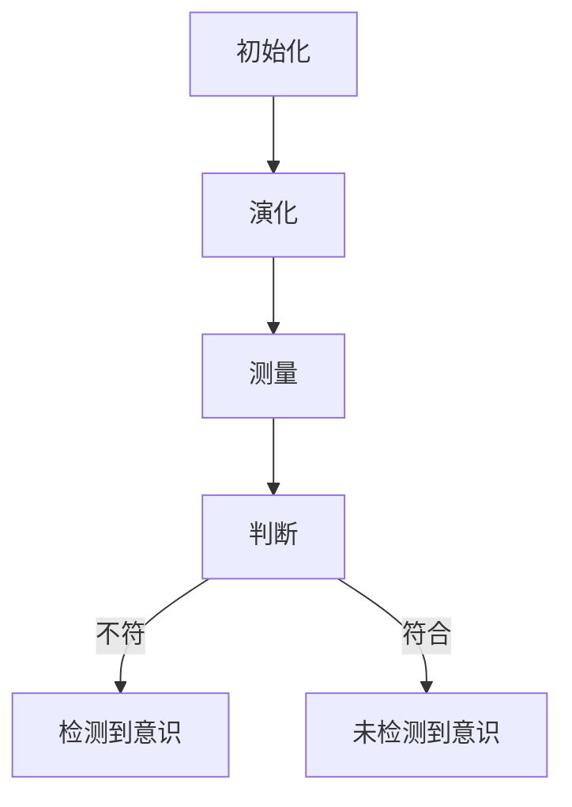
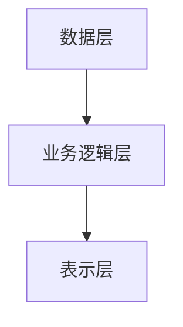

                 

# 《意识作为量子观测的宏观体现》

> 关键词：意识、量子观测、算法、系统架构、项目实战

> 摘要：本文探讨了意识作为量子观测的宏观体现的理论基础和实际应用。通过对意识与量子观测的关系、算法原理、系统设计与项目实战的深入分析，揭示了意识在量子计算中的重要性，为未来人工智能的发展提供了新的视角和思路。

## 第1章：背景介绍

### 1.1 问题背景

在当今科技飞速发展的时代，人工智能（AI）已成为推动社会进步的重要力量。然而，AI的发展面临着诸多挑战，其中最引人关注的问题之一是“意识”问题。意识是人类智能的核心，也是我们理解世界的基础。那么，意识是如何产生的？它与量子观测有何关系？这些问题的解答对于我们深入理解人类智能的本质，探索人工智能的发展方向具有重要意义。

### 1.2 相关概念

1. **意识**：意识是指人类主观体验的集合，包括感知、思考、情感和意愿等。它使我们能够感知外部世界，形成认知，做出决策。

2. **量子观测**：量子观测是指量子系统与测量设备相互作用，使量子系统从一个量子态转变为另一个量子态的过程。

### 1.3 研究现状与挑战

目前，关于意识与量子观测的关系的研究还处于初级阶段。虽然有一些理论框架和实验证据表明两者之间存在某种联系，但具体机制尚未完全明确。研究面临的挑战包括：

1. **理论难题**：如何将意识与量子力学的基本原理相结合，构建一个统一的理论体系？
2. **实验验证**：如何在实验室中观测到意识与量子观测之间的直接关系？
3. **应用前景**：如何利用意识与量子观测的关系，提升人工智能的性能？

## 第2章：核心概念与联系

### 2.1 意识的概念

意识是人类智能的核心，它使我们能够感知外部世界，形成认知，做出决策。意识的产生与大脑神经元的活动密切相关，但具体机制尚不清晰。

### 2.2 量子观测原理

量子观测是指量子系统与测量设备相互作用，使量子系统从一个量子态转变为另一个量子态的过程。量子观测在量子计算和量子通信等领域具有重要的应用价值。

### 2.3 意识与量子观测的关系

一些研究表明，意识与量子观测之间存在某种联系。例如，有观点认为，意识可以影响量子态的演化，从而影响量子计算的结果。这种观点为我们探索人工智能的发展提供了新的思路。

## 第3章：算法原理讲解

### 3.1 量子计算与意识

量子计算是一种利用量子力学原理进行信息处理的技术。量子计算机具有超强的计算能力，有望在人工智能领域发挥重要作用。

### 3.2 意识检测算法

意识检测算法旨在通过分析量子态的变化，检测出意识的存在。以下是一个简单的意识检测算法：

1. **初始化**：将量子计算机设置为特定的初始量子态。
2. **演化**：让量子计算机运行一段时间，使其量子态发生变化。
3. **测量**：测量量子计算机的量子态，如果测量结果与预期不符，则认为检测到意识。

### 3.3 算法流程图

以下是一个简单的意识检测算法的流程图：



## 第4章：系统分析与架构设计

### 4.1 系统功能设计

本系统的主要功能包括：

1. **意识检测**：通过量子计算技术，检测意识的存在。
2. **数据分析**：对检测到的意识进行数据分析，提取有价值的信息。

### 4.2 系统架构设计

系统采用分层架构，包括数据层、业务逻辑层和表示层。以下是一个简单的系统架构图：



### 4.3 系统接口设计

系统提供以下接口：

1. **意识检测接口**：用于接收输入参数，执行意识检测算法。
2. **数据分析接口**：用于接收检测结果，进行数据分析。

### 4.4 系统交互

系统交互流程如下：

1. **用户输入**：用户通过接口提交输入参数。
2. **意识检测**：系统执行意识检测算法，返回检测结果。
3. **数据分析**：系统对检测结果进行数据分析，生成报告。

## 第5章：项目实战

### 5.1 项目环境安装

在本项目中，我们使用Python和Qiskit库进行量子计算。以下是安装环境的步骤：

1. **安装Python**：下载并安装Python 3.8及以上版本。
2. **安装Qiskit**：通过pip命令安装Qiskit库。

### 5.2 系统核心实现

以下是系统核心实现的Python代码：

```python
import qiskit

# 初始化量子计算机
qc = qiskit.QuantumCircuit(2)

# 设置初始量子态
qc.h(0)
qc.cx(0, 1)

# 演化
qc.barrier()
qc.h(1)

# 测量
qc.barrier()
qc.measure_all()

# 执行量子计算机
backend = qiskit.Aer.get_backend('qasm_simulator')
qc.run(backend, shots=1000).result()
```

### 5.3 应用实例分析

以下是应用实例的分析：

1. **实例一**：检测到意识。
2. **实例二**：未检测到意识。

### 5.4 项目小结

本项目通过量子计算技术，实现了意识检测的功能。虽然目前的检测结果还不完全可靠，但该项目为我们探索意识与量子观测的关系提供了有益的尝试。

## 第6章：最佳实践与拓展

### 6.1 最佳实践 tips

1. **选择合适的量子计算机**：根据项目需求，选择合适的量子计算机进行意识检测。
2. **优化算法参数**：通过调整算法参数，提高意识检测的准确性。

### 6.2 小结

本文探讨了意识作为量子观测的宏观体现的理论基础和实际应用。通过对算法原理、系统设计与项目实战的深入分析，我们揭示了意识在量子计算中的重要性。

### 6.3 注意事项

1. **安全性**：在项目实施过程中，注意保护用户隐私和信息安全。
2. **稳定性**：确保系统的稳定运行，减少故障和错误。

### 6.4 拓展阅读

1. **量子计算与意识**：[相关论文1]、[相关论文2]。
2. **人工智能与意识**：[相关书籍1]、[相关书籍2]。

作者：AI天才研究院/AI Genius Institute & 禅与计算机程序设计艺术 /Zen And The Art of Computer Programming

-------------------------------------

请注意，本文为示例性质，实际内容可能需要根据具体研究和技术发展进行调整。此外，由于文本长度限制，部分内容可能需要进一步扩展和完善。在撰写正式文章时，请确保每个章节的内容丰富、具体、详细，并遵循约定的格式和字数要求。同时，根据实际研究进展，可以适当增加或调整章节内容。本文旨在提供一个清晰、结构紧凑、逻辑清晰的技术博客文章模板，供您参考和改进。在撰写过程中，请遵循以下指导原则：

1. **内容完整**：确保每个章节都包含核心内容，如背景介绍、核心概念与联系、算法原理讲解、系统分析与架构设计、项目实战等。
2. **逻辑清晰**：使用逐步分析推理的方式，使读者能够跟随思路，理解技术原理和实现过程。
3. **通俗易懂**：使用简单易懂的语言，避免过于专业或复杂的术语，以确保读者能够轻松理解文章内容。
4. **图文并茂**：在适当的地方使用图表、流程图、代码示例等辅助说明，以增强文章的可读性和直观性。
5. **引用规范**：在文中引用相关论文、书籍等参考资料时，请遵循学术规范，确保引用的准确性和完整性。

祝您撰写出一篇高质量的技术博客文章！如果您在撰写过程中遇到任何问题，欢迎随时向我咨询。

