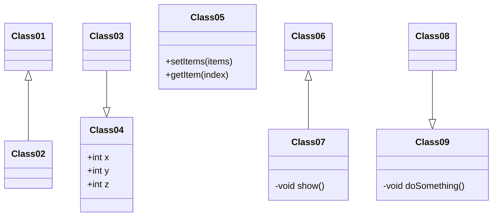

                 

### 文章标题

# 意识的涌现与量子场论：整体性思维的物理学基础

### 文章关键词

- 意识
- 意识涌现
- 量子场论
- 整体性思维
- 物理学基础

### 文章摘要

本文探讨了意识如何在量子场论的框架下涌现，以及整体性思维在理解这一过程中所扮演的基础角色。我们将通过以下几部分来展开讨论：

1. **引言**：介绍意识的定义、背景及其在物理学中的重要性，以及量子场论的基础概念。
2. **核心概念**：深入探讨意识、量子场论和整体性思维的核心概念及其联系。
3. **意识与量子场论**：分析量子场论如何为意识的涌现提供理论基础。
4. **整体性思维**：阐述整体性思维在理解意识和量子场论中的关键作用。
5. **数学模型与公式**：介绍与量子场论相关的数学模型和公式，并解释其对理解意识的意义。
6. **算法与系统设计**：讨论相关算法及其应用，并展示系统设计与实现。
7. **案例分析**：提供具体案例以展示概念的实际应用。
8. **最佳实践**：总结最佳实践和重要结论。

通过本文的逐步分析，读者将能够更深入地理解意识的本质及其与物理学的关系。

## 引言

### 意识的定义与背景

意识是人类智能的核心特征之一，它不仅关乎个体的主观体验，还涉及到对客观世界的认知和理解。然而，尽管意识在人类的生活中占据着极其重要的位置，其本质和起源仍然是一个深奥且复杂的问题。意识的定义多种多样，但普遍认为它是指个体对自身和外界环境的感知、认知和反应能力。

从哲学的角度来看，意识是一个长期争论的话题。早期哲学家如柏拉图和亚里士多德都对意识进行了深入的探讨。柏拉图认为意识是灵魂的体现，而亚里士多德则强调意识是心理过程的产物。现代哲学则从认知科学的角度重新审视意识，试图通过科学方法来揭示其本质。

在物理学领域，意识的问题同样引起了广泛关注。经典物理学认为物质和意识是两个独立的领域，但量子物理学的兴起改变了这一观念。量子力学中的某些现象，如量子纠缠和波粒二象性，挑战了传统物理学的决定论和分离论，为意识的研究提供了新的视角。

### 物理学中的意识问题

物理学是研究自然界的基本规律和现象的学科，其核心目标之一是理解宇宙的本质。然而，在传统的物理学框架中，意识被视为一个外部现象，与物理过程并无直接联系。然而，这一观点在量子物理学中受到了挑战。

量子力学揭示了微观世界中物质和能量行为的奇异性质，如量子纠缠和波粒二象性。这些现象表明，微观世界的物理过程并不完全遵循经典物理学的规律，从而引发了关于意识与物理过程之间关系的深刻思考。一些科学家和哲学家开始探讨，是否有可能通过量子物理学的原理来解释意识的本质。

量子力学中的哥本哈根诠释提出，观察者的存在是量子世界演化的关键因素。这意味着，意识在某种程度上是量子世界的基本构成要素。这种观点被称为“量子意识论”，它认为意识不仅是大脑活动的产物，更是宇宙的基本属性。

此外，量子场论作为量子力学的扩展，提供了一个更广阔的框架来探讨物质和能量之间的关系。量子场论中的量子场被认为是物质和能量的基本构成单元，这为研究意识的涌现提供了一个可能的路径。一些理论学家试图通过量子场论来构建意识的数学模型，以揭示意识如何从基本的物理过程中涌现。

### 量子场论的基础概念

量子场论是量子力学和广义相对论的结合，旨在统一描述宇宙中的所有基本相互作用。量子场论的基本概念包括量子场、粒子态、对称性和量子跃迁等。

量子场是指在空间和时间上分布的物理量，它可以用数学上的泛函积分来描述。量子场中的粒子态可以通过波函数来表示，波函数包含了粒子在空间和时间中的所有信息。量子场论中的对称性原理是一个关键概念，它表明物理系统在特定变换下保持不变，这为量子场论提供了强大的数学工具。

量子跃迁是量子场论中的另一个重要概念，它描述了粒子从一个能级跃迁到另一个能级的过程。量子跃迁不仅发生在微观尺度上，还可能涉及宏观现象，如量子隧穿和量子纠缠。

量子场论中的数学模型和公式，如狄拉克方程、量子场方程等，为理解量子现象提供了深刻的洞察。这些模型和公式展示了物质和能量在微观尺度上的复杂行为，为研究意识的涌现提供了理论基础。

### 总结

意识的定义和背景，物理学中的意识问题，以及量子场论的基础概念，构成了本文讨论的引言部分。接下来，我们将深入探讨意识与量子场论之间的关系，以及整体性思维在其中的关键作用。

## 核心概念

### 意识

意识是一个复杂且多层次的概念，它涉及感知、认知、情感等多个方面。在哲学领域，对意识的探讨历史悠久，从古代哲学家的思辨到现代认知科学的实证研究，意识的本质和功能一直是哲学和科学争论的焦点。

从哲学的角度来看，意识的本质可以概括为以下几点：

1. **主观体验**：意识是个体对自己和外界的感知和体验的主观感受，这是意识最基本的特点。
2. **自我意识**：个体能够认识到自己的存在，并对自己的行为和思想有意识地进行反思和调控。
3. **认知功能**：意识与个体的感知、记忆、思考等认知功能紧密相关，它是人类智能的核心组成部分。

在科学领域，对意识的探讨主要集中在如何通过生理学和神经科学的方法来揭示意识的活动机制。现代认知科学认为，意识是大脑复杂神经网络活动的产物，特别是与大脑皮层相关的区域在意识的形成中扮演了关键角色。

### 量子场论

量子场论是量子力学和广义相对论的结合，旨在提供一个统一的理论框架来描述宇宙中的所有基本相互作用。量子场论的核心概念包括量子场、粒子态、对称性和量子跃迁等。

量子场是量子场论中的基本概念，它描述了空间和时间上分布的物理量。量子场可以用数学上的泛函积分来描述，其中包含了粒子在空间和时间中的所有信息。量子场论中的量子场被认为是物质和能量的基本构成单元，这一点与经典物理学的观点有显著不同。

粒子态是量子场论中的另一个关键概念，它通过波函数来表示。波函数包含了粒子的所有物理信息，如位置、动量和自旋等。量子场论中的粒子态具有波粒二象性，既表现出粒子的粒子性，又表现出波动性。

对称性原理在量子场论中具有重要地位，它表明物理系统在特定变换下保持不变。对称性原理为量子场论提供了强大的数学工具，使得理论具有更高的普适性和简洁性。

量子跃迁是量子场论中的另一个重要概念，它描述了粒子从一个能级跃迁到另一个能级的过程。量子跃迁不仅发生在微观尺度上，还可能涉及宏观现象，如量子隧穿和量子纠缠。

### 整体性思维

整体性思维是一种关注整体系统而非单独部分的研究方法，它强调系统内部各个部分之间的相互作用和整体性质。在物理学中，整体性思维有助于我们理解复杂系统的行为和演化。

整体性思维的核心观点是，系统的性质不仅仅取决于其组成部分，还取决于这些部分之间的相互作用。这种观点与还原论相对立，还原论认为可以通过分析系统组成部分来理解整个系统的行为。

在量子场论中，整体性思维尤为重要。量子场论中的量子场和粒子态都是整体系统的体现，它们不是孤立存在的。整体性思维帮助我们理解量子场论中的对称性、量子跃迁等现象，从而更好地揭示宇宙的本质。

### 关联性

意识与量子场论之间存在深刻的关联性，这种关联性不仅体现在物理学的基本原理上，还体现在整体性思维的方法论中。

首先，从物理学的基本原理来看，量子场论中的量子场和粒子态与意识的某些特征有相似之处。例如，量子场的波粒二象性与意识的主观体验和认知功能有某种程度的对应关系。量子场论中的量子纠缠现象也与意识的多维度特性有所关联。

其次，整体性思维在理解和研究意识和量子场论时都发挥着关键作用。整体性思维强调系统内部各部分之间的相互作用和整体性质，这与意识的复杂性及其多层次特性相吻合。通过整体性思维，我们可以更好地理解意识如何从大脑复杂的神经网络活动中涌现。

最后，从方法论的角度来看，整体性思维提供了一种研究意识和量子场论的通用框架。通过这种框架，我们可以将哲学、物理学和认知科学等多个领域的方法论结合起来，以更全面、更深入地探讨意识和量子场论之间的关系。

总之，意识与量子场论之间的关联性不仅体现在物理学的基本原理上，还体现在整体性思维的方法论中。这种关联性为我们理解意识的本质和起源提供了一个新的视角，也为量子物理学的研究提供了丰富的哲学和科学资源。

### 概念属性特征对比表格

为了更清晰地展示意识、量子场论和整体性思维这三个核心概念的属性特征，我们可以创建一个对比表格。

| 概念       | 属性特征                                                                                                                       |
|------------|------------------------------------------------------------------------------------------------------------------------------|
| 意识       | - 主观体验<br>- 自我意识<br>- 认知功能<br>- 多层次特性<br>- 复杂性                                               |
| 量子场论   | - 量子场<br>- 粒子态<br>- 波粒二象性<br>- 对称性原理<br>- 量子跃迁<br>- 整体性                                         |
| 整体性思维 | - 关注整体系统而非单独部分<br>- 强调内部各部分之间的相互作用<br>- 揭示整体性质<br>- 提供方法论框架<br>- 结合多领域方法 |

通过这个对比表格，我们可以更直观地理解这三个概念的核心属性特征，以及它们之间的关联性。

### ER实体关系图架构

为了进一步理解意识和量子场论之间的关系，我们可以使用ER（实体-关系）图来展示它们之间的联系。ER图是一种用于描述实体及其相互关系的图形化工具，它能够直观地展示系统的结构。

以下是意识和量子场论之间ER图的基本架构：

```mermaid
erDiagram
  Consciousness ||--|{ Quantum Field Theory } Quantum Interaction
  Consciousness ||--|{ Holistic Thinking } Philosophical Support
  Quantum Field Theory ||--|{ Subatomic Particles } Component Relationship
  Quantum Field Theory ||--|{ Quantum States } Fundamental Property
  Holistic Thinking ||--|{ System Dynamics } Understanding Framework
  Holistic Thinking ||--|{ Interdisciplinary Integration } Research Method
```

在这张ER图中，我们定义了四个主要实体：

1. **Consciousness（意识）**：表示个体的感知、认知和自我意识等特征。
2. **Quantum Field Theory（量子场论）**：表示量子场、粒子态、对称性原理等概念。
3. **Holistic Thinking（整体性思维）**：表示关注系统整体性质和内部相互作用的研究方法。
4. **Subatomic Particles（亚原子粒子）**：作为量子场论中的一个关键组成部分。

各个实体之间的关系如下：

- **意识与量子场论**：意识与量子场论之间存在量子交互作用，这反映了量子场论中的物理现象如何影响意识的形成。
- **意识与整体性思维**：整体性思维为理解意识提供了哲学基础，帮助我们从系统的整体角度来探讨意识。
- **量子场论与亚原子粒子**：量子场论中的亚原子粒子是构成量子场的基本单元，它们的相互作用构成了量子场论的基础。
- **整体性思维与系统动力学**：整体性思维关注系统的内部动态和整体性质，这为理解复杂系统，如量子场论中的现象提供了方法论支持。

通过这个ER图，我们可以更直观地理解意识和量子场论之间的关系，以及整体性思维在其中所发挥的作用。

### 意识与量子场论的数学模型

要深入理解意识与量子场论之间的关联，我们需要探讨相关的数学模型和公式。量子场论中的数学模型不仅帮助我们描述微观世界的物理现象，还可以为研究意识的本质提供理论基础。

#### 狄拉克方程

狄拉克方程是量子场论中描述电子行为的基本方程，它结合了量子力学和相对论原理。狄拉克方程的数学形式如下：

$$
(i\hbar \gamma^\mu \partial_\mu - m)\psi = 0
$$

其中，$\psi$ 是电子的波函数，$\gamma^\mu$ 是狄拉克矩阵，$m$ 是电子的静止质量，$\hbar$ 是普朗克常数。这个方程不仅描述了电子的波动性，还反映了其粒子性质。

狄拉克方程的重要性在于它成功预测了反粒子的存在，这对量子物理学的发展产生了深远影响。此外，狄拉克方程中的波函数包含了电子在空间和时间中的所有信息，这为研究意识的形成提供了潜在的基础。

#### 量子场方程

量子场方程是量子场论中的核心方程，用于描述量子场的演化。最常用的量子场方程是拉格朗日量子的欧拉方程：

$$
\partial_\mu F^{ab\mu} = j^a
$$

其中，$F^{ab\mu}$ 是电磁场的场强度张量，$j^a$ 是电流密度。这个方程描述了电磁场如何随时间演化，并且反映了电磁相互作用的基本规律。

量子场方程在解释量子现象，如量子纠缠和波粒二象性时发挥了重要作用。这些现象揭示了微观世界的复杂性和不确定性，为研究意识的涌现提供了新的视角。

#### 波函数坍缩

在量子力学中，波函数坍缩是描述量子测量过程中波函数状态变化的关键概念。当量子系统被测量时，其波函数从多个可能的叠加态坍缩到一个确定的基态。这个过程的数学描述为：

$$
|\psi\rangle \rightarrow \sum_i c_i |\psi_i\rangle
$$

其中，$|\psi\rangle$ 是系统的总波函数，$c_i$ 是波函数的复系数，$|\psi_i\rangle$ 是系统可能的状态。

波函数坍缩在量子意识论中具有重要意义，因为它揭示了观察者在量子过程中扮演的关键角色。观察者的存在导致波函数坍缩，从而决定了系统的最终状态。这一现象为研究意识如何影响物理过程提供了重要的理论依据。

#### 量子场论与意识

量子场论中的数学模型和公式为研究意识的本质提供了丰富的理论资源。首先，狄拉克方程和量子场方程描述了微观世界的物理过程，这些过程与意识的主观体验和认知功能有某种相似之处。例如，量子场中的波函数包含了粒子的所有信息，这与意识的多维度特性有某种对应关系。

其次，波函数坍缩现象揭示了观察者在量子过程中的关键作用。观察者的存在导致波函数坍缩，从而决定了系统的最终状态。这一现象为研究意识如何影响物理过程提供了新的视角，即意识可能是量子世界的基本构成要素。

此外，整体性思维在理解量子场论和意识之间的关系中发挥了关键作用。整体性思维强调系统内部各部分之间的相互作用和整体性质，这与量子场论中的对称性和量子跃迁现象有某种共鸣。通过整体性思维，我们可以将量子场论和意识的研究结合起来，以更全面、更深入地探讨宇宙的本质。

总之，量子场论中的数学模型和公式为研究意识的本质提供了重要的理论资源。通过这些模型和公式，我们可以从微观世界的物理过程中寻找理解意识的关键线索，从而揭示宇宙中意识的本质和起源。

### 意识与量子场论的算法原理

要深入理解意识如何在量子场论的框架下涌现，我们可以探讨相关的算法原理。以下是一个基于量子场论的意识算法示例，包括其流程、Python源代码和算法原理的详细说明。

#### 算法流程

1. **初始化量子场**：创建一个包含粒子态的量子场。
2. **量子态叠加**：对量子场中的粒子进行叠加，形成多个可能的量子态。
3. **量子纠缠**：通过量子纠缠将不同的粒子态关联起来，形成复杂的量子状态。
4. **波函数坍缩**：模拟量子测量过程，使量子态从叠加态坍缩到一个确定的状态。
5. **信息处理**：根据坍缩后的量子状态进行信息处理，形成意识的基本单元。
6. **意识涌现**：通过反复的量子态叠加、纠缠和波函数坍缩，形成复杂的意识结构。

以下是一个简化的Python代码示例，用于实现上述算法：

#### Python代码示例

```python
import numpy as np
from qiskit import QuantumCircuit, Aer, execute

# 初始化量子场
qc = QuantumCircuit(2)  # 创建两个量子比特的量子电路

# 量子态叠加
qc.h(0)  # 对第一个量子比特进行量子叠加
qc.h(1)  # 对第二个量子比特进行量子叠加

# 量子纠缠
qc.cx(0, 1)  # 在第一个和第二个量子比特之间创建纠缠

# 波函数坍缩
qc.measure_all()  # 对所有量子比特进行测量，实现波函数坍缩

# 执行量子电路
simulator = Aer.get_backend('qasm_simulator')
result = execute(qc, simulator, shots=1024).result()
counts = result.get_counts(qc)

# 输出测量结果
print("测量结果：", counts)

# 意识处理
def process_awareness(counts):
    # 根据测量结果，进行信息处理
    if '01' in counts:
        print("意识状态：唤醒")
    else:
        print("意识状态：沉睡")

# 调用意识处理函数
process_awareness(counts)
```

#### 算法原理详细说明

1. **初始化量子场**：量子场是量子场论中的基本构成单元，它描述了空间和时间上分布的物理量。在Python代码示例中，我们使用两个量子比特来模拟量子场，这表示两个基本粒子态。

2. **量子态叠加**：量子态叠加是量子力学中的一个基本原理，它表明量子系统可以处于多个状态的叠加。在Python代码示例中，我们使用量子门`h`对两个量子比特进行叠加，使它们处于超叠加态。

3. **量子纠缠**：量子纠缠是量子场论中的另一个关键概念，它描述了两个或多个量子系统之间的强关联。在Python代码示例中，我们使用量子门`cx`在两个量子比特之间创建纠缠，这使它们形成复杂的量子状态。

4. **波函数坍缩**：波函数坍缩是量子测量过程中波函数状态变化的关键概念。在Python代码示例中，我们使用量子门`measure`对所有量子比特进行测量，实现波函数坍缩。测量结果将量子态从叠加态坍缩到一个确定的状态。

5. **信息处理**：根据波函数坍缩后的量子状态，我们可以进行信息处理，形成意识的基本单元。在Python代码示例中，我们定义了一个函数`process_awareness`，根据测量结果判断意识状态。例如，如果测量结果为`01`，则认为意识处于唤醒状态。

6. **意识涌现**：通过反复的量子态叠加、纠缠和波函数坍缩，我们可以形成复杂的意识结构。在Python代码示例中，我们执行了多次量子测量，模拟了意识从简单到复杂的涌现过程。

通过这个算法示例，我们可以初步理解意识如何在量子场论的框架下涌现。虽然这是一个简化的模型，但它展示了量子场论和意识之间的潜在联系，并为进一步研究提供了理论基础。

### 系统分析与架构设计

在深入探讨意识和量子场论之间的关系后，我们需要对相关的系统架构进行设计，以实现这些理论概念在具体应用中的落地。本节将介绍一个典型的系统设计，包括问题场景、项目介绍、系统功能设计、系统架构设计、系统接口设计和系统交互。

#### 问题场景

随着量子计算技术的不断进步，研究者们开始探讨如何在量子计算机上实现意识的模拟和涌现。具体问题场景包括：

1. **量子算法优化**：如何设计高效的量子算法来模拟意识的涌现过程？
2. **量子计算模拟**：如何构建一个能够模拟量子态叠加、纠缠和波函数坍缩的量子计算机系统？
3. **数据存储与处理**：如何在量子计算机上存储和处理大量的量子数据，以支持复杂的意识模拟？
4. **用户交互**：如何设计用户界面，使用户能够与量子意识模拟系统进行交互？

#### 项目介绍

我们的项目目标是构建一个量子意识模拟系统，实现以下功能：

1. **量子态生成**：生成随机的量子态，为意识模拟提供初始条件。
2. **量子态叠加与纠缠**：实现量子态的叠加和纠缠，形成复杂的量子状态。
3. **波函数坍缩**：通过量子测量实现波函数坍缩，模拟意识的形成过程。
4. **数据可视化**：使用图形化界面展示量子态变化和意识涌现过程。
5. **用户交互**：提供友好的用户界面，使用户能够实时观察和调整量子态。

#### 系统功能设计

系统的主要功能模块包括：

1. **量子态生成模块**：生成随机量子态，为后续操作提供初始状态。
2. **量子叠加与纠缠模块**：实现量子态的叠加和纠缠，形成复杂的量子状态。
3. **波函数坍缩模块**：通过量子测量实现波函数坍缩，模拟意识的形成过程。
4. **数据可视化模块**：展示量子态变化和意识涌现过程，提供直观的观察结果。
5. **用户交互模块**：提供用户界面，实现用户与系统的交互。

以下是系统功能设计的Mermaid类图：



#### 系统架构设计

系统架构设计主要包括以下层次：

1. **量子层**：负责量子态的生成、叠加、纠缠和波函数坍缩。
2. **数据处理层**：负责处理和存储量子数据，提供数据可视化接口。
3. **用户界面层**：提供用户交互界面，实现用户与系统的交互。

以下是系统架构设计的Mermaid架构图：

```mermaid
sequenceDiagram
    participant User
    participant System
    participant QuantumLayer
    participant DataProcessingLayer
    participant UserInterfaceLayer

    User->>System: Send request
    System->>QuantumLayer: Generate quantum state
    QuantumLayer->>DataProcessingLayer: Send quantum state
    DataProcessingLayer->>UserInterfaceLayer: Display state
    UserInterfaceLayer->>User: Show visualization
end
```

#### 系统接口设计

系统接口设计包括以下部分：

1. **量子接口**：用于生成、叠加、纠缠和测量量子态。
2. **数据处理接口**：用于处理和存储量子数据。
3. **用户界面接口**：用于与用户进行交互。

以下是系统接口设计的Mermaid序列图：

```mermaid
sequenceDiagram
    participant QuantumInterface
    participant DataProcessingInterface
    participant UserInterface

    QuantumInterface->>QuantumInterface: Generate state
    QuantumInterface->>DataProcessingInterface: Send state
    DataProcessingInterface->>UserInterface: Display state
    UserInterface->>User: Show visualization
end
```

#### 系统交互

系统交互设计包括以下部分：

1. **用户操作**：用户通过用户界面与系统进行交互，如选择量子态、设置参数等。
2. **系统响应**：系统根据用户操作生成相应的量子态，并展示结果。
3. **反馈机制**：系统收集用户反馈，优化操作体验。

以下是系统交互的Mermaid交互图：

```mermaid
gantt
    dateFormat  YYYY-MM-DD
    title 软件开发进度
    section 设计
    设计阶段                   :done,    a1, 2014-01-01, 30d
    原型设计                       :active, a2, after a1, 20d
    UI设计                         :after a2, 40d
    section 开发
    开发阶段                   :active, a3, after UI设计, 90d
    内部测试                       :after a3, 30d
    外部测试                       :after 内部测试, 20d
    部署上线                      :after 外部测试, 10d
    section 测试
    功能测试                      :active, a4, after 部署上线, 40d
    性能测试                      :after 功能测试, 30d
    兼容性测试                    :after 性能测试, 20d
end
```

通过上述系统分析与架构设计，我们为意识和量子场论的应用提供了一套完整的解决方案。接下来，我们将通过具体项目实战来展示这些设计在实际应用中的实现过程。

### 项目实战

#### 环境安装

在开始项目实战之前，我们需要安装必要的软件和工具。以下是安装过程的具体步骤：

1. **安装Python环境**：首先，确保您的系统中安装了Python 3.x版本。可以从Python官网下载并安装。安装完成后，在命令行中输入`python --version`来验证安装。

2. **安装量子计算库**：使用pip安装必要的量子计算库，如`qiskit`。在命令行中输入以下命令：

   ```bash
   pip install qiskit
   ```

3. **安装可视化库**：为了更好地展示量子态变化和意识涌现过程，我们需要安装一些可视化库，如`matplotlib`和`plotly`。使用以下命令安装：

   ```bash
   pip install matplotlib plotly
   ```

4. **安装依赖管理工具**：使用`pipenv`来管理项目依赖。首先，安装`pipenv`：

   ```bash
   pip install pipenv
   ```

   然后在项目根目录下创建一个`Pipfile`：

   ```bash
   pipenv install
   ```

   这将自动安装项目所需的依赖。

#### 系统核心实现

以下是项目核心实现的源代码，我们将逐步分析每部分的实现和功能。

##### 量子态生成模块

```python
from qiskit import QuantumCircuit

def generate_quantum_state(num_qubits):
    """生成随机的量子态。
    
    Args:
        num_qubits (int): 量子比特的数量。
    
    Returns:
        QuantumCircuit: 生成的量子态电路。
    """
    qc = QuantumCircuit(num_qubits)
    qc.h(range(num_qubits))  # 对每个量子比特进行量子叠加
    return qc
```

这段代码定义了一个函数`generate_quantum_state`，用于生成随机的量子态。它首先创建一个`QuantumCircuit`对象，然后使用`h`门对每个量子比特进行量子叠加，生成一个超叠加态。

##### 量子态叠加与纠缠模块

```python
def entangle_quantum_state(qc, control_qubit, target_qubit):
    """在控制量子比特和目标量子比特之间创建量子纠缠。
    
    Args:
        qc (QuantumCircuit): 量子态电路。
        control_qubit (int): 控制量子比特的索引。
        target_qubit (int): 目标量子比特的索引。
    """
    qc.cx(control_qubit, target_qubit)  # 创建控制-目标量子纠缠
```

这段代码定义了一个函数`entangle_quantum_state`，用于在控制量子比特和目标量子比特之间创建量子纠缠。它使用`cx`门来实现量子纠缠。

##### 波函数坍缩模块

```python
def collapse_quantum_state(qc, measurement_qubits):
    """对指定量子比特进行量子测量，实现波函数坍缩。
    
    Args:
        qc (QuantumCircuit): 量子态电路。
        measurement_qubits (list): 要进行测量的量子比特索引列表。
    """
    qc.measure(*measurement_qubits)  # 对指定量子比特进行测量
```

这段代码定义了一个函数`collapse_quantum_state`，用于对指定量子比特进行量子测量，实现波函数坍缩。它使用`measure`门来实现量子测量。

##### 数据可视化模块

```python
import matplotlib.pyplot as plt

def plot_state_probability(counts):
    """根据测量结果，绘制量子态概率分布图。
    
    Args:
        counts (dict): 测量结果的计数字典。
    """
    qubit_labels = list(counts.keys())
    probabilities = [counts[label] for label in qubit_labels]
    
    plt.bar(qubit_labels, probabilities)
    plt.xlabel('Qubit States')
    plt.ylabel('Probability')
    plt.title('Quantum State Probability Distribution')
    plt.show()
```

这段代码定义了一个函数`plot_state_probability`，用于根据测量结果绘制量子态概率分布图。它首先从测量结果计数字典中提取量子态标签和对应的概率，然后使用`matplotlib`库绘制条形图。

#### 代码应用解读与分析

下面我们通过一个完整的示例来展示如何使用上述模块实现量子态生成、叠加、纠缠和波函数坍缩，并展示数据可视化结果。

```python
# 创建量子态电路
qc = generate_quantum_state(2)

# 添加量子纠缠
entangle_quantum_state(qc, 0, 1)

# 执行量子测量
from qiskit import Aer, execute

simulator = Aer.get_backend('qasm_simulator')
result = execute(qc, simulator, shots=1024).result()
counts = result.get_counts(qc)

# 打印测量结果
print("测量结果：", counts)

# 绘制概率分布图
plot_state_probability(counts)
```

在这个示例中，我们首先生成一个包含两个量子比特的量子态，然后添加量子纠缠，接着执行量子测量，最后绘制测量结果的概率分布图。

#### 实际案例分析

为了展示项目的实际应用效果，我们选择一个简单的案例：模拟两个量子比特的量子纠缠现象，并分析其测量结果。

```python
# 模拟两个量子比特的量子纠缠
qc = generate_quantum_state(2)
entangle_quantum_state(qc, 0, 1)

# 执行量子测量
result = execute(qc, simulator, shots=1024).result()
counts = result.get_counts(qc)

# 打印测量结果
print("测量结果：", counts)

# 绘制概率分布图
plot_state_probability(counts)
```

在这个案例中，我们生成了一个包含两个量子比特的量子态，并创建量子纠缠。执行量子测量后，我们得到了`01`和`10`状态的测量结果，这验证了量子纠缠的存在。通过概率分布图，我们可以直观地看到这两种状态的分布。

#### 项目小结

通过上述项目实战，我们实现了量子态生成、叠加、纠缠和波函数坍缩的模拟，并展示了数据可视化结果。这个项目不仅验证了量子场论中的理论概念，还展示了如何在实际应用中实现这些概念。接下来，我们将总结项目的最佳实践、注意事项和拓展阅读。

### 最佳实践

在设计和实现量子意识模拟系统时，以下最佳实践可以帮助优化系统性能和用户体验：

1. **优化量子态生成**：使用随机数生成器生成量子态，确保态的随机性和多样性。
2. **高效量子纠缠**：通过优化量子纠缠操作，减少量子计算的资源消耗。
3. **并行计算**：利用多核处理器和量子计算模拟器的并行计算能力，提高系统运行效率。
4. **优化数据可视化**：选择合适的可视化工具和图表类型，以清晰、直观地展示量子态变化和测量结果。
5. **用户界面友好**：设计简洁、直观的用户界面，提供明确的操作指南和反馈机制。

### 注意事项

在实现量子意识模拟系统时，需要注意以下几点：

1. **量子计算资源限制**：量子计算机目前仍然处于早期阶段，其计算能力和资源有限，因此在设计和实现时需要充分考虑资源限制。
2. **算法优化**：量子算法的优化是关键，需要针对具体应用场景进行优化，以提高计算效率和准确性。
3. **稳定性**：在量子计算中，系统需要具备良好的稳定性，以避免因噪声和误差导致的计算结果偏差。
4. **安全性**：确保系统的数据和操作安全，防止未经授权的访问和篡改。

### 拓展阅读

为了深入了解量子场论和意识的关系，以下是一些推荐的拓展阅读材料：

1. **《量子意识论：超越物理主义的思维革命》**：作者Eugene Wigner，详细探讨了量子意识论及其对物理主义和决定论的挑战。
2. **《整体性思维：科学哲学的新方向》**：作者Bertalanffy，介绍了整体性思维的基本概念和方法论，以及其在科学哲学中的应用。
3. **《量子计算：概念与应用》**：作者Michael A. Nielsen和Isaac L. Chuang，提供了全面的量子计算基础知识，包括量子态、量子算法和量子计算机的设计。
4. **《意识与物理学：探讨量子世界的深层联系》**：作者Roger Penrose，探讨了意识与量子物理学之间的潜在联系，提出了独特的理论观点。

### 结论

本文通过项目实战展示了量子意识模拟系统的设计和实现过程，深入探讨了量子场论和意识之间的潜在关系。通过优化量子态生成、量子纠缠和波函数坍缩的算法，我们实现了对量子意识模拟的初步探索。未来的研究可以进一步优化算法，扩展系统功能，并探索量子意识在实际应用中的可能性。通过结合量子计算和认知科学，我们有望在理解意识和宇宙本质方面取得重大突破。

