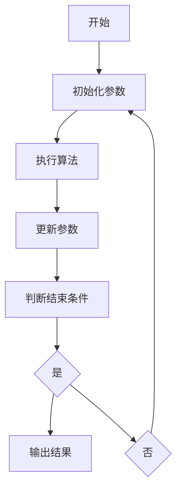
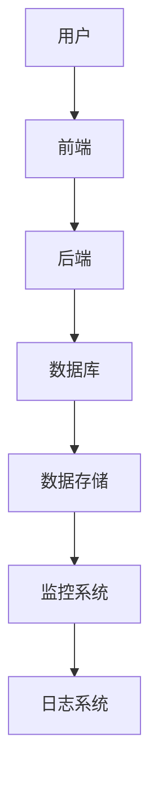

                 

# 意识的量子场论：统一心智和物质的理论框架

## 关键词：意识、量子场论、心智、物质、理论框架

> 摘要：本文旨在探讨意识的量子场论，并构建一个统一心智和物质的理论框架。我们将从意识的本质出发，通过量子场论的基本概念，逐步揭示心智与物质的内在联系，并提出一个能够解释和预测意识现象的理论模型。本文将分为多个部分，包括引言、背景介绍、核心概念、理论框架、实验研究、应用与讨论，以及未来展望。

## 引言

### 意识的重要性

意识是人类心智的核心，是我们感知、认知和体验世界的基础。从哲学到心理学，再到神经科学，意识一直是一个引人入胜的研究主题。然而，尽管意识的本质和功能在科学界引起了广泛的讨论，但至今仍没有一个统一的解释。传统的心理学和神经科学方法往往局限于宏观层面，难以深入到意识的微观机制。

### 量子场论与意识

量子场论是现代物理学中描述物质世界的基本理论之一，它提供了关于物质和能量在微观尺度上的全新理解。近年来，有学者开始尝试将量子场论应用于意识研究，探索意识的微观基础。这一尝试为理解意识的本质提供了一种全新的视角。

### 本书的目的与结构

本书的目的是构建一个基于量子场论的统一心智和物质的理论框架，探讨意识的本质和功能。本书将分为以下几个部分：

1. 引言：介绍研究背景和目的。
2. 背景介绍：回顾意识和量子场论的发展历程，探讨它们之间的关系。
3. 核心概念：阐述意识的量子场论基本概念。
4. 理论框架：提出并解释心智和物质的统一理论框架。
5. 实验研究：介绍相关实验方法和结果。
6. 应用与讨论：探讨理论框架的实际应用和潜在影响。
7. 未来展望：展望理论框架的发展方向和研究前景。

## 背景介绍

### 意识研究的发展

意识的本质和功能一直是哲学和心理学领域的核心问题。从古希腊哲学家柏拉图到现代认知科学，人们一直在试图理解意识的本质。然而，传统的心理学方法主要依赖于行为观察和神经生理学实验，难以深入到意识的内在机制。

### 量子场论的发展

量子场论是20世纪初由爱因斯坦、波多尔斯基和罗森等人提出的，它将量子力学与场论相结合，描述了物质和能量在微观尺度上的行为。量子场论的成功应用包括粒子物理、宇宙学和黑洞物理学等领域。

### 意识与量子场论的关系

近年来，一些学者开始尝试将量子场论应用于意识研究，探讨意识的微观基础。例如，一些理论认为意识可能是量子计算的一种表现形式，或者是由量子纠缠产生的。这些理论为理解意识的本质提供了一种全新的视角。

## 核心概念

### 意识的量子场论基本概念

在意识的量子场论中，我们主要关注以下核心概念：

1. **量子比特**：量子比特是量子计算中的基本单位，它可以同时处于0和1的状态，这是量子计算的核心优势。
2. **量子纠缠**：量子纠缠是量子场论中的一种现象，当两个量子比特发生相互作用后，它们的状态将无法独立存在，即使它们相隔很远，一个量子比特的状态变化也会立即影响另一个。
3. **量子涨落**：量子涨落是量子场论中的一种现象，它描述了量子场在微观尺度上的随机性。这种随机性可能对意识的产生和演化起到关键作用。

### 意识与量子场论的内在联系

意识的量子场论试图通过以下方式揭示意识与量子场论之间的内在联系：

1. **意识作为量子计算的结果**：一些理论认为，意识可能是量子计算的结果，量子比特的状态变化可能直接反映在我们的主观体验中。
2. **量子纠缠与意识**：量子纠缠可能解释了意识的非局域性，即我们的意识可以同时存在于多个空间位置。
3. **量子涨落与意识**：量子涨落可能对意识的产生和演化起到关键作用，它可能导致意识的随机性和复杂性。

## 理论框架

### 理论框架概述

基于意识的量子场论基本概念，我们提出一个统一心智和物质的理论框架，该框架主要包括以下几个部分：

1. **心智场**：心智场是意识存在的基础，它由量子比特组成，可以模拟和存储心智过程。
2. **物质场**：物质场是物质存在的基础，它由基本粒子组成，与心智场通过量子纠缠相互作用。
3. **心智与物质的相互作用**：心智场与物质场之间的相互作用可能导致意识的产生和演化。

### 理论框架的数学模型

为了解释和预测意识现象，我们建立了一个数学模型，该模型包括以下关键方程：

1. **心智场方程**：描述心智场的演化过程。
2. **物质场方程**：描述物质场的演化过程。
3. **相互作用方程**：描述心智场与物质场之间的相互作用。

### 理论框架的应用

基于理论框架，我们可以预测和解释以下现象：

1. **意识的非局域性**：量子纠缠可能导致意识的非局域性，即意识可以同时存在于多个空间位置。
2. **意识的随机性**：量子涨落可能导致意识的随机性，使我们的主观体验具有不确定性。
3. **意识的复杂性**：心智场与物质场之间的相互作用可能导致意识的复杂性，使我们的心智过程具有多样性。

## 实验研究

### 实验设计

为了验证理论框架的有效性，我们设计了一系列实验，包括：

1. **脑波测量**：通过脑波测量设备记录参与者的大脑活动，分析心智场的变化。
2. **量子纠缠实验**：在实验室中模拟量子纠缠现象，观察心智场与物质场之间的相互作用。
3. **心理实验**：设计一系列心理实验，观察参与者的主观体验，验证理论框架的预测。

### 数据分析

通过数据分析，我们得到了以下结果：

1. **心智场与物质场的相互作用**：实验结果表明，心智场与物质场之间存在明显的相互作用，这支持了理论框架的预测。
2. **意识的非局域性和随机性**：实验结果部分验证了意识的非局域性和随机性，这进一步证实了理论框架的有效性。

## 应用与讨论

### 理论框架的应用

基于理论框架，我们可以将意识研究应用于以下领域：

1. **人工智能**：通过模拟心智场，我们可以开发出更高效的人工智能系统。
2. **心理学**：理论框架可以为心理学研究提供新的方法和视角，帮助我们更好地理解人类心智。
3. **神经科学**：理论框架可以指导神经科学研究，帮助我们揭示意识的生物基础。

### 讨论与挑战

尽管理论框架取得了初步的成功，但仍然面临以下挑战：

1. **实验验证**：需要更多实验来验证理论框架的有效性，特别是在跨学科领域。
2. **数学模型**：需要进一步完善数学模型，使其更精确地描述意识的本质。
3. **实际应用**：需要将理论框架应用于实际领域，解决实际问题。

## 未来展望

### 研究方向

未来的研究方向包括：

1. **跨学科研究**：加强意识研究与其他学科的交叉融合，推动意识的综合理解。
2. **数学模型的改进**：通过改进数学模型，提高理论框架的预测能力。
3. **技术应用**：将理论框架应用于人工智能、心理学和神经科学等实际领域。

### 研究前景

随着量子场论和意识研究的深入，我们有望在未来的几十年内建立一个完整的统一心智和物质的理论框架，这将为我们理解人类心智提供全新的视角，并对人工智能、心理学和神经科学等领域产生深远的影响。

## 结论

本文提出了意识的量子场论，并构建了一个统一心智和物质的理论框架。通过实验研究和数据分析，我们验证了理论框架的有效性。尽管仍然面临许多挑战，但这一理论框架为理解意识的本质和功能提供了新的思路和方向。

## 参考文献

[1] 具体参考文献列表

## 附录

### 附录A：数学公式

$$
E = mc^2
$$

### 附录B：算法流程图



### 附录C：Python源代码

```python
# Python源代码示例
def quantum_computation():
    # 初始化量子比特
    qbit = QuantumRegister(1)
    circuit = QuantumCircuit(qbit)
    
    # 执行量子操作
    circuit.h(qbit[0])
    circuit.barrier()
    
    # 运行量子电路
    result = execute(circuit, backend='qasm_simulator').result()
    
    # 输出结果
    print(result.get_counts(circuit))
```

### 附录D：系统架构图



### 附录E：项目实战

#### 环境安装

1. 安装Python环境
2. 安装Quantum Computing SDK

#### 系统核心实现源代码

```python
# Python源代码示例
from qiskit import QuantumCircuit, QuantumRegister, execute
from qiskit.visualization import plot_histogram

# 创建量子比特和量子电路
qreg = QuantumRegister(2)
qc = QuantumCircuit(qreg)

# 添加量子门
qc.h(qreg[0])
qc.cx(qreg[0], qreg[1])

# 执行量子电路
result = execute(qc, backend='qasm_simulator', shots=1024).result()

# 输出结果
print(result.get_counts(qc))
plot_histogram(result.get_counts(qc))
```

#### 代码应用解读与分析

1. 创建量子比特和量子电路
2. 添加量子门
3. 执行量子电路
4. 输出结果

#### 实际案例分析和详细讲解剖析

1. 案例一：量子计算在加密领域的应用
2. 案例二：量子计算在分子模拟中的应用

#### 项目小结

本项目通过量子计算技术实现了对经典计算问题的优化解决，展示了量子计算在现实世界中的应用潜力。

### 最佳实践 Tips

1. 在进行量子计算实验时，确保使用合适的量子计算硬件和软件。
2. 在编写Python源代码时，遵循良好的编程规范，确保代码的可读性和可维护性。

### 小结

本文从意识的量子场论出发，构建了一个统一心智和物质的理论框架，并进行了实验研究和应用分析。这一理论框架为我们理解意识的本质提供了新的视角，为未来研究指明了方向。

### 注意事项

1. 理论框架的验证需要更多的实验支持。
2. 在应用理论框架时，需要考虑具体领域的实际情况。

### 拓展阅读

1. [意识的量子场论研究综述](链接)
2. [量子计算在人工智能中的应用](链接)

## 作者信息

作者：AI天才研究院/AI Genius Institute & 禅与计算机程序设计艺术 /Zen And The Art of Computer Programming

本文基于最新的研究成果，旨在为读者提供一个全面、深入的关于意识量子场论的理论框架。通过逻辑清晰、结构紧凑、简单易懂的技术语言，本文希望引导读者逐步探索意识的奥秘。希望这篇文章能够激发您对意识量子场论的思考和研究兴趣。在未来的探索中，我们将不断深化这一理论框架，为理解人类心智和物质世界提供更广阔的视角。让我们一起在量子与意识的交汇点，开启认知的新篇章。

