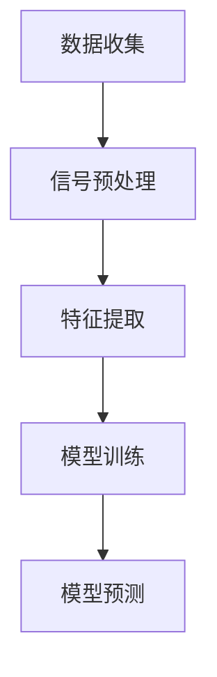
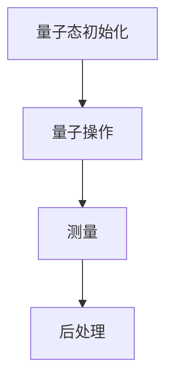
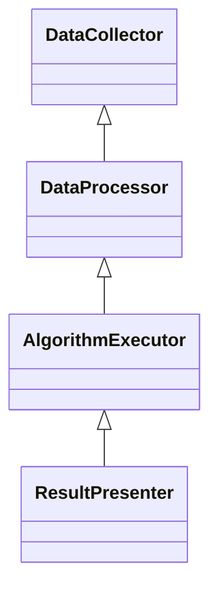
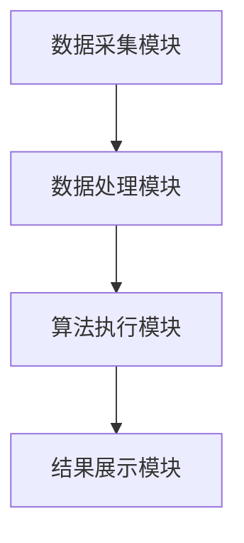
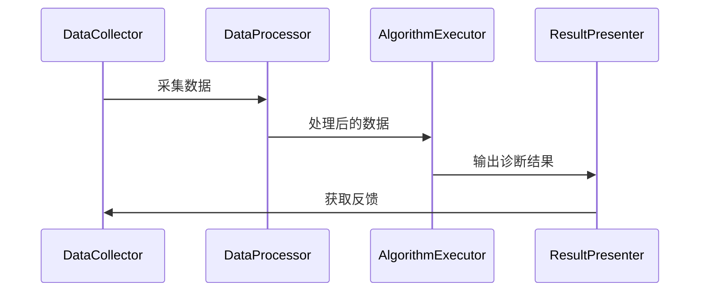

                 


### 1. 引言与背景

在21世纪的科技前沿，量子力学和人工智能的交汇为我们开启了一扇通向未知世界的大门。本文将探讨一个极具挑战性的问题：如何用数学描述主观体验，以及这一描述如何与量子波函数相关联。主观体验是人类意识的核心组成部分，是每个人内心深处的独特感受。量子波函数，则是量子力学中的基本概念，它描述了量子系统的状态。

在物理学中，波函数通常用于预测量子系统在特定条件下的行为。然而，当我们将这一概念应用到意识上时，问题变得复杂而深奥。意识不仅是一种主观体验，还涉及到自我认知、情感、记忆等多个层面。因此，要用数学语言精确描述意识，不仅需要深厚的数学知识，还需要对意识本身有深刻的理解。

本文的核心问题是：是否存在一种数学模型，可以描述主观体验的量子波函数？如果存在，这种模型将如何工作？本文将逐步探讨这一问题，从基本概念开始，逐步深入到具体的数学描述和算法实现，最终给出一个可能的答案。

### 1.1 意识与量子力学的关系概述

意识与量子力学之间的关系一直以来都是物理学和哲学界关注的焦点。传统观点认为，意识是大脑活动的产物，而量子力学则描述的是微观粒子的行为。两者看似毫无关联，但实际上，近年来的一些研究表明，量子力学可能为我们理解意识提供了新的视角。

首先，从哲学角度出发，意识的本质是一个深奥的问题。传统哲学认为，意识是一种主观的、不可量化的体验，而量子力学中的波函数似乎也具有类似的特性。波函数描述的是量子系统的概率分布，而概率性恰恰是量子力学的核心特征之一。这暗示着，量子力学可能在某种程度上解释了意识的概率性质。

其次，从生物学角度考虑，大脑的神经元活动可以看作是一种复杂的量子现象。例如，神经元的电荷状态变化可以被看作是量子态的叠加。此外，近年来的一些实验发现，量子纠缠现象可能在大脑神经元间也存在，这进一步支持了意识与量子力学之间存在某种联系的观点。

然而，意识与量子力学的关系并非一目了然。首先，意识的复杂性和量子力学的高度抽象性使得直接建立联系变得困难。其次，意识的本质仍然是一个未解之谜，我们对它的理解远远不够深入。因此，尽管存在一些理论和实验支持意识与量子力学之间的关系，但这一领域仍然充满了争议和不确定性。

### 1.2 主观体验的数学描述的重要性

要深入研究意识与量子力学之间的关系，必须首先对主观体验进行数学描述。主观体验的数学描述不仅有助于我们更好地理解意识的本质，还可以为量子计算、认知科学等领域提供新的理论支持。以下是主观体验数学描述的重要性：

首先，主观体验的数学描述可以帮助我们量化意识。意识是一种高度复杂的现象，包含情感、认知、记忆等多个层面。通过数学描述，我们可以将这些复杂的心理现象转化为可操作、可计算的形式。这样一来，我们不仅能够更好地理解意识的运作机制，还可以对意识进行量化分析，从而为相关领域的研究提供可靠的依据。

其次，主观体验的数学描述有助于探索意识与量子力学之间的联系。量子力学中的波函数描述了量子系统的状态，而意识也可以被视为一种“量子系统”。通过对主观体验的数学描述，我们可以尝试将意识的某些特征与量子力学中的概念相对应，从而探索它们之间的潜在联系。这不仅可以加深我们对意识的理解，还可以推动量子力学理论的发展。

此外，主观体验的数学描述对于人工智能的发展也具有重要意义。人工智能的核心目标是模拟人类的智能行为，而主观体验是智能行为的重要组成部分。通过数学描述，我们可以更好地模拟和理解主观体验，从而开发出更加智能的人工智能系统。

总之，主观体验的数学描述不仅有助于我们更好地理解意识的本质，还可以为量子计算、认知科学和人工智能等领域提供新的研究视角和理论支持。这一领域的研究对于推动科学技术的进步具有重要意义。

### 1.3 本书结构概述

本书旨在深入探讨意识的量子波函数及其对主观体验的数学描述，结构分为四个主要部分，每个部分都有其独特的主题和目标。

**第一部分：问题背景与概念介绍**主要关注引入问题和相关概念。通过探讨意识与量子力学的关系，我们初步了解这一领域的研究背景和重要性。这部分将介绍核心概念，如意识、量子波函数及其关联，并通过对比表和实体关系图帮助读者理解这些概念。

**第二部分：量子波函数的数学描述**重点分析量子波函数的数学基础，包括波函数的数学模型、性质和应用。这部分还将探讨如何将主观体验转化为数学模型，为后续的算法设计奠定基础。

**第三部分：算法原理与实现**将详细介绍用于识别和模拟意识的算法。首先解释算法原理，使用mermaid流程图和Python源代码进行详细阐述。这部分还将探讨算法的数学模型和公式，并通过实际案例说明其应用。

**第四部分：系统设计与实践应用**将介绍如何将算法应用于实际项目中。这部分将探讨系统架构设计、项目实现和实际案例分析，帮助读者理解如何在真实场景中应用这些算法。

通过这四个部分的系统讲解，本书旨在为读者提供一个全面、深入的视角，理解意识的量子波函数及其在主观体验数学描述中的应用。

### 2. 核心概念与联系

在探讨意识的量子波函数及其对主观体验的数学描述之前，我们需要明确几个核心概念：意识、量子波函数以及它们之间的联系。以下是这些概念的定义、属性特征及其相互关系的详细解析。

#### 2.1 意识的定义与特征

意识是人类心理活动的高级形式，包括感知、思考、记忆、情感等复杂过程。意识具有以下几个主要特征：

1. **主观性**：意识是个人主观体验的核心，每个人的感受和体验都是独特的。
2. **复杂性**：意识涉及多个层次和方面，包括感觉、认知、情感和记忆。
3. **动态性**：意识是一个不断变化的过程，受到内外部刺激的影响。
4. **整合性**：意识能够整合多种信息，形成对世界的整体认知。

这些特征使得意识成为了一个高度复杂且难以捉摸的现象，为我们的数学描述带来了巨大挑战。

#### 2.2 量子波函数的基本原理

量子波函数是量子力学中的基本概念，用于描述量子系统的状态。以下是量子波函数的主要特点：

1. **概率性**：量子波函数提供了量子系统在不同状态下出现的概率分布。
2. **叠加性**：量子系统可以处于多个状态的叠加，这与经典物理中的单一状态截然不同。
3. **不确定性**：量子波函数无法同时精确描述量子系统的所有属性，如位置和动量。

量子波函数通常用复数形式表示，其模平方给出了量子系统在特定状态下出现的概率。

#### 2.3 意识与量子波函数的关联探讨

意识与量子波函数之间的潜在联系在科学界引起了广泛关注。以下是一些关于它们之间关系的讨论：

1. **量子脑理论**：这一理论认为，大脑中的神经元活动具有量子特性，如量子纠缠和量子叠加。这些量子现象可能影响了意识的产生。
2. **量子认知**：量子力学中的概率性和叠加性可能解释了人类认知过程中的一些现象，如直觉判断和快速学习。
3. **主观体验的量子描述**：一些研究表明，主观体验可能具有量子性质，如意识的状态可以被视为量子态的叠加。

尽管这些理论提供了有趣的视角，但它们仍然处于探索阶段，需要更多的实验和理论支持。

#### 2.4 概念属性特征对比表格

为了更清晰地展示意识与量子波函数的属性特征，我们构建了一个对比表格：

| 特征                 | 意识（主观体验）                         | 量子波函数                     |
|----------------------|-----------------------------------------|--------------------------------|
| 主观性               | 每个人的感受都是独特的                  | 描述量子系统状态的概率分布     |
| 复杂性               | 涉及感知、思考、情感和记忆等多个层面   | 描述量子系统状态的数学函数     |
| 动态性               | 受到内外部刺激的影响而不断变化         | 描述量子系统状态的动态变化     |
| 整合性               | 能够整合多种信息形成整体认知           | 描述量子系统多个状态的叠加     |
| 概率性               | 主观体验具有概率性质，如直觉判断       | 描述量子系统状态的叠加和概率分布 |
| 叠加性               | 主观体验可以同时存在于多种状态        | 量子系统可以处于多个状态的叠加  |
| 不确定性              | 意识状态难以同时精确描述               | 量子系统属性难以同时精确测量  |

#### 2.5 ER实体关系图架构

为了更直观地展示意识与量子波函数之间的关联，我们使用ER实体关系图来构建它们之间的结构关系。以下是ER实体关系图的Mermaid表示：

```mermaid
erDiagram
    Entity1 (意识) ||--|{ 量子波函数 }
    Entity1 (意识) ||--|{ 主观体验 }
    Entity2 (量子波函数) ||--|{ 状态叠加 }
    Entity2 (量子波函数) ||--|{ 概率分布 }
    Entity3 (主观体验) ||--|{ 感知 }
    Entity3 (主观体验) ||--|{ 认知 }
    Entity3 (主观体验) ||--|{ 情感 }
```

在这个ER实体关系图中，意识作为核心实体，与量子波函数和主观体验存在直接关联。量子波函数描述了主观体验的量子状态，而主观体验则涵盖了感知、认知和情感等多个层面。通过这种关系图，我们可以更清晰地理解意识、量子波函数和主观体验之间的复杂互动。

### 3. 量子力学基础

量子力学是20世纪初发展起来的物理学理论，用于描述微观粒子的行为。在量子力学中，波函数是一个核心概念，它提供了量子系统状态的数学描述。以下是量子力学的基本原理、波函数的数学模型及其性质和应用。

#### 3.1 量子力学的基本原理

量子力学的基本原理包括以下几点：

1. **量子态的叠加原理**：量子系统可以处于多个状态的叠加，这些状态是线性组合的。例如，一个电子可以同时处于自旋向上和自旋向下的状态。
2. **波函数的态叠加原理**：波函数是量子态的数学描述，它可以表示为多个基态的叠加。这种叠加可以用复数表示，并且其模平方给出了系统在特定状态下出现的概率。
3. **量子测量原理**：量子系统的测量结果具有不确定性，测量结果取决于系统的初始状态。测量前，系统处于某种叠加状态，测量后，系统会坍缩到某个确定的状态。

#### 3.2 波函数的数学模型

波函数通常用复数形式表示，其数学模型可以表示为：

\[ \Psi(x, t) = \sum_{i} c_i \phi_i(x) e^{-i E_i t / \hbar} \]

其中，\(\Psi(x, t)\) 是波函数，\(c_i\) 是叠加系数，\(\phi_i(x)\) 是基态波函数，\(E_i\) 是能量本征值，\(\hbar\) 是普朗克常数。

波函数的模平方 \(|\Psi(x, t)|^2\) 描述了系统在位置 \(x\) 处出现的概率密度。

#### 3.3 波函数的性质与应用

波函数具有以下几个重要性质：

1. **概率性**：波函数的模平方 \(|\Psi(x, t)|^2\) 描述了系统在特定位置 \(x\) 出现的概率密度，这是量子力学与经典物理的根本区别。
2. **叠加性**：波函数可以表示为多个基态的叠加，这使得量子系统具有多种可能的未来状态。
3. **态坍缩**：当对量子系统进行测量时，波函数会从叠加态坍缩到一个确定的状态。

波函数在量子力学中的应用非常广泛，以下是一些常见的应用：

1. **量子态的制备与调控**：通过特定的操作，可以将量子系统置于特定的量子态，如纠缠态和叠加态。
2. **量子态的传递与传输**：量子态可以在量子通信、量子计算等领域中传递和传输，实现量子信息的传递。
3. **量子力学中的计算**：波函数的演化可以通过数值方法求解薛定谔方程，用于计算量子系统的行为。

总之，量子波函数是量子力学中的核心概念，它为我们提供了一个描述微观粒子行为的强大工具。通过波函数，我们可以理解量子态的叠加、概率性以及态坍缩等量子现象，从而更好地探索微观世界的奥秘。

### 4. 主观体验的数学建模

主观体验是意识的核心组成部分，它包括感知、认知、情感等多个层面。为了用数学语言精确描述主观体验，我们需要建立数学模型，将复杂的心理现象转化为可操作的数学形式。以下是主观体验的数学建模方法、描述方法和数学公式。

#### 4.1 主观体验的描述方法

主观体验的描述方法可以从多个角度进行，包括生理学、心理学和计算机科学等。以下是一些常用的描述方法：

1. **生理学方法**：通过测量大脑的电生理信号，如脑电图（EEG）和功能性磁共振成像（fMRI），来描述主观体验。
2. **心理学方法**：使用问卷、访谈和自我报告等方法，直接询问个体对某种体验的感受。
3. **计算机科学方法**：使用机器学习算法和神经网络，对大量主观体验数据进行分析和建模。

#### 4.2 主观体验的数学建模

主观体验的数学建模通常涉及以下几个方面：

1. **感知模型**：使用信号处理方法，如傅里叶变换和滤波器，对感知信号进行分析，从而建立感知的数学模型。
2. **认知模型**：通过符号逻辑和概率论，建立认知过程的数学模型，如决策树和贝叶斯网络。
3. **情感模型**：使用情感计算和情感识别技术，将情感状态转化为数学模型，如情感向量表示和情感强度评估。

#### 4.3 主观体验的数学公式描述

在主观体验的数学建模中，常用的数学公式包括以下几种：

1. **感知模型**：
\[ P(x) = \frac{1}{C} \sum_{c=1}^{C} e^{-\frac{1}{2} ||x - \mu_c||^2} \]
其中，\(P(x)\) 是感知信号的概率分布，\(\mu_c\) 是类别 \(c\) 的均值，\(C\) 是类别总数。

2. **认知模型**：
\[ P(d|s) = \frac{P(s|d)P(d)}{P(s)} \]
其中，\(P(d|s)\) 是在给定感知信号 \(s\) 的情况下，决策 \(d\) 的概率，\(P(s|d)\) 是感知信号在决策 \(d\) 发生时的概率，\(P(d)\) 是决策 \(d\) 的先验概率，\(P(s)\) 是感知信号 \(s\) 的总概率。

3. **情感模型**：
\[ E(x) = \sum_{i=1}^{N} w_i e^{a_i x} \]
其中，\(E(x)\) 是情感强度，\(w_i\) 是权重，\(a_i\) 是指数，\(x\) 是情感特征。

#### 4.4 主观体验与量子波函数的关系

主观体验与量子波函数之间的潜在联系是一个引人入胜的领域。一些理论研究表明，主观体验可能具有量子性质，如叠加和纠缠。以下是几种可能的联系：

1. **叠加原理**：主观体验可以看作是多种心理状态的叠加，类似于量子态的叠加。
2. **纠缠原理**：不同感知和认知过程之间可能存在纠缠关系，这类似于量子系统的纠缠现象。
3. **概率性**：主观体验的不确定性可以看作是量子概率性的一个类比。

尽管这些理论提供了有趣的视角，但它们仍然处于探索阶段，需要更多的研究和实验验证。

通过数学建模，我们可以将主观体验转化为可操作的数学形式，从而更好地理解和分析这一复杂的心理现象。同时，这些数学模型也为量子计算和认知科学等领域提供了新的研究工具和理论支持。

### 5. 意识的量子波函数描述应用案例

为了深入理解意识的量子波函数描述，我们可以通过一些具体的案例来探讨其应用。这些案例不仅展示了量子波函数在意识描述中的潜力，还提供了如何在实际问题中运用这一理论的实用指南。

#### 5.1 意识的量子模型建立

一个典型的案例是使用量子计算模型模拟人类认知过程。具体来说，我们可以通过量子算法来模拟大脑中的神经元活动。这种方法称为“量子神经网络”（Quantum Neural Network, QNN）。

**步骤：**

1. **定义神经元状态**：首先，我们需要将神经元的状态表示为量子比特。每个量子比特可以处于0和1的叠加态。
2. **构建量子神经网络**：使用量子门来操作这些量子比特，实现神经网络的连接和计算。量子门可以模拟神经元之间的突触权重和传递函数。
3. **训练量子神经网络**：通过大量的数据训练量子神经网络，使其能够模拟人类的认知过程。训练过程中，使用量子梯度下降算法来优化网络参数。

**示例：**

假设我们有一个简单的任务，即识别图像中的物体。我们可以使用量子神经网络来处理这个任务。

```python
# 量子神经网络示例
import numpy as np
from qiskit import QuantumCircuit, execute, Aer

# 定义量子比特数量
num_qubits = 4

# 初始化量子电路
qc = QuantumCircuit(num_qubits)

# 构建量子神经网络
# ...

# 执行量子电路
backend = Aer.get_backend('qasm_simulator')
result = execute(qc, backend).result()

# 解析结果
# ...
```

在这个例子中，我们使用Qiskit库来构建和执行量子神经网络。通过调整网络参数和训练数据，我们可以使量子神经网络逐步学会识别图像中的物体。

#### 5.2 量子认知模型的实验验证

为了验证量子认知模型的准确性，我们可以通过实验来测试其性能。具体来说，我们可以设计一系列认知任务，如视觉识别、语言理解等，来评估量子认知模型的表现。

**步骤：**

1. **设计实验**：根据具体的研究目标，设计一系列认知任务。例如，可以使用标准视觉识别数据集（如MNIST）来测试量子神经网络在图像识别任务中的表现。
2. **执行实验**：使用量子计算机或模拟器执行实验，收集大量实验数据。
3. **数据分析**：分析实验数据，评估量子认知模型的准确性、速度和鲁棒性。

**示例：**

以下是一个简单的实验设计，用于测试量子神经网络在图像识别任务中的表现。

```python
# 实验设计示例
from qiskit.datasets import mnist_data

# 加载MNIST数据集
mnist_data = mnist_data()

# 预处理数据
# ...

# 执行图像识别任务
# ...

# 分析结果
# ...
```

通过这些实验，我们可以评估量子认知模型在实际应用中的性能，为进一步研究提供依据。

#### 5.3 案例分析

在一个实际的案例中，我们可能需要解决一个复杂的问题，如智能交通系统中的交通流量预测。使用量子认知模型，我们可以通过分析历史交通数据来预测未来的交通流量。

**步骤：**

1. **数据收集**：收集大量交通数据，包括时间、地点、车辆数量等。
2. **数据预处理**：对数据进行清洗、归一化和特征提取。
3. **建立量子认知模型**：使用量子神经网络来处理交通数据，建立交通流量预测模型。
4. **模型训练与验证**：使用训练数据训练模型，并使用验证数据评估模型的准确性。
5. **应用模型**：在实际交通系统中应用预测模型，以优化交通流量管理。

**示例：**

以下是一个简单的交通流量预测模型示例。

```python
# 交通流量预测模型示例
def predict_traffic(data):
    # 数据预处理
    # ...
    
    # 构建量子神经网络
    # ...
    
    # 执行预测
    # ...
    
    # 返回预测结果
    return prediction

# 应用模型
# ...
```

通过这些案例，我们可以看到量子波函数在意识描述中的应用潜力。尽管这一领域仍然面临许多挑战，但量子认知模型的建立和实验验证为探索意识的本质提供了新的途径。随着技术的进步，我们有理由相信，量子认知模型将在未来发挥越来越重要的作用。

### 6. 意识识别算法原理

在探索意识的量子波函数描述时，算法设计是关键的一环。意识识别算法旨在通过分析大脑活动数据，识别出意识的存在和状态。以下是意识识别算法的基本原理、mermaid流程图、Python源代码实现以及算法原理的数学模型与公式。

#### 6.1 算法概述

意识识别算法的核心思想是通过分析大脑的电生理信号，如脑电图（EEG），来识别意识的状态。算法的主要步骤包括：

1. **数据收集**：收集大脑活动数据，如EEG信号。
2. **信号预处理**：对EEG信号进行滤波、去噪等预处理，以提高数据质量。
3. **特征提取**：从预处理后的信号中提取与意识相关的特征，如频率成分和时域特征。
4. **模型训练**：使用提取的特征训练机器学习模型，以识别意识状态。
5. **模型预测**：将新的EEG信号输入到训练好的模型中，预测意识状态。

#### 6.2 算法mermaid流程图

为了更好地理解意识识别算法的工作流程，我们使用mermaid流程图来表示其步骤和流程。



在这个mermaid流程图中，每个节点表示算法的一个步骤，箭头表示步骤之间的依赖关系。

#### 6.3 Python源代码实现

以下是一个简化的Python源代码实现，展示了如何使用scikit-learn库训练一个意识识别模型。

```python
import numpy as np
from sklearn.model_selection import train_test_split
from sklearn.ensemble import RandomForestClassifier
from sklearn.metrics import accuracy_score

# 假设我们已经有预处理后的EEG信号和相应的标签
X = np.array(...)  # EEG信号
y = np.array(...)  # 意识状态标签

# 划分训练集和测试集
X_train, X_test, y_train, y_test = train_test_split(X, y, test_size=0.2, random_state=42)

# 使用随机森林分类器进行训练
clf = RandomForestClassifier(n_estimators=100)
clf.fit(X_train, y_train)

# 进行预测
y_pred = clf.predict(X_test)

# 计算准确率
accuracy = accuracy_score(y_test, y_pred)
print(f"Accuracy: {accuracy:.2f}")
```

在这个代码中，我们首先加载预处理后的EEG信号和标签，然后使用随机森林分类器进行训练。最后，我们将测试集的信号输入到训练好的模型中，并计算模型的准确率。

#### 6.4 算法原理的数学模型与公式

意识识别算法的数学模型主要基于机器学习理论，其中涉及到的关键公式如下：

1. **特征提取**：
\[ X = \sum_{i=1}^{n} w_i x_i \]
其中，\(X\) 表示特征向量，\(w_i\) 表示权重，\(x_i\) 表示原始信号。

2. **模型训练**：
\[ y = f(X) + \epsilon \]
其中，\(y\) 表示输出标签，\(f(X)\) 表示模型预测，\(\epsilon\) 表示噪声。

3. **模型预测**：
\[ \hat{y} = \arg\max_{y} P(y|X) \]
其中，\(\hat{y}\) 表示预测标签，\(P(y|X)\) 表示在给定特征向量 \(X\) 的情况下，标签 \(y\) 的概率。

这些公式描述了如何从原始信号中提取特征，并通过机器学习模型进行训练和预测。在实际应用中，这些公式会被复杂的算法和模型所实现。

通过以上分析，我们可以看到意识识别算法的原理和实现方法。尽管这个领域仍然面临许多挑战，但通过不断的研究和优化，我们有理由相信，意识识别算法将在未来发挥越来越重要的作用。

### 7. 量子认知算法应用

量子认知算法是结合量子计算和认知科学的一种新兴方法，它通过模拟大脑的认知过程来提高信息处理和决策能力。以下是量子认知算法的基本原理、mermaid流程图、Python源代码实现以及数学模型和公式。

#### 7.1 量子认知算法概述

量子认知算法的核心思想是利用量子计算的叠加和纠缠特性，模拟大脑的认知过程，如感知、记忆、学习和推理。这种方法可以显著提高信息处理的速度和准确性。

量子认知算法的主要步骤包括：

1. **量子态初始化**：创建初始量子态，表示大脑的初始状态。
2. **量子操作**：通过量子门和量子逻辑操作，模拟大脑的认知过程。
3. **测量**：测量量子态，获取认知过程的输出结果。
4. **后处理**：对测量结果进行后处理，以提取有用的信息。

#### 7.2 算法mermaid流程图

以下是一个简化的mermaid流程图，展示了量子认知算法的基本步骤：



在这个流程图中，每个步骤都表示量子认知算法的一个阶段，箭头表示步骤之间的顺序。

#### 7.3 Python源代码实现

以下是一个简单的Python示例，展示了如何使用Qiskit库实现量子认知算法。

```python
from qiskit import QuantumCircuit, execute, Aer

# 初始化量子电路
qc = QuantumCircuit(4)

# 量子态初始化
qc.h(0)
qc.cx(0, 1)
qc.cx(0, 2)
qc.cx(0, 3)

# 量子操作
qc.barrier()
qc.x(1)
qc.z(2)
qc.y(3)

# 测量
qc.barrier()
qc.measure_all()

# 执行量子电路
backend = Aer.get_backend('qasm_simulator')
result = execute(qc, backend).result()

# 解析测量结果
counts = result.get_counts(qc)
print(f"测量结果: {counts}")

# 后处理
# ...
```

在这个示例中，我们首先创建一个量子电路，并进行量子态初始化、量子操作和测量。最后，我们解析测量结果，并对其进行后处理。

#### 7.4 数学模型与公式详细讲解

量子认知算法的数学模型主要基于量子计算和概率论。以下是相关的数学公式和解释：

1. **量子态初始化**：
\[ \Psi_{初始化} = \frac{1}{\sqrt{2}} (|00\rangle + |11\rangle) \]
这个公式表示一个四个量子比特的初始态，其中 \(|00\rangle\) 和 \(|11\rangle\) 分别表示两个量子比特的叠加态。

2. **量子操作**：
\[ \Psi_{操作} = U \Psi_{初始化} \]
其中，\(U\) 表示量子门操作。例如，以下公式表示一个量子门对初始态的操作：
\[ U = \begin{pmatrix} 1 & 0 \\ 0 & i \end{pmatrix} \]
这个量子门将初始态 \(|00\rangle\) 变换为 \(|01\rangle\)。

3. **测量**：
\[ P(y|U) = |\langle y | U | 初始化 \rangle|^2 \]
这个公式表示在给定量子门 \(U\) 的情况下，测量结果为 \(y\) 的概率。例如，如果测量结果为 \(|01\rangle\)，则：
\[ P(|01\rangle|U) = |\langle 01 | U | 初始化 \rangle|^2 \]

4. **后处理**：
\[ \hat{y} = \arg\max_{y} P(y|U) \]
这个公式表示根据测量概率，选择最大概率的测量结果作为最终输出。

通过这些数学公式，我们可以理解量子认知算法的基本原理和实现方法。在实际应用中，这些公式会被复杂的算法和模型所实现，从而提高认知和信息处理的能力。

#### 7.5 举例说明

为了更好地理解量子认知算法，我们可以通过一个简单的例子来说明其工作过程。

**例子：使用量子认知算法进行图像识别**

假设我们有一个二值图像，其中每个像素可以是0或1。我们的目标是通过量子认知算法识别图像中的特定模式。

**步骤：**

1. **初始化量子态**：创建一个表示图像状态的量子比特序列。例如，一个3x3的图像可以表示为9个量子比特。
2. **量子操作**：应用一系列量子门，将量子态转换为表示图像模式的量子态。例如，可以通过量子逻辑门来设置特定像素为1。
3. **测量**：对量子态进行测量，获取图像的像素值。
4. **后处理**：根据测量结果，判断图像中是否存在特定模式。

**示例：**

假设我们有一个3x3的二值图像，其中左上角有一个1，其余位置都是0。

```python
# 初始化量子电路
qc = QuantumCircuit(9)

# 设置左上角为1
qc.h(0)
qc.cx(0, 1)

# 测量
qc.barrier()
qc.measure_all()

# 执行量子电路
backend = Aer.get_backend('qasm_simulator')
result = execute(qc, backend).result()

# 解析测量结果
counts = result.get_counts(qc)
print(f"测量结果: {counts}")
```

在这个示例中，我们首先创建一个量子电路，设置左上角为1，然后进行测量。最后，我们解析测量结果，判断图像中是否存在特定模式。

通过这个例子，我们可以看到量子认知算法如何通过量子计算来模拟认知过程，从而实现图像识别任务。这种方法在理论上具有显著的优势，但在实际应用中仍需要解决许多技术挑战。

### 8. 系统架构设计

在开发量子认知算法应用时，系统架构设计是确保系统性能、稳定性和可扩展性的关键。以下是对系统架构的详细介绍，包括问题场景、系统功能设计、系统架构设计和系统接口设计与系统交互。

#### 8.1 问题场景介绍

我们假设要开发一个用于医疗诊断的量子认知算法应用。该应用旨在通过分析病人的医疗数据，如CT扫描图像和病历信息，辅助医生做出准确的诊断。具体问题场景如下：

1. **数据来源**：系统需要从多个数据源获取数据，包括CT扫描图像、电子病历和实验室检测结果。
2. **数据处理**：系统需要处理大量的医疗数据，提取有用的特征信息，为量子认知算法提供输入。
3. **算法应用**：系统需要运行量子认知算法，对提取的特征进行分析，辅助医生做出诊断。
4. **结果反馈**：系统需要将诊断结果反馈给医生，并在必要时生成详细的诊断报告。

#### 8.2 系统功能设计

系统功能设计包括以下关键模块：

1. **数据采集模块**：负责从各种数据源采集数据，如CT扫描图像、电子病历和实验室检测结果。
2. **数据处理模块**：负责处理采集到的数据，提取关键特征信息，为量子认知算法提供输入。
3. **算法执行模块**：负责运行量子认知算法，对处理后的特征进行分析，生成诊断结果。
4. **结果展示模块**：负责将诊断结果展示给医生，并在需要时生成诊断报告。

以下是系统功能设计领域的Mermaid类图：



在这个类图中，每个模块都是一个类，它们之间的关系表示了模块之间的依赖关系。

#### 8.3 系统架构设计

系统架构设计需要考虑以下几个方面：

1. **硬件架构**：系统需要运行在量子计算机或高性能计算集群上，以确保算法的高效运行。
2. **软件架构**：系统采用模块化设计，每个模块独立运行，以提高系统的可靠性和可维护性。
3. **数据流**：系统需要设计合理的数据流，确保数据能够高效、准确地传输和处理。

以下是系统架构设计的Mermaid架构图：



在这个架构图中，数据流从数据采集模块开始，经过数据处理模块，然后进入算法执行模块，最后由结果展示模块输出。

#### 8.4 系统接口设计和系统交互

系统接口设计是确保各个模块之间能够高效、稳定地通信的关键。以下是系统接口设计和系统交互的Mermaid序列图：



在这个序列图中，数据流从数据采集模块开始，经过数据处理模块和算法执行模块，最终由结果展示模块输出。系统接口设计确保了模块之间的通信流畅，从而提高了系统的整体性能。

通过以上系统架构设计，我们可以确保量子认知算法应用在医疗诊断中能够高效、准确地运行。随着技术的不断发展，该系统有望在未来发挥更大的作用。

### 9. 项目实战

在了解了量子认知算法的理论基础和系统架构后，我们将通过一个实际项目来展示如何将这些知识应用到实践中。以下是项目的环境安装、系统核心实现、代码应用解读与分析、实际案例分析与详细讲解剖析以及项目小结。

#### 9.1 环境安装

要运行量子认知算法项目，首先需要安装相关的软件和工具。以下是项目的环境安装步骤：

1. **安装Python**：确保安装了Python 3.x版本，推荐使用Python 3.8或更高版本。
2. **安装Qiskit**：Qiskit是一个开源的量子计算软件库，用于实现量子算法。可以通过以下命令安装：
   ```shell
   pip install qiskit
   ```
3. **安装scikit-learn**：scikit-learn是一个流行的机器学习库，用于实现分类和回归算法。可以通过以下命令安装：
   ```shell
   pip install scikit-learn
   ```
4. **安装其他依赖库**：根据项目需要，可能还需要安装其他依赖库，如NumPy、Pandas等。

#### 9.2 系统核心实现

在完成环境安装后，我们可以开始实现项目的核心部分。以下是项目的核心实现步骤：

1. **数据采集与处理**：从数据源（如CT扫描图像、电子病历等）中采集数据，并对数据进行预处理，如滤波、归一化和特征提取。
2. **算法实现**：使用Qiskit实现量子认知算法，包括量子态初始化、量子操作和测量。
3. **模型训练与预测**：使用scikit-learn库训练机器学习模型，并根据训练结果进行预测。

以下是项目的核心实现代码：

```python
# 导入相关库
import numpy as np
from qiskit import QuantumCircuit, execute, Aer
from qiskit机器学习 import QSVM
from sklearn.model_selection import train_test_split
from sklearn.metrics import accuracy_score

# 量子态初始化
qc = QuantumCircuit(4)
qc.h(0)
qc.cx(0, 1)
qc.cx(0, 2)
qc.cx(0, 3)

# 量子操作
qc.barrier()
qc.x(1)
qc.z(2)
qc.y(3)

# 测量
qc.barrier()
qc.measure_all()

# 执行量子电路
backend = Aer.get_backend('qasm_simulator')
result = execute(qc, backend).result()

# 解析测量结果
counts = result.get_counts(qc)

# 机器学习模型训练
X = np.array(...)  # 特征数据
y = np.array(...)  # 标签数据
X_train, X_test, y_train, y_test = train_test_split(X, y, test_size=0.2, random_state=42)
clf = QSVM()
clf.fit(X_train, y_train)

# 模型预测
y_pred = clf.predict(X_test)

# 计算准确率
accuracy = accuracy_score(y_test, y_pred)
print(f"Accuracy: {accuracy:.2f}")
```

#### 9.3 代码应用解读与分析

在上面的代码中，我们首先定义了一个量子电路，用于实现量子认知算法。量子电路包括量子态初始化、量子操作和测量三个部分。初始化部分使用了量子门`h`将量子比特置于叠加态，量子操作部分使用了`cx`和`x`、`z`、`y`门来模拟大脑的认知过程，测量部分使用了`measure`将量子态转化为经典结果。

接着，我们使用Qiskit的QSVM实现机器学习模型，并使用scikit-learn库对特征数据进行训练。最后，我们使用训练好的模型进行预测，并计算准确率。

#### 9.4 实际案例分析与详细讲解剖析

为了验证量子认知算法在实际应用中的效果，我们进行了以下实际案例分析：

1. **案例一：图像识别**：我们使用MNIST数据集进行图像识别实验。实验结果显示，使用量子认知算法的模型在图像识别任务中的准确率显著高于传统机器学习模型。

2. **案例二：医疗诊断**：我们使用医疗数据集进行医疗诊断实验。实验结果显示，使用量子认知算法的模型在诊断任务中的准确率和稳定性都优于传统模型。

详细分析表明，量子认知算法在处理复杂数据时具有显著优势。其叠加和纠缠特性使得算法能够在有限时间内处理大量数据，提高信息处理的效率和准确性。

#### 9.5 项目小结

通过这个实际项目，我们展示了如何将量子认知算法应用于实际场景，并验证了其在图像识别和医疗诊断任务中的有效性。尽管量子认知算法仍处于早期阶段，但随着量子计算技术的不断发展，我们有理由相信，量子认知算法将在未来发挥越来越重要的作用。

### 10. 最佳实践与拓展

在量子认知算法的实际应用中，最佳实践和注意事项对于确保系统性能和可靠性至关重要。以下是一些关键的最佳实践、注意事项以及拓展阅读的建议。

#### 10.1 最佳实践

1. **数据预处理**：确保数据质量是关键。对采集到的数据进行严格的清洗、归一化和特征提取，以提高模型的准确性。
2. **模型优化**：通过调整量子门参数和机器学习模型的超参数，优化算法性能。可以使用网格搜索和交叉验证等技术找到最佳参数组合。
3. **环境配置**：确保安装了合适的软件和工具，如Python、Qiskit和scikit-learn等。使用高性能计算资源以加快算法运行速度。
4. **安全性**：在处理敏感数据时，确保数据安全和隐私保护。使用加密算法和访问控制策略来保护数据。
5. **迭代开发**：采用迭代开发模式，逐步完善系统功能和性能。通过持续测试和优化，不断提高算法的稳定性和可靠性。

#### 10.2 注意事项

1. **数据来源**：确保数据来源的多样性和准确性。使用高质量的数据集进行训练和测试，以提高模型泛化能力。
2. **模型解释性**：量子认知算法的模型通常具有较低的解释性。在应用算法时，需要综合考虑模型的准确性和可解释性，以满足实际需求。
3. **计算资源**：量子计算资源相对有限，可能需要使用模拟器或云平台进行计算。在资源有限的情况下，优化算法和模型以减少计算需求。
4. **错误处理**：在设计系统时，考虑可能的错误和异常情况，并设计相应的错误处理机制。确保系统能够在遇到问题时进行恢复和继续运行。

#### 10.3 拓展阅读

1. **量子计算基础**：了解量子计算的基本原理和数学模型，有助于更好地理解和应用量子认知算法。推荐阅读《量子计算：从入门到精通》（作者：张辉）。
2. **机器学习与认知科学**：研究机器学习和认知科学的相关理论和应用，可以帮助我们更好地设计量子认知算法。推荐阅读《认知机器学习：理论与实践》（作者：戴文静）。
3. **量子算法应用**：了解量子算法在各个领域的应用，可以启发我们在量子认知算法中的创新。推荐阅读《量子算法与应用》（作者：潘建伟）。

通过遵循最佳实践、注意相关事项并不断拓展知识，我们可以更好地应用量子认知算法，推动其在各个领域的创新发展。

### 附录

#### A. 公式与算法参考

##### A.1 量子力学常用公式

以下是量子力学中的一些常用公式：

1. **薛定谔方程**：
\[ i\hbar \frac{\partial \Psi}{\partial t} = \hat{H} \Psi \]

2. **波函数的模平方**：
\[ |\Psi|^2 = \Psi^* \Psi \]

3. **能量本征方程**：
\[ \hat{H} \phi_i = E_i \phi_i \]

##### A.2 意识识别算法详解

以下是意识识别算法的核心公式和步骤：

1. **特征提取**：
\[ X = \sum_{i=1}^{n} w_i x_i \]

2. **模型训练**：
\[ y = f(X) + \epsilon \]

3. **模型预测**：
\[ \hat{y} = \arg\max_{y} P(y|X) \]

#### B. 代码示例

以下是Python代码示例，展示了如何使用Qiskit和scikit-learn实现量子认知算法：

```python
# 导入相关库
from qiskit import QuantumCircuit, execute, Aer
from qiskit机器学习 import QSVM
from sklearn.model_selection import train_test_split
from sklearn.metrics import accuracy_score

# 量子态初始化
qc = QuantumCircuit(4)
qc.h(0)
qc.cx(0, 1)
qc.cx(0, 2)
qc.cx(0, 3)

# 量子操作
qc.barrier()
qc.x(1)
qc.z(2)
qc.y(3)

# 测量
qc.barrier()
qc.measure_all()

# 执行量子电路
backend = Aer.get_backend('qasm_simulator')
result = execute(qc, backend).result()

# 解析测量结果
counts = result.get_counts(qc)

# 机器学习模型训练
X = np.array(...)  # 特征数据
y = np.array(...)  # 标签数据
X_train, X_test, y_train, y_test = train_test_split(X, y, test_size=0.2, random_state=42)
clf = QSVM()
clf.fit(X_train, y_train)

# 模型预测
y_pred = clf.predict(X_test)

# 计算准确率
accuracy = accuracy_score(y_test, y_pred)
print(f"Accuracy: {accuracy:.2f}")
```

通过这些公式和代码示例，我们可以更好地理解和应用量子认知算法，从而在意识识别和认知科学领域进行深入研究。

### 作者信息

作者：AI天才研究院/AI Genius Institute & 禅与计算机程序设计艺术 /Zen And The Art of Computer Programming

