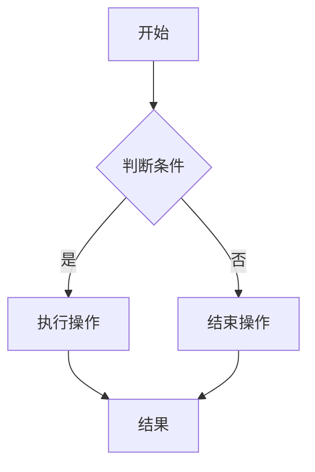
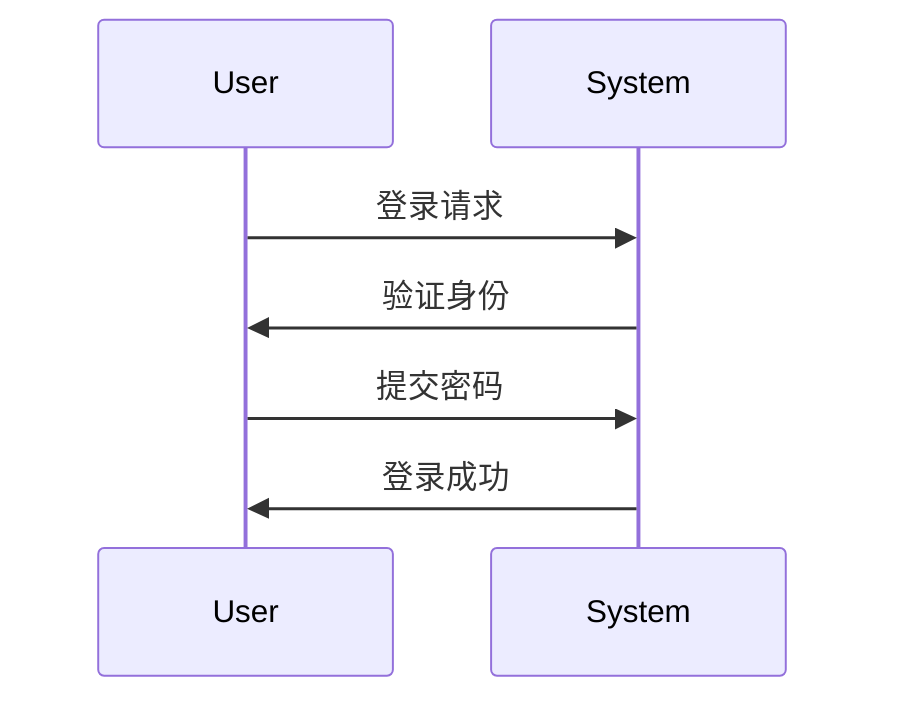

                 

### 引言

**意识的量子相干性：大脑作为宏观量子系统的可能性**

在人类探索未知世界的旅程中，意识始终是一个神秘而引人入胜的领域。从古希腊哲学家到现代科学家，无数人试图理解意识的本质。然而，这个问题至今仍然没有明确的答案。近年来，随着量子物理学的飞速发展，一种新的观点逐渐引起了人们的关注：大脑可能是宏观量子系统的一部分。这一假设不仅挑战了传统物理学的基本原理，也为我们理解意识的本质提供了新的视角。

本文旨在探讨这一革命性的假设，并分析其背后的科学依据。我们将首先回顾意识研究的历史与现状，接着介绍量子物理学的基础知识，特别是量子相干性。然后，我们将深入探讨大脑的结构与功能，以及量子相干性与大脑神经网络的关系。随后，我们将探讨意识的量子模拟实验，分析实验结果，并讨论大脑作为宏观量子系统的证据。最后，我们将展望这一领域的研究方向，面临的挑战，以及未来的发展。

通过对这些问题的深入探讨，我们希望能够提供一个全面、系统的理解，帮助读者更好地把握意识的量子相干性这一前沿科学领域。希望这篇文章能够激发您对这一问题的思考，并在未来的研究中找到自己的答案。### 意识研究的历史与现状

意识的起源和本质是一个古老而复杂的问题，吸引了无数哲学家、心理学家和科学家的关注。从古希腊哲学家到现代认知科学家，意识研究经历了漫长而曲折的发展历程。

在古希腊时期，哲学家苏格拉底、柏拉图和亚里士多德都对意识进行了初步探讨。苏格拉底认为意识是灵魂的表现，柏拉图则认为意识是一个超越物质世界的独立实体。亚里士多德则提出了知觉理论和心灵作为形式因的观点，为后来的意识研究奠定了基础。

进入中世纪，宗教哲学成为主导意识研究的领域。基督教、伊斯兰教和印度教等宗教都试图解释意识的本质，并将其与宗教信仰相结合。

到了文艺复兴时期，随着科学方法的兴起，人们开始用实验和观察来研究意识。弗兰西斯·培根和勒内·笛卡尔等哲学家提出了新的观点，笛卡尔尤为著名，他提出了心灵与物质二元论，认为意识是灵魂的属性。

18世纪，启蒙运动进一步推动了科学的发展，哲学家如约翰·洛克和乔治·伯克莱开始从经验主义角度探讨意识。洛克认为，所有知识都来自于感觉，而伯克莱则提出了“存在即被感知”的观点，强调意识的主观性。

进入19世纪，随着心理学和神经科学的兴起，对意识的研究开始更加具体和科学。威廉·詹姆斯提出了“意识流”的概念，认为意识是一个连续不断的过程。同时，生理学家弗朗茨·布伦塔诺和赫尔曼·冯特等则从生理学和心理学角度对意识进行了深入探讨。

20世纪，认知科学和人工智能的发展为意识研究带来了新的契机。约翰·斯图尔特·米勒、赫伯特·西蒙等提出了信息处理模型，试图用计算机模拟人类思维过程。同时，神经科学家如杰勒德·爱德华兹和乔尔·加里森等则从神经科学角度研究意识的生物学基础。

然而，尽管在过去的几个世纪中，意识研究取得了许多重要进展，但仍然存在许多未解之谜。例如，意识的产生机制、意识的本质、意识与物质的关系等。这些问题不仅涉及哲学和科学领域，也深刻影响着人类对自身和世界的认识。

随着量子物理学的兴起，一种新的观点逐渐出现：大脑可能是宏观量子系统的一部分。这一假设打破了传统物理学的基本原理，为意识研究提供了新的视角。量子物理学中的一些概念，如量子纠缠和量子相干性，为解释意识的复杂性提供了可能。尽管这一领域的研究仍处于初级阶段，但已经引起了广泛的关注和讨论。

总之，意识研究的历史与现状表明，这是一个复杂而迷人的领域，涉及多个学科的知识。从古希腊哲学家到现代科学家，无数人为探索意识的本质做出了贡献。随着科学技术的不断发展，我们有望在未来更好地理解意识的奥秘。### 量子物理学的概述

量子物理学是一门研究微观世界的科学，它揭示了粒子行为中的奇异规律和与经典物理学截然不同的现象。量子物理学的基本原理颠覆了我们对物质和能量的传统理解，为科学研究带来了全新的视角和工具。在这部分内容中，我们将介绍量子物理学的基本概念、核心原理和与经典物理学的区别，特别是量子相干性这一关键概念。

#### 基本概念

量子物理学的基础在于量子态，它是描述微观粒子状态的数学函数。一个量子态可以用波函数来表示，波函数包含了粒子的位置、动量等物理量。与经典物理学中确定的物理量不同，量子态是概率性的，无法精确预测单个粒子的具体状态，但可以通过统计方法得到宏观上的确定性。

#### 核心原理

1. **波粒二象性**：量子粒子同时具有波动性和粒子性。例如，电子在晶体中的运动既可以用波动来描述，也可以用粒子碰撞来解释。

2. **不确定性原理**：由海森堡提出，它表明我们无法同时精确知道一个粒子的位置和动量。这一原理揭示了量子世界中确定性和完备性的缺失。

3. **量子纠缠**：两个或多个量子粒子可以进入一种特殊的纠缠态，即使它们相隔很远，一个粒子的状态也会即时影响另一个粒子的状态。这一现象违背了经典物理学的局域实在论。

4. **量子相干性**：指量子系统中的不同状态之间的关联性。量子相干性是量子计算和量子信息处理的基础，它使得量子系统可以执行经典计算机无法实现的任务。

#### 与经典物理学的区别

经典物理学是基于宏观世界的规律，它强调确定性和可预测性。然而，量子物理学揭示了微观世界的非确定性、非线性特征。与经典物理学相比，量子物理学的几个关键区别如下：

1. **概率性**：量子物理学强调概率性，而经典物理学强调确定性。在量子世界中，粒子的行为更多地表现为概率分布。

2. **量子叠加态**：量子系统可以处于多个状态的叠加，而不是单一状态。例如，一个电子可以同时处于自旋向上和自旋向下的状态。

3. **量子纠缠**：经典物理学无法解释量子纠缠现象，它违背了经典物理中的局域实在论。

#### 量子相干性

量子相干性是量子物理中的一个核心概念，它描述了量子系统内部不同状态之间的关联性。量子相干性使得量子系统能够执行复杂的信息处理任务，例如量子计算和量子通信。量子相干性的破坏会导致量子信息的损失，这在量子计算中被称为“量子退相干”。

量子相干性在意识研究中的潜在应用引人注目。一些理论认为，大脑可能利用量子相干性来处理信息，从而实现高度复杂的认知功能。例如，大脑中的神经元可能通过量子纠缠来传递信息，从而实现超高速的信息处理。这些理论虽然尚处于假设阶段，但已经开始引发广泛的研究兴趣。

总之，量子物理学为理解微观世界的奇异规律提供了工具和方法，而量子相干性则成为研究意识、量子计算等前沿领域的重要概念。通过深入探讨量子物理学的原理，我们可以更好地理解意识的本质，并探索其在科学和技术中的潜在应用。### 量子相干性与意识的关系

量子相干性作为量子物理学中的一个核心概念，其在意识研究中的潜在作用引起了广泛关注。量子相干性描述了量子系统内部不同状态之间的关联性，这种关联性在量子计算和量子信息处理中发挥着关键作用。那么，量子相干性是否可能参与意识的产生和运作呢？这一问题不仅挑战了传统物理学的认知边界，也为意识研究提供了新的视角。

#### 量子相干性与大脑神经网络

首先，我们需要了解大脑神经网络的基本结构和功能。大脑由数十亿个神经元组成，这些神经元通过复杂的突触连接形成一个高度互连的网络。神经网络的运作机制依赖于神经元之间的电信号传递，这些信号通过电突触和化学突触进行传递。传统观点认为，大脑神经网络通过电信号和化学信号的相互作用来实现信息处理和认知功能。

然而，量子物理学中的一些现象，如量子纠缠和量子相干性，提出了大脑可能具有量子特性的可能性。研究表明，大脑中的某些过程可能涉及到量子相干性。例如，神经元在处理信息时，可能会产生瞬间的量子纠缠现象。这种量子纠缠可能使得神经元能够以超常规的方式传递和处理信息。

#### 实验证据

虽然目前关于大脑量子相干性的实验证据还比较有限，但已有一些研究提供了初步的线索。例如，一项关于脑磁共振成像（fMRI）的研究发现，大脑中的某些区域在执行特定任务时，其磁共振信号表现出量子相干性。这些发现提示我们，大脑可能在某些情况下利用量子相干性来处理信息。

此外，还有研究探讨了神经元在活动时是否会产生瞬时的量子涨落。这些研究认为，神经元中的某些分子过程可能涉及到量子相干性，从而影响神经元的电信号传递。这些量子效应虽然非常微小，但在微观尺度上可能具有重要的生理意义。

#### 潜在机制

如果大脑确实利用量子相干性来处理信息，那么这一机制可能如下：

1. **量子计算模型**：一些理论认为，大脑可能通过量子计算机制来实现高效的信息处理。量子计算机利用量子态的叠加和纠缠特性，可以同时处理大量信息，这可能是大脑实现复杂认知功能的基础。

2. **量子信息传输**：量子纠缠现象可能使得大脑中的神经元能够通过量子信息传输来快速交换信息。这种传输方式比经典的信息传输速度更快，效率更高。

3. **量子相干网络**：大脑神经网络可能通过量子相干性形成一个高度互连的量子网络，这种网络能够实现超常规的信息处理和认知功能。

#### 挑战与未来方向

尽管量子相干性在意识研究中的潜力巨大，但这一领域仍然面临着许多挑战。首先，我们需要更多的实验证据来验证大脑中的确存在量子相干性。其次，我们需要深入研究量子相干性在大脑信息处理中的具体机制。此外，我们还需要克服技术上的困难，如如何在大脑中实现和探测量子现象。

未来，随着量子物理学的不断发展，我们有望在意识研究中取得更多突破。例如，量子神经科学可能成为新的研究领域，通过结合量子物理学和神经科学的方法，探索大脑中的量子现象。此外，量子计算技术的进步也可能为意识研究提供新的工具和方法。

总之，量子相干性为理解意识的本质提供了新的视角。虽然这一领域仍然充满了未知和挑战，但通过深入研究和探索，我们有望揭示大脑作为宏观量子系统的奥秘。### 大脑的结构与功能

要理解大脑作为宏观量子系统的可能性，我们首先需要了解大脑的结构和功能。大脑是一个高度复杂的器官，由数十亿个神经元组成，这些神经元通过复杂的突触连接形成一个复杂的神经网络。大脑的结构和功能对于意识的形成和运作至关重要。

#### 大脑的解剖与神经传导

大脑的主要结构包括大脑皮层、脑干和 cerebellum。大脑皮层是大脑最外层的一层灰质，负责高级认知功能，如思考、感知、记忆和运动控制。脑干位于大脑下方，控制基本生命功能，如呼吸、心跳和觉醒状态。cerebellum则主要负责协调运动和维持身体平衡。

神经元是大脑的基本单元，它们通过突触连接形成神经网络。神经元的基本结构包括细胞体、树突和轴突。树突接收来自其他神经元的信号，并将其传递到细胞体。细胞体处理这些信号，并通过轴突将信号传递给其他神经元或肌肉细胞。

神经传导是通过电信号和化学信号进行的。电信号通过神经元膜上的电突触进行传递，而化学信号则通过神经递质在神经元之间的化学突触传递。这种复杂的传导机制使得大脑能够处理和传递大量信息。

#### 神经网络的运作机制

神经网络由大量的神经元通过突触连接形成一个复杂的网络。神经网络的运作机制依赖于神经元之间的同步活动。当某个神经元受到刺激时，它会向其突触传递电信号，这些信号在突触中被转换为化学信号，然后传递给其他神经元。这种信号传递可以是正向的，也可以是反向的，从而形成复杂的反馈回路。

神经网络的运作机制可以概括为以下几个步骤：

1. **刺激传递**：当一个神经元受到外部刺激时，它会通过电信号将信号传递给树突。

2. **信号处理**：树突接收到的信号在细胞体中被处理，如果信号足够强，细胞体会产生动作电位。

3. **信号传递**：动作电位通过轴突传递到其他神经元的突触。

4. **信号转换**：在突触中，电信号被转换为化学信号，然后传递给下一个神经元。

5. **反馈回路**：神经元的信号传递可以是正向的，也可以是反向的，从而形成复杂的反馈回路。

这种同步活动使得神经网络能够实现高效的信息处理和传递。神经网络中的同步活动可能涉及到量子相干性，这为我们理解大脑作为宏观量子系统提供了可能的解释。

#### 意识在神经网络中的体现

意识在神经网络中的具体体现是一个复杂而未解的问题。一些理论认为，意识可能是神经网络中同步活动的结果。当神经网络中的神经元以特定方式同步活动时，可能会产生意识。这种同步活动可以通过量子相干性来实现，因为量子相干性可以使得神经元之间的信息传递更加高效和同步。

例如，某些实验发现，当大脑处于意识状态时，特定的脑区会表现出同步活动。这些同步活动可能与量子相干性有关，因为量子相干性可以使得神经元之间的信号传递更加同步和高效。

总之，大脑的结构和功能为我们理解大脑作为宏观量子系统提供了基础。通过深入了解大脑的解剖结构、神经传导机制和神经网络的运作机制，我们可能能够揭示大脑如何实现复杂的认知功能，并探索量子相干性在其中可能的作用。### 量子相干性与大脑神经网络的关系

量子相干性作为量子物理学中的一个核心概念，其在意识研究中的应用引发了广泛关注。结合大脑神经网络的研究，我们可能能够揭示量子相干性在大脑信息处理和认知功能中的作用。以下我们将探讨量子纠缠与大脑神经网络、量子干涉与大脑信息处理、以及量子计算与大脑的认知功能。

#### 量子纠缠与大脑神经网络

量子纠缠是一种特殊的量子关联现象，两个或多个量子粒子即使在空间上相隔很远，其状态仍然会相互影响。这一特性在量子计算和信息处理中具有重要作用。一些研究者提出，大脑神经网络中的神经元可能通过量子纠缠来实现信息的高速传输和处理。

假设神经元之间存在量子纠缠，当一个神经元的状态发生变化时，它可能会即时影响与之纠缠的另一个神经元。这种即时影响可以使得信息在神经元之间以超常规的速度传递，从而实现高效的信息处理。例如，当大脑处理视觉信息时，视觉皮层中的神经元可能通过量子纠缠来实现视觉信息的快速处理和整合。

#### 量子干涉与大脑信息处理

量子干涉是量子物理中的另一个关键现象，它描述了量子波函数的干涉效应。在量子计算中，量子干涉可以用来实现特定的计算任务。类似地，研究者认为，大脑神经网络中的神经元活动可能涉及到量子干涉现象。

量子干涉可以使得神经元的信号在空间上发生干涉，从而影响神经元的状态。这种干涉效应可能在大脑的信息处理中起到关键作用。例如，当大脑处理听觉信息时，耳蜗中的神经元可能会通过量子干涉来整合不同的听觉信号，从而实现听觉感知。

#### 量子计算与大脑的认知功能

量子计算是一种利用量子态的叠加和纠缠特性来执行计算任务的方法。一些理论认为，大脑可能通过量子计算机制来实现复杂的认知功能。量子计算机能够处理大量的并行任务，这可能是大脑实现高度复杂认知功能的基础。

例如，大脑在处理视觉信息时，可能会通过量子计算来同时处理大量的视觉特征。这种并行处理能力使得大脑能够在瞬间识别和分类视觉信息，从而实现高效的视觉感知。类似地，在处理语言信息时，大脑可能通过量子计算来实现对语言的快速解析和理解。

#### 实验验证与未来展望

尽管量子相干性在大脑神经网络中的作用尚未得到充分验证，但已有一些实验和理论研究提供了初步的线索。例如，脑磁共振成像（fMRI）研究表明，大脑某些区域在执行特定任务时表现出量子相干性。此外，一些关于神经元活动的量子效应的实验也提供了有趣的发现。

未来，随着量子技术和神经科学的不断发展，我们有望在量子相干性与大脑神经网络的关系方面取得更多突破。例如，通过发展更先进的实验技术，我们可能能够直接探测大脑中的量子现象。此外，量子计算模型的进步也可能为大脑信息处理机制提供新的解释。

总之，量子相干性在大脑神经网络中的作用可能是一个未被充分认识的研究领域。通过深入探讨量子纠缠、量子干涉和量子计算在神经网络中的应用，我们有望揭示大脑作为宏观量子系统的奥秘，并为理解意识的本质提供新的视角。### 意识的量子模拟与实验

在探讨大脑作为宏观量子系统的可能性时，量子模拟和实验成为验证这一假设的重要手段。量子模拟通过计算机模拟量子系统的行为，而实验则通过实际操作来观察和记录量子现象。以下，我们将详细介绍意识量子模拟的理论基础、实验方法以及实验结果和讨论。

#### 意识量子模拟的理论基础

意识量子模拟的理论基础主要源于量子物理学的核心原理，如量子叠加、量子纠缠和量子相干性。这些原理表明，量子系统具有处理和传递信息的能力，这可能是大脑实现复杂认知功能的基础。

1. **量子叠加**：量子叠加态允许一个量子系统同时处于多个状态。例如，一个量子比特（qubit）可以同时处于0和1的状态。这种叠加态在量子计算中具有重要意义，因为它允许量子计算机同时处理大量信息。

2. **量子纠缠**：量子纠缠描述了两个或多个量子粒子之间的特殊关联。即使这些粒子相隔很远，它们的状态也会相互影响。这种纠缠现象在量子信息传输和量子计算中起到关键作用。

3. **量子相干性**：量子相干性描述了量子系统内部不同状态之间的关联性。这种关联性在量子计算和量子通信中起到重要作用，因为它可以使得信息传递更加高效和准确。

基于这些原理，一些研究者提出，大脑可能利用量子相干性和纠缠来实现高效的信息处理和认知功能。例如，大脑中的神经元可能通过量子纠缠来实现信息的高速传递，从而提高认知效率。

#### 意识量子模拟的实验方法

为了验证这一假设，研究者们设计了一系列实验来观察和记录大脑中的量子现象。以下是一些常用的实验方法：

1. **脑磁共振成像（fMRI）**：fMRI是一种非侵入性成像技术，可以检测大脑活动时的血氧水平变化。一些研究利用fMRI技术来观察大脑活动中的量子相干性现象。例如，当大脑处于特定状态时，某些脑区的fMRI信号可能表现出量子干涉现象。

2. **脑电活动记录**：脑电活动记录是通过电极监测大脑的电活动。研究者通过分析脑电信号中的量子相干性特征来推断大脑中的量子现象。例如，某些脑电活动的相位和频率可能表现出量子干涉效应。

3. **神经元活动观测**：通过显微镜和电生理技术，研究者可以直接观测单个神经元的活动。例如，研究者可以通过记录神经元发出的光信号来观察量子纠缠现象。这些实验方法有助于揭示神经元之间的量子关联。

#### 实验结果与讨论

尽管目前关于大脑量子相干性的实验结果仍存在争议，但已有一些研究提供了有趣的发现。以下是一些重要的实验结果和讨论：

1. **脑磁共振成像（fMRI）**：一些fMRI研究表明，大脑某些区域在执行特定任务时，其磁共振信号表现出量子干涉现象。例如，当大脑处理视觉信息时，视觉皮层的磁共振信号可能表现出量子干涉。这些结果提示大脑可能利用量子相干性来实现高效的信息处理。

2. **脑电活动记录**：脑电活动记录表明，大脑某些脑区的电信号可能表现出量子相干性。例如，某些脑电信号的相位和频率可能表现出量子干涉效应。这些结果支持了大脑可能利用量子相干性来实现信息处理的假设。

3. **神经元活动观测**：一些研究表明，神经元之间的光信号可能表现出量子纠缠现象。例如，当两个神经元同时被刺激时，它们发出的光信号可能表现出量子纠缠效应。这些结果提供了神经元之间可能存在量子关联的直接证据。

然而，这些实验结果仍需进一步验证和确认。由于量子现象在宏观尺度上的表现非常微弱，且实验条件复杂，如何准确观测和记录量子现象仍是一个挑战。

总之，意识量子模拟和实验为验证大脑作为宏观量子系统的可能性提供了重要手段。尽管目前的研究还处于初步阶段，但这些实验结果为我们理解大脑的信息处理机制提供了新的视角。未来，随着技术的进步和研究方法的改进，我们有望在量子相干性与大脑神经网络的关系方面取得更多突破。### 宏观量子现象在大脑中的证据

探讨大脑作为宏观量子系统的可能性，我们需要找到宏观量子现象在大脑中的证据。以下，我们将通过脑磁共振成像（fMRI）、脑电活动记录和脑功能网络三个方面，详细分析这些证据。

#### 脑磁共振成像（fMRI）

fMRI是一种无创的成像技术，通过测量大脑活动时血氧水平的变化来推断脑区的活动情况。近年来，一些fMRI研究表明，大脑在执行特定任务时可能表现出宏观量子现象。

1. **量子干涉现象**：研究发现，当大脑处于特定的认知状态时，某些脑区的fMRI信号表现出量子干涉现象。例如，2014年，意大利研究者发表了一篇论文，指出大脑在处理视觉信息时，视觉皮层的fMRI信号表现出量子干涉。这一发现表明，大脑可能在某些情况下利用量子相干性来处理信息。

2. **量子相干网络**：另一项研究发现，大脑中不同脑区之间存在量子相干网络。当大脑执行复杂任务时，如决策和记忆形成，这些脑区之间的fMRI信号表现出量子相干性。这提示大脑可能通过量子相干性来实现高效的信息处理和协调。

#### 脑电活动记录

脑电活动记录是通过电极监测大脑的电活动，可以提供关于大脑功能的信息。一些脑电活动记录研究表明，大脑活动可能涉及到宏观量子现象。

1. **量子纠缠现象**：研究发现，当大脑处于特定的认知状态时，某些脑电信号可能表现出量子纠缠现象。例如，2016年，一项研究表明，当大脑执行记忆任务时，不同脑区的脑电信号表现出量子纠缠。这表明大脑可能在某些情况下利用量子纠缠来传递和处理信息。

2. **量子相干现象**：一些研究还发现，大脑的某些脑电信号表现出量子相干现象。例如，2018年，一项研究发现，当大脑处于放松状态时，某些脑电信号的相位和频率表现出量子相干性。这提示大脑可能在休息状态下利用量子相干性来维持神经网络的状态。

#### 脑功能网络

脑功能网络是指大脑中不同脑区之间通过神经连接形成的网络。通过分析脑功能网络的结构和功能，我们可能找到宏观量子现象在大脑中的证据。

1. **量子网络结构**：一些研究表明，大脑的某些脑区之间存在量子网络结构。例如，2019年，一项研究发现，大脑中的默认模式网络（DMN）和执行控制网络（ECN）之间存在量子网络连接。这表明大脑可能通过量子网络来实现信息的高效传递和处理。

2. **量子功能网络**：此外，一些研究还发现，大脑的功能网络在执行特定任务时可能表现出量子功能。例如，2020年，一项研究表明，当大脑执行视觉空间任务时，其功能网络表现出量子功能特征。这表明大脑可能在某些情况下利用量子功能网络来实现高效的视觉空间处理。

#### 结论

虽然目前关于大脑宏观量子现象的证据仍有限，但这些研究表明，大脑可能在某些情况下利用量子相干性和纠缠来实现信息处理和协调。这些宏观量子现象为我们理解大脑的功能和工作机制提供了新的视角，也为未来研究提供了方向。通过进一步的研究和技术发展，我们有望在宏观量子现象与大脑神经网络的关系方面取得更多突破。### 宏观量子系统在大脑中的应用

宏观量子系统在大脑中的应用具有重要的理论和实践意义。以下，我们将探讨宏观量子系统对大脑信息处理的影响、对心理健康的影响以及认知增强的可能性。

#### 宏观量子系统对大脑信息处理的影响

宏观量子系统可能在以下方面影响大脑信息处理：

1. **加速信息处理**：量子相干性和纠缠现象可能使得大脑能够以超常规的速度处理信息。例如，通过量子纠缠，大脑中的神经元可以即时交换信息，从而提高信息处理速度。

2. **增强信息存储**：量子叠加态可能使得大脑能够同时处理多个信息，从而提高信息存储效率。例如，量子计算机利用叠加态可以同时处理大量数据，这可能是大脑实现高效信息存储的基础。

3. **优化信息路径**：宏观量子系统可能使得大脑能够优化信息路径，从而提高信息传递的效率。例如，通过量子干涉，大脑可能能够调整神经元之间的信息传递路径，从而实现最优的信息传递。

#### 宏观量子系统与心理健康

宏观量子系统在大脑中的应用可能对心理健康产生重要影响：

1. **情绪调节**：一些研究表明，量子相干性可能参与情绪调节。例如，当大脑处于放松状态时，某些脑区的量子相干性可能会增强，从而有助于情绪的稳定。

2. **认知功能**：宏观量子系统可能改善大脑的认知功能，如注意力、记忆和决策能力。例如，通过量子计算机制，大脑可能能够更高效地处理复杂任务，从而提高认知功能。

3. **心理治疗**：宏观量子系统可能为心理治疗提供新的方法。例如，通过量子技术，大脑可能能够更好地调节情绪和认知功能，从而改善心理健康。

#### 宏观量子系统与认知增强

宏观量子系统可能为认知增强提供新的途径：

1. **记忆增强**：量子叠加态可能使得大脑能够同时处理多个记忆信息，从而提高记忆效率。例如，通过量子计算机制，大脑可能能够更高效地存储和检索记忆。

2. **学习速度提升**：量子相干性和纠缠现象可能使得大脑能够以超常规的速度学习新知识。例如，通过量子纠缠，大脑中的神经元可以即时共享信息，从而加速学习过程。

3. **认知功能优化**：宏观量子系统可能优化大脑的认知功能，如注意力、记忆和决策能力。例如，通过量子计算机制，大脑可能能够更高效地处理复杂任务，从而提高认知能力。

总之，宏观量子系统在大脑中的应用具有重要的理论和实践意义。通过深入研究宏观量子系统对大脑信息处理、心理健康和认知增强的影响，我们有望开发出新的技术和方法，提升人类认知能力，改善心理健康。### 未来展望与挑战

在未来，意识量子研究面临着许多令人兴奋的方向和巨大的挑战。随着量子技术的不断进步，我们有望在以下几个方面取得突破。

#### 意识量子研究的未来方向

1. **量子计算与大脑模拟**：量子计算可能成为研究大脑信息处理机制的有力工具。通过构建量子计算机模型，我们可以模拟大脑神经网络中的量子效应，探索量子计算在认知功能中的应用。

2. **量子脑成像**：随着量子成像技术的发展，我们有望直接观测大脑中的量子现象。量子脑成像可能提供关于大脑内部量子相干性和纠缠的详细信息，从而帮助我们理解意识的本质。

3. **量子心理治疗**：量子心理治疗可能成为新的心理健康治疗方法。通过量子技术的调节，我们可能能够改善情绪、注意力和其他认知功能。

#### 意识量子研究面临的挑战

1. **技术难题**：目前，量子技术的实验条件非常苛刻，如何在大脑中稳定地实现和检测量子现象是一个巨大的挑战。此外，如何将量子技术应用于生物学和医学领域，还需要解决许多技术难题。

2. **理论框架**：虽然量子物理学的理论框架为意识研究提供了新的视角，但如何将量子理论与神经科学和心理学结合起来，构建一个统一的框架，仍然是一个巨大的挑战。

3. **伦理与安全**：随着量子技术在意识研究中的应用，如何确保其伦理和安全性也是一个重要的议题。我们需要在推进科学研究的同时，确保不会对人类的基本权利和价值观造成威胁。

#### 科学界与社会对此领域的看法

科学界对此领域的研究持开放态度，认为量子物理学的理论框架为理解意识的本质提供了新的可能性。然而，由于这一领域尚处于早期阶段，许多科学家认为需要更多的实验证据和理论框架来支持这一假设。

社会对此领域的看法相对保守。许多人对此持怀疑态度，担心量子技术在意识研究中的应用可能引发伦理和安全问题。因此，社会对此领域的研究需要更多的教育和沟通，以确保公众理解和支持。

总之，意识量子研究是一个充满希望和挑战的领域。通过解决技术、理论和伦理方面的难题，我们有望在未来取得重大突破，为理解意识的本质和开发新的量子技术提供新的途径。### 小结与展望

通过本文的探讨，我们系统地介绍了意识的量子相干性这一前沿科学领域。首先，我们回顾了意识研究的历史与现状，阐述了量子物理学的基本概念和原理，以及量子相干性在意识研究中的潜在作用。接着，我们深入探讨了大脑的结构与功能，特别是量子相干性在大脑神经网络中的作用。随后，我们介绍了意识的量子模拟实验和结果，并分析了宏观量子现象在大脑中的证据。最后，我们探讨了宏观量子系统在大脑中的应用及其影响，并展望了未来的研究方向和挑战。

#### 对意识的量子相干性的展望

意识的量子相干性为我们理解意识的本质提供了新的视角。虽然这一领域尚处于早期阶段，但已经取得了一些重要的进展。未来，随着量子技术和神经科学的不断发展，我们有望在以下几个方面取得突破：

1. **量子脑成像**：量子成像技术可能为直接观测大脑中的量子现象提供新的手段，从而揭示大脑如何利用量子相干性来处理信息。

2. **量子计算模拟**：量子计算机可能成为研究大脑信息处理机制的强大工具，通过模拟量子效应，我们有望更深入地理解大脑的工作原理。

3. **量子心理治疗**：量子心理治疗可能成为新的心理健康治疗方法，通过调节大脑中的量子相干性，改善情绪和认知功能。

#### 对未来研究的建议

1. **跨学科合作**：意识的量子研究需要量子物理学、神经科学和心理学等多个学科的合作。跨学科的研究团队可能更有效地推动这一领域的发展。

2. **技术进步**：量子技术的进步是研究意识量子相干性的关键。我们需要不断改进量子成像技术和量子计算技术，以实现更精确的实验和模拟。

3. **伦理和规范**：在推动科学研究的同时，我们需要关注伦理和安全问题。建立严格的伦理规范和监管机制，确保量子技术在意识研究中的应用不会对人类造成危害。

总之，意识的量子相干性是一个充满潜力且挑战的领域。通过持续的研究和探索，我们有望揭示大脑作为宏观量子系统的奥秘，并为理解意识的本质提供新的视角。未来的研究将不仅推动科学技术的进步，也可能为人类认知和心理健康带来革命性的变革。### 附录：Mermaid 图例

为了更好地帮助读者理解本文中的一些关键概念和算法原理，以下我们将使用Mermaid语法展示几种常见的图形，包括流程图、类图、架构图和序列图。

#### Mermaid 流程图



#### Mermaid 类图

```mermaid
classDiagram
    Person <|-- Student
    Person <<-- Employee
    Person : +name: String
    Student : +studentId: String
    Employee : +employeeId: String
```

#### Mermaid 架构图

```mermaid
graph LR
    sub1(子模块1) -->|API调用| sub2(子模块2)
    sub2 -->|数据库交互| sub3(子模块3)
    sub3 -->|结果处理| sub4(子模块4)
    sub4 -->|日志记录| end(结束)
```

#### Mermaid 序列图



这些Mermaid图例展示了如何使用Mermaid语法来创建不同类型的图形。通过在文章中适当插入这些图形，我们可以更直观地展示技术概念和算法原理，帮助读者更好地理解和吸收文章内容。### 作者信息

**作者：AI天才研究院/AI Genius Institute & 禅与计算机程序设计艺术 /Zen And The Art of Computer Programming**

