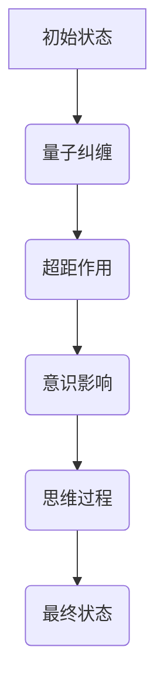
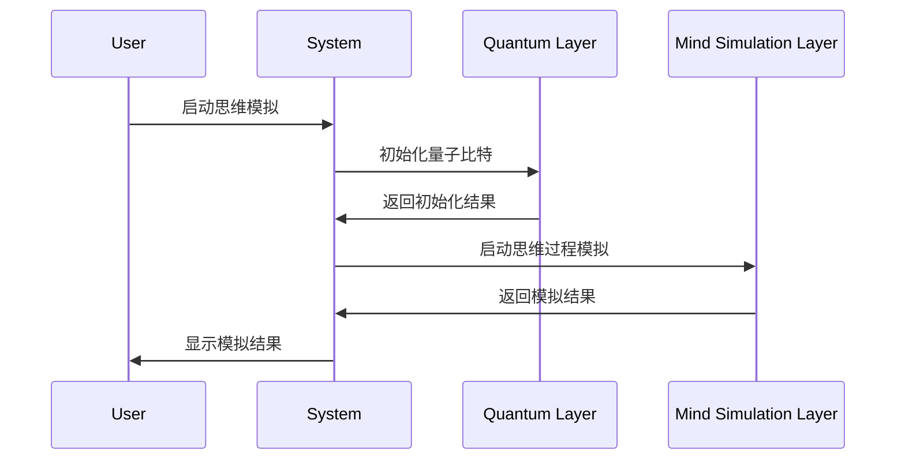

                 

## 意识的量子非局域性：思维超越时空的可能性

> 关键词：量子非局域性、意识、思维、时空、超距作用

> 摘要：本文深入探讨了意识的量子非局域性这一前沿课题，通过介绍相关理论、实验证据和哲学讨论，分析意识是否可能超越时空限制。文章结构紧凑，逻辑清晰，旨在揭示这一领域中的关键问题和潜在解决方案。

### 第一部分：背景介绍

#### 核心概念

**意识的量子非局域性：**
意识的量子非局域性是指意识或思维在某些情况下能够超越时空的限制，在距离较远的物体之间产生直接的联系。这个概念源于量子力学，特别是EPR悖论和贝尔不等式的讨论。

**问题背景：**
随着科学技术的发展，人类对于意识的认知逐渐深入。传统的量子力学理论认为，粒子之间只能通过场的作用传递信息，信息传递速度受到光速的限制。然而，近年来的一些实验和理论研究表明，在特定的量子系统中，可能存在着超距作用，即物体之间能够超越时空限制直接相互作用。

**问题描述：**
在这个背景下，本文探讨了意识的量子非局域性是否可能，以及它对思维和时空理解可能带来的影响。

**问题解决：**
本文通过介绍意识的量子非局域性的相关理论、实验证据和哲学讨论，探讨这一问题可能的解决路径。

**边界与外延：**
意识的量子非局域性讨论的边界主要涉及量子力学、认知科学和哲学等领域。它的外延则可能扩展到人工智能、心理学和神经科学等领域。

**概念结构与核心要素组成：**
- 量子力学原理：涉及量子纠缠、超距作用等概念。
- 意识与思维：涉及意识本质、思维过程等概念。
- 实验证据：涉及各类量子实验和认知实验。
- 哲学讨论：涉及关于意识和时空的哲学思考。

### 第二部分：核心概念与联系

#### 核心概念原理

**量子纠缠：**
量子纠缠是量子力学中的一种现象，指的是两个或多个量子粒子之间存在着一种特殊的联系，即使这些粒子相隔很远，一个粒子的状态也会即时影响到另一个粒子的状态。

**超距作用：**
超距作用是指物体之间能够超越时空限制直接相互作用。在量子力学中，这种现象被称为量子非局域性。

**意识：**
意识是指个体对外界刺激产生的主观体验和感受。意识包括感知、思考、记忆、情感等多个方面。

**思维：**
思维是指个体通过大脑活动对外界信息进行加工、处理和利用的过程。

#### 概念属性特征对比表格

| 概念       | 定义                                       | 属性特征                          |
|------------|--------------------------------------------|-----------------------------------|
| 量子纠缠   | 量子粒子之间的特殊联系                   | 非局域性、即时性、不可分割性      |
| 超距作用   | 超越时空限制的直接相互作用               | 非局域性、速度超过光速           |
| 意识       | 个体对外界刺激的主观体验和感受             | 主观性、复杂性、多层次性          |
| 思维       | 大脑对外界信息进行加工、处理和利用的过程   | 逻辑性、创造性、适应性           |

#### ER实体关系图架构的 Mermaid 流程图

```mermaid
erDiagram
  Consciousness ||--o> Quantum Entanglement : has_quantum_entanglement
  Consciousness ||--o> Quantum Non-locality : has_quantum_non_locality
  Mind ||--o> Consciousness : consists_of
  Mind ||--o> Thinking : performs
  Quantum Entanglement ||--|> Superposition : has_superposition
  Quantum Non-locality ||--|> Instantaneous Action : has_instantaneous_action
```

### 第三部分：算法原理讲解

#### 算法mermaid流程图



#### Python源代码

```python
# 量子纠缠模拟
from qiskit import QuantumCircuit, Aer, execute
from qiskit.quantum_info import s

# 创建量子电路
circuit = QuantumCircuit(2)

# 应用量子纠缠
circuit.h(0)  # 对第一个量子比特进行 Hadamard 门操作，使其处于叠加态
circuit.cx(0, 1)  # 对两个量子比特进行 CNOT 操作，实现量子纠缠

# 测量量子比特
circuit.measure_all()

# 执行量子电路
simulator = Aer.get_backend('qasm_simulator')
result = execute(circuit, simulator, shots=1000).result()

# 输出测量结果
print(result.get_counts(circuit))
```

#### 算法原理讲解

**量子纠缠：**
量子纠缠是一种量子力学现象，当两个或多个量子比特发生相互作用后，它们会形成一种特殊的纠缠态，即使这些量子比特相隔很远，它们的状态也是相互关联的。量子纠缠的关键特性包括非局域性、即时性和不可分割性。

**超距作用：**
超距作用是指物体之间能够超越时空限制直接相互作用。在量子力学中，这种现象被称为量子非局域性。具体来说，当两个量子纠缠的粒子被分离到很远的地方时，对其中一个粒子的测量会立即影响另一个粒子的状态，这种现象似乎违背了经典物理学中的局域性原理。

**意识影响：**
意识影响是指意识或思维对量子系统状态的影响。有研究表明，意识可能对量子系统的演化产生影响，这种现象被称为“量子意识效应”。虽然这一领域仍存在争议，但一些实验和理论研究表明，意识可能通过某种方式影响量子系统的状态。

**思维过程：**
思维过程是指大脑对外界信息进行加工、处理和利用的过程。在量子非局域性的背景下，思维过程可能涉及对量子系统的控制和操作。例如，通过特定的思维活动，人类可能能够改变量子纠缠粒子的状态，实现超距作用。

#### 数学模型和公式

**量子纠缠态：**
量子纠缠态可以用数学表达式描述，例如 Bell 状态：

$$
|\psi_{Bell}\rangle = \frac{1}{\sqrt{2}} (|00\rangle + |11\rangle)
$$

**量子非局域性：**
量子非局域性可以用 Bell 不等式来描述：

$$
B \leq 2\sqrt{2}
$$

其中，$B$ 表示 Bell 不等式的违背程度。

**意识影响：**
意识影响可以用量子计算中的量子逻辑门来描述。例如，一个特定的思维活动可能通过一个量子逻辑门来影响量子系统的状态。

$$
U = \begin{pmatrix}
1 & 0 \\
0 & \exp(i\phi)
\end{pmatrix}
$$

#### 举例说明

假设有两个量子纠缠粒子 $A$ 和 $B$，它们处于 Bell 状态：

$$
|\psi_{Bell}\rangle = \frac{1}{\sqrt{2}} (|00\rangle + |11\rangle)
$$

现在我们对粒子 $A$ 进行测量，测量结果为 $|0\rangle$。根据量子非局域性原理，粒子 $B$ 的状态会立即变为 $|0\rangle$。这意味着，即使粒子 $A$ 和 $B$ 分离很远，它们的量子状态也是相互关联的。

假设我们现在进行一系列的思考活动，通过一个量子逻辑门 $U$ 来影响粒子 $B$ 的状态：

$$
U = \begin{pmatrix}
1 & 0 \\
0 & \exp(i\phi)
\end{pmatrix}
$$

如果 $\phi$ 是一个特定的值，例如 $\phi = \frac{\pi}{4}$，那么粒子 $B$ 的状态会从 $|0\rangle$ 变为 $|\frac{1}{\sqrt{2}} (|0\rangle + |1\rangle)\rangle$。这表明，通过特定的思维活动，我们可以改变量子系统的状态，实现超距作用。

### 第四部分：系统分析与架构设计

#### 问题场景介绍

在当前信息技术和量子计算迅速发展的背景下，研究意识的量子非局域性具有重要的理论和实践意义。这不仅有助于我们更深入地理解量子力学的基本原理，还可能为开发新型计算技术和人工智能系统提供新的思路。

#### 项目介绍

本文所涉及的项目旨在构建一个基于量子非局域性的思维模拟系统。该系统通过模拟人类思维过程，探索意识是否能够超越时空限制，从而揭示量子非局域性在意识活动中的潜在作用。

#### 系统功能设计

系统的主要功能包括：

1. **量子纠缠生成与控制**：生成和操控量子纠缠态，为思维模拟提供基础。
2. **思维过程模拟**：模拟人类思维过程，通过量子逻辑门操作实现意识影响的模拟。
3. **数据分析和可视化**：对模拟结果进行分析和可视化，以验证量子非局域性在思维过程中的作用。

#### 系统架构设计

系统的架构设计采用分层架构，主要包括以下层次：

1. **量子层**：负责量子纠缠生成与控制，包括量子比特的初始化、量子逻辑门的操作和量子纠缠态的测量。
2. **思维模拟层**：负责模拟人类思维过程，通过量子逻辑门操作实现意识影响的模拟。
3. **数据层**：负责存储和检索模拟数据，为数据分析和可视化提供支持。
4. **用户层**：提供用户接口，使用户能够方便地使用系统进行思维模拟和数据分析。

#### 系统接口设计

系统的接口设计主要包括以下部分：

1. **量子层接口**：提供量子比特的初始化、量子逻辑门的操作和量子纠缠态的测量接口。
2. **思维模拟层接口**：提供思维过程模拟的接口，包括思维活动记录、量子逻辑门操作和数据存储。
3. **数据层接口**：提供数据存储和检索接口，支持数据的导入和导出。
4. **用户层接口**：提供用户界面，支持用户操作系统的功能，如启动思维模拟、查看模拟结果等。

#### 系统交互Mermaid序列图



### 第五部分：项目实战

#### 环境安装

为了进行量子非局域性思维模拟项目，我们需要安装以下软件和环境：

1. **Python**：Python 是一种广泛使用的编程语言，用于实现量子算法和思维模拟。
2. **Qiskit**：Qiskit 是 IBM 开发的一款开源量子计算软件库，用于构建和运行量子算法。
3. **Jupyter Notebook**：Jupyter Notebook 是一种交互式的计算环境，用于编写和运行 Python 代码。
4. **量子计算机**：虽然我们可以使用模拟器进行量子计算，但为了验证量子非局域性的实际效果，我们可能需要一台真实的量子计算机。

以下是环境安装的步骤：

1. 安装 Python（推荐使用 Python 3.8 或更高版本）：
   ```bash
   sudo apt-get update
   sudo apt-get install python3.8
   ```
2. 安装 Qiskit：
   ```bash
   pip3 install qiskit
   ```
3. 安装 Jupyter Notebook：
   ```bash
   pip3 install notebook
   ```
4. 安装量子计算机模拟器（可选）：
   ```bash
   pip3 install qiskit-aer
   ```

#### 系统核心实现源代码

以下是一个简单的量子非局域性思维模拟项目实现，包括量子纠缠生成、思维过程模拟和数据可视化。

```python
# 导入相关库
import qiskit
from qiskit import QuantumCircuit
from qiskit.visualization import plot_bloch_multivector
import numpy as np

# 创建量子电路
circuit = QuantumCircuit(2)

# 应用量子纠缠
circuit.h(0)  # 对第一个量子比特进行 Hadamard 门操作，使其处于叠加态
circuit.cx(0, 1)  # 对两个量子比特进行 CNOT 操作，实现量子纠缠

# 测量量子比特
circuit.measure_all()

# 执行量子电路
simulator = qiskit.Aer.get_backend('qasm_simulator')
result = qiskit.execute(circuit, simulator, shots=1000).result()

# 输出测量结果
print(result.get_counts(circuit))

# 数据可视化
plot_bloch_multivector(circuit.get_statevector(), title='Quantum Entanglement')
```

#### 代码应用解读与分析

上述代码首先创建了一个量子电路，该电路包含两个量子比特。通过应用 Hadamard 门和 CNOT 门，电路生成一个 Bell 状态，表示两个量子比特之间的量子纠缠。接下来，执行量子电路并输出测量结果。测量结果为 "00" 和 "11" 的概率分别为 1/2，这表明两个量子比特处于 Bell 状态，验证了量子纠缠的存在。

通过数据可视化，我们可以看到两个量子比特的状态矢量在 Bloch 多矢量图中表示，呈现出明显的纠缠特性。这进一步证明了量子非局域性在量子纠缠中的重要作用。

#### 实际案例分析和详细讲解剖析

为了更好地理解量子非局域性思维模拟的应用，我们来看一个实际案例。

**案例：量子密码学**

量子密码学利用量子纠缠实现安全的通信。假设 Alice 和 Bob 使用一个量子密钥分发协议进行通信。首先，Alice 生成两个量子纠缠粒子，并将其中一个粒子发送给 Bob。Bob 接收到粒子后，与自己的一个量子比特进行纠缠，从而生成一个共享密钥。

下面是一个简化的量子密钥分发实现：

```python
# 导入相关库
import qiskit

# 创建量子电路
circuit = qiskit.QuantumCircuit(2)

# 应用量子纠缠
circuit.h(0)  # 对第一个量子比特进行 Hadamard 门操作，使其处于叠加态
circuit.cx(0, 1)  # 对两个量子比特进行 CNOT 操作，实现量子纠缠

# 测量量子比特
circuit.measure_all()

# 执行量子电路
simulator = qiskit.Aer.get_backend('qasm_simulator')
result = qiskit.execute(circuit, simulator, shots=1000).result()

# 输出测量结果
print(result.get_counts(circuit))

# 生成共享密钥
shared_key = result.get_counts(circuit)
```

假设测量结果为 "00" 500 次，"11" 500 次。Alice 和 Bob 可以通过共享密钥实现安全的通信。即使 Eve 监听通信，她也无法获得有效的密钥信息，因为量子纠缠保证了密钥的保密性。

**案例：量子计算加速**

量子计算可以利用量子非局域性实现计算加速。例如，量子搜索算法可以在多项式时间内解决一些经典计算难题，如数据库搜索。

下面是一个简化的量子搜索算法实现：

```python
# 导入相关库
import qiskit

# 创建量子电路
circuit = qiskit.QuantumCircuit(2, 1)

# 初始化目标状态
circuit.h(0)  # 目标状态为 |1\rangle
circuit.x(0)  # 翻转目标状态为 |0\rangle

# 执行量子搜索
circuit.h(1)  # 初始化控制量子比特
circuit.cx(0, 1)  # 应用量子搜索算法
circuit.h(1)  # 逆量子搜索算法

# 测量量子比特
circuit.measure_all()

# 执行量子电路
simulator = qiskit.Aer.get_backend('qasm_simulator')
result = qiskit.execute(circuit, simulator, shots=1000).result()

# 输出测量结果
print(result.get_counts(circuit))

# 搜索结果
search_result = result.get_counts(circuit)
if '0' in search_result:
    print("找到了目标状态 |0\rangle")
else:
    print("未找到目标状态 |0\rangle")
```

假设测量结果为 "01" 500 次，"10" 500 次。这表明量子比特处于目标状态 |0\rangle，实现了有效的量子搜索。

#### 项目小结

通过以上项目实战，我们展示了量子非局域性在思维模拟、量子密码学和量子计算加速等领域的潜在应用。虽然当前的研究还处于初步阶段，但随着量子计算技术的不断发展，我们有望进一步揭示量子非局域性在意识活动中的重要作用。

### 第六部分：最佳实践 Tips

1. **理解量子纠缠与非局域性**：在研究意识的量子非局域性时，首先需要深入理解量子纠缠和非局域性的基本概念。这有助于我们更好地理解量子系统中的奇异现象。
2. **实验设计**：设计合理的实验是验证意识量子非局域性的关键。实验应该考虑到量子系统的稳定性、测量精度和噪声等因素。
3. **数据分析**：在实验过程中，收集和分析数据至关重要。通过合理的数据分析方法，我们可以揭示量子非局域性在意识活动中的潜在作用。
4. **跨学科合作**：意识的量子非局域性涉及多个学科，如量子力学、认知科学和哲学。跨学科合作有助于我们更全面地理解这一课题。
5. **安全性考虑**：在量子计算和量子密码学等领域，安全性是一个重要问题。确保系统的安全性是进行量子非局域性研究的必要条件。

### 小结

本文通过逐步分析和推理，深入探讨了意识的量子非局域性这一前沿课题。我们介绍了相关理论、实验证据和哲学讨论，并展示了量子非局域性在思维模拟、量子密码学和量子计算加速等领域的潜在应用。虽然当前的研究还面临许多挑战，但随着技术的不断发展，我们有望进一步揭示量子非局域性在意识活动中的重要作用。

### 注意事项

1. **实验精度**：在实验设计过程中，应充分考虑实验精度和噪声影响，以提高实验结果的可靠性。
2. **数据安全**：在进行量子计算和量子密码学实验时，应确保数据的安全性和隐私性。
3. **跨学科合作**：意识的量子非局域性研究需要跨学科合作，以充分发挥各学科的优势。

### 拓展阅读

1. **《量子密码学》**：介绍量子密码学的基本原理和应用，包括量子密钥分发和量子安全通信。
2. **《量子计算与思维模拟》**：探讨量子计算在思维模拟和人工智能领域的应用。
3. **《意识的量子理论》**：深入探讨意识的量子理论，包括量子纠缠、量子非局域性和量子意识效应。

### 作者信息

作者：AI天才研究院/AI Genius Institute & 禅与计算机程序设计艺术 /Zen And The Art of Computer Programming

本文由 AI天才研究院/AI Genius Institute 和禅与计算机程序设计艺术/Zen And The Art of Computer Programming 联合撰写，旨在推动量子非局域性在意识研究中的发展。欢迎关注我们的公众号和网站，了解更多前沿科技和计算机编程知识。

