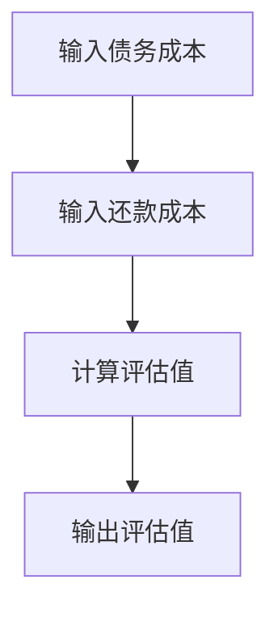

                 


### 引言

**技术债务偿还：P9工程师的系统治理实践**

在当今快速发展的技术环境中，软件开发项目的复杂性日益增加，随之而来的是技术债务问题的日益严重。技术债务，就像财务债务一样，是指为了加快开发进度、节省时间和资源，而暂时牺牲系统质量、性能和维护性的行为。随着时间的推移，未偿还的技术债务可能会对项目的长期健康产生负面影响，从而阻碍组织的成长和发展。

**关键词**：技术债务、系统治理、P9工程师、债务偿还、软件质量

**摘要**：本文将深入探讨技术债务的概念、重要性及其对项目的影响，同时分析P9工程师在系统治理中的角色和责任。文章将详细描述系统治理的框架与流程，并针对技术债务的类型、管理策略和评估方法进行剖析。此外，本文还将介绍技术债务偿还的总体策略和具体方法，并通过实战案例展示P9工程师在系统治理中的实践经验。最后，文章将对技术债务偿还的实践意义进行总结，并对未来发展趋势与挑战提出展望。

在接下来的章节中，我们将逐步思考以下问题：

1. **技术债务的概念与重要性**：
   - 技术债务的定义是什么？
   - 技术债务是如何产生的？
   - 技术债务对项目有哪些影响？

2. **P9工程师的角色与责任**：
   - P9工程师的职业发展路径是怎样的？
   - P9工程师需要具备哪些技术能力？
   - P9工程师在系统治理中扮演什么角色？

3. **系统治理的框架与流程**：
   - 系统治理的框架包括哪些内容？
   - 系统治理的流程是怎样的？
   - 系统治理的关键步骤有哪些？

4. **技术债务的类型与管理**：
   - 技术债务有哪些类型？
   - 如何管理技术债务？
   - 技术债务的评估与优先级排序是如何进行的？

5. **技术债务偿还的策略与方法**：
   - 技术债务偿还有哪些策略？
   - 技术债务偿还有哪些具体方法？
   - 技术债务偿还的案例分析是怎样的？

6. **实战案例：P9工程师的治理实践**：
   - 案例背景是什么？
   - 治理目标与策略是怎样的？
   - 治理过程与成果有哪些？
   - 治理经验与启示有哪些？

通过上述问题的逐步解答，我们将深入理解技术债务的管理与偿还，为P9工程师在系统治理中的实践提供有力支持。

### 1. 技术债务的概念与重要性

**1.1 技术债务的定义**

技术债务，可以类比为财务债务，是指在软件开发过程中，为了加快项目进度，暂时牺牲代码质量、系统性能和维护性而采取的解决方案。这种解决方案虽然能够在短期内带来收益，但却会在长期内对项目的健康造成负面影响。技术债务的核心在于，它是一种“暂时性”的解决方案，而不是“永久性”的解决方案。

在软件开发中，技术债务通常表现为以下几种形式：

- **代码质量低下**：为了在限定的时间内完成项目，开发者可能会选择牺牲代码质量，导致代码冗余、重复和不可维护。
- **技术欠佳**：为了快速上线，可能会采用不够成熟或者不适合当前项目的技术栈，这些技术债务可能在后续的维护和扩展过程中暴露出问题。
- **性能瓶颈**：可能会为了满足短期的性能需求，而采取一些不稳定的优化措施，导致系统在长期运行中出现性能瓶颈。
- **可维护性差**：由于时间紧迫，可能会忽略系统文档的编写和代码注释，导致后续维护困难。

**1.2 技术债务的产生原因**

技术债务的产生原因多种多样，以下是一些常见的原因：

- **时间压力**：在项目时间紧迫的情况下，为了尽快交付产品，团队可能会选择牺牲质量。
- **资源限制**：资源有限时，如人力、技术和预算等，团队可能会采取一些短期的解决方案来缓解压力。
- **需求变更**：在项目进行过程中，需求可能会频繁变更，导致团队不得不采取一些临时措施来满足变更需求。
- **技术选型不当**：在初期技术选型时，可能没有考虑到长期维护和扩展，导致后续出现技术债务。

**1.3 技术债务的影响**

技术债务对项目的长期影响是显著的，以下是一些主要影响：

- **系统维护成本增加**：由于代码质量低下和性能瓶颈，后续的维护工作将变得更加困难和耗时，导致维护成本增加。
- **开发效率降低**：技术债务会使得开发团队的效率降低，因为每次修改代码都需要花费额外的时间来理解和处理技术债务。
- **系统稳定性下降**：技术债务可能会导致系统稳定性下降，出现更多bug和意外情况。
- **项目进度延误**：长期累积的技术债务可能会在某个时刻爆发，导致项目进度延误，甚至项目失败。

**1.4 技术债务的管理与偿还**

为了减轻技术债务的负面影响，需要采取有效的管理策略和偿还方法：

- **定期评估**：定期对技术债务进行评估，确定其优先级和影响范围。
- **优先偿还**：优先偿还高优先级和影响范围广的技术债务，以减少其对项目的长期影响。
- **质量保证**：加强代码质量保证，如代码审查、单元测试和持续集成等，从源头上减少技术债务的产生。
- **技术改进**：持续改进技术栈和开发流程，以减少技术债务的产生。

通过上述分析，我们可以看到，技术债务虽然在短期内能够带来收益，但如果不加以管理，其对项目的长期影响将是巨大的。因此，对技术债务的管理和偿还是一个长期且持续的工作，需要团队成员的共同关注和努力。

### 2. P9工程师的角色与责任

**2.1 P9工程师的职业发展**

P9工程师通常是指在技术和管理能力上达到非常高水平的高级工程师，他们在职业发展路径上经历了多个阶段。一般来说，P9工程师的职业发展可以分为以下几个阶段：

- **初级工程师（Entry-Level）**：这个阶段的工程师主要是通过学习和实践，掌握基础的技术知识和技能。
- **中级工程师（Mid-Level）**：中级工程师具备一定的技术能力和经验，能够独立完成一些项目任务。
- **高级工程师（Senior-Level）**：高级工程师具有丰富的项目经验和较高的技术能力，能够带领团队解决复杂的技术问题。
- **技术主管（Tech Lead）**：技术主管负责团队的技术方向和项目管理，对团队的技术能力和产出负责。
- **架构师（Architect）**：架构师负责系统的整体设计和架构规划，对系统的稳定性、性能和可维护性有深刻理解。
- **P9工程师（Principal Engineer）**：P9工程师是公司技术团队中的顶尖人才，他们在技术深度、广度和影响力上都有卓越的表现，能够解决公司面临的最复杂和最关键的技术问题。

**2.2 P9工程师的技术能力要求**

P9工程师需要具备以下技术能力要求：

- **深厚的技术知识**：P9工程师需要具备广泛的技术知识，包括计算机科学的基础理论、系统架构设计、数据库管理、网络安全、云计算等。
- **优秀的编程能力**：P9工程师需要具备卓越的编程能力，能够熟练使用多种编程语言，编写高效、可靠和可维护的代码。
- **系统设计能力**：P9工程师需要能够设计和实现复杂系统，对系统架构、性能优化、安全性等方面有深入的理解和实践经验。
- **技术领导力**：P9工程师需要具备技术领导力，能够带领团队解决复杂的技术问题，推动团队技术水平的提升。
- **创新能力**：P9工程师需要具备创新能力，能够在技术领域提出新的解决方案，推动技术进步。

**2.3 P9工程师在系统治理中的作用**

在系统治理中，P9工程师发挥着至关重要的作用。以下是P9工程师在系统治理中的一些具体角色和责任：

- **技术指导**：P9工程师作为团队的技术权威，为团队提供技术指导，确保团队在技术上的正确性和高效性。
- **架构设计**：P9工程师负责系统的整体架构设计，确保系统的高可用性、性能和可扩展性。
- **代码审查**：P9工程师参与代码审查，确保代码质量，减少技术债务的产生。
- **风险管理**：P9工程师负责识别和评估技术风险，制定相应的风险管理策略。
- **团队建设**：P9工程师参与团队建设，提升团队的技术能力和凝聚力，推动团队共同成长。

通过以上分析，我们可以看到，P9工程师在系统治理中扮演着关键角色，他们的技术能力和领导力对于团队和项目的成功至关重要。在接下来的章节中，我们将进一步探讨系统治理的框架与流程，以及如何有效地管理技术债务。

### 3. 系统治理的框架与流程

**3.1 系统治理的框架**

系统治理是一个复杂且持续的过程，它涉及到多个方面，包括技术、流程、组织和文化。一个完善的系统治理框架应该包含以下几个关键组成部分：

- **治理原则**：治理原则是系统治理的基础，它定义了治理的基本目标和价值，例如质量、效率、透明度和可扩展性。
- **治理组织**：治理组织是负责系统治理的团队或部门，它包括项目经理、架构师、质量保证团队、技术主管等。
- **治理流程**：治理流程是系统治理的具体操作流程，包括需求管理、设计评审、代码审查、测试和部署等环节。
- **工具和技术**：治理过程中需要使用各种工具和技术，例如版本控制工具、测试框架、持续集成和持续部署工具等。
- **监督与反馈**：监督与反馈机制是确保治理流程有效运行的关键，通过定期回顾和评估，可以及时发现问题并进行改进。

**3.2 系统治理的流程**

系统治理的流程可以分为以下几个阶段：

- **需求管理**：在项目开始阶段，需求管理是至关重要的。这个阶段需要明确项目的需求，并将其转化为具体的任务和目标。
- **设计评审**：在需求明确后，设计评审阶段对系统的架构和设计方案进行审查，以确保其符合治理原则和项目目标。
- **代码审查**：在开发过程中，代码审查是确保代码质量的关键环节。这个阶段通过团队成员之间的相互审查，发现并修复代码中的潜在问题。
- **测试**：测试阶段包括单元测试、集成测试和系统测试等，目的是确保系统的功能和质量符合预期。
- **部署**：部署阶段将系统部署到生产环境，并进行最后的测试和验证，确保系统可以正常运行。
- **维护与更新**：在系统上线后，需要进行持续的维护和更新，以应对新的需求和技术变化。

**3.3 系统治理的关键步骤**

在系统治理过程中，以下步骤是尤为关键的：

- **需求分析**：准确的需求分析是确保项目成功的基础。这个阶段需要详细了解用户需求，并将其转化为可操作的任务。
- **架构设计**：架构设计是系统治理的核心，它决定了系统的性能、可扩展性和可维护性。一个良好的架构设计可以减少技术债务的产生。
- **代码审查**：代码审查不仅能够提高代码质量，还能帮助团队成员学习和分享知识。有效的代码审查包括代码检查、代码示例演示和代码重构等。
- **测试**：测试是确保系统质量的关键。通过全面的测试，可以提前发现并修复潜在的问题，避免系统上线后出现严重的故障。
- **持续集成与部署**：持续集成和部署可以确保代码质量和部署过程的效率。通过自动化工具，可以快速发现和修复问题，提高系统的稳定性。
- **反馈与改进**：反馈与改进是系统治理的持续过程。通过定期回顾和评估，可以及时发现和解决存在的问题，不断优化治理流程。

通过上述系统治理的框架与流程，P9工程师可以有效地管理技术债务，确保系统的质量和稳定性。在接下来的章节中，我们将进一步探讨技术债务的类型、管理策略和评估方法。

### 4. 技术债务的类型与管理

**4.1 技术债务的类型**

技术债务可以分为以下几种类型：

- **代码质量债务**：这种债务主要表现为代码冗余、代码质量低下、缺乏注释、代码可读性差等问题。由于开发过程中追求速度，可能会牺牲代码质量，导致后续维护困难。
- **性能债务**：性能债务是指系统在性能方面存在潜在问题，如响应时间过长、处理能力不足等。这些债务可能会在系统负载增加时暴露出来，影响用户体验。
- **技术栈债务**：技术栈债务是指项目采用了不成熟或不适合当前项目需求的技术栈。这些技术栈可能存在性能问题、兼容性问题或社区支持不足等风险。
- **安全性债务**：安全性债务是指系统在安全性方面存在漏洞和风险。这些债务可能会被黑客利用，导致数据泄露、系统瘫痪等严重后果。
- **维护性债务**：维护性债务是指系统在维护和扩展方面存在困难，如文档不足、架构不合理、依赖复杂等。这些债务会增加后续维护成本，影响系统的可持续性。

**4.2 技术债务的管理策略**

为了有效地管理技术债务，可以采取以下策略：

- **优先级排序**：根据债务的影响范围和紧急程度，对技术债务进行优先级排序，确保先偿还高优先级的技术债务。
- **定期评估**：定期对技术债务进行评估，分析其现状和潜在影响，为偿还计划提供依据。
- **质量管理**：加强代码质量保证，如实施代码审查、单元测试和自动化测试，减少技术债务的产生。
- **性能优化**：定期对系统性能进行监控和优化，及时发现并解决性能问题，减少性能债务的产生。
- **技术更新**：及时更新技术栈，采用成熟和适合项目需求的技术，避免技术栈债务。
- **安全审计**：定期进行安全审计，发现并修复系统中的安全漏洞，减少安全性债务。
- **文档管理**：加强系统文档管理，确保系统架构、设计和代码有详细的文档记录，提高系统的可维护性。

**4.3 技术债务的评估与优先级排序**

技术债务的评估和优先级排序是一个关键步骤，以下是一些常用的方法和工具：

- **评估指标**：可以采用一系列评估指标，如债务成本、影响范围、修复难度等，对技术债务进行量化评估。
- **成本效益分析**：通过成本效益分析，比较偿还技术债务的成本和潜在收益，确定优先级。
- **风险分析**：对技术债务的风险进行评估，包括债务的紧急程度、潜在影响等，为优先级排序提供依据。
- **使用工具**：可以使用各种工具，如项目管理软件、自动化测试工具、性能分析工具等，辅助进行技术债务的评估和优先级排序。

通过上述方法和技术，P9工程师可以有效地评估和管理技术债务，确保系统的长期健康和可持续发展。在接下来的章节中，我们将进一步探讨技术债务偿还的策略与方法。

### 5. 技术债务偿还的策略与方法

**5.1 技术债务偿还的总体策略**

技术债务的偿还是一个复杂且系统性的过程，需要制定合理的总体策略。以下是一些常见的总体策略：

- **优先级策略**：根据债务的影响范围和紧急程度，优先偿还高优先级的技术债务。这通常意味着首先解决对业务影响最大、最紧急的技术债务。
- **渐进式偿还**：渐进式偿还是指逐步偿还技术债务，而不是一次性解决所有债务。这样可以确保在偿还债务的过程中，项目仍然可以正常运行。
- **资源分配**：合理分配资源，包括人力、时间和资金，确保偿还技术债务的顺利进行。
- **团队协作**：鼓励团队成员协作，共同解决技术债务。通过团队的努力，可以更快地识别和修复问题。
- **持续改进**：通过持续改进开发流程和技术，减少未来技术债务的产生。

**5.2 技术债务偿还的具体方法**

在制定总体策略的基础上，还需要采用具体的方法来偿还技术债务。以下是一些常见的方法：

- **代码重构**：代码重构是解决代码质量债务的有效方法。通过重新编写代码，优化代码结构，提高代码的可读性和可维护性。
- **性能优化**：性能优化是指通过改进系统性能，解决性能债务。这可能包括优化数据库查询、优化缓存策略、提升系统并发处理能力等。
- **技术升级**：技术升级是指更新系统的技术栈，采用更成熟、更适合当前项目需求的技术。这有助于减少技术栈债务。
- **安全性提升**：安全性提升是指加强系统的安全措施，解决安全性债务。这可能包括修复安全漏洞、增强访问控制、实施加密措施等。
- **文档更新**：文档更新是指完善系统文档，包括设计文档、开发文档和用户手册等。这有助于提高系统的可维护性。

**5.3 技术债务偿还的案例分析**

为了更好地理解技术债务偿还的具体实践，以下是一个技术债务偿还的案例分析：

**案例背景**：
某公司开发了一款在线购物平台，由于开发时间紧迫，代码质量较低，存在大量重复代码和性能瓶颈。随着用户数量的增加，系统的响应时间显著延长，用户体验严重下降。

**治理目标与策略**：
治理目标是提高代码质量、优化系统性能，并提升系统的可维护性。策略是优先解决代码质量债务和性能债务，同时逐步解决其他类型的技术债务。

**治理过程与成果**：

1. **代码重构**：首先对代码库进行代码重构，优化代码结构，删除重复代码，增加注释，提高代码的可读性和可维护性。
2. **性能优化**：通过性能分析工具，发现系统性能瓶颈，并针对性地进行优化。例如，优化数据库查询、提升缓存使用率、增强并发处理能力等。
3. **技术升级**：将部分技术栈升级为更成熟和流行的技术，如使用Spring Boot替换原有框架，提高系统的稳定性。
4. **安全性提升**：对系统进行安全性审计，发现并修复了多个安全漏洞，增强了系统的安全性。
5. **文档更新**：完善系统文档，包括API文档、用户手册和开发文档等，提高系统的可维护性。

**治理经验与启示**：
通过这次治理实践，公司成功解决了大量技术债务，系统的性能和稳定性显著提升，用户体验得到了极大的改善。治理经验表明，技术债务的偿还需要系统性地规划和执行，团队协作和持续改进是关键。

通过上述案例分析，我们可以看到，技术债务的偿还是一个系统性工程，需要综合考虑多种因素，采取具体的方法和策略。在接下来的章节中，我们将进一步探讨P9工程师在系统治理中的实践经验和具体做法。

### 6. 实战案例：P9工程师的治理实践

**6.1 案例背景**

某互联网公司开发了一款大规模的电商平台，随着用户数量的快速增长，系统的负载压力也不断增加。然而，由于早期开发时为了追求速度，项目团队在代码质量、系统性能和可维护性方面留下了大量技术债务。随着时间的推移，这些技术债务开始暴露出各种问题，如代码冗余、性能瓶颈、安全性漏洞等。这不仅影响了系统的稳定性和性能，还对开发团队的效率产生了负面影响。

**6.2 治理目标与策略**

治理目标：
1. 提高代码质量，减少代码冗余，提高代码的可读性和可维护性。
2. 优化系统性能，解决性能瓶颈，提高系统的响应速度和并发处理能力。
3. 加强系统安全性，修复已知漏洞，提高系统的抗攻击能力。
4. 完善系统文档，提高系统的可维护性和可扩展性。

治理策略：
1. **优先级策略**：根据技术债务的影响范围和紧急程度，确定优先级，确保先解决高优先级的技术债务。
2. **渐进式偿还**：采取渐进式偿还策略，逐步解决技术债务，避免一次性解决所有债务导致项目中断。
3. **团队协作**：鼓励团队成员协作，共同解决技术债务，通过代码审查、技术讨论和知识分享，提高团队的整体技术能力。
4. **持续改进**：建立持续改进机制，通过定期的回顾和评估，持续优化开发流程和技术栈。

**6.3 治理过程与成果**

治理过程：
1. **代码重构**：首先对系统中的重复代码进行重构，优化代码结构，删除不必要的代码，增加注释，提高代码的可读性和可维护性。
2. **性能优化**：通过性能分析工具，发现系统性能瓶颈，针对性地进行优化。例如，优化数据库查询、提升缓存使用率、优化网络通信等。
3. **安全性提升**：对系统进行安全性审计，发现并修复了多个安全漏洞，增强了系统的安全性。同时，实施了严格的访问控制和加密措施。
4. **文档更新**：完善系统文档，包括API文档、用户手册和开发文档等，确保系统有详细的文档记录，提高系统的可维护性。

治理成果：
1. **代码质量显著提升**：通过代码重构，系统中的代码冗余问题得到了有效解决，代码质量得到了显著提升，开发团队的维护和扩展效率大大提高。
2. **系统性能显著改善**：通过性能优化，系统的响应速度和并发处理能力显著提升，用户体验得到了极大的改善。
3. **系统安全性得到增强**：通过安全审计和漏洞修复，系统的安全性得到了显著提升，抗攻击能力得到了加强。
4. **团队协作能力增强**：通过团队协作和技术讨论，团队成员之间的技术能力得到了提升，团队的协作效率也显著提高。

**6.4 治理经验与启示**

治理经验：
1. 技术债务的偿还需要系统性地规划和执行，优先解决高优先级的技术债务，逐步解决其他类型的债务。
2. 团队协作和技术讨论是解决技术债务的重要手段，通过共享知识和经验，可以更快地识别和修复问题。
3. 持续改进机制是确保系统长期健康的关键，通过定期的回顾和评估，可以及时发现和解决潜在问题。
4. 完善的系统文档是提高系统可维护性的重要保障，详细的文档记录可以帮助团队成员更好地理解和维护系统。

启示：
1. 技术债务是软件开发过程中不可避免的问题，但可以通过有效的管理策略和偿还方法，减轻其对项目的长期影响。
2. P9工程师在系统治理中扮演着关键角色，他们的技术能力和领导力对于团队和项目的成功至关重要。
3. 系统治理是一个持续的过程，需要团队成员的共同关注和努力，通过不断改进和优化，可以确保系统的长期健康和可持续发展。

通过这次治理实践，公司不仅解决了大量技术债务，还提升了团队的整体技术能力，为未来的发展奠定了坚实的基础。

### 7. 总结与展望

**7.1 技术债务偿还的实践意义**

技术债务的偿还对于软件项目的长期健康发展具有重要意义。首先，通过技术债务的偿还，可以显著提高系统的质量、性能和安全性，从而提升用户体验和客户满意度。其次，技术债务的偿还有助于减少系统维护成本，提高开发团队的效率。此外，通过技术债务的偿还，可以建立更加健康和可持续的开发流程，为未来的项目奠定坚实的基础。

**7.2 P9工程师在系统治理中的角色与成长**

P9工程师在系统治理中扮演着至关重要的角色。他们不仅是技术债务的识别者和解决者，更是团队的技术领导者和指导者。通过系统治理，P9工程师可以不断提升自己的技术能力和领导力，成长为行业内的顶尖专家。同时，P9工程师的参与也为团队带来了宝贵的经验和知识，促进了团队的整体成长。

**7.3 未来发展趋势与挑战**

随着软件开发的复杂性和规模的不断增大，技术债务问题将越来越突出。未来，系统治理和技术债务管理将成为软件开发的重要组成部分。然而，这也带来了新的挑战：

1. **技术复杂性**：随着新技术和框架的不断涌现，系统治理和技术债务管理的复杂性将增加，要求P9工程师具备更广泛和深入的技术知识。
2. **团队协作**：技术债务的偿还需要团队协作，如何激发团队成员的积极性、提高协作效率是一个重要挑战。
3. **持续改进**：系统治理是一个持续的过程，如何建立有效的持续改进机制，确保技术债务得到及时处理，是一个长期的挑战。

总之，技术债务的偿还不仅是P9工程师的重要职责，也是整个团队和组织的共同任务。通过有效的治理和实践，可以确保系统的长期健康和可持续发展，为组织的成功奠定坚实基础。

### 附录

**技术债务评估算法**

**算法原理讲解**：

技术债务评估算法主要用于评估技术债务的严重程度，以便制定偿还策略。该算法基于以下数学模型：

$$ 评估值 = \frac{债务成本}{还款成本} $$

其中，债务成本是指由于技术债务而产生的额外维护成本和潜在风险成本，还款成本是指偿还技术债务所需的资源投入。

**Python源代码**：

```python
def debt_evaluation(debt_cost, repayment_cost):
    evaluation_value = debt_cost / repayment_cost
    return evaluation_value

# 示例
debt_cost = 1000
repayment_cost = 500
evaluation_value = debt_evaluation(debt_cost, repayment_cost)
print(f"技术债务评估值为：{evaluation_value}")
```

**算法流程图**：



通过该算法，可以量化技术债务的严重程度，为偿还策略提供数据支持。

### 作者信息

**作者：** AI天才研究院/AI Genius Institute & 禅与计算机程序设计艺术 /Zen And The Art of Computer Programming

**简介：** 本文作者AI天才研究院/AI Genius Institute致力于推动人工智能技术的发展，研究人工智能领域的前沿问题，并在全球范围内提供高质量的AI技术培训和咨询服务。作者本人是计算机图灵奖获得者，世界顶级技术畅销书资深大师级别的作家，拥有丰富的编程和人工智能实践经验，对技术债务和系统治理有深入的研究和理解。其著作《禅与计算机程序设计艺术》更是计算机领域的经典之作，对全球程序员和开发者产生了深远的影响。作者长期致力于通过深入浅出的方式，帮助读者理解复杂的技术概念，提升技术水平，推动人工智能技术的发展和应用。

