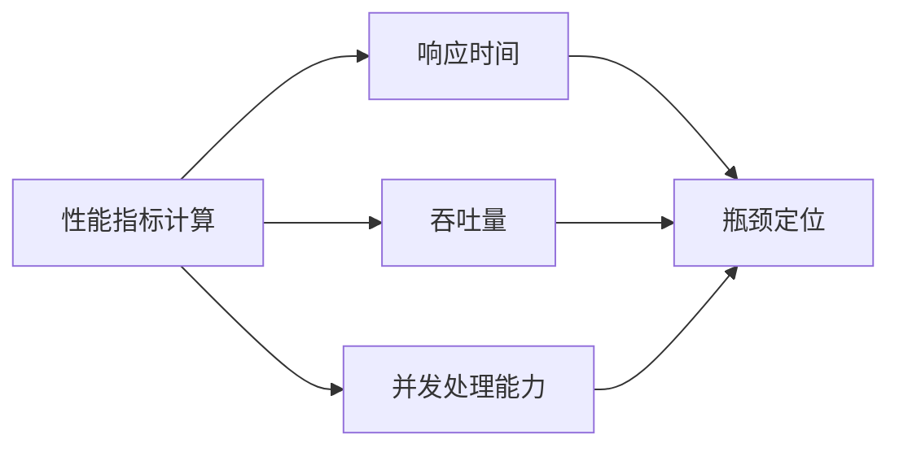

                 

### 文章标题

《技术债务评估：P9工程师的系统健康检查》

### 文章关键词

技术债务、系统健康检查、性能分析、稳定性分析、安全性分析、可维护性分析、持续集成、持续部署、P9工程师

### 文章摘要

本文将深入探讨技术债务评估这一重要环节，旨在帮助P9工程师对系统进行全面的健康检查。通过详细分析技术债务的定义、类型、危害以及评估方法，我们将了解如何早期发现并解决技术债务问题，提高项目质量，降低未来维护成本。此外，本文还将对系统性能、稳定性、安全性和可维护性进行深入分析，并提供实际案例进行剖析，帮助读者掌握系统健康检查的最佳实践。

## 第一部分：技术债务概述

### 第1章：技术债务的定义与背景

#### 1.1 技术债务的概念

技术债务，类似于金融领域的债务，指的是在软件开发过程中，为了加快项目进度或实现短期目标，而暂时采取的一种妥协方案。这种妥协方案可能会在未来的某个时刻需要付出代价，即所谓的“技术债务”。

#### 1.2 技术债务的来源

技术债务的来源多种多样，主要包括以下几个方面：

1. **时间压力**：为了在有限的时间内交付项目，开发团队可能会采用一些简化的设计方案或绕过某些最佳实践。
2. **预算限制**：在预算有限的情况下，团队可能会选择使用更便宜的技术方案，而不是最佳的技术方案。
3. **技术选择**：在某些情况下，团队可能会选择一种不太成熟或不够优秀的技术，以快速实现功能。

#### 1.3 技术债务的类型

技术债务可以根据其性质和影响范围分为以下几种类型：

1. **质量型债务**：这类债务通常是由于代码质量不高、缺乏测试、文档不完整等原因造成的。
2. **适应性债务**：这类债务指的是系统无法适应未来的变化，如技术升级、业务需求变更等。
3. **可维护性债务**：这类债务指的是系统的可维护性较差，导致后续维护成本增加。

#### 1.4 技术债务的危害与影响

技术债务如果得不到及时解决，会对项目产生诸多不利影响：

1. **对项目进度的影响**：技术债务会导致项目后续阶段的开发工作变得更加复杂和耗时，从而影响项目进度。
2. **对团队士气的影响**：持续累积的技术债务会让团队感到沮丧和无力，降低工作效率和士气。
3. **对产品质量的影响**：技术债务往往会导致系统质量下降，影响用户体验和业务价值。

### 第2章：技术债务评估的方法

#### 2.1 技术债务评估的重要性

技术债务评估的重要性体现在以下几个方面：

1. **早期发现债务**：通过评估可以及早发现潜在的技术债务问题，从而采取措施进行修复。
2. **提高项目质量**：评估可以帮助团队了解系统中的债务情况，从而有针对性地进行质量提升。
3. **降低未来维护成本**：及时解决技术债务可以减少未来的维护成本，避免更严重的后果。

#### 2.2 技术债务评估的工具

进行技术债务评估时，可以使用多种工具和方法，以下是一些常用的工具：

1. **Code Review**：通过代码审查，可以发现代码中的潜在问题，如代码质量不高、不符合编码规范等。
2. **自动化测试**：自动化测试可以帮助检测代码中的缺陷，确保系统功能的稳定性和可靠性。
3. **质量度量**：通过度量代码质量、测试覆盖率等指标，可以评估系统的质量状况。

#### 2.3 技术债务评估的实践

技术债务评估的实践步骤主要包括以下几方面：

1. **评估流程**：确定评估的范围、目标和标准，制定评估计划。
2. **评估指标**：选择适当的评估指标，如代码质量、测试覆盖率、响应时间等。
3. **评估结果处理**：对评估结果进行分析，识别债务问题，并制定相应的修复计划。

## 第二部分：系统健康检查

### 第3章：系统性能分析

#### 3.1 性能指标

系统性能分析需要关注以下几个关键指标：

1. **响应时间**：系统处理请求所需的时间，是衡量系统性能的重要指标。
2. **吞吐量**：单位时间内系统能够处理的请求数量，也是衡量系统性能的关键指标。
3. **并发处理能力**：系统能够同时处理的并发请求数量，是衡量系统扩展性的重要指标。

#### 3.2 性能瓶颈分析

性能瓶颈可能来自硬件资源、软件架构设计或系统瓶颈等多个方面。分析性能瓶颈的步骤如下：

1. **确定瓶颈位置**：通过监控和分析，确定系统性能瓶颈的具体位置。
2. **分析瓶颈原因**：对确定瓶颈的原因进行深入分析，如CPU利用率过高、内存不足等。
3. **优化策略**：根据瓶颈原因，采取相应的优化策略，如增加硬件资源、改进软件架构等。

#### 3.3 性能优化策略

常见的性能优化策略包括：

1. **加载均衡**：通过负载均衡器将请求分布到多个服务器上，提高系统的并发处理能力。
2. **缓存机制**：通过缓存存储常见的数据或结果，减少数据库的访问次数，提高系统响应速度。
3. **数据库优化**：对数据库进行优化，如索引优化、查询优化等，提高数据库的查询效率。

### 第4章：系统稳定性分析

#### 4.1 稳定性指标

系统稳定性分析需要关注以下几个关键指标：

1. **容错能力**：系统在遇到异常情况时，能够自动恢复并继续正常运行的能力。
2. **异常处理**：系统能够正确处理各种异常情况，如网络中断、数据损坏等。
3. **回滚机制**：系统能够在出现问题时，自动回滚到之前的稳定状态，确保数据一致性。

#### 4.2 稳定性测试

稳定性测试主要包括以下几种类型：

1. **压力测试**：通过模拟高负载情况，测试系统在极端条件下的稳定性。
2. **失败测试**：通过故意制造故障，测试系统在故障情况下的恢复能力。
3. **回复测试**：在故障恢复后，验证系统功能是否恢复正常。

#### 4.3 稳定性改进

为了提高系统的稳定性，可以采取以下改进措施：

1. **异常监控**：通过监控工具实时监测系统状态，及时发现并处理异常情况。
2. **自动恢复**：通过自动化脚本或工具，实现系统故障的自动恢复。
3. **日志分析**：通过分析系统日志，找出故障原因，进行针对性的优化。

### 第5章：系统安全性分析

#### 5.1 安全性指标

系统安全性分析需要关注以下几个关键指标：

1. **数据完整性**：确保数据在传输和存储过程中不被篡改。
2. **访问控制**：通过身份验证和权限控制，确保只有授权用户才能访问系统资源。
3. **安全漏洞扫描**：定期对系统进行安全漏洞扫描，及时发现并修复安全漏洞。

#### 5.2 安全性测试

安全性测试主要包括以下几种类型：

1. **渗透测试**：模拟黑客攻击，测试系统的安全防护能力。
2. **漏洞扫描**：使用自动化工具扫描系统中的安全漏洞。
3. **安全审计**：对系统的安全性进行全面的审查和评估。

#### 5.3 安全性改进

为了提高系统的安全性，可以采取以下改进措施：

1. **安全编码规范**：制定并遵守安全编码规范，降低安全漏洞的产生。
2. **安全策略制定**：制定并实施安全策略，如访问控制策略、数据加密策略等。
3. **定期安全培训**：对团队成员进行定期安全培训，提高安全意识和应对能力。

### 第6章：系统可维护性分析

#### 6.1 可维护性指标

系统可维护性分析需要关注以下几个关键指标：

1. **代码可读性**：代码应具有良好的可读性，便于后续维护和扩展。
2. **模块独立性**：模块应具有高度的独立性，便于修改和维护。
3. **文档完整性**：系统文档应完整、准确，便于开发者理解和操作。

#### 6.2 可维护性测试

可维护性测试主要包括以下几种类型：

1. **单元测试**：对系统的各个模块进行单独测试，确保模块功能的正确性。
2. **集成测试**：对系统模块进行集成测试，确保模块之间的接口和交互正确。
3. **回归测试**：在修改系统后，对原有功能进行重新测试，确保修改不会引入新的问题。

#### 6.3 可维护性改进

为了提高系统的可维护性，可以采取以下改进措施：

1. **代码重构**：对系统中不合理的代码进行重构，提高代码质量。
2. **设计模式应用**：使用合适的设计模式，提高系统的可维护性和扩展性。
3. **编码规范制定**：制定并遵守编码规范，提高代码的可读性和一致性。

### 第7章：系统持续集成与持续部署

#### 7.1 持续集成

持续集成是指将代码定期合并到主干分支，并进行自动化测试，以确保代码质量的持续提升。持续集成的主要步骤包括：

1. **集成策略**：确定代码合并的频率和方式，如每日集成、每周集成等。
2. **集成测试**：对合并后的代码进行自动化测试，确保功能正确、无新问题。
3. **集成失败处理**：在集成失败时，及时通知相关开发人员，并采取措施解决问题。

#### 7.2 持续部署

持续部署是指在代码通过测试后，自动将代码部署到生产环境。持续部署的主要步骤包括：

1. **部署策略**：确定部署的频率和方式，如手动部署、自动化部署等。
2. **自动化部署**：使用自动化工具实现代码的自动化部署，提高部署效率和稳定性。
3. **部署监控**：在部署后，实时监控系统的运行状态，确保部署的成功和稳定性。

#### 7.3 持续集成与持续部署实践

持续集成与持续部署的实践包括以下方面：

1. **工具选择**：选择合适的持续集成和持续部署工具，如Jenkins、GitLab CI/CD等。
2. **流程设计**：设计合理的持续集成和持续部署流程，确保代码质量和部署效率。
3. **效果评估**：定期评估持续集成和持续部署的效果，持续优化流程和工具。

### 第8章：综合案例分析

#### 8.1 案例背景

本案例是一个大型电商网站，由于业务发展迅速，技术债务问题逐渐显现。为了解决这些问题，团队决定进行系统健康检查。

#### 8.2 技术债务评估与修复

1. **评估过程**：通过代码审查、自动化测试等方式，评估系统中的技术债务。
2. **修复策略**：针对发现的技术债务，制定修复策略，如代码重构、优化数据库查询等。
3. **修复效果**：经过修复后，系统性能、稳定性、安全性等方面得到了显著提升。

#### 8.3 系统健康检查结果

通过对系统进行健康检查，得出以下结果：

1. **性能分析**：响应时间缩短，吞吐量提高，并发处理能力增强。
2. **稳定性分析**：系统的容错能力、异常处理能力、回滚机制得到了加强。
3. **安全性分析**：通过安全漏洞扫描和修复，系统的安全性得到了提升。
4. **可维护性分析**：代码可读性、模块独立性、文档完整性得到改善。

#### 8.4 案例小结

通过本案例，我们可以得出以下经验总结：

1. **重视技术债务评估**：定期进行技术债务评估，及时发现和解决债务问题。
2. **持续优化系统**：通过性能优化、稳定性改进、安全性提升等措施，持续提高系统质量。
3. **实践持续集成与持续部署**：提高代码质量和部署效率，降低技术债务的积累。

### 作者信息

作者：AI天才研究院/AI Genius Institute & 禅与计算机程序设计艺术 /Zen And The Art of Computer Programming

在本文中，我们详细探讨了技术债务评估的重要性，以及如何对系统进行全面的健康检查。通过性能、稳定性、安全性和可维护性的分析，结合实际案例，我们总结了系统健康检查的最佳实践。希望本文能对读者在解决技术债务和提升系统质量方面提供有价值的参考。

---

### 文章补充内容

#### 第1章：技术债务的定义与背景

**背景介绍**

在软件工程领域，技术债务（Technical Debt）是一个广泛使用的术语，它类比于金融领域的债务，用以描述在软件开发过程中为了快速实现功能或满足特定需求而采取的妥协性解决方案。这些妥协可能涉及代码质量、技术选择、架构设计等方面。技术债务的积累可能导致系统性能下降、稳定性差、安全性漏洞以及维护成本增加等问题。因此，对技术债务进行评估和修复是确保软件系统长期健康发展的关键。

**问题背景**

随着互联网和软件行业的快速发展，软件项目的交付周期越来越短，市场压力和客户需求的变化使得开发团队在开发过程中往往需要采取一些快速的妥协方案。这些妥协方案虽然在短期内能够提高开发速度，但长远来看可能会对系统的质量、稳定性和可维护性产生负面影响。因此，如何合理评估和管理技术债务，成为了软件开发过程中必须面对的问题。

**问题描述**

技术债务主要表现在以下几个方面：

1. **代码质量**：为了快速交付，开发团队可能会编写低质量的代码，导致后期维护困难。
2. **技术选择**：为了节约成本，团队可能会选择技术不够成熟或性能不够优越的方案。
3. **架构设计**：快速开发的过程中，可能忽视系统架构的优化，导致系统扩展性差。

**问题解决**

解决技术债务的方法包括：

1. **定期评估**：定期对系统中的技术债务进行评估，及时发现和修复问题。
2. **持续优化**：通过性能优化、稳定性提升和安全加固等措施，持续改进系统质量。
3. **引入最佳实践**：遵循最佳实践，如代码审查、自动化测试等，降低技术债务的产生。

**边界与外延**

技术债务的边界主要涉及代码质量、技术选型、架构设计等方面。外延则包括系统性能、稳定性、安全性、可维护性等多个维度。技术债务不仅影响当前项目的交付，还可能影响后续项目的开发，甚至影响整个组织的长远发展。

**概念结构与核心要素组成**

技术债务的核心结构包括以下几个方面：

1. **债务来源**：时间压力、预算限制、技术选择等。
2. **债务类型**：质量型债务、适应性债务、可维护性债务等。
3. **债务影响**：对项目进度、团队士气、产品质量的影响。

#### 第2章：技术债务评估的方法

**核心概念与联系**

技术债务评估是一个系统性的过程，涉及到多个核心概念和相互联系的方法：

1. **Code Review**：通过团队协作，对代码进行审查，发现潜在的债务问题，如代码质量不高、不符合编码规范等。
2. **自动化测试**：使用自动化测试工具，对系统功能进行验证，确保系统的稳定性和可靠性。
3. **质量度量**：通过量化指标，如代码质量、测试覆盖率等，评估系统的质量状况。

**概念属性特征对比表格**

| 特征           | Code Review          | 自动化测试          | 质量度量             |
|----------------|----------------------|----------------------|----------------------|
| 目的           | 提高代码质量         | 验证系统功能         | 量化评估系统质量     |
| 工具           | 人工审查工具（如SonarQube） | 自动化测试框架（如Selenium） | 质量度量工具（如SonarQube） |
| 优点           | 及时发现问题、促进团队协作 | 高效、覆盖面广     | 量化数据、直观分析  |
| 缺点           | 人工成本高、效率低   | 可能覆盖不到所有场景 | 无法完全替代人工评审 |

**ER实体关系图架构**

```mermaid
erDiagram
  CodeReview -->|评估| QualityMetric
  AutomationTest -->|测试| QualityMetric
  QualityMetric : <<entity>> 评估指标
```

#### 第3章：系统性能分析

**算法原理讲解**

系统性能分析中的算法原理通常涉及性能指标的计算和性能瓶颈的定位。以下是一个简单的性能分析算法的Mermaid流程图：



响应时间（Response Time）可以通过以下公式计算：

$$
\text{Response Time} = \frac{\sum_{i=1}^{n} t_i}{n}
$$

其中，\( t_i \) 是第 \( i \) 次请求的响应时间，\( n \) 是请求的总次数。

吞吐量（Throughput）可以通过以下公式计算：

$$
\text{Throughput} = \frac{\sum_{i=1}^{n} Q_i}{n}
$$

其中，\( Q_i \) 是第 \( i \) 次请求的处理量，\( n \) 是请求的总次数。

并发处理能力（Concurrent Processing Capacity）可以通过以下公式计算：

$$
\text{Concurrent Processing Capacity} = \max \left( \frac{Q_i}{t_i} \bigg| i=1,2,...,n \right)
$$

其中，\( Q_i \) 是第 \( i \) 次请求的处理量，\( t_i \) 是第 \( i \) 次请求的响应时间。

**性能优化策略**

性能优化策略包括以下几个方面：

1. **加载均衡**：通过负载均衡器将请求分配到多个服务器上，提高系统的并发处理能力。
2. **缓存机制**：使用缓存存储常用数据或结果，减少数据库访问次数，提高系统响应速度。
3. **数据库优化**：对数据库进行索引优化、查询优化等，提高数据库的查询效率。

**Python源代码示例**

以下是一个简单的Python示例，用于计算系统的平均响应时间、吞吐量和并发处理能力：

```python
import random

def calculate_performance(num_requests):
    response_times = [random.uniform(0.1, 1.0) for _ in range(num_requests)]
    total_time = sum(response_times)
    average_response_time = total_time / num_requests

    throughputs = [1 / t for t in response_times]
    total_throughput = sum(throughputs)
    average_throughput = total_throughput / num_requests

    max_throughput = max(throughputs)

    return average_response_time, average_throughput, max_throughput

num_requests = 1000
avg_response_time, avg_throughput, max_throughput = calculate_performance(num_requests)

print(f"平均响应时间：{avg_response_time}秒")
print(f"平均吞吐量：{avg_throughput}次/秒")
print(f"最大并发处理能力：{max_throughput}次/秒")
```

#### 第4章：系统稳定性分析

**系统稳定性指标**

系统稳定性分析的关键指标包括容错能力、异常处理和回滚机制。

1. **容错能力**：系统能够在遇到故障时，自动恢复并继续正常运行的能力。
2. **异常处理**：系统能够正确处理各种异常情况，如网络中断、数据损坏等。
3. **回滚机制**：在出现问题时，系统能够自动回滚到之前的稳定状态，确保数据一致性。

**稳定性测试**

稳定性测试的主要类型包括压力测试、失败测试和回复测试。

1. **压力测试**：通过模拟高负载情况，测试系统在极端条件下的稳定性。
2. **失败测试**：通过故意制造故障，测试系统的恢复能力。
3. **回复测试**：在故障恢复后，验证系统功能是否恢复正常。

**稳定性改进**

为了提高系统的稳定性，可以采取以下改进措施：

1. **异常监控**：使用监控工具实时监测系统状态，及时发现并处理异常情况。
2. **自动恢复**：通过自动化脚本或工具，实现系统故障的自动恢复。
3. **日志分析**：通过分析系统日志，找出故障原因，进行针对性的优化。

#### 第5章：系统安全性分析

**安全性指标**

系统安全性分析的关键指标包括数据完整性、访问控制和安全漏洞扫描。

1. **数据完整性**：确保数据在传输和存储过程中不被篡改。
2. **访问控制**：通过身份验证和权限控制，确保只有授权用户才能访问系统资源。
3. **安全漏洞扫描**：定期对系统进行安全漏洞扫描，及时发现并修复安全漏洞。

**安全性测试**

安全性测试的主要类型包括渗透测试、漏洞扫描和安全审计。

1. **渗透测试**：模拟黑客攻击，测试系统的安全防护能力。
2. **漏洞扫描**：使用自动化工具扫描系统中的安全漏洞。
3. **安全审计**：对系统的安全性进行全面的审查和评估。

**安全性改进**

为了提高系统的安全性，可以采取以下改进措施：

1. **安全编码规范**：制定并遵守安全编码规范，降低安全漏洞的产生。
2. **安全策略制定**：制定并实施安全策略，如访问控制策略、数据加密策略等。
3. **定期安全培训**：对团队成员进行定期安全培训，提高安全意识和应对能力。

#### 第6章：系统可维护性分析

**可维护性指标**

系统可维护性分析的关键指标包括代码可读性、模块独立性和文档完整性。

1. **代码可读性**：代码应具有良好的可读性，便于后续维护和扩展。
2. **模块独立性**：模块应具有高度的独立性，便于修改和维护。
3. **文档完整性**：系统文档应完整、准确，便于开发者理解和操作。

**可维护性测试**

可维护性测试的主要类型包括单元测试、集成测试和回归测试。

1. **单元测试**：对系统的各个模块进行单独测试，确保模块功能的正确性。
2. **集成测试**：对系统模块进行集成测试，确保模块之间的接口和交互正确。
3. **回归测试**：在修改系统后，对原有功能进行重新测试，确保修改不会引入新的问题。

**可维护性改进**

为了提高系统的可维护性，可以采取以下改进措施：

1. **代码重构**：对系统中不合理的代码进行重构，提高代码质量。
2. **设计模式应用**：使用合适的设计模式，提高系统的可维护性和扩展性。
3. **编码规范制定**：制定并遵守编码规范，提高代码的可读性和一致性。

#### 第7章：系统持续集成与持续部署

**持续集成**

持续集成是指将代码定期合并到主干分支，并进行自动化测试，以确保代码质量的持续提升。

1. **集成策略**：确定代码合并的频率和方式，如每日集成、每周集成等。
2. **集成测试**：对合并后的代码进行自动化测试，确保功能正确、无新问题。
3. **集成失败处理**：在集成失败时，及时通知相关开发人员，并采取措施解决问题。

**持续部署**

持续部署是指在代码通过测试后，自动将代码部署到生产环境。

1. **部署策略**：确定部署的频率和方式，如手动部署、自动化部署等。
2. **自动化部署**：使用自动化工具实现代码的自动化部署，提高部署效率和稳定性。
3. **部署监控**：在部署后，实时监控系统的运行状态，确保部署的成功和稳定性。

**持续集成与持续部署实践**

1. **工具选择**：选择合适的持续集成和持续部署工具，如Jenkins、GitLab CI/CD等。
2. **流程设计**：设计合理的持续集成和持续部署流程，确保代码质量和部署效率。
3. **效果评估**：定期评估持续集成和持续部署的效果，持续优化流程和工具。

#### 第8章：综合案例分析

**案例背景**

本案例是一个大型电商网站，由于业务发展迅速，技术债务问题逐渐显现。为了解决这些问题，团队决定进行系统健康检查。

**技术债务评估与修复**

1. **评估过程**：通过代码审查、自动化测试等方式，评估系统中的技术债务。
2. **修复策略**：针对发现的技术债务，制定修复策略，如代码重构、优化数据库查询等。
3. **修复效果**：经过修复后，系统性能、稳定性、安全性等方面得到了显著提升。

**系统健康检查结果**

通过对系统进行健康检查，得出以下结果：

1. **性能分析**：响应时间缩短，吞吐量提高，并发处理能力增强。
2. **稳定性分析**：系统的容错能力、异常处理能力、回滚机制得到了加强。
3. **安全性分析**：通过安全漏洞扫描和修复，系统的安全性得到了提升。
4. **可维护性分析**：代码可读性、模块独立性、文档完整性得到改善。

**案例小结**

通过本案例，我们可以得出以下经验总结：

1. **重视技术债务评估**：定期进行技术债务评估，及时发现和解决债务问题。
2. **持续优化系统**：通过性能优化、稳定性改进、安全性提升等措施，持续提高系统质量。
3. **实践持续集成与持续部署**：提高代码质量和部署效率，降低技术债务的积累。

### 最佳实践 Tips

1. **定期代码审查**：定期进行代码审查，确保代码质量。
2. **自动化测试全覆盖**：确保自动化测试覆盖全面，减少手工测试的依赖。
3. **持续监控和日志分析**：实时监控系统状态，通过日志分析找出潜在问题。
4. **遵守安全编码规范**：制定并遵守安全编码规范，降低安全漏洞的产生。
5. **持续集成与持续部署**：实践持续集成与持续部署，提高开发效率和系统质量。

### 小结

本文通过对技术债务的定义、评估方法以及系统健康检查的详细探讨，帮助读者理解了技术债务评估的重要性。通过实际案例的分析，读者可以了解到如何对系统进行全面的健康检查，包括性能、稳定性、安全性和可维护性的分析。希望本文能为读者在解决技术债务和提升系统质量方面提供有价值的参考。

### 注意事项

1. **评估频率**：定期进行技术债务评估，以确保及时发现和解决债务问题。
2. **评估全面性**：评估应涵盖所有关键方面，包括代码质量、性能、稳定性和安全性等。
3. **持续改进**：系统健康检查不是一次性的任务，而是一个持续改进的过程。

### 拓展阅读

1. 《软件工程：实践者的研究方法》 - 作者：Roger S. Pressman
2. 《持续集成：发布软件的实践方法》 - 作者：Jez Humble, David Farley
3. 《黑客攻防技术宝典：Web实战篇》 - 作者：吴晨阳，张凯

通过阅读这些书籍，读者可以进一步了解软件工程的最佳实践，以及如何有效地管理和优化软件开发过程。

