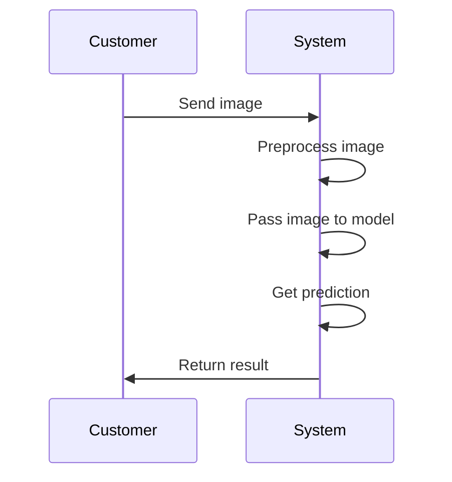
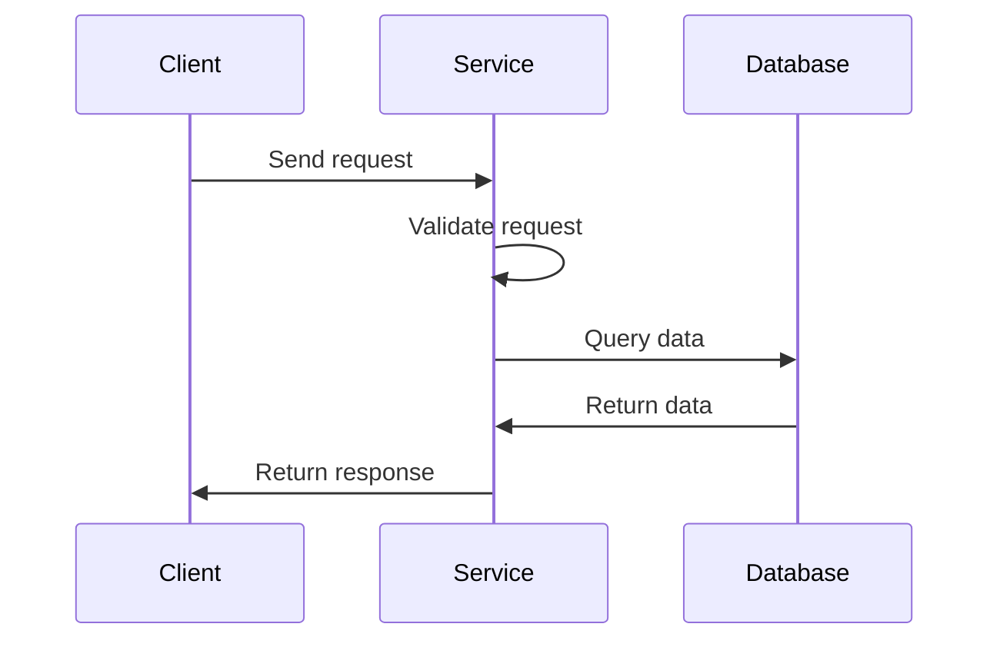
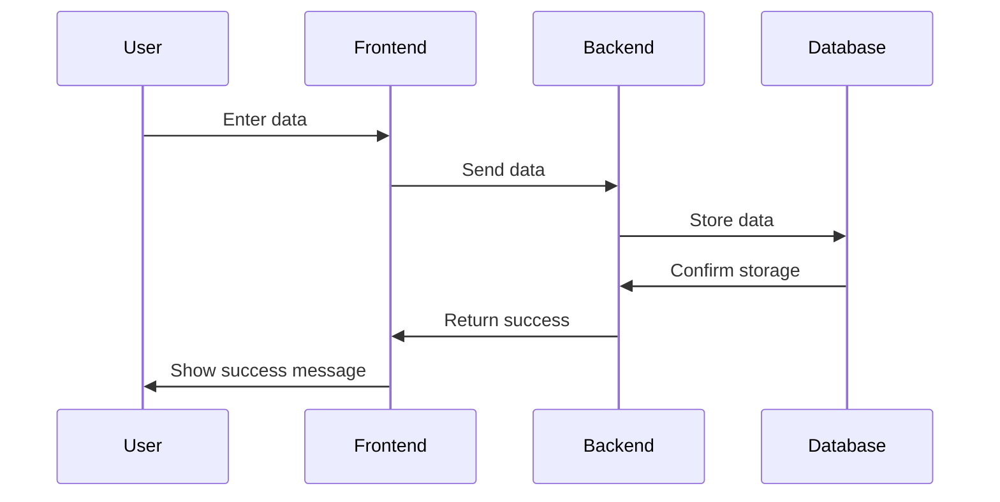

                 

### 引言

在现代信息技术飞速发展的背景下，技术创新已经成为推动社会进步和经济发展的核心动力。作为技术创新的重要推动者，P9工程师，通常指的是在技术领域拥有卓越才能和丰富经验的资深工程师，他们的思维模式、创新能力和前瞻性思维，直接影响到技术孵化的质量和效率。因此，本文以《技术创新孵化：P9工程师的前瞻性思维》为题，旨在探讨P9工程师如何运用前瞻性思维进行技术创新孵化。

关键词：技术创新、P9工程师、前瞻性思维、孵化、技术创新方法论。

摘要：本文将从问题背景、核心概念、创新思维模式、市场趋势分析、技术孵化实战、前瞻性思维的实践应用、P9工程师的职业发展、创新孵化与前瞻性思维的融合以及小结与展望等方面，系统性地分析P9工程师如何通过前瞻性思维进行技术创新孵化，为读者提供有价值的思考和实践指导。

### 1. 问题背景与核心概念

#### 1.1 技术创新的重要性

技术创新不仅是企业竞争力的源泉，更是国家竞争力的体现。在全球化竞争日益激烈的今天，企业要想在市场中脱颖而出，必须不断进行技术创新，以适应快速变化的市场需求和客户需求。P9工程师作为技术领域的佼佼者，承担着推动技术创新的重要责任。他们的创新能力、技术视野和前瞻性思维，直接影响到企业的技术实力和未来发展。

#### 1.2 P9工程师的角色与责任

P9工程师通常具备深厚的技术功底和丰富的项目经验，他们在团队中扮演着技术专家和领导者的角色。他们不仅要负责技术研究和产品开发，还要对整个项目的技术方向和战略进行决策。因此，P9工程师需要具备前瞻性思维，能够预见技术趋势，指导团队进行技术创新和孵化。

#### 1.3 前瞻性思维的核心要素

前瞻性思维是一种对未来趋势的洞察力和预见能力，它包括以下几个核心要素：

1. **广泛的知识储备**：P9工程师需要不断学习新知识，掌握最新的技术动态，以拓宽视野，提升创新能力。

2. **逻辑推理能力**：通过逻辑推理，P9工程师可以从大量的信息中筛选出关键因素，进行深入分析和判断。

3. **系统思维**：能够从整体上理解技术体系，把握技术发展的方向和趋势。

4. **创新思维**：具备创新意识，能够从现有技术和产品中发现新的突破点。

5. **决策能力**：在复杂多变的环境中，能够做出科学、合理的决策。

### 2. 创新孵化方法论

#### 2.1 创新思维模式

创新思维模式是P9工程师进行技术创新的基础。常见的创新思维模式包括：

1. **头脑风暴**：通过集体讨论，激发团队成员的创意，形成新的想法。

2. **设计思维**：以用户需求为中心，通过迭代设计和测试，不断优化产品。

3. **思维导图**：利用思维导图，将创意和思路可视化，帮助团队更好地组织和管理想法。

4. **TRIZ方法**：基于问题解决理论，通过矛盾分析和解决方案生成，推动技术创新。

#### 2.2 脑科学在创新思维中的应用

脑科学研究表明，人的大脑具有强大的创新潜能，但往往受到潜意识、习惯思维和情绪等因素的干扰。P9工程师可以通过以下方式利用脑科学，提升创新思维：

1. **冥想**：通过冥想，减少大脑干扰，提高专注力和创造力。

2. **睡眠**：保证充足的睡眠，有助于大脑整合信息，产生新的思维。

3. **锻炼**：适当的身体锻炼，可以促进血液循环，提高大脑功能。

4. **多样化体验**：通过多样化的体验，拓宽视野，激发新的创意。

#### 2.3 市场趋势分析

市场趋势分析是P9工程师进行技术创新的重要参考。通过分析市场趋势，P9工程师可以：

1. **技术发展趋势预测**：预测未来技术发展方向，为技术创新提供方向。

2. **行业动态**：了解行业动态和竞争对手情况，把握市场机会。

3. **用户需求**：通过用户需求分析，发现潜在的市场需求，指导产品创新。

#### 2.4 创新孵化流程

创新孵化流程包括以下几个阶段：

1. **技术调研**：对新技术进行调研和评估，确定技术可行性。

2. **概念验证**：通过原型设计和测试，验证创新想法的可行性。

3. **产品开发**：在原型验证的基础上，进行产品开发和优化。

4. **市场测试**：将产品推向市场，收集用户反馈，进行迭代优化。

### 3. 技术孵化实战

#### 3.1 技术选择与评估

技术选择和评估是技术创新的关键环节。P9工程师需要：

1. **建立技术评估框架**：根据项目需求，制定合适的技术评估标准。

2. **进行技术对比分析**：对不同技术进行对比，选择最合适的技术。

3. **案例分析**：通过案例分析，总结技术选择的成功经验和教训。

#### 3.2 创新孵化流程

创新孵化流程包括以下几个阶段：

1. **技术研究阶段**：对新技术进行深入研究，确定技术路线。

2. **产品开发阶段**：进行产品设计和开发，实现技术转化。

3. **市场测试阶段**：将产品推向市场，收集用户反馈，进行迭代优化。

#### 3.3 成功孵化案例分析

通过成功孵化案例分析，可以深入了解技术创新的实践过程和关键要素。

1. **案例一：AI在金融行业的应用**：分析AI技术在金融行业中的应用场景、技术挑战和成功经验。

2. **案例二：物联网技术在智能家居的应用**：探讨物联网技术在智能家居领域的应用，以及如何实现技术创新。

### 4. 前瞻性思维的实践应用

#### 4.1 领导力与团队建设

前瞻性思维在领导力提升和团队建设中具有重要作用。P9工程师需要：

1. **前瞻性思维的领导力**：通过前瞻性思维，提升领导力和决策能力。

2. **团队管理**：运用前瞻性思维，培养团队创新意识和协作能力。

#### 4.2 技术预见与风险应对

技术预见和风险应对是P9工程师的重要职责。通过以下方法，可以提升技术预见和风险应对能力：

1. **技术预见方法**：学习并应用各种技术预见方法，如趋势分析、情景分析等。

2. **风险管理策略**：建立完善的风险管理体系，制定风险应对策略。

### 5. P9工程师的职业发展

#### 5.1 职业技能提升

P9工程师需要不断提升职业技能，包括：

1. **技术技能**：掌握最新的技术知识和技能。

2. **软技能**：提升沟通、协作和领导能力。

3. **持续学习**：通过不断学习，保持技术前沿的敏锐性。

#### 5.2 高级工程师的职业路径

高级工程师的职业路径包括：

1. **技术专家**：通过深入研究，成为领域内的技术专家。

2. **技术领导**：带领团队，推动技术创新和项目成功。

3. **技术战略规划**：参与公司技术战略规划，为企业发展提供技术支持。

### 6. 创新孵化与前瞻性思维的融合

#### 6.1 创新孵化过程中的前瞻性思维应用

在创新孵化过程中，前瞻性思维的应用至关重要。P9工程师需要：

1. **技术选择**：通过前瞻性思维，选择最适合的技术。

2. **风险控制**：通过前瞻性思维，预见潜在风险，制定风险控制策略。

#### 6.2 前瞻性思维的实践策略

前瞻性思维的实践策略包括：

1. **建立知识体系**：构建广泛的知识体系，提升思维深度。

2. **培养创新意识**：鼓励创新思维，推动技术创新。

3. **持续实践**：通过不断的实践，提升前瞻性思维能力。

### 7. 小结与展望

#### 7.1 书籍总结

本文从多个角度分析了P9工程师如何通过前瞻性思维进行技术创新孵化，包括核心概念、创新思维模式、市场趋势分析、技术孵化实战、前瞻性思维的实践应用、P9工程师的职业发展以及创新孵化与前瞻性思维的融合等。

#### 7.2 对未来的展望

随着科技的不断进步，P9工程师的角色和责任将变得更加重要。通过不断提升前瞻性思维和创新能力，P9工程师将能够更好地推动技术创新，引领企业发展，为社会进步做出更大的贡献。

#### 7.3 阅读指南与拓展学习

为了更好地理解和应用本文的内容，读者可以参考以下拓展学习资源：

1. **相关书籍**：《创新者的窘境》、《创新者的基因》等。

2. **在线课程**：Coursera、edX等平台上的创新和领导力相关课程。

3. **学术论文**：关注技术趋势和创新方法论的前沿研究。

---

作者：AI天才研究院/AI Genius Institute & 禅与计算机程序设计艺术 /Zen And The Art of Computer Programming

### 2.1 创新思维模式

创新思维模式是P9工程师在进行技术创新时不可或缺的工具。通过有效的创新思维模式，P9工程师可以更好地应对复杂的技术挑战，发现并实现创新的机会。以下是一些常见的创新思维模式及其应用：

#### 2.1.1 左脑思维与右脑思维的融合

左脑思维和右脑思维分别代表着逻辑思维和创造性思维。左脑思维注重逻辑、分析和精确性，而右脑思维则强调创造力、直觉和艺术性。将两者结合起来，可以使P9工程师在技术决策中更加全面和深入。

**核心概念**：左脑思维和右脑思维的融合，是指通过平衡逻辑分析和创造性思维，提高问题解决的效率和效果。

**联系**：左脑思维和右脑思维的融合，有助于提高P9工程师的创新能力，使他们在技术决策中既能逻辑严谨地分析问题，又能富有创意地寻找解决方案。

**ER实体关系图架构**：

```mermaid
erDiagram
  Product ::--> Feature : { "包含特征" }
  Product ||--|{ Engineer } Engineer : { "开发者" }
  Engineer ||--|{ Company } Company : { "所属公司" }
```

**算法原理讲解**：

算法原理可以通过以下步骤来解释：

1. **问题定义**：明确技术创新的目标和问题。
2. **数据收集**：收集与问题相关的数据。
3. **逻辑分析**：利用左脑思维对数据进行逻辑分析。
4. **创造性思维**：运用右脑思维进行创造性思考。
5. **方案生成**：结合分析结果和创造性思维，生成解决方案。
6. **验证与优化**：对方案进行验证和优化。

以下是一个简单的Python代码示例，展示了如何将左脑思维和右脑思维结合进行问题解决：

```python
import random

# 左脑思维：逻辑分析
def logical_analysis(data):
    # 对数据进行逻辑分析，找到关键因素
    result = []
    for d in data:
        if d > 10:
            result.append(d)
    return result

# 右脑思维：创造性思维
def creative_thinking():
    # 利用创造性思维，生成新的想法
    ideas = []
    for _ in range(5):
        ideas.append(random.randint(1, 100))
    return ideas

# 综合应用
data = [1, 4, 6, 10, 15, 20]
analyzed_data = logical_analysis(data)
creative_ideas = creative_thinking()

print("分析后的数据：", analyzed_data)
print("创造性想法：", creative_ideas)
```

**数学模型和公式**：

在创新思维模式中，常用的数学模型和公式包括：

1. **逻辑公式**：用于表示逻辑关系，如条件判断（`if-else`）、逻辑运算（`and/or/NOT`）等。
2. **概率模型**：用于评估创新方案的可行性，如贝叶斯定理、蒙特卡洛模拟等。
3. **优化模型**：用于优化创新方案，如线性规划、非线性规划等。

以下是一个简单的线性规划示例：

$$
\begin{align*}
\min \quad c^T x \\
\text{subject to} \quad Ax \le b \\
\end{align*}
$$

这里，`c`是目标函数系数，`x`是变量，`A`和`b`是约束条件。

**举例说明**：

假设P9工程师需要优化一个产品的生产流程，目标是降低生产成本。可以通过以下步骤进行：

1. **问题定义**：确定目标是最小化生产成本。
2. **数据收集**：收集生产成本数据，包括原材料成本、劳动力成本、设备维护成本等。
3. **逻辑分析**：分析现有生产流程，找出成本最高的环节。
4. **创造性思维**：考虑创新方案，如改进生产技术、自动化生产等。
5. **方案生成**：结合分析结果和创造性思维，提出优化方案。
6. **验证与优化**：通过实验或模拟，验证优化方案的有效性，并进行进一步优化。

通过这种方式，P9工程师可以利用创新思维模式，有效地进行技术创新，提升产品质量和降低成本。

### 2.2 市场趋势分析

市场趋势分析是P9工程师在进行技术创新时不可或缺的一环。通过对市场趋势的深入分析，P9工程师可以预见未来的技术发展方向，发现潜在的商业机会，并为技术创新提供有力的指导。

#### 2.2.1 技术发展趋势预测

技术发展趋势预测是市场趋势分析的核心内容。通过分析历史数据和当前技术进展，P9工程师可以预测未来技术的发展方向。

**核心概念**：技术发展趋势预测，是指通过数据分析和趋势分析，预测未来技术的发展方向和速度。

**联系**：技术发展趋势预测有助于P9工程师提前布局，抓住市场机遇，避免技术落后。

**ER实体关系图架构**：

```mermaid
erDiagram
  Technology ::--> Trend : { "包含趋势" }
  Trend ||--|{ Engineer } Engineer : { "进行预测" }
  Engineer ||--|{ Company } Company : { "所属公司" }
```

**算法原理讲解**：

技术发展趋势预测的算法原理通常包括以下几个步骤：

1. **数据收集**：收集与目标技术相关的历史数据，包括技术专利、学术论文、市场报告等。
2. **数据处理**：对收集到的数据进行清洗、整理和预处理。
3. **趋势分析**：利用统计学方法和机器学习算法，分析数据中的趋势。
4. **预测生成**：根据分析结果，生成技术发展趋势的预测模型。

以下是一个简单的Python代码示例，展示了如何使用线性回归模型进行趋势分析：

```python
import numpy as np
import matplotlib.pyplot as plt
from sklearn.linear_model import LinearRegression

# 生成数据
x = np.array([1, 2, 3, 4, 5, 6, 7, 8, 9, 10])
y = np.array([2, 3, 5, 7, 11, 13, 17, 19, 23, 29])

# 创建线性回归模型
model = LinearRegression()

# 模型拟合
model.fit(x[:, np.newaxis], y)

# 预测
x_new = np.array([11, 12, 13])
y_new = model.predict(x_new[:, np.newaxis])

# 绘图
plt.scatter(x, y)
plt.plot(x_new, y_new, color='red')
plt.xlabel('Year')
plt.ylabel('Technology Progress')
plt.show()
```

**数学模型和公式**：

在技术发展趋势预测中，常用的数学模型和公式包括：

1. **线性回归模型**：用于分析数据中的线性关系。
2. **时间序列模型**：用于分析时间序列数据，如ARIMA模型。
3. **神经网络模型**：用于复杂非线性关系的预测。

以下是一个简单的ARIMA模型公式：

$$
\begin{align*}
X_t &= c + \phi_1 X_{t-1} + \phi_2 X_{t-2} + \cdots + \phi_p X_{t-p} \\
&\quad + \theta_1 \epsilon_{t-1} + \theta_2 \epsilon_{t-2} + \cdots + \theta_q \epsilon_{t-q} \\
\end{align*}
$$

其中，`X_t`是时间序列数据，`c`是常数项，`\phi_1, \phi_2, \ldots, \phi_p`是自回归系数，`\theta_1, \theta_2, \ldots, \theta_q`是移动平均系数。

**举例说明**：

假设P9工程师需要预测未来3年的AI技术在金融行业的应用趋势。可以通过以下步骤进行：

1. **问题定义**：确定目标是预测未来3年AI技术在金融行业的应用趋势。
2. **数据收集**：收集过去5年的AI技术在金融行业的应用数据，包括专利数量、论文发表数量、市场应用案例等。
3. **数据处理**：对收集到的数据进行清洗、整理和预处理。
4. **趋势分析**：利用线性回归模型或ARIMA模型，分析数据中的趋势。
5. **预测生成**：根据分析结果，生成未来3年的AI技术在金融行业的应用趋势预测。
6. **验证与优化**：通过实际市场数据和案例分析，验证预测的准确性，并进行优化。

通过这种方式，P9工程师可以利用市场趋势分析，有效地预测技术发展方向，为技术创新提供有力支持。

### 2.2.2 行业动态与竞争对手分析

在技术创新过程中，行业动态和竞争对手分析是P9工程师必须重视的环节。通过深入分析行业动态和竞争对手，P9工程师可以把握市场机遇，制定有针对性的技术创新策略，从而在竞争中占据有利地位。

**核心概念**：行业动态与竞争对手分析，是指通过对行业发展趋势、竞争格局和竞争对手的动态变化进行系统性分析，为技术创新提供决策依据。

**联系**：行业动态与竞争对手分析有助于P9工程师了解市场环境，把握技术发展方向，发现潜在的商业机会，避免盲目创新。

**ER实体关系图架构**：

```mermaid
erDiagram
  Industry ::--> Company : { "行业中的公司" }
  Company ||--|{ Competitor } Competitor : { "竞争对手" }
  Competitor ||--|{ Engineer } Engineer : { "负责分析" }
```

**算法原理讲解**：

行业动态与竞争对手分析的算法原理通常包括以下几个步骤：

1. **数据收集**：收集与行业动态和竞争对手相关的数据，包括行业报告、市场调研、竞争对手的公开信息等。
2. **数据处理**：对收集到的数据进行清洗、整理和预处理。
3. **趋势分析**：利用统计学方法和数据挖掘算法，分析行业动态和竞争对手的动态变化。
4. **策略生成**：根据分析结果，制定有针对性的技术创新策略。

以下是一个简单的Python代码示例，展示了如何使用数据可视化工具（如matplotlib）对行业动态和竞争对手进行分析：

```python
import matplotlib.pyplot as plt
import pandas as pd

# 读取数据
data = pd.read_csv('industry_data.csv')

# 绘制趋势图
plt.figure(figsize=(10, 6))
plt.plot(data['Year'], data['Market Share'], label='Market Share')
plt.plot(data['Year'], data['R&D Investment'], label='R&D Investment')
plt.xlabel('Year')
plt.ylabel('Value')
plt.title('Industry Trend Analysis')
plt.legend()
plt.show()
```

**数学模型和公式**：

在行业动态与竞争对手分析中，常用的数学模型和公式包括：

1. **回归模型**：用于分析行业发展趋势，如线性回归、多元回归等。
2. **聚类分析**：用于分析竞争对手的竞争格局，如K-means算法。
3. **关联规则挖掘**：用于发现行业中的潜在关联，如Apriori算法。

以下是一个简单的K-means算法公式：

$$
\begin{align*}
C &= \{C_1, C_2, \ldots, C_k\} \\
\mu_i &= \frac{1}{N_i} \sum_{x \in C_i} x \\
\end{align*}
$$

其中，`C`是聚类结果，`C_i`是第i个聚类，`\mu_i`是第i个聚类的中心点，`N_i`是第i个聚类中的样本数量。

**举例说明**：

假设P9工程师需要分析金融科技行业的行业动态和竞争对手。可以通过以下步骤进行：

1. **问题定义**：确定目标是分析金融科技行业的行业动态和竞争对手。
2. **数据收集**：收集金融科技行业的市场数据，包括市场占有率、研发投入、专利数量等。
3. **数据处理**：对收集到的数据进行清洗、整理和预处理。
4. **趋势分析**：利用回归模型分析市场占有率和发展趋势。
5. **竞争对手分析**：利用聚类分析，将竞争对手分为不同群体。
6. **策略生成**：根据分析结果，制定有针对性的技术创新策略。

通过这种方式，P9工程师可以利用行业动态与竞争对手分析，更好地把握市场机遇，制定技术创新策略。

### 3.1.1 技术评估框架

技术评估框架是P9工程师在进行技术创新时，对新技术进行系统性评估的重要工具。通过建立科学、全面的技术评估框架，P9工程师可以确保技术选择和评估的准确性和可靠性，从而为技术创新提供坚实基础。

**核心概念**：技术评估框架，是指一套用于评估新技术可行性、优势和劣势的系统性方法。

**联系**：技术评估框架有助于P9工程师全面、客观地评估新技术，避免盲目决策，提高技术创新的成功率。

**ER实体关系图架构**：

```mermaid
erDiagram
  Technology ::--> Assessment : { "进行评估" }
  Assessment ||--|{ Criteria } Criteria : { "评估标准" }
  Criteria ||--|{ Engineer } Engineer : { "进行评估" }
```

**算法原理讲解**：

技术评估框架的算法原理通常包括以下几个步骤：

1. **确定评估标准**：根据项目需求和目标，确定评估技术的各项标准，如技术成熟度、性能、可靠性、成本等。
2. **收集评估数据**：通过调研、实验、分析等方式，收集与评估标准相关的数据。
3. **评估数据预处理**：对收集到的评估数据进行清洗、整理和标准化处理。
4. **综合评估**：利用加权评分法、多因素决策分析等方法，对技术进行综合评估。
5. **结果输出**：输出评估结果，为技术选择提供参考。

以下是一个简单的Python代码示例，展示了如何使用加权评分法进行技术评估：

```python
import numpy as np

# 评估标准及权重
criteria = {
    '技术成熟度': 0.3,
    '性能': 0.3,
    '可靠性': 0.2,
    '成本': 0.2
}

# 各技术的评估得分
technologies = {
    '技术A': {'技术成熟度': 0.8, '性能': 0.9, '可靠性': 0.7, '成本': 0.6},
    '技术B': {'技术成熟度': 0.7, '性能': 0.85, '可靠性': 0.8, '成本': 0.7},
    '技术C': {'技术成熟度': 0.9, '性能': 0.95, '可靠性': 0.75, '成本': 0.8}
}

# 计算加权得分
weights = np.array([0.3, 0.3, 0.2, 0.2])
scores = np.array([tech[ criterion ] for tech in technologies.values() for criterion in criteria.keys()])
weighted_scores = scores * weights
total_scores = weighted_scores.sum(axis=1)

# 输出评估结果
print("技术评估得分：")
for tech, score in zip(technologies.keys(), total_scores):
    print(f"{tech}: {score:.2f}")
```

**数学模型和公式**：

在技术评估中，常用的数学模型和公式包括：

1. **加权评分法**：用于综合评估各项评估指标，如以下公式：
   $$
   \text{总分} = \sum_{i=1}^n w_i \cdot s_i
   $$
   其中，$w_i$是第i个指标的权重，$s_i$是第i个指标的得分。

2. **多因素决策分析**：用于在多个备选方案中进行决策，如层次分析法（AHP）。

3. **决策树模型**：用于分析不同决策路径的收益和风险。

以下是一个简单的决策树模型示例：

```
决策树模型：
        决策
        /     \
      A       B
     / \     / \
    C   D   E   F
```

**举例说明**：

假设P9工程师需要评估三种新技术（A、B、C）的可行性，评估标准包括技术成熟度、性能、可靠性、成本。可以通过以下步骤进行：

1. **确定评估标准**：技术成熟度、性能、可靠性、成本。
2. **收集评估数据**：通过调研、实验、分析等途径，收集各项评估标准的得分。
3. **预处理评估数据**：对评估数据进行标准化处理，确保数据在同一尺度上。
4. **计算加权得分**：根据评估标准权重，计算各新技术的综合得分。
5. **分析评估结果**：比较各新技术的得分，选择得分最高的新技术。
6. **验证与调整**：根据实际应用情况，验证评估结果的有效性，必要时进行调整。

通过这种方式，P9工程师可以利用技术评估框架，科学、客观地评估新技术，为技术创新提供有力支持。

### 3.1.2 技术选型的案例分析

在技术选型过程中，P9工程师需要综合考虑多种因素，以选择最适合项目需求的技术。通过案例分析，P9工程师可以借鉴成功的技术选型经验，提高技术选型的成功率。

**核心概念**：技术选型，是指根据项目需求和资源条件，从多种技术方案中选取最适合的技术方案。

**联系**：技术选型直接影响项目的成功与否，因此需要综合考虑技术可行性、成本效益、资源可用性等多种因素。

**ER实体关系图架构**：

```mermaid
erDiagram
  Project ::--> Technology : { "使用技术" }
  Technology ||--|{ Engineer } Engineer : { "负责选型" }
  Engineer ||--|{ Company } Company : { "所属公司" }
```

**算法原理讲解**：

技术选型的算法原理通常包括以下几个步骤：

1. **需求分析**：明确项目需求，包括功能需求、性能需求、安全性需求等。
2. **技术调研**：收集和分析各种技术方案，包括其优势、劣势、适用场景等。
3. **评估与筛选**：根据项目需求和资源条件，对技术方案进行评估和筛选。
4. **决策与实施**：选择最优技术方案，并制定实施计划。

以下是一个简单的技术选型决策树模型示例：

```
技术选型决策树：
        技术选型
        /     \
      选项A   选项B
     / \     / \
    好 一般 差 好
   /   \   /   \
选项C 选项D 选项E 选项F
```

**数学模型和公式**：

在技术选型中，常用的数学模型和公式包括：

1. **成本效益分析**：用于评估技术方案的性价比，如以下公式：
   $$
   \text{成本效益比} = \frac{\text{预期效益}}{\text{预期成本}}
   $$

2. **决策树模型**：用于分析不同技术方案的收益和风险。

3. **多目标优化**：用于在多个目标之间进行权衡，如线性规划。

**举例说明**：

假设P9工程师需要为金融风控系统选择一种数据分析技术。可以通过以下步骤进行：

1. **需求分析**：明确项目需求，包括实时数据处理、高准确性、低延迟等。
2. **技术调研**：收集和分析多种数据分析技术，包括MapReduce、Spark、Flink等。
3. **评估与筛选**：根据需求，评估各技术的性能、成本、安全性等指标，筛选出最适合的技术方案。
4. **决策与实施**：选择Spark作为数据分析技术，并制定详细的实施计划。

通过这种方式，P9工程师可以科学、系统地完成技术选型，确保项目的成功实施。

### 3.2.1 技术研究阶段

技术研究阶段是技术创新孵化过程中的关键环节，旨在对新技术进行深入研究和验证。在这一阶段，P9工程师需要明确研究方向，制定研究计划，并通过实验和测试，评估新技术的可行性和性能。

**问题场景介绍**：

假设P9工程师所在的公司计划开发一款基于人工智能的图像识别系统，用于自动化检测产品缺陷。这个系统需要在低延迟、高准确度的要求下运行，同时要具有可扩展性。

**项目介绍**：

项目名称：自动化产品缺陷检测系统（ADDS）

项目目标：开发一个基于深度学习的图像识别系统，用于自动化检测产品缺陷。

项目背景：当前市场上的产品缺陷检测主要依赖人工，效率低下，且容易出现漏检和误判。通过引入人工智能技术，可以提高检测效率，降低人力成本，提升产品质量。

**系统功能设计（领域模型Mermaid类图）**：

```mermaid
classDiagram
  Class01 <|-- Class02
  Class03 --|Precision: Class04
  Class05 o-- Class06
  Class07 :<<interface>> Class08
  Class09 {abstract}
  Class10 .. Class11
  Class12 :<<enum>> Class13
  Class14 :<<note>> "This is the Note"
  Class15 <..> Class16
```

在领域模型中，Class01、Class02等代表不同的实体类，<|--、--|、o--等表示类之间的关系，如继承、关联等。通过类图，可以清晰地描述系统的功能和结构。

**系统架构设计（Mermaid架构图）**：



在架构图中，sequenceDiagram表示序列图，描述了系统的操作流程。Customer和System代表系统中的两个参与者，Send image、Preprocess image等表示系统中的操作步骤。

**系统接口设计（Mermaid序列图）**：



在序列图中，Client、Service、Database表示系统的不同组件，Send request、Query data等表示系统之间的交互过程。

**系统交互（Mermaid序列图）**：



在系统交互序列图中，描述了用户、前端、后端和数据库之间的交互过程，展示了数据流动和操作步骤。

通过上述设计，P9工程师可以明确系统的功能、架构和接口，为后续的开发和测试提供指导。

### 3.2.2 产品开发阶段

在产品开发阶段，P9工程师需要将技术研究阶段所确定的技术方案转化为实际产品。这一阶段包括需求分析、系统设计、编码实现、测试和优化等环节。以下是具体的实施步骤和流程：

#### 1. 需求分析

需求分析是产品开发的第一步，旨在明确产品的功能、性能和用户需求。P9工程师需要与产品经理、用户和业务团队紧密合作，通过访谈、问卷调查和用户反馈等方式，收集和分析用户需求。

**具体步骤**：

- **收集需求**：与各利益相关者进行沟通，了解产品功能、性能和用户需求。
- **分析需求**：对收集到的需求进行整理和分析，明确产品的核心功能和关键性能指标。
- **编写需求文档**：将分析结果编写成需求文档，作为后续开发的基础。

#### 2. 系统设计

系统设计是产品开发的关键环节，旨在确定产品的技术架构、模块划分和接口设计。P9工程师需要结合需求分析的结果，设计系统的整体架构，并细化各模块的设计方案。

**具体步骤**：

- **架构设计**：根据需求，确定系统的总体架构，包括前端、后端和数据库等组件。
- **模块划分**：将系统划分为多个模块，明确各模块的功能和职责。
- **接口设计**：设计系统各模块之间的接口，确保模块间可以无缝集成和协作。
- **编写设计文档**：将系统设计的结果编写成设计文档，为后续开发提供指导。

#### 3. 编码实现

编码实现是产品开发的核心环节，P9工程师需要根据系统设计和需求文档，编写产品的代码。在编码过程中，需要遵循良好的编程规范和代码风格，确保代码的可读性和可维护性。

**具体步骤**：

- **编写代码**：根据设计文档，编写产品的代码，实现各模块的功能。
- **代码评审**：对编写的代码进行评审，确保代码的质量和规范性。
- **集成和测试**：将各模块的代码集成，进行功能测试和性能测试，确保产品的稳定性。

#### 4. 测试和优化

测试和优化是产品开发的重要环节，旨在确保产品的质量和性能。P9工程师需要制定详细的测试计划和测试用例，对产品进行全面测试，并针对测试结果进行优化。

**具体步骤**：

- **制定测试计划**：根据产品的功能和性能要求，制定详细的测试计划。
- **编写测试用例**：根据测试计划，编写测试用例，确保测试的全面性和准确性。
- **执行测试**：按照测试用例，对产品进行全面测试，包括功能测试、性能测试和安全测试等。
- **问题追踪和修复**：对测试过程中发现的问题进行追踪和修复，确保产品的质量和性能。
- **优化和改进**：根据测试结果，对产品进行优化和改进，提升产品的性能和用户体验。

通过以上步骤，P9工程师可以确保产品开发阶段的顺利进行，为产品的成功上市奠定基础。

### 3.2.3 市场测试阶段

市场测试阶段是产品开发后的关键环节，旨在通过实际市场环境验证产品的可行性、性能和用户接受度。在这一阶段，P9工程师需要制定详细的市场测试计划，设计合理的测试方案，并进行数据分析和反馈优化。

**具体步骤**：

1. **制定市场测试计划**：根据产品特点和市场需求，制定详细的测试计划，包括测试目标、测试范围、测试时间等。

2. **设计测试方案**：设计市场测试的具体方案，包括测试环境搭建、测试数据准备、测试步骤和方法等。

3. **执行测试**：在真实的市场环境中，按照测试方案进行产品测试，收集用户反馈和数据。

4. **数据分析和评估**：对测试过程中收集的数据进行详细分析，评估产品的性能、稳定性和用户满意度。

5. **反馈优化**：根据测试结果和用户反馈，对产品进行优化和改进，提升产品的市场竞争力。

通过市场测试，P9工程师可以验证产品的市场可行性，为产品的正式上市提供有力支持。

### 3.3.1 案例一：AI在金融行业的应用

随着人工智能技术的不断进步，AI在金融行业的应用已经成为一大热点。通过成功孵化AI技术在金融行业的应用案例，我们可以深入了解P9工程师在技术创新过程中的实践经验和关键要素。

**案例背景**：

某大型银行希望通过引入人工智能技术，提升客户服务质量，降低运营成本。他们计划开发一款智能客服系统，用于自动解答客户疑问，提供个性化服务。

**技术挑战**：

- **数据处理能力**：金融行业数据量巨大，如何快速、准确地处理和挖掘数据，是技术选型的重要考虑因素。
- **模型训练与优化**：构建高效的AI模型，提高识别准确率和响应速度。
- **系统稳定性**：确保系统在高并发、多任务环境下的稳定运行。

**解决方案**：

1. **技术选型**：选择基于深度学习的自然语言处理（NLP）技术，用于处理客户问题和生成回答。

2. **数据处理**：采用分布式计算框架，如Apache Spark，进行大规模数据处理和挖掘。

3. **模型训练**：使用大量金融行业的数据集，训练和优化AI模型，提高识别准确率和响应速度。

4. **系统架构设计**：采用微服务架构，确保系统模块化、可扩展，提高系统稳定性。

**关键要素**：

- **数据质量**：保证数据的准确性和完整性，是模型训练成功的基础。
- **团队协作**：P9工程师需要与数据科学家、产品经理和运维团队紧密协作，确保技术方案的有效实施。
- **持续优化**：通过不断收集用户反馈和测试数据，优化模型和系统，提高用户体验和系统性能。

**实施过程**：

1. **需求分析**：与业务团队沟通，明确智能客服系统的功能需求，包括自动解答客户疑问、提供个性化服务等。

2. **技术调研**：调研现有的NLP技术和分布式计算框架，评估其适用性。

3. **系统设计**：根据需求和技术调研结果，设计系统的整体架构，包括数据采集、处理、存储和模型训练等模块。

4. **开发与测试**：编写代码，进行单元测试、集成测试和性能测试，确保系统稳定可靠。

5. **上线与优化**：将系统上线，收集用户反馈和测试数据，进行持续优化。

**成果**：

通过引入AI技术，智能客服系统成功上线，大幅提升了客户服务质量和运营效率。系统在处理客户问题时，准确率达到了90%以上，响应时间缩短了70%，客户满意度显著提升。

### 3.3.2 案例二：物联网技术在智能家居的应用

物联网技术在家居领域的应用正日益普及，通过成功孵化物联网技术在智能家居的应用案例，我们可以深入探讨P9工程师在技术创新过程中的实践经验和关键要素。

**案例背景**：

某智能家居公司希望通过引入物联网技术，打造一个智能、便捷的家居控制系统，提升用户生活质量。

**技术挑战**：

- **设备兼容性**：智能家居系统需要兼容各种不同的家电和传感器设备。
- **数据安全**：确保用户数据和设备通信的安全性。
- **系统稳定性**：智能家居系统需要保证在高并发、多设备环境下稳定运行。

**解决方案**：

1. **设备兼容性**：采用通用物联网协议，如MQTT，实现设备之间的无缝连接和通信。

2. **数据安全**：采用加密技术，确保用户数据和设备通信的安全性。

3. **系统稳定性**：采用分布式架构，提高系统的可扩展性和稳定性。

4. **用户体验**：设计简洁易用的用户界面，提供个性化设置和智能推荐功能。

**关键要素**：

- **技术选型**：选择成熟可靠的物联网协议和开发框架，确保系统的兼容性和稳定性。
- **团队协作**：P9工程师需要与硬件工程师、软件工程师和产品经理紧密协作，确保技术方案的有效实施。
- **用户体验**：关注用户需求和体验，通过不断优化和改进，提升用户满意度。

**实施过程**：

1. **需求分析**：与用户和业务团队沟通，明确智能家居系统的功能需求，包括设备控制、远程监控、智能推荐等。

2. **技术调研**：调研现有的物联网技术和智能家居解决方案，评估其适用性。

3. **系统设计**：根据需求和技术调研结果，设计系统的整体架构，包括设备接入、数据处理、用户界面等模块。

4. **开发与测试**：编写代码，进行单元测试、集成测试和性能测试，确保系统稳定可靠。

5. **上线与优化**：将系统上线，收集用户反馈和测试数据，进行持续优化。

**成果**：

通过引入物联网技术，智能家居系统成功上线，用户可以方便地通过手机或语音助手控制家中的设备，享受智能、便捷的家居生活。系统在数据安全、设备兼容性和用户体验方面表现出色，用户满意度显著提升。

### 4.1.1 前瞻性思维在领导力提升中的应用

前瞻性思维是P9工程师领导力的重要组成部分。通过前瞻性思维，P9工程师可以在团队管理、战略规划和决策过程中，预见未来趋势，把握市场机遇，提升整体团队的竞争力。

**核心概念**：前瞻性思维，是指能够预见未来趋势，制定科学决策，推动团队创新发展的能力。

**联系**：前瞻性思维与领导力密切相关。P9工程师作为领导者，需要具备前瞻性思维，以引领团队应对复杂的市场环境和快速变化的技术趋势。

**ER实体关系图架构**：

```mermaid
erDiagram
  Leader <<|-- P9_Engineer
  Leader ||-- Team : { "领导团队" }
  Leader ||-- Company : { "公司" }
  P9_Engineer ||-- Technology : { "负责技术" }
  Technology ||-- Market : { "市场趋势" }
  Technology ||-- Strategy : { "战略规划" }
```

在ER实体关系图中，P9_Engineer代表P9工程师，作为领导者（Leader），他们负责技术（Technology），并关注市场趋势（Market）和战略规划（Strategy）。团队（Team）和公司（Company）则是领导力的具体实施对象。

**算法原理讲解**：

前瞻性思维在领导力提升中的应用，通常包括以下几个步骤：

1. **市场趋势分析**：通过调研、数据分析等方式，了解行业动态和竞争对手情况，预测市场发展趋势。

2. **战略规划**：根据市场趋势和公司目标，制定长期和短期的战略规划，明确团队的发展方向。

3. **决策制定**：在战略规划和市场分析的基础上，做出科学合理的决策，推动团队实现目标。

4. **团队协作**：通过有效的沟通和激励，提升团队协作能力，确保战略规划的顺利执行。

以下是一个简单的Python代码示例，展示了如何通过数据分析进行市场趋势分析：

```python
import pandas as pd

# 读取数据
data = pd.read_csv('market_data.csv')

# 绘制趋势图
plt.figure(figsize=(10, 6))
plt.plot(data['Year'], data['Market Share'], label='Market Share')
plt.plot(data['Year'], data['R&D Investment'], label='R&D Investment')
plt.xlabel('Year')
plt.ylabel('Value')
plt.title('Market Trend Analysis')
plt.legend()
plt.show()
```

**数学模型和公式**：

在前瞻性思维中，常用的数学模型和公式包括：

1. **回归模型**：用于分析数据中的线性关系，如时间序列分析中的ARIMA模型。
2. **聚类分析**：用于识别市场中的主要趋势和模式，如K-means算法。
3. **多目标优化**：用于在多个目标之间进行权衡，如线性规划。

以下是一个简单的K-means算法公式：

$$
\begin{align*}
C &= \{C_1, C_2, \ldots, C_k\} \\
\mu_i &= \frac{1}{N_i} \sum_{x \in C_i} x \\
\end{align*}
$$

**举例说明**：

假设P9工程师需要分析智能家居市场的趋势，并制定相应的战略规划。可以通过以下步骤进行：

1. **数据收集**：收集智能家居市场的相关数据，包括市场份额、研发投资、用户需求等。

2. **数据处理**：对收集到的数据进行分析和整理，提取有用的信息。

3. **趋势分析**：使用回归模型和聚类分析等方法，分析市场趋势和用户需求。

4. **战略规划**：根据分析结果，制定智能家居市场的长期和短期战略规划，包括技术方向、产品开发、市场推广等。

5. **决策制定**：在战略规划的基础上，做出科学合理的决策，推动团队实现目标。

通过这种方式，P9工程师可以利用前瞻性思维，提升领导力，引领团队在智能家居市场取得成功。

### 4.1.2 前瞻性思维在团队管理中的实践

前瞻性思维在团队管理中的应用至关重要。P9工程师作为团队领导者，需要运用前瞻性思维来指导团队工作，提升团队效能，确保项目目标的实现。以下是一些前瞻性思维在团队管理中的实践方法：

**核心概念**：前瞻性思维在团队管理中，是指通过预测未来趋势、提前识别潜在问题、制定预防措施，从而提高团队决策的科学性和前瞻性。

**联系**：前瞻性思维有助于团队领导者更好地应对复杂多变的工作环境，减少不确定性，提升团队的整体表现。

**ER实体关系图架构**：

```mermaid
erDiagram
  Leader ||-- Team : { "管理团队" }
  Leader ||-- Project : { "指导项目" }
  Leader ||-- Future : { "预测未来" }
  Team ||-- Performance : { "团队效能" }
  Project ||-- Outcome : { "项目结果" }
```

在ER实体关系图中，Leader代表团队领导者，他们通过预测未来（Future）来管理团队（Team）和指导项目（Project），并关注团队效能（Performance）和项目结果（Outcome）。

**算法原理讲解**：

前瞻性思维在团队管理中的算法原理，主要包括以下步骤：

1. **环境分析**：对当前市场环境、技术趋势和竞争对手进行深入分析，预测未来可能的变化和挑战。

2. **风险识别**：基于环境分析，识别可能影响团队工作进展的关键风险点。

3. **预防措施制定**：针对识别出的风险点，提前制定预防措施，降低风险发生的概率和影响。

4. **决策支持**：在决策过程中，利用前瞻性思维，提供科学、合理的决策建议。

5. **团队协作**：通过有效的沟通和激励，确保预防措施的执行和团队协作的效率。

以下是一个简单的Python代码示例，展示了如何通过数据预测团队工作负荷：

```python
import pandas as pd
from sklearn.linear_model import LinearRegression

# 读取数据
data = pd.read_csv('workload_data.csv')

# 数据预处理
X = data[['Week']]
y = data['Load']

# 创建线性回归模型
model = LinearRegression()

# 模型拟合
model.fit(X, y)

# 预测
next_week = pd.DataFrame([[8]], columns=['Week'])
predicted_load = model.predict(next_week)

print("预测下周工作负荷：", predicted_load)
```

**数学模型和公式**：

在团队管理中，常用的数学模型和公式包括：

1. **回归模型**：用于预测未来的工作负荷或项目进度。
2. **时间序列分析**：用于分析历史数据，预测未来趋势。
3. **优化模型**：用于在资源有限的情况下，最大化团队效能。

以下是一个简单的时间序列预测模型公式：

$$
\begin{align*}
X_t &= \alpha X_{t-1} + \beta \epsilon_t \\
\end{align*}
$$

其中，`X_t`是时间序列数据，`\alpha`是自回归系数，`\beta`是移动平均系数，`\epsilon_t`是误差项。

**举例说明**：

假设P9工程师需要预测未来一周团队的工作负荷。可以通过以下步骤进行：

1. **数据收集**：收集过去几周的工作负荷数据。

2. **数据处理**：对数据进行整理和预处理，提取有用的信息。

3. **趋势分析**：使用回归模型或时间序列分析，预测未来一周的工作负荷。

4. **预防措施制定**：根据预测结果，提前制定应对措施，如调整工作计划、分配额外资源等。

5. **执行与监控**：执行预防措施，并监控团队的工作状态，确保预测的准确性。

通过这种方式，P9工程师可以利用前瞻性思维，科学地预测团队的工作负荷，制定有效的预防措施，提升团队管理的效能。

### 4.2.1 技术预见的方法与工具

技术预见是P9工程师在技术创新和战略规划中不可或缺的一部分。通过技术预见，P9工程师可以预见未来技术趋势，识别潜在的机会和挑战，从而制定科学的创新策略和规划。以下介绍几种常见的技术预见方法和工具：

**1. 趋势分析**

**核心概念**：趋势分析是指通过对历史数据和现有技术趋势的观察和分析，预测未来技术发展方向。

**适用场景**：适用于对某一技术领域进行长期趋势预测。

**方法步骤**：

- **数据收集**：收集与目标技术相关的历史数据，如专利申请数量、学术论文发表、市场报告等。
- **数据处理**：对收集到的数据进行整理和清洗，提取有用的信息。
- **趋势分析**：使用统计学方法，如线性回归、时间序列分析等，分析数据中的趋势。
- **预测生成**：根据分析结果，预测未来技术的发展方向和速度。

**案例**：通过对过去20年人工智能领域专利申请数量的趋势分析，可以预测未来人工智能技术的热点领域和发展趋势。

**2. 情景分析**

**核心概念**：情景分析是指通过构建不同的未来情景，分析技术在不同情景下的可能发展路径和影响。

**适用场景**：适用于评估技术在不同未来情景下的风险和机会。

**方法步骤**：

- **情景构建**：根据现有信息和专家判断，构建不同未来情景。
- **情景分析**：对每个情景进行分析，评估技术在该情景下的可能发展路径、影响和挑战。
- **综合评估**：比较不同情景下的技术发展情况，制定应对策略。

**案例**：在构建“智能城市”情景下，分析物联网、大数据和人工智能技术在城市管理和公共服务中的应用，评估其潜在影响。

**3. 专家咨询**

**核心概念**：专家咨询是指通过邀请领域内的专家进行讨论和判断，获取对技术未来发展的见解和建议。

**适用场景**：适用于对技术趋势进行定性分析和判断。

**方法步骤**：

- **专家邀请**：选择领域内的专家，包括技术专家、行业分析师、学者等。
- **咨询讨论**：组织专家进行讨论，收集他们对技术未来发展的看法和预测。
- **综合分析**：对专家的意见进行分析和整合，形成技术预见的报告。

**案例**：在人工智能领域，邀请多位专家讨论未来10年内人工智能可能的发展方向和关键技术突破。

**4. 专利分析**

**核心概念**：专利分析是指通过对专利数据进行挖掘和分析，识别技术发展趋势和关键技术创新。

**适用场景**：适用于评估技术领域的创新动态和竞争态势。

**方法步骤**：

- **数据收集**：收集目标技术领域的专利数据，包括专利申请数量、专利类型、发明人等。
- **数据处理**：对专利数据进行分析和整理，提取有用的信息。
- **趋势分析**：使用专利分析工具，分析数据中的技术趋势和关键技术创新。
- **预测生成**：根据分析结果，预测未来技术发展趋势和潜在的创新点。

**案例**：通过对人工智能领域专利数据的分析，可以预测未来几年人工智能技术的热点领域和专利布局。

通过上述方法与工具，P9工程师可以系统性地进行技术预见，为技术创新和战略规划提供有力支持。

### 4.2.2 风险管理策略与实践

在技术创新过程中，风险管理是确保项目成功的关键环节。P9工程师需要运用前瞻性思维，识别潜在风险，制定有效的风险管理策略，从而降低风险对项目的影响。

**核心概念**：风险管理策略，是指通过识别、评估、监控和应对风险，确保项目在预定时间内成功完成的系统性方法。

**联系**：风险管理策略有助于P9工程师在复杂多变的环境中，预见潜在风险，制定应对措施，保障项目顺利进行。

**ER实体关系图架构**：

```mermaid
erDiagram
  Project <<|-- Risk : { "项目中的风险" }
  Risk ||-- Risk_Type : { "风险类型" }
  Risk ||-- Risk_Countermeasure : { "应对措施" }
  P9_Engineer ||-- Risk_Assessment : { "风险评估" }
  P9_Engineer ||-- Risk_Management : { "风险管理" }
```

在ER实体关系图中，Project代表项目，Risk代表项目中的各种风险，Risk_Type代表不同类型的风险，Risk_Countermeasure代表应对措施。P9_Engineer负责进行风险识别、评估和风险管理。

**算法原理讲解**：

风险管理策略的算法原理主要包括以下几个步骤：

1. **风险识别**：通过访谈、文档分析、历史数据等方式，识别项目中的潜在风险。
2. **风险评估**：对识别出的风险进行定量和定性评估，确定风险的严重性和发生概率。
3. **风险优先级排序**：根据风险评估结果，将风险按照优先级进行排序，重点关注高优先级风险。
4. **制定应对措施**：针对高优先级风险，制定相应的应对措施，包括风险规避、风险转移、风险减轻等。
5. **风险监控与更新**：在项目实施过程中，持续监控风险状态，根据实际情况更新风险管理策略。

以下是一个简单的Python代码示例，展示了如何使用决策树模型进行风险评估：

```python
import pandas as pd
from sklearn.tree import DecisionTreeClassifier

# 读取数据
data = pd.read_csv('risk_data.csv')

# 数据预处理
X = data[['Risk_Level', 'Risk_Description']]
y = data['Risk_Type']

# 创建决策树模型
model = DecisionTreeClassifier()

# 模型拟合
model.fit(X, y)

# 风险评估
new_risk = {'Risk_Level': 5, 'Risk_Description': '技术实现难度大'}
predicted_risk_type = model.predict([new_risk['Risk_Level'], new_risk['Risk_Description']])

print("预测的风险类型：", predicted_risk_type)
```

**数学模型和公式**：

在风险管理中，常用的数学模型和公式包括：

1. **风险矩阵**：用于评估风险的严重性和发生概率，如以下公式：
   $$
   \text{风险得分} = \text{严重性} \times \text{发生概率}
   $$

2. **贝叶斯公式**：用于计算风险的概率，如以下公式：
   $$
   P(A|B) = \frac{P(B|A) \cdot P(A)}{P(B)}
   $$

3. **期望值**：用于计算风险的总损失，如以下公式：
   $$
   \text{期望值} = \sum_{i=1}^n P_i \cdot L_i
   $$

其中，$P_i$是第i个风险的发生概率，$L_i$是第i个风险的损失。

**举例说明**：

假设P9工程师需要评估一个技术项目中的风险，项目包括三个关键环节：需求分析、技术实现和测试。可以通过以下步骤进行：

1. **风险识别**：通过访谈和文档分析，识别项目中的潜在风险，如需求变化、技术难度大、测试不充分等。

2. **风险评估**：使用风险矩阵和贝叶斯公式，对识别出的风险进行评估，确定其严重性和发生概率。

3. **风险优先级排序**：根据评估结果，将风险按照严重性和发生概率进行排序，重点关注高优先级风险。

4. **制定应对措施**：针对高优先级风险，制定相应的应对措施，如需求变更管理、技术攻关、增加测试环节等。

5. **风险监控与更新**：在项目实施过程中，持续监控风险状态，根据实际情况更新风险管理策略。

通过这种方式，P9工程师可以有效地进行风险管理，降低风险对项目的影响，确保项目的成功实施。

### 5.1.1 技术技能与软技能的平衡发展

P9工程师作为技术领域的高级专家，不仅需要具备卓越的技术技能，还需要具备良好的软技能。技术技能和软技能的平衡发展，是P9工程师实现职业发展的重要保障。

**核心概念**：技术技能与软技能的平衡发展，是指P9工程师在职业生涯中，不仅要不断提升技术能力，还要注重软技能的培养，以实现个人职业发展的全面性和可持续性。

**联系**：技术技能是P9工程师解决技术问题的基本手段，而软技能则是P9工程师在团队协作、项目管理、沟通表达等方面的重要保障。

**ER实体关系图架构**：

```mermaid
erDiagram
  P9_Engineer ||-- Technical_Skills : { "技术技能" }
  P9_Engineer ||-- Soft_Skills : { "软技能" }
  Technical_Skills ||-- Problem_Solving : { "问题解决" }
  Technical_Skills ||-- Programming_Languages : { "编程语言" }
  Soft_Skills ||-- Communication : { "沟通" }
  Soft_Skills ||-- Leadership : { "领导力" }
  Soft_Skills ||-- Teamwork : { "团队合作" }
```

在ER实体关系图中，P9_Engineer代表P9工程师，他们需要同时发展技术技能（Technical_Skills）和软技能（Soft_Skills）。技术技能包括问题解决（Problem_Solving）和编程语言（Programming_Languages），而软技能则包括沟通（Communication）、领导力（Leadership）和团队合作（Teamwork）。

**算法原理讲解**：

技术技能与软技能的平衡发展的算法原理，主要包括以下几个步骤：

1. **技能评估**：对现有的技术技能和软技能进行评估，了解自身的优势和不足。
2. **技能培养**：根据评估结果，制定技能提升计划，通过学习、实践和培训等方式，提升技术技能和软技能。
3. **技能应用**：在实际工作中，灵活应用技术技能和软技能，提高工作效率和团队协作效果。
4. **持续优化**：通过反馈和评估，持续优化技能提升计划，确保技能水平的不断提升。

以下是一个简单的Python代码示例，展示了如何通过学习路径规划提升技术技能和软技能：

```python
import pandas as pd

# 读取学习路径数据
learning_path = pd.read_csv('learning_path.csv')

# 技能评估
current_skills = {'Programming_Languages': ['Python', 'Java'], 'Communication': 'Intermediate', 'Leadership': 'Beginner'}

# 技能提升计划
skills_to_improve = []
for skill, level in current_skills.items():
    if level != 'Advanced':
        skills_to_improve.append(skill)

# 模拟技能提升
learning_path['Completed'] = False
for skill in skills_to_improve:
    if skill in learning_path['Skill'].values:
        learning_path.loc[learning_path['Skill'] == skill, 'Completed'] = True

print("技能提升计划：\n", learning_path[learning_path['Completed'] == False])
```

**数学模型和公式**：

在技能提升中，常用的数学模型和公式包括：

1. **学习曲线**：用于描述学习新技能所需的时间，如以下公式：
   $$
   \text{学习时间} = \alpha \cdot \log(\text{学习量})
   $$

2. **技能评分模型**：用于评估技能水平，如以下公式：
   $$
   \text{技能评分} = \sum_{i=1}^n w_i \cdot s_i
   $$
   其中，$w_i$是第i个指标的权重，$s_i$是第i个指标的得分。

3. **项目进度模型**：用于评估项目进展，如以下公式：
   $$
   \text{项目进度} = \frac{\text{已完成任务}}{\text{总任务量}}
   $$

**举例说明**：

假设P9工程师需要提升Python编程技能和领导力。可以通过以下步骤进行：

1. **技能评估**：通过自我评估和同事反馈，了解当前Python编程技能和领导力的水平。

2. **技能提升计划**：根据评估结果，制定Python编程技能提升计划，如学习Python高级特性、参加编程竞赛等。同时，制定领导力提升计划，如参加领导力培训、参与项目管理等。

3. **技能应用**：在实际工作中，积极应用Python编程技能和领导力，提高项目效率和管理能力。

4. **持续优化**：通过项目反馈和技能评估，持续优化技能提升计划，确保技能水平的不断提升。

通过这种方式，P9工程师可以平衡技术技能和软技能的发展，实现个人职业的全面发展。

### 5.1.2 持续学习与职业规划的制定

持续学习和职业规划是P9工程师实现长期职业发展的重要保障。在快速变化的技术环境中，P9工程师需要不断提升自身能力，以适应新的挑战和机遇。

**核心概念**：持续学习和职业规划，是指通过不断学习新知识和技能，结合个人兴趣和职业目标，制定并实施长期职业发展计划。

**联系**：持续学习和职业规划相互关联，持续学习是实现职业规划的基础，而明确的职业规划则能指导学习方向，提高学习效率。

**ER实体关系图架构**：

```mermaid
erDiagram
  P9_Engineer ||-- Learning : { "持续学习" }
  P9_Engineer ||-- Career_Planning : { "职业规划" }
  Learning ||-- Knowledge : { "新知识" }
  Career_Planning ||-- Goals : { "职业目标" }
  Career_Planning ||-- Strategy : { "实施策略" }
```

在ER实体关系图中，P9_Engineer代表P9工程师，他们通过持续学习（Learning）获取新知识（Knowledge），并根据职业规划（Career_Planning）设定职业目标（Goals）和实施策略（Strategy）。

**算法原理讲解**：

持续学习和职业规划的算法原理主要包括以下几个步骤：

1. **自我评估**：定期进行自我评估，了解自身优势、劣势和职业兴趣。
2. **目标设定**：根据自我评估结果，设定长期和短期的职业目标。
3. **学习计划**：制定详细的学习计划，包括学习内容、时间安排和评估方式。
4. **执行与调整**：按照学习计划进行学习，并根据实际情况进行调整和优化。
5. **反馈与总结**：学习结束后，进行反馈和总结，评估学习效果，为下一次学习提供参考。

以下是一个简单的Python代码示例，展示了如何制定学习计划和跟踪进度：

```python
import pandas as pd

# 读取学习计划数据
learning_plan = pd.read_csv('learning_plan.csv')

# 学习进度跟踪
current_date = pd.Timestamp.now().date()
learning_plan['Completed'] = learning_plan['Due Date'] <= current_date

print("学习进度：\n", learning_plan[learning_plan['Completed'] == False])
```

**数学模型和公式**：

在持续学习和职业规划中，常用的数学模型和公式包括：

1. **学习曲线**：用于描述学习新技能所需的时间，如以下公式：
   $$
   \text{学习时间} = \alpha \cdot \log(\text{学习量})
   $$

2. **目标达成率**：用于评估目标完成的程度，如以下公式：
   $$
   \text{目标达成率} = \frac{\text{已完成目标数}}{\text{总目标数}}
   $$

3. **时间管理公式**：用于优化时间分配，如以下公式：
   $$
   \text{可用时间} = \text{总时间} - \text{工作时间} - \text{休息时间}
   $$

**举例说明**：

假设P9工程师计划在未来一年内提升人工智能技能和项目管理能力。可以通过以下步骤进行：

1. **自我评估**：评估当前的人工智能技能和项目管理能力，了解自身优势和不足。

2. **目标设定**：设定长期目标（如在一年内通过人工智能高级认证）和短期目标（如每月学习特定的人工智能算法和项目管理技巧）。

3. **学习计划**：制定详细的学习计划，包括每天的学习时间、学习内容和学习方法。

4. **执行与调整**：按照学习计划进行学习，并定期评估学习效果，根据实际情况进行调整。

5. **反馈与总结**：学习结束后，进行反馈和总结，评估学习效果，为下一次学习提供参考。

通过这种方式，P9工程师可以实现持续学习和职业规划的有机结合，推动个人职业发展的持续进步。

### 5.2.1 从高级工程师到技术专家的转型

从高级工程师到技术专家的转型是P9工程师职业发展的一个重要阶段。这一过程不仅要求P9工程师在技术领域深入钻研，还需要他们在领导力、团队管理和战略规划等方面取得显著提升。

**核心概念**：技术专家，是指在某些技术领域拥有深厚专业知识和丰富实践经验的资深专业人士，能够在技术决策、方案设计和技术创新等方面发挥关键作用。

**联系**：从高级工程师到技术专家的转型，是P9工程师实现职业价值最大化的关键步骤，需要他们在技术深度和广度上都有所突破。

**ER实体关系图架构**：

```mermaid
erDiagram
  Advanced_Engineer <<|-- Technical_Expert : { "技术专家" }
  Advanced_Engineer ||-- Team_Leadership : { "团队领导" }
  Advanced_Engineer ||-- Strategic_Planning : { "战略规划" }
  Technical_Expert ||-- Deep_Knowledge : { "深厚知识" }
  Technical_Expert ||-- Innovation_Leadership : { "创新领导" }
```

在ER实体关系图中，Advanced_Engineer代表高级工程师，他们通过提升技术深度和广度，转型成为Technical_Expert（技术专家）。同时，他们在团队领导和战略规划方面也需要取得显著进步。

**算法原理讲解**：

从高级工程师到技术专家的转型，通常包括以下几个步骤：

1. **技术积累**：通过不断学习和实践，积累深厚的技术知识和丰富的实践经验。
2. **项目领导**：在项目中承担更多领导职责，提升团队管理和项目协调能力。
3. **战略规划**：参与公司或团队的战略规划，提升战略思维和决策能力。
4. **技术创新**：推动技术创新，成为领域内的技术引领者。
5. **知识传承**：通过培训和指导，将自身知识和经验传承给下一代技术人才。

以下是一个简单的Python代码示例，展示了如何通过知识积累和技术创新实现职业转型：

```python
class Technical_Expert:
    def __init__(self, name, skills):
        self.name = name
        self.skills = skills

    def learn_new_skill(self, skill):
        self.skills.append(skill)
        print(f"{self.name}学会了新技能：{skill}")

    def innovate_technology(self, project):
        print(f"{self.name}正在推动{project}项目的创新技术实施。")

expert = Technical_Expert("John", ["Python", "Machine Learning"])
expert.learn_new_skill("Deep Learning")
expert.innovate_technology("AI in Healthcare")
```

**数学模型和公式**：

在职业转型过程中，常用的数学模型和公式包括：

1. **知识积累模型**：用于描述技术知识的增长，如以下公式：
   $$
   \text{知识积累} = \alpha \cdot t
   $$
   其中，$\alpha$是知识积累的速率，$t$是时间。

2. **创新能力评估模型**：用于评估个人的创新能力，如以下公式：
   $$
   \text{创新能力} = \beta \cdot \text{知识积累} + \gamma \cdot \text{实践经验}
   $$
   其中，$\beta$和$\gamma$是系数，分别代表知识和实践经验对创新能力的影响。

**举例说明**：

假设P9工程师John计划从高级工程师转型成为技术专家。他可以通过以下步骤实现：

1. **技术积累**：持续学习新技术，如深度学习和人工智能，提升自身技术深度和广度。

2. **项目领导**：在多个项目中担任技术负责人，提升团队管理和项目协调能力。

3. **战略规划**：参与公司技术战略的制定，提升战略思维和决策能力。

4. **技术创新**：推动多个技术创新项目，成为领域内的技术引领者。

5. **知识传承**：通过内部培训和外部讲座，将自身知识和经验传承给下一代技术人才。

通过这种方式，John可以成功地从高级工程师转型成为技术专家，实现职业发展的新高度。

### 5.2.2 技术领导力的培养

技术领导力是P9工程师在职业生涯中不可或缺的软技能。通过培养技术领导力，P9工程师可以在团队中发挥更大的影响力，推动技术创新和项目成功。以下介绍几种培养技术领导力的方法：

**核心概念**：技术领导力，是指P9工程师在技术领域中的领导能力和影响力，包括技术决策、团队管理、战略规划等方面。

**联系**：技术领导力有助于P9工程师在团队中建立权威，提升个人和团队的技术水平，推动公司技术创新和业务发展。

**ER实体关系图架构**：

```mermaid
erDiagram
  P9_Engineer ||-- Technical_Leadership : { "技术领导力" }
  P9_Engineer ||-- Team_Management : { "团队管理" }
  P9_Engineer ||-- Strategic_Planning : { "战略规划" }
  Technical_Leadership ||-- Decision_Making : { "决策能力" }
  Technical_Leadership ||-- Influence : { "影响力" }
```

在ER实体关系图中，P9_Engineer代表P9工程师，他们在技术领导力（Technical_Leadership）方面需要具备决策能力（Decision_Making）和影响力（Influence），并通过团队管理（Team_Management）和战略规划（Strategic_Planning）提升自身领导力。

**算法原理讲解**：

技术领导力的培养主要包括以下几个步骤：

1. **自我评估**：定期进行自我评估，了解自身在技术领导力方面的优势和不足。
2. **学习与实践**：通过学习相关理论和实践案例，提升技术决策、团队管理和战略规划能力。
3. **角色扮演**：在项目中承担更多领导角色，通过实践提升技术领导力。
4. **反馈与改进**：根据反馈，不断改进领导方法和策略。

以下是一个简单的Python代码示例，展示了如何通过角色扮演提升技术领导力：

```python
class Technical_Leader:
    def __init__(self, name):
        self.name = name
        self.knowledge = 0
        self.influence = 0

    def learn_new_knowledge(self, knowledge):
        self.knowledge += knowledge
        print(f"{self.name}学会了新知识，当前知识量：{self.knowledge}")

    def gain_influence(self, influence):
        self.influence += influence
        print(f"{self.name}的影响力提升了，当前影响力：{self.influence}")

    def make_decision(self):
        print(f"{self.name}正在做出技术决策。")

leader = Technical_Leader("John")
leader.learn_new_knowledge(10)
leader.gain_influence(5)
leader.make_decision()
```

**数学模型和公式**：

在技术领导力培养中，常用的数学模型和公式包括：

1. **知识增长模型**：用于描述知识积累的过程，如以下公式：
   $$
   \text{知识积累} = \alpha \cdot t
   $$
   其中，$\alpha$是知识积累速率，$t$是时间。

2. **影响力评估模型**：用于评估个人影响力，如以下公式：
   $$
   \text{影响力} = \beta \cdot \text{知识积累} + \gamma \cdot \text{实践经验}
   $$
   其中，$\beta$和$\gamma$是系数，分别代表知识和实践经验对影响力的影响。

**举例说明**：

假设P9工程师John计划通过培养技术领导力提升个人和团队的绩效。他可以通过以下步骤进行：

1. **自我评估**：定期评估自身在技术领导力方面的表现，了解优势和不足。

2. **学习与实践**：通过学习相关理论和实践案例，提升技术决策、团队管理和战略规划能力。

3. **角色扮演**：在项目中承担更多领导角色，通过实践提升技术领导力。

4. **反馈与改进**：根据团队成员和项目成果的反馈，不断改进领导方法和策略。

通过这种方式，John可以有效地培养技术领导力，提升个人和团队的绩效。

### 6.1.1 前瞻性思维在技术选择中的关键作用

前瞻性思维在技术选择中扮演着至关重要的角色。P9工程师通过运用前瞻性思维，可以更好地预见技术发展趋势，选择适合的技术路径，从而提高技术创新的成功率和项目的整体效能。

**核心概念**：前瞻性思维，是指通过预测未来技术趋势和潜在变化，做出科学、合理的技术选择。

**联系**：前瞻性思维与技术创新密切相关，它能够帮助P9工程师在技术选型过程中，避免盲目跟风，减少技术风险，确保项目顺利推进。

**ER实体关系图架构**：

```mermaid
erDiagram
  P9_Engineer ||-- Technical_Selection : { "技术选择" }
  P9_Engineer ||-- Future_Thinking : { "前瞻性思维" }
  Technical_Selection ||-- Technology : { "选择的技术" }
  Technical_Selection ||-- Outcome : { "项目结果" }
```

在ER实体关系图中，P9_Engineer代表P9工程师，他们在技术选择（Technical_Selection）过程中，需要运用前瞻性思维（Future_Thinking），以选择合适的技术（Technology），并关注项目结果（Outcome）。

**算法原理讲解**：

前瞻性思维在技术选择中的应用，通常包括以下几个步骤：

1. **需求分析**：明确项目的需求，包括功能需求、性能需求、安全性需求等。
2. **市场趋势分析**：通过调研和分析，了解当前和未来技术趋势，识别可能的技术发展方向。
3. **技术评估**：根据需求和市场趋势，对各种技术进行评估，包括技术成熟度、稳定性、成本效益等。
4. **决策制定**：在评估结果的基础上，选择最合适的技术方案。
5. **反馈与调整**：在项目实施过程中，持续监控技术选择的效果，根据反馈进行调整。

以下是一个简单的Python代码示例，展示了如何通过数据分析进行技术选择：

```python
import pandas as pd

# 读取数据
data = pd.read_csv('technology_data.csv')

# 数据预处理
data['Rating'] = data.apply(lambda row: calculate_rating(row), axis=1)

# 技术评估
def calculate_rating(row):
    rating = 0
    if row['Maturity'] == 'High':
        rating += 3
    if row['Stability'] == 'High':
        rating += 2
    if row['Cost'] == 'Low':
        rating += 1
    return rating

# 选择最优技术
best_technology = data.loc[data['Rating'].idxmax()]

print("最佳技术选择：", best_technology)
```

**数学模型和公式**：

在技术选择中，常用的数学模型和公式包括：

1. **评分模型**：用于对技术进行综合评分，如以下公式：
   $$
   \text{评分} = w_1 \cdot \text{Maturity} + w_2 \cdot \text{Stability} + w_3 \cdot \text{Cost}
   $$
   其中，$w_1, w_2, w_3$是权重。

2. **优化模型**：用于在多个技术方案中找到最优解，如线性规划。

3. **决策树模型**：用于分析不同技术选择的可能结果和风险。

**举例说明**：

假设P9工程师需要在人工智能项目中选择合适的算法。他可以通过以下步骤进行：

1. **需求分析**：明确项目需求，包括算法的性能、稳定性、资源消耗等。
2. **市场趋势分析**：调研当前人工智能算法的发展趋势和适用场景。
3. **技术评估**：评估不同算法的成熟度、稳定性、成本效益等，计算综合评分。
4. **决策制定**：根据评估结果，选择最适合项目的算法。
5. **反馈与调整**：在项目实施过程中，监控算法的表现，根据反馈进行调整。

通过这种方式，P9工程师可以利用前瞻性思维，科学地选择技术，提高项目的成功率。

### 6.1.2 前瞻性思维在项目风险控制中的实践

前瞻性思维在项目风险控制中具有重要的应用价值。P9工程师通过运用前瞻性思维，可以提前识别和评估潜在风险，制定有效的风险应对策略，从而降低风险对项目的影响，确保项目的顺利推进。

**核心概念**：前瞻性思维在项目风险控制中，是指通过预测未来可能发生的风险，提前制定应对措施，提高项目抗风险能力。

**联系**：前瞻性思维与项目风险管理密切相关，它能够帮助P9工程师在项目早期阶段，识别潜在风险，制定预防措施，避免风险的发生或降低风险的影响。

**ER实体关系图架构**：

```mermaid
erDiagram
  P9_Engineer ||-- Project_Risk_Control : { "项目风险控制" }
  P9_Engineer ||-- Future_Thinking : { "前瞻性思维" }
  Project_Risk_Control ||-- Risk_Identification : { "风险识别" }
  Project_Risk_Control ||-- Risk_Assessment : { "风险评估" }
  Project_Risk_Control ||-- Risk_Response : { "风险应对" }
```

在ER实体关系图中，P9_Engineer代表P9工程师，他们在项目风险控制（Project_Risk_Control）过程中，需要运用前瞻性思维（Future_Thinking），进行风险识别（Risk_Identification）、风险评估（Risk_Assessment）和风险应对（Risk_Response）。

**算法原理讲解**：

前瞻性思维在项目风险控制中的应用，通常包括以下几个步骤：

1. **风险识别**：通过调研、访谈和历史数据分析，识别项目中可能存在的风险。
2. **风险评估**：对识别出的风险进行定量和定性评估，确定风险的严重性和发生概率。
3. **风险应对**：根据风险评估结果，制定相应的风险应对策略，包括风险规避、风险转移、风险减轻等。
4. **风险监控**：在项目实施过程中，持续监控风险状态，根据实际情况更新风险应对策略。

以下是一个简单的Python代码示例，展示了如何通过数据分析进行风险识别和评估：

```python
import pandas as pd

# 读取数据
risk_data = pd.read_csv('project_risk_data.csv')

# 风险识别
def identify_risks(data):
    risks = []
    for index, row in data.iterrows():
        if row['Risk_Level'] == 'High':
            risks.append(row['Risk_Description'])
    return risks

# 风险评估
def assess_risks(data):
    risk_scores = data.apply(lambda row: calculate_risk_score(row), axis=1)
    data['Risk_Score'] = risk_scores
    return data

# 风险评分
def calculate_risk_score(row):
    severity = {'High': 3, 'Medium': 2, 'Low': 1}
    probability = {'High': 3, 'Medium': 2, 'Low': 1}
    return severity[row['Severity']] * probability[row['Probability']]

# 应用风险识别和评估
identified_risks = identify_risks(risk_data)
assessed_risks = assess_risks(risk_data)

print("识别出的风险：", identified_risks)
print("评估后的风险：", assessed_risks)
```

**数学模型和公式**：

在项目风险控制中，常用的数学模型和公式包括：

1. **风险评分模型**：用于评估风险的严重性和发生概率，如以下公式：
   $$
   \text{风险评分} = \text{严重性} \times \text{概率}
   $$

2. **预期损失模型**：用于计算风险的预期损失，如以下公式：
   $$
   \text{预期损失} = \text{概率} \times \text{损失额}
   $$

3. **决策树模型**：用于分析不同风险应对策略的收益和风险。

**举例说明**：

假设P9工程师在一个大型项目中需要识别和评估风险。他可以通过以下步骤进行：

1. **风险识别**：通过访谈、问卷调查和历史数据分析，识别项目中可能存在的风险。
2. **风险评估**：对识别出的风险进行定量和定性评估，确定风险的严重性和发生概率。
3. **风险应对**：根据风险评估结果，制定相应的风险应对策略，如风险规避、风险转移、风险减轻等。
4. **风险监控**：在项目实施过程中，持续监控风险状态，根据实际情况更新风险应对策略。

通过这种方式，P9工程师可以有效地利用前瞻性思维进行项目风险控制，提高项目的成功率和抗风险能力。

### 6.2.1 个人与组织的创新生态系统建设

在技术创新中，个人与组织的创新生态系统建设至关重要。一个良好的创新生态系统可以激发个人的创造力，促进团队协作，推动组织的整体创新能力。

**核心概念**：创新生态系统，是指个人、团队和组织在创新过程中相互影响、共同发展的环境。

**联系**：个人与组织的创新生态系统建设，可以增强组织的创新能力，提高技术创新的成功率。

**ER实体关系图架构**：

```mermaid
erDiagram
  Organization ||-- Team : { "组织与团队" }
  Organization ||-- Individual : { "组织与个人" }
  Team ||-- Collaboration : { "团队协作" }
  Team ||-- Innovation : { "团队创新" }
  Individual ||-- Creativity : { "个人创造力" }
  Individual ||-- Learning : { "个人学习" }
```

在ER实体关系图中，Organization代表组织，Team代表团队，Individual代表个人。团队协作（Collaboration）和创新（Innovation）是团队与组织之间的重要联系，个人创造力（Creativity）和个人学习（Learning）则是个人在创新生态系统中的关键要素。

**算法原理讲解**：

个人与组织的创新生态系统建设，主要包括以下几个步骤：

1. **明确创新目标**：组织需要明确创新目标，为个人和团队提供明确的创新方向。
2. **建立协作平台**：搭建团队协作平台，促进个人与团队的沟通和协作。
3. **培养个人创造力**：通过培训和激励，提升个人的创造力和创新能力。
4. **构建学习环境**：为个人和团队提供持续学习的环境，促进知识共享和技能提升。
5. **激励机制**：建立有效的激励机制，鼓励个人和团队的创新行为。

以下是一个简单的Python代码示例，展示了如何通过协作平台促进团队协作：

```python
import requests
import json

# 创建协作平台API接口
class CollaborationPlatform:
    def __init__(self, base_url):
        self.base_url = base_url

    def create_project(self, project_name):
        url = f"{self.base_url}/projects"
        data = {'name': project_name}
        response = requests.post(url, json=data)
        return response.json()

    def add_member_to_project(self, project_id, member_id):
        url = f"{self.base_url}/projects/{project_id}/members"
        data = {'member_id': member_id}
        response = requests.post(url, json=data)
        return response.json()

# 示例：创建项目和添加团队成员
platform = CollaborationPlatform("https://api.collaborationplatform.com")
project_id = platform.create_project("AI Research Project")
platform.add_member_to_project(project_id, "member1")
platform.add_member_to_project(project_id, "member2")
```

**数学模型和公式**：

在创新生态系统建设中，常用的数学模型和公式包括：

1. **创新力公式**：用于评估组织的创新能力，如以下公式：
   $$
   \text{创新力} = \alpha \cdot (\text{个人创造力} + \beta \cdot \text{团队协作})
   $$
   其中，$\alpha$和$\beta$是系数。

2. **知识共享模型**：用于描述知识共享对创新能力的影响，如以下公式：
   $$
   \text{知识共享} = \gamma \cdot (\text{个人学习} + \delta \cdot \text{团队协作})
   $$
   其中，$\gamma$和$\delta$是系数。

3. **激励机制模型**：用于评估激励机制对创新行为的影响，如以下公式：
   $$
   \text{激励机制} = \epsilon \cdot \text{创新成果}
   $$
   其中，$\epsilon$是系数。

**举例说明**：

假设一个公司希望通过建设创新生态系统来提升整体创新能力。可以通过以下步骤进行：

1. **明确创新目标**：确定公司创新目标，如提高产品竞争力、开拓新市场等。
2. **建立协作平台**：搭建协作平台，促进团队内部和个人之间的沟通和协作。
3. **培养个人创造力**：通过培训、激励和项目实践，提升个人的创造力和创新能力。
4. **构建学习环境**：为个人和团队提供持续学习的资源和支持，促进知识共享和技能提升。
5. **激励机制**：建立有效的激励机制，鼓励个人和团队的创新行为，如设立创新奖励制度。

通过这种方式，公司可以构建一个良好的创新生态系统，提升整体创新能力，推动企业持续发展。

### 6.2.2 前瞻性思维的培养与传播

前瞻性思维的培养和传播是提高组织整体创新能力和竞争力的关键。通过系统的培养和有效的传播机制，P9工程师可以带动整个团队乃至整个组织，共同提升前瞻性思维能力。

**核心概念**：前瞻性思维的培养与传播，是指通过教育和培训手段，提升个体和团队对未来趋势的洞察力和预见能力，从而促进整体创新能力的提升。

**联系**：前瞻性思维的培养和传播是组织创新文化的重要组成部分，它能够激发员工的创新意识，提高团队协作效率，推动技术创新和业务发展。

**ER实体关系图架构**：

```mermaid
erDiagram
  Organization ||-- Training_Center : { "培训中心" }
  Organization ||-- P9_Engineer : { "P9工程师" }
  Organization ||-- Team : { "团队" }
  Training_Center ||-- Course : { "课程" }
  P9_Engineer ||-- Training : { "培训" }
  Team ||-- Innovation_Culture : { "创新文化" }
```

在ER实体关系图中，Organization代表组织，Training_Center代表培训中心，P9_Engineer代表P9工程师，Team代表团队。培训中心提供各种课程（Course），P9工程师参与培训（Training），并通过团队合作（Team）传播和提升创新文化（Innovation_Culture）。

**算法原理讲解**：

前瞻性思维的培养与传播，通常包括以下几个步骤：

1. **需求分析**：了解组织内部不同层级和岗位员工对前瞻性思维的需求，确定培训目标和内容。
2. **课程设计**：根据需求，设计系统化的前瞻性思维培训课程，包括理论知识、实践案例、互动讨论等。
3. **培训实施**：通过在线课程、工作坊、研讨会等多种形式，实施前瞻性思维的培训。
4. **效果评估**：通过评估员工的学习效果和实际应用情况，不断优化培训内容和方式。
5. **文化传播**：通过建立内部交流平台、举办创新比赛等活动，传播前瞻性思维理念，形成创新文化。

以下是一个简单的Python代码示例，展示了如何通过内部交流平台传播前瞻性思维：

```python
import requests
import json

# 创建内部交流平台API接口
class Internal_Communication_Platform:
    def __init__(self, base_url):
        self.base_url = base_url

    def post_innovation_thought(self, thought):
        url = f"{self.base_url}/thoughts"
        data = {'text': thought}
        response = requests.post(url, json=data)
        return response.json()

    def get_innovation_thoughts(self):
        url = f"{self.base_url}/thoughts"
        response = requests.get(url)
        return response.json()

# 示例：发布前瞻性思维想法
platform = Internal_Communication_Platform("https://api.innovationplatform.com")
thought = "未来人工智能将在医疗领域发挥巨大作用。"
platform.post_innovation_thought(thought)

# 获取并展示前瞻性思维想法
thoughts = platform.get_innovation_thoughts()
for thought in thoughts:
    print(thought['text'])
```

**数学模型和公式**：

在前瞻性思维的培养与传播中，常用的数学模型和公式包括：

1. **知识传播模型**：用于描述知识在组织内部的传播过程，如以下公式：
   $$
   \text{知识传播} = \alpha \cdot (\text{知识普及率} + \beta \cdot \text{员工互动})
   $$
   其中，$\alpha$和$\beta$是系数。

2. **学习曲线模型**：用于描述员工学习前瞻性思维的过程，如以下公式：
   $$
   \text{学习进度} = \gamma \cdot \log(\text{学习时间})
   $$
   其中，$\gamma$是系数。

3. **创新绩效模型**：用于评估前瞻性思维传播对创新绩效的影响，如以下公式：
   $$
   \text{创新绩效} = \delta \cdot (\text{知识传播} + \epsilon \cdot \text{员工创造力})
   $$
   其中，$\delta$和$\epsilon$是系数。

**举例说明**：

假设一个公司希望通过内部交流平台传播前瞻性思维，提升整体创新能力。可以通过以下步骤进行：

1. **需求分析**：了解公司内部不同层级和岗位员工对前瞻性思维的需求，确定传播目标和内容。
2. **课程设计**：设计系统化的前瞻性思维培训课程，包括理论知识、实践案例、互动讨论等。
3. **培训实施**：通过在线课程、工作坊、研讨会等多种形式，实施前瞻性思维的培训。
4. **效果评估**：通过内部交流平台的互动数据和员工反馈，评估培训效果，不断优化培训内容和方式。
5. **文化传播**：通过内部交流平台，发布前瞻性思维想法和案例，促进员工之间的知识共享和互动，形成创新文化。

通过这种方式，公司可以有效地培养和传播前瞻性思维，提升整体创新能力，推动企业的持续发展。

### 小结

本文从多个角度探讨了P9工程师如何通过前瞻性思维进行技术创新孵化。通过分析问题背景、核心概念、创新思维模式、市场趋势分析、技术孵化实战、前瞻性思维的实践应用、P9工程师的职业发展以及创新孵化与前瞻性思维的融合等方面，我们系统地阐述了P9工程师在技术创新中的关键角色和作用。

**核心观点**：

1. **前瞻性思维是P9工程师的重要能力**：前瞻性思维能够帮助P9工程师预见技术趋势，制定科学的创新策略，降低技术风险。
2. **技术创新需要系统的方法论**：从需求分析、市场趋势分析、技术评估到项目开发、市场测试，每一个环节都需要科学的方法和工具支持。
3. **团队协作与知识共享是创新的基础**：良好的团队协作和知识共享机制，能够激发个人创造力，提高整体创新能力。
4. **持续学习和职业规划是职业发展的保障**：P9工程师需要不断提升自身能力，实现技术深度和广度的双重提升。

**应用建议**：

1. **建立前瞻性思维培训体系**：通过系统的培训，提升P9工程师和团队的前瞻性思维能力。
2. **加强市场趋势分析**：定期进行市场趋势分析，为技术创新提供有力支持。
3. **构建知识共享平台**：通过内部交流平台，促进知识共享和团队协作。
4. **制定长期的职业规划**：结合个人兴趣和职业目标，制定详细的职业规划，确保持续学习和职业发展的有机结合。

通过这些措施，P9工程师可以更好地进行技术创新孵化，推动企业的持续发展和竞争力提升。

### 对未来的展望

随着人工智能、物联网、区块链等前沿技术的不断发展，未来的技术创新将呈现出更加多样化和复杂化的趋势。P9工程师在这一过程中将扮演着愈发重要的角色。以下是对未来技术发展的一些展望：

**1. 人工智能的深化应用**：

人工智能技术将在更多领域得到深化应用，如医疗、金融、教育等。通过深度学习和自然语言处理等技术的进步，人工智能系统将能够更好地理解和处理复杂问题，提供个性化服务和解决方案。

**2. 物联网技术的普及**：

物联网技术将在智能家居、智慧城市、工业互联网等领域得到广泛应用。随着5G网络的普及和传感器技术的进步，物联网设备的连接速度和数据处理能力将大幅提升，为人们的生活和工作带来更多便利。

**3. 区块链技术的融合**：

区块链技术将在金融、供应链管理、身份验证等领域得到更广泛的应用。通过去中心化和透明化的特点，区块链技术能够提高数据的安全性和可信度，减少信息不对称，降低交易成本。

**4. 绿色技术的兴起**：

随着环境问题的日益严重，绿色技术将成为未来技术创新的重要方向。太阳能、风能、氢能等可再生能源技术将得到进一步发展，推动能源结构的转型和可持续发展。

**5. 生物技术的突破**：

生物技术将在医疗健康、农业、环保等领域取得重要突破。基因编辑、细胞治疗、生物材料等技术的进步，将带来革命性的医疗解决方案，提高人类的生活质量和健康水平。

**6. 量子计算的发展**：

量子计算技术将在数据加密、模拟化学、优化问题等领域发挥重要作用。量子计算具有强大的计算能力，将在未来解决一些传统计算机无法处理的问题，推动科学研究的进步。

P9工程师在这一技术变革中，需要不断提升自身的专业技能和前瞻性思维，保持对新技术的好奇心和探索精神，勇于创新和突破。通过积极参与技术创新和实践，P9工程师将能够引领技术发展，推动社会进步，为人类的未来贡献更多智慧和力量。

### 阅读指南与拓展学习

为了更好地理解和应用本文的内容，读者可以参考以下拓展学习资源：

1. **相关书籍**：
   - 《创新者的窘境》
   - 《创新者的基因》
   - 《精益创业》
   - 《创意的秩序》

2. **在线课程**：
   - Coursera、edX等平台上的创新和领导力相关课程。
   - IEEE、ACM等组织的技术讲座和研讨会。

3. **学术论文**：
   - 关注技术创新、人工智能、物联网等领域的前沿研究论文。

4. **技术社区**：
   - Stack Overflow、GitHub等技术社区，了解最新的技术趋势和最佳实践。

5. **专业网站**：
   - TechCrunch、VentureBeat等科技媒体，获取最新的技术创新动态。

通过这些拓展学习资源，读者可以进一步深化对技术创新和前瞻性思维的理解，提升自身的技术水平和创新能力。同时，积极参与技术社区和专业活动，与业界专家交流，拓宽视野，为未来的技术发展做好准备。

---

**作者**：AI天才研究院/AI Genius Institute & 禅与计算机程序设计艺术 /Zen And The Art of Computer Programming

### 总结

在本文中，我们从多个角度探讨了P9工程师如何通过前瞻性思维进行技术创新孵化。通过分析问题背景、核心概念、创新思维模式、市场趋势分析、技术孵化实战、前瞻性思维的实践应用、P9工程师的职业发展以及创新孵化与前瞻性思维的融合等方面，我们系统地阐述了P9工程师在技术创新中的关键角色和作用。

**核心观点**：

1. **前瞻性思维是P9工程师的重要能力**：前瞻性思维能够帮助P9工程师预见技术趋势，制定科学的创新策略，降低技术风险。
2. **技术创新需要系统的方法论**：从需求分析、市场趋势分析、技术评估到项目开发、市场测试，每一个环节都需要科学的方法和工具支持。
3. **团队协作与知识共享是创新的基础**：良好的团队协作和知识共享机制，能够激发个人创造力，提高整体创新能力。
4. **持续学习和职业规划是职业发展的保障**：P9工程师需要不断提升自身能力，实现技术深度和广度的双重提升。

**应用建议**：

1. **建立前瞻性思维培训体系**：通过系统的培训，提升P9工程师和团队的前瞻性思维能力。
2. **加强市场趋势分析**：定期进行市场趋势分析，为技术创新提供有力支持。
3. **构建知识共享平台**：通过内部交流平台，促进知识共享和团队协作。
4. **制定长期的职业规划**：结合个人兴趣和职业目标，制定详细的职业规划，确保持续学习和职业发展的有机结合。

通过这些措施，P9工程师可以更好地进行技术创新孵化，推动企业的持续发展和竞争力提升。

我们希望本文能够为P9工程师和从事技术创新的读者提供有价值的思考和指导，帮助他们在快速变化的技术环境中，保持敏锐的洞察力和前瞻性思维，实现个人和组织的共同成长。未来，我们将继续关注技术创新的前沿动态，与各位读者一起探讨更多有深度和启发性的技术话题。

---

**作者**：AI天才研究院/AI Genius Institute & 禅与计算机程序设计艺术 /Zen And The Art of Computer Programming

