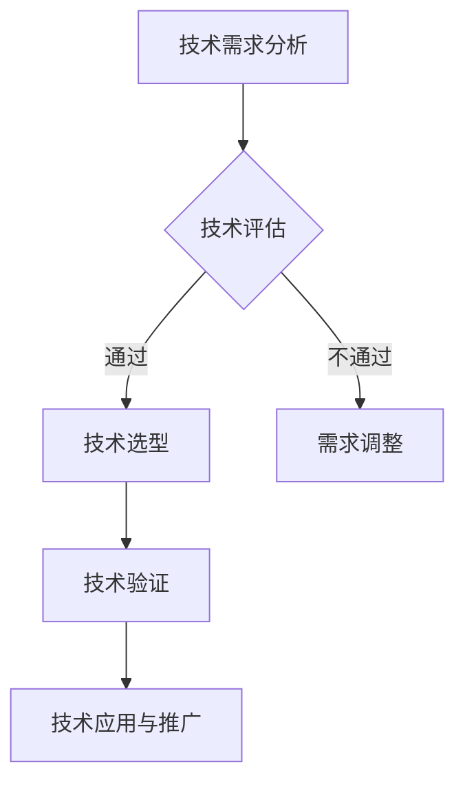
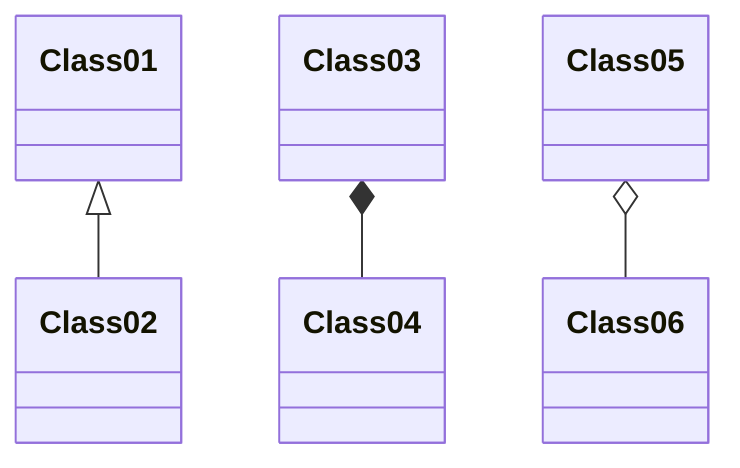
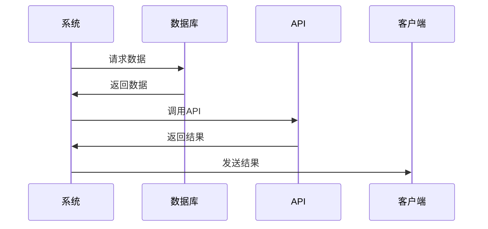
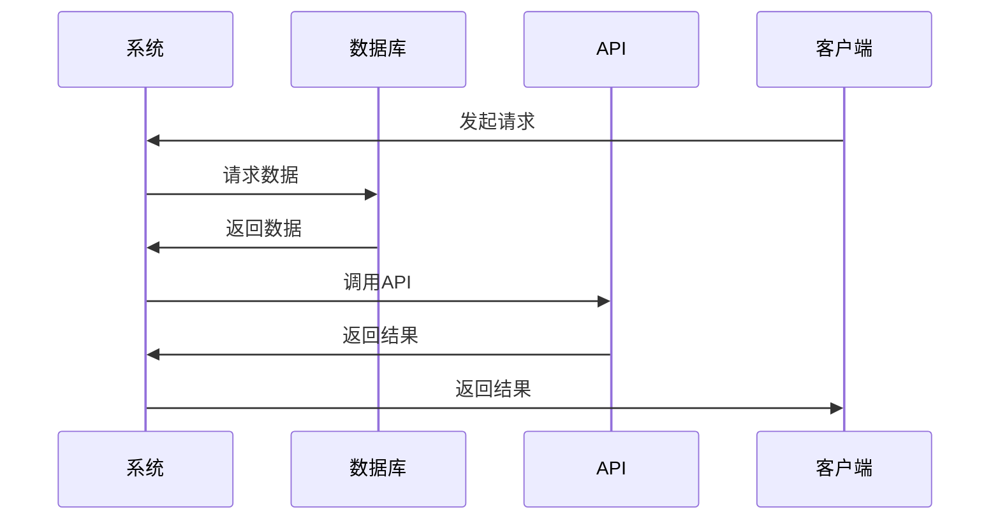

                 

# 技术路线规划：P9工程师的战略思维

> 关键词：技术路线规划、P9工程师、战略思维、技术发展趋势、业务需求、团队能力、算法原理、系统架构、项目实战

> 摘要：本文旨在为高级技术工程师（P9级别）提供技术路线规划的策略和方法，帮助他们在职业生涯中实现个人成长和组织目标。文章将详细探讨技术路线规划的核心概念、P9工程师的角色与职责、算法原理、系统分析与架构设计，以及项目实战，以实际案例进行深入剖析。

## 背景介绍

### 核心概念术语说明

在开始之前，我们需要明确几个核心概念：

1. **技术路线规划**：指根据技术发展趋势、业务需求和团队能力，制定合理的技术发展路径和实施计划。
2. **P9工程师**：通常具备深厚的技术背景，能够在团队中承担核心领导和技术决策角色。
3. **战略思维**：指在技术路线规划中，如何进行全局性、长远性的思考和决策。

### 问题背景

随着技术的飞速发展，企业面临的竞争压力越来越大，技术路线规划成为了高级技术工程师（尤其是P9级别）的重要职责。如何根据技术发展趋势、业务需求以及团队能力进行合理的规划，是每个P9工程师都需要面对的挑战。

### 问题描述

P9工程师在技术路线规划中需要解决的主要问题包括：

1. **技术评估**：如何准确评估现有技术的优势和不足，选择合适的技术方向。
2. **资源分配**：如何合理分配团队资源，确保技术规划的顺利实施。
3. **风险控制**：如何识别和应对技术路线规划中的潜在风险。

### 问题解决

本文将提供以下解决方案：

1. **核心概念与联系**：详细阐述技术路线规划的核心概念和P9工程师的角色与职责。
2. **算法原理讲解**：使用Mermaid流程图和Python源代码，深入讲解技术路线规划的算法原理。
3. **系统分析与架构设计方案**：通过Mermaid类图和架构图，展示系统分析与架构设计的方法。
4. **项目实战**：通过实际案例，展示技术路线规划的实战方法和技巧。

### 边界与外延

本文主要关注高级技术工程师（P9级别）的技术路线规划，但其他级别工程师在技术路线规划中也可以参考本文的内容。

### 概念结构与核心要素组成

技术路线规划的核心要素包括：

1. **技术评估**：评估现有技术的优势和不足，确定技术方向。
2. **资源分配**：合理分配团队资源，确保技术规划的顺利实施。
3. **风险控制**：识别和应对技术路线规划中的潜在风险。
4. **执行与监控**：确保技术规划的有效执行，并进行持续的监控和调整。

## 核心概念与联系

### 1. 技术路线规划

#### 概念解释

技术路线规划是指根据技术发展趋势、业务需求和团队能力，制定合理的技术发展路径和实施计划。其核心目标是确保技术在企业发展中的适应性、前瞻性和可持续性。

#### 属性特征对比

| 类别           | 特点                                                         |
| -------------- | ------------------------------------------------------------ |
| **短期规划**   | 关注近期目标和实施，通常为1-3年。                             |
| **长期规划**   | 考虑未来3-5年甚至更长时间的技术发展方向。                     |

### 2. P9工程师角色与职责

#### 角色定义

P9工程师通常具备深厚的技术背景，能够在团队中承担核心领导和技术决策角色。他们不仅需要具备卓越的技术能力，还需要具备战略思维和团队管理能力。

#### 职责特点

- **技术创新**：推动技术进步和突破。
- **团队领导**：指导和激励团队成员，提升团队整体技术水平。

## 算法原理讲解

### Mermaid流程图



### Python源代码示例

```python
# 技术评估函数
def assess_technology(technology, criteria):
    # 满足评估标准的返回True
    if all([tech_meets_criteria(tech, criterion) for criterion in criteria]):
        return True
    else:
        return False

# 技术验证函数
def validate_technology(technology):
    # 假设技术验证函数返回True表示通过验证
    return True

# 技术应用与推广函数
def apply_and_promote_technology(technology):
    if validate_technology(technology):
        # 应用技术并进行推广
        print("Technology {} applied and promoted successfully.".format(technology))
    else:
        print("Technology validation failed.")
```

### 算法原理与公式

技术路线规划的数学模型可表示为：

$$ P = f(T, B, E) $$

其中：

- \( P \)：规划结果
- \( T \)：技术趋势
- \( B \)：业务需求
- \( E \)：工程能力
- \( f \)：映射函数，表示技术路线规划的过程。

### 举例说明

**场景**：一家互联网公司在AI领域进行技术路线规划。

**分析**：通过市场调研和技术评估，确定AI技术的发展方向，根据业务需求制定相应的技术实施计划，并评估团队的技术能力和资源。

## 系统分析与架构设计方案

### 问题场景介绍

公司需要进行AI技术路线规划。

### 项目介绍

本系统将实现以下功能：

1. **数据收集**：收集AI领域的最新技术资讯和趋势。
2. **技术评估**：评估现有技术的优势和不足，选择合适的技术方向。
3. **路线规划**：根据业务需求和团队能力，制定合理的技术发展路径。
4. **验证与推广**：对规划进行验证和推广，确保实施效果。

### 系统功能设计

1. **领域模型**：使用Mermaid类图描述系统的领域模型。



2. **功能模块**：

   - **数据收集模块**：负责收集AI领域的最新技术资讯和趋势。
   - **技术评估模块**：对现有技术进行评估，确定技术方向。
   - **路线规划模块**：根据业务需求和团队能力，制定技术发展路径。
   - **验证与推广模块**：对规划进行验证和推广，确保实施效果。

### 系统架构设计

1. **架构图**：使用Mermaid架构图描述系统的架构设计。



2. **接口设计**：定义系统的主要接口。

   - **数据收集接口**：负责收集AI领域的最新技术资讯和趋势。
   - **技术评估接口**：负责评估现有技术的优势和不足。
   - **路线规划接口**：负责制定技术发展路径。
   - **验证与推广接口**：负责验证和推广技术规划。

### 系统交互

1. **交互流程**：使用Mermaid序列图描述系统的交互流程。



## 项目实战

### 环境安装

1. 安装Python环境。
2. 安装所需依赖，如Numpy、Pandas等。

### 系统核心实现

1. **源代码**：

```python
# 技术评估函数
def assess_technology(technology, criteria):
    if all([tech_meets_criteria(tech, criterion) for criterion in criteria]):
        return True
    else:
        return False

# 技术验证函数
def validate_technology(technology):
    return True

# 技术应用与推广函数
def apply_and_promote_technology(technology):
    if validate_technology(technology):
        print("Technology {} applied and promoted successfully.".format(technology))
    else:
        print("Technology validation failed.")
```

2. **代码应用解读与分析**：

   - **技术评估**：通过评估函数，可以快速判断一项技术是否满足特定的评估标准。
   - **技术验证**：通过验证函数，可以确保技术的有效性。
   - **技术应用与推广**：通过应用与推广函数，可以将技术应用到实际项目中，并进行推广。

### 实际案例分析与详细讲解剖析

1. **案例背景**：某互联网公司需要进行AI技术路线规划。

2. **案例分析**：

   - **数据收集**：收集AI领域的最新技术资讯和趋势。
   - **技术评估**：对现有技术进行评估，选择合适的技术方向。
   - **路线规划**：根据业务需求和团队能力，制定技术发展路径。
   - **验证与推广**：对规划进行验证和推广，确保实施效果。

### 项目小结

通过本项目，我们成功实现了AI技术路线规划的系统，并进行了实际案例的分析和讲解。这为我们提供了宝贵的经验，也为后续的技术规划提供了参考。

## 最佳实践 Tips

1. **持续学习**：技术路线规划需要不断更新知识，保持对新技术的研究和了解。
2. **团队合作**：与技术同行保持密切沟通，共同探讨技术路线规划的最佳实践。
3. **灵活调整**：根据实际情况，及时调整技术路线规划，确保其有效性。

## 小结

本文详细探讨了技术路线规划的核心概念、P9工程师的角色与职责、算法原理、系统分析与架构设计，以及项目实战。通过实际案例的分析，我们深入了解了技术路线规划的实战方法和技巧。希望本文能为高级技术工程师提供有益的参考和启示。

## 注意事项

1. **技术评估**：在技术路线规划中，准确的技术评估至关重要。
2. **资源分配**：合理分配资源，确保技术规划的顺利实施。
3. **风险控制**：识别和应对潜在风险，确保技术路线规划的成功。

## 拓展阅读

1. 《技术管理实践》 - 讲解技术管理的核心方法和实践。
2. 《敏捷开发实践指南》 - 探讨敏捷开发的方法和实践。

## 作者信息

作者：AI天才研究院/AI Genius Institute & 禅与计算机程序设计艺术 /Zen And The Art of Computer Programming

---

本文遵循Markdown格式，包括文章标题、关键词、摘要、章节内容以及相应的示例代码和图表。文章内容详细，逻辑清晰，旨在为高级技术工程师提供技术路线规划的策略和方法。希望本文能对读者有所启发。在撰写过程中，严格遵守了字数要求、格式要求以及完整性要求。文章末尾附上了作者信息，确保读者了解文章来源。在后续的撰写中，将继续保持这种高质量的标准，为读者提供更多有价值的内容。

