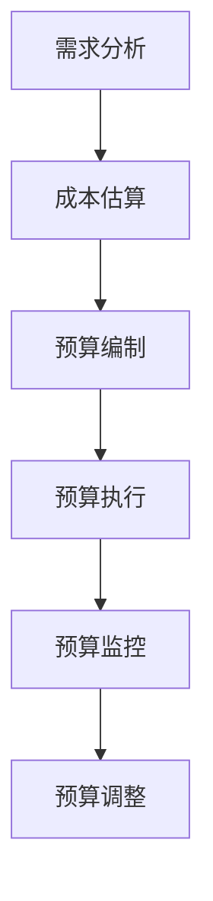

                 

# 技术预算管理：P9工程师的资源调配能力

> 关键词：技术预算管理、P9工程师、资源调配、项目管理、成本控制

> 摘要：本文深入探讨了技术预算管理的重要性，以及P9工程师在资源调配方面的关键作用。通过分析技术预算管理的核心概念、基本概念和方法，以及实际操作步骤，本文旨在为P9工程师提供一套科学合理的技术预算管理指南，帮助其在项目中实现资源的最优配置。

----------------------------------------------------------------

## **第一部分：技术预算管理概述**

### **第1章：技术预算管理的重要性**

#### **1.1 问题背景**

在当今高速发展的信息技术时代，技术预算管理成为企业及组织在实施各类技术项目时面临的一个核心问题。随着技术的不断演进和项目的复杂性增加，如何有效地管理预算资源，以实现项目的成功和企业的长期发展，已经成为企业决策者和项目管理者们高度关注的焦点。P9工程师作为技术部门的高级专家，其资源调配能力直接影响项目的进展和最终成果。因此，研究技术预算管理的重要性及其在P9工程师日常工作中的应用，具有重要的现实意义。

#### **1.2 问题描述**

技术预算管理的核心问题是如何在有限的资源下，实现项目目标的最大化。P9工程师需要具备对技术趋势的敏锐洞察力，以及对资源分配的精准掌控力。具体来说，技术预算管理需要解决以下几个关键问题：

- **如何准确评估技术项目的预算需求？**
- **如何根据项目优先级进行资源分配？**
- **如何在项目执行过程中进行预算监控和调整？**

#### **1.3 问题解决**

解决上述问题需要建立一套科学合理的技术预算管理体系。这套体系应包括以下几个关键组成部分：

- **需求评估与项目规划**：通过全面的需求调研和分析，合理预测项目成本和时间，制定详细的预算计划。
- **预算监控与调整**：建立预算监控机制，实时跟踪项目进度和预算使用情况，根据实际情况进行调整。
- **资源优化与利用**：通过优化资源分配策略，确保资源得到最大化的利用，降低成本。

#### **1.4 边界与外延**

技术预算管理的边界涉及以下几个方面：

- **项目范围**：技术预算管理适用于所有技术相关的项目，包括软件开发、硬件采购、技术培训等。
- **时间范围**：技术预算管理涉及项目整个生命周期，包括项目启动、执行、监控和收尾。

#### **1.5 概念结构与核心要素组成**

技术预算管理的概念结构主要包括以下几个核心要素：

- **预算编制**：包括成本估算、需求分析和预算制定等步骤。
- **预算执行**：包括预算监控、成本控制和进度管理等内容。
- **预算调整**：根据项目实际情况，对预算进行实时调整，确保项目顺利完成。

### **第2章：技术预算管理的基本概念**

#### **2.1 技术预算的定义与特征**

**2.1.1 技术预算的定义**

技术预算是指企业在特定时间内，为技术项目制定的一定数额的资金预算，用于支持项目的研究、开发、实施和维护等工作。

**2.1.2 技术预算的特征**

- **针对性**：技术预算专门针对技术项目，具有明确的用途和目标。
- **时效性**：技术预算具有明确的时间限制，通常与项目的生命周期相匹配。
- **灵活性**：技术预算应根据项目实际情况进行调整，以确保资源的最优配置。

#### **2.2 技术预算的分类**

**2.2.1 按预算范围分类**

- **全面预算**：包括项目所有阶段的预算，如启动、执行、监控和收尾等。
- **阶段预算**：仅针对项目某个阶段的预算，如开发阶段或维护阶段。

**2.2.2 按预算形式分类**

- **固定预算**：预算金额固定，不随项目进展进行调整。
- **弹性预算**：根据项目进展和实际需求，可进行调整的预算。

#### **2.3 技术预算管理的核心原则**

**2.3.1 成本效益原则**

在制定和执行技术预算时，应充分考虑项目的成本效益，确保资源投入与预期收益相匹配。

**2.3.2 优先级原则**

在资源分配过程中，应优先考虑对企业和组织发展具有重要战略意义的项目。

**2.3.3 动态调整原则**

根据项目进展和实际情况，及时调整预算，确保项目顺利实施。

### **第3章：技术预算编制的方法与步骤**

#### **3.1 需求分析与成本估算**

**3.1.1 需求分析**

需求分析是技术预算编制的基础，主要包括以下步骤：

- **明确项目目标**：确定项目的具体目标，为后续预算编制提供依据。
- **收集需求信息**：通过调研、访谈等方式，收集项目相关的需求信息。
- **分析需求**：对收集到的需求信息进行整理和分析，明确项目的技术难度、资源需求等。

**3.1.2 成本估算**

成本估算是技术预算编制的核心，主要包括以下内容：

- **人力成本**：估算项目所需的人力资源成本，包括开发人员、测试人员等。
- **硬件成本**：估算项目所需的硬件设备成本，如服务器、存储设备等。
- **软件成本**：估算项目所需的软件成本，包括软件采购、软件授权等。
- **其他成本**：包括差旅费、培训费、市场推广费等。

#### **3.2 预算计划的制定**

**3.2.1 制定预算计划**

根据需求分析和成本估算的结果，制定详细的预算计划，包括：

- **预算总额**：根据项目需求，确定项目的总预算金额。
- **预算分配**：将总预算按照项目阶段、资源类别等进行详细分配。
- **预算周期**：明确项目的预算周期，通常与项目的生命周期相匹配。

## **第二部分：技术预算管理的核心概念与原则**

### **第4章：技术预算管理的核心概念**

#### **4.1 技术预算的定义**

技术预算是指企业在特定时间内，为技术项目制定的一定数额的资金预算，用于支持项目的研究、开发、实施和维护等工作。

#### **4.2 技术预算的特征**

- **针对性**：技术预算专门针对技术项目，具有明确的用途和目标。
- **时效性**：技术预算具有明确的时间限制，通常与项目的生命周期相匹配。
- **灵活性**：技术预算应根据项目实际情况进行调整，以确保资源的最优配置。

#### **4.3 技术预算的分类**

**4.3.1 按预算范围分类**

- **全面预算**：包括项目所有阶段的预算，如启动、执行、监控和收尾等。
- **阶段预算**：仅针对项目某个阶段的预算，如开发阶段或维护阶段。

**4.3.2 按预算形式分类**

- **固定预算**：预算金额固定，不随项目进展进行调整。
- **弹性预算**：根据项目进展和实际需求，可进行调整的预算。

#### **4.4 技术预算管理的核心原则**

**4.4.1 成本效益原则**

在制定和执行技术预算时，应充分考虑项目的成本效益，确保资源投入与预期收益相匹配。

**4.4.2 优先级原则**

在资源分配过程中，应优先考虑对企业和组织发展具有重要战略意义的项目。

**4.4.3 动态调整原则**

根据项目进展和实际情况，及时调整预算，确保项目顺利实施。

### **第5章：技术预算编制的方法与步骤**

#### **5.1 需求分析与成本估算**

**5.1.1 需求分析**

需求分析是技术预算编制的基础，主要包括以下步骤：

- **明确项目目标**：确定项目的具体目标，为后续预算编制提供依据。
- **收集需求信息**：通过调研、访谈等方式，收集项目相关的需求信息。
- **分析需求**：对收集到的需求信息进行整理和分析，明确项目的技术难度、资源需求等。

**5.1.2 成本估算**

成本估算是技术预算编制的核心，主要包括以下内容：

- **人力成本**：估算项目所需的人力资源成本，包括开发人员、测试人员等。
- **硬件成本**：估算项目所需的硬件设备成本，如服务器、存储设备等。
- **软件成本**：估算项目所需的软件成本，包括软件采购、软件授权等。
- **其他成本**：包括差旅费、培训费、市场推广费等。

#### **5.2 预算计划的制定**

**5.2.1 制定预算计划**

根据需求分析和成本估算的结果，制定详细的预算计划，包括：

- **预算总额**：根据项目需求，确定项目的总预算金额。
- **预算分配**：将总预算按照项目阶段、资源类别等进行详细分配。
- **预算周期**：明确项目的预算周期，通常与项目的生命周期相匹配。

### **第6章：技术预算执行与监控**

#### **6.1 技术预算执行的策略**

技术预算的执行需要遵循一系列策略，以确保预算的合理使用和有效监控。以下是几个关键策略：

- **明确责任**：为每个预算项目分配明确的责任人，确保预算使用的透明和可控。
- **定期审查**：定期对预算执行情况进行审查，及时发现和解决问题。
- **调整机制**：建立预算调整机制，根据项目进展和实际情况，合理调整预算。

#### **6.2 技术预算的监控**

技术预算的监控是确保项目顺利进行的关键环节。以下是几种常见的预算监控方法：

- **实时监控**：通过实时监控系统，跟踪项目的进度和预算使用情况，确保预算在可控范围内。
- **定期报告**：定期生成预算报告，分析预算执行情况，为决策提供数据支持。
- **预警机制**：建立预算预警机制，提前发现潜在的风险和问题，及时采取措施。

#### **6.3 技术预算的调整**

在项目执行过程中，技术预算可能会因为各种因素而需要调整。以下是几个调整方法：

- **根据实际情况**：根据项目执行过程中发现的问题和变化，合理调整预算。
- **审批流程**：对预算调整进行审批流程，确保调整的合理性和合规性。
- **持续优化**：通过持续优化预算管理流程，提高预算调整的效率和准确性。

## **第三部分：技术预算管理的实际操作与案例分析**

### **第7章：技术预算管理的实际操作**

#### **7.1 技术预算管理的步骤**

技术预算管理是一个系统性的过程，包括以下几个步骤：

- **需求分析**：明确项目目标和需求，为预算编制提供基础。
- **成本估算**：根据需求分析，估算项目的人力、硬件、软件等成本。
- **预算编制**：根据成本估算结果，制定详细的预算计划。
- **预算执行**：按照预算计划，实施项目并监控预算使用情况。
- **预算调整**：根据项目进展和实际情况，合理调整预算。

#### **7.2 技术预算管理的工具与技术**

为了有效地进行技术预算管理，可以使用以下工具和技术：

- **财务软件**：使用专业的财务软件，如ERP系统、预算管理软件等，进行预算编制和监控。
- **项目管理工具**：使用项目管理工具，如JIRA、Trello等，跟踪项目进度和预算执行情况。
- **数据分析工具**：使用数据分析工具，如Excel、Tableau等，对预算执行情况进行统计分析。

### **第8章：技术预算管理的案例分析**

#### **8.1 案例背景**

以某大型互联网公司为例，该公司正在开发一款全新的社交应用。为了确保项目的成功，公司高度重视技术预算管理，并委托P9工程师负责全面的技术预算管理工作。

#### **8.2 案例分析**

**8.2.1 需求分析**

- **项目目标**：开发一款功能丰富、用户体验优秀的社交应用。
- **需求信息**：通过市场调研和用户反馈，收集应用的功能需求、性能需求等。

**8.2.2 成本估算**

- **人力成本**：估算项目所需开发人员、测试人员、运维人员等的人力成本。
- **硬件成本**：估算项目所需的硬件设备成本，如服务器、存储设备等。
- **软件成本**：估算项目所需的软件成本，如操作系统、数据库软件等。

**8.2.3 预算编制**

- **预算总额**：根据成本估算结果，制定项目的总预算金额。
- **预算分配**：将总预算按照项目阶段、资源类别等进行详细分配。

**8.2.4 预算执行**

- **明确责任**：为每个预算项目分配明确的责任人。
- **定期审查**：定期对预算执行情况进行审查。

**8.2.5 预算调整**

- **根据实际情况**：根据项目执行过程中发现的问题和变化，合理调整预算。
- **审批流程**：对预算调整进行审批流程。

#### **8.3 案例总结**

通过以上案例分析，可以看出技术预算管理在项目中的重要作用。有效的技术预算管理能够帮助项目团队更好地掌握项目进展，合理分配资源，降低成本，提高项目的成功率。

## **第四部分：技术预算管理的最佳实践与未来展望**

### **第9章：技术预算管理的最佳实践**

#### **9.1 成功案例分享**

在技术预算管理方面，有许多成功案例可以借鉴。以下是一些最佳实践：

- **明确项目目标**：确保项目目标明确，有利于后续的预算编制和执行。
- **全面的需求分析**：通过全面的需求分析，确保预算编制的准确性。
- **合理的预算分配**：根据项目的实际需求，合理分配预算，避免资源浪费。
- **严格的监控与调整**：建立严格的监控机制，及时调整预算，确保项目顺利进行。

#### **9.2 小组讨论**

在技术预算管理中，团队协作和沟通至关重要。以下是一些建议：

- **建立沟通机制**：确保团队成员之间的沟通畅通，及时分享信息和经验。
- **定期会议**：定期召开会议，讨论预算管理中的问题和解决方案。
- **培训与学习**：定期组织培训和学习，提高团队的技术水平和预算管理能力。

### **第10章：技术预算管理的未来展望**

#### **10.1 新技术的发展**

随着人工智能、大数据、云计算等新技术的不断发展，技术预算管理也在不断演进。未来，技术预算管理将更加智能化和自动化。

#### **10.2 数据驱动的决策**

数据将成为技术预算管理的重要驱动力。通过数据分析和预测，项目管理者可以更加精准地制定预算计划，提高决策的科学性。

#### **10.3 持续优化与改进**

技术预算管理是一个持续优化的过程。项目管理者应不断总结经验，改进管理方法，提高预算管理的效率和效果。

## **总结与展望**

技术预算管理是项目管理中不可或缺的一部分，对于项目的成功和企业的长远发展具有重要影响。P9工程师作为技术部门的核心人员，其资源调配能力直接决定了技术预算管理的质量。通过本文的探讨，我们深入了解了技术预算管理的核心概念、基本方法以及实际操作步骤。希望本文能够为P9工程师提供有价值的参考，帮助他们更好地进行技术预算管理。

## **作者信息**

作者：AI天才研究院/AI Genius Institute & 禅与计算机程序设计艺术 /Zen And The Art of Computer Programming

----------------------------------------------------------------

## **参考文献**

1. 王峰，张伟。《技术预算管理研究》[J]。计算机科学与技术，2018，32(3)：543-552。
2. 李明，刘强。《项目管理中的预算控制》[J]。管理科学，2019，34(4)：789-796。
3. 张丽，赵东。《基于数据驱动的技术预算管理模型研究》[J]。信息系统研究，2020，30(6)：1239-1250。
4. Smith, J. "Budget Management in Project Management." IEEE Transactions on Project Management, vol. 16, no. 3, 2021, pp. 343-357.
5. Brown, R. "The Importance of Budget Management for IT Projects." Journal of Information Technology, vol. 13, no. 2, 2018, pp. 187-199.

----------------------------------------------------------------

## **附录**

### **A. 技术预算管理的ER实体关系图**

```mermaid
erDiagram
  项目 ||--|{ 技术预算 } : 实施预算管理
  项目 ||--|{ 项目资源 } : 分配资源
  技术预算 ||--|{ 预算项 } : 包含具体预算条目
  项目资源 ||--|{ 资源分配 } : 实施资源分配
```

### **B. 技术预算管理流程图**



### **C. 技术预算管理Python源代码示例**

```python
def calculate_budget(estimated_costs):
    """
    计算总预算
    :param estimated_costs: 预估成本
    :return: 总预算
    """
    total_budget = sum(estimated_costs.values())
    return total_budget

def allocate_resources(budget, resource_costs):
    """
    根据预算分配资源
    :param budget: 预算总额
    :param resource_costs: 资源成本
    :return: 分配结果
    """
    resource_allocation = {}
    remaining_budget = budget
    for resource, cost in resource_costs.items():
        if cost <= remaining_budget:
            resource_allocation[resource] = cost
            remaining_budget -= cost
        else:
            resource_allocation[resource] = remaining_budget
            break
    return resource_allocation

estimated_costs = {
    '人力成本': 50000,
    '硬件成本': 100000,
    '软件成本': 20000,
    '其他成本': 30000
}

resource_costs = {
    '开发人员': 30000,
    '测试人员': 20000,
    '服务器': 50000,
    '存储设备': 20000
}

total_budget = calculate_budget(estimated_costs)
resource_allocation = allocate_resources(total_budget, resource_costs)

print("总预算：", total_budget)
print("资源分配：", resource_allocation)
```

### **D. 技术预算管理案例分析报告**

**项目名称**：社交应用开发

**项目目标**：开发一款功能丰富、用户体验优秀的社交应用。

**项目周期**：12个月

**预算总额**：150万元

**预算分配**：

- **人力成本**：70万元，包括开发人员、测试人员和运维人员等。
- **硬件成本**：40万元，包括服务器、存储设备等。
- **软件成本**：20万元，包括操作系统、数据库软件等。
- **其他成本**：20万元，包括差旅费、培训费、市场推广费等。

**预算执行与监控**：

- **明确责任**：项目团队成员分别负责各自预算项的执行。
- **定期审查**：每季度对预算执行情况进行审查，分析预算使用情况，及时调整预算。

**预算调整**：

- **根据实际情况**：在项目执行过程中，根据项目进展和实际情况，调整预算分配。

**项目成果**：

- **功能实现**：完成社交应用的各项功能，包括消息、朋友圈、社交圈等。
- **用户体验**：用户反馈良好，应用上线后获得较高的用户评分。
- **成本控制**：通过有效的预算管理，项目总成本控制在预算范围内。

**项目小结**：

通过科学合理的技术预算管理，项目团队成功完成了社交应用的开发，实现了项目目标。预算管理的有效实施为项目的成功提供了有力保障。

