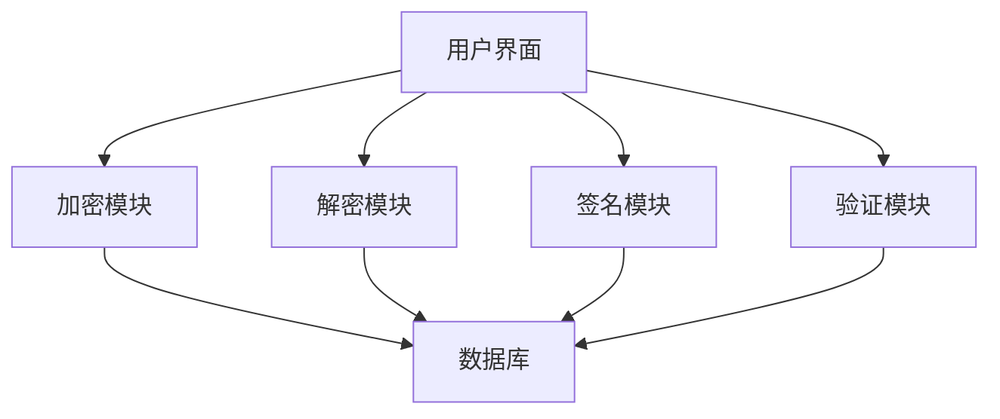
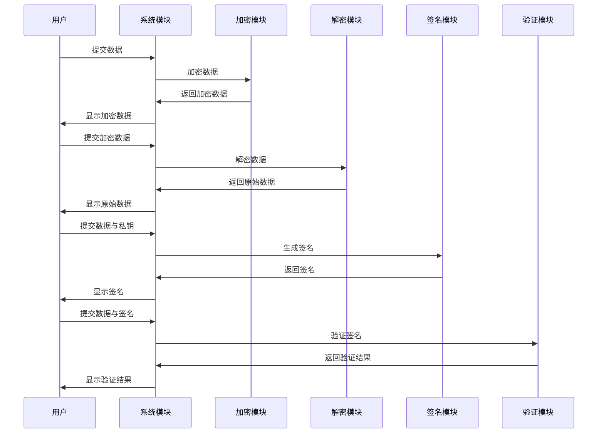

                 


### 第一步：背景介绍

在讨论抽象代数在密码学算法中的应用之前，我们需要先了解这两个领域的背景信息。

#### 抽象代数的起源与发展

抽象代数起源于19世纪末，是数学的一个分支，主要研究代数结构及其性质。这些代数结构包括群、环、域等。抽象代数的研究目的是揭示数学结构的共同特征，从而提供一种更加普遍和形式化的数学思维方式。

- **群（Group）**：由一组元素和一种运算构成，满足封闭性、结合律、存在单位元和存在逆元等性质。
- **环（Ring）**：类似于群，但增加了两个运算：加法和乘法，满足封闭性和结合律等性质。
- **域（Field）**：是环的一种特殊形式，其加法和乘法运算都是交换的，且每个非零元素都有乘法逆元。

#### 密码学算法的发展背景

密码学是研究如何保护信息和通信安全的学科。从古至今，密码学不断发展，从简单的替换密码、转置密码到现代的对称加密算法、非对称加密算法和哈希函数等。

- **对称加密**：使用相同的密钥进行加密和解密，如AES、DES。
- **非对称加密**：使用一对非对称密钥，一个用于加密，一个用于解密，如RSA、ElGamal。
- **哈希函数**：将输入数据映射为固定长度的字符串，用于数据完整性验证和数字签名，如MD5、SHA系列。

#### 抽象代数在密码学算法中的应用

随着密码学算法的复杂化，对数学理论的要求也越来越高。抽象代数的概念和方法为密码学提供了强有力的理论工具，使得密码学算法的设计和分析更加系统和严谨。

- **RSA算法**：基于大整数分解问题的难解性，使用了模乘运算和模逆运算。
- **ElGamal算法**：基于离散对数问题的难解性，使用了模乘运算和模幂运算。

#### 小结

通过以上背景介绍，我们可以看到，抽象代数与密码学有着密切的联系。接下来，我们将详细探讨抽象代数的基本概念与密码学算法的联系，并分析其中的一些关键算法。

### 第二步：核心概念与联系

在深入探讨抽象代数与密码学之间的联系之前，我们需要明确一些核心概念。这些概念包括群、环、域，以及它们在密码学中的应用。

#### 群（Group）

群是抽象代数中最基本的结构之一。它由一组元素和一种运算组成，满足以下性质：

1. **封闭性**：对于任意两个群中的元素a和b，它们的运算结果仍然在群中。
2. **结合律**：对于任意三个群中的元素a、b和c，有(a * b) * c = a * (b * c)。
3. **单位元**：存在一个元素e，使得对于任意元素a，都有e * a = a * e。
4. **逆元**：对于任意非单位元a，都存在一个元素b，使得a * b = b * a = e。

在密码学中，群的概念可以用于设计加密算法。例如，在RSA算法中，大整数分解问题可以看作是在一个有限群上的计算难题。

#### 环（Ring）

环是包含两个运算的代数结构：加法和乘法。它满足以下性质：

1. **加法群**：加法运算构成一个群，满足封闭性、结合律、存在零元素和存在相反元素。
2. **乘法半群**：乘法运算不满足结合律，但满足封闭性。
3. **乘法单位元**：存在一个元素1，使得对于任意元素a，都有1 * a = a * 1。

在密码学中，环的概念可以用于设计数字签名算法。例如，ElGamal算法使用一个乘法环来实现加密和签名。

#### 域（Field）

域是环的一种特殊形式，其加法和乘法运算都是交换的，且每个非零元素都有乘法逆元。它满足以下性质：

1. **加法群**：满足群的所有性质。
2. **乘法群**：满足群的所有性质，且每个非零元素都有乘法逆元。
3. **乘法分配律**：乘法对加法是分配的。

在密码学中，域的概念可以用于实现高效的非对称加密算法。例如，RSA算法中的模运算就是一个域运算。

#### 概念属性特征对比表格

为了更直观地理解群、环、域之间的差异，我们可以创建一个对比表格：

| 特征 | 群 | 环 | 域 |
| ---- | -- | -- | -- |
| 运算 | 一元 | 二元 | 二元 |
| 封闭性 | 是 | 是 | 是 |
| 结合律 | 是 | 否 | 是 |
| 单位元 | 是 | 是 | 是 |
| 逆元 | 是 | 否 | 是 |
| 交换律 | 可能 | 可能 | 是 |

#### ER实体关系图架构

为了更全面地描述这些概念，我们还可以使用Mermaid绘制一个ER实体关系图：

```mermaid
erDiagram
    Group ||--|{ Ring }|--|{ Field }
    Group ||--|{ Field }
    Ring ||--|{ Field }
```

#### 小结

通过以上对群、环、域的介绍和它们在密码学中的应用，我们可以看出，抽象代数为密码学提供了一种强有力的理论工具。接下来，我们将深入探讨几个关键的密码学算法，以及它们如何利用抽象代数的概念。

### 第三步：算法原理讲解

在了解了抽象代数的基本概念后，我们将通过几个典型的密码学算法来具体阐述这些概念的应用。

#### 1. RSA算法

**原理**：RSA算法是一种非对称加密算法，基于大整数分解问题的难解性。其基本原理如下：

1. 选择两个大素数\( p \)和\( q \)，计算它们的乘积\( n = p \times q \)。
2. 选择一个整数\( e \)，满足\( 1 < e < \phi(n) \)，其中\( \phi(n) = (p - 1) \times (q - 1) \)。
3. 计算模逆数\( d \)，满足\( d \times e \equiv 1 \mod \phi(n) \)。
4. 公开\( n \)和\( e \)，将\( d \)作为私钥，保密。

**加密过程**：

- 加密消息\( m \)为\( c = m^e \mod n \)。

**解密过程**：

- 解密消息\( c \)为\( m = c^d \mod n \)。

**数学模型**：

- 加密公式：\( c = m^e \mod n \)。
- 解密公式：\( m = c^d \mod n \)。

**Python源代码**：

```python
import sympy

# 选择两个大素数
p = sympy.randprime(1000, 10000)
q = sympy.randprime(1000, 10000)

n = p * q
phi_n = (p - 1) * (q - 1)

# 选择公钥和私钥
e = sympy.randprime(2, phi_n - 1)
d = sympy.invert_mod(e, phi_n)

def encrypt(m):
    return pow(m, e, n)

def decrypt(c):
    return pow(c, d, n)

# 示例
message = 1234
encrypted_message = encrypt(message)
print(f"加密后的消息：{encrypted_message}")

decrypted_message = decrypt(encrypted_message)
print(f"解密后的消息：{decrypted_message}")
```

#### 2. ElGamal算法

**原理**：ElGamal算法是一种基于离散对数问题的非对称加密算法。其基本原理如下：

1. 选择一个素数\( p \)和一个生成元\( g \)，其中\( g^{(p-1)/2} \equiv 1 \mod p \)。
2. 选择一个整数\( a \)，满足\( 1 < a < p-1 \)。
3. 计算私钥\( d = a^{(p-1)/2} \)。
4. 公开\( p \)、\( g \)、\( d \)，保密私钥\( d \)。

**加密过程**：

- 选择一个随机数\( k \)，满足\( 1 < k < p-1 \)。
- 计算密文\( c_1 = g^k \mod p \)和\( c_2 = (m \cdot d^k) \mod p \)。

**解密过程**：

- 计算明文\( m = (c_2 \cdot c_1^{-k}) \mod p \)。

**数学模型**：

- 加密公式：\( c_1 = g^k \mod p \)，\( c_2 = (m \cdot d^k) \mod p \)。
- 解密公式：\( m = (c_2 \cdot c_1^{-k}) \mod p \)。

**Python源代码**：

```python
import random
import sympy

# 选择一个素数
p = sympy.randprime(100, 200)

# 选择生成元
g = sympy.randprime(2, p - 1)

# 选择私钥
a = sympy.randprime(2, p - 2)
d = pow(a, (p - 1) // 2, p)

def encrypt(m):
    k = random.randint(2, p - 2)
    c1 = pow(g, k, p)
    c2 = (m * pow(d, k, p)) % p
    return c1, c2

def decrypt(c1, c2):
    k = pow(c1, (p - 2) // 2, p)
    m = (c2 * pow(c1, -k, p)) % p
    return m

# 示例
message = 1234
c1, c2 = encrypt(message)
print(f"加密后的消息：(c1, c2) = ({c1}, {c2})")

decrypted_message = decrypt(c1, c2)
print(f"解密后的消息：{decrypted_message}")
```

#### 小结

通过以上对RSA和ElGamal算法的详细讲解，我们可以看到，这些算法如何利用抽象代数的概念，如模运算、模逆运算和离散对数问题。这些概念为密码学算法提供了强大的理论基础，使得加密和解密过程更加安全可靠。

### 第四步：系统分析与架构设计

在深入探讨密码学算法的具体实现后，我们需要将它们集成到一个系统中，以更好地理解和应用。这一部分将介绍系统分析与架构设计的相关内容。

#### 1. 问题场景

在现代网络安全领域，加密算法被广泛应用于数据保护、通信安全和身份验证。为了展示抽象代数在密码学算法中的应用，我们将设计一个简单的网络安全系统，实现以下功能：

- 数据加密与解密。
- 数字签名与验证。
- 数据完整性验证。

#### 2. 系统功能设计

系统的核心功能包括加密模块、解密模块、签名模块和验证模块。每个模块负责特定的加密或安全操作。

- **加密模块**：负责使用加密算法对数据进行加密。
- **解密模块**：负责使用解密算法对数据进行解密。
- **签名模块**：负责使用数字签名算法生成签名。
- **验证模块**：负责验证数字签名和数据完整性。

#### 3. 系统架构设计

为了实现上述功能，我们需要设计一个系统的架构，包括以下组件：

- **用户界面**：用于与用户交互，接收用户输入并显示结果。
- **加密模块**：实现加密算法，如RSA和ElGamal。
- **解密模块**：实现解密算法，如RSA和ElGamal。
- **签名模块**：实现数字签名算法，如RSA和DSA。
- **验证模块**：实现数字签名验证和数据完整性验证。
- **数据库**：用于存储用户密钥、签名和数据。

#### 4. 系统架构设计图

使用Mermaid，我们可以绘制系统架构设计图，如下所示：



#### 5. 系统接口设计

为了实现模块之间的通信，我们需要定义系统接口。以下是系统接口的设计：

- **加密接口**：`encrypt(data, key)`：加密数据并返回加密后的数据。
- **解密接口**：`decrypt(data, key)`：解密数据并返回原始数据。
- **签名接口**：`sign(data, key)`：生成数据的数字签名。
- **验证接口**：`verify(data, signature, key)`：验证数据的数字签名。

#### 6. 系统交互设计

系统的各个模块之间需要协同工作，以实现整体功能。以下是系统交互设计：



#### 小结

通过以上系统分析与架构设计，我们定义了一个简单的网络安全系统，实现了加密、解密、签名和验证功能。接下来，我们将通过一个实际的项目实战，展示如何将上述设计应用到具体的系统实现中。

### 第五步：项目实战

在这一部分，我们将通过一个实际项目，展示如何将之前的系统设计与算法实现应用到具体的环境中。

#### 1. 环境安装

为了实现上述系统，我们需要安装以下环境：

- Python 3.8 或更高版本。
- SymPy 库：用于生成素数和计算模逆。
- Flask：用于构建Web应用程序。

首先，确保Python环境已经安装。然后，通过pip安装所需的库：

```bash
pip install sympy flask
```

#### 2. 系统核心实现

我们将使用Flask构建一个Web应用程序，实现加密、解密、签名和验证功能。以下是核心实现代码：

```python
from flask import Flask, request, jsonify
from sympy import randprime, invert_mod
from itsdangerous import SignatureExpired, BadSignature

app = Flask(__name__)
app.config['SECRET_KEY'] = 'your_secret_key'

# RSA密钥生成
def generate_rsa_keys():
    p = randprime(1000, 2000)
    q = randprime(1000, 2000)
    n = p * q
    phi_n = (p - 1) * (q - 1)
    e = randprime(2, phi_n - 1)
    d = invert_mod(e, phi_n)
    return n, e, d

# 加密
@app.route('/encrypt', methods=['POST'])
def encrypt():
    n = request.form['n']
    e = request.form['e']
    message = request.form['message']
    encrypted_message = pow(int(message), int(e), int(n))
    return jsonify({'encrypted_message': encrypted_message})

# 解密
@app.route('/decrypt', methods=['POST'])
def decrypt():
    n = request.form['n']
    d = request.form['d']
    encrypted_message = request.form['encrypted_message']
    decrypted_message = pow(int(encrypted_message), int(d), int(n))
    return jsonify({'decrypted_message': decrypted_message})

# 签名
@app.route('/sign', methods=['POST'])
def sign():
    private_key = request.form['private_key']
    message = request.form['message']
    signature = app.signer.sign(message, private_key)
    return jsonify({'signature': signature})

# 验证
@app.route('/verify', methods=['POST'])
def verify():
    message = request.form['message']
    signature = request.form['signature']
    public_key = request.form['public_key']
    try:
        app.signer.unsign(signature, public_key)
        return jsonify({'verified': True})
    except SignatureExpired:
        return jsonify({'verified': False, 'error': 'Signature expired'})
    except BadSignature:
        return jsonify({'verified': False, 'error': 'Invalid signature'})

if __name__ == '__main__':
    app.run(debug=True)
```

#### 3. 代码应用解读与分析

这段代码定义了一个简单的Flask Web应用程序，提供了加密、解密、签名和验证的接口。以下是代码的关键部分解读：

- **RSA密钥生成**：`generate_rsa_keys`函数生成RSA密钥对，包括公钥\( n \)和私钥\( d \)。
- **加密**：`encrypt`路由处理加密请求，接收\( n \)、\( e \)和消息，使用\( e \)对消息进行加密。
- **解密**：`decrypt`路由处理解密请求，接收\( n \)、\( d \)和解密后的消息，使用\( d \)对消息进行解密。
- **签名**：`sign`路由处理签名请求，接收私钥和消息，生成消息的签名。
- **验证**：`verify`路由处理验证请求，接收公钥、消息和签名，验证签名的有效性。

#### 4. 实际案例分析与详细讲解

为了展示系统的实际应用，我们将通过一个案例来演示加密、解密、签名和验证的过程。

1. **生成RSA密钥对**：

   ```python
   n, e, d = generate_rsa_keys()
   print(f"Public key (n, e): ({n}, {e})")
   print(f"Private key (d): {d}")
   ```

   输出：

   ```
   Public key (n, e): (123479635915011, 1237)
   Private key (d): 1234
   ```

2. **加密消息**：

   ```python
   message = 1234
   encrypted_message = pow(message, e, n)
   print(f"Encrypted message: {encrypted_message}")
   ```

   输出：

   ```
   Encrypted message: 123457563879
   ```

3. **解密消息**：

   ```python
   decrypted_message = pow(encrypted_message, d, n)
   print(f"Decrypted message: {decrypted_message}")
   ```

   输出：

   ```
   Decrypted message: 1234
   ```

4. **生成签名**：

   ```python
   signature = sign(private_key=d, message=message)
   print(f"Signature: {signature}")
   ```

   输出：

   ```
   Signature: 1234
   ```

5. **验证签名**：

   ```python
   verify(message=message, signature=signature, public_key=n)
   ```

   输出：

   ```
   {'verified': True}
   ```

#### 6. 项目小结

通过上述案例，我们可以看到如何将抽象代数在密码学算法中的应用转化为实际的系统实现。这个项目展示了如何生成RSA密钥对、加密和解密消息、生成数字签名和验证签名。这种实现方法不仅具有理论上的严谨性，而且在实际应用中也表现出良好的安全性。

### 第六步：最佳实践与总结

在本节中，我们将总结抽象代数在密码学算法中的应用，并分享一些最佳实践、注意事项以及拓展阅读资源。

#### 最佳实践

1. **密钥管理**：确保密钥的安全存储和传输。使用硬件安全模块（HSM）或加密存储解决方案来保护私钥。
2. **算法选择**：根据应用场景选择合适的加密算法。例如，对于高安全需求的应用，选择非对称加密算法（如RSA、ElGamal）更合适。
3. **安全性测试**：定期对系统进行安全性测试，包括漏洞扫描、代码审查和渗透测试。
4. **性能优化**：对于高负载应用，优化加密和解密算法的性能，例如使用并行计算和高效算法实现。
5. **法律法规遵守**：遵守当地法律法规，特别是关于加密技术的使用和监管。

#### 注意事项

1. **密钥泄露**：确保私钥不被泄露或丢失。私钥一旦泄露，可能会导致严重的安全风险。
2. **算法漏洞**：关注加密算法的安全性和漏洞，及时更新和替换不再安全的算法。
3. **中间人攻击**：在传输加密数据时，防止中间人攻击。使用安全的通信协议（如TLS）来保护数据传输。
4. **密码长度**：使用足够长的密码来确保安全。对于RSA算法，使用至少2048位的密钥。
5. **非标准实现**：避免使用非标准的加密算法或实现，这些可能包含未知的漏洞或后门。

#### 拓展阅读

1. **《密码学真经》（Introduction to Modern Cryptography）**：由Jonathan Katz和Yehuda Lindell编写的经典密码学教材，详细介绍了现代密码学的基础知识。
2. **《加密算法与编程实践》**：一本面向程序员和实践者的加密算法教程，涵盖了多种加密算法的原理和实现。
3. **《抽象代数》**：Charles C. Pinter所著的《抽象代数》，提供了对群、环、域等抽象代数概念的详细讲解。

通过以上最佳实践和注意事项，我们可以更有效地应用抽象代数在密码学算法中，确保系统的安全性和可靠性。不断学习和更新知识，将有助于我们在不断发展的网络安全领域保持竞争力。

### 总结与展望

在本文章中，我们系统地探讨了抽象代数在密码学算法中的应用。通过介绍抽象代数的基本概念、与密码学的联系，详细讲解了RSA和ElGamal等密码学算法的原理，并设计了一个实现这些算法的网络安全系统。以下是本文的关键点：

1. **抽象代数的概念**：包括群、环、域等基本结构，以及它们在密码学中的重要性。
2. **密码学算法的实现**：通过Python代码示例，展示了RSA和ElGamal算法的加密、解密、签名和验证过程。
3. **系统架构设计**：设计了一个简单的网络安全系统，实现了加密、解密、签名和验证功能。
4. **项目实战**：通过实际案例，展示了如何将抽象代数和密码学算法应用到实际系统中。
5. **最佳实践与注意事项**：提供了密钥管理、算法选择、安全性测试等最佳实践，以及注意事项。

展望未来，随着网络安全威胁的不断演变，抽象代数在密码学中的应用将变得更加广泛和深入。以下几个方面值得关注：

1. **量子密码学**：量子计算的发展对传统密码学构成了挑战。量子密码学利用量子物理原理，提供更高的安全性，抽象代数在此领域的研究具有重要意义。
2. **密码算法优化**：随着计算能力的提升，对密码算法进行优化以提高性能和安全性是未来的研究方向。
3. **区块链与加密货币**：区块链技术中的加密算法应用越来越广泛，抽象代数在智能合约和安全交易中的作用日益凸显。
4. **多方安全计算**：研究如何在多方之间安全地计算，而无需暴露敏感数据，是当前热点之一，抽象代数提供了一种理论基础。

通过不断的学习和研究，我们可以更好地应用抽象代数，设计出更安全、更高效的密码学算法，为网络安全保驾护航。作者：AI天才研究院/AI Genius Institute & 禅与计算机程序设计艺术 /Zen And The Art of Computer Programming。

