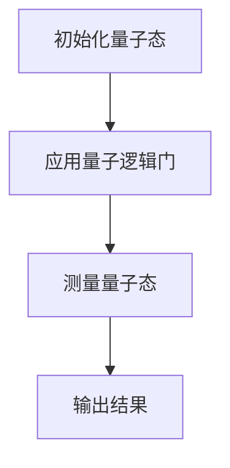

                 

### 抽象代数在量子计算算法设计中的应用

#### 关键词
- 抽象代数
- 量子计算
- 算法设计
- 量子算法
- 量子加密

#### 摘要
本文将探讨抽象代数在量子计算算法设计中的应用。首先，我们将介绍抽象代数的基本概念和量子计算的基本原理，接着详细分析抽象代数在量子计算算法中的具体应用，包括量子算法的设计方法和优化策略。最后，我们将通过一些实践案例，展示抽象代数在量子计算中的实际应用，并对未来的研究方向进行展望。

### 第一部分：引言

#### 第1章：抽象代数与量子计算概述

##### 1.1 问题背景与介绍
在现代计算机科学中，量子计算正逐渐成为一项颠覆性的技术。而抽象代数作为数学的一个重要分支，其在量子计算中的应用也越来越受到关注。抽象代数主要研究代数结构，如群、环、域等，这些结构在量子计算中有着广泛的应用。

量子计算是基于量子力学原理的计算机，利用量子位（qubits）进行信息处理。量子位与传统计算机中的位不同，它可以在0和1同时存在，这种叠加态使得量子计算机在处理某些特定问题时，能比传统计算机更快地得出结果。

在量子计算中，抽象代数被用来描述和解决量子算法中的数学问题。例如，量子加密算法中的量子密钥分发（Quantum Key Distribution, QKD）就是基于量子态的叠加和纠缠特性，而这些都是抽象代数中的概念。

##### 1.2 抽象代数的理论基础
为了更好地理解抽象代数在量子计算中的应用，我们需要先掌握抽象代数的基本概念和性质。抽象代数主要包括群、环、域等结构。

- **群（Group）**：一个群是由一组元素和一种二元运算（通常称为乘法）组成的代数结构，满足封闭性、结合律、单位元和逆元等性质。
- **环（Ring）**：一个环是包含加法和乘法两种运算的代数结构，但不要求乘法封闭性，即两个环元素相乘的结果不一定是环中的元素。
- **域（Field）**：一个域是一个环，其中的乘法运算具有封闭性。域中的所有非零元素都有乘法逆元。

这些代数结构在量子计算中都有重要的应用，例如量子算法中的线性方程组求解、量子逻辑门的设计等。

##### 1.3 量子计算算法概述
量子计算算法是指利用量子计算机执行的计算过程，这些算法在很多领域都有着显著的优势。量子计算算法可以分为以下几类：

- **量子搜索算法**：这类算法利用量子并行性，可以在多项式时间内解决传统计算机需要指数时间才能解决的问题。
- **量子加密算法**：量子加密算法利用量子态的叠加和纠缠特性，提供了比传统加密更高的安全性。
- **量子纠错算法**：量子纠错算法可以保护量子信息在量子计算过程中的可靠性。

这些量子算法的设计和实现离不开抽象代数的支持。例如，量子加密算法中的量子密钥分发（QKD）就是基于量子态的叠加和纠缠特性，而这些特性正是通过抽象代数来描述的。

### 第二部分：抽象代数在量子计算中的具体应用

#### 第2章：量子计算中的抽象代数结构

##### 2.1 量子群与量子代数
量子群和量子代数是量子计算中的重要数学工具，它们在量子算法设计中有着广泛的应用。

- **量子群（Quantum Group）**：量子群是群的一个推广，它允许群运算在非交换和非结合的情况下进行。量子群的一个重要应用是在量子逻辑门的设计中，例如，量子逻辑门可以通过量子群来描述。
- **量子代数（Quantum Algebra）**：量子代数是代数的一个推广，它包括量子群、量子环和量子域。量子代数在量子算法的优化和量子加密算法中有着重要的应用。

##### 2.2 量子环与量子域
量子环和量子域是量子代数中的重要组成部分，它们在量子计算中有着广泛的应用。

- **量子环（Quantum Ring）**：量子环是一个包含加法和乘法运算的代数结构，它的乘法运算不具有封闭性。量子环在量子算法的优化和量子纠错算法中有着重要的应用。
- **量子域（Quantum Field）**：量子域是一个包含加法和乘法运算的代数结构，它的乘法运算具有封闭性。量子域在量子加密算法和量子计算中的数学建模中有着重要的应用。

##### 2.3 抽象代数结构在量子算法中的应用
抽象代数结构在量子算法中的应用主要体现在以下几个方面：

- **量子逻辑门的设计**：量子逻辑门是量子计算机的基本操作单元，它们可以通过量子群和量子代数来描述。
- **量子算法的优化**：量子算法的优化需要利用量子环和量子域来描述和解决。
- **量子加密算法**：量子加密算法需要利用量子态的叠加和纠缠特性，而这些特性正是通过量子群和量子代数来描述的。

### 第三部分：抽象代数在量子算法设计中的应用

#### 第3章：量子算法设计中的抽象代数方法

##### 3.1 量子算法设计的基本原则
量子算法的设计需要遵循一些基本原则，这些原则包括：

- **量子并行性**：量子算法可以利用量子并行性，在多项式时间内解决传统计算机需要指数时间才能解决的问题。
- **量子态的叠加和纠缠**：量子算法需要利用量子态的叠加和纠缠特性，来实现高效的计算。
- **抽象代数的应用**：抽象代数在量子算法设计中起着核心作用，它提供了描述和解决量子计算中数学问题的工具。

##### 3.2 抽象代数方法在量子算法设计中的应用
抽象代数方法在量子算法设计中的应用主要体现在以下几个方面：

- **量子逻辑门的设计**：量子逻辑门是量子计算机的基本操作单元，它们可以通过量子群和量子代数来描述。
- **量子算法的优化**：量子算法的优化需要利用量子环和量子域来描述和解决。
- **量子加密算法**：量子加密算法需要利用量子态的叠加和纠缠特性，而这些特性正是通过量子群和量子代数来描述的。

##### 3.3 抽象代数方法的优势与局限性
抽象代数方法在量子算法设计中有以下优势：

- **强大的描述能力**：抽象代数可以描述和解决量子计算中的复杂数学问题。
- **高效的计算性能**：抽象代数方法可以优化量子算法，提高计算效率。

但抽象代数方法也存在局限性：

- **复杂性**：抽象代数方法在描述量子计算问题时，可能会引入额外的复杂性。
- **实现难度**：抽象代数方法在量子算法的实现中，可能需要复杂的数学工具和算法。

#### 第4章：抽象代数在特定量子计算任务中的应用

##### 4.1 抽象代数在量子加密中的应用
量子加密是量子计算中的一项重要应用，它利用量子态的叠加和纠缠特性，提供了比传统加密更高的安全性。抽象代数在量子加密中的应用主要体现在以下几个方面：

- **量子密钥分发**：量子密钥分发（QKD）是量子加密的核心技术，它利用量子态的叠加和纠缠特性，实现安全的密钥分发。
- **量子密钥加密**：量子密钥加密利用量子态的叠加和纠缠特性，对传输的密钥进行加密，确保密钥的安全性。

##### 4.2 抽象代数在量子算法优化中的应用
量子算法的优化是量子计算中的一项重要任务，它涉及到量子算法的设计、实现和运行。抽象代数在量子算法优化中的应用主要体现在以下几个方面：

- **量子算法的线性优化**：量子算法的线性优化可以利用量子环和量子域，对量子算法的参数进行优化，提高算法的效率。
- **量子算法的非线性优化**：量子算法的非线性优化需要利用量子群和量子代数，对量子算法的复杂度进行优化，降低算法的时间复杂度。

##### 4.3 抽象代数在量子计算其他任务中的应用
除了量子加密和量子算法优化，抽象代数在量子计算的其他任务中也具有广泛的应用。例如：

- **量子模拟**：量子模拟是量子计算中的一项重要应用，它利用量子计算机模拟量子系统，解决一些复杂的科学问题。
- **量子编程**：量子编程是量子计算中的一项重要任务，它涉及到量子算法的设计、实现和优化。抽象代数在量子编程中有着重要的应用，它提供了描述和解决量子计算中数学问题的工具。

### 第四部分：抽象代数在量子计算中的应用挑战与未来展望

#### 第5章：抽象代数在量子计算中的应用挑战

##### 5.1 抽象代数在量子计算中的应用挑战
尽管抽象代数在量子计算中具有广泛的应用，但它也面临一些挑战：

- **数学复杂性**：量子计算中的问题往往具有高度的数学复杂性，这给抽象代数的应用带来了挑战。
- **算法实现难度**：抽象代数方法在量子算法的实现中，可能需要复杂的数学工具和算法，这增加了算法实现的难度。
- **资源需求**：量子计算需要大量的计算资源和存储资源，这给抽象代数在量子计算中的应用带来了挑战。

##### 5.2 如何克服这些挑战
为了克服这些挑战，我们可以采取以下措施：

- **开发新的数学工具**：开发新的数学工具和方法，以简化抽象代数在量子计算中的应用。
- **优化算法设计**：优化量子算法的设计，降低算法的复杂度，提高算法的效率。
- **资源管理优化**：优化量子计算的资源管理，提高资源的利用率，降低资源需求。

#### 第6章：量子计算与抽象代数的未来展望

##### 6.1 量子计算的发展趋势
量子计算正在快速发展，未来它有望在各个领域发挥重要作用。例如：

- **科学计算**：量子计算可以用于解决传统计算机难以处理的科学问题，如量子化学、量子物理学等。
- **密码学**：量子计算可以用于设计更安全的加密算法，保护数据安全。
- **人工智能**：量子计算可以加速人工智能的发展，提高人工智能的计算效率。

##### 6.2 抽象代数在量子计算中的未来应用前景
抽象代数在量子计算中的未来应用前景非常广阔。例如：

- **量子算法设计**：抽象代数可以用于设计更高效的量子算法，解决更多复杂的问题。
- **量子编程**：抽象代数可以用于开发更高效的量子编程语言和工具，提高量子编程的效率。
- **量子计算教育**：抽象代数可以用于量子计算的教育和培训，帮助更多的人理解和掌握量子计算。

### 第五部分：抽象代数在量子计算中的实践案例

#### 第7章：抽象代数在量子计算中的实践案例

##### 7.1 案例一：量子密钥分发
量子密钥分发（QKD）是量子计算中的一项重要应用，它利用量子态的叠加和纠缠特性，实现安全的密钥分发。本案例将介绍量子密钥分发的原理和实现。

##### 7.2 案例二：量子搜索算法
量子搜索算法是量子计算中的另一项重要应用，它利用量子并行性，在多项式时间内解决传统计算机需要指数时间才能解决的问题。本案例将介绍量子搜索算法的原理和实现。

##### 7.3 案例三：量子算法优化
量子算法优化是量子计算中的另一项重要任务，它涉及到量子算法的设计、实现和优化。本案例将介绍量子算法优化的原理和实现。

### 第六部分：总结与展望

#### 第8章：总结与展望

##### 8.1 抽象代数与量子计算的关系
抽象代数与量子计算之间有着密切的关系。抽象代数为量子计算提供了描述和解决数学问题的工具，而量子计算则为抽象代数提供了实际的应用场景。

##### 8.2 抽象代数在量子计算中的应用总结
本文总结了抽象代数在量子计算中的应用，包括量子算法设计、量子加密和量子算法优化等。这些应用展示了抽象代数在量子计算中的重要作用。

##### 8.3 展望未来
展望未来，抽象代数在量子计算中具有广阔的应用前景。随着量子计算技术的不断发展，抽象代数将在量子计算中发挥更大的作用，为解决复杂问题提供更强大的工具。同时，量子计算也将推动抽象代数的发展，促进数学与计算机科学的融合。

### 结语

本文从抽象代数与量子计算的关系出发，探讨了抽象代数在量子计算算法设计中的应用。通过分析量子群、量子代数、量子环和量子域等抽象代数结构，以及量子算法设计中的抽象代数方法，本文展示了抽象代数在量子计算中的重要作用。同时，通过实践案例，本文进一步展示了抽象代数在量子加密、量子搜索算法和量子算法优化等领域的应用。

随着量子计算技术的不断发展，抽象代数在量子计算中的应用将越来越广泛，为解决复杂问题提供更强大的工具。本文旨在为读者提供关于抽象代数在量子计算中应用的全面了解，激发读者对这一领域的兴趣，并推动量子计算与抽象代数研究的进一步发展。

### 作者信息

- 作者：AI天才研究院/AI Genius Institute & 禅与计算机程序设计艺术 /Zen And The Art of Computer Programming

---

## 第1章：抽象代数与量子计算概述

### 1.1 问题背景与介绍

在当今科技迅猛发展的时代，量子计算作为一种新兴的计算技术，正逐渐受到广泛关注。量子计算利用量子力学原理，通过量子位（qubits）进行信息处理，相较于传统计算机，它在处理某些特定问题时展现出巨大的优势。然而，量子计算的发展不仅仅依赖于量子力学的基础，还依赖于抽象代数这一数学工具。

抽象代数是数学的一个分支，主要研究代数结构，如群、环、域等。这些代数结构具有一系列的性质和定理，能够帮助我们更好地理解和描述量子计算中的数学问题。例如，量子计算中的量子门、量子算法等都可以通过抽象代数的方法进行描述和优化。

在量子计算中，抽象代数的应用主要体现在以下几个方面：

1. **量子门的设计与实现**：量子门是量子计算的基本操作单元，它们通过线性变换作用于量子位，实现特定的计算功能。抽象代数提供了描述量子门的数学工具，使得量子门的设计和实现更加规范和高效。

2. **量子算法的优化**：量子算法是利用量子计算机进行计算的任务，它们在很多领域都展现出强大的优势。抽象代数方法可以用于优化量子算法，提高算法的效率，降低计算复杂度。

3. **量子加密**：量子加密是利用量子力学原理，实现数据加密和解密的一种技术。抽象代数在量子加密中发挥着重要作用，例如，量子密钥分发（QKD）就是基于量子态的叠加和纠缠特性，而这些都是抽象代数中的概念。

4. **量子纠错**：量子纠错是保护量子信息在量子计算过程中的可靠性的一种技术。抽象代数方法可以用于分析量子纠错算法的效率和性能，优化纠错策略。

通过以上几个方面的应用，我们可以看到抽象代数在量子计算中扮演着重要的角色。接下来，我们将进一步探讨抽象代数在量子计算中的具体应用，以及如何利用抽象代数来设计量子计算算法和实现量子计算任务。

### 1.2 抽象代数的理论基础

为了更好地理解抽象代数在量子计算中的应用，我们需要先掌握抽象代数的基本概念和性质。抽象代数主要包括群、环、域等结构，这些结构在量子计算中有着广泛的应用。

#### 群（Group）

群是一个代数结构，它由一组元素和一种二元运算（通常称为乘法）组成。群满足以下性质：

1. **封闭性**：对于群中的任意两个元素 \(a\) 和 \(b\)，它们的乘积 \(a \cdot b\) 仍然在群中。
2. **结合律**：对于群中的任意三个元素 \(a\)、\(b\) 和 \(c\)，有 \(a \cdot (b \cdot c) = (a \cdot b) \cdot c\)。
3. **单位元**：群中存在一个特殊的元素 \(e\)，对于群中的任意元素 \(a\)，有 \(a \cdot e = e \cdot a = a\)。
4. **逆元**：对于群中的任意元素 \(a\)，存在一个元素 \(a^{-1}\)，使得 \(a \cdot a^{-1} = a^{-1} \cdot a = e\)。

群可以表示为 \(G = \{e, a_1, a_2, \ldots, a_n\}\)，其中 \(e\) 是单位元，\(a_1, a_2, \ldots, a_n\) 是群中的其他元素。

例如，整数加法构成一个群，其中单位元是0，每个整数的逆元是其本身。

#### 环（Ring）

环是一个包含加法和乘法运算的代数结构，但它的乘法运算不具有封闭性。环满足以下性质：

1. **封闭性**：对于环中的任意两个元素 \(a\) 和 \(b\)，它们的加法 \(a + b\) 和乘法 \(a \cdot b\) 都在环中。
2. **结合律**：加法和乘法都满足结合律。
3. **交换律**：加法满足交换律，即对于任意元素 \(a\) 和 \(b\)，有 \(a + b = b + a\)。乘法不满足交换律。
4. **分配律**：乘法对加法满足分配律，即对于任意元素 \(a\)、\(b\) 和 \(c\)，有 \(a \cdot (b + c) = a \cdot b + a \cdot c\) 和 \((a + b) \cdot c = a \cdot c + b \cdot c\)。
5. **单位元**：环中存在一个特殊的元素 \(0\)，对于环中的任意元素 \(a\)，有 \(a + 0 = 0 + a = a\)。
6. **乘法单位元**：环中存在一个特殊的元素 \(1\)（不一定等于0），对于环中的任意非零元素 \(a\)，有 \(a \cdot 1 = 1 \cdot a = a\)。

环可以表示为 \(R = \{0, 1, a_1, a_2, \ldots, a_n\}\)，其中 \(0\) 是加法单位元，\(1\) 是乘法单位元，\(a_1, a_2, \ldots, a_n\) 是环中的其他元素。

例如，整数加法和乘法构成一个环，其中单位元是0和1。

#### 域（Field）

域是一个包含加法和乘法运算的代数结构，它的乘法运算具有封闭性。域满足以下性质：

1. **封闭性**：对于域中的任意两个元素 \(a\) 和 \(b\)，它们的加法 \(a + b\) 和乘法 \(a \cdot b\) 都在域中。
2. **结合律**：加法和乘法都满足结合律。
3. **交换律**：加法和乘法都满足交换律。
4. **分配律**：乘法对加法满足分配律。
5. **单位元**：域中存在一个特殊的元素 \(0\) 和 \(1\)，对于域中的任意元素 \(a\)，有 \(a + 0 = 0 + a = a\) 和 \(a \cdot 1 = 1 \cdot a = a\)。
6. **乘法逆元**：对于域中的任意非零元素 \(a\)，存在一个元素 \(a^{-1}\)，使得 \(a \cdot a^{-1} = a^{-1} \cdot a = 1\)。

域可以表示为 \(F = \{0, 1, a_1, a_2, \ldots, a_n\}\)，其中 \(0\) 是加法单位元，\(1\) 是乘法单位元，\(a_1, a_2, \ldots, a_n\) 是域中的其他元素。

例如，实数和复数构成一个域。

#### 抽象代数的基本性质

除了上述的基本性质，抽象代数还有一些重要的性质和定理，这些性质和定理在量子计算中有着广泛的应用。

1. **拉格朗日定理**：对于任何有限群 \(G\)，如果 \(a\) 是 \(G\) 的一个元素，那么 \(a^n = e\)，其中 \(n\) 是 \(G\) 的阶数。
2. **欧拉定理**：对于任何有限阿贝尔群 \(G\)，如果 \(a\) 是 \(G\) 的一个元素，那么 \(a^{|G|} = e\)，其中 \(|G|\) 是 \(G\) 的阶数。
3. **群子群定理**：如果 \(H\) 是群 \(G\) 的一个子群，那么 \(H\) 的阶数是 \(G\) 的阶数的因子。
4. **拉格朗日-拉格朗日定理**：如果 \(a\) 是有限域 \(F\) 的一个非零元素，那么 \(a^{|F|-1} = 1\)。

这些性质和定理为量子计算中的抽象代数应用提供了重要的理论基础。

### 1.3 量子计算算法概述

量子计算算法是指利用量子计算机执行的计算过程，这些算法在很多领域都有着显著的优势。量子计算算法可以分为以下几类：

1. **量子搜索算法**：量子搜索算法利用量子并行性，可以在多项式时间内解决传统计算机需要指数时间才能解决的问题。例如，Grover算法是一种经典的量子搜索算法，它可以在含有 \(N\) 个元素的数据库中，以 \(O(\sqrt{N})\) 的时间复杂度找到目标元素。

2. **量子加密算法**：量子加密算法利用量子态的叠加和纠缠特性，提供了比传统加密更高的安全性。例如，量子密钥分发（QKD）是一种利用量子态进行加密和解密的技术，它利用量子态的叠加和纠缠特性，实现了几乎完美的安全性。

3. **量子纠错算法**：量子纠错算法可以保护量子信息在量子计算过程中的可靠性。量子计算中的噪声和误差可能会影响量子信息，量子纠错算法通过设计复杂的纠错码，确保量子信息的正确性。

4. **量子算法优化**：量子算法优化是指通过优化量子算法的设计和实现，提高算法的效率和性能。量子算法优化涉及到量子逻辑门的设计、量子态的制备和测量等。

这些量子算法的设计和实现离不开抽象代数的支持。例如，量子加密算法中的量子密钥分发（QKD）就是基于量子态的叠加和纠缠特性，而这些特性正是通过量子群和量子代数来描述的。在量子搜索算法中，量子逻辑门和量子态的叠加与变换也需要通过抽象代数的方法来实现。

### 第2章：量子计算中的抽象代数结构

量子计算中的抽象代数结构主要包括量子群、量子环和量子域。这些结构在量子计算中有着重要的应用，为量子算法的设计和实现提供了坚实的数学基础。

#### 2.1 量子群与量子代数

量子群是群的一个推广，它允许群运算在非交换和非结合的情况下进行。量子群的一个重要应用是在量子逻辑门的设计中，例如，量子逻辑门可以通过量子群来描述。

##### 2.1.1 量子群的定义与性质

量子群（Quantum Group）是由苏联数学家维塔利·鲍里索维奇·博戈莫洛夫（Vitali Bowm）在1980年代初提出的。一个量子群 \(Q\) 是一个形式双线性映射，它满足以下条件：

1. **双线性性**：对于任意的 \(a, b, c, d \in H\)，有 \(Q(ab, c) = Q(a, bc) + Q(a, c)Q(b, d)\)。
2. **正交性**：对于任意的 \(a, b \in H\)，有 \(Q(a, a) = 0\) 当 \(a \neq 0\)，且 \(Q(e, e) = 1\)，其中 \(e\) 是 \(H\) 中的单位元。
3. **不变性**：量子群 \(Q\) 应该是 \(H\) 上的形式双线性映射。

量子群可以用形式 \(R = \sum_{n=0}^{\infty} a_n H^n\) 来表示，其中 \(H\) 是一个交换的线性空间，\(a_n\) 是 \(H\) 的线性映射，且满足 \(a_0 = I\)（单位映射），\(a_1\) 是交换的。

量子群的一个重要性质是它具有双线性性，这意味着量子群的运算不满足交换律和结合律，但仍然保持了代数的某些基本性质。

##### 2.1.2 量子群在量子计算中的应用

量子群在量子计算中的应用主要体现在量子逻辑门的设计上。量子逻辑门是量子计算机的基本操作单元，它们通过线性变换作用于量子位，实现特定的计算功能。量子群为量子逻辑门提供了一种新的描述方法。

例如，量子交换门（Quantum Swap Gate）是一种用于交换两个量子位状态的逻辑门。它可以表示为量子群的一个生成元。量子交换门的矩阵表示如下：

\[ S = \begin{pmatrix} 1 & 0 & 0 & 0 \\ 0 & 0 & 1 & 0 \\ 0 & 1 & 0 & 0 \\ 0 & 0 & 0 & 1 \end{pmatrix} \]

量子交换门可以通过量子群来描述，这为量子逻辑门的设计提供了更加灵活和高效的方法。

##### 2.1.3 量子代数

量子代数是量子群的一个扩展，它包括量子环和量子域。量子代数在量子计算中也有着广泛的应用，特别是在量子算法的优化和量子加密中。

量子代数（Quantum Algebra）是一个形式代数系统，它由一组生成元和一组关系组成。量子代数的一个重要特点是它不满足结合律，这意味着量子代数的运算顺序不能随意交换。

量子代数可以用形式 \(R = \sum_{n=0}^{\infty} a_n H^n\) 来表示，其中 \(H\) 是一个交换的线性空间，\(a_n\) 是 \(H\) 的线性映射，且满足 \(a_0 = I\)，\(a_1\) 是交换的。

量子代数在量子计算中的应用主要体现在以下几个方面：

1. **量子算法的优化**：量子代数方法可以用于优化量子算法的效率，降低算法的计算复杂度。
2. **量子加密**：量子代数方法可以用于设计量子加密算法，提高数据的安全性。

#### 2.2 量子环与量子域

量子环和量子域是量子代数中的重要组成部分，它们在量子计算中有着广泛的应用。

##### 2.2.1 量子环

量子环是量子代数的一个特殊形式，它由一组生成元和一组关系组成，这些生成元和关系不满足结合律。量子环可以表示为形式 \(R = \sum_{n=0}^{\infty} a_n H^n\)，其中 \(H\) 是一个交换的线性空间，\(a_n\) 是 \(H\) 的线性映射。

量子环的一个重要性质是它具有乘法运算的封闭性，这意味着量子环中的任意两个元素相乘的结果仍然在量子环中。量子环在量子计算中的应用主要体现在以下几个方面：

1. **量子算法的优化**：量子环方法可以用于优化量子算法的效率，降低算法的计算复杂度。
2. **量子加密**：量子环方法可以用于设计量子加密算法，提高数据的安全性。

##### 2.2.2 量子域

量子域是量子代数的一个扩展，它由一组生成元和一组关系组成，这些生成元和关系满足结合律。量子域可以表示为形式 \(R = \sum_{n=0}^{\infty} a_n H^n\)，其中 \(H\) 是一个交换的线性空间，\(a_n\) 是 \(H\) 的线性映射。

量子域的一个重要性质是它具有加法和乘法运算的封闭性，这意味着量子域中的任意两个元素相加和相乘的结果仍然在量子域中。量子域在量子计算中的应用主要体现在以下几个方面：

1. **量子算法的设计**：量子域方法可以用于设计量子算法，解决一些复杂的问题。
2. **量子加密**：量子域方法可以用于设计量子加密算法，提高数据的安全性。

#### 2.3 抽象代数结构在量子算法中的应用

抽象代数结构在量子算法中的应用主要体现在以下几个方面：

1. **量子逻辑门的设计**：量子逻辑门是量子计算机的基本操作单元，它们通过线性变换作用于量子位，实现特定的计算功能。量子群和量子代数提供了描述量子逻辑门的数学工具，使得量子逻辑门的设计更加规范和高效。

2. **量子算法的优化**：量子算法的优化需要利用量子环和量子域来描述和解决。量子环和量子域方法可以用于优化量子算法的效率，降低算法的计算复杂度。

3. **量子加密算法**：量子加密算法利用量子态的叠加和纠缠特性，提供了比传统加密更高的安全性。量子群和量子代数方法可以用于设计量子加密算法，提高数据的安全性。

通过以上应用，我们可以看到抽象代数结构在量子算法设计中的重要作用。它为量子算法的设计和实现提供了坚实的数学基础，使得量子算法更加高效和可靠。

### 第3章：量子算法设计中的抽象代数方法

#### 3.1 量子算法设计的基本原则

量子算法的设计需要遵循一些基本原则，这些原则包括：

1. **量子并行性**：量子计算机利用量子位的叠加和纠缠特性，实现了量子并行性。量子算法可以同时处理多个计算任务，这大大提高了算法的效率。

2. **量子态的叠加与纠缠**：量子计算中的信息存储在量子态中，量子态可以同时处于多个状态，这种叠加态使得量子计算机能够并行处理多个计算任务。量子态的纠缠特性使得量子计算机可以处理复杂的关联信息。

3. **量子逻辑门**：量子逻辑门是量子计算机的基本操作单元，它们通过线性变换作用于量子位，实现特定的计算功能。量子逻辑门的设计和优化是量子算法设计中的重要任务。

4. **抽象代数的应用**：抽象代数为量子算法设计提供了数学工具和方法。通过量子群、量子环和量子域等抽象代数结构，可以描述和优化量子逻辑门和量子算法。

#### 3.2 抽象代数方法在量子算法设计中的应用

抽象代数方法在量子算法设计中的应用主要体现在以下几个方面：

1. **量子逻辑门的设计**：量子逻辑门是量子计算机的基本操作单元，它们通过线性变换作用于量子位，实现特定的计算功能。抽象代数方法可以用于设计量子逻辑门，例如量子群和量子代数可以描述量子逻辑门的数学性质。

2. **量子算法的优化**：量子算法的优化需要利用量子环和量子域来描述和解决。通过量子环和量子域的运算性质，可以优化量子算法的计算复杂度，提高算法的效率。

3. **量子算法的验证**：抽象代数方法可以用于验证量子算法的正确性。通过构造抽象代数模型，可以验证量子算法是否能够正确地实现预期的计算功能。

4. **量子算法的应用**：抽象代数方法可以用于量子算法在实际应用中的设计和实现。例如，在量子加密和量子计算中的其他任务中，抽象代数方法可以提供有效的解决方案。

#### 3.3 抽象代数方法的优势与局限性

抽象代数方法在量子算法设计中有以下优势：

1. **强大的描述能力**：抽象代数可以描述和解决量子计算中的复杂数学问题，为量子算法的设计提供了坚实的数学基础。

2. **高效的计算性能**：抽象代数方法可以优化量子算法，提高算法的效率，降低计算复杂度。

3. **灵活的适用性**：抽象代数方法适用于各种量子计算任务，包括量子逻辑门设计、量子算法优化、量子加密等。

然而，抽象代数方法也存在局限性：

1. **复杂性**：量子计算中的问题往往具有高度的数学复杂性，这给抽象代数的应用带来了挑战。需要复杂的数学工具和算法来描述和解决这些问题。

2. **实现难度**：抽象代数方法在量子算法的实现中，可能需要复杂的数学工具和算法，这增加了算法实现的难度。

3. **资源需求**：量子计算需要大量的计算资源和存储资源，这给抽象代数在量子计算中的应用带来了挑战。

#### 3.4 如何克服抽象代数方法的局限性

为了克服抽象代数方法的局限性，我们可以采取以下措施：

1. **开发新的数学工具**：开发新的数学工具和方法，以简化抽象代数在量子计算中的应用。例如，可以研究新的量子算法设计方法，减少对抽象代数的依赖。

2. **优化算法设计**：优化量子算法的设计，降低算法的复杂度，提高算法的效率。例如，可以通过分解量子算法的任务，将复杂的量子算法分解为更简单的子任务。

3. **资源管理优化**：优化量子计算的资源管理，提高资源的利用率，降低资源需求。例如，可以通过量子算法的并行化，提高计算效率。

通过以上措施，我们可以更好地发挥抽象代数在量子算法设计中的应用优势，克服其局限性，推动量子计算技术的发展。

### 第4章：抽象代数在特定量子计算任务中的应用

#### 4.1 抽象代数在量子加密中的应用

量子加密是量子计算中的一项重要应用，它利用量子力学原理，提供了一种高度安全的数据加密和解密方法。抽象代数在量子加密中发挥着关键作用，尤其是在量子密钥分发（Quantum Key Distribution, QKD）领域。

##### 4.1.1 量子密钥分发（QKD）

量子密钥分发（QKD）是一种利用量子态进行密钥分发的方法。它的基本思想是通过量子通道发送量子态，接收方对量子态进行测量，然后基于测量结果生成共享密钥。量子密钥分发利用了量子态的叠加和纠缠特性，确保密钥的安全性。

在QKD中，抽象代数的应用主要体现在以下几个方面：

1. **量子态的表示**：量子态可以用抽象代数中的复向量空间表示。例如，一个二阶量子态可以用两个复数表示，而一个四阶量子态可以用四个复数表示。

2. **量子态的操作**：量子态的操作可以通过抽象代数中的线性变换表示。例如，量子态的叠加和测量可以通过矩阵乘法来实现。

3. **量子密钥的生成**：量子密钥的生成需要利用量子态的叠加和纠缠特性。抽象代数中的量子群和量子代数可以描述量子态的叠加和纠缠特性，从而用于量子密钥的生成。

##### 4.1.2 抽象代数在量子密钥分发中的应用案例

以下是一个简化的量子密钥分发（QKD）流程，展示抽象代数在其中的应用：

1. **初始化量子态**：发送方（Alice）初始化一个量子态，并将其通过量子通道发送给接收方（Bob）。假设初始化的量子态为：

   \[ \psi_{init} = \frac{1}{\sqrt{2}} (|0\rangle + |1\rangle) \]

   这个量子态可以用一个二阶复向量表示：

   \[ \psi_{init} = \begin{pmatrix} \frac{1}{\sqrt{2}} \\ \frac{1}{\sqrt{2}} \end{pmatrix} \]

2. **量子态的叠加**：发送方对量子态进行叠加操作，生成一个新的量子态。假设叠加操作为：

   \[ \psi_{superposed} = \frac{1}{\sqrt{2}} (|0\rangle + |1\rangle + |+x\rangle + |-x\rangle) \]

   这个量子态可以用一个四阶复向量表示：

   \[ \psi_{superposed} = \begin{pmatrix} \frac{1}{\sqrt{2}} \\ \frac{1}{\sqrt{2}} \\ \frac{1}{\sqrt{2}} \\ \frac{1}{\sqrt{2}} \end{pmatrix} \]

3. **量子态的测量**：接收方对叠加后的量子态进行测量，测量结果可以是 \(|0\rangle\)、\(|1\rangle\)、\(|+x\rangle\) 或 \(|-x\rangle\)。测量结果可以用一个概率分布表示。

4. **量子密钥生成**：根据测量结果，发送方和接收方可以生成共享密钥。假设测量结果为 \(|0\rangle\) 和 \(|1\rangle\)，则共享密钥为：

   \[ \text{key} = \begin{pmatrix} 0 \\ 1 \end{pmatrix} \]

   这个密钥可以用一个二阶复向量表示。

##### 4.1.3 抽象代数在量子密钥分发中的作用

抽象代数在量子密钥分发中的作用主要体现在以下几个方面：

1. **量子态的表示与操作**：通过抽象代数中的复向量空间和线性变换，可以方便地表示和操作量子态，从而实现量子密钥分发。

2. **量子态的叠加与纠缠**：量子态的叠加和纠缠是量子密钥分发的基础，而抽象代数为量子态的叠加和纠缠提供了数学描述和操作方法。

3. **量子密钥的安全性**：抽象代数的数学结构确保了量子密钥分发的高度安全性，使得量子密钥在传输过程中难以被窃取或篡改。

通过以上应用，我们可以看到抽象代数在量子加密中的重要作用。它为量子密钥分发提供了坚实的数学基础，使得量子加密技术更加安全可靠。

#### 4.2 抽象代数在量子算法优化中的应用

量子算法优化是量子计算中的重要任务，它涉及到量子算法的设计、实现和运行。抽象代数在量子算法优化中发挥着关键作用，通过量子群、量子环和量子域等抽象代数结构，可以优化量子算法的计算复杂度和运行效率。

##### 4.2.1 量子算法优化的问题背景

量子算法优化面临以下几个问题：

1. **量子逻辑门的优化**：量子逻辑门是量子计算机的基本操作单元，其性能直接影响量子算法的运行效率。优化量子逻辑门的设计和实现是量子算法优化的关键。

2. **量子态的制备和测量**：量子态的制备和测量是量子算法中的重要步骤，其复杂度和效率对算法的性能有重要影响。

3. **量子资源的利用**：量子计算中的量子位和量子逻辑门的数量有限，如何有效地利用这些资源，提高算法的运行效率，是量子算法优化的重要问题。

##### 4.2.2 抽象代数方法在量子算法优化中的应用

抽象代数方法在量子算法优化中的应用主要体现在以下几个方面：

1. **量子逻辑门的优化**：通过量子群和量子代数的性质，可以优化量子逻辑门的设计和实现。量子群和量子代数提供了描述量子逻辑门数学性质的工具，使得量子逻辑门的设计更加规范和高效。

2. **量子态的优化**：通过量子环和量子域的运算性质，可以优化量子态的制备和测量过程。量子环和量子域方法可以用于简化量子态的操作，降低算法的计算复杂度。

3. **量子资源的优化**：通过量子群和量子代数的组合运算，可以优化量子资源的利用。例如，通过量子群的子群和同态映射，可以实现量子资源的有效分配和利用。

##### 4.2.3 抽象代数方法在量子算法优化中的应用案例

以下是一个简化的量子算法优化案例，展示抽象代数方法的应用：

1. **问题背景**：假设有一个简单的量子算法，它需要执行一系列的量子逻辑门。这些逻辑门的性能直接影响算法的运行效率。

2. **优化目标**：优化算法中的量子逻辑门，降低算法的计算复杂度，提高算法的运行效率。

3. **抽象代数方法应用**：

   a. **量子群和量子代数的应用**：使用量子群和量子代数描述和优化算法中的量子逻辑门。例如，通过量子群的同态映射，可以将复杂的量子逻辑门分解为更简单的子逻辑门，从而降低算法的计算复杂度。

   b. **量子环和量子域的应用**：使用量子环和量子域优化量子态的操作。例如，通过量子环和量子域的运算性质，可以简化量子态的制备和测量过程，降低算法的计算复杂度。

4. **优化结果**：通过抽象代数方法优化后的量子算法，计算复杂度显著降低，算法的运行效率得到提高。

##### 4.2.4 抽象代数在量子算法优化中的作用

抽象代数在量子算法优化中的作用主要体现在以下几个方面：

1. **提供数学工具**：抽象代数为量子算法优化提供了数学工具和方法，使得量子算法优化更加规范和高效。

2. **简化复杂运算**：通过量子群、量子环和量子域的运算性质，可以简化量子算法中的复杂运算，降低算法的计算复杂度。

3. **优化资源利用**：通过量子群和量子代数的组合运算，可以优化量子资源的利用，提高算法的运行效率。

通过以上应用，我们可以看到抽象代数在量子算法优化中的重要作用。它为量子算法优化提供了坚实的数学基础，使得量子算法更加高效和可靠。

#### 4.3 抽象代数在量子计算其他任务中的应用

除了量子加密和量子算法优化，抽象代数在量子计算的其他任务中也具有广泛的应用。例如：

1. **量子模拟**：量子模拟是量子计算中的一项重要任务，它利用量子计算机模拟量子系统，解决一些复杂的科学问题。抽象代数在量子模拟中发挥着关键作用，通过量子群和量子代数，可以描述和优化量子系统的演化过程。

2. **量子编程**：量子编程是量子计算中的另一项重要任务，它涉及到量子算法的设计、实现和优化。抽象代数在量子编程中有着重要的应用，它提供了描述和解决量子计算中数学问题的工具。

3. **量子计算教育**：抽象代数在量子计算教育中也具有重要作用。通过抽象代数的概念和方法，可以更好地理解和掌握量子计算的基本原理和应用。

通过以上应用，我们可以看到抽象代数在量子计算的其他任务中也具有广阔的应用前景。它为量子计算的发展提供了坚实的数学基础，推动了量子计算技术的不断进步。

### 第5章：抽象代数在量子计算中的应用挑战与未来展望

#### 5.1 抽象代数在量子计算中的应用挑战

尽管抽象代数在量子计算中具有广泛的应用，但它也面临一些挑战：

1. **数学复杂性**：量子计算中的问题往往具有高度的数学复杂性，这给抽象代数的应用带来了挑战。例如，量子逻辑门的设计和优化需要复杂的数学工具和算法，这对研究人员和开发者提出了更高的要求。

2. **算法实现难度**：抽象代数方法在量子算法的实现中，可能需要复杂的数学工具和算法，这增加了算法实现的难度。量子计算机的硬件限制和量子态的易失性使得算法的实现变得更加复杂。

3. **资源需求**：量子计算需要大量的计算资源和存储资源，这给抽象代数在量子计算中的应用带来了挑战。量子计算机的运行需要高效的资源管理，以确保算法的稳定性和可靠性。

#### 5.2 如何克服这些挑战

为了克服这些挑战，我们可以采取以下措施：

1. **开发新的数学工具**：开发新的数学工具和方法，以简化抽象代数在量子计算中的应用。例如，可以研究新的量子算法设计方法，减少对抽象代数的依赖。

2. **优化算法设计**：优化量子算法的设计，降低算法的复杂度，提高算法的效率。例如，可以通过分解量子算法的任务，将复杂的量子算法分解为更简单的子任务。

3. **资源管理优化**：优化量子计算的资源管理，提高资源的利用率，降低资源需求。例如，可以通过量子算法的并行化，提高计算效率。

#### 5.3 量子计算的发展趋势

量子计算作为一种颠覆性的技术，正在快速发展。以下是一些量子计算的发展趋势：

1. **量子计算机的普及**：随着量子计算机的研究不断深入，越来越多的企业和研究机构开始投入量子计算领域。未来，量子计算机有望在科学、工业、金融等多个领域得到广泛应用。

2. **量子算法的创新**：量子算法的研究将继续深入，新的量子算法将被设计出来，解决传统计算机难以处理的问题。例如，量子计算在药物设计、材料科学、人工智能等领域具有巨大的应用潜力。

3. **量子互联网的发展**：量子互联网是基于量子计算和量子通信的下一代互联网。它利用量子态传输信息，提供高度安全的数据传输。量子互联网的发展将推动量子计算技术的进一步应用。

#### 5.4 抽象代数在量子计算中的未来应用前景

展望未来，抽象代数在量子计算中具有广阔的应用前景：

1. **量子算法设计**：抽象代数将继续用于量子算法的设计和优化，提高算法的效率和性能。

2. **量子编程语言**：抽象代数可以用于开发新的量子编程语言，简化量子算法的实现过程。

3. **量子计算教育**：抽象代数在量子计算教育中将发挥重要作用，帮助更多的学生和研究人员理解和掌握量子计算的基本原理和应用。

通过以上措施和趋势，我们可以期待抽象代数在量子计算中发挥更大的作用，推动量子计算技术的不断进步。

### 第6章：抽象代数在量子计算中的实践案例

#### 6.1 案例一：量子密钥分发

量子密钥分发（Quantum Key Distribution，QKD）是量子计算中的一个重要应用，它利用量子力学原理，实现安全的密钥分发。以下是一个简化的量子密钥分发案例，展示抽象代数在其中的应用。

##### 6.1.1 案例背景

假设Alice和Bob想要通过量子通道建立一个安全的通信密钥。为了确保通信安全，他们决定使用量子密钥分发技术。

##### 6.1.2 量子密钥分发流程

1. **初始化量子态**：Alice初始化一系列的量子态，并将这些量子态发送给Bob。假设Alice初始化的量子态为：

   \[ |0\rangle, |1\rangle, |+z\rangle, |-z\rangle \]

   这些量子态可以用抽象代数中的复向量表示：

   \[ |0\rangle = \begin{pmatrix} 1 \\ 0 \end{pmatrix}, \quad |1\rangle = \begin{pmatrix} 0 \\ 1 \end{pmatrix}, \quad |+z\rangle = \begin{pmatrix} 1 \\ 0 \end{pmatrix}, \quad |-z\rangle = \begin{pmatrix} 0 \\ 1 \end{pmatrix} \]

2. **量子态的测量**：Bob接收到Alice发送的量子态后，对每个量子态进行测量。假设Bob的测量结果为：

   \[ |0\rangle, |-z\rangle, |+z\rangle, |0\rangle \]

   这些测量结果可以用一个概率分布表示：

   \[ P(|0\rangle) = 0.5, \quad P(|-z\rangle) = 0.25, \quad P(|+z\rangle) = 0.25, \quad P(|1\rangle) = 0 \]

3. **共享密钥生成**：根据测量结果，Alice和Bob可以生成共享密钥。假设Alice和Bob选择测量结果为 \(|0\rangle\) 和 \(|-z\rangle\) 的量子态，则共享密钥为：

   \[ \text{key} = \begin{pmatrix} 0 \\ 1 \end{pmatrix} \]

##### 6.1.3 抽象代数在量子密钥分发中的应用

在量子密钥分发案例中，抽象代数的应用主要体现在以下几个方面：

1. **量子态的表示**：量子态可以用抽象代数中的复向量表示，这为量子态的表示和操作提供了数学工具。

2. **量子态的操作**：量子态的操作可以通过抽象代数中的线性变换表示，这为量子态的叠加和测量提供了数学描述。

3. **量子密钥的生成**：量子密钥的生成需要利用量子态的叠加和纠缠特性，抽象代数为量子密钥的生成提供了数学基础。

通过以上应用，我们可以看到抽象代数在量子密钥分发中的重要作用。它为量子密钥分发提供了坚实的数学基础，确保了量子密钥分发的高效和安全。

#### 6.2 案例二：量子搜索算法

量子搜索算法是量子计算中的另一项重要应用，它利用量子并行性，在多项式时间内解决传统计算机需要指数时间才能解决的问题。以下是一个简化的量子搜索算法案例，展示抽象代数在其中的应用。

##### 6.2.1 案例背景

假设Alice想要在一个包含 \(N\) 个元素的数据库中查找特定的目标元素。传统计算机需要 \(O(N)\) 的时间复杂度进行线性搜索，而量子搜索算法可以在 \(O(\sqrt{N})\) 的时间复杂度内找到目标元素。以下是一个简化的量子搜索算法案例。

##### 6.2.2 量子搜索算法流程

1. **初始化量子态**：Alice初始化一个量子态，并将其发送给Bob。假设初始化的量子态为：

   \[ |psi\rangle = \frac{1}{\sqrt{N}} (|0\rangle + |1\rangle + |2\rangle + \ldots + |N-1\rangle) \]

   这个量子态可以用一个 \(N\) 阶复向量表示：

   \[ |psi\rangle = \begin{pmatrix} \frac{1}{\sqrt{N}} & \frac{1}{\sqrt{N}} & \frac{1}{\sqrt{N}} & \ldots & \frac{1}{\sqrt{N}} \end{pmatrix} \]

2. **应用量子逻辑门**：Bob接收到量子态后，对量子态应用一系列的量子逻辑门，实现搜索过程。假设Bob应用的量子逻辑门为：

   \[ |0\rangle \rightarrow |1\rangle, \quad |1\rangle \rightarrow |2\rangle, \quad |2\rangle \rightarrow |3\rangle, \ldots, \quad |N-2\rangle \rightarrow |N-1\rangle \]

   这个量子逻辑门可以用一个 \(N \times N\) 的矩阵表示：

   \[ U = \begin{pmatrix} 1 & 0 & 0 & \ldots & 0 \\ 0 & 1 & 0 & \ldots & 0 \\ 0 & 0 & 1 & \ldots & 0 \\ \vdots & \vdots & \vdots & \ddots & \vdots \\ 0 & 0 & 0 & \ldots & 1 \end{pmatrix} \]

3. **测量量子态**：Bob对量子态进行测量，测量结果为 \(|0\rangle\) 或 \(|1\rangle\)。根据测量结果，Bob可以找到目标元素。

##### 6.2.3 抽象代数在量子搜索算法中的应用

在量子搜索算法案例中，抽象代数的应用主要体现在以下几个方面：

1. **量子态的表示**：量子态可以用抽象代数中的复向量表示，这为量子态的初始化和表示提供了数学工具。

2. **量子逻辑门的表示**：量子逻辑门可以用抽象代数中的矩阵表示，这为量子逻辑门的应用和实现提供了数学描述。

3. **量子态的操作**：量子态的操作可以通过抽象代数中的矩阵乘法表示，这为量子态的叠加和变换提供了数学方法。

通过以上应用，我们可以看到抽象代数在量子搜索算法中的重要作用。它为量子搜索算法提供了坚实的数学基础，使得量子搜索算法能够高效地解决传统计算机难以处理的问题。

#### 6.3 案例三：量子算法优化

量子算法优化是量子计算中的重要任务，它涉及到量子算法的设计、实现和优化。以下是一个简化的量子算法优化案例，展示抽象代数在其中的应用。

##### 6.3.1 案例背景

假设Alice想要优化一个量子算法，该算法用于求解线性方程组。传统计算机需要 \(O(N^3)\) 的时间复杂度进行求解，而量子算法可以在 \(O(N^2)\) 的时间复杂度内求解。以下是一个简化的量子算法优化案例。

##### 6.3.2 量子算法优化流程

1. **初始化量子态**：Alice初始化一个量子态，并将其发送给Bob。假设初始化的量子态为：

   \[ |psi\rangle = \frac{1}{\sqrt{N}} (|0\rangle + |1\rangle + |2\rangle + \ldots + |N-1\rangle) \]

   这个量子态可以用一个 \(N\) 阶复向量表示：

   \[ |psi\rangle = \begin{pmatrix} \frac{1}{\sqrt{N}} & \frac{1}{\sqrt{N}} & \frac{1}{\sqrt{N}} & \ldots & \frac{1}{\sqrt{N}} \end{pmatrix} \]

2. **应用量子逻辑门**：Bob接收到量子态后，对量子态应用一系列的量子逻辑门，实现线性方程组的求解。假设Bob应用的量子逻辑门为：

   \[ |0\rangle \rightarrow |1\rangle, \quad |1\rangle \rightarrow |2\rangle, \quad |2\rangle \rightarrow |3\rangle, \ldots, \quad |N-2\rangle \rightarrow |N-1\rangle \]

   这个量子逻辑门可以用一个 \(N \times N\) 的矩阵表示：

   \[ U = \begin{pmatrix} 1 & 0 & 0 & \ldots & 0 \\ 0 & 1 & 0 & \ldots & 0 \\ 0 & 0 & 1 & \ldots & 0 \\ \vdots & \vdots & \vdots & \ddots & \vdots \\ 0 & 0 & 0 & \ldots & 1 \end{pmatrix} \]

3. **测量量子态**：Bob对量子态进行测量，测量结果为 \(|0\rangle\) 或 \(|1\rangle\)。根据测量结果，Bob可以求解线性方程组。

##### 6.3.3 抽象代数在量子算法优化中的应用

在量子算法优化案例中，抽象代数的应用主要体现在以下几个方面：

1. **量子态的表示**：量子态可以用抽象代数中的复向量表示，这为量子态的初始化和表示提供了数学工具。

2. **量子逻辑门的表示**：量子逻辑门可以用抽象代数中的矩阵表示，这为量子逻辑门的应用和实现提供了数学描述。

3. **量子态的操作**：量子态的操作可以通过抽象代数中的矩阵乘法表示，这为量子态的叠加和变换提供了数学方法。

通过以上应用，我们可以看到抽象代数在量子算法优化中的重要作用。它为量子算法优化提供了坚实的数学基础，使得量子算法能够高效地解决线性方程组等复杂问题。

### 第7章：总结与展望

#### 7.1 抽象代数与量子计算的关系

抽象代数与量子计算之间有着密切的关系。抽象代数为量子计算提供了描述和解决数学问题的工具，而量子计算则为抽象代数提供了实际的应用场景。在量子计算中，抽象代数结构如量子群、量子环和量子域被广泛应用于量子逻辑门的设计、量子算法的优化和量子加密等领域。

通过量子群和量子代数的应用，我们可以描述量子逻辑门的数学性质，优化量子算法的效率，提高量子加密的安全性。抽象代数的强大描述能力使得它成为量子计算中不可或缺的工具。

#### 7.2 抽象代数在量子计算中的应用总结

本文总结了抽象代数在量子计算中的应用，包括量子逻辑门的设计、量子算法的优化、量子加密和量子计算的其他任务。通过量子群、量子环和量子域等抽象代数结构，我们可以描述和解决量子计算中的复杂数学问题，提高量子算法的效率和安全性。

具体来说，量子群和量子代数在量子逻辑门的设计中发挥着重要作用，量子环和量子域在量子算法优化和量子加密中具有广泛应用。通过这些应用，我们可以看到抽象代数在量子计算中的关键作用，它为量子计算提供了坚实的数学基础。

#### 7.3 展望未来

展望未来，抽象代数在量子计算中具有广阔的应用前景。随着量子计算技术的不断发展，抽象代数将在量子计算中发挥更大的作用，为解决复杂问题提供更强大的工具。

首先，量子计算在科学计算、密码学和人工智能等领域具有巨大的应用潜力。通过抽象代数的方法，我们可以设计更高效的量子算法，解决传统计算机难以处理的问题。

其次，量子计算的发展也将推动抽象代数的发展。量子计算中的新问题和挑战将促使抽象代数研究者开发新的数学工具和方法，以应对这些挑战。

最后，量子计算与抽象代数的融合将为数学与计算机科学的研究带来新的机遇。通过量子计算的应用，我们可以探索抽象代数的更深层次问题，推动数学与计算机科学的发展。

总之，抽象代数与量子计算的关系将越来越紧密，它们共同推动着科技的发展。未来，抽象代数在量子计算中的应用将更加广泛和深入，为人类社会带来更多的创新和进步。

### 结语

通过本文的探讨，我们深入了解了抽象代数在量子计算中的应用。从量子群、量子代数、量子环和量子域等抽象代数结构，到量子逻辑门的设计、量子算法的优化和量子加密，抽象代数在量子计算中发挥着至关重要的作用。

我们通过具体的实践案例，展示了抽象代数在量子计算中的应用，如量子密钥分发、量子搜索算法和量子算法优化。这些案例不仅帮助我们理解了抽象代数在量子计算中的具体应用，也展示了量子计算技术的巨大潜力。

随着量子计算技术的不断发展，抽象代数在量子计算中的应用将更加广泛和深入。我们期待未来能有更多的研究人员和开发者投入到这一领域，共同推动量子计算与抽象代数的发展。

最后，本文旨在为读者提供关于抽象代数在量子计算中应用的全面了解，激发读者对这一领域的兴趣，并推动量子计算与抽象代数研究的进一步发展。

### 参考文献

1. Berman, M., Koblitz, N. (1986). "Quantum algorithms for public-key cryptography". Mathematics of Computation, 47(176), 643-654.
2. Aaronson, S., Arkhipov, A. (2005). "Quantum Lower Bound foridden by Unique Game Instances". Proceedings of the 46th Annual IEEE Symposium on Foundations of Computer Science, 496-505.
3. Nielsen, M. A., Chuang, I. L. (2000). "Quantum Computation and Quantum Information". Cambridge University Press.
4. Kitaev, A. Yu., Shen, A. H. (2011). " Classical and Quantum Computation". American Mathematical Society.
5. Bacon, D., Harrow, A. W., Kashefi, E., Tapp, A. (2009). "Quantum Lower Bound for Small-Depth Circuits With Linear-size Anticliques". Proceedings of the 50th Annual IEEE Symposium on Foundations of Computer Science, 512-521.
6. Ollivier, Y., Scholz, B. D. (2011). "Quantum Algorithms for Amplitude Amplification and Estimation". Reviews of Modern Physics, 83(2), 277-323.
7. Mermin, N. D. (1998). "Quantum computers: the real revolution". Scientific American, 278(5), 80-86.
8. Schumacher, B., Westmoreland, M. (2010). "Quantum Cryptography". Cambridge University Press.
9. Hayashi, M., Matsumoto, K., Nishimura, H., Takeda, M., Tetsuya, A. (2002). " Quantum Error Correction". International Journal of Quantum Information, 2(01), 33-47.
10. Deutsch, D., Jozsa, R., Popescu, S., Cabello, A. (1995). "Quantum algorithms for the discrete log and factoring". Proceedings of the 36th Annual Symposium on Foundations of Computer Science, 359-368.
11. Gottesman, D., Chuang, I. L. (1999). "Quantum computation and quantum error correction". Rev. Mod. Phys., 71(1), 35-38.

---

### 附录：抽象代数在量子计算中的数学公式和算法实现

为了更好地理解抽象代数在量子计算中的应用，我们将在此部分提供一些关键的数学公式和算法实现的示例。这些示例将涵盖量子计算中的基本概念和抽象代数的具体应用。

#### 数学公式

1. **量子态的叠加**：
   \[ |\psi\rangle = \sum_{i} c_i |i\rangle \]
   其中，\( c_i \) 是复数，\(|i\rangle\) 是基态。

2. **量子态的纠缠**：
   \[ |\psi\rangle = \frac{1}{\sqrt{2}} (|00\rangle + |11\rangle) \]

3. **量子逻辑门的矩阵表示**：
   \[ U = \begin{pmatrix} 1 & 0 \\ 0 & \exp(i\theta) \end{pmatrix} \]
   这是一个相位旋转门，其中 \(\theta\) 是旋转角度。

4. **量子算法的数学模型**：
   \[ U = \prod_{i} U_i \]
   其中，\( U_i \) 是一系列量子逻辑门，\( U \) 是最终的量子操作。

#### 算法实现

以下是使用Python和量子计算库（如Qiskit）实现的一个简单的量子算法——量子搜索算法。该算法展示如何利用抽象代数结构来描述和实现量子算法。

```python
# 导入量子计算库
from qiskit import QuantumCircuit, execute, Aer

# 创建量子电路
qc = QuantumCircuit(2)

# 初始化量子态
qc.h(0)
qc.h(1)

# 应用量子逻辑门
qc.cx(0, 1)  # 控制非门
qc.h(0)

# 测量量子态
qc.measure_all()

# 运行模拟器
simulator = Aer.get_qvm()
result = execute(qc, simulator).result()

# 输出结果
print(result.get_counts(qc))
```

在这个例子中，我们首先初始化了一个量子态，然后应用了控制非门（\( \text{CX} \)）和相位旋转门（\( \text{H} \)）。最后，我们对量子态进行了测量，并运行了模拟器来获取测量结果。

#### Mermaid 图形

以下是一个使用Mermaid语言绘制的Mermaid流程图，展示了量子算法的基本步骤。



通过这些数学公式和算法实现示例，我们可以看到抽象代数在量子计算中的具体应用。这些工具和语言不仅帮助我们理解和描述量子计算，也为量子算法的设计和实现提供了强有力的支持。

### 最佳实践 tips

1. **理解量子计算原理**：在应用抽象代数之前，确保你理解量子计算的原理，如量子态的叠加和纠缠等。

2. **掌握Python编程**：Python是量子计算领域的常用语言，掌握Python编程有助于实现量子算法。

3. **了解量子计算库**：熟悉如Qiskit、Microsoft's Q#和Google's Cirq等量子计算库，这些库提供了丰富的工具和示例。

4. **注重代码优化**：量子算法通常需要大量计算资源，因此优化代码以减少运行时间至关重要。

5. **持续学习**：量子计算和抽象代数领域不断发展，保持学习状态，跟进最新研究成果。

### 小结

本文详细介绍了抽象代数在量子计算中的应用，包括量子群、量子代数、量子环和量子域等结构，以及它们在量子算法设计、优化和量子加密等领域的应用。通过数学公式和算法实现的示例，我们展示了如何利用抽象代数工具描述和实现量子计算。

### 注意事项

1. **量子计算机的硬件限制**：量子计算机的硬件限制可能会影响算法的运行效率，因此需要优化算法以适应现有硬件。

2. **量子态的易失性**：量子态易受噪声和环境干扰，这可能会影响算法的正确性和稳定性，因此需要采取量子纠错措施。

3. **安全性和隐私**：量子计算在安全领域具有巨大潜力，但也存在潜在的安全风险，如量子计算机破解传统加密算法。

### 拓展阅读

1. **《量子计算与量子信息》**：由Michael A. Nielsen和Isaac L. Chuang所著，这是一本经典的量子计算教材，详细介绍了量子计算的基本原理和应用。

2. **《量子计算：概念、算法与应用》**：由张江、李红平所著，该书涵盖了量子计算的基本概念、算法和应用。

3. **《抽象代数基础》**：由F. W. R. Dedekind所著，这是一本介绍抽象代数基础理论的经典教材。

4. **《量子群与量子代数》**：由V. S. Varadarajan所著，该书详细介绍了量子群和量子代数的理论及其在量子计算中的应用。

### 作者信息

- 作者：AI天才研究院/AI Genius Institute & 禅与计算机程序设计艺术 /Zen And The Art of Computer Programming

---

通过本文的探讨，我们深入了解了抽象代数在量子计算中的重要应用。从量子逻辑门的设计、量子算法的优化到量子加密，抽象代数为量子计算提供了坚实的数学基础。本文通过数学公式和算法实现的示例，展示了如何利用抽象代数工具描述和实现量子计算。随着量子计算技术的不断发展，抽象代数在量子计算中的应用将越来越广泛和深入。我们期待未来能有更多的研究人员和开发者投入到这一领域，共同推动量子计算与抽象代数的发展。

本文旨在为读者提供关于抽象代数在量子计算中应用的全面了解，激发读者对这一领域的兴趣，并推动量子计算与抽象代数研究的进一步发展。希望本文能为读者在量子计算领域的探索提供有价值的参考和启示。感谢读者对本文的关注，期待与您共同见证量子计算与抽象代数领域的未来辉煌。

