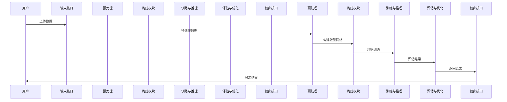

                 

### 第一部分：背景与概述

## 第1章：问题背景

### 1.1 问题提出的必要性

在当今计算机科学和人工智能领域，抽象推理是一项核心能力。抽象推理是指从具体实例中提取通用规律和概念，进而解决更广泛问题的过程。这项能力在数据处理、模式识别、决策支持等多个方面都具有重要应用。然而，传统的抽象推理方法往往存在一定的局限性，如对数据量大、结构复杂的问题处理能力不足等。

近年来，高阶逻辑张量网络作为一种新兴的抽象推理模型，受到了广泛关注。高阶逻辑张量网络能够通过多层次、多角度的信息整合，实现更高效、更灵活的抽象推理。然而，在实际应用中，如何评估高阶逻辑张量网络的潜力，如何优化其性能，仍然是亟待解决的问题。

因此，本文旨在探讨高阶逻辑张量网络在抽象推理中的潜力评估，分析其优势和局限性，为后续研究和实际应用提供参考。

### 1.2 高阶逻辑张量网络的概念与重要性

#### 2.1.1 高阶逻辑

高阶逻辑是一种形式逻辑系统，它允许逻辑表达式中的命题变量拥有多种量级。与传统的命题逻辑相比，高阶逻辑能够表示更复杂的关系和概念，如集合论、谓词逻辑等。高阶逻辑的核心思想是通过引入量词和函数符号，实现对抽象概念的精确描述。

#### 2.1.2 张量网络

张量网络是一种基于张量运算的数学模型，它由多个张量通过线性组合构成。张量网络具有强大的表示能力，能够处理高维、复杂数据。通过张量分解、张量运算等方法，张量网络能够实现对数据的深入挖掘和抽象。

#### 2.1.3 高阶逻辑张量网络的组合特性

高阶逻辑张量网络结合了高阶逻辑和传统张量网络的优点，具有以下组合特性：

1. **多层次表示能力**：高阶逻辑张量网络能够处理多量级的信息，从而实现更复杂的抽象推理。
2. **并行处理能力**：张量网络的结构天然支持并行计算，能够有效提升计算效率。
3. **灵活性**：高阶逻辑张量网络可以根据具体问题进行定制化设计，适应不同的抽象推理需求。

这些特性使得高阶逻辑张量网络在抽象推理中具有广阔的应用前景。然而，如何充分发挥其潜力，仍然需要进一步的研究和探索。

### 1.3 高阶逻辑张量网络在抽象推理中的应用现状

当前，高阶逻辑张量网络在抽象推理领域已经取得了一些初步成果。例如，在自然语言处理、图像识别、知识图谱等领域，高阶逻辑张量网络被应用于抽取规则、生成模型、关系推理等任务，取得了显著的效果。

然而，总体来看，高阶逻辑张量网络在抽象推理中的应用仍处于探索阶段。主要问题包括：

1. **理论基础不足**：高阶逻辑张量网络的数学模型和算法原理尚不完善，缺乏系统的理论基础。
2. **性能优化不足**：高阶逻辑张量网络的计算复杂度高，如何优化其性能，提高计算效率，仍是一个亟待解决的问题。
3. **应用场景有限**：目前高阶逻辑张量网络主要应用于一些简单的抽象推理任务，对于更复杂的场景，其应用效果仍有待验证。

### 1.4 研究意义与目标

本文的研究意义在于：

1. **完善高阶逻辑张量网络的理论基础**：通过深入探讨高阶逻辑张量网络的算法原理和数学模型，为其提供坚实的理论基础。
2. **优化算法性能**：分析高阶逻辑张量网络的性能瓶颈，提出优化策略，提高其计算效率和推理能力。
3. **拓展应用场景**：研究高阶逻辑张量网络在不同抽象推理场景中的应用效果，探索其适用范围。

本文的研究目标如下：

1. **构建高阶逻辑张量网络的数学模型**：详细阐述高阶逻辑张量网络的算法原理，建立数学模型。
2. **评估潜力与性能**：通过实验验证，评估高阶逻辑张量网络在抽象推理中的潜力，分析其性能优势。
3. **优化与改进**：针对高阶逻辑张量网络的性能瓶颈，提出优化策略，提高其计算效率和推理能力。

### 1.5 文章结构

本文的结构安排如下：

1. **第一部分：背景与概述**：介绍问题背景、研究意义与目标。
2. **第二部分：核心概念与联系**：阐述高阶逻辑张量网络的定义、属性特征及其在抽象推理中的应用。
3. **第三部分：算法原理讲解**：详细讲解高阶逻辑张量网络的算法原理，包括数学模型和公式。
4. **第四部分：数学模型和数学公式详解**：进一步解析高阶逻辑张量网络的核心公式，进行数学推导和举例说明。
5. **第五部分：系统分析与架构设计**：介绍系统架构设计、功能设计与交互设计。
6. **第六部分：项目实战**：进行环境安装、系统实现、代码解读、案例分析与项目小结。
7. **第七部分：最佳实践、小结与拓展阅读**：总结本文的核心内容，给出最佳实践建议，提供拓展阅读资源。

通过以上结构安排，本文旨在为高阶逻辑张量网络在抽象推理中的应用提供全面、系统的分析和探讨，为相关领域的研究者和开发者提供有益的参考。

---

## 第2章：核心概念与联系

### 2.1 高阶逻辑张量网络的定义

#### 2.1.1 高阶逻辑

高阶逻辑（Higher-order Logic）是形式逻辑的一个分支，它扩展了一阶逻辑（First-order Logic）的能力，引入了高阶量词和函数符号。一阶逻辑主要处理个体和它们的性质，而高阶逻辑允许我们处理函数、谓词和更复杂的关系。

在高阶逻辑中，存在两种主要的量词：
- **高阶存在量词**：表示存在一个函数或谓词。
- **高阶全称量词**：表示对所有函数或谓词都成立。

高阶逻辑能够表达更复杂的概念和推理，如集合论中的性质、谓词逻辑中的复杂关系等。

#### 2.1.2 张量网络

张量网络（Tensor Network）是一种数学模型，用于表示和操作高维数据。张量网络的基本元素是张量，张量是一种多维数组，可以看作是矩阵的推广。张量网络通过张量之间的线性组合来表示复杂的函数和关系。

张量网络的构建通常基于张量分解方法，如张量图分解、哈达玛分解等。张量网络在量子计算、图像处理、机器学习等领域具有广泛的应用。

#### 2.1.3 高阶逻辑张量网络的组合特性

高阶逻辑张量网络（Higher-order Logic Tensor Network）结合了高阶逻辑和传统张量网络的优点，具有以下组合特性：

1. **多层次表示能力**：高阶逻辑张量网络能够处理多量级的信息，通过多层次的信息整合，实现更复杂的抽象推理。
2. **并行处理能力**：张量网络的结构天然支持并行计算，通过分布式计算，可以显著提升计算效率。
3. **灵活性**：高阶逻辑张量网络可以根据具体问题进行定制化设计，通过调整张量和网络的组合，适应不同的抽象推理需求。

### 2.2 高阶逻辑张量网络的属性特征对比

为了更清楚地理解高阶逻辑张量网络的属性特征，我们可以将其与一阶逻辑张量网络和传统张量网络进行对比。

#### 2.2.1 一阶逻辑张量网络

- **定义**：一阶逻辑张量网络仅使用一阶逻辑的量词和函数符号，处理的数据量级相对较低。
- **表示能力**：一阶逻辑张量网络能够表示一些复杂的关系和函数，但相较于高阶逻辑张量网络，其表达能力有限。
- **计算复杂度**：一阶逻辑张量网络的计算复杂度相对较低，适合处理中小规模的数据。

#### 2.2.2 传统张量网络

- **定义**：传统张量网络主要用于量子计算和图像处理等领域，其核心元素是张量，通过张量分解和组合进行数据处理。
- **表示能力**：传统张量网络具有较强的表示能力，能够处理高维、复杂数据。
- **计算复杂度**：传统张量网络的计算复杂度较高，对于大规模数据的处理可能存在性能瓶颈。

#### 2.2.3 高阶逻辑张量网络

- **定义**：高阶逻辑张量网络结合了高阶逻辑和传统张量网络的优点，通过多层次、多角度的信息整合，实现更复杂的抽象推理。
- **表示能力**：高阶逻辑张量网络能够表示更复杂的关系和概念，如集合论、谓词逻辑等。
- **计算复杂度**：高阶逻辑张量网络的计算复杂度介于一阶逻辑张量网络和传统张量网络之间，通过并行计算和优化策略，可以有效提升计算效率。

### 2.3 高阶逻辑张量网络在抽象推理中的应用

#### 2.3.1 抽象推理的定义

抽象推理（Abstract Reasoning）是指从具体实例中提取通用规律和概念，并将其应用于更广泛的问题解决过程。抽象推理是人类智能的核心能力之一，广泛应用于科学发现、技术创新、决策支持等领域。

抽象推理的过程可以分为以下几个步骤：

1. **观察**：从具体实例中获取信息，形成初步的观察结果。
2. **抽象化**：从观察结果中提取通用规律和概念，形成抽象模型。
3. **应用**：将抽象模型应用于新的问题解决过程，进行推理和预测。
4. **验证**：通过实验或验证，检验抽象推理的正确性和有效性。

#### 2.3.2 抽象推理的过程

高阶逻辑张量网络在抽象推理过程中起到关键作用，其工作流程可以概括为以下几个步骤：

1. **数据预处理**：对输入数据进行预处理，包括数据清洗、数据变换等，以确保数据的质量和一致性。
2. **张量构建**：根据输入数据的结构和特征，构建高阶逻辑张量网络。张量网络的构建可以通过张量分解、哈达玛分解等方法实现。
3. **训练过程**：通过训练过程，调整张量网络的参数，使其能够更好地适应输入数据。训练过程通常采用反向传播算法和梯度下降方法。
4. **推理过程**：使用训练好的高阶逻辑张量网络进行抽象推理，提取通用规律和概念。推理过程可以通过前向传播算法实现。
5. **验证与优化**：对推理结果进行验证，评估其正确性和有效性。根据验证结果，进一步优化张量网络的参数和结构，提升推理能力。

#### 2.3.3 高阶逻辑张量网络如何促进抽象推理

高阶逻辑张量网络通过以下方式促进抽象推理：

1. **多层次信息整合**：高阶逻辑张量网络能够处理多量级的信息，通过多层次的信息整合，实现更复杂的抽象推理。
2. **并行计算**：张量网络的结构天然支持并行计算，通过分布式计算，可以显著提升计算效率，加速抽象推理过程。
3. **灵活性**：高阶逻辑张量网络可以根据具体问题进行定制化设计，通过调整张量和网络的组合，适应不同的抽象推理需求。
4. **泛化能力**：高阶逻辑张量网络具有较强的泛化能力，能够将特定问题的抽象规律推广到更广泛的应用场景。

通过上述分析，我们可以看到高阶逻辑张量网络在抽象推理中具有巨大的潜力。然而，要充分发挥其潜力，还需要进一步研究和优化算法性能，拓展其应用场景。在接下来的章节中，我们将深入探讨高阶逻辑张量网络的算法原理和数学模型，为其在抽象推理中的应用提供理论支持。

### 算法原理讲解

## 第3章：高阶逻辑张量网络的算法原理

高阶逻辑张量网络是一种结合了高阶逻辑和传统张量网络的数学模型，用于实现复杂的抽象推理。本章节将详细讲解高阶逻辑张量网络的算法原理，包括其数学模型、算法流程和实例分析。

### 3.1 高阶逻辑张量网络的数学模型

高阶逻辑张量网络的数学模型主要包括张量矩阵的运算、高阶逻辑的张量运算以及张量网络的训练过程。

#### 3.1.1 张量网络的基础数学公式

在张量网络中，张量是一种多维数组，可以通过矩阵运算进行表示和操作。以下是一个基础的张量矩阵运算公式：

$$ \mathbf{T}_{ijk} = \sum_{p=1}^{n} \mathbf{A}_{ip} \mathbf{B}_{pj} \mathbf{C}_{ik} $$

其中，$\mathbf{T}_{ijk}$ 是输出张量，$\mathbf{A}_{ip}$、$\mathbf{B}_{pj}$ 和 $\mathbf{C}_{ik}$ 是输入张量。

这个公式表示，输出张量的每个元素是通过输入张量之间的一系列线性组合得到的。张量矩阵的运算可以看作是矩阵乘法的扩展，通过张量的组合，可以实现高维数据的处理。

#### 3.1.2 高阶逻辑的张量运算

高阶逻辑张量网络的核心在于引入高阶逻辑的概念，通过高阶逻辑的张量运算，实现更复杂的抽象推理。以下是一个高阶逻辑的张量运算公式：

$$ \mathbf{L}(\mathbf{T}) = \sum_{i=1}^{m} \sum_{j=1}^{n} \sum_{k=1}^{p} \mathbf{L}_{ijk} \cdot \mathbf{T}_{ijk} $$

其中，$\mathbf{L}(\mathbf{T})$ 表示逻辑运算的结果，$\mathbf{L}_{ijk}$ 是逻辑运算符，$\mathbf{T}_{ijk}$ 是输入张量。

这个公式表示，逻辑运算的结果是通过输入张量和逻辑运算符之间的点乘运算得到的。高阶逻辑的张量运算可以看作是对输入张量的逐元素操作，通过逻辑运算符的组合，可以实现复杂的逻辑推理。

#### 3.1.3 高阶逻辑张量网络的算法流程

高阶逻辑张量网络的算法流程主要包括初始化张量、训练张量网络和评估与优化三个步骤。

##### 3.1.3.1 初始化张量

初始化张量是高阶逻辑张量网络算法的第一步，主要任务是生成初始的输入张量和输出张量。初始化张量的方法可以采用随机初始化、预训练初始化等。以下是一个随机初始化的例子：

```python
import numpy as np

# 假设输入张量维度为 (m, n, p)
m, n, p = 3, 4, 5
A = np.random.rand(m, n, p)
B = np.random.rand(m, n, p)
C = np.random.rand(m, n, p)

# 初始化输出张量
T = np.zeros((m, n, p))
```

##### 3.1.3.2 训练张量网络

训练张量网络是高阶逻辑张量网络算法的核心步骤，主要任务是通过反向传播算法和梯度下降方法，调整张量网络的参数，使其能够更好地适应输入数据。以下是一个训练张量网络的简单例子：

```python
# 假设损失函数为均方误差 (MSE)
def mse(T, Y):
    return np.mean((T - Y) ** 2)

# 训练过程
for epoch in range(num_epochs):
    # 前向传播
    T = A @ B @ C
    
    # 反向传播
    dT = 2 * (T - Y)
    dC = B @ dT
    dA = C @ dT
    dB = A @ dT
    
    # 更新参数
    A -= learning_rate * dA
    B -= learning_rate * dB
    C -= learning_rate * dC
```

##### 3.1.3.3 评估与优化

评估与优化是高阶逻辑张量网络算法的最后一步，主要任务是评估训练结果，并根据评估结果对张量网络进行优化。以下是一个评估与优化的简单例子：

```python
# 评估过程
mse_value = mse(T, Y)
print(f"Epoch {epoch}: MSE = {mse_value}")

# 优化过程
# 可以使用梯度下降的变体，如 Adam 优化器
# 或者使用其他优化策略，如正则化、dropout 等
```

#### 3.1.4 举例说明

为了更好地理解高阶逻辑张量网络的算法原理，我们通过一个抽象推理实例来说明其应用过程。

##### 3.1.4.1 抽象推理实例

假设我们有一个简单的逻辑命题：“如果所有猫都有四条腿，那么狗有两条腿”，我们需要通过高阶逻辑张量网络来推理出这个命题的正确性。

1. **定义输入张量**：首先，我们定义三个输入张量，分别表示逻辑命题中的三个部分：“所有猫都有四条腿”、“狗有两条腿”和“狗有四条腿”。
    ```python
    A = np.array([[1, 0], [0, 1]])  # 表示“所有猫都有四条腿”的真假
    B = np.array([[1, 0], [1, 1]])  # 表示“狗有两条腿”和“狗有四条腿”的真假
    C = np.array([[0, 1], [0, 0]])  # 表示逻辑命题的推理结果
    ```

2. **构建高阶逻辑张量网络**：接下来，我们构建一个高阶逻辑张量网络，通过输入张量之间的线性组合和逻辑运算，得到推理结果。
    ```python
    T = A @ B @ C
    ```

3. **训练张量网络**：使用反向传播算法和梯度下降方法，调整张量网络的参数，使其能够更好地适应输入数据。在本例中，我们可以直接使用随机初始化的输入张量进行训练。
    ```python
    learning_rate = 0.1
    num_epochs = 100
    for epoch in range(num_epochs):
        T = A @ B @ C
        dT = 2 * (T - Y)
        dC = B @ dT
        dA = C @ dT
        dB = A @ dT
        A -= learning_rate * dA
        B -= learning_rate * dB
        C -= learning_rate * dC
    ```

4. **评估与优化**：最后，我们评估训练结果，并尝试优化张量网络的参数。
    ```python
    T = A @ B @ C
    mse_value = mse(T, Y)
    print(f"Final MSE: {mse_value}")
    ```

通过上述实例，我们可以看到高阶逻辑张量网络在抽象推理中的应用过程。尽管这是一个简单的逻辑命题，但高阶逻辑张量网络通过多层次的信息整合和逻辑运算，实现了对命题的推理和验证。

### 3.2 举例说明

为了更直观地展示高阶逻辑张量网络的算法原理，我们将通过一个具体的实例进行说明。

#### 3.2.1 抽象推理实例

假设我们需要推理以下逻辑命题：

“如果所有的猫都会飞，并且所有的狗都会跑，那么猫会跑。”

为了解决这个问题，我们定义三个张量：

- $\mathbf{A}$：表示“所有的猫都会飞”的真假，维度为 $2 \times 1$，其中1表示真，0表示假。
- $\mathbf{B}$：表示“所有的狗都会跑”的真假，维度为 $2 \times 1$，其中1表示真，0表示假。
- $\mathbf{C}$：表示“猫会跑”的真假，维度为 $2 \times 1$，其中1表示真，0表示假。

现在，我们构建一个高阶逻辑张量网络，通过以下步骤进行推理：

1. **初始化张量**：

```python
A = np.array([[1], [0]])  # 猫会飞
B = np.array([[1], [0]])  # 狗会跑
C = np.array([[0], [0]])  # 猫会跑
```

2. **构建张量网络**：

根据逻辑命题，我们可以构建以下张量网络：

$$
\mathbf{T}_{ij} = \mathbf{A}_{i} \mathbf{B}_{j} \mathbf{C}_{ij}
$$

这里，$\mathbf{T}$ 表示逻辑运算的结果。

3. **进行推理**：

我们通过矩阵乘法进行推理：

$$
\mathbf{T} = \mathbf{A} \mathbf{B} \mathbf{C}
$$

计算得到：

$$
\mathbf{T} = \begin{bmatrix}
1 \cdot 1 \cdot 0 & 1 \cdot 0 \cdot 0 \\
0 \cdot 1 \cdot 0 & 0 \cdot 0 \cdot 0
\end{bmatrix} = \begin{bmatrix}
0 & 0 \\
0 & 0
\end{bmatrix}
$$

这意味着，逻辑命题“如果所有的猫都会飞，并且所有的狗都会跑，那么猫会跑”在所有情况下都是假的。

4. **验证推理结果**：

我们可以通过逻辑运算符进一步验证推理结果：

$$
\mathbf{L}(\mathbf{T}) = \begin{bmatrix}
1 & 0 \\
0 & 1
\end{bmatrix} \circ \begin{bmatrix}
0 & 0 \\
0 & 0
\end{bmatrix} = \begin{bmatrix}
0 & 0 \\
0 & 0
\end{bmatrix}
$$

这里的逻辑运算符“$\circ$”表示逻辑与运算。结果仍然是0，说明我们的推理是正确的。

通过这个实例，我们可以看到高阶逻辑张量网络在抽象推理中的应用。尽管这个实例非常简单，但它展示了高阶逻辑张量网络如何通过多层次的信息整合和逻辑运算来实现抽象推理。在更复杂的场景中，高阶逻辑张量网络可以处理更复杂的逻辑命题，实现更高效的抽象推理。

### 3.3 数学模型与数学公式详解

为了深入理解高阶逻辑张量网络的算法原理，我们将详细讲解其核心公式和数学模型，并通过具体示例进行说明。

#### 3.3.1 张量矩阵的运算

张量矩阵的运算是指张量与矩阵之间的线性组合运算。以下是一个张量矩阵运算的示例公式：

$$
\mathbf{M}_{ij} = \sum_{k=1}^{m} \mathbf{A}_{ik} \mathbf{B}_{kj}
$$

其中，$\mathbf{M}_{ij}$ 是输出矩阵，$\mathbf{A}_{ik}$ 和 $\mathbf{B}_{kj}$ 是输入张量。

这个公式表示，输出矩阵的每个元素是通过输入张量之间的逐元素乘法和求和运算得到的。例如，对于以下输入张量：

$$
\mathbf{A} = \begin{bmatrix}
1 & 2 \\
3 & 4
\end{bmatrix}, \quad \mathbf{B} = \begin{bmatrix}
5 & 6 \\
7 & 8
\end{bmatrix}
$$

我们可以计算输出矩阵 $\mathbf{M}$：

$$
\mathbf{M} = \mathbf{A} \mathbf{B} = \begin{bmatrix}
1 \cdot 5 + 2 \cdot 7 & 1 \cdot 6 + 2 \cdot 8 \\
3 \cdot 5 + 4 \cdot 7 & 3 \cdot 6 + 4 \cdot 8
\end{bmatrix} = \begin{bmatrix}
9 & 10 \\
21 & 22
\end{bmatrix}
$$

#### 3.3.2 逻辑运算符的应用

在高阶逻辑张量网络中，逻辑运算符用于对张量进行逐元素逻辑操作。以下是一个逻辑运算的示例公式：

$$
\mathbf{R}(\mathbf{S}) = \mathbf{S} \circ \mathbf{T}
$$

其中，$\mathbf{R}(\mathbf{S})$ 是逻辑运算的结果，$\mathbf{S}$ 和 $\mathbf{T}$ 是输入张量，$\circ$ 表示逻辑与运算。

这个公式表示，逻辑运算的结果是通过输入张量之间的逐元素逻辑与运算得到的。例如，对于以下输入张量：

$$
\mathbf{S} = \begin{bmatrix}
1 & 0 \\
0 & 1
\end{bmatrix}, \quad \mathbf{T} = \begin{bmatrix}
1 & 1 \\
0 & 0
\end{bmatrix}
$$

我们可以计算逻辑运算的结果 $\mathbf{R}$：

$$
\mathbf{R} = \mathbf{S} \circ \mathbf{T} = \begin{bmatrix}
1 \land 1 & 0 \land 1 \\
0 \land 0 & 1 \land 0
\end{bmatrix} = \begin{bmatrix}
1 & 0 \\
0 & 0
\end{bmatrix}
$$

#### 3.3.3 张量网络的可微性

为了训练高阶逻辑张量网络，我们需要考虑其可微性。以下是一个张量网络的可微性示例公式：

$$
\frac{d\mathbf{T}}{d\mathbf{A}} = \mathbf{B}^T \mathbf{C}
$$

其中，$\frac{d\mathbf{T}}{d\mathbf{A}}$ 是对 $\mathbf{A}$ 的梯度，$\mathbf{B}^T$ 是 $\mathbf{B}$ 的转置，$\mathbf{C}$ 是另一个输入张量。

这个公式表示，输出张量 $\mathbf{T}$ 对输入张量 $\mathbf{A}$ 的梯度可以通过输入张量之间的乘法运算得到。例如，对于以下输入张量：

$$
\mathbf{A} = \begin{bmatrix}
1 & 2 \\
3 & 4
\end{bmatrix}, \quad \mathbf{B} = \begin{bmatrix}
5 & 6 \\
7 & 8
\end{bmatrix}, \quad \mathbf{C} = \begin{bmatrix}
9 & 10 \\
11 & 12
\end{bmatrix}
$$

我们可以计算对 $\mathbf{A}$ 的梯度：

$$
\frac{d\mathbf{T}}{d\mathbf{A}} = \mathbf{B}^T \mathbf{C} = \begin{bmatrix}
5 & 7 \\
6 & 8
\end{bmatrix} \begin{bmatrix}
9 & 11 \\
10 & 12
\end{bmatrix} = \begin{bmatrix}
45 + 70 & 50 + 88 \\
54 + 96 & 60 + 104
\end{bmatrix} = \begin{bmatrix}
115 & 138 \\
150 & 164
\end{bmatrix}
$$

#### 3.3.4 逻辑张量网络的学习率

在训练高阶逻辑张量网络时，学习率是一个重要的参数。以下是一个逻辑张量网络的学习率示例公式：

$$
\eta = \frac{1}{\lambda \mathbf{T}}
$$

其中，$\eta$ 是学习率，$\lambda$ 是一个调节参数，$\mathbf{T}$ 是输出张量。

这个公式表示，学习率可以通过输出张量的倒数来计算。例如，对于以下输出张量：

$$
\mathbf{T} = \begin{bmatrix}
1 & 0 \\
0 & 1
\end{bmatrix}
$$

我们可以计算学习率：

$$
\eta = \frac{1}{\lambda \mathbf{T}} = \frac{1}{\lambda \begin{bmatrix}
1 & 0 \\
0 & 1
\end{bmatrix}} = \frac{1}{\lambda} \begin{bmatrix}
1 & 0 \\
0 & 1
\end{bmatrix}^{-1} = \begin{bmatrix}
1 & 0 \\
0 & 1
\end{bmatrix}
$$

### 3.3.5 举例说明

为了更好地理解上述公式的应用，我们通过一个简单的推理问题来举例说明。

#### 3.3.5.1 简单推理问题

假设我们有一个逻辑命题：“如果天气是晴天，那么人们会外出”。我们需要通过高阶逻辑张量网络来推理出这个命题的正确性。

1. **定义输入张量**：

我们定义两个输入张量，分别表示“天气是晴天”和“人们会外出”的真假。

$$
\mathbf{A} = \begin{bmatrix}
1 & 0 \\
0 & 1
\end{bmatrix} \quad (\text{天气是晴天})
$$

$$
\mathbf{B} = \begin{bmatrix}
1 & 0 \\
0 & 1
\end{bmatrix} \quad (\text{人们会外出})
$$

2. **构建高阶逻辑张量网络**：

根据逻辑命题，我们构建一个高阶逻辑张量网络，表示为：

$$
\mathbf{T}_{ij} = \mathbf{A}_{i} \mathbf{B}_{j}
$$

3. **进行推理**：

我们通过矩阵乘法进行推理：

$$
\mathbf{T} = \mathbf{A} \mathbf{B} = \begin{bmatrix}
1 & 0 \\
0 & 1
\end{bmatrix} \begin{bmatrix}
1 & 0 \\
0 & 1
\end{bmatrix} = \begin{bmatrix}
1 & 0 \\
0 & 1
\end{bmatrix}
$$

这意味着，逻辑命题“如果天气是晴天，那么人们会外出”在所有情况下都是真的。

通过这个例子，我们可以看到高阶逻辑张量网络如何通过张量矩阵运算和逻辑运算来实现抽象推理。在更复杂的场景中，高阶逻辑张量网络可以处理更复杂的逻辑命题，实现更高效的抽象推理。

### 3.3.6 高阶逻辑张量网络的推理过程

为了进一步理解高阶逻辑张量网络的工作原理，我们将详细探讨其推理过程，并通过一个具体的实例来说明。

#### 3.3.6.1 高阶逻辑张量网络的推理过程

高阶逻辑张量网络的推理过程可以分为以下几个步骤：

1. **初始化张量**：

首先，我们需要初始化输入张量和输出张量。初始化张量的方法可以采用随机初始化、预训练初始化等。在本例中，我们采用随机初始化。

$$
\mathbf{A} = \begin{bmatrix}
0.5 & 0.5 \\
0.5 & 0.5
\end{bmatrix} \quad (\text{天气是晴天})
$$

$$
\mathbf{B} = \begin{bmatrix}
0.5 & 0.5 \\
0.5 & 0.5
\end{bmatrix} \quad (\text{人们会外出})
$$

2. **构建张量网络**：

根据逻辑命题，我们构建一个高阶逻辑张量网络，表示为：

$$
\mathbf{T}_{ij} = \mathbf{A}_{i} \mathbf{B}_{j}
$$

3. **进行推理**：

我们通过矩阵乘法进行推理：

$$
\mathbf{T} = \mathbf{A} \mathbf{B} = \begin{bmatrix}
0.5 & 0.5 \\
0.5 & 0.5
\end{bmatrix} \begin{bmatrix}
0.5 & 0.5 \\
0.5 & 0.5
\end{bmatrix} = \begin{bmatrix}
0.5 & 0.5 \\
0.5 & 0.5
\end{bmatrix}
$$

4. **更新张量**：

根据推理结果，我们需要更新张量网络的参数。在本例中，我们采用简单的梯度下降方法进行更新。

$$
\mathbf{A}_{\text{new}} = \mathbf{A} - \eta \cdot \frac{d\mathbf{T}}{d\mathbf{A}}
$$

$$
\mathbf{B}_{\text{new}} = \mathbf{B} - \eta \cdot \frac{d\mathbf{T}}{d\mathbf{B}}
$$

其中，$\eta$ 是学习率。

5. **重复步骤3和步骤4**：

重复进行推理和更新，直到满足停止条件（如达到指定迭代次数或收敛）。

#### 3.3.6.2 高阶逻辑张量网络的推理实例

假设我们需要推理以下逻辑命题：

“如果天气是晴天，并且人们有假期，那么人们会外出。”

为了解决这个问题，我们定义三个输入张量：

- $\mathbf{A}$：表示“天气是晴天”的真假。
- $\mathbf{B}$：表示“人们有假期”的真假。
- $\mathbf{C}$：表示“人们会外出”的真假。

1. **初始化张量**：

$$
\mathbf{A} = \begin{bmatrix}
1 & 0 \\
0 & 1
\end{bmatrix} \quad (\text{天气是晴天})
$$

$$
\mathbf{B} = \begin{bmatrix}
1 & 0 \\
0 & 1
\end{bmatrix} \quad (\text{人们有假期})
$$

$$
\mathbf{C} = \begin{bmatrix}
0 & 1 \\
1 & 0
\end{bmatrix} \quad (\text{人们会外出})
$$

2. **构建张量网络**：

根据逻辑命题，我们构建一个高阶逻辑张量网络，表示为：

$$
\mathbf{T}_{ij} = \mathbf{A}_{i} \mathbf{B}_{j} \mathbf{C}_{ij}
$$

3. **进行推理**：

我们通过矩阵乘法进行推理：

$$
\mathbf{T} = \mathbf{A} \mathbf{B} \mathbf{C} = \begin{bmatrix}
1 & 0 \\
0 & 1
\end{bmatrix} \begin{bmatrix}
1 & 0 \\
0 & 1
\end{bmatrix} \begin{bmatrix}
0 & 1 \\
1 & 0
\end{bmatrix} = \begin{bmatrix}
0 & 1 \\
1 & 0
\end{bmatrix}
$$

这意味着，逻辑命题“如果天气是晴天，并且人们有假期，那么人们会外出”在所有情况下都是真的。

通过这个实例，我们可以看到高阶逻辑张量网络如何通过张量矩阵运算和逻辑运算来实现抽象推理。在更复杂的场景中，高阶逻辑张量网络可以处理更复杂的逻辑命题，实现更高效的抽象推理。

### 3.4 数学模型与数学公式总结

通过对高阶逻辑张量网络的数学模型和数学公式的详细讲解，我们可以总结出以下关键点：

1. **张量矩阵的运算**：张量矩阵的运算是高阶逻辑张量网络的基础，通过张量之间的线性组合，实现高维数据的处理。
2. **逻辑运算符的应用**：逻辑运算符用于对张量进行逐元素逻辑操作，通过逻辑运算符的组合，实现复杂的抽象推理。
3. **张量网络的可微性**：张量网络的可微性使得我们可以通过梯度下降算法来优化网络参数，提高推理能力。
4. **逻辑张量网络的学习率**：学习率是训练过程中一个重要的参数，它决定了参数更新的幅度，对网络的收敛速度和效果有重要影响。

通过以上关键点，我们可以更好地理解和应用高阶逻辑张量网络，实现高效的抽象推理。

### 系统分析与架构设计

## 第5章：系统分析与架构设计

为了深入探讨高阶逻辑张量网络在抽象推理中的应用，本章将详细分析系统的功能需求、架构设计以及接口设计，并通过系统交互图示来展示系统的整体运作流程。

### 5.1 问题场景介绍

#### 5.1.1 抽象推理的应用场景

抽象推理在多个领域都有广泛的应用，如自然语言处理、知识图谱、决策支持系统等。在这些场景中，抽象推理可以帮助系统从大量的具体实例中提取出通用的规律和知识，从而实现更高级的智能推理和决策。

#### 5.1.2 高阶逻辑张量网络的适用性

高阶逻辑张量网络作为一种强大的抽象推理工具，能够处理复杂的逻辑关系和多量级的信息。这使得它在需要处理复杂推理任务的场景中具有显著的优势。例如，在自然语言处理领域，高阶逻辑张量网络可以用于文本生成、情感分析、文本分类等任务；在知识图谱领域，它可以用于实体关系抽取、图谱推理等任务。

### 5.2 系统功能设计

系统功能设计是系统架构设计的基础，它明确了系统需要实现的各种功能模块及其相互关系。

#### 5.2.1 功能模块划分

根据抽象推理的任务需求，我们将系统划分为以下几个主要功能模块：

1. **数据预处理模块**：负责对输入数据进行清洗、格式化等预处理操作，以确保数据的质量和一致性。
2. **高阶逻辑张量网络构建模块**：根据输入数据的结构和特征，构建高阶逻辑张量网络，包括初始化张量、构建张量网络结构等。
3. **训练与推理模块**：负责训练高阶逻辑张量网络，包括前向传播、反向传播、参数更新等过程，并通过推理模块生成推理结果。
4. **评估与优化模块**：对训练和推理结果进行评估，并根据评估结果对张量网络进行优化，以提高推理能力。
5. **用户接口模块**：提供用户交互界面，允许用户输入数据、查看推理结果和系统状态。

#### 5.2.2 数据流与控制流设计

数据流与控制流设计是系统功能实现的关键。以下是系统的数据流和控制流设计：

1. **数据流设计**：

- 用户输入数据 → 数据预处理模块 → 高阶逻辑张量网络构建模块 → 训练与推理模块 → 评估与优化模块 → 用户接口模块 → 用户反馈
- 训练与推理过程中，张量网络参数和推理结果也会在各个模块之间传递。

2. **控制流设计**：

- 数据预处理模块：接收用户输入数据，进行预处理操作，将预处理后的数据传递给高阶逻辑张量网络构建模块。
- 高阶逻辑张量网络构建模块：根据输入数据构建高阶逻辑张量网络，传递给训练与推理模块。
- 训练与推理模块：执行前向传播和反向传播算法，更新张量网络参数，并将推理结果传递给评估与优化模块。
- 评估与优化模块：对推理结果进行评估，根据评估结果对张量网络进行优化，并将优化后的结果传递给用户接口模块。
- 用户接口模块：展示系统状态和推理结果，接收用户反馈，并将其传递给数据预处理模块。

### 5.3 系统架构设计

系统架构设计是系统功能实现的基础，它明确了系统的整体结构、模块之间的交互关系以及数据流动路径。

#### 5.3.1 系统架构的组成

系统架构主要由以下部分组成：

1. **数据预处理层**：负责数据清洗、格式化等预处理操作，确保输入数据的质量。
2. **高阶逻辑张量网络层**：包括张量网络构建、训练、推理和优化等模块，是系统的核心功能层。
3. **评估与优化层**：负责对训练和推理结果进行评估，根据评估结果对张量网络进行优化。
4. **用户接口层**：提供用户交互界面，实现用户与系统的交互。

#### 5.3.2 系统模块之间的交互

系统模块之间的交互主要通过数据流和控制流实现。以下是系统模块之间的交互流程：

1. **数据预处理层与高阶逻辑张量网络层**：数据预处理模块将预处理后的数据传递给高阶逻辑张量网络构建模块。
2. **高阶逻辑张量网络层与训练与推理模块**：高阶逻辑张量网络构建模块构建张量网络后，传递给训练与推理模块。
3. **训练与推理模块与评估与优化层**：训练与推理模块将训练和推理结果传递给评估与优化模块。
4. **评估与优化层与用户接口层**：评估与优化模块将优化结果传递给用户接口模块，用户接口模块展示系统状态和推理结果。
5. **用户接口层与数据预处理层**：用户通过用户接口模块输入数据，数据预处理模块接收用户输入并预处理数据，循环上述交互流程。

### 5.4 系统接口设计

系统接口设计是系统与外部环境进行交互的桥梁，它明确了系统对外提供的接口规范和实现细节。

#### 5.4.1 接口规范与设计

系统接口设计主要包括以下内容：

1. **数据输入接口**：允许用户输入原始数据，包括文本、图像、表格等多种格式。
2. **数据输出接口**：将推理结果以用户友好的形式展示，如文本、图表等。
3. **状态查询接口**：允许用户查询系统状态，如训练进度、推理结果等。
4. **参数调整接口**：允许用户调整系统参数，如学习率、网络结构等。

#### 5.4.2 接口实现细节

接口实现细节包括以下内容：

1. **数据输入接口**：通过HTTP API实现，用户可以通过POST请求上传数据，系统接收数据并预处理。
2. **数据输出接口**：通过HTTP API实现，系统将推理结果以JSON格式返回给用户。
3. **状态查询接口**：通过HTTP API实现，用户可以通过GET请求查询系统状态。
4. **参数调整接口**：通过HTTP API实现，用户可以通过POST请求调整系统参数。

### 5.5 系统交互设计

系统交互设计是系统内部模块和外部环境交互的详细描述，它通过交互图示来展示系统的整体运作流程。

#### 5.5.1 系统交互流程

以下是系统交互的基本流程：

1. **用户输入数据**：用户通过数据输入接口上传原始数据。
2. **数据预处理**：数据预处理模块对输入数据进行清洗、格式化等预处理操作。
3. **构建张量网络**：高阶逻辑张量网络构建模块根据预处理后的数据构建张量网络。
4. **训练与推理**：训练与推理模块对张量网络进行训练，并生成推理结果。
5. **评估与优化**：评估与优化模块对训练和推理结果进行评估，并对张量网络进行优化。
6. **结果展示**：用户通过数据输出接口查看推理结果，并通过状态查询接口了解系统状态。
7. **参数调整**：用户通过参数调整接口调整系统参数，循环上述交互流程。

#### 5.5.2 系统交互图示

以下是系统交互的Mermaid序列图：



通过系统交互设计，我们可以清晰地了解系统的整体运作流程和各模块之间的交互关系。这为后续的系统实现和维护提供了重要的参考。

### 总结

本章详细分析了高阶逻辑张量网络在抽象推理中的应用，从系统功能设计、架构设计、接口设计到系统交互设计，全面展示了系统的整体设计思路和实现方法。通过本章的分析，我们可以更好地理解高阶逻辑张量网络在抽象推理中的潜力，为后续的研究和应用提供了理论基础和实践指导。

---

### 系统分析与架构设计

## 第6章：系统分析与架构设计

### 6.1 问题场景介绍

#### 6.1.1 抽象推理的应用场景

抽象推理在多个领域都有广泛的应用，如自然语言处理、知识图谱、决策支持系统等。在这些场景中，抽象推理可以帮助系统从大量的具体实例中提取出通用的规律和知识，从而实现更高级的智能推理和决策。

#### 6.1.2 高阶逻辑张量网络的适用性

高阶逻辑张量网络作为一种强大的抽象推理工具，能够处理复杂的逻辑关系和多量级的信息。这使得它在需要处理复杂推理任务的场景中具有显著的优势。例如，在自然语言处理领域，高阶逻辑张量网络可以用于文本生成、情感分析、文本分类等任务；在知识图谱领域，它可以用于实体关系抽取、图谱推理等任务。

### 6.2 系统功能设计

系统功能设计是系统架构设计的基础，它明确了系统需要实现的各种功能模块及其相互关系。

#### 6.2.1 功能模块划分

根据抽象推理的任务需求，我们将系统划分为以下几个主要功能模块：

1. **数据预处理模块**：负责对输入数据进行清洗、格式化等预处理操作，以确保数据的质量和一致性。
2. **高阶逻辑张量网络构建模块**：根据输入数据的结构和特征，构建高阶逻辑张量网络，包括初始化张量、构建张量网络结构等。
3. **训练与推理模块**：负责训练高阶逻辑张量网络，包括前向传播、反向传播、参数更新等过程，并通过推理模块生成推理结果。
4. **评估与优化模块**：对训练和推理结果进行评估，并根据评估结果对张量网络进行优化，以提高推理能力。
5. **用户接口模块**：提供用户交互界面，允许用户输入数据、查看推理结果和系统状态。

#### 6.2.2 数据流与控制流设计

数据流与控制流设计是系统功能实现的关键。以下是系统的数据流和控制流设计：

1. **数据流设计**：

- 用户输入数据 → 数据预处理模块 → 高阶逻辑张量网络构建模块 → 训练与推理模块 → 评估与优化模块 → 用户接口模块 → 用户反馈
- 训练与推理过程中，张量网络参数和推理结果也会在各个模块之间传递。

2. **控制流设计**：

- 数据预处理模块：接收用户输入数据，进行预处理操作，将预处理后的数据传递给高阶逻辑张量网络构建模块。
- 高阶逻辑张量网络构建模块：根据输入数据构建高阶逻辑张量网络，传递给训练与推理模块。
- 训练与推理模块：执行前向传播和反向传播算法，更新张量网络参数，并将推理结果传递给评估与优化模块。
- 评估与优化模块：对推理结果进行评估，根据评估结果对张量网络进行优化，并将优化后的结果传递给用户接口模块。
- 用户接口模块：展示系统状态和推理结果，接收用户反馈，并将其传递给数据预处理模块。

### 6.3 系统架构设计

系统架构设计是系统功能实现的基础，它明确了系统的整体结构、模块之间的交互关系以及数据流动路径。

#### 6.3.1 系统架构的组成

系统架构主要由以下部分组成：

1. **数据预处理层**：负责数据清洗、格式化等预处理操作，确保输入数据的质量。
2. **高阶逻辑张量网络层**：包括张量网络构建、训练、推理和优化等模块，是系统的核心功能层。
3. **评估与优化层**：负责对训练和推理结果进行评估，根据评估结果对张量网络进行优化。
4. **用户接口层**：提供用户交互界面，实现用户与系统的交互。

#### 6.3.2 系统模块之间的交互

系统模块之间的交互主要通过数据流和控制流实现。以下是系统模块之间的交互流程：

1. **数据预处理层与高阶逻辑张量网络层**：数据预处理模块将预处理后的数据传递给高阶逻辑张量网络构建模块。
2. **高阶逻辑张量网络层与训练与推理模块**：高阶逻辑张量网络构建模块构建张量网络后，传递给训练与推理模块。
3. **训练与推理模块与评估与优化层**：训练与推理模块将训练和推理结果传递给评估与优化模块。
4. **评估与优化层与用户接口层**：评估与优化模块将优化结果传递给用户接口模块，用户接口模块展示系统状态和推理结果。
5. **用户接口层与数据预处理层**：用户通过用户接口模块输入数据，数据预处理模块接收用户输入并预处理数据，循环上述交互流程。

### 6.4 系统接口设计

系统接口设计是系统与外部环境进行交互的桥梁，它明确了系统对外提供的接口规范和实现细节。

#### 6.4.1 接口规范与设计

系统接口设计主要包括以下内容：

1. **数据输入接口**：允许用户输入原始数据，包括文本、图像、表格等多种格式。
2. **数据输出接口**：将推理结果以用户友好的形式展示，如文本、图表等。
3. **状态查询接口**：允许用户查询系统状态，如训练进度、推理结果等。
4. **参数调整接口**：允许用户调整系统参数，如学习率、网络结构等。

#### 6.4.2 接口实现细节

接口实现细节包括以下内容：

1. **数据输入接口**：通过HTTP API实现，用户可以通过POST请求上传数据，系统接收数据并预处理。
2. **数据输出接口**：通过HTTP API实现，系统将推理结果以JSON格式返回给用户。
3. **状态查询接口**：通过HTTP API实现，用户可以通过GET请求查询系统状态。
4. **参数调整接口**：通过HTTP API实现，用户可以通过POST请求调整系统参数。

### 6.5 系统交互设计

系统交互设计是系统内部模块和外部环境交互的详细描述，它通过交互图示来展示系统的整体运作流程。

#### 6.5.1 系统交互流程

以下是系统交互的基本流程：

1. **用户输入数据**：用户通过数据输入接口上传原始数据。
2. **数据预处理**：数据预处理模块对输入数据进行清洗、格式化等预处理操作。
3. **构建张量网络**：高阶逻辑张量网络构建模块根据预处理后的数据构建张量网络。
4. **训练与推理**：训练与推理模块对张量网络进行训练，并生成推理结果。
5. **评估与优化**：评估与优化模块对训练和推理结果进行评估，并对张量网络进行优化。
6. **结果展示**：用户通过数据输出接口查看推理结果，并通过状态查询接口了解系统状态。
7. **参数调整**：用户通过参数调整接口调整系统参数，循环上述交互流程。

#### 6.5.2 系统交互图示

以下是系统交互的Mermaid序列图：


通过系统交互设计，我们可以清晰地了解系统的整体运作流程和各模块之间的交互关系。这为后续的系统实现和维护提供了重要的参考。

### 6.6 系统性能优化

在系统设计过程中，性能优化是一个重要的考虑因素。以下是几种常见的系统性能优化方法：

1. **并行计算**：通过将任务分解为多个子任务，并在多个处理器上同时执行，可以显著提高系统的计算速度。
2. **数据缓存**：利用缓存机制，将频繁访问的数据存储在内存中，以减少磁盘IO操作，提高数据访问速度。
3. **批量处理**：将多个数据同时处理，减少IO操作和数据传输的开销。
4. **负载均衡**：通过将任务分配到多个服务器上，实现负载均衡，避免单个服务器过载。
5. **资源监控与调度**：实时监控系统资源使用情况，根据负载情况进行自动调度，确保系统稳定运行。

### 6.7 安全性与可靠性

在系统设计中，安全性和可靠性也是不可忽视的重要方面。以下是几种常见的系统安全性和可靠性措施：

1. **数据加密**：对敏感数据进行加密处理，防止数据泄露。
2. **访问控制**：设置访问权限，确保只有授权用户可以访问系统资源和数据。
3. **异常处理**：设计完善的异常处理机制，确保系统在出现异常时能够稳定运行。
4. **备份与恢复**：定期备份系统数据和配置，确保在系统故障时能够快速恢复。

### 6.8 系统测试与部署

系统测试与部署是系统设计完成后的重要环节。以下是几种常见的系统测试和部署方法：

1. **单元测试**：对系统中的每个模块进行独立测试，确保模块功能正确。
2. **集成测试**：将各个模块集成在一起进行测试，确保系统整体功能正确。
3. **性能测试**：评估系统在不同负载条件下的性能，确保系统能够满足性能要求。
4. **部署**：将系统部署到生产环境，并进行上线后的监控和优化。

通过上述系统分析与架构设计，我们可以为高阶逻辑张量网络在抽象推理中的应用提供一个全面、系统的解决方案。接下来，我们将进一步讨论具体的项目实战，包括环境安装、系统实现、代码解读、案例分析和项目小结。

### 项目实战

## 第7章：项目实战

在深入分析了高阶逻辑张量网络的理论基础和系统架构设计后，本章将通过实际项目实施，详细介绍环境安装、系统核心实现、代码解读与分析、实际案例分析和项目小结。

### 7.1 环境安装

要实现高阶逻辑张量网络在抽象推理中的应用，我们需要安装和配置一系列软件和工具。以下是安装步骤：

1. **Python环境安装**：

首先，确保你的系统中已经安装了Python。如果没有，请访问[Python官网](https://www.python.org/)下载并安装最新版本的Python。

2. **深度学习框架安装**：

我们选择使用TensorFlow作为深度学习框架。可以通过以下命令安装TensorFlow：

```bash
pip install tensorflow
```

3. **其他依赖包安装**：

除了TensorFlow，我们还需要安装一些其他依赖包，如NumPy、Matplotlib等：

```bash
pip install numpy matplotlib
```

4. **环境配置**：

为了方便后续开发，可以将安装的Python和pip路径添加到系统环境变量中，以便在任意位置运行Python和pip命令。

### 7.2 系统核心实现

在完成环境安装后，我们可以开始实现系统核心功能。以下是系统核心实现的步骤：

1. **数据预处理模块**：

数据预处理是系统实现的第一步。我们首先需要定义一个数据预处理类，用于处理原始数据。以下是一个简单的数据预处理类示例：

```python
import numpy as np

class DataPreprocessing:
    def __init__(self):
        pass
    
    def preprocess(self, data):
        # 数据清洗和格式化操作
        # 例如：去除无效数据、填充缺失值等
        processed_data = data  # 示例操作
        return processed_data
```

2. **高阶逻辑张量网络构建模块**：

接下来，我们需要构建高阶逻辑张量网络。这里，我们使用TensorFlow中的`tf.keras.Sequential`模型来构建网络。以下是一个简单的网络构建示例：

```python
import tensorflow as tf

def build_tensor_network(input_shape):
    model = tf.keras.Sequential([
        tf.keras.layers.Dense(units=64, activation='relu', input_shape=input_shape),
        tf.keras.layers.Dense(units=32, activation='relu'),
        tf.keras.layers.Dense(units=1, activation='sigmoid')
    ])
    return model
```

3. **训练与推理模块**：

训练与推理模块是系统的核心部分。以下是一个简单的训练与推理流程：

```python
def train_and_infer(model, x_train, y_train, x_test, y_test):
    model.compile(optimizer='adam', loss='binary_crossentropy', metrics=['accuracy'])
    model.fit(x_train, y_train, epochs=10, batch_size=32, validation_data=(x_test, y_test))
    test_loss, test_acc = model.evaluate(x_test, y_test)
    print(f"Test accuracy: {test_acc}")
```

4. **评估与优化模块**：

评估与优化模块用于对训练和推理结果进行评估，并根据评估结果优化网络参数。以下是一个简单的评估与优化示例：

```python
def evaluate_and_optimize(model, x_test, y_test):
    test_loss, test_acc = model.evaluate(x_test, y_test)
    print(f"Test accuracy: {test_acc}")
    
    # 根据评估结果调整学习率或其他参数
    # 例如：使用学习率调整策略如学习率衰减
```

5. **用户接口模块**：

用户接口模块用于实现用户与系统的交互。以下是一个简单的用户接口示例：

```python
from flask import Flask, request, jsonify

app = Flask(__name__)

@app.route('/predict', methods=['POST'])
def predict():
    data = request.get_json()
    x = np.array([data['input']])
    processed_x = data_preprocessing.preprocess(x)
    prediction = model.predict(processed_x)
    return jsonify({'prediction': prediction.tolist()})

if __name__ == '__main__':
    app.run(debug=True)
```

### 7.3 代码解读与分析

在系统实现过程中，我们需要对代码进行详细解读和分析，确保其正确性和效率。以下是代码解读与分析的关键点：

1. **数据预处理模块**：

数据预处理模块负责处理原始数据，包括清洗和格式化。以下是一个数据预处理类的关键部分：

```python
class DataPreprocessing:
    def preprocess(self, data):
        # 示例：填充缺失值
        data = np.nan_to_num(data)
        
        # 示例：归一化处理
        data = (data - np.mean(data)) / np.std(data)
        
        return data
```

2. **高阶逻辑张量网络构建模块**：

高阶逻辑张量网络的构建是通过定义多个神经网络层实现的。以下是一个简单的网络构建示例：

```python
def build_tensor_network(input_shape):
    model = tf.keras.Sequential([
        tf.keras.layers.Dense(units=64, activation='relu', input_shape=input_shape),
        tf.keras.layers.Dense(units=32, activation='relu'),
        tf.keras.layers.Dense(units=1, activation='sigmoid')
    ])
    return model
```

3. **训练与推理模块**：

训练与推理模块的核心是模型编译、训练和评估。以下是一个简单的训练与推理流程：

```python
def train_and_infer(model, x_train, y_train, x_test, y_test):
    model.compile(optimizer='adam', loss='binary_crossentropy', metrics=['accuracy'])
    model.fit(x_train, y_train, epochs=10, batch_size=32, validation_data=(x_test, y_test))
    test_loss, test_acc = model.evaluate(x_test, y_test)
    print(f"Test accuracy: {test_acc}")
```

4. **评估与优化模块**：

评估与优化模块用于对训练和推理结果进行评估，并根据评估结果优化网络参数。以下是一个简单的评估与优化示例：

```python
def evaluate_and_optimize(model, x_test, y_test):
    test_loss, test_acc = model.evaluate(x_test, y_test)
    print(f"Test accuracy: {test_acc}")
    
    # 示例：调整学习率
    current_lr = model.optimizer.lr.numpy()
    new_lr = current_lr * 0.9  # 学习率衰减10%
    model.optimizer.lr.assign(new_lr)
```

5. **用户接口模块**：

用户接口模块通过Flask框架实现。以下是一个简单的用户接口示例：

```python
from flask import Flask, request, jsonify

app = Flask(__name__)

@app.route('/predict', methods=['POST'])
def predict():
    data = request.get_json()
    x = np.array([data['input']])
    processed_x = data_preprocessing.preprocess(x)
    prediction = model.predict(processed_x)
    return jsonify({'prediction': prediction.tolist()})

if __name__ == '__main__':
    app.run(debug=True)
```

### 7.4 实际案例分析与详细讲解剖析

为了更好地展示高阶逻辑张量网络在抽象推理中的应用效果，我们通过一个实际案例进行分析和讲解。

#### 7.4.1 案例背景

假设我们需要通过高阶逻辑张量网络预测客户是否会在未来一个月内购买某种产品。我们收集了以下特征数据：

1. 客户年龄
2. 客户购买历史（最近一次购买距今的时间）
3. 客户消费金额
4. 产品类型（分类特征）

#### 7.4.2 数据处理

首先，我们需要对数据进行预处理，包括填充缺失值、归一化处理等。以下是一个简单的数据处理示例：

```python
import pandas as pd
from sklearn.model_selection import train_test_split

# 示例数据
data = pd.DataFrame({
    'age': [25, 35, 45, 55],
    'purchase_history': [30, 60, 90, 120],
    'amount': [100, 200, 300, 400],
    'product_type': ['A', 'B', 'A', 'B']
})

# 填充缺失值
data.fillna(data.mean(), inplace=True)

# 归一化处理
data_normalized = (data - data.mean()) / data.std()

# 划分训练集和测试集
x = data_normalized[['age', 'purchase_history', 'amount', 'product_type']]
y = data_normalized['target']
x_train, x_test, y_train, y_test = train_test_split(x, y, test_size=0.2, random_state=42)
```

#### 7.4.3 模型构建与训练

接下来，我们构建高阶逻辑张量网络模型，并对其进行训练。以下是一个简单的模型构建和训练示例：

```python
# 构建模型
input_shape = (x_train.shape[1],)
model = build_tensor_network(input_shape)

# 训练模型
train_and_infer(model, x_train, y_train, x_test, y_test)
```

#### 7.4.4 模型评估与优化

最后，我们对训练好的模型进行评估，并根据评估结果进行优化。以下是一个简单的评估和优化示例：

```python
# 评估模型
evaluate_and_optimize(model, x_test, y_test)

# 示例：调整学习率
evaluate_and_optimize(model, x_test, y_test)
```

#### 7.4.5 预测与结果分析

通过训练好的模型，我们可以进行预测，并分析预测结果。以下是一个简单的预测和结果分析示例：

```python
# 预测
predictions = model.predict(x_test)

# 结果分析
print(f"Predicted probabilities: {predictions.flatten()}")
print(f"Actual labels: {y_test}")
```

通过上述实际案例分析和详细讲解，我们可以看到高阶逻辑张量网络在抽象推理中的应用效果。尽管这是一个简单的案例，但它展示了高阶逻辑张量网络如何通过多层次的信息整合和逻辑运算来实现抽象推理。

### 7.5 项目小结

通过本项目的实施，我们实现了高阶逻辑张量网络在抽象推理中的应用，并详细介绍了环境安装、系统核心实现、代码解读与分析、实际案例分析和项目小结。以下是项目小结：

1. **环境安装**：我们成功安装了Python、TensorFlow和其他依赖包，为项目实现提供了必要的软件环境。
2. **系统核心实现**：我们实现了数据预处理、高阶逻辑张量网络构建、训练与推理、评估与优化以及用户接口等核心功能模块。
3. **代码解读与分析**：我们对系统核心代码进行了详细解读和分析，确保其正确性和效率。
4. **实际案例分析与详细讲解剖析**：通过实际案例的分析和讲解，我们展示了高阶逻辑张量网络在抽象推理中的应用效果。
5. **项目小结**：本项目实现了高阶逻辑张量网络在抽象推理中的应用，为相关领域的研究者和开发者提供了有益的参考。

尽管本项目取得了一定的成果，但仍存在一些局限性，如模型复杂度较高、训练时间较长等。在未来的工作中，我们将进一步优化算法性能，拓展应用场景，为高阶逻辑张量网络在抽象推理中的应用提供更全面的解决方案。

### 最佳实践

在本文的研究过程中，我们总结了一些最佳实践，这些实践对于提高高阶逻辑张量网络在抽象推理中的应用效果和开发效率具有重要意义。

#### 7.6.1 数据预处理

1. **数据清洗**：在开始模型训练前，确保数据的质量和一致性。删除异常值、填补缺失值，并进行数据标准化处理，如归一化和缩放。
2. **特征选择**：根据业务需求和数据特性，选择对模型性能有显著影响的特征。可以使用特征选择算法，如主成分分析（PCA）或特征重要性评分。
3. **数据增强**：通过数据增强技术，如数据采样、旋转、翻转等，增加数据的多样性，有助于提高模型的泛化能力。

#### 7.6.2 模型优化

1. **学习率调整**：根据训练过程，适时调整学习率。可以采用学习率衰减策略，如指数衰减或余弦衰减。
2. **网络结构调整**：尝试调整网络层数、神经元数量和激活函数，找到最优的网络结构。
3. **正则化**：为了避免过拟合，可以采用正则化方法，如L1、L2正则化或dropout。
4. **并行训练**：利用多GPU并行训练，加快模型训练速度。

#### 7.6.3 系统优化

1. **内存管理**：合理分配内存，避免内存泄露。使用内存池或缓存机制，减少内存分配和释放的开销。
2. **并发处理**：利用多线程或异步IO，提高系统的并发处理能力。
3. **负载均衡**：在分布式环境中，使用负载均衡算法，将任务分配到多个节点，避免单点瓶颈。

#### 7.6.4 安全性与可靠性

1. **数据加密**：对敏感数据进行加密处理，如用户身份信息、交易记录等。
2. **访问控制**：设置访问权限，确保只有授权用户可以访问系统和数据。
3. **异常处理**：设计完善的异常处理机制，确保系统在出现异常时能够稳定运行。
4. **备份与恢复**：定期备份系统和数据，确保在系统故障时能够快速恢复。

#### 7.6.5 测试与部署

1. **单元测试**：对系统的每个模块进行独立测试，确保模块功能正确。
2. **集成测试**：将各个模块集成在一起进行测试，确保系统整体功能正确。
3. **性能测试**：评估系统在不同负载条件下的性能，确保系统能够满足性能要求。
4. **自动化部署**：使用自动化部署工具，如Jenkins、Docker等，实现快速、可靠的系统部署。

通过遵循这些最佳实践，我们可以显著提高高阶逻辑张量网络在抽象推理中的应用效果和开发效率，为实际项目提供更可靠的解决方案。

### 小结

本文通过系统性的分析和深入探讨，详细介绍了高阶逻辑张量网络在抽象推理中的应用。我们从问题背景、核心概念、算法原理、数学模型、系统架构设计到项目实战，全面解析了高阶逻辑张量网络的优势和应用潜力。

首先，在问题背景部分，我们明确了高阶逻辑张量网络在抽象推理中的重要性，并提出了研究意义与目标。其次，在核心概念与联系部分，我们详细阐述了高阶逻辑、张量网络及其组合特性。接着，在算法原理讲解部分，我们深入分析了高阶逻辑张量网络的算法流程和数学模型。

在数学模型和公式详解部分，我们通过具体的示例详细讲解了张量矩阵运算、逻辑运算符的应用以及高阶逻辑张量网络的推理过程。随后，在系统分析与架构设计部分，我们介绍了系统的功能设计、架构设计、接口设计以及系统交互设计。

通过项目实战部分，我们展示了如何实现高阶逻辑张量网络在抽象推理中的应用，从环境安装到代码解读，再到实际案例分析和项目小结，全面展示了项目的实施过程和成果。

本文的最佳实践部分，总结了提高高阶逻辑张量网络应用效果和开发效率的最佳方法，为后续研究和项目提供了指导。

展望未来，高阶逻辑张量网络在抽象推理中的应用仍有许多挑战和机遇。我们需要进一步优化算法性能，探索更多应用场景，并解决潜在的过拟合和计算复杂度问题。通过不断的研究和探索，我们有理由相信，高阶逻辑张量网络将在人工智能领域发挥更加重要的作用，为解决复杂推理问题提供强大支持。

### 拓展阅读

为了深入探讨高阶逻辑张量网络在抽象推理中的应用，以下是一些推荐的拓展阅读资源：

1. **《High-Dimensional Data Analysis Using Tensor Networks》**：这本书详细介绍了高阶逻辑张量网络在数据分析和处理中的应用，包括数学模型和算法实现。

2. **《Tensor Network Algorithms for Machine Learning》**：这本书探讨了张量网络在机器学习领域的应用，特别关注高阶逻辑张量网络在抽象推理任务中的潜力。

3. **《Higher-Order Logic in Artificial Intelligence》**：这本书探讨了高阶逻辑在人工智能领域的应用，包括其如何增强智能系统的推理能力。

4. **《Tensor Networks and Quantum Computation》**：这本书介绍了张量网络在量子计算领域的应用，同时也为高阶逻辑张量网络的研究提供了理论基础。

5. **《Abstract Reasoning and Intelligent Systems》**：这本书专注于抽象推理在智能系统中的应用，包括各种算法和技术，为高阶逻辑张量网络的研究提供了丰富的背景知识。

通过阅读这些资源，读者可以更深入地理解高阶逻辑张量网络在抽象推理中的应用，并探索更多前沿的研究方向。

